# Foreground-Background Separation through Concept Distillation from Generative Image Foundation Models

Mischa Dombrowski1 Hadrien Reynaud2 Matthew Baugh2 Bernhard Kainz1,2 1Friedrich–Alexander–Universitat Erlangen–N ¨ urnberg ¨ 2Imperial College London mischa.dombrowski@fau.de

## Abstract

Curating datasets for object segmentation is a difficult task. With the advent of large-scale pre-trained generative models, conditional image generation has been given a significant boost in result quality and ease of use. In this paper, we present a novel method that enables the generation of general foreground-background segmentation models from simple textual descriptions, without requiring segmentation labels. We leverage and explore pre-trained latent diffusion models, to automatically generate weak segmentation masks for concepts and objects. The masks are then used to fine-tune the diffusion model on an inpainting task, which enables fine-grained removal of the object, while at the same time providing a synthetic foreground and background dataset. We demonstrate that using this method beats previous methods in both discriminative and generative performance and closes the gap with fully supervised training while requiring no pixel-wise object labels. We show results on the task of segmenting four different objects (humans, dogs, cars, birds) and a use case scenario in medical image analysis. The code is available at https://github.com/MischaD/fobadiffusion.

## 1. Introduction

Supervised pretraining, $e . g .$ , with ImageNet[16], has demonstrated reduced training times and boosted performance. This gave rise to models that could be trained once over large amounts of data before being adapted to specialised tasks, such as image recognition, object detection, image segmentation[52], and medical image analysis[50]. The recent development of self-supervision techniques and their ability to learn without manual labels led to much larger scale training datasets [9] and to the creation of foundation models [6]. At present, the use of pre-trained models for a wide range of diverse downstream tasks defines a very active and intriguing area of research.

Large scale foundation models are already established in natural language processing, with most of them being based on the Transformer architecture [57, 17, 7]. A crucial part of this architecture are cross- and self-attention layers, which compute interpretable importance weightings [39, 12].

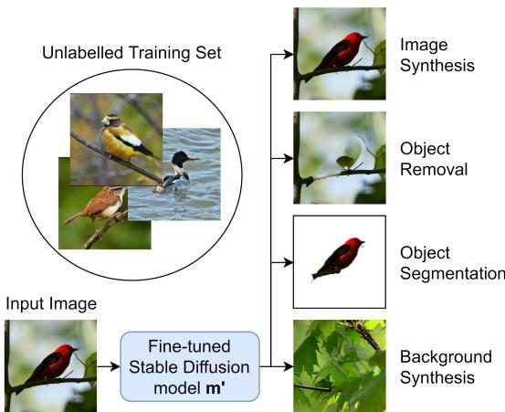  
Figure 1. High level overview of our proposed method: Without needing a single labelled image, our method is able to generate foreground, background, and segmentation masks for any concept that is known to a text-to-image generative network.

Diffusion models are based on the U-Net architecture [45] with additional attention layers [37] to condition on textual prompts. Therefore, we can extract inherently interpretable pixel importance scores from conditioning on textual prompts. Furthermore, the reverse diffusion process teaches the U-Net to successively remove noise from images, starting from pure Gaussian noise. In the early steps of this process, where the images resemble pure noise, the texture is non-existent, and the model only learns structures.

Recently, latent diffusion models have emerged as stateof-the-art generative models for the task of text-to-image generation [18, 44, 41]. However, training such models requires a significant amount of $\mathrm { C O _ { 2 } } \mathrm { - i n t e n s i v e }$ resources and until recently, pre-trained model weights have not been publicly available. Rombach et al. were the first to published their weights and model architecture [44], which facilitated the development of numerous derived applications [60, 15, 53] and established this model as the foundation model for tasks that require generalised representations of concepts in images. State-of-the-art latent diffusion models are able to generate high resolution images of a vast amount of different objects, suggesting that a highly expressive latent representation of the data has been learned.

We hypothesize that we can leverage these learned latent representations for our own downstream tasks of zeroshot foreground-background generation. Using a generative latent diffusion foundation model, we are able to extract a weak segmentation mask around an arbitrary object by computing the importance maps based on the textual input prompts. Weak segmentation masks have been shown to be an effective prior for segmentation models, given that enough training samples are available [34, 40]. We then use these preliminary masks to fine-tune a latent diffusion model on (1) generating new images from this dataset, as well as (2) inpainting regions where the object is not present according to our preliminary masks. The resulting model is able to perform full-image synthesis, as well as foreground, background and mask generation, as summarized in Fig. 1. A segmentation model trained using these masks can then achieve a level of performance that is close to direct supervision, despite not requiring manual segmentation masks at any point in the pipeline. This suggests that labour-intensive ground-truth image annotation workflows could become obsolete in the future, and be replaced by concept distillation from generative foundation models.

Our main contributions are:

• We propose a self-supervised, hyperparameter-free, approach for dataset-independent foregroundbackground segmentation, based on latent diffusion models, capable of synthesizing foreground, background, and segmentation masks.

• We describe a general framework to extract importance scores obtained from pretrained diffusion models and detail how to use them to improve segmentation performance.

• We verify the feasibility of our method on a set of four different foreground background segmentation tasks, spanning humans, birds, dogs, and cars and show that our method achieves results close to supervised methods while being trained without direct supervision.

• We experiment with the extension of our method to domain-adapted diffusion models by showing promising results on a medical segmentation task.

## 2. Related Work

Semantic Segmentation refers to the identification of high level concepts in an image, which enable their extraction from the image. [33, 36] introduced the use of fully convolutional networks for this task, which superseded previous shallow feature classification approaches [20]. Currently, the most common segmentation network architectures are designed as encoder-decoder pairs, as it enforces an information bottleneck that facilitates generalisation. The encoder provides meaningful low dimensional representations and the decoder reconstructs high-resolution segmentation maps [10, 45, 33, 36]. Recent approaches maximise the use of multi-scale information with multi-scale attention [56], squeeze-and-attention [63], and Transformers [62]. The final pixel classification operation, which creates the segmentation mask, is performed through multinomial logistic regression. These methods require large amounts of manually labelled training samples, which can be labour-intensive and expensive.

Weakly Supervised Semantic Segmentation partially mitigates that by learning from weak global labels, such as image-wise class labels, and perform rough semanticsegmentation tasks. These approaches often leverage the learned representations in intermediate layers through attention maps [26] or saliency maps [31] extraction. These representations are learned in a supervised manner through a classification task, as opposed to our approach that leverages an even weaker signal: free-form text-embeddings. Furthermore, these methods cannot generate images and are, therefore, not suitable for foreground-background synthesis.

Foreground background separation is a segmentation task where the goal is to apply binary classification over all the pixels of an image to separate the object of interest, the foreground, from the contextual background. For example, in video analysis tasks, the background is often defined as parts of scenes that are at rest [51]. More recently, decomposing individual images into potential foreground and background layers became an intriguing research topic [25]. Since the foreground-background separation factors are not known a priori, many related works formulate the problem as a category-agnostic unsupervised segmentation approach. While deep neural networks can learn pixel clustering in an unsupervised way [25, 29, 38], it often leads to inferior performance when compared to fully supervised methods. Other works also tried to learn image segmentation from generative models, for example via direct sampling from the training distribution with cut-and-paste [43], image combinations via styleGAN [1], erasing and redrawing [11], and through inpainting [49].

The work closest related to ours is [61] who employ layered generative adversarial networks (GANs) to generate distinct images for the foreground and background. As opposed to [61], we are not relying on the unknown structure of the latent manifold to separate the embedding codes that represent foreground and background, but instead follow the directly interpretable paradigm ‘textual concept description’ → ‘segmentation model’. Both approaches introduce a similar bias, ours through the textual concept description and them through object-specific models, making our method similarly conditioned but more flexible.

Diffusion models are generative methods. Generative modeling has always been an important task in deep learning. Recently, Diffusion models gained a lot of attention thanks to the impressive results achieved by [42, 48]. Based on [22, 55], these models currently define the state-of-the-art in conditional image generation, and have been extended towards text-to-image models such as unCLIP [41] and Stable Diffusion [44]. Part of that success is due to the efficacy of straightforward extensions to diffusion models, such as classifier-free guidance [23]. Current research about diffusion models focuses mostly on inpainting [14, 13, 44]. Depending on the task, it might be easier to learn the object itself and then train a diffusion model on the task of inpainting regions where the object is not present. However, we focus on the scenario where we have the object itself present and try to remove it.

Shortly after latent diffusion models showed superiority in terms of image sample quality compared to GANs [18], they were conditioned on the description of concepts [42]. These models became widely available online, including on commodity hardware after the computationally expensive denoising process was accelerated on a fundamental level [32]. Direct translation of text into object-centric representations has been attempted but rather in the context of attention editing [21], subject specific image generation [47], and textual concept-refined image-to-image translation [59]. Textual inversion, where examples of concepts are provided to a diffusion model as text and image tuples to teach the model a new concept [19], operates on the same fundamental input level as our approach. However, it is not able to provide object segmentation masks or conceptspecific pixel importance scores. Recent advances on diffusion models have led to a spike in research around how latent features can be extracted [21, 2] however, their potential to be used for zero-shot segmentation has yet to be explored.

## 3. Method

Our approach is summarized in Fig. 2. At a high level, we first use the attention maps from a pretrained latent diffusion model to compute coarse foreground segmentations (preliminary masks). We use these masks to fine-tune the diffusion model to be able to remove the object from the image, replacing it with background information, whilst also being able to generate new samples from the true distribution $p ( \mathbf { x } )$ of the dataset. By comparing the original images to those with the background inpainted over the foreground, we are then able to produce much more refined masks. We can also then use the fine-tuned model to sample an arbitrary number of new images, including only the foreground, only the background, and the masks separating them. The only assumptions this method uses is that we have access to a dataset of images where the chosen object is always present, and that the foundation model we use has learned a meaningful representation of the object we want to identify. In this context, objects can describe concepts like birds, cars, dogs, humans, but also parts of objects such as arms or legs.

We start from the latent diffusion model (LDM) [44], a foundation model pretrained on the task of text-to-image generation, denoted as m. It generates images by sampling gaussian noise and iteratively denoising them in $\dot { T }$ diffusion steps. Throughout this work, we keep the default value from [44] of $T = 5 0$ steps.

Let D denote a dataset where all the images contain our desired object. Formally, we aim to generate unsupervised segmentation masks of the original dataset $\mathbf { D _ { m } }$ as well as a synthetic dataset that contains synthetic images $\mathbf { D ^ { \prime } } _ { \mathrm { ~ i ~ } }$ , masks $\mathbf { D _ { m } ^ { \prime } } .$ , foreground $\mathbf { D _ { f } ^ { \prime } }$ , and background $\mathbf { D _ { b } ^ { \prime } }$ denoted as set $\mathbf { D _ { s } ^ { \prime } } = \{ \mathbf { D ^ { \prime } } , \mathbf { D _ { m } ^ { \prime } } , \mathbf { D _ { f } ^ { \prime } } , \mathbf { D _ { b } ^ { \prime } } \}$

Preliminary Masks: The LDM was trained on paired textimage data. Thus, the output is conditioned on a text input, which we have to carefully choose to generate our initial attention maps. In practice, self- and cross-attention work well for conditioning on different inputs, especially across different modalities [57]. As input, we propose the prompt “a photo of a $\{ o b j e c t \} ^ { \ast }$ where “object” is a high level description of our foreground object (e.g. “bird”).

The first step in computing the preliminary masks is to leverage the raw attention maps computed in every crossattention layer of the U-Net architecture. We decide against cherry-picking different attention layers for different tasks to remain task-agnostic, but would like to point out that this could lead to task-specific improvements as an hyperparameter option.

Let $z _ { \mathrm { 0 } }$ denote the latent space representation of some input image x. In each layer, attention is computed as:

$$
\mathrm { A t t e n t i o n } ( Q , K , V ) = \psi ( Q _ { l } , K _ { l } ^ { T } ) \cdot V _ { l }\tag{1}
$$

with the attention probabilities $\psi ( Q _ { l } , K _ { l } ^ { T } )$ defined as:

$$
\psi _ { { \bf z } _ { \bf t } , 1 } ( Q _ { l } , K _ { l } ^ { T } ) = \mathrm { s o f t m a x } ( \frac { Q K ^ { T } } { \sqrt { d } } )\tag{2}
$$

with $Q ~ = ~ W _ { Q } ^ { ( i , l ) } \cdot \phi ( \mathbf { z _ { t , l } } ) , ~ K ~ = ~ W _ { K } ^ { ( i , l ) } \cdot \tau _ { \theta } ( y )$ , and $V = W _ { V } ^ { ( i , l ) } \cdot \tau _ { \theta } ( y )$ denoting the learnable projection matrices according to [57], $\phi ( \mathbf { z _ { t , l } } )$ the latent code of the l-th U-Net layer in the t-th reverse diffusion step, and $\tau _ { \theta } ( y )$ the learned latent representation for the textual input prompt [44]. $z _ { t , l }$ denotes the latent representation of the stable diffusion model in layer l, conditioned at diffusion t.

The next step is to compute the mean attention maps $\hat { M }$ as expectations over multiple repeated diffusion steps according to

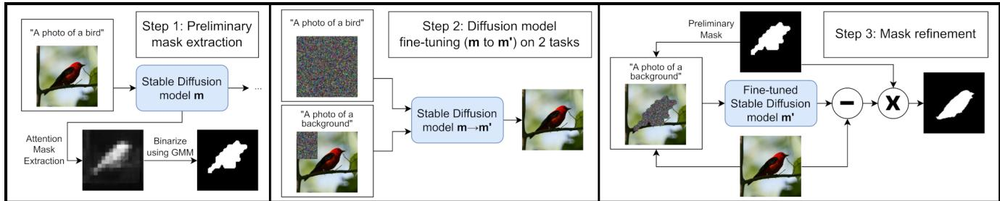  
Figure 2. Overview of our model pipeline for self-supervised foreground-background segmentation.

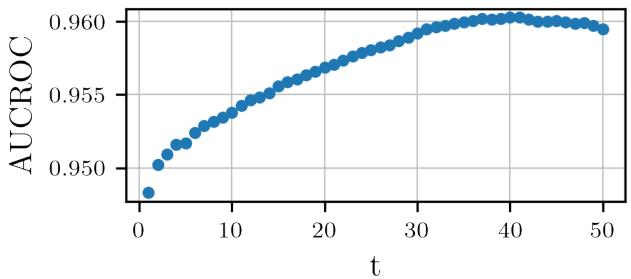  
Figure 3. $T _ { 0 }$ vs AUC-ROC on CUB. Incorporating more reverse diffusion steps into the attention computation improves the AUC-ROC against the groundtruth only up to roughly $T _ { 0 } = 4 0$

$$
\hat { M } = \sum _ { t = 1 } ^ { T _ { 0 } } \mathbb { E } _ { \mathbf { z } \sim p ( \mathbf { z _ { t } } \mid \mathbf { z _ { t + 1 } } , \mathbf { z _ { 0 } } ) } [ \sum _ { l } \psi _ { \mathbf { z _ { t , 1 } } } ( Q _ { l } , K _ { l } ^ { T } ) ] .\tag{3}
$$

We empirically show in our supplementary material that this can be simplified to performing single reverse diffusion steps which leads to a simplified importance score

$$
\hat { M } = \sum _ { t = 1 } ^ { T _ { 0 } } \sum _ { l } \psi _ { \mathbf { z _ { t , l } } } ( Q _ { l } , K _ { l } ^ { T } )\tag{4}
$$

Figure 3 shows AUCROC of using $\hat { M }$ to identify the foreground as a function of the number of reverse steps. There is a clear improvement visible computing the mean over up to roughly $T _ { 0 } = 4 0$ reverse diffusion steps. Including higher diffusion steps seems to deteriorate the accuracy of $\phi .$ This is because for higher values of t the input images approach pure Gaussian noise. However, for medium values of t the input and output images already approximate the basic structure of the final objects. Other details, like texture, appear at later stages but do not bear any valuable information for this use case. This observation could mean that for time critical applications, starting from lower t should suffice.

The third and final step in retrieving the preliminary masks is to binarize the mean attention maps. To do so, we take advantage of the observation that all attention maps resemble a bimodal distribution, with one mode at a low value for the non-object pixels and one mode at a high value for the object pixels. Hence, we model absolute values of the instance-wise attention scores as a bimodal Gaussian mixture model (GMM) to produce GMM masks. Additionally, we remove orphan pixels by computing the mean filter over the resulting binary classification map to produce our preliminary masks $M _ { p r e }$ . These preliminary masks could potentially already be used to detect objects as evaluated in Sec. 4.

Fine-tuning and Mask Refinement: The main problem with the preliminary masks is that, because they are derived from the latent space of the LDM, their resolution is only 64 $\times ~ 6 4$ . This limits them to being a coarse segmentation, which often overestimates the size of the object rather than following the object’s sharp edges. A rough segmentation is sufficient for tasks like inpainting, especially if the area around the object is homogeneous, but for the task of extracting the foreground object it produces unwanted artefacts. To work around this, we leverage the same diffusion model that we used to extract the masks. We use the binary classification prediction of the GMM mask $M _ { p r e }$ to select random rectangles within the image that only contain background. Then we fine-tune the model to inpaint only the background of these images by conditioning on the prompt $y _ { b } = ^ { 6 } \mathbf { \hat { a } }$ photo of a background” using the image as ground truth (See supplements for examples). Simultaneously, the model is fine-tuned on the task of full image synthesis to generate new samples for D by conditioning on $y _ { f } = { ^ { 6 } } \mathrm { { \ddot { a } } }$ photo of a {object}”.

To generate the final foreground masks $\mathbf { D _ { m } }$ we use the fine-tuned LDM $m ^ { \prime }$ to inpaint the background over the area covered by the preliminary mask conditioning on the background prompt. To identify the foreground region, we take the pixel-wise intensity difference between the backgroundinpainted and original images. As the inpainted images are conditioned to generate background, the difference is higher in the true foreground region. We apply a Gaussian mixture model to the pixel-wise difference map to create a binary classification map. Formally the refined masks M are computed as

$$
M = M _ { p r e , u p } \odot g ( | \mathbf { x } - m ^ { \prime } ( \tilde { \mathbf { z _ { 0 } } } , y _ { b } ) | ) ,
$$

$$
\tilde { \mathbf { z _ { 0 } } } = \mathbf { z _ { 0 } } \odot \left( 1 - M _ { p r e } \right) + \mathbf { z } \odot M _ { p r e }\tag{5}
$$

(6)

where $M _ { p r e , u p }$ denotes the preliminary mask upsampled to the input image’s resolution, g applies the bimodal Gaussian mixture model to the pixel values and $\tilde { \mathbf { z _ { 0 } } }$ is the latent code of an image with the foreground region replaced with random noise z. This produces refined masks, as the use of pixel-wise error improves the segmentation around the sharp edges of the object. Additionally, the computation of the refined masks is performed in pixel-space of the images instead of the latent space of m and therefore produces even more detailed masks.

Finally, to further improve our mask prediction we use the refined masks as labels to train a U-Net [45] to directly segment the foreground of the images, similar to the approach in [61], which follows a standardized approach of training a U-Net on a fixed number of steps and hence does not require any hyperparameter tuning. We experiment with training the segmentation network on refined masks of the original unlabelled training data $( \mathbf { D _ { s } } )$ , as well as training it with the fully synthetic dataset $\mathbf { D _ { s } ^ { \prime } }$ as an augmentation method, which we generate by prompting the fine-tuned model with the foreground conditioning $y _ { f }$ and repeating our pipeline of mask refinement on this synthetic dataset to get segmentation labels.

## 4. Evaluation and Results

Implementation: We use PyTorch 1.11 and run our experiments on a workstation with two A6000 Nvidia GPUs. Concept distillation training takes on average one day. The forward pass is fast, equivalent to that of a standard U-Net. Datasets: We choose our datasets such that they cover a variety of different objects, including in-the-wild animals and cars, as well as humans in static setups.

Human3.6m [24] is a dataset of 3.6 million images of humans in different scenarios and situations. To show that our method does not rely on large datasets we take a subset of 6000 randomly chosen images centred around the human and cropped to 256 × 256 pixels from the training dataset of Human3.6m.

To test the method on representations of animals, we use two datasets: the Stanford Dog Dataset [28], which contains 20,580 images of dogs divided into different categories, and the Caltech-UCSD Birds 200 (CUB) dataset [58], which contains 11,788 images of birds from 200 different species.

Finally, we also experiment with the detection of cars using [30], which consists of 16,185 images of cars in different natural and non-natural settings. All these datasets come with subcategories grouping the images based on selected features. For our use case, we consolidate these groups when prompting the model and use the classes cars, dogs, human, and birds to simulate the absence of manual labels.

<table><tr><td>Methods</td><td>ACC</td><td>CUB IoU</td><td>mIoU</td></tr><tr><td>Fully supervised U-Net</td><td>97.9</td><td>88.3</td><td>93.0</td></tr><tr><td>GrabCut [46] by [49] ReDO [11]</td><td>72.3 84.5</td><td>36.0 42.6</td><td>52.3</td></tr><tr><td>PerturbGAN [4] IEM + SegNet [49]</td><td>89.3</td><td>55.1</td><td>38.0 71.4</td></tr><tr><td>Melas-Kyriazi et al. [35] Layered GAN [61]</td><td>92.1 94.3</td><td>66.4 69.7</td><td>81.7</td></tr><tr><td>Ours (U-Net trained on  $\mathbf { D _ { s } } )$  Ours (U-Net trained on  $\mathbf { D _ { s } } \cup \mathbf { D _ { s } ^ { \prime } } )$ </td><td>95.2 95.6</td><td>75.1 77.2</td><td>84.8 86.0</td></tr></table>

Table 1. Comparison to other segmentation methods. Baselines taken from [61]. Details on the training of the U-Nets can be found in the appendix.

Self-supervised Segmentation Performance: Table 1 compares our methods performance against other unsupervised methods on the CUB dataset, showing the pixel-wise accuracy, the Intersection over Union (IoU) of the foreground segmentation and the mean IoU. From this we see that training a U-Net on our self-supervised labels produces a model that outperforms all other methods, achieving an overall foreground IoU improvement of 5.4 compared to [61]. Furthermore, by adding the fully synthetic dataset $\mathbf { D _ { s } ^ { \prime } }$ to the training data we are able to improve the performance even further, reaching a foreground IoU of 77.2. Table 3 also shows high foreground IoU values across the other datasets, with Fig. 4 showing qualitative examples.

Mean Attention Map Performance: Computing the mean attention maps Mˆ and comparing them to the ground-truth yields a remarkable AUC-ROC for the bird dataset of 97.1. Scores are normalized instance-wise to a range of 0 to 1. We also experiment with no normalization, which gives a slightly worse AUC-ROC of 97.08. Qualitative examples from all datasets are shown in Fig. 5, displaying the mean attention maps’ ability to localise the foreground in different scenarios. To compare this to our classification results we compute the threshold such that we reach over 95% true positive rate on a reserved training set of 100 images. True positive rate is more important in our case because we observe that falsely classifying pixels as background leads the inpainting model taking these foreground pixels as sources to inpaint larger parts of the image. We reach a pixel-wise accuracy of 86% on a set of 1000 test images suggesting that our method of extracting the classification masks already can provide meaningful results.

While these results are encouraging, they also require a ground-truth dataset and thresholding that we do not want to rely on. The results indicate that our computed masks are very good at locating the objects, albeit they do not reach state-of-the-art performance despite adding supervision. Training on refined masks and integrating synthetic data surpasses supervised results without using any labels as shown in the next section.

CUB  
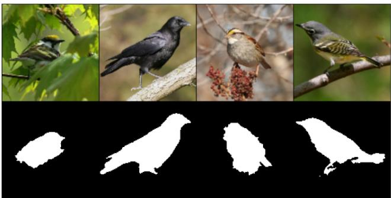  
Human3.6

Stanford Cars  
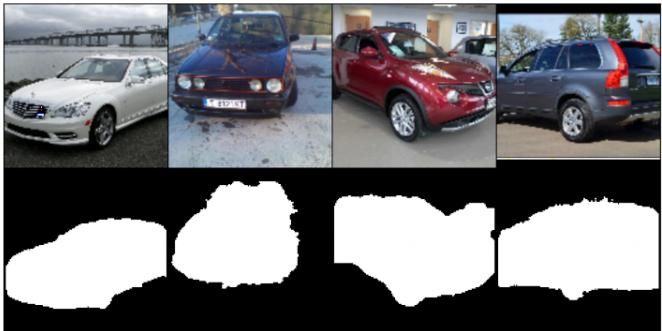

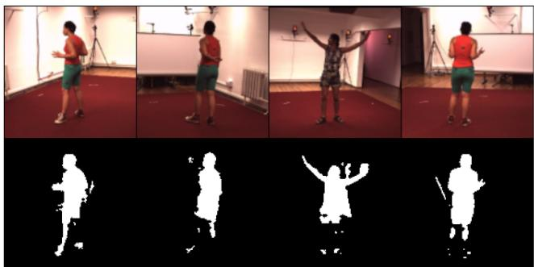

Stanford Dogs  
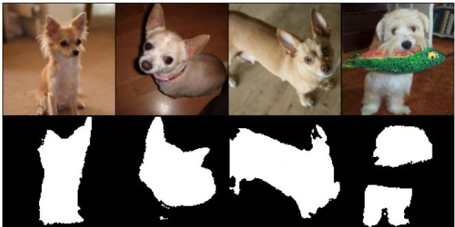  
Figure 4. Unsupervised Segmentation Masks generated by our proposed approach.

<table><tr><td>Methods</td><td>ACC</td><td>CUB IoU</td><td>mIoU</td></tr><tr><td>Preliminary Masks  $M _ { p r e }$ </td><td>83.5</td><td>29.0</td><td>55.7</td></tr><tr><td>Simple Inpainting  $M _ { c r o p }$ </td><td>90.0</td><td>30.7</td><td>60.0</td></tr><tr><td>U-Net trained on  $( \mathbf { D } , M _ { p r e } )$ </td><td>91.7</td><td>66.5</td><td>78.2</td></tr><tr><td>Refined Masks  $M$ </td><td>92.4</td><td>63.6</td><td>77.4</td></tr><tr><td>U-Net trained on  $\mathbf { D _ { s } }$ </td><td>95.2</td><td>75.1</td><td>84.8</td></tr><tr><td>U-Net trained on  $\mathbf { D _ { s } } \cup \mathbf { D _ { s } ^ { \prime } }$ </td><td>95.6</td><td>77.2</td><td>86.0</td></tr></table>

Table 2. Segmentation results for different steps of our pipeline.

Ablation study: Table 2 shows an ablation study for the individual components of our method. Initially, the zero-shot preliminary masks generated from the foundation model achieve good accuracy (83.5), but poor foreground IoU (29.0). This reflects our earlier intuition that masks overestimate the size of the object due to the maps being computed at a lower resolution. Thanks to this, the GMM overestimates the boundaries and spares the need for any hyperparameter. Optimizing the threshold to maximise the accuracy over a set of 100 training images would increase the accuracy to 93.9%, but requires a ground-truth dataset.

Training a U-Net on these labels $( M _ { p r e } )$ increases the

IoU to 66.5, showing the value in training the segmentation network. Using the refined masks as foreground segmentation gives comparable performance, with higher accuracy but lower foreground IoU. Additionally, we experiment with replacing the inpainting step used to improve $M _ { p r e }$ with a simpler approach that crops background areas and uses them as inpainting in Eq. (5) instead of $m ^ { \prime } .$ The resulting masks $M _ { c r o p }$ are worse than the masks from our proposed refinement step (For more details see supplements). However, training a U-Net on these refined masks produces the best results, being further boosted by incorporating additional synthetic data. The progressive refinement of the segmentation masks is shown in Fig. 6.

Data synthesis: Table 3 compares the generative ability of our fine-tuned diffusion model using the Frechet incep-´ tion distance (FID). Our method achieves higher generation quality than all other methods across the CUB, Stanford Dogs, and Stanford Cars datasets. We improve upon LayeredGAN’s remarkably low FID scores for CUB and Stanford Cars by 3.1 and 5.6 respectively.

Our method allows for the generation of samples covered entirely by the background, as shown in Fig. 7, without ever seeing such an image during training. The success of this component is what enables the refined masks to be generated, as accurately inpainting the foreground allows us to use the pixel-wise difference between the original and inpainted images to precisely identify the foreground.

Concept Distillation: Finally we can evaluate if our model has indeed learned to distinguish between foreground and background by looking at the output of different classifierfree guidance scales starting from the same seed $\mathbf { z _ { t } }$ . Since we have fine-tuned our model only on two distinct textual prompts the conditional image generation should have collapsed to two clusters, one for the object and the other one for the background. Hence, instead of performing classifier-free guidance using the predictions of $m ^ { \prime }$ conditioned on empty prompts we can directly use the predictions of $m ^ { \prime } ( { \bf z _ { t } } , y _ { b } )$ and $m ^ { \prime } ( \mathbf { z _ { t } } , y _ { f } )$ to perform image interpolation. We define classifier-free guidance in the direction of the foreground, hence, a higher score means that latent representations are pushed further in the direction of the object. The results are shown in Fig. 8. For negative guidance scales, the background is more detailed and there is no bird present. Increasing this scale leads to less detail in the background while birds often seem to naturally grow from the details in the background. The quality of the birds visually improves while the quality of the rest of the image keeps degrading resulting in less detailed backgrounds. We confirm this quantitatively by computing the FID for different classifier-free guidance scales. Without classifier-free guidance, i.e., scale = 1, the method reaches a FID of 9.8, at scale = 3 a FID of 11.3, and at scale = 7.5 a FID of 22.3.

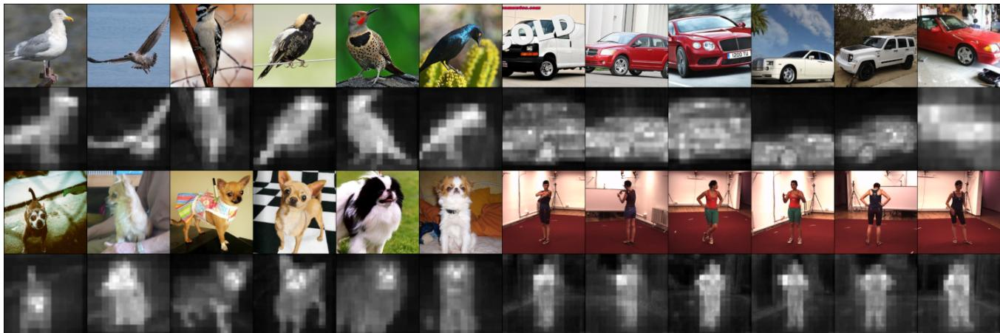  
Figure 5. Mean attention maps for all datasets in latent space z of the diffusion model. Prompts are “a photo of a $\mathrm { \ : \{ o b j e c t \} ^ { \flat } }$ , where {object} is replaced by “bird” for the first pair of rows, then “car”, “dog”, and “human”.

<table><tr><td>Methods</td><td>Sup.</td><td colspan="2">CUB</td><td colspan="2">Stanford Dogs</td><td colspan="2">Stanford Cars IoU ↑</td><td colspan="2">Human3.6m</td></tr><tr><td></td><td></td><td>FID↓</td><td>IoU↑</td><td>FID↓</td><td>IoU ↑</td><td>FID↓</td><td></td><td>FID↓</td><td>IoU ↑</td></tr><tr><td>FineGAN [54]</td><td>Weak</td><td>23.0</td><td>44.5</td><td>54.9</td><td>–</td><td>24.8</td><td>-</td><td>-</td><td></td></tr><tr><td>OneGAN [3]</td><td>Weak</td><td>20.5</td><td>55.5</td><td>48.7</td><td>-</td><td>24.2</td><td>-</td><td>I</td><td></td></tr><tr><td>LayeredGAN [61]</td><td>Unsup.</td><td>12.9</td><td>69.7</td><td>59.3</td><td>-</td><td>19.0</td><td>-</td><td>-</td><td></td></tr><tr><td>Ours</td><td>Self</td><td>9.8</td><td>75.1</td><td>43.1</td><td>63.8</td><td>13.4</td><td>55.2</td><td>63.7</td><td>69.2</td></tr></table>

Table 3. Quantitative Results on Ds. Training details are shown in the supplements. Values are taken from [61]. Source code for [54, 3, 61] was not available for re-evaluation on the Dogs, Cars and Human3.6m datasets. IoU on CUB are reported using the prediction of our model and the ground truth provided with the dataset. For the other datsets we use the IoU of the bounding boxes.

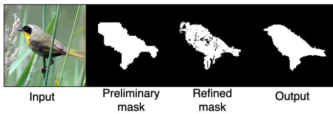  
Figure 6. Progressive refinement of the segmentation masks.

Medical Image Analysis: We want to evaluate if this approach can be applied to other domains, such as medical imaging. Since the LDM does not have any medical understanding, we first need to fine-tune it using MIMIC [27], which provides chest x-ray images paired with radiology reports. We can fine-tune the model using a similar approach as the one suggested by [8] (Details on the fine-tuning can be found in the supplements). Then we report the pixelwise AUC-ROC on MS-CXR [5], a subset of MIMIC with bounding box labels for diseases. Qualitative results can be seen in Fig. 9. The pixel-wise accuracy of the attention mask is already at 79.6% AUC-ROC across eight different diseases, however, the bimodal GMM assumption no longer holds in many cases because the model distinguishes three regions, namely: background, foreground, and the rest of the chest region.

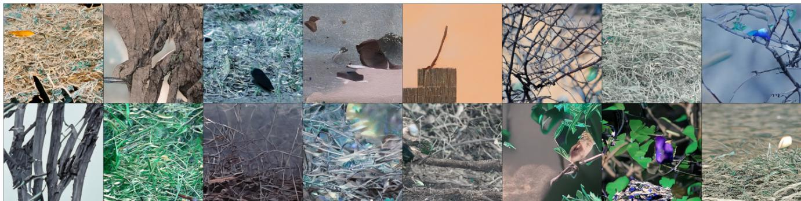  
Figure 7. Full background image synthesis from the fine-tuned model, conditioned on yb. Using our proposed fine-tuning method, the diffusion model is successfully able to generate images without birds from a dataset only consisting of images with birds.

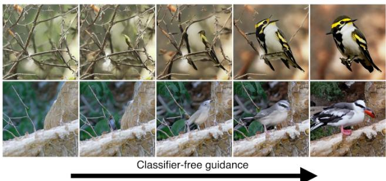  
Figure 8. Synthetic results of m′ with changing scales of classifierfree-guidance, ranging from -2 on the left to +7.5 on the right.

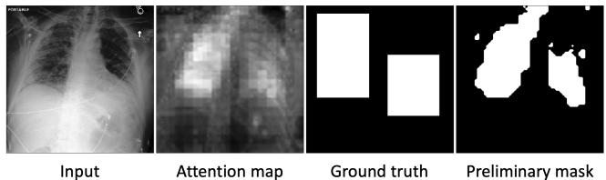  
Figure 9. Mˆ and $M _ { p r e }$ extraction on a medical task.

## 5. Discussion

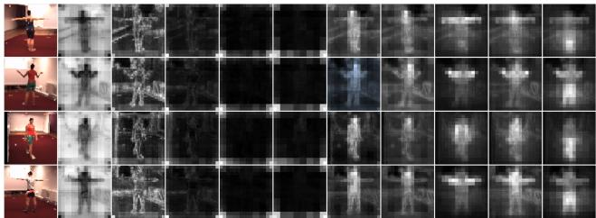  
Figure 10. Input image and mean attention maps for every word of the textual input prompt “startofstring a photo of a human with arms and legs”. The attention of “human” focuses on the torso, the one for the “arms” on the arms, and the one for the “legs” on the legs.

We show in Sec. 4 that our method to extract the segmentation masks M from the preliminary attention masks yields better results than computing an optimised threshold over a reserved miniset. This is possible because comparing to the inpainted background provides sharp edges around the object. However, our model is currently limited to detecting single object concepts. An extension to multiple objects could be achieved by prompt engineering in combination with data augmentation techniques. Taking the foreground masks and using them to extract objects would enable multiinstance and multi-object segmentation by layering multiple objects over each other and extending the final U-Net to a multi-label segmentation model.

Furthermore, learning from weak labels has the disadvantage that the segmentation model may learn and reproduce weaknesses of the initial method. In our case, the bimodal GMM fails if the image has more than two distinct contrast clusters. This is especially the case on the Human3.6m dataset where the floor, walls, and person have vastly different contrast-levels. Consequently, the final segmentation sometimes fails to detect the lower part of the body as shown in Fig. 4. However, our method could easily be adapted to only a part of the human body, such as the legs. We show this in Fig. 10, as by conditioning images from [24] on the prompt “A photo of a human with arms and legs” and computing Mˆ for the three concepts (human, arms, and legs) we are able to produce attention maps focused on specific body parts.

## 6. Conclusion

In this work, we have presented a generalizable framework to train segmentation networks without any hyperparameter tuning using an unsupervised zero-shot approach following the paradigm of ‘textual concept description‘ → ‘segmentation model‘. We leverage the power of large generative latent diffusion models and fine-tune the model on the task of generating foreground and background images, which can be used as data augmentation methods. We show, that this method can achieve results close to supervised methods, without requiring any manually generated ground truth labels. Our approach is amenable to supervised deep learning and can be combined with existing models to boost segmentation performance even further.

In future work we will explore how multi-object, multiinstance segmentation can be facilitated with concept distillation from generative image foundation models.

Acknowledgements: The authors gratefully acknowledge the scientific support and HPC resources provided by the Erlangen National High Performance Computing Center (NHR@FAU) of the Friedrich-Alexander-Universitat¨ Erlangen-Nurnberg (FAU) under the NHR projects b143dc¨ and b180dc. NHR funding is provided by federal and Bavarian state authorities. NHR@FAU hardware is partially funded by the German Research Foundation (DFG) – 440719683. Additional support was also received by the ERC - project MIA-NORMAL 101083647, DFG KA 5801/2-1, INST 90/1351-1 and by the state of Bavarian. H. Reynaud was supported by Ultromics Ltd. and the UKRI Centre or Doctoral Training in Artificial Intelligence for Healthcare (EP/S023283/1).

## References

[1] Rameen Abdal, Peihao Zhu, Niloy J Mitra, and Peter Wonka. Labels4free: Unsupervised segmentation using stylegan. In Proceedings of the IEEE/CVF International Conference on Computer Vision, pages 13970–13979, 2021.

[2] Dmitry Baranchuk, Andrey Voynov, Ivan Rubachev, Valentin Khrulkov, and Artem Babenko. Label-efficient semantic segmentation with diffusion models. In International Conference on Learning Representations, 2021.

[3] Yaniv Benny and Lior Wolf. Onegan: Simultaneous unsupervised learning of conditional image generation, foreground segmentation, and fine-grained clustering. In European Conference on Computer Vision, pages 514–530. Springer, 2020.

[4] Adam Bielski and Paolo Favaro. Emergence of object segmentation in perturbed generative models. Advances in Neural Information Processing Systems, 32, 2019.

[5] Benedikt Boecking, Naoto Usuyama, Shruthi Bannur, Daniel C Castro, Anton Schwaighofer, Stephanie Hyland, Maria Wetscherek, Tristan Naumann, Aditya Nori, Javier Alvarez-Valle, et al. Making the most of text semantics to improve biomedical vision–language processing. In Computer Vision–ECCV 2022: 17th European Conference, Tel Aviv, Israel, October 23–27, 2022, Proceedings, Part XXXVI, pages 1–21. Springer, 2022.

[6] Rishi Bommasani, Drew A Hudson, Ehsan Adeli, Russ Altman, Simran Arora, Sydney von Arx, Michael S Bernstein, Jeannette Bohg, Antoine Bosselut, Emma Brunskill, et al. On the opportunities and risks of foundation models. arXiv:2108.07258, 2021.

[7] Tom Brown, Benjamin Mann, Nick Ryder, Melanie Subbiah, Jared D Kaplan, Prafulla Dhariwal, Arvind Neelakantan, Pranav Shyam, Girish Sastry, Amanda Askell, et al. Language models are few-shot learners. Advances in neural information processing systems, 33:1877–1901, 2020.

[8] Pierre Chambon, Christian Bluethgen, Jean-Benoit Delbrouck, Rogier Van der Sluijs, Małgorzata Połacin, Juan Manuel Zambrano Chaves, Tanishq Mathew Abraham, Shivanshu Purohit, Curtis P Langlotz, and Akshay Chaudhari. Roentgen: Vision-language foundation model for chest x-ray generation. arXiv preprint arXiv:2211.12737, 2022.

[9] Soravit Changpinyo, Piyush Sharma, Nan Ding, and Radu Soricut. Conceptual 12m: Pushing web-scale image-text pretraining to recognize long-tail visual concepts. In CVPR’21, pages 3558–3568, 2021.

[10] Liang-Chieh Chen, George Papandreou, Iasonas Kokkinos, Kevin Murphy, and Alan L Yuille. Deeplab: Semantic image segmentation with deep convolutional nets, atrous convolution, and fully connected crfs. IEEE transactions on pattern analysis and machine intelligence, 40(4):834–848, 2017.

[11] Mickael Chen, Thierry Arti¨ eres, and Ludovic Denoyer. Un-\` supervised object segmentation by redrawing. Advances in neural information processing systems, 32, 2019.

[12] Jianpeng Cheng, Li Dong, and Mirella Lapata. Long shortterm memory-networks for machine reading. In Proceedings of the 2016 Conference on Empirical Methods in Natural Language Processing, pages 551–561, 2016.

[13] Hyungjin Chung, Byeongsu Sim, Dohoon Ryu, and Jong Chul Ye. Improving diffusion models for inverse problems using manifold constraints. arXiv preprint arXiv:2206.00941, 2022.

[14] Hyungjin Chung, Byeongsu Sim, and Jong Chul Ye. Come-closer-diffuse-faster: Accelerating conditional diffusion models for inverse problems through stochastic contraction. In Proceedings of the IEEE/CVF Conference on Computer Vision and Pattern Recognition, pages 12413–12422, 2022.

[15] Florinel-Alin Croitoru, Vlad Hondru, Radu Tudor Ionescu, and Mubarak Shah. Diffusion models in vision: A survey. arXiv preprint arXiv:2209.04747, 2022.

[16] Jia Deng, Wei Dong, Richard Socher, Li-Jia Li, Kai Li, and Li Fei-Fei. Imagenet: A large-scale hierarchical image database. In CVPR’09, pages 248–255. Ieee, 2009.

[17] Jacob Devlin, Ming-Wei Chang, Kenton Lee, and Kristina Toutanova. Bert: Pre-training of deep bidirectional transformers for language understanding. arXiv preprint arXiv:1810.04805, 2018.

[18] Prafulla Dhariwal and Alexander Nichol. Diffusion models beat gans on image synthesis. Advances in Neural Information Processing Systems, 34:8780–8794, 2021.

[19] Rinon Gal, Yuval Alaluf, Yuval Atzmon, Or Patashnik, Amit H Bermano, Gal Chechik, and Daniel Cohen-Or. An image is worth one word: Personalizing text-toimage generation using textual inversion. arXiv preprint arXiv:2208.01618, 2022.

[20] Carolina Galleguillos and Serge Belongie. Context based object categorization: A critical survey. Computer vision and image understanding, 114(6):712–722, 2010.

[21] Amir Hertz, Ron Mokady, Jay Tenenbaum, Kfir Aberman, Yael Pritch, and Daniel Cohen-Or. Prompt-to-prompt image editing with cross attention control. arXiv preprint arXiv:2208.01626, 2022.

[22] Jonathan Ho, Ajay Jain, and Pieter Abbeel. Denoising diffusion probabilistic models. Advances in Neural Information Processing Systems, 33:6840–6851, 2020.

[23] Jonathan Ho and Tim Salimans. Classifier-free diffusion guidance. arXiv preprint arXiv:2207.12598, 2022.

[24] Catalin Ionescu, Dragos Papava, Vlad Olaru, and Cristian Sminchisescu. Human3.6m: Large scale datasets and predictive methods for 3d human sensing in natural environments. IEEE Transactions on Pattern Analysis and Machine Intelligence, 36(7):1325–1339, jul 2014.

[25] Xu Ji, Joao F Henriques, and Andrea Vedaldi. Invariant information clustering for unsupervised image classification and segmentation. In Proceedings of the IEEE/CVF International Conference on Computer Vision, pages 9865–9874, 2019.

[26] Peng-Tao Jiang, Yuqi Yang, Qibin Hou, and Yunchao Wei. L2g: A simple local-to-global knowledge transfer framework for weakly supervised semantic segmentation. In Proceedings of the IEEE/CVF Conference on Computer Vision and Pattern Recognition (CVPR), pages 16886–16896, June 2022.

[27] Alistair EW Johnson, Tom J Pollard, Seth J Berkowitz, Nathaniel R Greenbaum, Matthew P Lungren, Chih-ying Deng, Roger G Mark, and Steven Horng. Mimic-cxr, a deidentified publicly available database of chest radiographs with free-text reports. Scientific data, 6(1):317, 2019.

[28] Aditya Khosla, Nityananda Jayadevaprakash, Bangpeng Yao, and Li Fei-Fei. Novel dataset for fine-grained image categorization. In First Workshop on Fine-Grained Visual Categorization, IEEE Conference on Computer Vision and Pattern Recognition, Colorado Springs, CO, June 2011.

[29] Wonjik Kim, Asako Kanezaki, and Masayuki Tanaka. Unsupervised learning of image segmentation based on differentiable feature clustering. IEEE Transactions on Image Processing, 29:8055–8068, 2020.

[30] Jonathan Krause, Michael Stark, Jia Deng, and Li Fei-Fei. 3d object representations for fine-grained categorization. In 4th International IEEE Workshop on 3D Representation and Recognition (3dRR-13), Sydney, Australia, 2013.

[31] Seungho Lee, Minhyun Lee, Jongwuk Lee, and Hyunjung Shim. Railroad is not a train: Saliency as pseudo-pixel supervision for weakly supervised semantic segmentation. In Proceedings of the IEEE/CVF conference on computer vision and pattern recognition, pages 5495–5505, 2021.

[32] Luping Liu, Yi Ren, Zhijie Lin, and Zhou Zhao. Pseudo numerical methods for diffusion models on manifolds. arXiv preprint arXiv:2202.09778, 2022.

[33] Jonathan Long, Evan Shelhamer, and Trevor Darrell. Fully convolutional networks for semantic segmentation. In Proceedings ofthe IEEE conference on computer vision andpattern recognition, pages 3431–3440, 2015.

[34] Zhiwu Lu, Zhenyong Fu, Tao Xiang, Peng Han, Liwei Wang, and Xin Gao. Learning from weak and noisy labels for semantic segmentation. IEEE transactions on pattern analysis and machine intelligence, 39(3):486–500, 2016.

[35] Luke Melas-Kyriazi, Christian Rupprecht, Iro Laina, and Andrea Vedaldi. Finding an unsupervised image segmenter

in each of your deep generative models. arXiv preprint arXiv:2105.08127, 2021.

[36] Hyeonwoo Noh, Seunghoon Hong, and Bohyung Han. Learning deconvolution network for semantic segmentation. In Proceedings ofthe IEEE international conference on computer vision, pages 1520–1528, 2015.

[37] Ozan Oktay, Jo Schlemper, Loic Le Folgoc, Matthew Lee, Mattias Heinrich, Kazunari Misawa, Kensaku Mori, Steven McDonagh, Nils Y Hammerla, Bernhard Kainz, et al. Attention u-net: Learning where to look for the pancreas. arXiv preprint arXiv:1804.03999, 2018.

[38] Yassine Ouali, Celine Hudelot, and Myriam Tami. Autore-´ gressive unsupervised image segmentation. In European Conference on Computer Vision, pages 142–158. Springer, 2020.

[39] Ankur Parikh, Oscar Tackstr ¨ om, Dipanjan Das, and Jakob¨ Uszkoreit. A decomposable attention model for natural language inference. In Proceedings of the 2016 Conference on Empirical Methods in Natural Language Processing, pages 2249–2255, Austin, Texas, Nov. 2016. Association for Computational Linguistics.

[40] Martin Rajchl, Matthew CH Lee, Ozan Oktay, Konstantinos Kamnitsas, Jonathan Passerat-Palmbach, Wenjia Bai, Mellisa Damodaram, Mary A Rutherford, Joseph V Hajnal, Bernhard Kainz, et al. Deepcut: Object segmentation from bounding box annotations using convolutional neural networks. IEEE transactions on medical imaging, 36(2):674– 683, 2016.

[41] Aditya Ramesh, Prafulla Dhariwal, Alex Nichol, Casey Chu, and Mark Chen. Hierarchical text-conditional image generation with clip latents. arXiv preprint arXiv:2204.06125, 2022.

[42] Aditya Ramesh, Mikhail Pavlov, Gabriel Goh, Scott Gray, Chelsea Voss, Alec Radford, Mark Chen, and Ilya Sutskever. Zero-shot text-to-image generation. In International Conference on Machine Learning, pages 8821–8831. PMLR, 2021.

[43] Tal Remez, Jonathan Huang, and Matthew Brown. Learning to segment via cut-and-paste. In Proceedings of the European conference on computer vision (ECCV), pages 37–52, 2018.

[44] Robin Rombach, Andreas Blattmann, Dominik Lorenz, Patrick Esser, and Bjorn Ommer. High-resolution image¨ synthesis with latent diffusion models. In Proceedings of the IEEE/CVF Conference on Computer Vision and Pattern Recognition, pages 10684–10695, 2022.

[45] Olaf Ronneberger, Philipp Fischer, and Thomas Brox. Unet: Convolutional networks for biomedical image segmentation. In International Conference on Medical image computing and computer-assisted intervention, pages 234–241. Springer, 2015.

[46] Carsten Rother, Vladimir Kolmogorov, and Andrew Blake. “grabcut” interactive foreground extraction using iterated graph cuts. ACM transactions on graphics (TOG), 23(3):309–314, 2004.

[47] Nataniel Ruiz, Yuanzhen Li, Varun Jampani, Yael Pritch, Michael Rubinstein, and Kfir Aberman. Dreambooth: Fine tuning text-to-image diffusion models for subject-driven generation. arXiv preprint arXiv:2208.12242, 2022.

[48] Chitwan Saharia, William Chan, Saurabh Saxena, Lala Li, Jay Whang, Emily Denton, Seyed Kamyar Seyed Ghasemipour, Burcu Karagol Ayan, S Sara Mahdavi, Rapha Gontijo Lopes, et al. Photorealistic text-to-image diffusion models with deep language understanding. arXiv preprint arXiv:2205.11487, 2022.

[49] Pedro Savarese, Sunnie SY Kim, Michael Maire, Greg Shakhnarovich, and David McAllester. Informationtheoretic segmentation by inpainting error maximization. In Proceedings of the IEEE/CVF Conference on Computer Vision and Pattern Recognition, pages 4029–4039, 2021.

[50] Jo Schlemper, Jose Caballero, Joseph V Hajnal, Anthony Price, and Daniel Rueckert. A deep cascade of convolutiona neural networks for mr image reconstruction. In IPMI’17, pages 647–658. Springer, 2017.

[51] Yaser Sheikh, Omar Javed, and Takeo Kanade. Background subtraction for freely moving cameras. In 2009 IEEE 12th International Conference on Computer Vision, pages 1219– 1225. IEEE, 2009.

[52] Karen Simonyan and Andrew Zisserman. Very deep convolutional networks for large-scale image recognition. arXiv:1409.1556, 2014.

[53] Uriel Singer, Adam Polyak, Thomas Hayes, Xi Yin, Jie An, Songyang Zhang, Qiyuan Hu, Harry Yang, Oron Ashual, Oran Gafni, et al. Make-a-video: Text-to-video generation without text-video data. arXiv preprint arXiv:2209.14792, 2022.

[54] Krishna Kumar Singh, Utkarsh Ojha, and Yong Jae Lee. Finegan: Unsupervised hierarchical disentanglement for fine-grained object generation and discovery. In Proceedings of the IEEE/CVF conference on computer vision and pattern recognition, pages 6490–6499, 2019.

[55] Jiaming Song, Chenlin Meng, and Stefano Ermon. Denoising diffusion implicit models. arXiv preprint arXiv:2010.02502, 2020.

[56] Andrew Tao, Karan Sapra, and Bryan Catanzaro. Hierarchical multi-scale attention for semantic segmentation. arXiv preprint arXiv:2005.10821, 2020.

[57] Ashish Vaswani, Noam Shazeer, Niki Parmar, Jakob Uszkoreit, Llion Jones, Aidan N Gomez, Łukasz Kaiser, and Illia Polosukhin. Attention is all you need. Advances in neural information processing systems, 30, 2017.

[58] C. Wah, S. Branson, P. Welinder, P. Perona, and S. Belongie. The caltech-ucsd birds-200-2011 dataset. Technical Report CNS-TR-2011-001, California Institute of Technology, 2011.

[59] Tengfei Wang, Ting Zhang, Bo Zhang, Hao Ouyang, Dong Chen, Qifeng Chen, and Fang Wen. Pretraining is all you need for image-to-image translation. arXiv preprint arXiv:2205.12952, 2022.

[60] Ling Yang, Zhilong Zhang, Yang Song, Shenda Hong, Runsheng Xu, Yue Zhao, Yingxia Shao, Wentao Zhang, Bin Cui, and Ming-Hsuan Yang. Diffusion models: A comprehensive survey of methods and applications. arXiv preprint arXiv:2209.00796, 2022.

[61] Yu Yang, Hakan Bilen, Qiran Zou, Wing Yin Cheung, and Xiangyang Ji. Learning foreground-background segmentation from improved layered gans. In Proceedings of the

IEEE/CVF Winter Conference on Applications of Computer Vision, pages 2524–2533, 2022.

[62] Yuhui Yuan, Xilin Chen, and Jingdong Wang. Objectcontextual representations for semantic segmentation. In European conference on computer vision, pages 173–190. Springer, 2020.

[63] Zilong Zhong, Zhong Qiu Lin, Rene Bidart, Xiaodan Hu, Ibrahim Ben Daya, Zhifeng Li, Wei-Shi Zheng, Jonathan Li, and Alexander Wong. Squeeze-and-attention networks for semantic segmentation. In Proceedings of the IEEE/CVF conference on computer vision and pattern recognition, pages 13065–13074, 2020.