# GPA-3D: Geometry-aware Prototype Alignment for Unsupervised Domain Adaptive 3D Object Detection from Point Clouds

Ziyu Li1\* Jingming Guo2 Tongtong Cao2 Liu Bingbing2 Wankou Yang1† 1 School of Automation, Southeast University 2 Huawei Noah’s Ark Lab

{liziyu, wkyang}@seu.edu.cn

{guojingming, caotongtong, liu.bingbing}@huawei.com

## Abstract

LiDAR-based 3D detection has made great progress in recent years. However, the performance of 3D detectors is considerably limited when deployed in unseen environments, owing to the severe domain gap problem. Existing domain adaptive 3D detection methods do not adequately consider the problem of the distributional discrepancy in feature space, thereby hindering generalization of detectors across domains. In this work, we propose a novel unsupervised domain adaptive 3D detection framework, namely Geometry-aware Prototype Alignment (GPA-3D), which explicitly leverages the intrinsic geometric relationship from point cloud objects to reduce the feature discrepancy, thus facilitating cross-domain transferring. Specifically, GPA-3D assigns a series of tailored and learnable prototypes to point cloud objects with distinct geometric structures. Each prototype aligns BEV (bird’s-eye-view) features derived from corresponding point cloud objects on source and target domains, reducing the distributional discrepancy and achieving better adaptation. The evaluation results obtained on various benchmarks, including Waymo, nuScenes and KITTI, demonstrate the superiority ofour GPA-3D over the state-of-the-art approachesfor different adaptation scenarios. The MindSpore version code will be publicly available at https://github.com/ Liz66666/GPA3D.

## 1. Introduction

As a fundamental research in 3D scene understanding, 3D detection from point clouds has attracted increasing attention due to its essential role in intelligent robotics, augmented reality and autonomous driving [7, 21, 18, 8, 1]. Despite significant process, state-of-the-art 3D detectors still suffer from dramatic performance degradation when training data and test data are from different environments, i.e., domain shift problem [33]. Various factors, such as diverse weather conditions, object sizes, laser beams, and scanning patterns, lead to substantial discrepancies across different domains, hindering the transferability of existing LiDAR-based 3D detectors. Intuitively, fine-tuning the detectors with adequate data from the target domain could alleviate this issue. However, manually annotating a large amount of point cloud scenes is a prohibitively expensive task. Therefore, the research on unsupervised domain adaptation (UDA) for LiDAR-based 3D detection is essential.

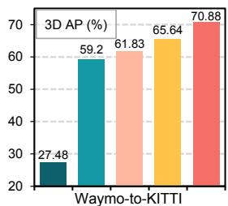

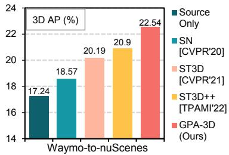  
Figure 1. The performance comparison with previous works [33, 36, 37]. The detection architecture is SECOND-IoU [34, 36].

Although many works have been proposed to deal with the UDA for image-based detection [42, 11, 24, 17, 10, 14, 13, 25, 3], directly applying these methods to 3D point cloud detection is insufficient for tackling the domain shifts. These approaches mainly concentrate on the gaps of lighting and texture variations, which could not be obtained from point clouds. While there is only a limited number of literature [33, 36, 26, 9, 39, 37, 20] dealing with the UDA on LiDAR-based 3D detection. Prior work [33] utilizes the statistics from target annotation to perform data-level normalization. MLC-Net [20] designs a mean-teacher framework to provide reliable pseudo-labels to facilitate transferring. ST3D [36] and ST3D++ [37] propose a self-training pipeline with a memory bank to collect and refine pseudolabels. Despite their great success, these methods do not adequately consider the problem of distributional discrepancy in feature space, hampering the adaptation performance.

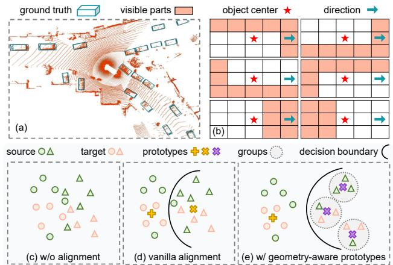  
Figure 2. (a) Point cloud scene on BEV (bird’s-eye-view). (b) Distinct geometric structures of point cloud objects. (c-e) Illustration of the distributional discrepancy. With explicit geometric constraints, the features from different domains are better aligned.

To reduce this discrepancy in 2D UDA task, some approaches utilize the class-wise prototypes align features from different domains [12, 31, 40, 19]. In these works, a universal prototype is employed to enforce high representational similarity among features belonging to the same category. However, in the case of 3D scenes, such as vehicles on the road, diverse locations and directions can result in distinct geometric structures, i.e., distributional patterns of point clouds, as presented in Fig. 2 (a) and (b). If a uniform prototype is applied to objects with completely different geometric structures, the efficacy of feature alignment might be hindered, as illustrated in Fig. 2 (c-d). We argue that adopting different prototypes to point cloud objects with distinct geometric structures could deal with the problem of distributional discrepancy, but more attention should also be paid to model these geometric structures during adaptation.

Based on the considerations, we propose a novel UDA framework for LiDAR-based 3D detectors, namely Geometry-aware Prototype Alignment (GPA-3D). Concretely, we first explore the potential relationships between the geometric structures of point cloud objects. During training, we randomly extract the BEV features of point clouds from both the source and target domains, and subsequently divide them into distinct groups based on their geometric structures. In this process, BEV features derived from point clouds with the similar geometric structures will be classified into the same group. Each group is then assigned a unique prototype, which enforces high representational similarity among the BEV features within that group, as illustrated in Fig. 2 (e). To this end, the soft contrast loss is devised to pull the intra-group feature-prototype pairs closer in the representational space and push the inter-group pairs farther away. Additionally, we develop the framework with two components, namely noise sample suppression (NSS) and instance replacement augmentation (IRA). NSS utilizes the similarities between foreground areas and the background prototype, to produce a mask for decreasing the impact of noise. IRA displaces pseudo-labels with high-quality samples that have similar geometric structures, enriching the diversity on the target domain.

The main contributions of this paper include:

• We propose a novel UDA framework for LiDARbased 3D detectors, namely Geometry-aware Prototype Alignment (GPA-3D). It explicitly integrates geometric associations into feature alignment, effectively decreasing the distributional discrepancy and facilitating the adaptation of existing point cloud detectors.

• Noise sample suppression and instance replacement augmentation are designed to enhance pseudo-labels in terms of reliability and versatility, respectively.

• We conduct comprehensive experiments on Waymo, nuScenes, and KITTI. The encouraging results demonstrate the GPA-3D outperforms state-of-the-art methods in various adaptation scenarios. More importantly, thanks to the architecture-agnostic design, GPA-3D is flexible to be applied to point cloud detectors.

## 2. Related Work

LiDAR-based 3D Detection. Mainstream point cloud detectors can be broadly divided into two categories: pointbased and grid-based. Point-based methods mainly adopt the architectures of PointNet [22] and PointNet++ [23] to extract features from raw point clouds. PointRCNN [28] designs an encoder-decoder backbone to learn the point wise representation. 3DSSD [38] improves the point sampling operator from the aspect of feature distance. IA-SSD [41] utilizes the instance-aware downsampling to preserve more foregrounds. On the other hand, grid-based methods first divide point clouds into fixed-size voxels, which are then processed via 2D/3D CNN. SECOND [34] adopts sparse 3D convolution for efficient feature learning. PointPillars [16] proposes a pillar encoding method and achieves a good trade-off between speed and performance. PV-RCNN [27] incorporates the voxel backbone with the keypoint branch to learn the representative scene features. Other approaches [35, 4, 30] project the point clouds into certain kinds of 2D views, and employ 2D CNN to extract the features. In this work, we conduct focused discussions with SECOND [34] and PointPillars [16] as base detectors. To demonstrate the generalization ability of our method, we also provide the comparisons with PV-RCNN [27] detector.

Domain Adaptive Object Detection. A large amount of literature has been presented in UDA for 2D-image detection, which can be roughly classified into two groups: distribution alignment and self-training. Alignment-based methods [3, 25] leverage the adversarial training [5] to learn aligned features across domains. Self-training approaches [13, 14] utilize a multi-phase strategy to generate pseudo-labels on unlabeled data. Besides, some works [10, 17, 24, 11] adopt the CycleGAN [42] to generate training samples with styles of source and target domains.

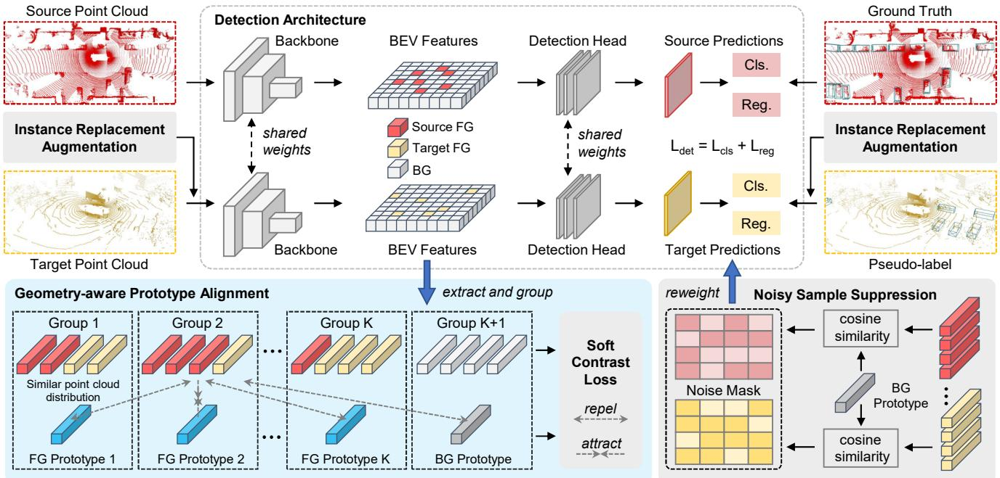  
Figure 3. Overview of our proposed GPA-3D framework. It adopts a basic co-training manner to adapt the 3D detector with the point clouds from source and target domains. The BEV features are processed via geometry-aware prototype alignment, which reduces the distributional discrepancy and enables the learning of general representation across domains. To this end, the soft contrast loss is devised for jointly optimizing the prototypes and network parameters. Besides, the noisy sample suppression is proposed to alleviate the impact of noisy samples during training, and instance replacement augmentation is designed to enhance the diversity on the target domain.

Similarly, several recent works also aim to address the domain bias for 3D point cloud detectors. Wang et al. [33] investigate the domain bias of popular autonomous driving 3D datasets, and propose to alleviate the gaps via three techniques, i.e., output transformation, statistical normalization and few shot. $\bar { \mathrm { S F - U D A } ^ { 3 D } }$ [26] adopts a mature 3D tracker to find the best scaling parameter, which is further used to re-scale the target point clouds for producing high-quality pseudo-labels. MLC-Net [20] designs a mean-teacher paradigm to provide pseudo-labels for facilitating smooth learning of the student model. ST3D [36] and ST3D++ [37] build a self-training pipeline to produce pseudo-labels for fine-tuning model and update pseudo-labels via memory bank. 3D-CoCo [39] devises the domain-specific encoders with a hard sample mining strategy to learn transferable representations. Compared with previous works, our method explicitly embraces the geometric relationship to reduce the distributional discrepancy during adaptation.

## 3. The Proposed Method

In the following, we present GPA-3D to mitigate the domain gap for LiDAR-based detectors. Fig. 3 illustrates the whole pipeline. Sec. 3.1 formulates the UDA task for point cloud detectors. Sec. 3.2 introduces the detection architecture in our method. In Sec. 3.3, we explain the details of the geometry-aware prototype alignment, followed by the soft contrast loss, which is discussed in Sec. 3.4. Finally, we present the noise sample suppression and instance replacement augmentation in Sec. 3.5 and Sec. 3.6, respectively.

## 3.1. Problem Statement

In this work, we focus on the problem of unsupervised domain adaptation on 3D detection. Concretely, given the labeled source domain point clouds $\mathbb { D } ^ { s } = \{ ( \grave { P } _ { i } ^ { s } , \mathbf { \bar { \it L } } _ { i } ^ { s } ) \} _ { i = 1 } ^ { N ^ { s } } ,$ as well as unlabeled target domain point clouds $\begin{array} { r l } { \mathbb { D } ^ { t } } & { { } = } \end{array}$ $\{ ( P _ { i } ^ { t } ) \} _ { i = 1 } ^ { N ^ { t } }$ , our goal is to train a 3D detector based on $\mathbb { D } ^ { s }$ and $\mathbb { D } ^ { t }$ and maximize its performance on $\mathbb { D } ^ { t }$ . Here, N is the total number of scenes, and $P _ { i }$ indicates the i-th point cloud scene, where each point has the 3-dim spatial coordinates and an extra intensity. The corresponding label $L _ { i }$ represents a series of 3D bounding boxes, each of them can be parameterized by the center location $( c _ { x } , c _ { y } , c _ { z } )$ , spatial dimension $( h , w , l )$ and rotation r. Note that the superscripts s and t stand for source and target domain respectively.

## 3.2. Detection Architecture

The input point cloud $P _ { i }$ is first sent to a backbone network with 3D sparse convolutions or 2D convolutions to extract the point cloud representation as following:

$$
F _ { i } = h _ { 1 } ( P _ { i } ; \theta _ { 1 } ) ,\tag{1}
$$

where $h _ { 1 }$ is the backbone with parameters $\theta _ { 1 }$ , and $\pmb { F } _ { i }$ indicates the BEV features. After that, a detection head $h _ { 2 }$ with parameters $\theta _ { 2 }$ produces the final output, formulated as:

$$
\{ b , s \} _ { i } = h _ { 2 } ( F _ { i } ; \theta _ { 2 } ) ,\tag{2}
$$

where b and s represent the predicted 3D boxes and scores respectively. A co-training paradigm is applied to progressively mitigate the domain shift. In each mini-batch, both the source point clouds $P _ { i } ^ { s }$ and target point clouds $P _ { i } ^ { t }$ are sent to the detector, and their outputs are supervised by the corresponding ground truth and pseudo-labels, respectively.

## 3.3. Geometry-aware Prototype Alignment

Extract. As mentioned in Sec. 3.2, for i-th point cloud scenario $P _ { i }$ from the source or target domain, LiDAR-based detector generates the BEV features $\pmb { F } _ { i } \in \mathbb { R } ^ { H \times W \times C }$ , where H, W, and $C$ denote the height, width and channel numbers of the feature map. We first project the corresponding ground truth $L _ { i } ^ { s }$ or pseudo-labels $\hat { L } _ { i } ^ { t }$ to the BEV feature map, and then randomly extract the equal-length sequences $\pmb { F } _ { i } ^ { \dag } \in \mathbb { R } ^ { M _ { i } \times C }$ and $\mathbf { \Psi } _ { \mathbf { \lambda } } ^ { H _ { i } ^ { - } } \in \mathbb { R } ^ { M _ { i } \times C }$ . Here, $M _ { i }$ is the length of the feature sequence, $F _ { i } ^ { + }$ and ${ \mathbf { } } F _ { i } ^ { - }$ represent the foreground and background features from BEV, respectively.

Group. For the extracted foreground features $F _ { i } ^ { + }$ , we further divide them into different groups according to their geometric structures on point clouds. Specifically, for $j \mathrm { - t h }$ foreground $F _ { i , j } ^ { + }$ in the sequence $( j \in [ 1 , M _ { i } ] )$ , we compute its offset angle $\mathcal { \overline { { \theta } } } _ { i , j } ^ { \mathrm { o f f } }$ as follows:

$$
\theta _ { i , j } ^ { \mathrm { o f f } } = \theta _ { i , j } ^ { \mathrm { o b s } } - r _ { i , j } ,\tag{3}
$$

where $r _ { i , j }$ is the direction, $\theta _ { i , j } ^ { \mathrm { { o b s } } }$ is the observation angle, as presented in Fig. 4 (left). Note that the direction $r _ { i , j }$ is provided from the labels $L _ { i } ^ { s }$ and $\hat { L } _ { i } ^ { t }$ , while the observation angle $\theta _ { i , j } ^ { \mathrm { { o b s } } }$ can be computed according to the central position of 3D bounding box. Next, all foreground features are split into $K$ groups, and the group index $Q _ { i , j }$ is formulated as:

$$
Q _ { i , j } = \lfloor n o r m ( \theta _ { i , j } ^ { \mathrm { o f f } } ) / \delta \rfloor + 1 ,\tag{4}
$$

where norm(·) is a normalization function that converting the input angles into [0, 2π], and $\delta = 2 \pi / K$ is the interval of angles between groups. In this way, the foreground features with similar offset angles $\theta _ { i , j } ^ { \mathrm { o f f } }$ are assigned into the same group, where their geometric structures are very similar, as demonstrated in Fig. 4 (right). Additionally, the extracted backgrounds $F _ { i , j } ^ { - }$ are sent into an individual group, thus totally $K + 1$ groups are built.

Prototype Construction. At the beginning of training, we randomly initialize a series of learnable prototypes $\mathcal { G } =$ $\{ g _ { k } \} _ { k = 1 } ^ { K + 1 } \ \in \ \mathbb { R } ^ { ( K + 1 ) \times C }$ . During training, we extract the BEV features $\mathbf { \mathcal { F } } _ { i }$ from both source and target domains, and split them into corresponding groups via Eq. 4. In kth group, the foreground features $F _ { i , j } ^ { + }$ are enforced to be aligned with the foreground prototype $g _ { k ( k \in [ 1 , K ] ) }$ . Similarly, the background features $F _ { i , j } ^ { - }$ in the last group are aligned with the background prototype $g _ { K + 1 }$

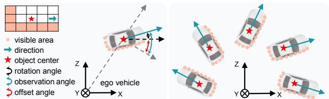  
Figure 4. Left: Demonstration of the offset angle. Right: Objects with same offset angle share similar geometric structures.

## 3.4. Soft Contrast Loss

Given a point cloud $P _ { i }$ , our goal is to align its fore/background features $F _ { i } ^ { + }$ and ${ \bf F } _ { i } ^ { - }$ with the corresponding prototypes in $\mathcal { G } .$

Intra-group Attract. For the foreground features $F _ { i } ^ { + }$ we pull them closer with the corresponding prototype in G, which can be formulated as:

$$
\mathcal { L } _ { a t t } ^ { + } = \sum _ { k = 1 } ^ { K } \sum _ { i = 1 } ^ { N } \sum _ { j = 1 } ^ { M _ { i } } ( 1 - s i m ( F _ { i , j } ^ { + } , g _ { k } ) ) \mathbb { 1 } [ Q _ { i , j } = k ] ,\tag{5}
$$

where sim $\begin{array} { c c } { \displaystyle { \mathrm { \bf \Pi } _ { \langle { \bf a } , { \bf b } \rangle } } } & { = } & { \frac { { \bf a } \cdot { \bf b } } { | | { \bf a } | | \mathrm { \bf \Pi } | | { \bf b } | | } } \end{array}$ is the cosine similarity, $\mathbb { 1 } [ Q _ { i , j } ~ = ~ k ]$ is an indicator function that equals to 1 if $Q _ { i , j } = I$ k and 0 otherwise. Similarly, the background features ${ \bf F } _ { i } ^ { - }$ are also required to be pulled to the background prototype $\mathbf { \pm } \mathbf { \delta } \mathbf { \times } \mathbf { + } \mathbf { 1 }$ , which can be calculated as:

$$
\mathcal { L } _ { a t t } ^ { - } = \sum _ { i = 1 } ^ { N } \sum _ { j = 1 } ^ { M _ { i } } ( 1 - s i m ( F _ { i , j } ^ { - } , \pmb { g } _ { K + 1 } ) ) .\tag{6}
$$

Inter-group Repel. To enhance the discriminative capacity, we need to push the features away from all prototypes belonging to other groups. For example, the distances between background features $F _ { i } ^ { - }$ and all foreground prototypes are minimized via:

$$
\mathcal { L } _ { r e p } ^ { - } = \sum _ { k = 1 } ^ { K } \sum _ { i = 1 } ^ { N } \sum _ { j = 1 } ^ { M _ { i } } m a x ( 0 , s i m ( \pmb { F } _ { i , j } ^ { - } , \pmb { g } _ { k } ) ) .\tag{7}
$$

For foreground features within adjacent groups, their corresponding geometric structures are relatively more similar. Repelling these features away is not very necessary, and might even make the training process unstable. Hence, we adopt a more relaxed constraints as follows:

$$
\begin{array} { l } { { \mathcal { L } _ { \mathit { r e p } } ^ { + _ { a d j } } = \displaystyle \sum _ { i = 1 } ^ { N } \sum _ { j = 1 } ^ { M _ { i } } \sum _ { k \in A _ { i , j } } m a x ( 0 , s i m ( F _ { i , j } ^ { + } , { g } _ { k } ) - m ) , } } \\ { { \mathcal { L } _ { \mathit { r e p } } ^ { + _ { o t h e r } } = \displaystyle \sum _ { i = 1 } ^ { N } \sum _ { j = 1 } ^ { M _ { i } } \sum _ { k \notin A _ { i , j } , k \neq Q _ { i , j } } m a x ( 0 , s i m ( F _ { i , j } ^ { + } , { g } _ { k } ) ) , } } \end{array}\tag{8)(8}
$$

where m indicates the margin which is set to 0.5 in our experiments, $A _ { i , j }$ is the index of the groups adjacent to $Q _ { i , j }$

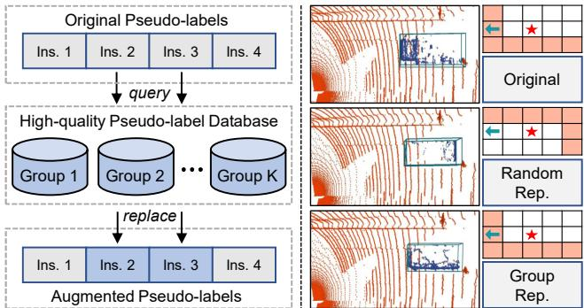  
Figure 5. Illustration of instance replacement augmentation (IRA). Left: IRA leverages a group mechanism to displace the original instances with high-quality candidates. Right: Compared with random replacing, our group mechanism does not interfere the spatial context of the point cloud scene.

i.e., $A _ { i , j } = Q _ { i , j } \pm 1$ . The overall soft contrast loss Lcontra can be formulated as:

$$
\mathcal { L } _ { c o n t r a } = \mathcal { L } _ { a t t } ^ { + } + \mathcal { L } _ { a t t } ^ { - } + \beta _ { 1 } \mathcal { L } _ { r e p } ^ { + _ { a d j } } + \beta _ { 2 } \mathcal { L } _ { r e p } ^ { + _ { o t h e r } } + \beta _ { 3 } \mathcal { L } _ { r e p } ^ { - } ,\tag{9}
$$

where $\beta _ { 1 } , \beta _ { 2 }$ and $\beta _ { 3 }$ are the balance coefficients.

## 3.5. Noise Sample Suppression

The pseudo-labels used on the target domain are noisy and can lead to the accumulation of errors. To mitigate the impact of noise, we propose the noise sample suppression (NSS) approach, which generates a noise mask to suppress the magnitude of the gradient descent for the foreground areas that might be underlying noise. The noise mask can be represented as $S ~ \in ~ \{ \bar { \alpha } , 1 . 0 \} ^ { H \times W }$ , where α $( \alpha < 1 . 0 )$ is the suppression factor to decrease the contribution of low-quality samples. In S, the foreground areas that have high similarities with the background prototype, i.e., sim $( F _ { i , i } ^ { + } , { \pmb g } _ { K + 1 } ) > 0 . 3$ , are assigned to α, while rest foreground and background areas are assigned to 1.0.

During training, the noise mask S is multiplied to the co-training loss $\mathcal { L } _ { c o - t r a i n }$ , elaborated in Sec. 3.7. With the progress of training, prototypes will be optimized with better representative capability, which enables NSS to suppress the noise more reliably and facilitate the training procedure.

## 3.6. Instance Replacement Augmentation

Those uncertain pseudo-labels (with scores of 0.2 ∼ 0.5) are usually ignored in training. Despite inaccurate, they might provide partial localization information. To this end, we devise the instance replacement augmentation (IRA) module. As shown in Fig. 5 (left), we first pick the pseudolabels with scores over 0.5 to construct a high-quality database, which utilizes the group mechanism as Eq. 4 to divide the picked instances into groups belonging to different geometric structures. During training, we calculate the group indexes for the uncertain pseudo-labels, and replace them with instances having same group indexes from the database. In this procedure, a parameter $p _ { I R A }$ is adopted to regulate the probability of the replacement operation.

Algorithm 1: The learning procedure of GPA-3D   
input : labeled source domain Ds, unlabeled target domain Dt,   
3D detector θ, total epochs T, steps per epoch N, and   
list of update epochs U   
output: adapted 3D detector θt   
1 Pre-train the network $\pmb { \theta } ^ { s }  \mathbb { D } ^ { s }$ according to Eq. (10);   
2 Initialize $\theta  \theta ^ { s } ;$   
3 Generate pseudo-labels and database $( \hat { L } ^ { t } , \hat { D } ^ { t } ) \gets ( \pmb { \theta } , \mathbb { D } ^ { t } ) ;$   
4 for epoch ← 1 to T do   
5 for step ← 1 to N do   
6 Sample mini-batches $( \beta ^ { s } , \beta ^ { t } )  ( { \mathbb D } ^ { s } , { \mathbb D } ^ { t } ) ;$   
7 Instance replacement $\beta _ { \mathrm { a u g } } ^ { t }  \mathrm { I R A } ( \beta ^ { t } , \hat { D } ^ { t } ) ;$   
8 update $\pmb { \theta } \gets ( \beta ^ { s } , \beta _ { \mathrm { a u g } } ^ { t } )$ according to Eq. (12);   
9 if epoch ∈ U then   
10 Update pseudo-labels $\hat { L } ^ { t }  ( \pmb { \theta } , \mathbb { D } ^ { t } ) ;$   
11 θt ← θ;

There are two main merits of IRA. First, the quantity of target data is maintained and the diversity is also enhanced. Second, benefiting from the group mechanism, the spatial contexts around the replaced instances are unchanged and no ambiguous or unreasonable case is introduced, as devised in Fig. 5 (right).

## 3.7. Overall Training Procedure

The overall training procedure of GPA-3D is illustrated in Alg. 1. Following previous works [36, 37], the 3D detector is first trained on the labeled source domain $\mathbb { D } ^ { s }$ via minimizing the detection loss $\mathcal { L } _ { d e t } ^ { s }$ as:

$$
\begin{array} { r } { \mathcal { L } _ { d e t } ^ { s } = \mathcal { L } _ { r e g } ^ { s } + \mathcal { L } _ { c l s } ^ { s } , } \end{array}\tag{10}
$$

where the $\mathcal { L } _ { r e g } ^ { s }$ and $\mathcal { L } _ { c l s } ^ { s }$ indicate the regression and classification errors respectively. Next, we use the pre-trained detector to generate pseudo-labels $\hat { L } _ { i } ^ { t }$ and the database of IRA on the unlabeled target domain $\mathbb { D } ^ { t }$ . Finally, the co-training paradigm is employed to further fine-tune the model as:

$$
\mathcal { L } _ { c o - t r a i n } = \mathcal { L } _ { d e t } ^ { s } + \mathcal { L } _ { d e t } ^ { t } ,\tag{11}
$$

where $\mathcal { L } _ { d e t } ^ { t }$ is the detection loss on target data, same as in Eq. 10. The overall adaptation loss $\mathcal { L } _ { a d a p t }$ is calculated via:

$$
\mathcal { L } _ { a d a p t } = \beta \cdot \mathcal { L } _ { c o n t r a } + S \cdot \mathcal { L } _ { c o - t r a i n } ,\tag{12}
$$

where $\beta$ is the total weight of the soft contrast loss, and S is the noise mask of NSS. For more details of the training procedure, please refer to the supplements.

## 4. Experiments

## 4.1. Experimental Setup

Datasets. We evaluate the GPA-3D on widely used autonomous driving benchmarks including Waymo [29], nuScenes [2], and KITTI [6]. These datasets exhibit significant diversities in foreground patterns and LiDAR beams, which can lead to severe domain bias when transferring 3D detectors from one dataset to another. Detailed information about datasets is available in the supplementary material.

Table 1. Comparison with the state-of-the-art methods on the Waymo → KITTI adaptation scenario, with BEV and 3D average precisions of 40 recall positions. In addition, we also report the Closed Gap from ST3D[36], which is defined as $\frac { \mathrm { A P } _ { \mathrm { m o d e l } } - \mathrm { A P } _ { \mathrm { s o u r c e } } } { \mathrm { A P } _ { \mathrm { o r a c l e } } - \mathrm { A P } _ { \mathrm { s o u r c e } } } \times 1 0 0 \%$ . For fair comparison, the results with the detector of SECOND-IoU are obtained from the original paper of $\mathrm { S T 3 D + + } \stackrel { \mathrm { o n a x } } { [ 3 7 ] } .$ , while the performances with PointPillars are cited from 3D-CoCo [39]. The best result is indicated by bold.
<table><tr><td rowspan="2">Methods</td><td colspan="4">SECOND-IoU</td><td colspan="4">PointPillars</td></tr><tr><td> $\mathbf { A P _ { B E V } }$ </td><td>Closed Gap</td><td> $\bf { A P 3 D }$ </td><td>Closed Gap</td><td> $\mathbf { A P _ { B E V } }$ </td><td>Closed Gap</td><td> $\bf { A P 3 D }$ </td><td>Closed Gap</td></tr><tr><td>Source Only</td><td>67.64</td><td></td><td>27.48</td><td></td><td>47.8</td><td>–</td><td>11.5</td><td></td></tr><tr><td>SN [33]</td><td>78.96</td><td>+72.33%</td><td>59.20</td><td>+69.00%</td><td>27.4</td><td>-55.14%</td><td>6.4</td><td>-8.49%</td></tr><tr><td>UMT [9]</td><td>77.79</td><td>+64.86%</td><td>64.56</td><td>+80.66%</td><td></td><td></td><td></td><td></td></tr><tr><td>3D-CoCo [39]</td><td></td><td></td><td></td><td></td><td>76.1</td><td>+76.49%</td><td>42.9</td><td>+52.25%</td></tr><tr><td>ST3D [36]</td><td>82.19</td><td>+92.97%</td><td>61.83</td><td>+74.72%</td><td>58.1</td><td>+27.84%</td><td>23.2</td><td>+19.47%</td></tr><tr><td>ST3D++ [37]</td><td>80.78</td><td>+83.96%</td><td>65.64</td><td>+83.01%</td><td></td><td></td><td></td><td></td></tr><tr><td>GPA-3D (ours)</td><td>83.79</td><td>+103.19%</td><td>70.88</td><td>+94.41%</td><td>77.29</td><td>+79.70%</td><td>50.84</td><td>+65.46%</td></tr><tr><td>Improvement</td><td>+1.6</td><td>+10.22%</td><td>+5.24</td><td>+11.4%</td><td>+1.19</td><td>+3.21%</td><td>+7.94</td><td>+13.21%</td></tr><tr><td>Oracle</td><td>83.29</td><td></td><td>73.45</td><td></td><td>84.8</td><td></td><td>71.6</td><td></td></tr></table>

Table 2. Adaptation performance on the Waymo → nuScenes in comparison with different base detectors and state-of-the-art approaches.
<table><tr><td rowspan="2">Methods</td><td colspan="4">SECOND-IoU</td><td colspan="4">PointPillars</td></tr><tr><td> $\mathbf { A P _ { B E V } }$ </td><td>Closed Gap</td><td> $\bf { A P 3 D }$ </td><td>Closed Gap</td><td> $\mathbf { A P _ { B E V } }$ </td><td>Closed Gap</td><td> $\bf { A P 3 D }$ </td><td>Closed Gap</td></tr><tr><td>Source Only</td><td>32.91</td><td></td><td>17.24</td><td></td><td>27.8</td><td></td><td>12.1</td><td></td></tr><tr><td>SN [33]</td><td>33.23</td><td>+1.69%</td><td>18.57</td><td>+7.54%</td><td>28.31</td><td>+2.41%</td><td>12.98</td><td>+4.58%</td></tr><tr><td>UMT [9]</td><td>35.10</td><td>+11.54%</td><td>21.05</td><td>+21.61%</td><td></td><td></td><td></td><td></td></tr><tr><td>3D-CoCo [39]</td><td></td><td></td><td></td><td></td><td>33.1</td><td>+25.00%</td><td>20.7</td><td>+44.79%</td></tr><tr><td>ST3D [36]</td><td>35.92</td><td>+15.87%</td><td>20.19</td><td>+16.73%</td><td>30.6</td><td>+13.21%</td><td>15.6</td><td>+18.23%</td></tr><tr><td>ST3D++ [37]</td><td>35.73</td><td>+14.87%</td><td>20.90</td><td>+20.76%</td><td></td><td></td><td></td><td></td></tr><tr><td>GPA-3D (ours)</td><td>37.25</td><td>+22.88%</td><td>22.54</td><td>+30.06%</td><td>35.47</td><td>+36.18%</td><td>21.01</td><td>+46.41%</td></tr><tr><td>Improvement</td><td>+1.33</td><td>+7.01%</td><td>+1.49</td><td>+8.45%</td><td>+2.37</td><td>+11.18%</td><td>+0.31</td><td>+1.62%</td></tr><tr><td>Oracle</td><td>51.88</td><td></td><td>34.87</td><td></td><td>49.0</td><td></td><td>31.3</td><td></td></tr></table>

plements for more implementation details.

Implementation Details. We verify the GPA-3D with two popular LiDAR-based detectors, namely SECOND-IoU [36] and PointPillars [16]. All the parameter settings for network architecture are set the same with Open-PCDet [32] and ST3D [36]. We perform all experiments using 8 NVIDIA V100 GPU cards. For the pre-training step, the model is trained for 30 epochs using the ADAM [15] optimizer and the total batch size of 32 on the source domain. Next, we utilize the pre-trained model to generate pseudolabels on the target domain with a score threshold of 0.2. Note that instances with scores over 0.5 are retained and subsequently utilized to establish the high-quality pseudolabel database for IRA. Finally, we further fine-tune the model with our proposed approach for 30 epochs. To avoid local minima, we employ the cosine annealing strategy to adjust the learning rate, which was set to 0.003 for pretraining and 0.0015 for fine-tuning. Please refer to the sup-

Compared Methods. As shown in Tab. 2, GPA-3D is first compared with the Source Only method, which trains the model on the source domain and evaluates it on the target domain without any adaptation. Next, 5 existing works are included in the comparison, namely, SN [33], UMT [9], 3D-CoCo [39], ST3D [36], and ST3D++ [37]. SN utilizes the statistics from target annotations to normalize the foreground objects on the source domain. UMT employs a mean-teacher framework to filter inaccurate pseudo-labels. 3D-CoCo learns the instance-level transferable features for better generalization. ST3D and ST3D++ adopt a memory bank to produce high-quality pseudo-labels. Additionally, we also compare GPA-3D with the Oracle method, which trains the model on the labeled target data, serving as an upper bound for performance.

## 4.2. Comparison with State-of-the-art Methods

Waymo → KITTI Adaptation. To validate the effectiveness to the domain shift about object size, we conduct a comprehensive comparison on Waymo → KITTI. As demonstrated in Tab. 1, with the 3D detector SECOND-IoU, our proposed GPA-3D outperforms ST3D++ [37] with a large margin, and significant performance gains are obtained compared with previous best results, $i . e . .$ , 5.24% of $\mathrm { A P } _ { 3 \mathrm { D } }$ and 1.6% of $\mathsf { A P } _ { \mathrm { B E V } }$ . Note that the $\mathsf { A P } _ { \mathrm { B E V } }$ of GPA-3D is also higher than Oracle method, indicating the effectiveness of incorporating the geometric structure information into UDA on 3D detection task. Even switching the base detector to PointPillars, our method still exceeds previous SOTA 3D-CoCo [39] by 7.94% and 1.19% in terms of $\mathrm { A P } _ { 3 \mathrm { D } }$ and $\mathsf { A P } _ { \mathrm { B E V } }$ , respectively.

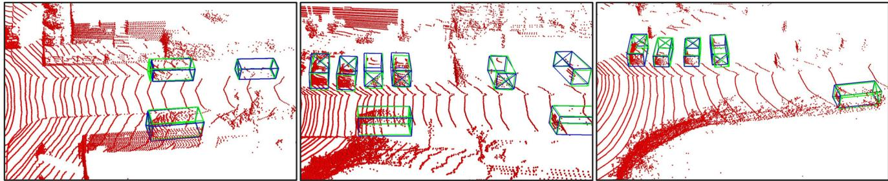  
Figure 6. Qualitative results of GPA-3D on Waymo → KITTI. For each box, we use the X to specify the orientation. The predicted results and ground truths are painted in blue and green, respectively.

Table 3. Component ablation studies in GPA-3D. Proto indicates the geometry-aware prototype alignment. Soft is the soft contrast loss. NSS means the noise sample filtering. IRA represents the instance replacement augmentation.
<table><tr><td>Setting</td><td>Proto</td><td>Soft</td><td>NSS</td><td>IRA</td><td> $\mathbf { A P _ { B E V } }$ </td><td> $\mathbf { A P 3 D }$ </td></tr><tr><td>(a)</td><td></td><td></td><td></td><td></td><td>77.87</td><td>60.36</td></tr><tr><td>(b)</td><td>√</td><td></td><td></td><td></td><td>80.49</td><td>66.28</td></tr><tr><td>(c)</td><td>√</td><td>√</td><td></td><td></td><td>80.51</td><td>67.34</td></tr><tr><td>(d)</td><td>√</td><td>√</td><td>」</td><td></td><td>83.07</td><td>69.45</td></tr><tr><td>(e)</td><td>√</td><td>√</td><td></td><td>√</td><td>81.94</td><td>67.79</td></tr><tr><td>(f)</td><td></td><td>V</td><td></td><td></td><td>83.79</td><td>70.88</td></tr></table>

Waymo → nuScenes Adaptation. For the domain gap of LiDAR beams, we select Waymo → nuScenes as representatives due to their different LiDAR sensors, i.e., 64- beam vs 32-beam. As shown in Tab. 2, GPA-3D improves the adaptation performances to 37.25% $\mathsf { A P } _ { \mathrm { B E V } }$ and 22.54% $\mathrm { A P } _ { 3 \mathrm { D } }$ with the SECOND-IoU detector, surpassing previous SOTA methods. Compared with ST3D++ [37], 1.52% and 1.64% gains separately in terms of $\mathsf { A P } _ { \mathrm { B E V } }$ and $\mathsf { A P } _ { 3 \mathrm { D } }$ are achieved. Based on PointPillars, our approach exceeds the best method 3D-CoCo [39] by 2.37% in $\mathsf { A P } _ { \mathrm { B E V } }$ , and outperforms ST3D [36] with 4.87% and 5.41% respectively in terms of $\mathsf { A P } _ { \mathrm { B E V } }$ and $\mathrm { A P } _ { 3 \mathrm { D } }$ . These improvements demonstrate the advancement of our GPA-3D to mitigate the more challenging domain shift of cross-beam scenarios.

## 4.3. Ablation Studies

All ablation studies are conducted on Waymo → KITTI with SECOND-IoU as the base detector.

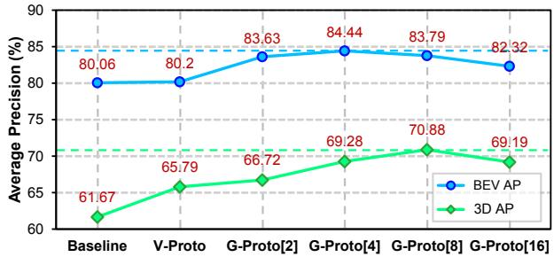  
Figure 7. Ablations on the geometry-aware prototype alignment. Baseline is the co-training method without any feature alignment. V-Proto refers to the vanilla alignment with a pair of fore/background prototypes. G-Proto[n] indicates that n prototypes are employed in GPA-3D.

Component Analysis in GPA-3D. We assess the effectiveness of each component in GPA-3D, as presented in Tab. 3. Baseline (a) represents self-training via pseudolabels on the target domain. The application of geometryaware prototype alignment provides 5.92% and 2.62% gains separately in terms of $\mathsf { A P } _ { 3 \mathrm { D } }$ and $\mathsf { A P } _ { \mathrm { B E V } }$ , and the soft contrast loss brings an improvement of 1.06% on $\mathrm { A P } _ { 3 \mathrm { D } }$ . The improvements demonstrate that incorporating the geometric relationship into domain adaptation is feasible and effective. In addition, NSS and IRA boost the performance by around 2.5% and 1.5% respectively, which indicates the efficacy of enhancing the quality of supervision on target data.

## Effectiveness of Geometry-aware Prototype Alignment.

We further investigate the effects of the geometry-aware prototype alignment. As illustrated in Fig. 7, the vanilla alignment with one pair of fore/background prototypes performs better than the co-training baseline, implying that the misalignment of features distribution affects the performance. Applying two prototypes yields 3.57% and 5.05% gains of $\mathsf { A P } _ { \mathrm { B E V } }$ and $\mathrm { A P } _ { 3 \mathrm { D } }$ respectively, compared to the co-training baseline. The performance reaches to the peak of 84.44% $\mathsf { A P } _ { \mathrm { B E V } }$ when 4 foreground prototypes are employed, indicating the advancement of combining geometric information with feature alignment. However, we observe minor performance degradation when too many prototypes are used, which we attribute to redundant prototypes leading to indistinguishable features in the representational space.

Table 4. Ablations on noise sample suppression. The symbols -T/- S denote that NSS is applied solely on the target/source domain, while -TS performs NSS on both target and source domains. -TSH additionally adopts a hard truncated factor, $i . e . , \alpha = 0 .$
<table><tr><td>Methods</td><td>Filter Domain</td><td>α</td><td> $\mathbf { A P _ { B E V } }$ </td><td> $\mathbf { A P _ { 3 D } }$ </td></tr><tr><td>GPA-3D (w/o NSS)</td><td></td><td>=</td><td>81.94</td><td>67.79</td></tr><tr><td>GPA-3D (w/ NSS-T)</td><td>Target</td><td>0.5</td><td>83.37</td><td>68.24</td></tr><tr><td>GPA-3D (w/ NSS-S)</td><td>Source</td><td>0.5</td><td>82.33</td><td>67.93</td></tr><tr><td>GPA-3D (w/ NSS-TS)</td><td>Target + Source</td><td>0.5</td><td>83.45</td><td>69.77</td></tr><tr><td>GPA-3D (w/ NSS-TSH)</td><td>Target + Source</td><td>0.0</td><td>83.79</td><td>70.88</td></tr></table>

Table 5. Effects of the instance replacement augmentation. RandRep discards the group mechanism in IRA.
<table><tr><td>Method</td><td>w/o IRA</td><td>RandRep</td><td>w/ IRA</td></tr><tr><td> $\bf { A P _ { B E V } } / \bf { A P _ { 3 D } }$ </td><td>83.07 / 69.45</td><td>82.99 / 69.59</td><td>83.79 / 70.88</td></tr></table>

Table 6. Comparison with different adaptation frameworks. Source refers to the Source Only method. Self-T. is the selftraining framework. Co-T. symbolizes the co-training pipeline. Mean T. represents the mean teacher paradigm.
<table><tr><td>Framework</td><td>Source</td><td>Self-T.</td><td>Co-T.</td><td>Mean T.</td><td>GPA-3D</td></tr><tr><td> $\bf { A P _ { B E V } } / \bf { A P _ { 3 D } }$ </td><td>67.64 / 27.48</td><td>77.87 / 60.36</td><td>80.06 / 61.67</td><td>80.01 / 64.62</td><td>83.79 / 70.88</td></tr></table>

Effectiveness of Noise Sample Suppression. We conduct ablations on the noise sample filter (NSS) with various settings. As shown in Tab. 4, the detection performance drops to 67.79% $\mathrm { A P } _ { 3 \mathrm { D } }$ , when we remove the NSS from GPA-3D. Only applying the NSS on target domain achieves the gains of 1.43% and 0.45% on $\mathsf { A P } _ { \mathrm { B E V } }$ and $\mathrm { A P } _ { 3 \mathrm { D } } ,$ respectively. We could see that using NSS on the source domain could also bring improvements. We think this is due to the fact that NSS suppresses those source samples with only a few points, which are very similar to the background noise. When the hard truncated α is adopted, $\mathrm { A P } _ { 3 \mathrm { D } }$ is further improved to 70.88%, indicating the effectiveness of NSS.

Effectiveness of Instance Replacement Augmentation. Also, we compare different policies in instance replacement augmentation (IRA). We can see from Tab. 5 that our proposed IRA attains 0.72% and 1.43% gains in terms of $\mathsf { A P } _ { \mathrm { B E V } }$ and $\mathrm { A P } _ { 3 \mathrm { D } }$ , respectively. Without the group mechanism in IRA, i.e., randomly replacing pseudo-labels with instances the database, only marginal gains are obtained in $\mathrm { A P } _ { 3 \mathrm { D } }$ , and even degradation in $\mathsf { A P } _ { \mathrm { B E V } }$ . This highlights the significance of maintaining the consistency between instances and their contextual environments.

Domain Adaptation Frameworks. We compare our proposed GPA-3D with several adaptation frameworks, as presented in Tab. 6. The results confirm the effectiveness of GPA-3D, which leverages the geometric association to transfer 3D detectors across different domains. Fig. 8 further illustrates that, despite all models fluctuate at early epochs, our GPA-3D steadily and consistently enhances the detection performance in later training stages.

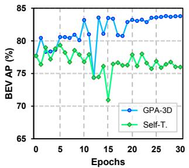

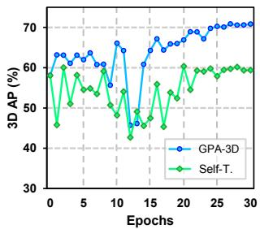  
Figure 8. Comparisons of self-training baseline and our GPA-3D.

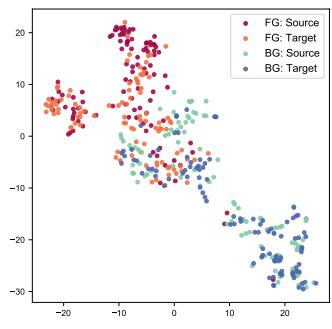

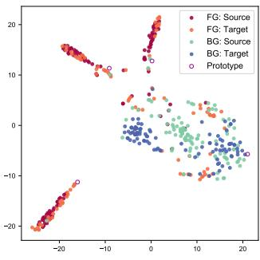  
(a) Source only  
(b) Our method  
Figure 9. The t-SNE visualization of BEV features. The feature points are obtained by SECOND-IoU on Waymo → nuScenes.

Visualization. We exhibit some qualitative results of cross-domain adaptation in Fig. 6. Additionally, in Fig. 9, we visualize the distribution of BEV features. It is obvious that GPA-3D aggregates foreground samples into different prototypes, and separates them from the backgrounds. Further visualizations can be found in the supplements.

## 5. Conclusion

This paper presents a novel framework for unsupervised domain adaptive 3D detection. Our proposed GPA-3D leverages the underlying geometric relationship to reduce the distributional discrepancy in the feature space, thus mitigating the domain shift problems. Comprehensive experiments demonstrate that our method is effective and can be easily incorporated into mainstream LiDAR-based 3D detectors. For future work, we plan to extend GPA-3D to support multi-modal 3D detectors. This requires a more efficient alignment mechanism to process feature streams from both point clouds and images.

## Acknowledgement

This work was supported by the National Natural Science Foundation of China under No.62276061 and 62006041.

## References

[1] Eduardo Arnold, Omar Y Al-Jarrah, Mehrdad Dianati, Saber Fallah, David Oxtoby, and Alex Mouzakitis. A survey on 3D object detection methods for autonomous driving applications. TITS, 20(10):3782–3795, 2019. 1

[2] Holger Caesar, Varun Bankiti, Alex H Lang, Sourabh Vora, Venice Erin Liong, Qiang Xu, Anush Krishnan, Yu Pan, Giancarlo Baldan, and Oscar Beijbom. nuscenes: A multimodal dataset for autonomous driving. In CVPR, pages 11621–11631, 2020. 5

[3] Yuhua Chen, Wen Li, Christos Sakaridis, Dengxin Dai, and Luc Van Gool. Domain adaptive faster r-cnn for object detection in the wild. In CVPR, pages 3339–3348, 2018. 1, 3

[4] Lue Fan, Xuan Xiong, Feng Wang, Naiyan Wang, and Zhaoxiang Zhang. Rangedet: In defense of range view for lidar-based 3D object detection. In ICCV, pages 2918–2927, 2021. 2

[5] Yaroslav Ganin, Evgeniya Ustinova, Hana Ajakan, Pascal Germain, Hugo Larochelle, Franc¸ois Laviolette, Mario Marchand, and Victor Lempitsky. Domain-adversarial training of neural networks. JMLR, 17(1):2096–2030, 2016. 3

[6] Andreas Geiger, Philip Lenz, and Raquel Urtasun. Are we ready for autonomous driving? the kitti vision benchmark suite. In CVPR, pages 3354–3361, 2012. 5

[7] Yulan Guo, Hanyun Wang, Qingyong Hu, Hao Liu, Li Liu, and Mohammed Bennamoun. Deep learning for 3D point clouds: A survey. TPAMI, 43(12):4338–4364, 2020. 1

[8] Yulan Guo, Hanyun Wang, Qingyong Hu, Hao Liu, Li Liu, and Mohammed Bennamoun. Deep learning for 3D point clouds: A survey. TPAMI, 2020. 1

[9] Deepti Hegde, Vishwanath Sindagi, Velat Kilic, A Brinton Cooper, Mark Foster, and Vishal Patel. Uncertainty-aware mean teacher for source-free unsupervised domain adaptive 3D object detection. arXiv preprint arXiv:2109.14651, 2021. 1, 6

[10] Han-Kai Hsu, Chun-Han Yao, Yi-Hsuan Tsai, Wei-Chih Hung, Hung-Yu Tseng, Maneesh Singh, and Ming-Hsuan Yang. Progressive domain adaptation for object detection. In WCCV, pages 749–757, 2020. 1, 3

[11] Sheng-Wei Huang, Che-Tsung Lin, Shu-Ping Chen, Yen-Yi Wu, Po-Hao Hsu, and Shang-Hong Lai. Auggan: Cross domain adaptation with gan-based data augmentation. In ECCV, pages 718–731, 2018. 1, 3

[12] Zhengkai Jiang, Yuxi Li, Ceyuan Yang, Peng Gao, Yabiao Wang, Ying Tai, and Chengjie Wang. Prototypical contrast adaptation for domain adaptive semantic segmentation. In ECCV, pages 36–54. Springer, 2022. 2

[13] Mehran Khodabandeh, Arash Vahdat, Mani Ranjbar, and William G Macready. A robust learning approach to domain adaptive object detection. In ICCV, pages 480–490, 2019. 1, 3

[14] Seunghyeon Kim, Jaehoon Choi, Taekyung Kim, and Changick Kim. Self-training and adversarial background regularization for unsupervised domain adaptive one-stage object detection. In ICCV, pages 6092–6101, 2019. 1, 3

[15] Diederik P Kingma and Jimmy Ba. Adam: A method for stochastic optimization. arXiv preprint arXiv:1412.6980, 2014. 6

[16] Alex H Lang, Sourabh Vora, Holger Caesar, Lubing Zhou, Jiong Yang, and Oscar Beijbom. Pointpillars: Fast encoders for object detection from point clouds. In CVPR, pages 12697–12705, 2019. 2, 6

[17] Guofa Li, Zefeng Ji, and Xingda Qu. Stepwise domain adap tation (sda) for object detection in autonomous vehicles using an adaptive centernet. TITS, 2022. 1, 3

[18] Ying Li, Lingfei Ma, Zilong Zhong, Fei Liu, Michael A Chapman, Dongpu Cao, and Jonathan Li. Deep learning for lidar point clouds in autonomous driving: a review. TNLLS, 2020. 1

[19] Hongbin Lin, Yifan Zhang, Zhen Qiu, Shuaicheng Niu, Chuang Gan, Yanxia Liu, and Mingkui Tan. Prototypeguided continual adaptation for class-incremental unsupervised domain adaptation. In ECCV, pages 351–368. Springer, 2022. 2

[20] Zhipeng Luo, Zhongang Cai, Changqing Zhou, Gongjie Zhang, Haiyu Zhao, Shuai Yi, Shijian Lu, Hongsheng Li, Shanghang Zhang, and Ziwei Liu. Unsupervised domain adaptive 3D detection with multi-level consistency. In ICCV, pages 8866–8875, 2021. 1, 3

[21] Jiageng Mao, Shaoshuai Shi, Xiaogang Wang, and Hongsheng Li. 3D object detection for autonomous driving: a review and new outlooks. arXiv preprint arXiv:2206.09474, 2022. 1

[22] Charles R Qi, Hao Su, Kaichun Mo, and Leonidas J Guibas. Pointnet: Deep learning on point sets for 3D classification and segmentation. In CVPR, pages 652–660, 2017. 2

[23] Charles Ruizhongtai Qi, Li Yi, Hao Su, and Leonidas J Guibas. Pointnet++: Deep hierarchical feature learning on point sets in a metric space. In NIPS, pages 5099–5108, 2017. 2

[24] Adrian Lopez Rodriguez and Krystian Mikolajczyk. Domain adaptation for object detection via style consistency. arXiv preprint arXiv:1911.10033, 2019. 1, 3

[25] Kuniaki Saito, Yoshitaka Ushiku, Tatsuya Harada, and Kate Saenko. Strong-weak distribution alignment for adaptive object detection. In CVPR, pages 6956–6965, 2019. 1, 3

[26] Cristiano Saltori, Stephane Lathuili ´ ere, Nicu Sebe, Elisa\` Ricci, and Fabio Galasso. Sf-uda 3D: Source-free unsupervised domain adaptation for lidar-based 3D object detection. In 3DV, pages 771–780, 2020. 1, 3

[27] Shaoshuai Shi, Chaoxu Guo, Li Jiang, Zhe Wang, Jianping Shi, Xiaogang Wang, and Hongsheng Li. Pv-rcnn: Pointvoxel feature set abstraction for 3D object detection. In CVPR, pages 10529–10538, 2020. 2

[28] Shaoshuai Shi, Xiaogang Wang, and Hongsheng Li. Pointrcnn: 3D object proposal generation and detection from point cloud. In CVPR, pages 770–779, 2019. 2

[29] Pei Sun, Henrik Kretzschmar, Xerxes Dotiwalla, Aurelien Chouard, Vijaysai Patnaik, Paul Tsui, James Guo, Yin Zhou, Yuning Chai, Benjamin Caine, et al. Scalability in perception for autonomous driving: Waymo open dataset. In CVPR, pages 2446–2454, 2020. 5

[30] Pei Sun, Weiyue Wang, Yuning Chai, Gamaleldin Elsayed, Alex Bewley, Xiao Zhang, Cristian Sminchisescu, and Dragomir Anguelov. Rsn: Range sparse net for efficient, accurate lidar 3D object detection. In CVPR, pages 5725– 5734, 2021. 2

[31] Korawat Tanwisuth, Xinjie Fan, Huangjie Zheng, Shujian Zhang, Hao Zhang, Bo Chen, and Mingyuan Zhou. A prototype-oriented framework for unsupervised domain adaptation. Advances in Neural Information Processing Systems, 34:17194–17208, 2021. 2

[32] OpenPCDet Development Team. Openpcdet: An opensource toolbox for 3D object detection from point clouds. https://github.com/open-mmlab/OpenPCDet, 2020. 6

[33] Yan Wang, Xiangyu Chen, Yurong You, Li Erran Li, Bharath Hariharan, Mark Campbell, Kilian Q Weinberger, and Wei-Lun Chao. Train in germany, test in the usa: Making 3D object detectors generalize. In CVPR, pages 11713–11723, 2020. 1, 3, 6

[34] Yan Yan, Yuxing Mao, and Bo Li. Second: Sparsely embedded convolutional detection. Sensors, 18(10):3337, 2018. 1, 2

[35] Bin Yang, Wenjie Luo, and Raquel Urtasun. Pixor: Realtime 3D object detection from point clouds. In CVPR, pages 7652–7660, 2018. 2

[36] Jihan Yang, Shaoshuai Shi, Zhe Wang, Hongsheng Li, and Xiaojuan Qi. St3d: Self-training for unsupervised domain adaptation on 3D object detection. In CVPR, pages 10368– 10378, 2021. 1, 3, 5, 6, 7

[37] Jihan Yang, Shaoshuai Shi, Zhe Wang, Hongsheng Li, and Xiaojuan Qi. St3d++: Denoised self-training for unsupervised domain adaptation on 3D object detection. TPAMI, 2022. 1, 3, 5, 6, 7

[38] Zetong Yang, Yanan Sun, Shu Liu, and Jiaya Jia. 3dssd: Point-based 3D single stage object detector. In CVPR, pages 11040–11048, 2020. 2

[39] Zeng Yihan, Chunwei Wang, Yunbo Wang, Hang Xu, Chaoqiang Ye, Zhen Yang, and Chao Ma. Learning transferable features for point cloud detection via 3D contrastive cotraining. NIPS, 34:21493–21504, 2021. 1, 3, 6, 7

[40] Jinze Yu, Jiaming Liu, Xiaobao Wei, Haoyi Zhou, Yohei Nakata, Denis Gudovskiy, Tomoyuki Okuno, Jianxin Li, Kurt Keutzer, and Shanghang Zhang. Cross-domain object detection with mean-teacher transformer. In ECCV, 2022. 2

[41] Yifan Zhang, Qingyong Hu, Guoquan Xu, Yanxin Ma, Jianwei Wan, and Yulan Guo. Not all points are equal: Learning highly efficient point-based detectors for 3D lidar point clouds. In CVPR, pages 18953–18962, 2022. 2

[42] Jun-Yan Zhu, Taesung Park, Phillip Isola, and Alexei A Efros. Unpaired image-to-image translation using cycleconsistent adversarial networks. In ICCV, pages 2223–2232, 2017. 1, 3