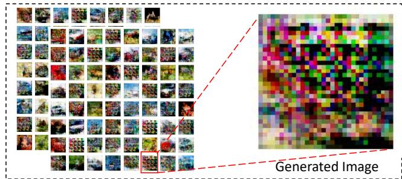
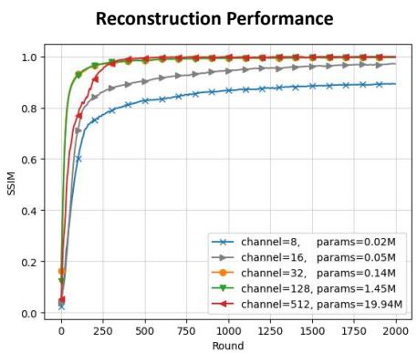
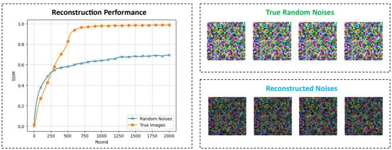
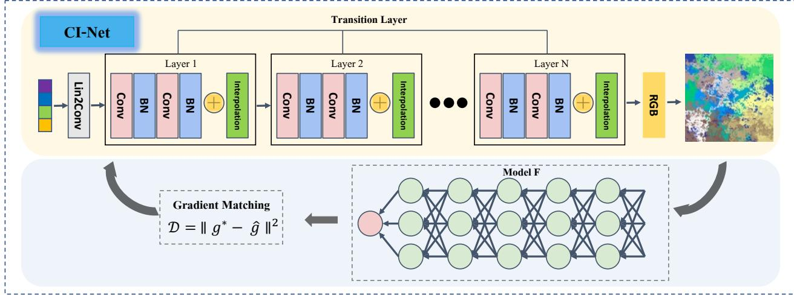
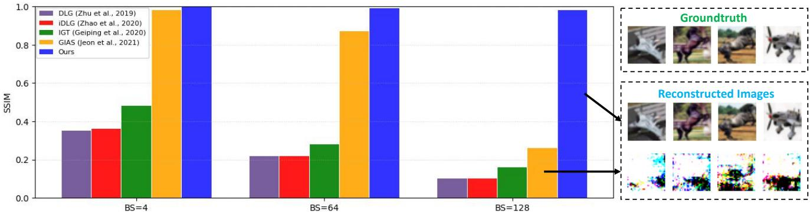
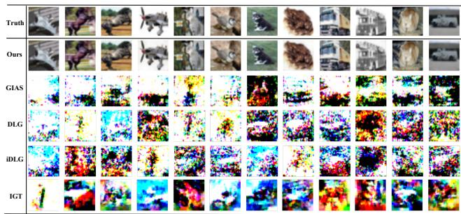
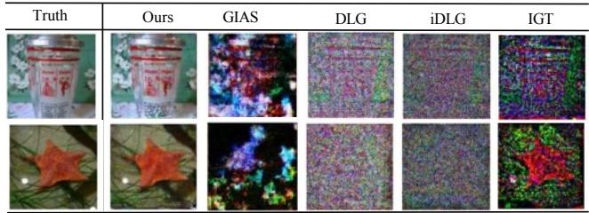
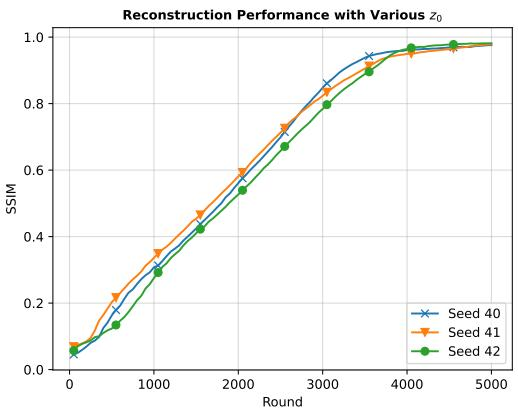

# Generative Gradient Inversion via Over-Parameterized Networks in Federated Learning

Chi Zhang , Xiaoman Zhang , Ekanut Sotthiwat , Yanyu Xu , Ping Liu , Liangli Zhen\* , Yong Liu

Institute of High Performance Computing, A\*STAR, Singapore {victor.chizhang, pino.pingliu}@gmail.com, {zhang xiaoman, stusottek, xu yanyu, zhenll, liuyong}@ihpc.a-star.edu.sg

## Abstract

Federated learning has gained recognitions as a secure approach for safeguarding local private data in collaborative learning. But the advent of gradient inversion research has posed significant challenges to this premise by enabling a third-party to recover groundtruth images via gradients. While prior research has predominantly focused on low-resolution images and small batch sizes, this study highlights the feasibility of reconstructing complex images with high resolutions and large batch sizes. The success of the proposed method is contingent on constructing an overparameterized convolutional network, so that images are generated before fitting to the gradient matching requirement. Practical experiments demonstrate that the proposed algorithm achieves high-fidelity image recovery, surpassing state-of-the-art competitors that commonly fail in more intricate scenarios. Consequently, our study shows that local participants in a federated learning system are vulnerable to potential data leakage issues. Source code is available at https://github.com/czhang024/CI-Net.

## 1. Introduction

Federated learning (FL) [16, 17, 20] provides a distributed paradigm that enables multiple parties to cooperatively learn a shared model. The primary premise of such a learning scheme is to tackle apprehensions concerning data privacy and security, by permitting users to upload their local gradients instead of the raw data.

But yet, this purported property of data privacy protection has recently come under scrutiny, as evidenced by several works [37, 35, 32] that question the possibility of recovering hidden data from uploaded gradients. Studies [7, 11] provided affirmative evidence to this question by demonstrating the feasibility of reconstructing training images through a process known as “gradient inversion”. Such a process involves the use of some randomly generated images, and iteratively computes the discrepancy between the gradients of the generated image and the true values. It then adjusts the pixel values in the direction of minimizing such a discrepancy, until the generated image gradients match the target gradients to a satisfactory degree.

The success of these inversion works is often contingent upon certain stringent assumptions: the underlying groundtruth images should possess low image resolutions and small batch sizes. A compelling counterexample to this is that attempting gradient inversion for batch sizes larger than 4 on datasets like CIFAR-10 turns out to be arduous [35]. For more complex datasets like ImageNet, images recovery for large batch sizes would be even more challenging [31]. But real-world participants of federated learning systems typically employ significantly larger batch sizes, for instance, 64 on CIFAR-10 and 16 on ImageNet, during local model training. As consequences, the inversion of gradients in such scenarios poses a significant challenge for these algorithms.

Lying ahead is the issue of nested gradients. Typically, local clients in an FL system only transmit an averaged gradient to the server, rather than the gradient of each individual image. Decoupling these averaged gradients presents an arduous task since random decomposition may only lead to a set of noisy gradients. An ideal algorithm would be capable of properly decoupling the averaged gradient in a correct way such that each gradient would act as a proxy for some natural image as expected.

The conventional approach to address the gradient coupling issue involves incorporating some image priors. For example, a study in [7] introduced a total variation term to penalize images with high variations, while the work [31] employed multiple fidelity regularizations. But in this paper, we shall highlight that the inclusion of these additional regularization terms may alter the fundamental properties of the original problem, thereby raising concerns about whether the groundtruth images indeed trigger the minimal loss.

The goal of this research is to present an alternative approach to gradient inversion that does not rely on image priors. Drawing inspiration from a recent study [11, 33], we propose an over-parameterized generative algorithm specifically designed for gradient inversion. The proposed algorithm takes into account three crucial factors in the gradient inversion problem: (i) an over-parameterized network to ensure that image generation and gradient matching have an non-empty intersection, (ii) a convolutional network to mitigate gradient matching to noise and (iii) a well-designed architecture to facilitate pixel-level intimacy. Leveraging these factors, we introduce the Convolutional Inversion Network (CI-Net), an over-parameterized network that offers a novel method for gradient matching without requiring prior information.

Numerical experiments demonstrate that the proposed algorithm exhibits superior performance in broader scenarios, including those involving large batch sizes and highresolution images. Our proposed network, denoted as “CI-Net”, outperforms state-of-the-art (SOTA) competitors, which generally struggle under such conditions. For example, when evaluated on the CIFAR 10 dataset with a batch size of 128 images, our proposed CI-Net achieves a mean peak signal-to-noise ratio (PSNR) of 31.40, surpassing its closest competitor, which only attains a mean PSNR value of 11.05. Moreover, the proposed algorithm has minimal pre-requisites for pre-training or prior knowledge concerning the data distribution, thereby enabling its use in a “plug and play” manner. Such a property renders the proposed method more practical for gradient inversion cases in which we have limited knowledge on the local data.

## 2. Related Works

Generative Method The convolutional method presented in this paper draws on recent advancements [8, 23, 9, 14, 13] in the field of generative adversarial network (GAN). GAN methods aim to generate new data by learning statistics from a set of training samples, and their effectiveness lies in their ability to capture the underlying distribution of the training data. Such a property allows it to deliver state-ofthe-art image synthesis performance in many areas, including but not limited to [5, 19, 28, 3, 18, 25]. Specifically, the convolutional method proposed in this paper builds upon the findings of recent investigations on the progressivegrowing generative models [12, 1]. This model involves starting from a small image core and progressively enlarging the image size, allowing the proposed convolutional method to generate high-fidelity images while simultaneously reducing computational costs. Therefore, this paper shows that the progressive-growing generative method holds promise as a candidate for he gradient inversion research.

Gradient Inversion Gradient inversion has garnered significant attention in recent years as it provides a reverse engineering approach to reconstruct hidden images from their gradient proxies. In essence, the method involves using the gradients of a deep neural network to infer the underlying images that the network was trained on. Initial prototypes of this method were presented in earlier studies [22, 27], where reconstruction possibilities were shown on shadow neural networks. Building on this line of research, more recent work [37] focused on the gradient inversion problem for deep neural networks, which involves jointly optimizing pseudo inputs and labels. Subsequent studies [35, 2, 34] revealed that the labels could be extracted independently beforehand, leading to improved stability and accuracy of the inversion procedure. But their success was generally limited to very low batch sizes and image resolutions, hence later works in [7, 31, 27, 6] considered extra regularization terms, in order to provide some prior information.

The study conducted by Jeon et al. [11] investigated the applicability of generative methods for the gradient inversion problem. This work is the most relevant to the present study, but several key differences are worth noting. First, unlike their approach, our proposed method does not require any image prior or pre-training. Second, our study reveals that over-parameterization is a crucial factor in achieving successful gradient inversion, whereas this is overlooked and the convolutional model [11] may be underparameterized.

## 3. Problem Statement

In this section, we present the formulation of gradient inversion problem and analyse the potential issues when incorporating regularization terms for image priors.

## 3.1. Formulation

In conventional FL systems, local training data and associated labels are generally not accessible to external entities, such as the curious server or third-parties. Instead, these entities may only gain access to the uploaded local average gradient.

Given the uploaded gradient ∇W computed from a minibatch of groundtruth images and labels $( x ^ { * } , y ^ { * } )$ , the goal of gradient inversion is to search some fake images $( \hat { x } ^ { * } , \hat { y } ^ { * } )$ that trigger the minimum gradient matching loss:

$$
\left( \hat { x } ^ { * } , \hat { y } ^ { * } \right) = \arg \operatorname* { m i n } _ { \left( \hat { x } , \hat { y } \right) } L _ { \mathrm { g r a d } } \left( \left( \hat { x } , \hat { y } \right) ; W , \nabla W \right) .
$$

In line with the prior work [37, 35], the batch size and image resolution are assumed to be known in advance. This facilitates the genuine images x∗ and counterfeit images ${ \hat { x } } ^ { * }$ to be within the same space RN×D, where N corresponds to the batch size, and D represents the dimensionality of each individual sample.

Earlier studies [35, 31, 2] have demonstrated that the true labels $y ^ { * }$ can be extracted directly from the final layer information, prior to the aforementioned optimization process. Consequently, the formulation may be simplified as follows:

$$
\hat { x } ^ { * } = \arg \operatorname* { m i n } _ { \hat { x } } L _ { \mathrm { g r a d } } \left( \hat { x } , W , \nabla W \right) .\tag{1}
$$

One possible choice for the gradient matching loss $L _ { \mathrm { g r a d } }$ could be the $L _ { \mathrm { 2 } } \mathrm { - n o r m }$ loss, which leads to the following formulation:

$$
L _ { \mathrm { g r a d } } \left( \hat { x } , W , \nabla W \right) : = \left\| \nabla _ { W } L ( \hat { x } , y ^ { * } ) - \nabla _ { W } L ( x ^ { * } , y ^ { * } ) \right\| ^ { 2 } .\tag{2}
$$

Alternatively, the gradient matching loss $L _ { \mathrm { g r a d } }$ can be based on the cosine-similarity loss:

$$
L _ { \mathrm { g r a d } } \left( \hat { x } , W , \nabla W \right) : = 1 - \frac { \left. \nabla _ { W } L ( \hat { x } , y ^ { * } ) , \nabla _ { W } L ( x ^ { * } , y ^ { * } ) \right. } { \| \nabla _ { W } L ( \hat { x } , y ^ { * } ) \| \| \nabla _ { W } L ( x ^ { * } , y ^ { * } ) \| } .\tag{3}
$$

## 3.2. Regularization with Image Priors

The preceding gradient matching formulation exhibits commendable performance in scenarios featuring small batch sizes and low image resolutions. But in more complex settings when more local samples are involved, such a direct formulation may not function effectively.

## 3.2.1 Regularization

To mitigate this issue, recent research has concentrated on enhancing the gradient matching loss through incorporating various supplementary regularizations. For example, the work in [7] considers the total variation loss TV(x) as the regularization term, whereas multiple fidelity and group consistency regularization terms are utilized in [31]. In general, the overall loss becomes:

$$
{ \cal L } _ { \mathrm { s u m } } \left( \hat { x } , W , \nabla W \right) = { \cal L } _ { \mathrm { g r a d } } \left( \hat { x } , W , \nabla W \right) + \lambda { \cal L } _ { \mathrm { r e g } } ( \hat { x } ) .\tag{4}
$$

The underlying reason of incorporating regularization terms is to establish some image priors before tackling the gradient matching problem. For instance, the above example in [7] relies on the assumption that the resulting images should exhibit low variations, in order to prevent overfitting to spurious noise during gradient inversion.

## 3.2.2 Issue of Regularization

We shall highlight one potential issue that is overlooked: the groundtruth images will certainly obtain a zero loss in Eq (2) and (3), but there is no guarantee that these images will continue to result in the minimal loss when additional regularization terms are introduced.

To see this, it is theoretically possible to construct a counter-example in which a set of fake images, denoted by ${ \hat { x } } ,$ result in even smaller loss than the groundtruth images $x ^ { * }$ in the following proposition.

Proposition 1. Considering the lossfunction (4) with a TV regularization, there exist a set ofparameters (λ, W, ∇W) and some $f a k e$ images xˆ such that $L _ { s u m } \left( \hat { x } , W , \nabla W \right) \ <$ $L _ { s u m } \left( x ^ { * } , W , \nabla W \right)$

As such, optimizing the summed loss (4) with algorithms like gradient descent may not necessarily converge towards the target images $x ^ { * }$ . This phenomenon has also been empirically confirmed in our subsequent studies, wherein the optimization process frequently yields spurious images that bear very low resemblance to the groundtruth. In fact, our empirical results also show that the severity of this issue can be exacerbated when the underlying batch size is increased to a potentially large level.

## 4. The Proposed Method

The efficacy of image priors in achieving the intended groundtruth images has been shown to be uncertain. Thus, we shall deviate from the conventional approach and concentrate on the original problem (2) and (3) with an alternative method in this section.

## 4.1. Objective Function

In the following, we shall employ a generative approach as the underlying framework to conduct gradient inversion, as opposed to optimizing pixel values independently. Specifically, a convolutional model G is required to receive a latent vector $z _ { 0 }$ as its input and generate a batch of images $\hat { x } = G ( z _ { 0 } , \theta )$ . Its parameters θ shall be updated by comparing the gradients of the generated images with the true received values, namely

$$
{ \hat { \boldsymbol { x } } } ^ { * } = \arg \operatorname* { m i n } _ { \boldsymbol { \theta } } L _ { \mathrm { g r a d } } \left( \boldsymbol { G } ( \boldsymbol { z } _ { 0 } , \boldsymbol { \theta } ) , \boldsymbol { W } , \nabla \boldsymbol { W } \right) .
$$

## 4.2. Existence and Uniqueness of Solutions

By omitting regularization terms, the above formulation circumvents the possibility of generating error-inducing images. But yet, we must address the existence and uniqueness of solution to this formulation, before proposing any practical algorithms. Existence of an optimal solution is evidently trivial, as the groundtruth images lead to zero loss and thus represent one optimal solution. The real challenge pertains to whether these images are the sole solution for the aforementioned loss functions. Otherwise we may create the same predicament whereby the optimization algorithm may not steer us towards the groundtruth images, as desired, if other solutions also achieve zero loss.

Unfortunately, the answer is negative in general: we cannot guarantee the uniqueness of solution. The following case presents a simple example on a 1-layer network.

Proposition 2. Consider the gradient inversion problem on the 1-layer neural network with a mini-batch ofN samples. Eqs (2) and (3) obtain a zero loss when the generated images $\hat { x } = [ \hat { x } _ { 1 } , \hat { x } _ { 2 } , \cdot \cdot \cdot , \hat { x } _ { N } ]$ satisfy:

$$
N \cdot \nabla W = \hat { x } \cdot \hat { P } ,\tag{5}
$$

where $\hat { P }$ refers to a matrix defined by the prediction probabilities $\{ \hat { p } _ { i , j } \}$ and the one-hot encoding ofthe labels $y ^ { * 1 }$

The constraint specified in Eq (5) imposes a necessary condition that must be satisfied by the generated images ${ \hat { x } } ,$ in order to attain a zero loss. Notably, these images can be considered as independent variables that reside within the $\mathbb { R } ^ { N \times D }$ space, where D corresponds to the dimensions of each sample ${ \hat { x } } _ { i } .$ . Consequently, for any given ∇W, there exists a suitable N such that dim $\boldsymbol { \mathrm { \Phi } } _ { 1 } ( \hat { \boldsymbol { x } } ) > \mathrm { d i m } ( \boldsymbol { \nabla } W )$ , making it impossible to ensure the uniqueness of the solution.

The non-uniqueness phenomenon can be extended beyond the 1-layer neural network to more complex networks, where the gradient constraints alone fail to guarantee a unique solution $^ 2 \cdot$ In Figure 1, we train a convolutional model from [11] for 50k iterations with signed gradient descent to reconstruct 128 CIFAR-10 images. Despite achieving a low mean $\ell _ { 2 }$ loss of $5 . 0 9 \times 1 0 ^ { - 5 }$ , many of the resulting images exhibit poor resemblance to the groundtruth and tend to be high blurring.

  
Figure 1: Non-uniqueness of solutions: a set of undesired images also satisfy the gradient matching requirement.

## 4.3. Generative Convolutional Inversion via Over-Parameterized Convolution Network

The aforementioned issues compel us to explore generative methodologies that can effectively surmount the challenges, especially under more intricate cases. The solution we shall propose is predicated on three key components: an over-parameterization setting, an implicit convolutional regularization, and a well-crafted architecture.

## 4.3.1 Over-Parameterization

Our study shall first emphasize a crucial element that has seldom been explored in prior research, namely overparameterization.

Given a latent vector $z _ { \mathrm { 0 } }$ and a convolutional model $G ,$ define its generative model space as $\begin{array} { r l } { \hat { X } _ { \mathrm { G } } } & { { } : = } \end{array}$ $\left\{ \hat { x } \in \mathbb { R } ^ { N \times D } \mid \hat { x } = G ( z _ { 0 } , \theta ) , \theta \in \Theta \right\}$ . Similarly, we may define the optimal set of (1) as

$$
\hat { X } _ { \mathrm { g r a d } } : = \left\{ \hat { x } ^ { * } \in \mathbb { R } ^ { N \times D } \mid \arg \operatorname* { m i n } _ { \hat { x } ^ { * } } L _ { \mathrm { g r a d } } \left( \hat { x } , W , \nabla W \right) \right\} .\tag{6}
$$

A necessary condition for successful generative method is require the intersection of these two spaces to be nonempty. The following proposition presents a formal articulation of this prerequisite, as well as a practical condition.

Proposition 3. Given a latent vector z0 and its corresponding generative model space ${ \hat { X } } _ { G } ,$ let its intersection with the gradient constraints be defined as

$$
\hat { X } _ { \Lambda } : = \hat { X } _ { G } \cap \hat { X } _ { g r a d } .\tag{7}
$$

A necessary condition for successful generative gradient inversion is that ${ \hat { X } } _ { \Lambda } \neq \varnothing .$ Furthermore, in the case where $\hat { X } _ { G }$ is sufficiently large, such a non-emptiness condition always holds.

The above proposition requires the generative space $\hat { X } _ { \mathbf { G } }$ to be sufficiently large so that the intersection to the gradient inversion is non-empty. Theoretically, this can be achieved by endowing the generative model with ample parameters to represent any arbitrary manifold [15]. Intersection in this case is always non-empty as the groundtruth images satisfies the gradient constraints $x ^ { * } \in \hat { X } _ { \mathrm { g r a d } } .$ Empirically, while the linearly independent constraints of ∇W may vary from case to case, a judicious approach is to stipulate that the number of parameters $P ( G )$ of the generative model is greater than that of the original model $P ( F )$ . By adding more parameters and expand $\hat { X } _ { \bf G } ,$ , we expect the parameter number to exceed the constraint number so that a minimal loss is incurred.

Ablation study validates the above conclusions. Specifically, we vary the number of parameters in a convolutional network architecture denoted by F and examine the resulting performance in generating high-fidelity images. The original model $F$ contains 0.33M parameters and consists of 2 convolutional layers and 1 linear output layer. Our results, presented in Figure 2, demonstrate that an under-parameterized G (with channel sizes of 8 and 16) yields poor performance, while an over-parameterized model (with a channel size of 128) achieves a structural similarity index measure (SSIM [26]) close to 1. Notably, even for highly over-parameterized cases, where the channel size is 512 and $P ( G ) \approx 6 0 P ( F )$ , we can still obtain high-fidelity images, albeit with slower convergence rates due to the large number of trainable values.

  
Figure 2: Ablation study on over-parameterization. $P ( F ) \approx 0 . 3 3 M$ . Results indicate over-parameterized models obtain an SSIM value of 1.0 for image reconstruction.

## 4.3.2 Implicit Convolutional Regularization

The above over-parameterization requirement of $P ( G ) >$ $P ( F )$ may be somehow counter-intuitive at the first glance: the training parameters now exceeds the constraints and we no longer have the uniqueness guarantee. To avoid fitting to some random noises instead of the groundtruth images, we propose the use of an implicit regularization technique by leveraging a convolutional architecture as the underlying generative model G.

The convolutional network has been demonstrated to possess an implicit image prior that prioritizes natural images over high-frequency noise. In particular, the work of [24] has shown that the structure of a convolutional network is capable of capturing a significant amount of lowlevel image statistics prior to any learning. When presented with a perturbed natural image, the convolutional network is able to first learn a clean solution before fitting to the noisy groundtruth. The use of convolutional methods also circumvents the potential biases that may arise from regularization techniques, such as total variation [4].

Our ablation study provides further validations of the implicit regularization in gradient inversion. Specifically, we require the same convolutional network to perform gradient inversion on four images from the CIFAR-10 dataset, as well as four randomly generated noises. As illustrated in Figure 3, our findings indicate that the convolutional network is capable of accurately recovering groundtruth information for natural images, yet fails to achieve high fidelity for noises. The reconstructed noise images exhibit a range from −0.16 to 0.62, which is statistically different from the original images normalized to the [0,1] range.

  
Figure 3: Ablation study on both true images and random noises. Left figure shows gradient inversion on natural images (orange line) achieves an SSIM value close to 1, while inversion of random noises (blue line) results in poor performance. The random noises and the reconstructed counterparts are plotted in the right panel, for visual comparison.

## 4.3.3 Architecture Design

An essential component in achieving effective gradient inversion involves carefully crafting the building blocks of the generative model, as it enables the development of pixel intimacy within the image neighborhood. To attain this objective, we contemplate the variant of the progressive-growing network [12] and frequently apply interpolations during the image generation process. The objective of such frequent interpolations is to enable the raw image to generate new pixels by taking into account neighboring values. To enhance pixel similarities, the original linear interpolation approach in [12] is substituted with the nearest-interpolation method. We also exclude the original Resnet-block [10] from our design since it alters the values of the neighboring pixels.

Subsequently, a network can be constructed by assembling these building blocks to facilitate the transition of the random vector $z _ { \mathrm { 0 } }$ into images suitable for gradient matching. The number of transition layers and the convolutional channels are determined by an initializer to ensure compliance with the aforementioned over-parameterization condition. The overall architecture of the proposed convolutional inversion network, dubbed the “CI-Net”, is depicted in Figure 4. Notably, to the best of our knowledge, this is the first study to address the gradient inversion problem from an architectural design standpoint.

  
Figure 4: Architecture design of CI-Net and its model updating process.

## 4.4. Plug and Play

To this end, we have designed an over-parameterized convolutional network to generate images before fitting to the gradient matching requirement. The proposed approach can be implemented in a “plug and play” fashion, devoid of requirements for prior knowledge, pre-training, or regularization. An arbitrary z0 can be fed into the overparameterized network G, followed by training the parameter θ to achieve the minimal gradient matching loss. This allows the above network to be more applicable for general FL settings, where local data are totally invisible.

## 5. Experiments

This section is dedicated to validating the proposed network by conducting practical gradient inversion experiments. Specifically, our research will focus on scrutinizing the potential impacts of large batch sizes and high resolution images on the performance of the gradient inversion algorithms.

## 5.1. Preparations

Our experimental validations are centered on the image classification task, with particular attention to two datasets: CIFAR-10, with a resolution of 32 × 32, and ImageNet, with a resolution of 256 × 256. The original Resnet-18 network [10] serves as the baseline model F, with its activation function replaced by sigmoid as suggested by [37]. The experimental evaluations are performed on the Nvidia 3090Ti platform, which provides a 24GB GPU memory. To facilitate comparative analysis, we conduct a comprehensive evaluation of several state-of-the-art gradient inversion algorithms, including DLG [37], iDLG [35], IGT [7], and GIAS [11], based on their original source codes. Each process is repeated thrice using different ResNet-18 models generated through various seeds. Finally, we employ four image quality assessment metrics to quantify the similarity between the generated images and the corresponding groundtruth images.

## 5.2. CIFAR-10 Experiment

Our study commences with a series of experiments conducted on the CIFAR-10 dataset, aimed at tackling the issue of large batch sizes in the gradient inversion problem. In practical settings, participants in FL systems may prefer to employ a relatively large batch size, in order to expedite their local training process. Moreover, if the participants elect to encrypt their gradients using the Multi-Party Computation (MPC) method [29, 30], their local gradients are fragmented into multiple pieces before being transmitted to the server for aggregation. Consequently, third parties as well as the central server may lack access to the gradient information of each participant, and instead only obtaining the averaged gradient for all participants. This results in larger batch sizes, exacerbating the issue of nested gradient further.

Figure 5 depicts the performance of all algorithms on a fixed ResNet-18 model as the batch size progressively increases from 4 to 128. The findings demonstrate that the generative method GIAS (yellow bar) consistently outperforms other non-generative competing algorithms when the batch size remains within the range of 4 to 64. However, its structural similarity (SSIM) experiences a significant decline when 128 images are utilized in the local training process. In such a more intricate case, the majority of algorithms fail to discover appropriate decomposition in the gradient inversion process and achieve notably low SSIM and PSNR values. Nevertheless, the proposed CI-Net (blue bar) emerges as the sole exception and attains high-fidelity images with an SSIM value of 0.98, signifying a strong resem-

  
Figure 5: Gradient inversion on the CIFAR-10 dataset. The structural similarity (SSIM) noticeably decreases with an increase in batch size from 4 to 128, except for the proposed method in this paper. Additionally, four sample images from both GIAS and the proposed method are presented on the right-hand side of the figure, allowing for a visual comparison with the groundtruth.

blance to the groundtruth images.  
  
Figure 6: Sample reconstructed images on CIFAR-10 dataset, when batch size equals 128.

Such a conclusion is further bolstered by exhibiting twelve sample images 3 from the resulting outcomes in Figure 6. It is evident from the results that the images generated by CI-Net exhibit a high degree of resemblance to the groundtruth images, in contrast to the output produced by its competitors, which is notably blurry. This procedure is then repeated thrice, and the corresponding results are consolidated in Table 1. All four numerical metrics presented in the table unequivocally demonstrate that the proposed approach surpasses its rivals in this scenario.

By comparing to GIAS [11], results also demonstrate necessity of incorporating an over-parameterized network for gradient inversion. GIAS employs the existing DC-GAN [23] (BigGAN [1] for the later ImageNet dataset) as a pioneering generative method, but its performance is unsatisfactory for a batch size of 128. In contrast, we propose a dedicated architecture for gradient inversion that emphasizes the over-parameterization, especially for large batch sizes. This enables us to reconstruct the hidden images almost identically, as demonstrated in Figure 6.

Table 1: Algorithm performance of gradient inversion on CIFAR-10 data, with batch size equalling to 128. SSIM and FSIM have maximum value 1, and LPIPS has minimum value 0.
<table><tr><td rowspan=1 colspan=1>Algorithm</td><td rowspan=1 colspan=1>SSIM↑</td><td rowspan=1 colspan=1>FSIM↑</td><td rowspan=1 colspan=1>PSNR↑</td><td rowspan=1 colspan=1>LPIPS (VGG)↓</td></tr><tr><td rowspan=1 colspan=1>DLG [37]</td><td rowspan=1 colspan=1>0.10 ± 0.01</td><td rowspan=1 colspan=1>0.58 ± 0.01</td><td rowspan=1 colspan=1> $6 . 1 3 \pm 0 . 0 6$ </td><td rowspan=1 colspan=1> $\overline { { 0 . 6 5 \pm 0 . 0 1 } }$ </td></tr><tr><td rowspan=2 colspan=1>iDLG [35]IGT [7]GIAS [11]</td><td rowspan=1 colspan=1> $0 . 1 0 \pm 0 . 0 1$ </td><td rowspan=1 colspan=1> $0 . 5 7 \pm 0 . 0 1$ </td><td rowspan=1 colspan=1> $6 . 0 3 \pm 0 . 0 1$ </td><td rowspan=2 colspan=1> $0 . 6 1 \pm 0 . 0 1$  $0 . 6 1 \pm 0 . 0 1$  $0 . 5 9 \pm 0 . 0 6$ </td></tr><tr><td rowspan=1 colspan=1> $0 . 1 6 \pm 0 . 0 1$  $0 . 2 6 \pm 0 . 1 1$ </td><td rowspan=1 colspan=1> $0 . 5 9 \pm 0 . 0 1$  $0 . 6 6 \pm 0 . 0 6$ </td><td rowspan=1 colspan=1> $8 . 0 3 \pm 0 . 2 6$  $1 1 . 0 5 \pm 2 . 8 5$ </td></tr><tr><td rowspan=1 colspan=1>Ours</td><td rowspan=1 colspan=1> $\mathbf { 0 . 9 8 \pm 0 . 0 1 }$ </td><td rowspan=1 colspan=1> $\mathbf { 0 . 9 8 \pm 0 . 0 1 }$ </td><td rowspan=1 colspan=1> ${ \bf 3 1 . 4 0 \pm 0 . 1 4 }$ </td><td rowspan=1 colspan=1> $\mathbf { 0 . 0 3 \pm 0 . 0 1 }$ </td></tr></table>

## 5.3. ImageNet Experiment

The above experiments are also replicated on the ImageNet dataset, which is known to pose a significant challenge for gradient inversion due to its high-resolution images. Prior studies often resort to addressing this issue by downscaling the original images before facilitating image recovery (e.g., downsampling ImageNet to 64 × 64 in GIAS [11]). But in this study, we shall preserve the original image resolution and employ a larger batch size of 24 to more accurately emulate practical local updates in FL systems.

  
Figure 7: Sample reconstructed images on ImageNet.  
Table 2 illustrates that the use of high-resolution images

and a large batch size presents practical challenges for all existing gradient inversion algorithms, with the best SSIM value achieved by our competitors being only 0.04. Despite outperforming the other algorithms, performance of the proposed CI-Net is also affected by the complexity of the data, resulting in a mean SSIM value of 0.52. For visual comparison, Figure 7 displays the reconstructed results for the first two images, with the remaining images available in Appendix D. Its results reveal that the proposed algorithm is still capable of reconstructing the original images, albeit with relatively blurred outcomes compared to the groundtruth.

Table 2: Gradient Inversion on the ImageNet dataset, using a batch size of 24.
<table><tr><td>Algorithm</td><td>SSIM↑</td><td>FSIM↑</td><td>PSNR↑</td><td>LPIPS (VGG)↓</td></tr><tr><td>DLG [37]</td><td>0.01 ± 0.00</td><td> $\overline { { 0 . 4 5 \pm 0 . 0 1 } }$ </td><td> $\overline { { 5 . 4 0 \pm 0 . 0 5 } }$ </td><td> $\overline { { 0 . 8 4 \pm 0 . 0 1 } }$ </td></tr><tr><td>iDLG [35]</td><td> $0 . 0 1 \pm 0 . 0 0$ </td><td> $0 . 4 7 \pm 0 . 0 1$ </td><td> $6 . 0 9 \pm 0 . 0 4$ </td><td> $0 . 8 3 \pm 0 . 0 1$ </td></tr><tr><td>IGT [7]</td><td> $0 . 0 4 \pm 0 . 0 1$ </td><td> $0 . 5 3 \pm 0 . 0 1$ </td><td> $7 . 9 0 \pm 0 . 2 2$ </td><td> $0 . 7 7 \pm 0 . 0 1$ </td></tr><tr><td>GIAS [11]</td><td> $0 . 0 4 \pm 0 . 0 2$ </td><td> $0 . 5 4 \pm 0 . 0 4$ </td><td> $8 . 0 3 \pm 0 . 7 7$ </td><td> $0 . 7 8 \pm 0 . 0 7$ </td></tr><tr><td>Ours</td><td> $\mathbf { 0 . 5 2 \pm 0 . 0 6 }$ </td><td> ${ \bf 0 . 7 7 \pm 0 . 0 3 }$ </td><td> ${ \bf 1 9 . 6 4 \pm 1 . 0 5 }$ </td><td> ${ \bf 0 . 4 9 \pm 0 . 0 4 }$ </td></tr></table>

## 5.4. Extension to Even Larger Sizes

Our research findings can be extrapolated to even greater batch sizes, as evidenced by our additional numerical experiments using 256 CIFAR-10 images and 32 ImageNet images. It should be noted that these batch sizes represent the maximum supported by our GPU memory.

The outcomes exhibited in Table 3 are coherent with our prior discoveries, as the CI-Net continuously produces superior quality images on the CIFAR-10 dataset. Due to space limitations, further experiments on ImageNet are provided in Appendix D.

Table 3: Performance of CI-Net on the CIFAR-10 dataset, with various batch sizes.
<table><tr><td rowspan=1 colspan=1>Batch Size</td><td rowspan=1 colspan=1>SSIM↑</td><td rowspan=1 colspan=1>FSIM↑</td><td rowspan=1 colspan=1>PSNR↑</td><td rowspan=1 colspan=1>LPIPS (VGG)↓</td></tr><tr><td rowspan=2 colspan=1>64128256</td><td rowspan=1 colspan=1> $\overline { { 1 . 0 0 \pm 0 . 0 0 } }$  $0 . 9 8 \pm 0 . 0 1$ </td><td rowspan=1 colspan=1> $\overline { { 1 . 0 0 \pm 0 . 0 0 } }$  $0 . 9 8 \pm 0 . 0 1$ </td><td rowspan=1 colspan=1> $\overline { { 3 3 . 7 2 \pm 0 . 0 5 } }$  $3 1 . 4 0 \pm 0 . 1 4$ </td><td rowspan=2 colspan=1> $\overline { { 0 . 0 1 \pm 0 . 0 0 } }$  $0 . 0 3 \pm 0 . 0 1$  $0 . 0 2 \pm 0 . 0 1$ </td></tr><tr><td rowspan=1 colspan=1> $0 . 9 8 \pm 0 . 0 1$ </td><td rowspan=1 colspan=1> $0 . 9 9 \pm 0 . 0 1$ </td><td rowspan=1 colspan=1> $3 4 . 1 1 \pm 0 . 1 3$ </td></tr></table>

## 5.5. Choice of Latent Vector

A salient attribute of the proposed CI-Net is its ability to generate images without relying on priors or regularizations. Specifically, the proposed method employs a random latent vector $z _ { \mathrm { 0 } }$ and trains the generator from scratch using the uploaded gradients. This is also distinct from the GIAS method [11], which necessitates the algorithm to alternatively search for the image prior and the generative model parameters.

To validate this attribute, we randomly generate three random Gaussian vectors $z _ { 0 }$ using different seeds (from 40 to 42) in PyTorch to represent diversities. Results shown in

Figure 8 indicate that the choice of Gaussian variable $z _ { \mathrm { 0 } }$ has minimal impacts on the final SSIM value. The freedom to select $z _ { 0 }$ is consistent with prior GAN studies [8, 23] where users are not required to specify a latent vector.

  
Figure 8: Image reconstruction with various $z _ { 0 }$

## 5.6. Additional Memory Requirement

During our studies, we observe that the incorporation of an additional convolutional model G resulted in a notable augmentation of GPU memory usage. Specifically, the increase in memory consumption is approximately 40% as compared to non-generative techniques such as iDLG and IGT. Despite the augmented resource requirements, our method remains operationally feasible on a single 3090Ti, signifying its practical viability as a solution for gradient inversion.

## 6. Conclusion

This paper presents a gradient inversion solution to perform image reconstruction in federated learning, focusing on more intricate cases where the current algorithms would typically fail. Construction of such a solution relies on three key elements: a convolutional regularization, an overparameterization requirement and a well-crafted architecture. The effectiveness of the proposed algorithm is demonstrated through a series of practical experiments, showcasing its ability to reconstruct the original training images with greater efficiency, even under conditions of large batch sizes and high resolutions.

## 7. Acknowledgments

This work was supported by A\*STAR Central Research Fund “A Secure and Privacy Preserving AI Platform for Digital Health”, Career Development Fund (Grant No: 222D800031) and AISG Award (Grant No: AISG2-TC-2021-003).

## References

[1] Andrew Brock, Jeff Donahue, and Karen Simonyan. Large scale gan training for high fidelity natural image synthesis. arXiv preprint arXiv:1809.11096, 2018. 2, 7

[2] Trung Dang, Om Thakkar, Swaroop Ramaswamy, Rajiv Mathews, Peter Chin, and Franc¸oise Beaufays. Revealing and protecting labels in distributed training. Advances in Neural Information Processing Systems, 34:1727–1738, 2021. 2, 3

[3] Ayushman Dash, John Cristian Borges Gamboa, Sheraz Ahmed, Marcus Liwicki, and Muhammad Zeshan Afzal. Tac-gan-text conditioned auxiliary classifier generative adversarial network. arXiv preprint arXiv:1703.06412, 2017. 2

[4] Alexey Dosovitskiy, Thomas Brox, et al. Inverting convolutional networks with convolutional networks. arXiv preprint arXiv:1506.02753, 4(2):3, 2015. 5

[5] Kiana Ehsani, Roozbeh Mottaghi, and Ali Farhadi. Segan: Segmenting and generating the invisible. In Proceedings of the IEEE conference on computer vision and pattern recognition, pages 6144–6153, 2018. 2

[6] Liam Fowl, Jonas Geiping, Wojtek Czaja, Micah Goldblum, and Tom Goldstein. Robbing the fed: Directly obtaining private data in federated learning with modified models. arXiv preprint arXiv:2110.13057, 2021. 2

[7] Jonas Geiping, Hartmut Bauermeister, Hannah Droge, and¨ Michael Moeller. Inverting gradients-how easy is it to break privacy in federated learning? Proceedings of the Advances in Neural Information Processing Systems, 33:16937–16947, 2020. 1, 2, 3, 6, 7, 8

[8] Ian Goodfellow, Jean Pouget-Abadie, Mehdi Mirza, Bing Xu, David Warde-Farley, Sherjil Ozair, Aaron Courville, and Yoshua Bengio. Generative adversarial networks. Communications ofthe ACM, 63(11):139–144, 2020. 2, 8

[9] Ishaan Gulrajani, Faruk Ahmed, Martin Arjovsky, Vincent Dumoulin, and Aaron C Courville. Improved training of wasserstein gans. Advances in neural information processing systems, 30, 2017. 2

[10] Kaiming He, Xiangyu Zhang, Shaoqing Ren, and Jian Sun. Deep residual learning for image recognition. In Proceedings of the IEEE conference on computer vision and pattern recognition, pages 770–778, 2016. 5, 6

[11] Jinwoo Jeon, Kangwook Lee, Sewoong Oh, Jungseu Ok, et al. Gradient inversion with generative image prior. Advances in Neural Information Processing Systems, 34:29898–29908, 2021. 1, 2, 4, 6, 7, 8, 14

[12] Tero Karras, Timo Aila, Samuli Laine, and Jaakko Lehtinen. Progressive growing of gans for improved quality, stability, and variation. arXiv preprint arXiv:1710.10196, 2017. 2, 5, 12

[13] Tero Karras, Samuli Laine, and Timo Aila. A style-based generator architecture for generative adversarial networks. In Proceedings ofthe IEEE/CVF conference on computer vision and pattern recognition, pages 4401–4410, 2019. 2

[14] Tero Karras, Samuli Laine, Miika Aittala, Janne Hellsten, Jaakko Lehtinen, and Timo Aila. Analyzing and improving the image quality of stylegan. In Proceedings of the IEEE/CVF conference on computer vision and pattern

recognition, pages 8110–8119, 2020. 2

[15] Valentin Khrulkov and Ivan Oseledets. Universality theorems for generative models. arXiv preprint arXiv:1905.11520, 2019. 4, 12

[16] Jakub Konecnˇ y, Brendan McMahan, and Daniel Ramage.\` Federated optimization: Distributed optimization beyond the datacenter. arXiv preprint arXiv:1511.03575, 2015. 1

[17] Jakub Konecnˇ y, H Brendan McMahan, Felix X Yu, Peter\` Richtarik, Ananda Theertha Suresh, and Dave Bacon. Fed-´ erated learning: Strategies for improving communication efficiency. arXiv preprint arXiv:1610.05492, 2016. 1

[18] Christian Ledig, Lucas Theis, Ferenc Huszar, Jose Caballero,´ Andrew Cunningham, Alejandro Acosta, Andrew Aitken, Alykhan Tejani, Johannes Totz, Zehan Wang, et al. Photorealistic single image super-resolution using a generative adversarial network. In Proceedings of the IEEE conference on computer vision and pattern recognition, pages 4681–4690, 2017. 2

[19] Jianan Li, Xiaodan Liang, Yunchao Wei, Tingfa Xu, Jiashi Feng, and Shuicheng Yan. Perceptual generative adversarial networks for small object detection. In Proceedings of the IEEE conference on computer vision and pattern recognition, pages 1222–1230, 2017. 2

[20] Brendan McMahan, Eider Moore, Daniel Ramage, Seth Hampson, and Blaise Aguera y Arcas. Communicationefficient learning of deep networks from decentralized data. In Artificial Intelligence and Statistics, pages 1273–1282. PMLR, 2017. 1

[21] Takeru Miyato, Toshiki Kataoka, Masanori Koyama, and Yuichi Yoshida. Spectral normalization for generative adversarial networks. arXiv preprint arXiv:1802.05957, 2018. 12

[22] Le Trieu Phong, Yoshinori Aono, Takuya Hayashi, Lihua Wang, and Shiho Moriai. Privacy-preserving deep learning: Revisited and enhanced. In International Conference on Applications and Techniques in Information Security, pages 100–110. Springer, 2017. 2

[23] Alec Radford, Luke Metz, and Soumith Chintala. Unsupervised representation learning with deep convolutional generative adversarial networks. arXiv preprint arXiv:1511.06434, 2015. 2, 7, 8

[24] Dmitry Ulyanov, Andrea Vedaldi, and Victor Lempitsky. Deep image prior. In Proceedings of the IEEE conference on computer vision and pattern recognition, pages 9446–9454, 2018. 5

[25] Xintao Wang, Ke Yu, Shixiang Wu, Jinjin Gu, Yihao Liu, Chao Dong, Yu Qiao, and Chen Change Loy. Esrgan: Enhanced super-resolution generative adversarial networks. In Proceedings ofthe European conference on computer vision (ECCV) workshops, pages 0–0, 2018. 2

[26] Zhou Wang, Alan C Bovik, Hamid R Sheikh, and Eero P Simoncelli. Image quality assessment: from error visibility to structural similarity. IEEE transactions on image processing, 13(4):600–612, 2004. 5

[27] Zhibo Wang, Mengkai Song, Zhifei Zhang, Yang Song, Qian Wang, and Hairong Qi. Beyond inferring class representatives: User-level privacy leakage from federated learning. In IEEE INFOCOM 2019-IEEE Conference on Computer Communications, pages 2512–2520. IEEE, 2019. 2

[28] Tao Xu, Pengchuan Zhang, Qiuyuan Huang, Han Zhang, Zhe Gan, Xiaolei Huang, and Xiaodong He. Attngan: Finegrained text to image generation with attentional generative adversarial networks. In Proceedings ofthe IEEE conference on computer vision and pattern recognition, pages 1316– 1324, 2018. 2

[29] Andrew C Yao. Protocols for secure computations. In 23rd annual symposium onfoundations ofcomputer science (sfcs 1982), pages 160–164. IEEE, 1982. 6

[30] Andrew Chi-Chih Yao. How to generate and exchange secrets. In 27th Annual Symposium on Foundations of Computer Science (sfcs 1986), pages 162–167. IEEE, 1986. 6

[31] Hongxu Yin, Arun Mallya, Arash Vahdat, Jose M Alvarez, Jan Kautz, and Pavlo Molchanov. See through gradients: Image batch recovery via gradinversion. In Proceedings of the IEEE/CVF Conference on Computer Vision and Pattern Recognition, pages 16337–16346, 2021. 1, 2, 3

[32] Chi Zhang, Sotthiwat Ekanut, Liangli Zhen, and Zengxiang Li. Augmented multi-party computation against gradient leakage in federated learning. IEEE Transactions on Big Data, 2022. 1

[33] Chi Zhang and Qianxiao Li. Distributed optimization for degenerate loss functions arising from over-parameterization. Artificial Intelligence, 301:103575, 2021. 2

[34] Jingyang Zhang, Yiran Chen, and Hai Li. Privacy leakage of adversarial training models in federated learning systems. In Proceedings of the IEEE/CVF Conference on Computer Vision and Pattern Recognition, pages 108–114, 2022. 2

[35] Bo Zhao, Konda Reddy Mopuri, and Hakan Bilen. iDLG: Improved deep leakage from gradients. CoRR, 2020. 1, 2, 3, 6, 7, 8

[36] Junyi Zhu and Matthew Blaschko. R-gap: Recursive gradient attack on privacy. arXiv preprint arXiv:2010.07733, 2020. 4

[37] Ligeng Zhu, Zhijian Liu, and Song Han. Deep leakage from gradients. Proceedings of the Advances in Neural Information Processing Systems, 32, 2019. 1, 2, 3, 6, 7, 8