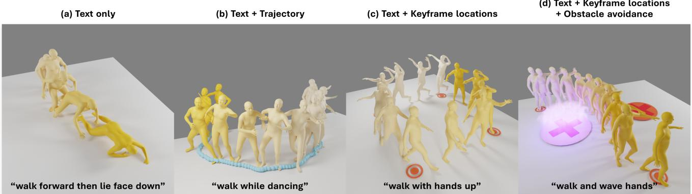
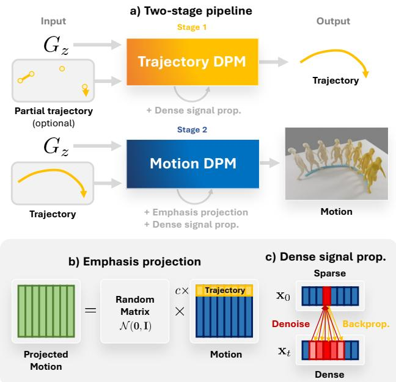
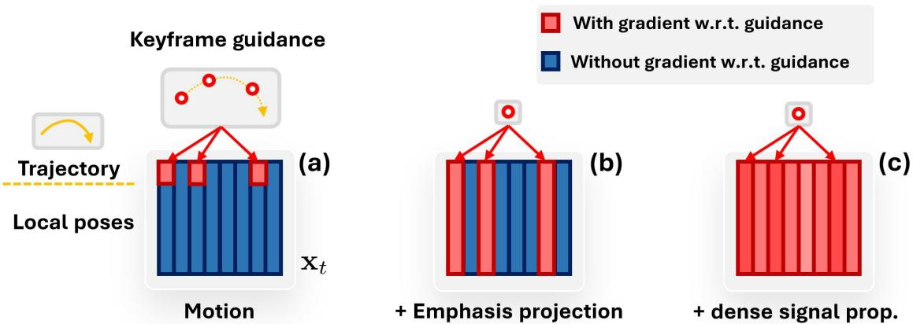
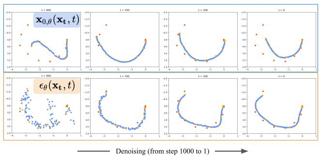
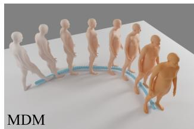
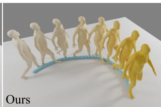
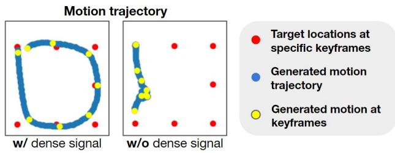
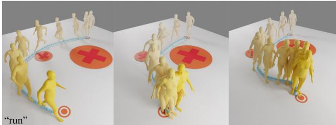

# Guided Motion Diffusion for Controllable Human Motion Synthesis

Korrawe Karunratanakul1 Konpat Preechakul2 Supasorn Suwajanakorn2 Siyu Tang1

1ETH Zurich, Switzerland¨ 2VISTEC, Thailand

https://korrawe.github.io/gmd-project/

  
Figure 1. Our proposed Guided Motion Diffusion (GMD) can generate high-quality and diverse motions given a text prompt and a goal function. We demonstrate the controllability of GMD on four different tasks, guided by the following conditions: (a) text only, (b) text and trajectory, (c) text and keyframe locations (double circles), and (d) with obstacle avoidance (red-cross areas represent obstacles). The darker the colors, the later in time.

## Abstract

Denoising diffusion models have shown great promise in human motion synthesis conditioned on natural language descriptions. However, integrating spatial constraints, such as pre-defined motion trajectories and obstacles, remains a challenge despite being essential for bridging the gap between isolated human motion and its surrounding environment. To address this issue, we propose Guided Motion Diffusion (GMD), a method that incorporates spatial constraints into the motion generation process. Specifically, we propose an effective feature projection scheme that manipulates motion representation to enhance the coherency between spatial information and local poses. Together with a new imputation formulation, the generated motion can reliably conform to spatial constraints such as global motion trajectories. Furthermore, given sparse spatial constraints (e.g. sparse keyframes), we introduce a new dense guidance approach to turn a sparse signal, which is susceptible to being ignored during the reverse steps, into denser signals to guide the generated motion to the given constraints. Our extensive experiments justify the development of GMD, which achieves a significant improvement over state-of-theart methods in text-based motion generation while allowing control of the synthesized motions with spatial constraints.

## 1. Introduction

Recently, denoising diffusion models have emerged as a promising approach for human motion generation [11, 62, 64] outperforming other alternatives such as GAN or VAE in terms of both quality and diversity [7, 51, 58]. Several studies have focused on generating motion based on expressive text prompts [7, 51], or music [52, 64]. The stateof-the-art motion generation methods, such as MDM [51], utilize classifier-free guidance to generate motion conditioned on text prompts. However, incorporating spatial constraints into diffusion models remains underexplored. Human motions consist of both semantic and spatial information, where the semantic aspect can be described using natural languages or action labels and the spatial aspect governs physical interaction with surroundings. To generate realistic human motion in a 3D environment, both aspects must be incorporated. Our experiments show that simply adding spatial constraint guidance, such as global trajectories, into the state-of-the-art models or using imputation and in-painting approaches do not yield satisfactory results.

We identify two main issues that make the motion diffusion models likely to ignore the guidance when conditioned on spatial objectives: the sparseness of global orientation in the motion representation and sparse frame-wise guidance signals. By design, the diffusion models are a denoising model that consecutively denoises the target output over multiple steps. With sparse guidance, a small portion of the output that receives guidance will be inconsistent with all other parts that do not, therefore, are more likely to be treated as noise and discarded in subsequent steps.

  
Figure 2. We tackle the problem of spatially conditioned motion generation with GMD, depicted in a). Our main contributions are b) Emphasis projection, for better trajectory-motion coherence, and c) Dense signal propagation, for a more controllable generation even under sparse guidance signal.

First, the sparseness within a frame is a result of common motion representations that separate local pose information, like joint rotations, from global orientations, such as pelvis translations and rotations [43], usually with more focus on local poses. For instance, the common motion representation [14] uses 4 values to represent global orientation and 259 values for local pose in each frame. Such imbalance can cause the model to focus excessively on local pose information, and consequently, perceive guided global orientation as noise, resulting in a discrepancy such as foot skating.

Second, in many applications such as character animation, gaming, and virtual reality, the spatial control signals are defined on only a few keyframes such as target locations on the ground. We show that the current diffusion-based motion generation models struggle to follow such sparse guidance as doing so is equivalent to guiding an image diffusion model with only a few pixels. As a result, either the guidance at the provided keyframes will be ignored during the denoising process or the output motion will contain an artifact where the character warps to satisfy the guidance only in those specific keyframes.

To effectively incorporate sparse spatial constraints into the motion generation process, we propose GMD, a novel and principled Guided Motion Diffusion model. To alleviate the discrepancy between local pose and global orientation in the guided denoising steps, we introduce emphasis projection, a general representation manipulation method that we use to increase the importance of spatial information during training. Additionally, we derive a new imputation and inpainting formulation that enables the existing inpainting techniques to operate in the projected space, which we leverage to generate significantly more coherent motion under guidance by spatial conditions. Then, to address the highly sparse guidance, we draw inspiration from the credit assignment problem in Reinforcement Learning [50, 54], where sparse rewards can be distributed along a trajectory to allow for efficient learning [3]. Our key insight is that motion denoisers, including the diffusion model itself, can be used to expand the spatial guidance signal at a specific location to its neighboring locations without any additional model. By turning a sparse signal into a dense one by backpropagating through a denoiser, it enables us to achieve high-quality controllable motion synthesis, even with extremely sparse guidance signals.

In summary, our contributions are: (1) Emphasis projection, a method to adjust relative importance between different parts of the representation vector, which we use to encourage coherency between spatial information and local poses to allow spatial guidance. (2) Dense signal propagation, a conditioning method to tackle the sparse guidance problem. (3) GMD, an effective spatially controllable motion generation method that enables the unexplored synthesizing of motions based on free-text and spatial conditioning by integrating the above contributions into our proposed Unet-based architecture. We provide extensive analysis to support our design decisions and show the versatility of GMD on three tasks: trajectory conditioning, keyframe conditioning, and obstacle avoidance. Additionally, GMD’s model also significantly outperforms the state-of-the-art in traditional text-to-motion tasks.

## 2. Related Work

Diffusion-based probabilistic generative models (DPM). DPMs [20,47,48,49] have gained significant attention in recent years due to their impressive performance across multiple fields of research. They have been used for tasks such as image generation [12], image super-resolution [30, 46], speech synthesis [26, 26, 39], video generation [19, 22], 3D shape generation [38, 55], and reinforcement learning [23].

The surge in interest in DPMs may be attributed to their impressive controllable generation capabilities, including text-conditioned generation [42, 44, 45] and image editing [4, 6, 9, 18, 34]. Latent diffusion models (LDM) are another area of interest, which includes representation learning [27, 40] and more efficient modeling techniques [7, 44].

Moreover, DPMs exhibit a high degree of versatility in terms of conditioning. There are various methods for conditional generation, such as imputation and inpainting [9, 10, 34], classifier guidance [10, 12], and classifier-free guidance [21, 42, 44, 45]. Inpainting and classifier guidance can be applied to any pretrained DPM, which extends the model’s capabilities further without the need for retraining.

Human motion generation. The goal of the human motion generation task is to generate motions based on the conditioning signals. Various conditions have been explored such as partial poses [13, 17, 51], trajectories [24, 53, 60], images [8,43], music [28,29,31], text [1,14,15,25,37], objects [56], action labels [16,36], or unconditioned [35,57,61,63]. Recently, many diffusion-based motion generation models have been proposed [11, 25, 32, 62, 64] and demonstrate better quality compared to alternative models such as GAN or VAE. Employing the CLIP model [41], these models showed great improvements in the challenging text-tomotion generation task [7,58,59] as well as allowing conditioning on partial motions [51] or music [2, 52]. However, they do not support conditioning signals that are not specifically trained, for example, following keyframe locations or avoiding obstacles. Maintaining the capabilities of the diffusion models, we propose methods to enable spatial guidance without retraining the model for each new objective.

## 3. Background

## 3.1. Diffusion-based generative models

Diffusion-based probabilistic generative models (DPMs) are a family of generative models that learn a sequential denoising process of an input $\mathbf { x } _ { t }$ with varying noise levels $t .$ The noising process of DPM is defined cumulatively as $q ( \mathbf { x } _ { t } | \mathbf { x } _ { 0 } ) = \mathcal { N } ( \sqrt { \alpha _ { t } } \mathbf { x } _ { 0 } , ( 1 - \alpha _ { t } ) \mathbf { I } )$ , where $\mathbf { x } _ { \mathrm { 0 } }$ is the clean input, $\begin{array} { r } { \alpha _ { t } = \prod _ { s = 1 } ^ { t } ( 1 - \beta _ { s } ) } \end{array}$ , and $\beta _ { t }$ is a noise scheduler. The denoising model $p _ { \theta } ( \mathbf { x } _ { t - 1 } | \mathbf { x } _ { t } )$ with parameters θ learns to reverse the noising process by modeling the Gaussian posterior distribution $q ( \mathbf { x } _ { t - 1 } | \mathbf { x } _ { t } , \mathbf { x } _ { 0 } )$ . DPMs can map a prior distribution $\mathcal { N } ( \mathbf { 0 } , \mathbf { I } )$ to any distribution $p ( \mathbf { x } )$ after $T$ successive denoising steps.

To draw samples from a DPM, we start from a sample $\mathbf { x } _ { T }$ from the prior distribution $\mathcal { N } ( \mathbf { 0 } , \mathbf { I } )$ . Then, for each $t ,$ we sample $\mathbf { x } _ { t - 1 } \sim \mathcal { N } ( \mu _ { t } , \Sigma _ { t } )$ until $t = 0$ , where

$$
\mu _ { t } = \frac { \sqrt { \alpha _ { t - 1 } } \beta _ { t } } { 1 - \alpha _ { t } } \mathbf { x } _ { 0 } + \frac { \sqrt { 1 - \beta _ { t } } ( 1 - \alpha _ { t - 1 } ) } { 1 - \alpha _ { t } } \mathbf { x } _ { t }\tag{1}
$$

and $\Sigma _ { t }$ is a variance scheduler of choice, usually $\Sigma _ { t } ~ =$ $\frac { 1 - \alpha _ { t - 1 } } { 1 - \alpha _ { t } } \beta _ { t } \left[ 2 0 \right] . \mathrm { ~ } \mathbf { x } _ { 0 }$ in Eq. 1 is the prediction from a denoising model. For an $\epsilon _ { \theta }$ model, $\begin{array} { r } { \mathbf { x } _ { 0 } = \frac { 1 } { \sqrt { \alpha _ { t } } } \mathbf { x } _ { t } + \frac { \sqrt { 1 - \alpha _ { t } } } { \sqrt { \alpha _ { t } } } \epsilon _ { \theta } ( \mathbf { x } _ { t } ) } \end{array}$

There are multiple choices for the denoising model to predict including the clean input $\mathbf { x } _ { \mathrm { 0 } }$ , the noise ϵ, and the one-step denoised target $\mu _ { t } .$ . An $\mathbf { x } _ { 0 , \theta }$ model is trained using the squared loss to the clean input $\left\| \mathbf { x } _ { 0 , \theta } ( \mathbf { x } _ { t } ) - \mathbf { x } _ { 0 } \right\| ^ { 2 } ,$ , an $\epsilon _ { \theta }$ model is trained using the squared loss $\left\| \epsilon _ { \theta } ( \mathbf { x } _ { t } ) - \epsilon \right\| ^ { 2 }$ , and $\mu _ { t , \theta }$ model is trained using the squared loss $\| \mu _ { t , \theta } ( \mathbf { x } _ { t } ) - \mu _ { t } \| ^ { 2 }$

## 3.2. Controllable generation with diffusion models.

Classifier-free guidance. The conditioning signals are treated as additional inputs to the denoiser $p _ { \theta } ( \mathbf { x } _ { t - 1 } | \mathbf { x } _ { t } , d )$ where d is the conditioning signals which can be omitted $d = \emptyset$ to generate unconditionally. Classifier-free guidance has been shown to generate very high-quality results [44, 45, 51]. To draw samples, the effective denoiser becomes $\hat { \epsilon } _ { \theta } ( \mathbf { x } _ { t } , d ) = w \epsilon _ { \theta } ( \mathbf { x } _ { t } , d ) + ( 1 - w ) \epsilon _ { \theta } ( \mathbf { x } _ { t } , \mathcal { O } )$ , where w controls the conditional strength. The new ϵˆθ model can be used in Eq. 1. Two downsides of this method are that the nature of conditioning signals need to be known before hand and the denoiser needs to be adjusted and retrained for each specific case restricting its flexibility.

Classifier guidance. We can also obtain $p ( \mathbf { x } _ { t - 1 } | \mathbf { x } _ { t } , d )$ from $p _ { \theta } ( \mathbf { x } _ { t - 1 } | \mathbf { x } _ { t } ) p ( d | \mathbf { x } _ { t } )$ [12] , where $p ( d | \mathbf { x } _ { t } )$ is any probability function that we can approximate its score function $\nabla _ { \mathbf { x } _ { t } } \log p ( d | \mathbf { x } _ { t } )$ effectively. The new sampling process is similar to the original (Eq. 1) but with the mean shifted by the scaled score function as

$$
\mu _ { t } = \mu _ { t } ^ { \prime } + s \Sigma _ { t } \nabla _ { \mathbf { x } _ { t } } \log p ( d | \mathbf { x } _ { t } )\tag{2}
$$

where $\mu _ { t } ^ { \prime }$ is the original mean, s controls the conditioning strength, and $\Sigma _ { t }$ is a variance scheduler which can be the same as in Eq. 1. Since $\Sigma _ { t }$ is a decreasing sequence, the guidance signal diminishes as $t  0$ which corresponds to the characteristic of DPMs that tend to modify $\mathbf { x } _ { t }$ less and less as time goes. Classifier guidance is a post-hoc method, i.e., there is no change to the DPM model, one only needs to come up with $p ( d | \mathbf { x } _ { t } )$ which is extremely flexible.

Imputation and inpainting. To generate human motion sequences from partial observations, such as global motion trajectories or keyframe locations, inpainting is used. These partial observations, called imputing signals, are used to adjust the generative process towards the observations. Imputation and inpainting are two sides of the same coin.

Let y be a partial target value in an input x that we want to impute. The imputation region of y on x is denoted by $M _ { y } ^ { x }$ , and a projection $P _ { y } ^ { x }$ that resizes y to that of x by filling in zeros. In DPMs, imputation can be done on the sample $\mathbf { x } _ { t - 1 }$ after every denoising step [10]. We have the new imputed sample $\tilde { \mathbf { x } } _ { t - 1 }$ as

$$
\tilde { \mathbf { x } } _ { t - 1 } = \left( 1 - M _ { y } ^ { x } \right) \odot \mathbf { x } _ { t - 1 } + M _ { y } ^ { x } \odot P _ { y } ^ { x } \mathbf { y } _ { t - 1 }\tag{3}
$$

where ⊙ is a Hadamard product and $\mathbf { y } _ { t - 1 }$ is a noised target value. $\mathbf y _ { t - 1 } \sim \mathcal N ( \sqrt { \alpha _ { t - 1 } } \mathbf y , ( 1 - \alpha _ { t - 1 } ) \mathbf I )$ following Ho et al. [20] is one of the simplest choices of $\mathbf { y } _ { t - 1 }$

Note that all three modes of conditioning presented here are not mutually exclusive. One could apply one or more tricks in a single pipeline.

## 4. Guided Motion Diffusion

Algorithm 1 GMD’s two-stage guided motion diffusion   
Require: A trajectory DPM ${ \bf z } _ { 0 , \phi } ,$ a motion DPM $\mathbf { x } _ { 0 , \theta } ,$ a   
goal function $G _ { \mathbf { z } } ( \cdot )$ , and keyframe locations y (if any).   
1: # Stage 1: Trajectory generation   
2: $\mathbf { z } _ { T } \sim \mathcal { N } ( \mathbf { 0 } , \mathbf { I } )$   
3: for all t from T to 1 do   
4: $\mathbf { z } _ { 0 } \gets \mathbf { z } _ { 0 , \phi } ( \mathbf { z } _ { t } )$   
5: $\mu , \Sigma  \mu ( \mathbf { z } _ { 0 } , \mathbf { z } _ { t } ) , \Sigma _ { t }$   
6: # Classifier guidance (Eq. 2)   
7: # Dense signal propagation   
8: $\mathbf { z } _ { t - 1 } \sim \mathcal { N } \left( \mu - s \Sigma \nabla _ { \mathbf { z } _ { t } } G _ { z } ( \mathbf { z } _ { 0 } ) , \Sigma \right)$   
9: # Impute y on z (Eq. 3) (if any)   
10: $\mathbf { z } _ { t - 1 }  ( 1 - M _ { y } ^ { z } ) \odot \mathbf { z } _ { t - 1 } + M _ { y } ^ { z } \mathbf { y } _ { t - 1 }$   
11: end for   
12: # Stage 2: Trajectory-conditioned motion generation   
13: $\mathbf { x } _ { T } ^ { \mathrm { p r o j } }$ ← sample from $\mathcal { N } ( \mathbf { 0 } , \mathbf { I } )$   
14: for all t from T to 1 do   
15: $M \gets P _ { z } ^ { x } M _ { y } ^ { z }$ # Imputation region of y on x   
16: $\mathbf { x } _ { 0 } ^ { \mathrm { p r o j } }  \mathbf { x } _ { 0 , \theta } ^ { \mathrm { p r o j } } ( \mathbf { x } _ { t } ^ { \mathrm { p r o j } } )$ # Emphasis projection   
17: # Impute y on xproj (Eq. 6)   
18: $\tilde { \mathbf { x } } _ { 0 } ^ { \mathrm { p r o j } }  A ( ( 1 - M ) \odot A ^ { - 1 } \mathbf { x } _ { 0 } ^ { \mathrm { p r o j } } + M P _ { z } ^ { x } \mathbf { y } )$   
19: $\mu , \Sigma  \mu ( \tilde { \mathbf { x } } _ { 0 } ^ { \mathrm { p r o j } } , \mathbf { x } _ { t } ^ { \mathrm { p r o j } } ) , \Sigma _ { t }$   
20: # Masked classifier guidance (Eq. 9)   
21: # Dense signal propagation   
22: $\Delta \gets - s \tilde { \Sigma } A ^ { - \bar { 1 } } \tilde { \nabla } _ { \mathbf x _ { \star } ^ { \mathrm { p r o j } } } G _ { z } \big ( P _ { x } ^ { z } A ^ { - 1 } \mathbf x _ { 0 } ^ { \mathrm { p r o j } } \big )$   
23: $\mu  \mu + A ( 1 - \dot { M } ) \odot \Delta$   
24: $\mathbf { x } _ { t - 1 } \sim \mathcal { N } ( \boldsymbol { \mu } , \boldsymbol { \Sigma } )$   
25: end for   
26: return $\mathbf { z } _ { 0 }$

We aim to generate realistic human motions that can be guided by spatial constraints, enabling the generated human motion to achieve specific goals, such as following a global trajectory, reaching certain locations, or avoiding obstacles. Although diffusion-based models have significantly improved text-to-motion modeling [7, 51], generating motions that achieve specific goals is still beyond the reach of the current models. Our work addresses this limitation and advances the state-of-the-art in human motion modeling.

We are interested in modeling a full-body human motion that satisfies a certain scalar goal function $G _ { x } ( \cdot )$ that takes a motion representation x and measures how far the motion x is from the goal (lower is better). More specifically, $\mathbf { x } \in \mathbb { R } ^ { N \times M }$ represents a sequence of human poses for M motion steps, where N is the dimension of human pose representations, e.g., $N = 2 6 3$ in the HumanML3D [14] dataset. Let X be the random variable associated with x. Our goal is to model the following conditional probability using a motion DPM

$$
p ( \mathbf { x } | G _ { x } ( X ) = 0 )\tag{4}
$$

This can be extended to $p \big ( \mathbf { x } | G _ { x } ( X ) = 0 , d \big )$ , where d is any additional signal, such as text prompts. From now on, we omit d to reduce clutter.

Many challenging tasks in motion modeling can be encapsulated within a goal function $G _ { z }$ that only depends on the trajectory z of the human motion, not the whole motion x. Let us define $\mathbf { z } \in \mathbb { R } ^ { L \times M }$ to be the trajectory part of x with length M and $L = 2$ describing the ground location of the pelvis of a human body. A particular location $\mathbf { z } ^ { ( i ) }$ at motion step i describes the pelvis location of the human body on the ground plane. We define a projection $P _ { x } ^ { z }$ that resizes x to match z by taking only the z part, and its reverse $P _ { z } ^ { x }$ that resizes z to match x by filling in zeros. With this, our conditional probability becomes $p \big ( \mathbf { x } | G _ { z } ( P _ { x } ^ { z } X ) = 0 \big )$

In this work, we will show how text-to-motion DPMs can be extended to solve several challenging tasks, including trajectory-conditioned motion generation, locationconditioned trajectory planning, and obstacle avoidance trajectory planning. Using our proposed Emphasis projection and dense signal propagation, we alleviate the sparse guidance problem and enable motion generation based on spatial conditions. The overview of our methods is shown in Fig. 3.

## 4.1. Emphasis projection

One of the most straightforward approaches for minimizing the goal function $G _ { \mathbf { z } } ( \cdot )$ is by analyzing what trajectories that minimize ${ \bf z } ^ { \ast } = \arg \operatorname* { m i n } _ { \bf z } G _ { z } ( { \bf z } )$ look like. For a trajectory conditioning task, a whole trajectory $\mathbf { z } ^ { \ast }$ is directly given. Our task is to generate the rest of the motion x. With such knowledge, we can employ imputation & inpainting technique by supplying the motion DPM with the x-shaped $P _ { z } ^ { x } \mathbf { z } ^ { * }$ to guide the generation process.

## Problem 1: Motion incoherence

Since the imputing trajectory $\mathbf { z } ^ { \ast }$ is only a small part of the whole motion x $( L \ll N )$ , we often observe that the DPM ignores the change from imputation and fails to make appropriate changes on the rest of x. This results in an incoherent local motion that is not aligned or well coordinated with the imputing trajectory.

## Solution 1: Emphasis projection

We tackle this problem by giving more emphasis on the trajectory part of motion x. More specifically, we propose an Emphasis projection method that increases the trajectory’s relative importance within motion x. We achieve this by utilizing a random matrix $A = A ^ { \prime } B .$ , where $A ^ { \prime } \in \mathbb { R } ^ { N \times N }$ is a matrix with elements randomly sampled from $\mathcal { N } ( 0 , 1 )$ and $B \in \mathbb { R } ^ { N \times N }$ is a diagonal matrix whose trajectory-related diagonal indexes are c and the rest are 1 for emphasizing those trajectory elements. In our case, we emphasize the rotation and ground location of the pelvis, $( \mathrm { r o t } , x , z )$ , in x by c times. We now have a projected motion $\mathbf { x } ^ { \mathrm { p r o j } } =$ $\frac { 1 } { N - 3 + 3 c ^ { 2 } } A \mathbf { x }$ . Note that the fractional term is to maintain the unit variance on $\mathbf { x } _ { \mathrm { p r o j } }$ . The noising process of the projected motion becomes $q ( \mathbf { x } _ { t } ^ { \mathrm { p r o j } } | \mathbf { x } _ { 0 } ^ { \mathrm { p r o j } } ) = \mathcal { N } ( \sqrt { \alpha _ { t } } \mathbf { x } _ { 0 } ^ { \mathrm { p r o j } } , ( 1 - \alpha _ { t } ) \mathbf { I } )$ There is no change on how a DPM that works on the projected motion $p _ { \theta } \bar { ( \mathbf { x } _ { t - 1 } ^ { \mathrm { p r o j } } \vert \mathbf { x } _ { t } ^ { \mathrm { p r o j } } } ,$ operates and treats $\mathbf { x } _ { t } ^ { \mathrm { p r o j } }$

  
Figure 3. (a) Under standard motion representation and guiding method, only a few values in the motion representation are updated according to the guidance. (b) With Emphasis projection, all values in each frame describing the motion receives gradients w.r.t. the guidance, leading to better coherence between global orientation and local pose in each frame. (c) With dense gradient propagation, all frames are updated according to the guidance at the keyframes, making the guidance less likely to be ignored.

In Section 6.3, we show that emphasis projection is an effective way of solving the motion incoherence problem, and is shown to be substantially better than a straightforward approach of retraining a DPM with an increased loss weight on the trajectory.

Imputation on the projected motion $\mathbf { x } ^ { \mathbf { p r o j } }$ . We have discussed imputing on the sample $\mathbf { x } _ { t - 1 }$ in Eq. 3. Here, we introduce an imputation on $\mathbf { x } _ { \mathrm { 0 } }$ which modifies the DPM’s belief on the final outcome $\mathbf { x } _ { 0 , \theta }$ by imputing it with z. We have found this technique useful in many tasks we are interested in.

Let us define the imputation region of z on x as $M _ { z } ^ { x }$ . We obtain the imputed $\tilde { \mathbf { x } } _ { 0 }$ from

$$
\tilde { \mathbf { x } } _ { 0 } = ( 1 - M _ { z } ^ { x } ) \odot \mathbf { x } _ { 0 , \theta } + M _ { z } ^ { x } \odot \underbrace { P _ { z } ^ { x } \mathbf { z } ^ { * } } _ { \mathbf { x } \mathrm { s h a p e d } }\tag{5}
$$

Now operating on the projected motion $\mathbf { x } ^ { \mathrm { p r o j } }$ , before we can do imputation, we need to unproject it back to the original motion using $\mathbf { x } _ { 0 } = A ^ { - 1 } \mathbf { x } _ { 0 } ^ { \mathrm { { p r o j } } }$ , and then project the imputed $\tilde { \mathbf { x } } _ { 0 }$ back using $\tilde { \mathbf { x } } _ { 0 } ^ { \mathrm { p r o j } } = A \tilde { \mathbf { x } } _ { 0 }$ . We obtain the imputed motion under emphasis projection $\tilde { \mathbf { x } } _ { 0 } ^ { \mathrm { p r o j } }$ from

$$
\tilde { \mathbf { x } } _ { 0 } ^ { \mathrm { p r o j } } = A \Bigl ( ( 1 - M _ { z } ^ { x } ) \odot ( A ^ { - 1 } \mathbf { x } _ { 0 , \theta } ^ { \mathrm { p r o j } } ) + M _ { z } ^ { x } \odot P _ { z } ^ { x } \mathbf { z } ^ { * } \Bigr )\tag{6}
$$

Substituting $\tilde { \mathbf { x } } _ { 0 } ^ { \mathrm { p r o j } }$ into Eq. 1, we obtain the new mean $\tilde { \mu } _ { t } ^ { \mathrm { p r o j } }$ for sampling $\mathbf { x } _ { t - 1 } ^ { \mathrm { p r o j } } \sim \mathcal { N } ( \tilde { \mu } _ { t } ^ { \mathrm { p r o j } } , \Sigma _ { t } )$

## 4.2. Dense guidance signal with a learned denoiser

Another way to minimize the goal function $G _ { z } ( \cdot )$ is by adjusting the sample of each diffusion step $\mathbf { x } _ { t - 1 }$ toward a region with lower $G _ { z }$ . This trick is called classifier guidance [12]. The direction of change corresponds to a score function $\nabla _ { \mathbf x _ { t } }$ log $p \big ( G _ { x } ( X _ { t } ) = 0 | \mathbf { x } _ { t } \big )$  which can be approximated as a direction $\begin{array} { r } { \Delta _ { \mathbf { x } _ { 0 } } = - \nabla _ { \mathbf { x } _ { 0 } } G _ { z } ( P _ { x } ^ { z } \mathbf { x } _ { 0 , \theta } ) } \end{array}$ that reduces the goal function. We can guide the generative process by nudging the DPM’s prediction as $\mathbf { x } _ { 0 } = \mathbf { x } _ { 0 , \theta } + \Delta _ { \mathbf { x } _ { 0 } }$ . While imputation requires the minimizer $\mathbf { z } ^ { \ast }$ of $G _ { z } ,$ which might not be easy to obtain or may not be unique, this trick only requires the easier-to-obtain direction of change.

## Problem 2: Sparse guidance signal

In the motion domain, conditioning signals can often be sparse. There are two types of sparsity that can occur: sparsity in feature and sparsity in time. Sparsity in feature is when the conditioning signal is a small part of the feature dimension of x. For example, in trajectory-conditioned generation, z may only consist of a sequence of ground locations over time. This type of sparsity can be addressed by emphasis projection, as explained in Section 4.1. Sparsity in time refers to cases where the conditioning signal consists of small segments of a trajectory spread out over time. For instance, in keyframe location conditioning task, only a sparse set of keyframe locations are given. When the conditioning signal-to-noise ratio becomes too small, the conditioning signal may be mistaken as noise and ignored during the denoising process.

## Solution 2: Dense signal propagation

To turn a sparse signal into a dense signal, we need domain knowledge. One way to achieve this is by using a denoising function $f ( \mathbf { x } _ { t } ) = \mathbf { x } _ { 0 }$ , which is trained on a motion dataset to denoise by gathering information from the nearby motion frames. With the ability to relate a single frame to many other frames, the denoising function is capable of expanding a sparse signal into a denser one.

We can use backward propagation through the denoising function $f$ to take advantage of this. Therefore, a dense classifier guidance can be obtained as follows:

$$
\nabla _ { \mathbf { x } _ { t } } \log p \big ( G _ { x } ( X _ { t } ) = 0 | \mathbf { x } _ { t } \big ) \approx - \nabla _ { \mathbf { x } _ { t } } G _ { z } \big ( \underbrace { P _ { x } ^ { z } f ( \mathbf { x } _ { t } ) } _ { \mathbf { z } \mathrm { s h a p e d } } \big )\tag{7}
$$

While an external function can be used as $f ,$ we observe that the existing DPM model ${ \bf x } _ { 0 , \theta } ( { \bf x } _ { t } )$ itself is a motion denoiser, and thus can be used to turn a sparse signal into a dense signal without the need for an additional model. In practice, this process amounts to computing the gradient of G with respect to $\mathbf { x } _ { t }$ through $\mathbf { x } _ { 0 , \theta } ( \mathbf { x } _ { t } )$ using autodiff.

Applying classifier guidance together with imputation. Whenever available, we want to utilize signals from both imputation and classifier guidance techniques to help guide the generative process. Imputation is explicit but may encounter sparsity in time, while classifier guidance is indirect but dense. We want to use the direct signal from imputation wherever available (with mask $M _ { z } ^ { x } )$ , and the rest from classifier guidance (with mask $1 - M _ { z } ^ { x } )$ . Based on $\mathrm { E q . ~ } 2 ,$ imputation-aware classifier guidance can be written as

$$
\mu _ { t } = \tilde { \mu } _ { t } - \left( 1 - M _ { z } ^ { x } \right) \odot s \Sigma _ { t } \nabla _ { \mathbf { x } _ { t } } G _ { z } \left( P _ { x } ^ { z } f ( \mathbf { x } _ { t } ) \right)\tag{8}
$$

where $\tilde { \mu }$ is an imputed sampling mean. By replacing $\tilde { \mu }$ with $\tilde { \mu } ^ { \mathrm { p r o j } }$ j, we get classifier guidance together with imputation that works with emphasis projection as

$$
\Delta _ { \mu } = - s \Sigma _ { t } A ^ { - 1 } \nabla _ { \mathbf { x } _ { t } ^ { \mathrm { p r o j } } } G _ { z } \big ( P _ { x } ^ { z } A ^ { - 1 } f ( \mathbf { x } _ { t } ^ { \mathrm { p r o j } } ) \big )\tag{9}
$$

$$
\mu _ { t } ^ { \mathrm { p r o j } } = \tilde { \mu } _ { t } ^ { \mathrm { p r o j } } + A ( 1 - M _ { z } ^ { x } ) \odot \Delta _ { \mu }\tag{10}
$$

## Problem 3: DPM’s bias hinders the guidance signal

A DPM removes noise from an input based on the distribution of the training data it has seen. This could be problematic when it comes to conditional generation because the conditioning signal may be outside of the training distribution. As a result, any changes made to the classifier guidance may be reversed by the DPM in the next time step, due to its inherent bias towards the data, shown in Figure 4.

## Solution 3: Epsilon modeling

While it is unlikely to train an unbiased DPM model, there are ways to minimize the influence of model’s bias under the guidance signal. Conceptually, the DPM model usually makes less and less change near the final outcome. This is in tandem with the guidance signal that gradually decreases over time due to $\Sigma _ { t }$ (Eq. 2).

We investigate the coefficient $\frac { \sqrt { \alpha _ { t - 1 } } \beta _ { t } } { 1 - \alpha _ { t } }$ of $\mathbf { x } _ { \mathrm { 0 } }$ in the sampling mean $\mu _ { t }$ (Eq. 1). This coefficient reaches its maximum value at $t = 0$ , meaning that an $\mathbf { x } _ { 0 , \theta }$ model could have a significant impact on the sampling mean even at $t = 0$ which contradicts the weak guidance signal at that time.

On the other hand, an $\epsilon _ { \theta }$ model will have the most influence on the sampling mean at $t = T$ , which aligns with our intuition. In Section 6.4 and Figure 4, we demonstrate that modeling $\epsilon _ { \theta }$ instead of $\mathbf { x } _ { 0 , \theta }$ is a successful approach for managing the bias effect of the DPM model in classifier guidance. We further discuss this point in Supplementary.

## 5. Applications

## 5.1. Trajectory-conditioned generation

This task aims at generating a realistic motion x that matches a given trajectory z. Our objective is to minimize the distance between the generated motion and the given trajectory, which we define as

$$
G _ { x } ( \mathbf { x } ) : = \left\| \mathbf { z } - \underbrace { P _ { x } ^ { z } \mathbf { x } } _ { \mathbf { z } \mathrm { p a r t } \mathrm { o f } \mathbf { x } } \right\| _ { p }\tag{11}
$$

Despite the apparent simplicity of this task, a traditional DPM faces the challenge of ensuring coherence in the generated motion. However, our emphasis projection method can effectively address this problem.

## 5.2. Keyframe-conditioned generation

The locations of ground positions at specific times can be used to define locations that we wish the generated motion to reach. This task is a generalized version of the trajectoryconditioned generation where only a partial and potentially sparse trajectory is given. Let $\mathbf { y } \in \mathbb { R } ^ { 2 \times M }$ be a trajectory describing keyframe locations and a mask $M _ { y } ^ { z }$ describe the key motion steps. Our goal function of a motion x is

$$
G _ { x } ( \mathbf { x } ) : = \sum _ { i } \Big \| M _ { y } ^ { z } ( P _ { x } ^ { z } \mathbf { x } - \mathbf { y } ) \Big \| _ { p }\tag{12}
$$

Consequently, $\begin{array} { r } { G _ { z } ( \mathbf { z } ) = \sum _ { i } \left. M _ { y } ^ { z } ( \mathbf { z } - \mathbf { y } ) \right. _ { p } } \end{array}$ . Due to the partial trajectory $\mathbf { y } _ { \mathrm { : } }$ the imputation region of $\textbf { y } \mathrm { o n } \textbf { x }$ becomes $M _ { y } ^ { x } = P _ { z } ^ { x } M _ { y } ^ { z }$

Two-stage guided motion generation. Generating both the trajectory and motion simultaneously under a conditioning signal can be challenging and may result in lower quality motion. To address this issue, we propose a two-step approach. First, we generate a trajectory z that satisfies the keyframe locations and then generate the motion x given the trajectory (following Section 5.1). Our overall pipeline is depicted in Figure 2 (a). We offer two options for generating the trajectory from keyframe locations y: a point-topoint trajectory and a trajectory DPM.

The point-to-point trajectory connects consecutive keyframe locations with a straight line. These unrealistic trajectories can be used as imputation signals for the motion DPM during the early phase $\left( t \geq \tau \right)$ . If τ is large enough, the DPM will adjust the given trajectory to a higher quality one. However, if τ is too large, the DPM may generate a motion that does not perform well on $G _ { z }$

The trajectory DPM $p _ { \phi } ( \mathbf { z } _ { t - 1 } | \mathbf { z } _ { t } )$ , which is trained using the same dataset but with a smaller network, can be used to generate the trajectory under the guidance signal from $G _ { z }$ . We summarize our two-stage approach in Algorithm 1.

It is also possible to combine the two methods, as the point-to-point trajectory can serve as a useful guidance signal for the trajectory DPM during $t \geq \tau$ . After that, the trajectory DPM is subject to the usual imputation and classifier guidance from $G _ { z }$ . By tuning τ, we can balance between trajectory diversity and lower scores on $G _ { z }$

## 5.3. Obstacle avoidance motion generation

Humans have the ability to navigate around obstacles while traveling from point A to B. Under our framework, this problem can be defined using two goal functions: one that navigates from A to B, called $G _ { x } ^ { \mathrm { l o c } }$ (defined as in Eq. 12), and another that pushes back when the human model crosses the obstacle’s boundary, called $G _ { x } ^ { \mathrm { o b s } }$ , as follows

$$
G _ { x } ^ { \mathrm { o b s } } ( \mathbf { x } ) : = \sum _ { i } - \mathrm { c l i p m a x } ( \mathrm { S D F } ( ( P _ { x } ^ { z } \mathbf { x } ) ^ { ( i ) } ) , c )\tag{13}
$$

where $c$ is the safe distance from the obstacle. These two goal functions are combined additively to obtain the final goal function, $G _ { x } ( \mathbf { x } ) = G _ { x } ^ { \mathrm { l o c } } ( \mathbf { x } ) + G _ { x } ^ { \mathrm { o b s } } ( \mathbf { x } )$ , for this task.

We utilize the same pipeline as in Section 5.2, with the exception that imputation is not possible for obstacle avoidance. Therefore, minimizing the obstacle avoidance goal relies solely on classifier guidance.

## 6. Experiments

To evaluate our methods, we perform experiments on the standard human motion generation task conditioned on text descriptors and spatial objectives. In particular, we evaluate (1) the performance of our model in standard text-condition motion generation tasks, (2) the effect of emphasis projection to alleviate incoherence between spatial locations and local poses, (3) the ability to conditionally generate motion based on spatial information by conditioning with given trajectories, keyframe locations, and obstacles.

## 6.1. Settings

Evaluation metrics. We evaluate generative text-to-motion models using standard metrics introduced by Guo et al.

Table 1. Text-to-motion evaluation on the HumanML3D [14] dataset. The right arrow → means closer to real data is better.
<table><tr><td></td><td>FID↓</td><td>R-precision  $\uparrow$  (Top-3)</td><td>Diversity →</td></tr><tr><td>Real</td><td>0.002</td><td>0.797</td><td>9.503</td></tr><tr><td>JL2P [1]</td><td>11.02</td><td>0.486</td><td>7.676</td></tr><tr><td>Text2Gesture [5]</td><td>7.664</td><td>0.345</td><td>6.409</td></tr><tr><td>T2M [14]</td><td>1.067</td><td>0.740</td><td>9.188</td></tr><tr><td>MotionDiffuse [59]</td><td>0.630</td><td>0.782</td><td>9.410</td></tr><tr><td>MDM [51]</td><td>0.556</td><td>0.608</td><td>9.446</td></tr><tr><td>MLD [7]</td><td>0.473</td><td>0.772</td><td>9.724</td></tr><tr><td>PhysDiff [58]</td><td>0.433</td><td>0.631</td><td></td></tr><tr><td>Ours</td><td>0.212</td><td>0.670</td><td>9.440</td></tr><tr><td>Ours  $\mathbf { x } ^ { \mathrm { p r o j } }$ </td><td>0.235</td><td>0.652</td><td>9.726</td></tr></table>

[14]. These include Frechet Inception Distance (FID), R-´ Precision, and Diversity. FID measures the distance between the distributions of ground truth and generated motion using a pretrained motion encoder. R-Precision evaluates the relevance of the generated motion and its text prompt, while Diversity measures the variability within the generated motion. We also report Foot skating ratio, which measures the proportion of frames in which either foot skids more than a certain distance (2.5 cm) while maintaining contact with the ground (foot height < 5 cm), as a proxy for the incoherence between trajectory and human motion.

In addition, for conditional generation with keyframe locations, we use Trajectory diversity, Trajectory error, Location error, and Average error of keyframe locations. Trajectory diversity measures the root mean square distance of each location of each motion step from the average location of that motion step across multiple samples with the same settings. Trajectory error is the ratio of unsuccessful trajectories, defined as those with any keyframe location error exceeding a threshold. Location error is the ratio of keyframe locations that are not reached within a threshold distance. Average error measures the mean distance between the generated motion locations and the keyframe locations measured at the keyframe motion steps.

Datasets. We evaluate the text-to-motion generation using the HumanML3D [14] dataset, which is a collection of textannotate motion sequences from AMASS [33] and Human-Act12 [16] datasets. It contains 14,646 motions and 44,970 motion annotations.

Implementation details. Both our motion DPM and trajectory DPM are based on UNET with AdaGN [12] depicted in details in the Supplementary. The motion DPM is an $\mathbf { x } _ { \mathrm { 0 } }$ model, while the trajectory DPM is an ϵ model, as explained in Section 4.2, to enhance controllability. We utilized DDPM [20] with $T { = } 1 { , } 0 0 0$ denoising steps for training and inference of both models. Additionally, we condition the generation process on text prompts in a classifier-free [21] manner, similar to MDM [51], and use the CLIP [41] model as the text encoder across all tasks.

Table 2. Trajectory-conditioned motions evaluation. The ground truth trajectory is used for imputing after each diffusion step. Comparing the effect of an original x with emphasis loss functions to the emphasis projection $\mathbf { x } ^ { \mathrm { { p r o j } } }$ after imputing whole trajectories after each diffusion step.
<table><tr><td>Model</td><td>Space</td><td>Emphasis</td><td>FID↓</td><td>Foot skating ↓ ratio</td></tr><tr><td rowspan="4">MDM [51]</td><td>X</td><td>loss  $1 \times$ </td><td>0.904</td><td>0.284</td></tr><tr><td rowspan="3"> $\mathbf { x } ^ { \mathrm { p r o j } }$ </td><td> $c = 1$ </td><td>0.632</td><td>0.304</td></tr><tr><td> $c = 2$ </td><td>0.464</td><td>0.309</td></tr><tr><td> $c = 5$   $c = 1 0$ </td><td>0.466 1.029</td><td>0.256</td></tr><tr><td rowspan="5">Ours</td><td rowspan="5"> $\mathbf { x }$ </td><td>loss 1×</td><td>0.278</td><td>0.161 0.262</td></tr><tr><td>loss  $2 ^ { 2 } \times$ </td><td>0.256</td><td>0.250</td></tr><tr><td>loss  $5 ^ { 2 } \times$ </td><td>0.240</td><td>0.249</td></tr><tr><td>loss  $1 0 ^ { 2 } \times$ </td><td>0.320</td><td>0.265</td></tr><tr><td> $c = 1$ </td><td></td><td></td></tr><tr><td rowspan="4"></td><td rowspan="4"> $\mathbf { x } ^ { \mathrm { p r o j } }$ </td><td></td><td>0.307</td><td>0.268</td></tr><tr><td> $c = 2$ </td><td>0.290</td><td>0.257</td></tr><tr><td> $c = 5$ </td><td>0.274</td><td>0.199</td></tr><tr><td> $c = 1 0$ </td><td>0.198</td><td>0.128</td></tr></table>

Computational resources Our GMD architecture is capable of running both the motion and trajectory models on a single commercial GPU, such as the Nvidia RTX 2080 Ti, 3080, or 3090. The trajectory model achieved a throughput of 2,048 samples per second when run on an RTX 3090, with a training time of approximately 4.34 GPU hours. Meanwhile, the motion model achieved a throughput of 256 samples per second on an RTX 3090, with a training time of around 34.7 GPU hours. The total inference time for one sample is approximately 110 seconds.

## 6.2. Text-to-motion generation

This section evaluates our model’s performance in the standard text-to-motion generation task and compares it with other motion DPM baselines: MotionDiffuse [59], MDM [51], MLD [7], and PhysDiff [58]. Tab. 1 shows the results where our model architecture outperforms the baselines significantly in terms of motion quality measured by FID, while maintaining similar R-Precision and Diversity.

## 6.3. Trajectory-conditioned generation

This section demonstrates how our emphasis projection method can address the issue of incoherent motion caused by spatial conditioning, specifically in the trajectory conditioning task, where the model is provided with ground-truth trajectories for imputation at each denoising step and is required to generate corresponding local poses. Both quantitative and qualitative results support that our emphasis projection leads to a reduction in Foot skating ratio, as evidenced in Tab. 2 and a more coherent motion in Fig. 5 compared to the MDM [51] model.

  
Figure 4. Comparing the evolution of the clean trajectory subject to classifier guidance from $\mathbf { x } _ { 0 }$ and ϵ DPMs. The $\mathbf { x } _ { 0 }$ DPM shows significant resistance on the guidance signal as exhibited by the trajectory “contraction” behavior at $t  0$

  
Figure 5. Generated motion, conditioned a given trajectory and text “walking forward”. MDM [51] exhibits motion incoherence where the model disregards the trajectory and generates an inconsistent motion. Our method, improved by emphasis projection, deals effectively with the conditioning.

  
Figure 6. Generated motion trajectories, conditioned on target locations at given keyframes. Without dense signal propagation, the model ignores the target conditions.

We also compare our emphasis projection method with an alternative approach of increasing the trajectory loss strength during training. We include loss $k ^ { 2 } \times$ baselines, where $k ~ \in ~ \{ 1 , 2 , 5 , 1 0 \}$ , for comparison. The results in Tab. 2 indicate that, while increasing the loss strength marginally improves both FID and Foot skating ratio, increasing it beyond a certain point leads to a decline in both FID and Foot skating ratio. By contrast, our emphasis projection method consistently leads to improvements in both metrics. We discuss this topic further in the Supplementary.

## 6.4. Keyframe-conditioned generation

This section evaluates the quality and adherence of the generated motion to the desired goal. A viable solution must meet both criteria to an acceptable degree.

Table 3. The effect of different conditioning strategies tested on keyframe-conditioning task. The keyframes $( N = 5 )$ are sampled from the ground truth motion trajectories with the same text prompts in the HumanML3D [14] test set.
<table><tr><td>Model</td><td colspan="2">Conditioning</td><td> $\mathrm { F I D \downarrow }$ </td><td> $\mathrm { F o o t } \downarrow$  skating ratio</td><td> $\mathrm { T r a j . } \uparrow$  diversity (m.)</td><td> $\mathrm { T r a j . } \ \mathrm { e r r . } \ \downarrow$   $( 5 0 \mathrm { c m } )$ </td><td> $\mathrm { L o c . \ e r r . \ \downarrow }$  (50 cm)</td><td> $\operatorname { A v g . } \operatorname { e r r . } \downarrow$ </td><td>R-precision ↑ (Top-3)</td></tr><tr><td rowspan="4">MDM [51]</td><td rowspan="4">Single stage</td><td> $\mathbf { x } + \tau { = } 0$ </td><td>1.256</td><td>0.202</td><td>0.134</td><td>0.000</td><td>0.000</td><td>0.000</td><td>0.631</td></tr><tr><td> $\mathbf { x } ^ { \mathrm { p r o j } } + { \boldsymbol { \tau } } { = } 0$ </td><td>2.994</td><td>0.151</td><td>0.134</td><td>0.000</td><td>0.000</td><td>0.000</td><td>0.554</td></tr><tr><td> $\mathbf { x } ^ { \mathrm { p r o j } } + \tau \mathbf { = } 1 0 0$ </td><td>2.213</td><td>0.095</td><td>0.214</td><td>0.326</td><td>0.127</td><td>0.236</td><td>0.555</td></tr><tr><td> $\mathbf { x } ^ { \mathrm { p r o j } } + \mathsf { n o p } 2 \mathsf { p }$ </td><td>1.679</td><td>0.092</td><td>0.394</td><td>0.519</td><td>0.326</td><td>0.543</td><td>0.548</td></tr><tr><td rowspan="6"> $\mathrm { O u r s } \left( \mathbf { x } ^ { \mathrm { p r o j } } \right)$ </td><td rowspan="6">Single stage</td><td> $\scriptstyle \tau = 0$  τ=100</td><td>0.902</td><td>0.127</td><td>0.117</td><td>0.000</td><td>0.000</td><td>0.000</td><td>0.594</td></tr><tr><td></td><td>0.523</td><td>0.086</td><td>0.157</td><td>0.176</td><td>0.049</td><td>0.139</td><td>0.599</td></tr><tr><td>τ=100</td><td>0.937</td><td>0.098</td><td>0.120</td><td>0.076</td><td>0.020</td><td>0.109</td><td>0.574</td></tr><tr><td>τ=300</td><td>0.938</td><td>0.098</td><td>0.127</td><td>0.118</td><td>0.031</td><td>0.128</td><td>0.573</td></tr><tr><td>τ=500</td><td>0.908</td><td>0.098</td><td>0.140</td><td>0.157</td><td>0.043</td><td>0.140</td><td>0.577</td></tr><tr><td>τ=700</td><td>0.898</td><td>0.098</td><td>0.162 0.192</td><td>0.196</td><td>0.058</td><td>0.153</td><td>0.580 0.581</td></tr></table>

To achieve high-quality motion, both FID and Foot skating ratio are essential since FID alone cannot adequately measure the trajectory-motion coherence. Our Emphasis projection technique significantly improves motion coherence, reducing foot skating as shown in Tab. 3 while MDM [51] is unsuitable for this task due to the high motion incoherence. Furthermore, our improved architecture significantly improves motion quality in all cases. Note that without dense signal propagation, the model ignores the keyframe conditioning as shown in Fig 6.

While a single-stage model performs reasonably well due to emphasis projection, it is too restrictive at $\tau = 0$ (forced trajectory), resulting in relatively high Foot skating. This issue can be addressed by allowing more modification (increasing $\mathbf { t o } \tau \mathbf { t o } 1 0 0 )$ but at the cost of higher Loc. error.

Lastly, the trajectory model’s better controllability reduces Location error by more than half compared to the single-stage model at $\tau = 1 0 0$ . As expected, increasing τ leads to more freedom in the model, resulting in increased Trajectory diversity, lower FID, and higher Location error.

## 6.5. Obstacle avoidance motion generation

Finally, we demonstrate our model’s ability to generate motion on additional guidance on the obstacle avoidance task. In this task, we randomly sample the target point that the human needs to reach at a specific motion step along with a set of obstacles it needs to avoid, represented as a 2D SDF (Sec. 5.3). We show the qualitative results in Fig 7.

## 7. Discussion and Limitations

In this work, we propose GMD, a controllable human motion generation method based on goal functions. GMD produces high-quality and diverse motions and supports diverse possibilities for goal functions. Since obtaining necessary data and designing a classifier-free learning method for non-explicit goals, such as obstacle avoidance, can be challenging, our GMD utilizes a classifier-based method which allows for more conditioning flexibility without retraining the model. Thus, our studies on effective classifier guidance will be useful for further including more guiding signals.

  
Figure 7. Qualitative results from the obstacle avoidance task given keyframe locations and obstacles. The red crossed areas represent obstacles to avoid. More results are in the supplementary.

Acknowledgement. This work was supported by the SNSF project grant 200021 204840.

## References

[1] Chaitanya Ahuja and Louis-Philippe Morency. Language2pose: Natural language grounded pose forecasting. In 2019 International Conference on 3D Vision (3DV), pages 719–728. IEEE, 2019. 3, 7

[2] Simon Alexanderson, Rajmund Nagy, Jonas Beskow, and Gustav Eje Henter. Listen, denoise, action! audio-driven motion synthesis with diffusion models. arXiv preprint arXiv:2211.09707, 2022. 3

[3] Jose A Arjona-Medina, Michael Gillhofer, Michael Widrich, Thomas Unterthiner, Johannes Brandstetter, and Sepp Hochreiter. RUDDER: Return decomposition for delayed rewards. In Advances in Neural Information Processing Systems, 2019. 2

[4] Yogesh Balaji, Seungjun Nah, Xun Huang, Arash Vahdat, Jiaming Song, Karsten Kreis, Miika Aittala, Timo Aila, Samuli Laine, Bryan Catanzaro, Tero Karras, and Ming-Yu

Liu. eDiff-I: Text-to-Image diffusion models with an ensemble of expert denoisers. Nov. 2022. 2

[5] Uttaran Bhattacharya, Nicholas Rewkowski, Abhishek Banerjee, Pooja Guhan, Aniket Bera, and Dinesh Manocha. Text2gestures: A transformer-based network for generating emotive body gestures for virtual agents. In 2021 IEEE virtual reality and 3D user interfaces (VR), pages 1–10. IEEE, 2021. 7

[6] T Brooks, A Holynski, and A A Efros. InstructPix2Pix: Learning to follow image editing instructions. arXiv preprint arXiv:2211.09800, 2022. 2

[7] Xin Chen, Biao Jiang, Wen Liu, Zilong Huang, Bin Fu, Tao Chen, Jingyi Yu, and Gang Yu. Executing your commands via motion diffusion in latent space. arXiv preprint arXiv:2212.04048, 2022. 1, 3, 4, 7, 8

[8] Xin Chen, Zhuo Su, Lingbo Yang, Pei Cheng, Lan Xu, Bin Fu, and Gang Yu. Learning variational motion prior for video-based motion capture. arXiv preprint arXiv:2210.15134, 2022. 3

[9] Jooyoung Choi, Sungwon Kim, Yonghyun Jeong, Youngjune Gwon, and Sungroh Yoon. ILVR: Conditioning method for denoising diffusion probabilistic models. Aug. 2021. 2, 3

[10] Hyungjin Chung, Byeongsu Sim, Dohoon Ryu, and Jong Chul Ye. Improving diffusion models for inverse problems using manifold constraints. June 2022. 3

[11] Rishabh Dabral, Muhammad Hamza Mughal, Vladislav Golyanik, and Christian Theobalt. Mofusion: A framework for denoising-diffusion-based motion synthesis. arXiv preprint arXiv:2212.04495, 2022. 1, 3

[12] Prafulla Dhariwal and Alex Nichol. Diffusion models beat GANs on image synthesis. May 2021. 2, 3, 5, 7

[13] Yinglin Duan, Tianyang Shi, Zhengxia Zou, Yenan Lin, Zhehui Qian, Bohan Zhang, and Yi Yuan. Singleshot motion completion with transformer. arXiv preprint arXiv:2103.00776, 2021. 3

[14] Chuan Guo, Shihao Zou, Xinxin Zuo, Sen Wang, Wei Ji, Xingyu Li, and Li Cheng. Generating diverse and natural 3d human motions from text. In Proceedings of the IEEE/CVF Conference on Computer Vision and Pattern Recognition, pages 5152–5161, 2022. 2, 3, 4, 7, 9

[15] Chuan Guo, Xinxin Zuo, Sen Wang, and Li Cheng. Tm2t: Stochastic and tokenized modeling for the reciprocal generation of 3d human motions and texts. In Computer Vision– ECCV 2022: 17th European Conference, Tel Aviv, Israel, October 23–27, 2022, Proceedings, Part XXXV, pages 580– 597. Springer, 2022. 3

[16] Chuan Guo, Xinxin Zuo, Sen Wang, Shihao Zou, Qingyao Sun, Annan Deng, Minglun Gong, and Li Cheng. Action2motion: Conditioned generation of 3d human motions. In Proceedings ofthe 28th ACM International Conference on Multimedia, pages 2021–2029, 2020. 3, 7

[17] Felix G Harvey, Mike Yurick, Derek Nowrouzezahrai, and´ Christopher Pal. Robust motion in-betweening. ACM Transactions on Graphics (TOG), 39(4):60–1, 2020. 3

[18] Amir Hertz, Ron Mokady, Jay Tenenbaum, Kfir Aberman, Yael Pritch, and Daniel Cohen-Or. Prompt-to-Prompt image editing with cross attention control. Aug. 2022. 2

[19] Jonathan Ho, William Chan, Chitwan Saharia, Jay Whang, Ruiqi Gao, Alexey Gritsenko, Diederik P Kingma, Ben Poole, Mohammad Norouzi, David J Fleet, and Tim Salimans. Imagen video: High definition video generation with diffusion models. Oct. 2022. 2

[20] Jonathan Ho, Ajay Jain, and Pieter Abbeel. Denoising diffusion probabilistic models. June 2020. 2, 3, 4, 7

[21] Jonathan Ho and Tim Salimans. Classifier-free diffusion guidance. In NeurIPS 2021 Workshop on Deep Generative Models and Downstream Applications. 3, 7

[22] Jonathan Ho, Tim Salimans, Alexey Gritsenko, William Chan, Mohammad Norouzi, and David J Fleet. Video diffusion models. Apr. 2022. 2

[23] Michael Janner, Yilun Du, Joshua B Tenenbaum, and Sergey Levine. Planning with diffusion for flexible behavior synthesis. May 2022. 2

[24] Manuel Kaufmann, Emre Aksan, Jie Song, Fabrizio Pece, Remo Ziegler, and Otmar Hilliges. Convolutional autoencoders for human motion infilling. In 2020 International Conference on 3D Vision (3DV), pages 918–927. IEEE, 2020. 3

[25] Jihoon Kim, Jiseob Kim, and Sungjoon Choi. Flame: Freeform language-based motion synthesis & editing. arXiv preprint arXiv:2209.00349, 2022. 3

[26] Zhifeng Kong, Wei Ping, Jiaji Huang, Kexin Zhao, and Bryan Catanzaro. DiffWave: A versatile diffusion model for audio synthesis. Sept. 2020. 2

[27] Mingi Kwon, Jaeseok Jeong, and Youngjung Uh. Diffusion models already have a semantic latent space. Feb. 2023. 3

[28] Hsin-Ying Lee, Xiaodong Yang, Ming-Yu Liu, Ting-Chun Wang, Yu-Ding Lu, Ming-Hsuan Yang, and Jan Kautz. Dancing to music. Advances in neural information processing systems, 32, 2019. 3

[29] Buyu Li, Yongchi Zhao, Shi Zhelun, and Lu Sheng. Danceformer: Music conditioned 3d dance generation with parametric motion transformer. In Proceedings ofthe AAAI Conference on Artificial Intelligence, volume 36, pages 1272– 1279, 2022. 3

[30] Haoying Li, Yifan Yang, Meng Chang, Huajun Feng, Zhihai Xu, Qi Li, and Yueting Chen. SRDiff: Single image Super-Resolution with diffusion probabilistic models. Apr. 2021. 2

[31] Ruilong Li, Shan Yang, David A Ross, and Angjoo Kanazawa. Ai choreographer: Music conditioned 3d dance generation with aist++. In Proceedings of the IEEE/CVF International Conference on Computer Vision, pages 13401– 13412, 2021. 3

[32] Jianxin Ma, Shuai Bai, and Chang Zhou. Pretrained diffusion models for unified human motion synthesis. arXiv preprint arXiv:2212.02837, 2022. 3

[33] Naureen Mahmood, Nima Ghorbani, Nikolaus F Troje, Gerard Pons-Moll, and Michael J Black. Amass: Archive of motion capture as surface shapes. In Proceedings of the IEEE/CVF international conference on computer vision, pages 5442–5451, 2019. 7

[34] Chenlin Meng, Yang Song, Jiaming Song, Jiajun Wu, Jun-Yan Zhu, and Stefano Ermon. SDEdit: Image synthesis and

editing with stochastic differential equations. Aug. 2021. 2, 3

[35] Georgios Pavlakos, Vasileios Choutas, Nima Ghorbani, Timo Bolkart, Ahmed AA Osman, Dimitrios Tzionas, and Michael J Black. Expressive body capture: 3d hands, face, and body from a single image. In Proceedings of the IEEE/CVF conference on computer vision and pattern recognition, pages 10975–10985, 2019. 3

[36] Mathis Petrovich, Michael J Black, and Gul Varol. Action-¨ conditioned 3d human motion synthesis with transformer vae. In Proceedings of the IEEE/CVF International Conference on Computer Vision, pages 10985–10995, 2021. 3

[37] Mathis Petrovich, Michael J Black, and Gul Varol. Temos:¨ Generating diverse human motions from textual descriptions. In Computer Vision–ECCV 2022: 17th European Conference, Tel Aviv, Israel, October 23–27, 2022, Proceedings, Part XXII, pages 480–497. Springer, 2022. 3

[38] Ben Poole, Ajay Jain, Jonathan T Barron, and Ben Mildenhall. DreamFusion: Text-to-3D using 2D diffusion. Sept. 2022. 2

[39] Vadim Popov, Ivan Vovk, Vladimir Gogoryan, Tasnima Sadekova, and Mikhail Kudinov. Grad-TTS: A diffusion probabilistic model for Text-to-Speech. May 2021. 2

[40] Konpat Preechakul, Nattanat Chatthee, Suttisak Wizadwongsa, and Supasorn Suwajanakorn. Diffusion autoencoders: Toward a meaningful and decodable representation. In Proceedings of the IEEE/CVF Conference on Computer Vision and Pattern Recognition, pages 10619–10629, 2022. 3

[41] Alec Radford, Jong Wook Kim, Chris Hallacy, Aditya Ramesh, Gabriel Goh, Sandhini Agarwal, Girish Sastry, Amanda Askell, Pamela Mishkin, Jack Clark, et al. Learning transferable visual models from natural language supervision. In International conference on machine learning, pages 8748–8763. PMLR, 2021. 3, 7

[42] Aditya Ramesh, Prafulla Dhariwal, Alex Nichol, Casey Chu, and Mark Chen. Hierarchical text-conditional image generation with CLIP latents. ArXiv, 2022. 2, 3

[43] Davis Rempe, Tolga Birdal, Aaron Hertzmann, Jimei Yang, Srinath Sridhar, and Leonidas J Guibas. Humor: 3d human motion model for robust pose estimation. In Proceedings of the IEEE/CVF international conference on computer vision, pages 11488–11499, 2021. 2, 3

[44] Robin Rombach, Andreas Blattmann, Dominik Lorenz, Patrick Esser, and Bjorn Ommer. High-Resolution image¨ synthesis with latent diffusion models. Dec. 2021. 2, 3

[45] Chitwan Saharia, William Chan, Saurabh Saxena, Lala Li, Jay Whang, Emily Denton, Seyed Kamyar Seyed Ghasemipour, Burcu Karagol Ayan, S Sara Mahdavi, Rapha Gontijo Lopes, Tim Salimans, Jonathan Ho, David J Fleet, and Mohammad Norouzi. Photorealistic Text-to-Image diffusion models with deep language understanding. May 2022. 2, 3

[46] Chitwan Saharia, Jonathan Ho, William Chan, Tim Salimans, David J Fleet, and Mohammad Norouzi. Image Super-Resolution via iterative refinement. Apr. 2021. 2

[47] Jascha Sohl-Dickstein, Eric A Weiss, Niru Maheswaranathan, and Surya Ganguli. Deep unsupervised

learning using nonequilibrium thermodynamics. Mar. 2015. 2

[48] Yang Song and Stefano Ermon. Generative modeling by estimating gradients of the data distribution. July 2019. 2

[49] Yang Song, Jascha Sohl-Dickstein, Diederik P Kingma, Abhishek Kumar, Stefano Ermon, and Ben Poole. Score-Based generative modeling through stochastic differential equations. Nov. 2020. 2

[50] Richard S Sutton. Learning to predict by the methods of temporal differences. Machine learning, 3(1):9–44, Aug. 1988. 2

[51] Guy Tevet, Sigal Raab, Brian Gordon, Yonatan Shafir, Daniel Cohen-Or, and Amit H Bermano. Human motion diffusion model. Sept. 2022. 1, 3, 4, 7, 8, 9

[52] Jonathan Tseng, Rodrigo Castellon, and C Karen Liu. Edge: Editable dance generation from music. arXiv preprint arXiv:2211.10658, 2022. 1, 3

[53] Jiashun Wang, Huazhe Xu, Jingwei Xu, Sifei Liu, and Xiaolong Wang. Synthesizing long-term 3d human motion and interaction in 3d scenes. In Proceedings ofthe IEEE/CVF Conference on Computer Vision and Pattern Recognition, pages 9401–9411, 2021. 3

[54] Christopher John Cornish Hellaby Watkins. Learning from delayed rewards. PhD thesis, King’s College, Cambridge, 1989. 2

[55] Daniel Watson, William Chan, Ricardo Martin-Brualla, Jonathan Ho, Andrea Tagliasacchi, and Mohammad Norouzi. Novel view synthesis with diffusion models. Oct. 2022. 2

[56] Yan Wu, Jiahao Wang, Yan Zhang, Siwei Zhang, Otmar Hilliges, Fisher Yu, and Siyu Tang. Saga: Stochastic wholebody grasping with contact. In Computer Vision–ECCV 2022: 17th European Conference, Tel Aviv, Israel, October 23–27, 2022, Proceedings, Part VI, pages 257–274. Springer, 2022. 3

[57] Sijie Yan, Zhizhong Li, Yuanjun Xiong, Huahan Yan, and Dahua Lin. Convolutional sequence generation for skeletonbased action synthesis. In Proceedings of the IEEE/CVF International Conference on Computer Vision, pages 4394– 4402, 2019. 3

[58] Ye Yuan, Jiaming Song, Umar Iqbal, Arash Vahdat, and Jan Kautz. Physdiff: Physics-guided human motion diffusion model. arXiv preprint arXiv:2212.02500, 2022. 1, 3, 7, 8

[59] Mingyuan Zhang, Zhongang Cai, Liang Pan, Fangzhou Hong, Xinying Guo, Lei Yang, and Ziwei Liu. Motiondiffuse: Text-driven human motion generation with diffusion model. arXiv preprint arXiv:2208.15001, 2022. 3, 7, 8

[60] Siwei Zhang, Yan Zhang, Federica Bogo, Marc Pollefeys, and Siyu Tang. Learning motion priors for 4d human body capture in 3d scenes. In Proceedings of the IEEE/CVF International Conference on Computer Vision, pages 11343– 11353, 2021. 3

[61] Yan Zhang, Michael J Black, and Siyu Tang. Perpetual motion: Generating unbounded human motion. arXiv preprint arXiv:2007.13886, 2020. 3

[62] Mengyi Zhao, Mengyuan Liu, Bin Ren, Shuling Dai, and Nicu Sebe. Modiff: Action-conditioned 3d motion gener-

ation with denoising diffusion probabilistic models. arXiv preprint arXiv:2301.03949, 2023. 1, 3

[63] Rui Zhao, Hui Su, and Qiang Ji. Bayesian adversarial human motion synthesis. In Proceedings of the IEEE/CVF Conference on Computer Vision and Pattern Recognition, pages 6225–6234, 2020. 3

[64] Zixiang Zhou and Baoyuan Wang. Ude: A unified driving engine for human motion generation. arXiv preprint arXiv:2211.16016, 2022. 1, 3