# HSR-Diff: Hyperspectral Image Super-Resolution via Conditional Diffusion Models

Chanyue Wu1∗, Dong Wang1\*, Yunpeng Bai2∗, Hanyu Mao1, Ying Li1†, Qiang Shen2 1National Engineering Laboratory for Integrated Aero-Space-Ground-Ocean Big Data Application Technology, Shaanxi Provincial Key Laboratory of Speech & Image Information Processing, School of Computer Science, Northwestern Polytechnical University, China 2Department of Computer Science, Faculty of Business and Physical Sciences, Aberystwyth University, U.K.

{chanyuewu, dongwang, maomhy}@mail.nwpu.edu.cn lybyp@nwpu.edu.cn {yub3, qqs}@aber.ac.uk

## Abstract

Despite the proven significance of hyperspectral images (HSIs) in performing various computer vision tasks, its potential is adversely affected by the low-resolution (LR) property in the spatial domain, resulting from multiple physical factors. Inspired by recent advancements in deep generative models, we propose an HSI Super-resolution (SR) approach with Conditional Diffusion Models (HSR-Diff) that merges a high-resolution (HR) multispectral image (MSI) with the corresponding LR-HSI. HSR-Diffgenerates an HR-HSI via repeated refinement, in which the HR-HSI is initialized with pure Gaussian noise and iteratively refined. At each iteration, the noise is removed with a Conditional Denoising Transformer (CDFormer) that is trained on denoising at different noise levels, conditioned on the hierarchical feature maps of HR-MSI and LR-HSI. In addition, a progressive learning strategy is employed to exploit the global information offull-resolution images. Systematic experiments have been conducted onfour public datasets, demonstrating that HSR-Diffoutperforms state-of-the-art methods.

## 1. Introduction

Hyperspectral images (HSIs) contain dozens or hundreds of spectral bands, enabling them to provide more faithful knowledge of targeted scenes than conventional imaging modalities. As such, HSIs play an irreplaceable role in various computer vision tasks, including classification [35, 42], segmentation [6], and tracking [32]. Although HSIs contain rich spectral information, contemporary hyperspectral imaging sensors lack high-resolution (HR) in the spatial domain, due to the stringent constraint of typically low signalto-noise ratios. Their widespread use is significantly hindered by this fact. Restricted by hardware limitations, a practical way to work around this problem is to fuse the low-resolution (LR) HSI with an HR multispectral image (MSI). This requires the implementation of so-called HSI super-resolution (SR)[36], as shown in Figure 1.

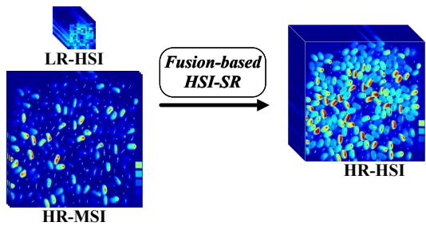  
Figure 1: Illustration of fusion-based Hyperspectral Image Super-Resolution (HSI-SR).

Over the past few decades, a significant amount of research efforts have been devoted to developing HSI-SR approaches, which can be roughly classified into five categories [44]: Extensions of pansharpening [5, 25, 27], Bayesian inference-based methods [1, 29], matrix factorization-based methods [2], tensor-based methods [18], and deep learning (DL)-based methods [31]. Whilst pansharpening methods [26] have been extended to the field of HSI-SR, such approaches are prone to spectral distortion. Bayesian inference-based approaches rely on the assumption of prior knowledge, thereby having a weak flexibility in dealing with different HSI structures. Matrix factorizationbased techniques reshape the 3D HSIs and MSIs into matrices, thus facing the challenge of learning the required relationship between space and spectrum. Although several tensor-based methods have been proposed that can maintain the 3D structure of input images, they consume much more memory and computational power. Furthermore, these traditional approaches work via relying heavily on hand-crafted priors.

Recently, DL-based methods, especially convolutional neural network (CNN)-based approaches, have flooded over into the HSI-SR research community [8, 31, 10, 22, 46, 43, 19]. Rather than resorting to hand-crafted features, DLbased techniques learn prior knowledge automatically from given data. Particularly, Dong et al. proposed the first DLbased method for image SR, with the end-to-end mapping between LR images and HR images learned using a CNN [9]. Subsequently, generative adversarial networks (GANs) were introduced to the field of image SR in an effort to produce high-frequency details [17, 11]. After that, various GAN-based models have been devised, showing state-ofthe-art results in the HSI-SR literature [24]. However, such work requires carefully designed regularization and optimization tricks to tame optimization instability and avoid mode collapse.

Inspired by the recent developments in deep generative models [14, 23], in this paper, we propose an innovative approach that we refer to as HSR-Diff (HSI-SR with conditional diffusion models). It works by learning to transform the original standard normal distribution into the data distribution of HR-HSI through a sequence of refinements. In contrast to GAN-based methods which require inner-loop maximization, HSR-Diff operates by simply minimizing a well-defined loss function to learn prior knowledge. Although conditional diffusion models are straightforward to define and efficient to train, there has been no demonstration that they are capable of merging LR-HSI and HR-MSI to the best of our knowledge. We show that conditional diffusion models are capable of generating high-quality HR-HSIs, which may best the state-of-the-art results.

A key factor of HSR-Diff is its inherent denoising ability thanks to use of deep neural networks. In spite of the effectiveness of CNNs for denoising, they have shown limitations in modelling long-range dependencies. Some previous transformer-based HSI-SR works, especially Pyramid Shuffle-and-Reshuffle Transformer (PSRT) [7], Transformer-based Fusion network (Fusformer) [15], and Hyperspectral and Multispectral image Fusion Transformer (HMF-Former) [40], all of which learn long-range dependencies with attention mechanisms. These Transformers only take LR-HSI and HR-MSI as input, while the denoising Transformer is also fed with noise level γ and noisy HR-HSI. To comprehensively exploit the spatial and spectral information in the LR-HSI, HR-MSI, and noisy HR-HSI, a Conditional Denoising Transformer (CD-Former) is herein designed and trained with a denoising objective to remove various levels of noise iteratively. In addition, a progressive learning strategy is utilized to help the CDFormer learn the global statistics of full-resolution HSIs. The main contributions of this work are summarized as follows:

• We propose the novel application of conditional diffusion models in the field of HSI-SR that works by progressively destroying HR-HSI through injecting noise and subsequently learning to reverse this process, in order to perform HSI-SR. To the best of our knowledge, this is the first work to exploit diffusion models within the realm of HSI-SR.

• We introduce a CDFormer that refines a noisy HR-HSI conditioned on the deep feature maps of HR-MSI and LR-HSI, capable of modelling global connectivity with self-attention. Rather than concatenation, cross-attention is utilized as the conditioning mechanism to incorporate spatio-spectral information and noise level.

• We employ a progressive learning strategy to exploit the global information of full-resolution HSIs, with CDFormer being trained on small image patches in the early epochs with high efficiency and on the global images in the later epochs to acquire global information.

• We present experimental investigations on four public datasets, with quantitative and qualitative results illustrating the superior performance of our approach as compared with state-of-the-art methods.

## 2. Related Work

## 2.1. Diffusion models

Typical deep generative models include autoregressive models (AR), normalizing flows (NF), variational autoencoders (VAE), GANs, diffusion models, etc. Over the past decade, GANs have gained prominence as a pivotal technology in the challenging field of image synthesis. However, this landscape has seen a transformation with the emergence of diffusion models, which have rapidly become a prominent research avenue across diverse domains, such as natural language processing, image processing, and computer vision. Diffusion models have arisen as an innovative approach that operates by iteratively refining a noise vector into the desired output. This reversible process allows for the generation of high-quality samples and has proven versatile in various applications.

The development of diffusion models has seen a dramatically accelerating pace over the past three years. In the field of computer vision, diffusion models have shown promise in tasks like image segmentation [33], object detection [30], and even video processing [13]. Whilst diffusion models have shown great potential for a variety of computer vision applications, none of them have yet been devoted to the problem of HSI-SR to the best of our knowledge. In this paper, we extend the utility of diffusion models to the field of HSI-SR.

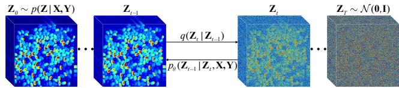  
Figure 2: Forward and reverse processes of HSR-Diff, with forward process q generating an HSI sequence (left to right) by gradually adding Gaussian noise, and reverse process p iteratively refining HR-HSI (right to left).

## 2.2. Deep Learning-Based HSI-SR

In recent years, data-driven CNN architectures have been shown to outperform traditional approaches for use in the HSI-SR literature. These methods formulate the underlying fusion problem as a highly nonlinear mapping that takes HR-MSIs and LR-HSIs as input to generate an optimal HR-HSI. For example, CMHF-net [31] is an interpretable CNN, the design of which exploits the deep unfolding technique. Zhang et al. [43] proposed to reconstruct HR-HSIs with a two-stage network, while Zhang et al. [45] designed an interpretable spatial-spectral reconstruction network (SSR-NET) based on CNN. Aiming at problems of inflexible structure and information distortion, Jin et al. embedded Bilateral Activation Mechanism into ResNet, resulting in the effective model of BRResNet [16]. Thanks to the inductive bias of CNN, such as locality and weight sharing, these methods can provide good generalization performance and achieve impressive results. Nevertheless, CNNs have limitations in capturing long-range dependencies and self-similarity priors. To overcome such shortcomings, some Transformer-based HSI-SR approaches [15, 40] have been proposed.

Within this study, the CDFormer serves as the denoising network in conditional diffusion models. It harnesses selfattention to learn global statistics from full-resolution HSIs and MSIs and employs cross-attention as the conditioning mechanism.

## 3. Proposed Methodology

## 3.1. Problem Formulation

Without losing generality, the observation models for the HR-MSI and LR-HSI of interest can be mathematically formulated as

$$
\begin{array} { r } { \mathbf { X } = \mathbf { R } \mathbf { Z } } \\ { \mathbf { Y } = \mathbf { Z } \mathbf { D } , } \end{array}\tag{1}
$$

where $\mathbf { X } \in \mathbb { R } ^ { b \times H W }$ denotes the HR-MSI which consists of b spectral bands with a resolution of HW in the spatial domain; $\mathbf { R } \in \mathbb { R } ^ { b \times B }$ represents the spectral response function of HR-MSI; $\mathbf { Y } \in \mathbb { R } ^ { B \times h w }$ denotes the LR-HSI; and $\mathbf { Z } \in \mathbb { R } ^ { B \times H W }$ is the HR-HSI. In the above, b and B are the numbers of bands, with h and H being the band height, and w and W the width, where $b \ll B , h \ll H .$ , and $w \ll W$ $\mathbf { D } \in \mathbb { R } ^ { H W \times h w }$ is the spatial response of the LR-HSI, which can be modelled with blurring and down-sampling operations. The HSI-SR can be interpreted as an inverse problem for merging a practically collected X and an observed Y to produce a latent Z. In this paper, the ideal Z is restored with HSR-Diff conditioned on spatio-spectral information of X and Y, the details of which are described below.

## 3.2. HSI-SR with Conditional Diffusion Models

Given a dataset $\mathcal { D } _ { t r a i n } ~ = ~ \{ { \bf X } ^ { i } , { \bf Y } ^ { i } , { \bf Z } ^ { i } \} _ { i = 1 } ^ { N }$ satisfying a certain joint probability distribution $p \left( \mathbf { X } , \mathbf { Y } , \mathbf { Z } \right)$ , many pairs of (X, Y) may be consistent with the same Z. Thus, the HR-HSI Z can be obtained with iterative refinement that provide an approximate $\mathrm { t o } p \left( \mathbf { Z } | \mathbf { X } , \mathbf { Y } \right)$ . In this work, we implement the process of iterative refinement with HSR-Diff, where the optimized HR-HSI is presumed to be produced in $T$ refinement steps. In HSR-Diff, the target HR-HSI is initialized with a pure noise $\mathbf { Z } _ { T } \sim \mathcal { N } ( \mathbf { 0 } , \mathbf { I } )$ as shown in Figure 2. The HSI is then refined iteratively according to learned conditional distributions pθ $( { \bf Z } _ { t - 1 } | { \bf Z } _ { t } , { \bf X } , { \bf Y } )$ . In so doing, the image sequence $( { \bf Z } _ { T - 1 } , { \bf Z } _ { T - 2 } , \ldots , { \bf Z } _ { 0 } )$ can be attained and ultimately ${ \bf Z } _ { 0 } \sim p \left( { \bf Z } | { \bf X } , { \bf Y } \right)$

The HSR-Diff makes use of two processes: a forward process that perturbs HR-HSI $\mathbf { Z } _ { 0 }$ to noise, and a reverse process converting noise back to HR-HSI $\mathbf { Z } _ { 0 }$ . In the forward process, the intermediate images, i.e., ${ \bf Z } _ { T - 1 } , { \bf Z } _ { T - 2 }$ · · · , and $\mathbf { Z } _ { 1 }$ , are generated according to a Markov chain with fixed transition probability $q \left( \mathbf { Z } _ { t } | \mathbf { Z } _ { t - 1 } \right)$ . We are interested in reversing the process via iterative refinement, in which the noise is reduced iteratively with a reverse Markov chain conditioned on X and Y. The reverse chain is learned with the CDFormer $f _ { \theta }$ . Further details of HSR-Diff’s working are given below.

## 3.2.1 Forward Process

Inspired by [14], forward process q iteratively adds Gaussian noise to $\mathbf { Z } _ { 0 }$ over T iterations:

$$
\begin{array} { r l } & { \displaystyle q \left( \mathbf { Z } _ { 1 : T } \mid \mathbf { Z } _ { 0 } \right) = \prod _ { t = 1 } ^ { T } q \left( \mathbf { Z } _ { t } \mid \mathbf { Z } _ { t - 1 } \right) } \\ & { \displaystyle q \left( \mathbf { Z } _ { t } \mid \mathbf { Z } _ { t - 1 } \right) = \mathcal { N } \left( \mathbf { Z } _ { t } ; \sqrt { \alpha _ { t } } \mathbf { Z } _ { t - 1 } , \left( 1 - \alpha _ { t } \right) \mathbf { I } \right) , } \end{array}\tag{2}
$$

where $\alpha _ { 1 : T } \in ( 0 , 1 )$ are scalar hyper-parameters. Note that in the forward process, the distribution of $\mathbf { Z } _ { t }$ given $\mathbf { Z } _ { 0 }$ can

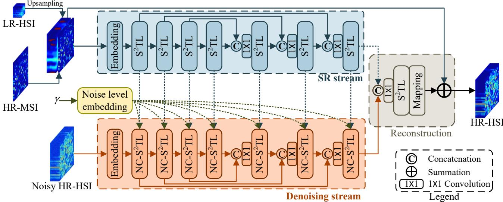  
Figure 3: Architecture of Conditional Denoising Transformer.

be directly sampled in closed form. This implies that

$$
q \left( \mathbf { Z } _ { t } \mid \mathbf { Z } _ { 0 } \right) = \mathcal { N } \left( \mathbf { Z } _ { t } ; \sqrt { \gamma _ { t } } \mathbf { Z } _ { 0 } , \left( 1 - \gamma _ { t } \right) \mathbf { I } \right) ,\tag{3}
$$

where $\textstyle \gamma _ { t } = \prod _ { i = 1 } ^ { t } \alpha _ { i }$ . In addition, the posterior distribution of $\mathbf { Z } _ { t - 1 }$ given $\mathbf { Z } _ { 0 }$ and $\mathbf { Z } _ { t }$ can be derived by

$$
\begin{array} { r l } & { q \left( \mathbf { Z } _ { t - 1 } \mid \mathbf { Z } _ { 0 } , \mathbf { Z } _ { t } \right) = \mathcal { N } \left( \mathbf { Z } _ { t - 1 } ; \mu , \sigma ^ { 2 } \mathbf { I } \right) } \\ & { \mu = \frac { \sqrt { \gamma _ { t - 1 } } \left( 1 - \alpha _ { t } \right) } { 1 - \gamma _ { t } } \mathbf { Z } _ { 0 } + \frac { \sqrt { \alpha _ { t } } \left( 1 - \gamma _ { t - 1 } \right) } { 1 - \gamma _ { t } } \mathbf { Z } _ { t } } \\ & { \sigma ^ { 2 } = \frac { \left( 1 - \gamma _ { t - 1 } \right) \left( 1 - \alpha _ { t } \right) } { 1 - \gamma _ { t } } . } \end{array}\tag{4}
$$

As the CDFormer is tasked with predicting $\mathbf { Z } _ { 0 }$ , the posterior is useful in the reverse process.

## 3.2.2 Reverse Markovian Process

The reverse process inferences $\mathbf { Z } _ { 0 }$ via iterative refinement. It starts from a pure Gaussian noise $\mathbf { Z } _ { T }$ and goes in the opposite direction of the forward process:

$$
\begin{array} { r l } & { p _ { \theta } \left( \mathbf { Z } _ { 0 : T } \mid \mathbf { X } , \mathbf { Y } \right) = p \left( \mathbf { Z } _ { T } \right) \underset { t = 1 } { \overset { T } { \prod } } p _ { \theta } \left( \mathbf { Z } _ { t - 1 } \mid \mathbf { Z } _ { t } , \mathbf { X } , \mathbf { Y } \right) } \\ & { ~ p \left( \mathbf { Z } _ { T } \right) = \mathcal { N } \left( \mathbf { Z } _ { T } ; \mathbf { 0 } , \mathbf { I } \right) } \\ & { p _ { \theta } \left( \mathbf { Z } _ { t - 1 } \mid \mathbf { Z } _ { t } , \mathbf { X } , \mathbf { Y } \right) = \mathcal { N } \left( \mathbf { Z } _ { t - 1 } ; \mu _ { \theta } \left( \mathbf { X } , \mathbf { Y } , \mathbf { Z } _ { t } , \gamma _ { t } \right) , \sigma _ { t } ^ { 2 } \mathbf { I } \right) } \end{array}\tag{5}
$$

where the distribution pθ $( \mathbf { Z } _ { t - 1 } \mid \mathbf { Z } _ { t } , \mathbf { X } , \mathbf { Y } )$ is parameterized with θ. Note that the CDFormer provides a prediction of $\hat { \mathbf { Z } } _ { 0 }$ . Thus, according to (4), each refinement step takes

the following form:

$$
\begin{array} { r l r } {  { \mathbf { Z } _ { t - 1 } = \frac { \sqrt { \gamma _ { t - 1 } } ( 1 - \alpha _ { t } ) } { 1 - \gamma _ { t } } f _ { \theta } ( \mathbf { X } , \mathbf { Y } , \mathbf { Z } _ { t } , \gamma _ { t } ) } } \\ & { } & { + \frac { \sqrt { \alpha _ { t } } ( 1 - \gamma _ { t - 1 } ) } { 1 - \gamma _ { t } } \mathbf { Z } _ { t } + \sqrt { 1 - \alpha _ { t } } \epsilon , } \end{array}\tag{6}
$$

where $\epsilon \sim \mathcal { N } ( \mathbf { 0 } , \mathbf { I } )$ and $f _ { \theta }$ is the CDFormer.

## 3.2.3 Noise Schedule

Inspired by the research reported in [4], we sample γ with two steps during training. In particular, we first sample a time step $t \sim U \{ 1 , T \}$ and then randomly select $\gamma \sim$ $U \left( \gamma _ { t - 1 } , \gamma _ { t } \right)$ . As such, $\begin{array} { r } { \gamma \sim p \left( \gamma \right) = \sum _ { t = 1 } ^ { T } \frac { 1 } { T } U \left( \gamma _ { t - 1 } , \gamma _ { t } \right) } \end{array}$ Normally, the model with a large $T$ can achieve better results. However, we find (through empirical investigations) that the performance is not very sensitive to the exact values of $T .$ . Therefore, no hyper-parameter search about T is conducted and we set $T = 2 0 0 0$ for simplicity. As for the inference process, we set the maximum generation iterations to 100, employing a linear noise schedule.

## 3.3. Conditional Denoising Transformer

The property of non-local self-similarity of HSIs is often exploited in denoising tasks but is usually not well captured by CNN-based models. Due to the effectiveness of Transformer layer in capturing non-local long-range dependencies, the potential of Transformer is explored in conditional denoising of HSI. Unfortunately, the vanilla Transformer focuses only on spatial relationships between pixels while neglecting the spectral dimension. Besides, denoising networks in conditional diffusion models normally concatenate all images together as input, which may hinder the extraction of useful spatio-spectral information in LR-HSIs and HR-MSIs. Hence, the CDFormer adopts a two-stream architecture and is constructed with stacked Spatio-Spectral Transformer Layers $\mathrm { ( S ^ { 2 } T L s ) }$

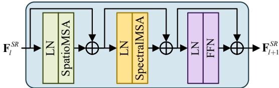  
Figure 4: Spatio-Spectral Transformer Layer, where $\bf \tilde { \Phi } \mathrm { L N } ^ { \prime \prime }$ denotes layer normalization.

The architecture of the CDFormer is shown in Figure 3. The SR stream first utilizes a $3 \times 3$ convolution to generate low-level feature embeddings $\mathbf { F } _ { 0 } ^ { S R }$ and then transforms it into deep features $\mathbf { F } _ { l } ^ { S R }$ with stacked- $S ^ { 2 } \mathrm { T L s }$ . Instead of adopting t as done in the existing work [4], our method is conditioned on $\gamma$ directly to achieve efficient generation. The denoising stream contains multiple noise-aware conditional $\mathrm { S ^ { 2 } T L s \ ( N C { - } S ^ { 2 } T L s ) }$ that take as input the embedded noise level and the image representation $\mathbf { F } ^ { S R }$ . The Reconstruction module is set to produce a noise-free HR-HSI, by employing residual learning to alleviate the difficulty of HR-HSI generation while mapping the features onto HR-HSI via a 3×3 convolution and addition operation. It should be noted that no downsampling operation is employed.

## 3.3.1 Noise Level Embedding

The noise level offers essential information for denoising models. Inspired by the work of [4], we embed noise level within the models with sinusoidal positional encoding. The process of noise level embedding (NLE) can be formulated as follows:

$$
\begin{array} { r } { N L E _ { \gamma , 2 i } = \sin \left( \gamma / 1 0 0 0 0 ^ { 2 i / C } \right) } \\ { N L E _ { \gamma , 2 i + 1 } = \cos \left( \gamma / 1 0 0 0 0 ^ { 2 i / C } \right) , } \end{array}\tag{7}
$$

where C is the number of channels of $\mathsf { S } ^ { 2 } \mathrm { T L s } ; i \in [ 1 , C / 2 ]$

## 3.3.2 Spatio-Spectral Transformer Layers

Figure 4 illustrates the architecture of one $\mathrm { S ^ { 2 } T L }$ , which consists of a Spatial Multi-head Self-Attention (SpatioMSA), a Spectral Multi-head Self-Attention (SpectralMSA), and a Feed Forward Network (FFN). SpatioMSA and SpectralMSA learn the interactions of spatial regions and interspectra relationships, respectively. To alleviate the computational burden, we adopt the transposed attention [41] in

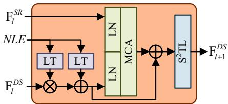  
Figure 5: Noise-Aware Conditional Spatio-Spectral Transformer Layer, where $^ { 6 6 } \mathrm { L T } ^ { 5 }$ represents linear transform, $\bf \tilde { \Phi } \mathrm { L N } ^ { \prime \prime }$ denotes layer normalization, and $\mathbf { \hat { \mu } _ { M C A } } ^ { * }$ is the abbreviation of multi-head cross-attention.

SpectralMSA. SpatioMSA applies the popular window partitioning strategy [20] to reduce the computational complexity. In addition, the gating mechanism [41] is employed in the implementation of FFN.

## 3.3.3 Noise-Aware Conditional $\mathbf { S ^ { 2 } T L s }$

To condition the overall model on the hierarchical features of SR stream, we feed $\mathbf { F } _ { l } ^ { S R }$ to the Noise-Aware Conditional $\mathrm { S ^ { 2 } T L s \ ( N C { - } S ^ { 2 } T L s ) }$ , each of which is a key building block of the denoising stream. Figure 5 depicts the structure of an $\mathrm { N C - S ^ { 2 } T I }$ , which takes as input the NLE (a vector), $\mathbf { F } _ { l } ^ { S R }$ and $\mathbf { F } _ { l } ^ { D S }$ , where $\mathbf { F } _ { l } ^ { S R }$ and $\mathbf { \dot { F } } _ { l } ^ { D S }$ have the same spatial resolution. $N L E$ is first transformed and merged with $\mathbf { F } _ { l } ^ { D S }$ with the result subsequently processed with the means of multi-head cross-attention (MCA) [3] in order to condition the model on $\mathbf { F } _ { l } ^ { S R }$ . As a result, each $\mathrm { S ^ { 2 } T L }$ learns the spatiospectral dependencies.

## 3.4. Progressive Learning Strategy

Deep learning-based HSI-SR models are normally trained on small cropped patches. However, on one hand, training the proposed CDFormer on fixed-size image patches may not appropriately reflect the global relationships, which may result in suboptimal performance on fullresolution images when used. On the other hand, during the training phase, CDFormer can not be uploaded to Graphics Processing Unit (GPU) because of the limited memory. With this objective in mind, we adopt a strategy of progressive learning. In the initial epochs, the network is trained using smaller image patches. Subsequently, as training progresses, we transition towards utilizing larger patches, and ultimately, full-resolution images in the concluding training epochs. The resulting model, cultivated through the integration of varying sizes via progressive learning, exhibits notable enhancements in performance during testing. This is particularly evident when handling images of diverse resolutions, a scenario frequently encountered in the realm of the HSI-SR task.

To reduce the pressure on the demand of GPU memory, we only train the second half of CDFormer on fullresolution images. The loss function used for such training is defined as follows:

$$
\begin{array} { r l } & { { \mathcal { L } } = \| { \mathbf { X } } - { \mathbf { R } } \hat { { \mathbf { Z } } } _ { 0 } \| _ { 1 } + \| { \mathbf { Y } } - \hat { { \mathbf { Z } } } _ { 0 } { \mathbf { D } } \| _ { 1 } + \| { \mathbf { Z } } _ { 0 } - \hat { { \mathbf { Z } } } _ { 0 } \| _ { 1 } } \\ & { \hat { { \mathbf { Z } } } _ { 0 } = f _ { \theta } ( \sqrt { \gamma } { \mathbf { Z } } _ { 0 } + \sqrt { 1 - \gamma } \epsilon , { \mathbf { X } } , { \mathbf { Y } } ) , } \end{array}\tag{8}
$$

where $\epsilon \sim \mathcal { N } \left( \mathbf { 0 } , \mathbf { I } \right) , ( \mathbf { X } , \mathbf { Y } , \mathbf { Z } )$ is sampled from the training set, and the noise schedule about $\gamma$ has been discussed above. The first two terms are designed according to the observation models, while the last one is based on the assumption of Laplace distribution.

## 4. Experiments

Systematic experiments are herein conducted on four commonly-used public-available HSI-SR datasets to demonstrate the effectiveness of the proposed approach.

## 4.1. Datasets

Four datasets including CAVE [38], PaviaU [21], Chikusei [39], and HypSen [37] are used in our experiments, with the following details on each.

CAVE: There are 32 scenes with a spatial size of 512 × 512 in the CAVE dataset, where we select the first 20 HSIs for training, with the remaining 12 images used for testing. We generate LR-HSIs by Gaussian blur and down-sampling using a factor of 32 as done in [31]. HR-MSIs are acquired by integrating all HR-HSI bands according to the spectral response function of Nikon D700. The original HR-HSIs are treated as ground truth.

PaviaU: Collected by the University of Pavia, Italy, the original HSI dataset consists of $6 1 0 \times 3 4 0$ pixels in which the top-left $1 2 8 \times 1 2 8$ area is extracted as the test data, with the remaining used for training. Except for water absorption bands, all other 103 bands are chosen for the experiments. Note that the down-sampling factor for the generation of LR-HSIs is four, and the spectral response function is the same as that of the WorldView-3 satellite.

Chikusei: This dataset consists of 128 bands with a spectral range of 363 nm to 1018 nm and a spatial resolution of $2 5 1 7 \times 2 3 3 5$ . The original HSI data was taken by an airborne visible and near-infrared imaging sensor over Chikusei, Japan. To alleviate the impact of the back boundary and noise, we crop the center area and remove noise bands. The processed image has a size of $2 0 4 8 \times 2 0 4 8 \times 1 1 0$ . The top half $1 0 2 4 \times 2 0 4 8 \times 1 1 0$ area is selected as the training data, while the rest half is split into eight testing $5 1 2 \times 5 1 2 \times 1 1 0$ patches. For the production of LR-HSIs and HR-MSIs, this dataset adopts the same processing as with PaviaU.

HypSen: This dataset concerns a real scenario consisting of a 30m-resolution HSI and a 10m-resolution MSI. The Hyperion sensor on the Earth Observing-1 satellite provided the HSI with 242 spectral bands in the spectral range of 400 nm to 2500 nm, and the MSI with 13 bands was captured by the Sentinel-2A satellite. The blue, green, red, and near-infrared bands of MSI in our experiments are selected due to their high spatial resolution. To eliminate the impact of noise and water absorption, we remove those relevant bands, with 84 bands remaining in the HSI. We crop subimages of size 250×330 and 750×990 from the Hyperion HSI and Sentinel-2A MSI respectively, in our study, with the pairs of sub-image patches spatially registered.

## 4.2. Methods Compared and Evaluation Metrics Used

Six state-of-the-art HSI-SR approaches are taken for comparison, including: UTV-TD [34], UAL [43], BRRes-Net [16], Fusformer [15], CMHF-Net [31], and UAL-DMI [28]. UTV-TD is a tensor-based technique; UAL, BRRes-Net, Fusformer, and CMHF-Net fall into the category of the DL-based methods; and UAL-DMI can be regarded as an upgraded version of UAL.

Four quantitative quality metrics are employed for performance evaluation, including Peak Signal-to-Noise Ratio (PSNR), Spectral Angle Mapper (SAM), Erreur Relative Globale Adimensionnelle de Synthese (ERGAS, namely er-\` ror relative global dimensionless synthesis), and Structure Similarity (SSIM). The smaller ERGAS and SAM are, the larger PSNR and SSIM are, the better the fusion result is.

## 4.3. Implementation Specification

All DL-based methods are trained on the same datasets. For those compared methods, we use the publicly available source codes with default hyper-parameters as given in the corresponding research papers. Our HSR-Diff is implemented on the PyTorch framework. The learnable parameters of the CDFormer are initialized with Kaiming initialization [12] and trained on 2 NVIDIA GeForce GTX 3090s. The dimension of the embedding of $F _ { 0 } ^ { S R }$ and $F _ { 0 } ^ { D S }$ is set to 256, and the number of parameters of the CDFormer is 31.56M. We utilize the Adam optimizer with $\beta _ { 1 } = 0 . 9$ and $\beta _ { 2 } = 0 . 9 9 9$ to optimize the CDFormer. With limited GPU memory, the batch size is set to 4 and 2 for $1 2 8 ^ { 2 }$ and $5 1 2 ^ { 2 }$ images, respectively. It costs 20000 epochs on the CAVE and PaviaU datasets while consuming 5000 epochs on the Chikusei dataset. The learning rate is initialized as $1 \times 1 0 ^ { - 4 }$

## 4.4. Comparisons with State-of-the-art Methods

In this set of experiments, the evaluations are carried out using the first three datasets listed above without involving the real-world dataset, HypSen (which will be dealt with in the next section).

0.00008  
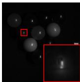

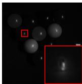

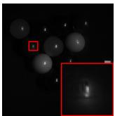

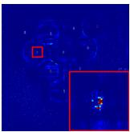  
(a) UTV-TD

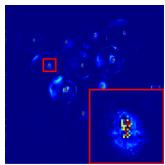

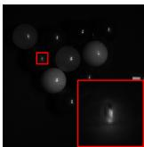

(b) UAL  
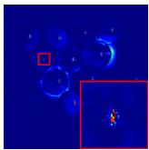  
(c) BRResNet

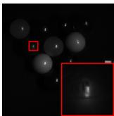

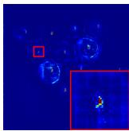

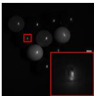

(d) CMHF-Net  
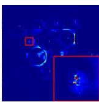  
(e) Fusformer

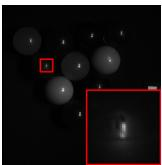

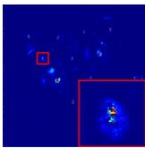  
(f) UAL-DMI

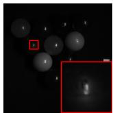

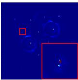  
(g) HSR-Diff

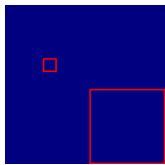  
0.0000 0.0002  
(h) Ground truth  
0.0004

Figure 6: Visual quality comparison for fused HSIs of all competing methods on CAVE, where first and second rows show fourth band and corresponding heatmaps (mean squared error), respectively.

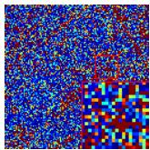  
(a) UTV-TD

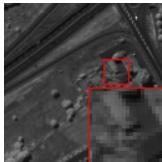

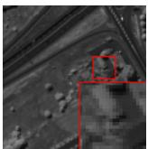

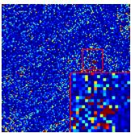  
(b) UAL

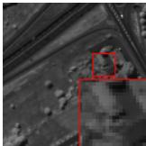

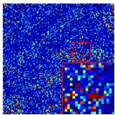  
(c) BRResNet  
0.00000

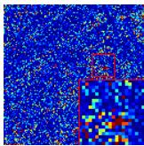  
0.00002

  
(d) CMHF-Net  
0.00004

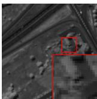

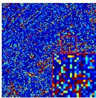  
(e) Fusformer  
0.00006

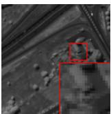

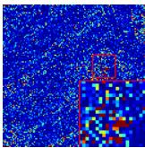  
(f) UAL-DMI

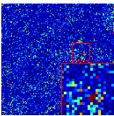  
(g) HSR-Diff  
0.00010

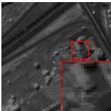

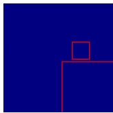  
(h) Ground truth

Figure 7: Visual quality comparison for fused HSIs of all competing methods on PaviaU, where first and second rows show 81st band and corresponding heatmaps (mean squared error), respectively.

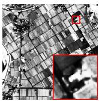

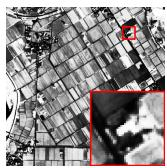

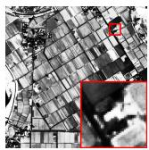

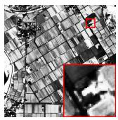

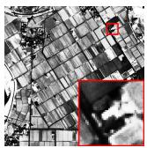

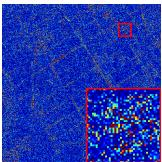

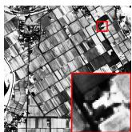

(a) UTV-TD  
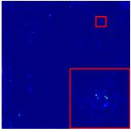  
(b) UAL

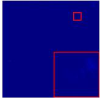  
(c) BRResNet

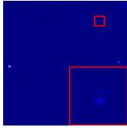  
(d) CMHF-Net

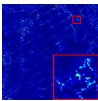  
(e) Fusformer

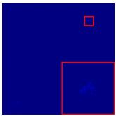  
(f) UAL-DMI

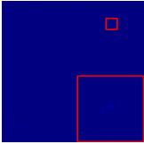  
(g) HSR-Diff

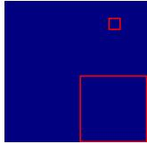  
(h) Ground truth

Figure 8: Visual quality comparison for fused HSIs of all competing methods on Chikusei, where first and second rows show 67th band and corresponding heatmaps (mean squared error), respectively.

<table><tr><td>Dataset Methods</td><td></td><td>PSNR↑ SSIM↑ SAM↓ ERGAS↓</td><td></td></tr><tr><td rowspan="7">CAVE</td><td>UTV-TD [34] 38.66 UAL [43] 40.55</td><td>0.9799 7.98 0.9933 4.33</td><td>0.329 0.271</td></tr><tr><td>BRResNet [16] CMHF-Net [31] 42.54</td><td>41.36 0.9929 4.70</td><td>0.250</td></tr><tr><td>Fusformer [15] 41.52</td><td>0.9939 4.69 0.9934</td><td>0.216</td></tr><tr><td></td><td>4.71</td><td>0.243</td></tr><tr><td>UAL-DMI [28] 42.74 44.33</td><td>0.9950 3.79</td><td>0.213</td></tr><tr><td>HSR-Diff</td><td>0.9951 3.71</td><td>0.179</td></tr><tr><td>UTV-TD [34] 44.46 UAL [43] 45.42</td><td>0.9952 1.80 1.54</td><td>1.236</td></tr><tr><td rowspan="5"></td><td></td><td>0.9964</td><td>1.148</td></tr><tr><td>BRResNet [16] 45.53</td><td>0.9965 1.53</td><td>1.111</td></tr><tr><td>PaviaU CMHF-Net [31] 45.77</td><td>0.9965 1.50</td><td>1.096</td></tr><tr><td>Fusformer [15] 45.66</td><td>0.9965 1.52</td><td>1.109</td></tr><tr><td>UAL-DMI [28] 45.68 HSR-Diff</td><td>0.9966 1.49</td><td>1.113</td></tr><tr><td rowspan="7"></td><td>UTV-TD [34]</td><td>46.47 0.9977 48.38</td><td>1.45 1.053 0.99</td></tr><tr><td>UAL [43]</td><td>0.9989</td><td>1.303</td></tr><tr><td>56.18 BRResNet [16] 56.79</td><td>0.9998 0.49</td><td>0.421</td></tr><tr><td></td><td>0.9998 0.46</td><td>0.366</td></tr><tr><td>Chikusei CMHF-Net [31] 55.99</td><td>0.9998 0.50</td><td>0.483</td></tr><tr><td>Fusformer [15] 55.92</td><td>0.9998 0.52</td><td>0.492</td></tr><tr><td>UAL-DMI [28] 56.57 HSR-Diff 57.34</td><td>0.9998 0.47 0.9999 0.43</td><td>0.387 0.324</td></tr></table>

Table 1: Averaged PSNR, SSIM, SAM, and ERGAS of compared methods on CAVE, PaviaU, and Chikusei datasets. The ↑ or ↓ indicates higher or lower values corresponding to better results.

Qualitative Comparison. To assess the performance of HSR-Diff qualitatively, we visualize example bands of HSIs in Figures 6, 7, and 8. It can be seen from these visual results that all compared methods produce satisfactory outcomes. In particular, HSR-Diff generates gives the best result with minor errors since the corresponding MSE (mean squared error) images are much clearer than the others.

Quantitative Comparison. To further verify the superior performance of the proposed HSR-Diff, quantitative results are presented in Table 1. Note that the performance indices on the CAVE and Chikusei datasets are averaged over all testing samples (12 samples for CAVE and eight samples for Chikusei), respectively. It can be inferred from the results that the proposed HSR-Diff surpasses all competitors with a clear margin on all evaluation metrics.

## 4.5. Ablation Study

Effect of conditional diffusion models. Much of the early work on HSI-SR was based on the use of the regression model. To compare the effects of the diffusion and the regression model, we train the regression model containing the CDFormer. Note that the loss function, optimizer, and hyper-parameters are all the same as the conditional diffusion models. Figure 9 presents the fused results and corresponding error maps of utilising HSR-Diff and the regression model. As can be seen from the error maps, the HSIs produced by HSR-Diff have less distortion than those by the regression model. This is because HSR-Diff works with a series of iterative refinement steps, facilitating the capture of richer information on data distributions of HR-HSIs. Furthermore, Table 2 showcases the quantitative results and effectively highlights the significant contribution of iterative refinement.

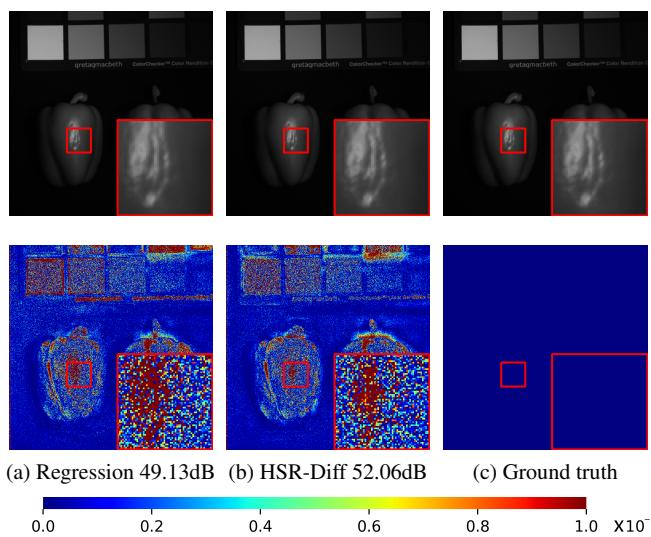  
Figure 9: Fusion results for HSR-Diff and Regression on the real and fake peppers image of CAVE. The PSNR values (dB) are given in the subtitles.

<table><tr><td>Dataset Model</td><td colspan="4">PSNR↑ SSIM↑ SAM↓ ERGAS ↓</td></tr><tr><td>CAVE</td><td>Regression</td><td>43.26 0.9942</td><td>4.03</td><td>0.193</td></tr><tr><td rowspan="2">PaviaU</td><td>CDFormer</td><td>44.33 0.9951</td><td>3.71</td><td>0.179</td></tr><tr><td>Regression</td><td>46.03 0.9968</td><td>1.52</td><td>1.178</td></tr><tr><td rowspan="2">Chikusei</td><td>CDFormer</td><td>46.47 0.9977</td><td>1.45</td><td>1.053</td></tr><tr><td>Regression</td><td>56.71 0.9999</td><td>0.47</td><td>0.372</td></tr><tr><td rowspan="2"></td><td>CDFormer</td><td>57.34 0.9999</td><td>0.43</td><td>0.324</td></tr><tr><td></td><td></td><td></td><td></td></tr></table>

Table 2: Ablation study on conditional diffusion models. The ↑ or ↓ indicates higher or lower values corresponding to better results.

Effect of CDFormer. Recall that CDFormer is conditioned on the hierarchical representations of HR-MSI and LR-HSI via a two-stream architecture. However, alternative outstanding diffusion models [14, 23] that are also excellent for conditional image generation are equipped with CNNbased U-Nets, where degenerated images are concatenated with noisy high-resolution output images. To show the effectiveness of hierarchical representations, we remove the

  
(a) HSI

  
(b) UTV-TD

  
(c) UAL

  
(d) BRResNet

  
(e) CMHF-Net

  
(f) UAL-DMI

  
(g) HSR-Diff

Figure 10: Visual fusion results of all competing methods for HypSen.
<table><tr><td>Dataset Network</td><td>PSNR↑</td><td>SSIM↑</td><td>SAM↓ ERGAS↓</td></tr><tr><td rowspan="3">CAVE</td><td>CD-CNN</td><td>38.84 0.9797</td><td>7.32</td><td>0.318</td></tr><tr><td>C-w/o-SR</td><td>43.74 0.9942</td><td>3.94</td><td>0.188</td></tr><tr><td>CDFormer</td><td>44.33 0.9951</td><td>3.71</td><td>0.179</td></tr><tr><td rowspan="3">PaviaU</td><td>CD-CNN</td><td>42.75 0.9962</td><td>1.75</td><td>1.362</td></tr><tr><td>C-w/o-SR</td><td>46.08 0.9976</td><td>1.47</td><td>1.080</td></tr><tr><td>CDFormer</td><td>46.47 0.9977</td><td>1.45</td><td>1.053</td></tr><tr><td rowspan="3"></td><td>CD-CNN</td><td>47.63 0.9980</td><td>1.20</td><td>1.794</td></tr><tr><td>Chikusei C-w/o-SR</td><td>56.68 0.9999</td><td>0.46</td><td>0.425</td></tr><tr><td>CDFormer</td><td>57.34 0.9999</td><td>0.43</td><td>0.324</td></tr></table>

Table 3: Ablation study on CDFormer. The ↑ or ↓ indicates higher or lower values corresponding to better results.

<table><tr><td>Dataset Methods</td><td></td><td>PSNR ↑ SSIM↑</td><td></td><td>SAM↓ ERGAS↓</td></tr><tr><td rowspan="2">CAVE</td><td>Fixed</td><td>43.17 0.9927</td><td>4.99</td><td>0.203</td></tr><tr><td>Progressive</td><td>44.33 0.9951</td><td>3.71</td><td>0.179</td></tr><tr><td rowspan="2">PaviaU</td><td>Fixed</td><td>45.06 0.9970</td><td>1.63</td><td>1.173</td></tr><tr><td>Progressive</td><td>46.47 0.9977</td><td>1.45</td><td>1.053</td></tr><tr><td rowspan="2">Chikusei</td><td>Fixed</td><td>55.92 0.9999</td><td>0.50</td><td>0.453</td></tr><tr><td>Progressive</td><td>57.34 0.9999</td><td>0.43</td><td>0.324</td></tr></table>

Table 4: Ablation study on progressive learning. The ↑ or ↓ indicates higher or lower values corresponding to better results.

SR stream of CDFormer and name the resulting network $\bf \ddot { \omega } \mathrm { C - w / o - } \bf S R ^ { \alpha \mathrm { , } \qquad }$ . In addition, we compare CDFormer with a CNN version of CDFormer that replaces all $\mathbf { S } ^ { 2 } \mathrm { T I }$ with convolutional layers and show its results as “CD-CNN” in Table 3. The quantitative results show the use of CDFormer performs better than CD-CNN, demonstrating the effectiveness of global statistics. Indeed, with the two-stream architecture, CDFormer offers the best results thanks to the use of hierarchical features.

Effect of progressive learning. Progressive learning helps CDFormer to capture long-range dependencies of spatio-spectral information in HR-HSIs. To illustrate the effect of progressive learning, we train the CDFormer with fixed patches $( 1 2 8 ^ { 2 }$ for CAVE and Chikusei; $6 4 ^ { 2 }$ for PaviaU) with the results shown under the heading of “Fixed” in Table 4. As can be seen, progressive learning (from $1 2 8 ^ { 2 }$ to $5 1 2 ^ { 2 }$ for CAVE and Chikusei; from $6 4 ^ { 2 }$ to $1 2 8 ^ { 2 }$ for PaviaU) provides better results than training with fixed patches.

## 4.6. Generalization Analysis on Real Dataset

To examine the generalization ability of the implementations following the proposed approach, we test the performance of competitors on the real-world HypSen dataset [37]. Due to the lack of an ideal HR-HSI to train deep neural networks, we utilize the networks trained on the PaviaU dataset to merge observed LR-HSI and the corresponding HR-MSI. In addition, interpolation is applied to addressing the problem of an inconsistent number of bands between datasets. The fusion results of all compared methods are visualized in Figure 10, from which it can be seen that our method generates rich details, attaining satisfactory quality.

## 5. Conclusion

In this paper, we have presented the novel HSR-Diff approach that initializes an HR-HSI with pure Gaussian noise and then, iteratively refines it subject to the condition of the LR-HSIs and HR-MSIs of interest. At each step, the noise is removed with CDFormer which exploits the hierarchical representations of HR-MSIs and LR-HSIs rather than the original images. In addition, we employ a progressive learning strategy to maximize the use of the global information of full-resolution images, where CDFormer is trained on small patches in the early epochs with high efficiency while on the global images in the later epochs to obtain the global statistics. Systematic experimental investigations have been conducted, on four public datasets to validate the superior performance of the proposed approach, in comparison with state-of-the-art methods. However, diffusion models have low inference efficiency due to their sequential nature, computational complexity, time-consuming sampling process, and large model size. For future work, we will try to resolve the challenging issue of the relatively low image-generation efficiency of HSR-Diff.

## References

[1] Naveed Akhtar, Faisal Shafait, and Ajmal Mian. Bayesian sparse representation for hyperspectral image super resolution. In Proceedings of the IEEE conference on computer vision and pattern recognition, pages 3631–3640, 2015. 1

[2] Ricardo Augusto Borsoi, Tales Imbiriba, and Jose Car-´ los Moreira Bermudez. Super-resolution for hyperspectral and multispectral image fusion accounting for seasonal spectral variability. IEEE Transactions on Image Processing, 29:116–127, 2019. 1

[3] Chun-Fu Richard Chen, Quanfu Fan, and Rameswar Panda. Crossvit: Cross-attention multi-scale vision transformer for image classification. In Proceedings of the IEEE/CVF international conference on computer vision, pages 357–366, 2021. 5

[4] Nanxin Chen, Yu Zhang, Heiga Zen, Ron J Weiss, Mohammad Norouzi, and William Chan. Wavegrad: Estimating gradients for waveform generation. In Proceedings ofthe International Conference on Learning Represent, 2021. 4, 5

[5] Zhao Chen, Hanye Pu, Bin Wang, and Geng-Ming Jiang. Fusion of hyperspectral and multispectral images: A novel framework based on generalization of pan-sharpening methods. IEEE Geoscience and Remote Sensing Letters, 11(8):1418–1422, 2014. 1

[6] Phuong D Dao, Kiran Mantripragada, Yuhong He, and Faisal Z Qureshi. Improving hyperspectral image segmentation by applying inverse noise weighting and outlier removal for optimal scale selection. ISPRS Journal ofPhotogrammetry and Remote Sensing, 171:348–366, 2021. 1

[7] Shang-Qi Deng, Liang-Jian Deng, Xiao Wu, Ran Ran, Danfeng Hong, and Gemine Vivone. Psrt: Pyramid shuffle-andreshuffle transformer for multispectral and hyperspectral image fusion. IEEE Transactions on Geoscience and Remote Sensing, 61:1–15, 2023. 2

[8] Renwei Dian, Shutao Li, Anjing Guo, and Leyuan Fang. Deep hyperspectral image sharpening. IEEE transactions on neural networks and learning systems, 29(11):5345–5355, 2018. 2

[9] Chao Dong, Chen Change Loy, Kaiming He, and Xiaoou Tang. Image super-resolution using deep convolutional networks. IEEE transactions on pattern analysis and machine intelligence, 38(2):295–307, 2015. 2

[10] Ying Fu, Tao Zhang, Yinqiang Zheng, Debing Zhang, and Hua Huang. Hyperspectral image super-resolution with optimized rgb guidance. In Proceedings ofthe IEEE/CVF Conference on Computer Vision and Pattern Recognition, pages 11661–11670, 2019. 2

[11] Ian Goodfellow, Jean Pouget-Abadie, Mehdi Mirza, Bing Xu, David Warde-Farley, Sherjil Ozair, Aaron Courville, and Yoshua Bengio. Generative adversarial networks. Communications ofthe ACM, 63(11):139–144, 2020. 2

[12] Kaiming He, Xiangyu Zhang, Shaoqing Ren, and Jian Sun. Delving deep into rectifiers: Surpassing human-level performance on imagenet classification. In Proceedings of the IEEE international conference on computer vision, pages 1026–1034, 2015. 6

[13] Yingqing He, Tianyu Yang, Yong Zhang, Ying Shan, and Qifeng Chen. Latent video diffusion models for high-fidelity video generation with arbitrary lengths. arXiv preprint arXiv:2211.13221, 2022. 2

[14] Jonathan Ho, Ajay Jain, and Pieter Abbeel. Denoising diffusion probabilistic models. Advances in Neural Information Processing Systems, 33:6840–6851, 2020. 2, 3, 8

[15] Jin-Fan Hu, Ting-Zhu Huang, Liang-Jian Deng, Hong-Xia Dou, Danfeng Hong, and Gemine Vivone. Fusformer: A transformer-based fusion network for hyperspectral image super-resolution. IEEE Geoscience and Remote Sensing Letters, 19:1–5, 2022. 2, 3, 6, 8

[16] Zi-Rong Jin, Liang-Jian Deng, Tian-Jing Zhang, and Xiao-Xu Jin. Bam: Bilateral activation mechanism for image fusion. In Proceedings of the 29th ACM International Conference on Multimedia, pages 4315–4323, 2021. 3, 6, 8

[17] Christian Ledig, Lucas Theis, Ferenc Huszar, Jose Caballero,´ Andrew Cunningham, Alejandro Acosta, Andrew Aitken, Alykhan Tejani, Johannes Totz, Zehan Wang, et al. Photorealistic single image super-resolution using a generative adversarial network. In Proceedings of the IEEE conference on computer vision and pattern recognition, pages 4681–4690, 2017. 2

[18] Shutao Li, Renwei Dian, Leyuan Fang, and Jose M Bioucas-´ Dias. Fusing hyperspectral and multispectral images via coupled sparse tensor factorization. IEEE Transactions on Image Processing, 27(8):4118–4130, 2018. 1

[19] Ying Li, Haokui Zhang, and Qiang Shen. Spectral–spatial classification of hyperspectral imagery with 3d convolutional neural network. Remote Sensing, 9(1):67, 2017. 2

[20] Ze Liu, Yutong Lin, Yue Cao, Han Hu, Yixuan Wei, Zheng Zhang, Stephen Lin, and Baining Guo. Swin transformer: Hierarchical vision transformer using shifted windows. In Proceedings of the IEEE/CVF International Conference on Computer Vision, pages 10012–10022, 2021. 5

[21] Gamba Paolo. Pavia centre and university. https://www.ehu.eus/ccwintco/index.php?title=Hypersp ectral Remote Sensing Scenes, 2011. 6

[22] Ying Qu, Hairong Qi, and Chiman Kwan. Unsupervised sparse dirichlet-net for hyperspectral image super-resolution. In Proceedings of the IEEE conference on computer vision and pattern recognition, pages 2511–2520, 2018. 2

[23] Chitwan Saharia, Jonathan Ho, William Chan, Tim Salimans, David J Fleet, and Mohammad Norouzi. Image superresolution via iterative refinement. IEEE Transactions on Pattern Analysis and Machine Intelligence, 2022. 2, 8

[24] Yue Shi, Liangxiu Han, Lianghao Han, Sheng Chang, Tongle Hu, and Darren Dancey. A latent encoder coupled generative adversarial network (le-gan) for efficient hyperspectral image super-resolution. IEEE Transactions on Geoscience and Remote Sensing, 60:1–19, 2022. 2

[25] Dong Wang, Yunpeng Bai, Bendu Bai, Chanyue Wu, and Ying Li. Heterogeneous two-stream network with hierarchical feature prefusion for multispectral pan-sharpening. In ICASSP 2021-2021 IEEE International Conference on Acoustics, Speech and Signal Processing (ICASSP), pages 1845–1849. IEEE, 2021. 1

[26] Dong Wang, Yunpeng Bai, Chanyue Wu, Ying Li, Changjing Shang, and Qiang Shen. Convolutional lstm-based hierarchical feature fusion for multispectral pan-sharpening. IEEE Transactions on Geoscience and Remote Sensing, 60:1–16, 2022. 1

[27] Dong Wang, Pei Zhang, Yunpeng Bai, and Ying Li. Metapan: Unsupervised adaptation with meta-learning for multispectral pansharpening. IEEE Geoscience and Remote Sensing Letters, 19:1–5, 2022. 1

[28] Xiuheng Wang, Jie Chen, and Cedric Richard. Hyperspec-´ tral image super-resolution with deep priors and degradation model inversion. In ICASSP 2022-2022 IEEE International Conference on Acoustics, Speech and Signal Processing (ICASSP), pages 2814–2818. IEEE, 2022. 6, 8

[29] Qi Wei, Jose Bioucas-Dias, Nicolas Dobigeon, and Jean-´ Yves Tourneret. Hyperspectral and multispectral image fusion based on a sparse representation. IEEE Transactions on Geoscience and Remote Sensing, 53(7):3658–3668, 2015. 1

[30] Zhenyu Wu, Lin Wang, Wei Wang, Tengfei Shi, Chenglizhao Chen, Aimin Hao, and Shuo Li. Synthetic data supervised salient object detection. In Proceedings of the 30th ACM International Conference on Multimedia, pages 5557–5565, 2022. 2

[31] Qi Xie, Minghao Zhou, Qian Zhao, Zongben Xu, and Deyu Meng. Mhf-net: An interpretable deep network for multispectral and hyperspectral image fusion. IEEE Transactions on Pattern Analysis and Machine Intelligence, 2022. 1, 2, 3, 6, 8

[32] Fengchao Xiong, Jun Zhou, and Yuntao Qian. Material based object tracking in hyperspectral videos. IEEE Transactions on Image Processing, 29:3719–3733, 2020. 1

[33] Jiarui Xu, Sifei Liu, Arash Vahdat, Wonmin Byeon, Xiaolong Wang, and Shalini De Mello. Open-vocabulary panoptic segmentation with text-to-image diffusion models. In Proceedings of the IEEE/CVF Conference on Computer Vision and Pattern Recognition, pages 2955–2966, 2023. 2

[34] Ting Xu, Ting-Zhu Huang, Liang-Jian Deng, Xi-Le Zhao, and Jie Huang. Hyperspectral image superresolution using unidirectional total variation with tucker decomposition. IEEE Journal of Selected Topics in Applied Earth Observations and Remote Sensing, 13:4381–4398, 2020. 6, 8

[35] Xizhe Xue, Haokui Zhang, Bei Fang, Zongwen Bai, and Ying Li. Grafting transformer on automatically designed convolutional neural network for hyperspectral image classification. IEEE Transactions on Geoscience and Remote Sensing, 60:1–16, 2022. 1

[36] Jing Yang, Chanyue Wu, Tengfei You, Dong Wang, Ying Li, Changjing Shang, and Qiang Shen. Hierarchical spatio-spectral fusion for hyperspectral image super resolution via sparse representation and pre-trained deep model. Knowledge-Based Systems, 260:110170, 2023. 1

[37] Jingxiang Yang, Yong-Qiang Zhao, and Jonathan Cheung-Wai Chan. Hyperspectral and multispectral image fusion via deep two-branches convolutional neural network. Remote Sensing, 10(5):800, 2018. 6, 9

[38] Fumihito Yasuma, Tomoo Mitsunaga, Daisuke Iso, and Shree K Nayar. Generalized assorted pixel camera: postcapture control of resolution, dynamic range, and spectrum.

IEEE transactions on image processing, 19(9):2241–2253, 2010. 6

[39] Naoto Yokoya and Akira Iwasaki. Airborne hyperspectral data over chikusei. Space Appl. Lab., Univ. Tokyo, Tokyo, Japan, Tech. Rep. SAL-2016-05-27, 5, 2016. 6

[40] Tengfei You, Chanyue Wu, Yunpeng Bai, Dong Wang, Huibin Ge, and Ying Li. Hmf-former: Spatio-spectral transformer for hyperspectral and multispectral image fusion. IEEE Geoscience and Remote Sensing Letters, 20:1–5, 2022. 2, 3

[41] Syed Waqas Zamir, Aditya Arora, Salman Khan, Munawar Hayat, Fahad Shahbaz Khan, and Ming-Hsuan Yang. Restormer: Efficient transformer for high-resolution image restoration. In Proceedings of the IEEE/CVF Conference on Computer Vision and Pattern Recognition, pages 5728– 5739, 2022. 5

[42] Haokui Zhang, Chengrong Gong, Yunpeng Bai, Zongwen Bai, and Ying Li. 3-d-anas: 3-d asymmetric neural architecture search for fast hyperspectral image classification. IEEE Transactions on Geoscience and Remote Sensing, 60:1–19, 2021. 1

[43] Lei Zhang, Jiangtao Nie, Wei Wei, Yanning Zhang, Shengcai Liao, and Ling Shao. Unsupervised adaptation learning for hyperspectral imagery super-resolution. In Proceedings of the IEEE/CVF Conference on Computer Vision and Pattern Recognition, pages 3073–3082, 2020. 2, 3, 6, 8

[44] Meilin Zhang, Xiongli Sun, Qiqi Zhu, and Guizhou Zheng. A survey of hyperspectral image super-resolution technology. In 2021 IEEE International Geoscience and Remote Sensing Symposium IGARSS, pages 4476–4479. IEEE, 2021. 1

[45] Xueting Zhang, Wei Huang, Qi Wang, and Xuelong Li. Ssrnet: Spatial–spectral reconstruction network for hyperspectral and multispectral image fusion. IEEE Transactions on Geoscience and Remote Sensing, 59(7):5953–5965, 2020. 3

[46] Ke Zheng, Lianru Gao, Wenzhi Liao, Danfeng Hong, Bing Zhang, Ximin Cui, and Jocelyn Chanussot. Coupled convolutional neural network with adaptive response function learning for unsupervised hyperspectral super resolution. IEEE Transactions on Geoscience and Remote Sensing, 59(3):2487–2502, 2020. 2