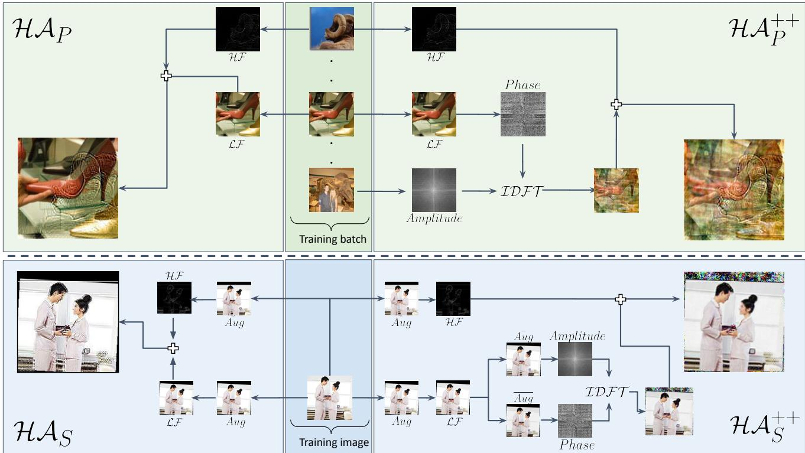
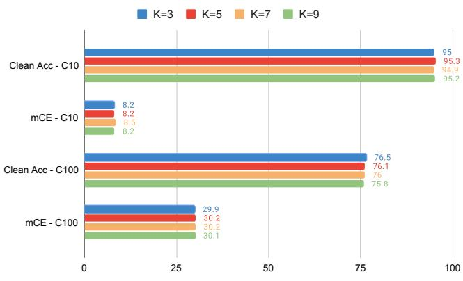
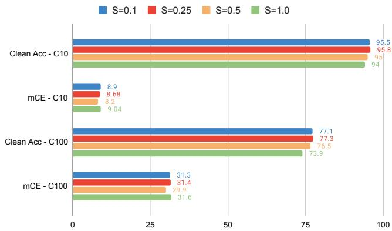
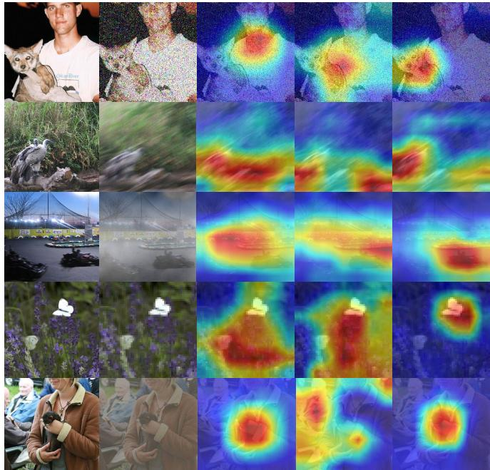

# HybridAugment++: Unified Frequency Spectra Perturbations for Model Robustness

Mehmet Kerim Yucel1 Ramazan Gokberk Cinbis2 Pinar Duygulu1 1Hacettepe University, Graduate School of Science and Engineering 2Department of Computer Engineering, Middle East Technical University

mkerimyucel@gmail.com gcinbis@ceng.metu.edu.tr pinar@cs.hacettepe.edu.tr

## Abstract

Convolutional Neural Networks (CNN) are known to exhibit poor generalization performance under distribution shifts. Their generalization have been studied extensively, and one line of work approaches the problem from a frequency-centric perspective. These studies highlight the fact that humans and CNNs mightfocus on different frequency components of an image. First, inspired by these observations, we propose a simple yet effective data augmentation method HybridAugment that reduces the reliance of CNNs on high-frequency components, and thus improves their robustness while keeping their clean accuracy high. Second, we propose HybridAugment++, which is a hierarchical augmentation method that attempts to unify various frequency-spectrum augmentations. HybridAugment++ builds on HybridAugment, and also reduces the reliance ofCNNs on the amplitude component ofimages, and promotes phase information instead. This unification results in competitive to or better than state-of-the-art results on clean accuracy (CIFAR-10/100 and ImageNet), corruption benchmarks (ImageNet-C, CIFAR-10-C and CIFAR-100-C), adversarial robustness on CIFAR-10 and out-ofdistribution detection on various datasets. HybridAugment and HybridAugment++ are implemented in a few lines of code, does not require extra data, ensemble models or additional networks 1.

## 1. Introduction

The last decade witnessed machine learning (ML) elevating many methods to new heights in various fields. Despite surpassing human performance in multiple tasks, the generalization of these models are hampered by distribution shifts, such as adversarial examples [54], common image corruptions [21] and out-of-distribution samples [62].

Addressing these issues are of paramount importance to facilitate the wide-spread adoption of ML models in practical deployment, especially in safety-critical ones [46, 11], where such distribution shifts are simply inevitable.

Distribution shift-induced performance drops signal a gap between how ML models and us humans perform perception. Several studies attempted to bridge, or at least understand, this gap from architecture [2, 63, 48] and training data [21, 57, 29, 7, 39, 4, 22] centric perspectives. An interesting perspective is built on the frequency spectra of the training data; convolutional neural networks (CNN) are shown to leverage high-frequency components that are invisible to humans [56] and also shown to be reliant on the amplitude component, as opposed to the phase component humans favour [7]. Several studies leveraged frequency spectra insights to improve model robustness. These methods, however, either leverage cumbersome ensemble models [48], formulate complex augmentation regimes [52, 34] or focus on a single robustness venue [33, 52, 34] rather than improving the broader robustness to various distribution shifts. Furthermore, it is imperative to preserve, if not improve, the clean accuracy levels of the model while improving its robustness.

Our work aims to improve the robustness of CNNs to various distribution shifts. Inspired by the frequency spectra based data augmentations, we propose HybridAugment, inspired from the well-known hybrid images [45]. Based on the observation that the label information of images are predominantly related to the low-frequency components [58, 31], HybridAugment simply swaps high-frequency and low-frequency components of randomly selected images in a batch, regardless of their class labels. This forces the network to focus on the low-frequency information of images and makes the models less reliant on the high-frequency information, which are often shown to be the root cause of robustness issues [58]. With virtually no training overhead, HybridAugment improves the corruption robustness while preserving or improving the clean accuracy, and additionally induces adversarial robustness.

  
Figure 1. An overview of our methods HybridAugment (HA) and HybridAugment++ $( { \mathcal { H A } } ^ { + + } )$ , and their single image (S) and paired (P) variants. $\mathcal { H A } _ { \mathcal { P } }$ combines the high-frequency (HF) and low-frequency (LF) contents of two randomly selected images, whereas $\mathcal { H A } _ { \mathcal { P } } { ^ { + + } }$ combines the HF of one image with the amplitude and LF-phase mixtures of two other images. Single image variants perform the same procedure, but based on different augmented versions of a single image.

Additionally, we set our eyes on jointly exploiting the contributions of frequency spectra augmentation methods while unifying them into a simpler, single augmentation regime. We then propose HybridAugment++, which performs hierarchical perturbations in the frequency spectra. Exploiting the fact that the phase component carries most of the information in an image [7], HybridAugment++ first decomposes images into high and low-frequency components, swaps the amplitude and phase of the low frequency component with another image, and then combines this augmented low-frequency information with the high-frequency component of a random image. Essentially, HybridAugment++ forces the models to rely on the phase and the lowfrequency information. As a result, HybridAugment++ further improves adversarial and corruption robustness, while further improving the clean accuracy against several alternatives. See Figure 1 for a diagram of our methods.

Our main contributions can be summarized as follows.

• We propose HybridAugment, a simple data augmentation method that helps models rely on low-frequency components of data samples. It is implemented in just three lines of code and has virtually no overhead.

• We extend HybridAugment and propose HybridAugment++, which performs hierarchical augmentations in frequency spectra to help models rely on lowfrequency and phase components of images.

• We show that HybridAugment improves corruption robustness of multiple CNN models, while preserving (or improving) the clean accuracy. We additionally observe clear improvements in adversarial robustness over strong baselines via HybridAugment.

• HybridAugment++ similarly outperforms many alternatives by further improving corruption and clean accuracies on multiple benchmark datasets, with additional gains in adversarial robustness.

## 2. Related Work

Robust Generalization - Adversarial. Adversarial ML has been studied intensively [54, 66], resulting into numerous attack [54, 41, 14] and defense [36, 50, 3, 35] methods borne out of an arms race that is still very much active. Notable attacks include FGSM [14], DeepFool [41], C&W [5] where AutoAttack [8] is now a widely used attack for adversarial evaluation. The defense methods mainly diversify the training distribution with attacked images [36, 70], purify the adversarial examples [50, 37] or detect whether an image is adversary or not [61, 35].

Robust Generalization - Corruptions. Common image corruptions might have various causes, and they occur more frequently than adversaries in practice. Numerous datasets simulating these effects have been released to facilitate standard evaluations [21, 42, 24, 67]. The methods addressing corruption robustness can be largely divided into two; architecture-centric and data-centric methods. Architecture-centric methods include neural architecture search for robust architectures [40], focusing on subnets [16], rectifying batch normalization [2], wavelet based layers [30] and forming ensembles [48, 63]. The datacentric methods are arguably more prominent in the literature; adversarial training [36, 26], cascade augmentations [21, 57], augmentation networks [47, 4], learned augmentation policies [64], shape-bias injection [15, 53], style augmentation [13], fractals [22], soft-edge driven image blending [29] and max-entropy image transformations [39] are all shown to improve corruption robustness at varying degrees.

Robust Generalization - Frequency Aspect. Several frequency-centric studies on model generalization show that CNNs tend to rely on high-frequency information ignored by human vision [56], or rely more on amplitude component than phase component humans tend to favour [7]. Models trained on high-pass filtered images are shown to have higher accuracy than the models trained on low-pass filtered images, although high-pass filtered images are just random noise to humans [64]. Multiple studies confirm that models reliant on low-frequency components are more robust [58, 31]. Interestingly, frequency analyses presents a different interpretation of the robustness-accuracy trade-off; many methods that improve clean accuracy force networks to rely on high-frequency components, which might sacrifice robustness [56].

Robust Generalization - Frequency-Centric Methods. A trade-off in frequency-based data augmentations is that one should not sacrifice the other; training on high-frequency augmentations can improve robustness to high-frequency corruptions, but tend to sacrifice the low-frequency corruption robustness or the clean accuracy [48, 64, 6]. Frequency-centric methods include biasing Jacobians [6], swapping phase and amplitude of random images [7], perturbing phase and amplitude spectra along with consistency regularization [52], frequency-band expert ensembles [48], frequency-component swapping of same-class samples [43] and wavelet-denoising layers [30]. Note that there is a considerable literature on frequency-centric adversarial attacks, but we primarily focus on methods improving robustness.

A similar work is [43], where hybrid-image based augmentation is proposed. We have, however, several key advantages; we i) lift the restriction of sampling from same classes for augmentation, ii) propose both single and paired variants, leading to a significantly more diverse training distribution, iii) present HybridAugment++ that performs phase/amplitude swap specifically in low-frequency components and iv) report improvements on corruption and adversarial robustness, as well as clean accuracy on multiple benchmark datasets (CIFAR-10/100, ImageNet). Note that other methods either train with ImageNet-C corruptions [48], report only corruption results [52], rely on external data [22] or models [4]. Our methods, on the other hand, require no external models or data, and they can be plugged into existing pipelines easily due to their simplicity.

## 3. Method

In this section, we formally define the problem, motivate our work and then present our proposed techniques.

## 3.1. Preliminaries

Let $\mathcal { F } ( x ; W )$ be an image classification CNN trained on the training set $\mathcal { T } _ { \mathrm { t r a i n } } = ( x _ { i } , y _ { i } ) _ { i = 1 } ^ { N }$ with N samples, where x and y correspond to images and labels. The clean accuracy (CA) of $\mathcal { F } ( x ; W )$ is formally defined as its accuracy over a clean test set $\mathcal { T } _ { \mathrm { t e s t } } = ( x _ { j } , y _ { j } ) _ { j = 1 } ^ { M }$ . Assume two operators $A ( \cdot )$ and $C ( c , s )$ that adversarially attacks or corrupts a given set of images with the corruption category c and severity s, respectively. Let $A T _ { \mathrm { t e s t } }$ and $C T _ { \mathrm { t e s t } }$ be the adversarially attacked and corrupted versions of $\mathcal { T } _ { \mathrm { t e s t } } .$ , and let $\mathcal { F } ( x ; W )$ have a robust accuracy (RA) on $A T _ { \mathrm { t e s t } }$ and a corruption accuracy (CRA) on $C T _ { \mathrm { t e s t } }$ . The aim is to fit $\mathcal { F } ( x ; W )$ such that the model gains robustness (i.e. increased RA and CRA compared its the baseline version), while retaining (or improving) the clean accuracy of its baseline version trained without robustness concerns.

What we know. Our work builds on the following crucial observations: i) CNNs favour high-frequency content [56], ii) adversaries and corruptions often reside in highfrequency [58], iii) images are dominated by low-frequency [48] and iv) models relying on low-frequency components are more robust [31, 58]. The robustness-accuracy trade-off is visible; low-frequency reliant models are more robust, but tend to miss out on clean accuracy brought by the highfrequency components.

## 3.2. HybridAugment

We hypothesize that a sweet spot in the robustnessaccuracy trade-off can be found. Unlike the hard approaches that completely rule out the reliance on highfrequency components (i.e. low-pass filters), we propose to reduce the reliance on them. To this end, we adopt a data augmentation approach that aims to diversify $\mathcal { T } _ { \mathrm { t r a i n } }$ by an operation $\mathcal { H A } ( \cdot )$ . Keeping the strong relation intact between labels and low-frequency content (i.e. labels come from low-frequency-component image), we propose to swap high and low-frequency components of images in a batch on-thefly. Unlike [43], we do not restrict the images to belong to the same class; this diversifies the training distribution even further while preserving the image semantics. We call this basic version of our approach HybridAugment:

$$
\mathcal { H A } _ { \mathcal { P } } ( x _ { i } , x _ { j } ) = \mathcal { L F } ( x _ { i } ) + \mathcal { H F } ( x _ { j } )\tag{1}
$$

where $x _ { i }$ is the input image and $x _ { j }$ is a randomly sampled image from the whole training set, which we simply sample from the mini batch at each training iteration in practice. $\mathcal { H F }$ and $\mathcal { L F }$ operators select the high and low-frequency components of an input image, for which we use:

$$
\begin{array} { r } { \mathcal { L F } ( x ) = G a u s s B l u r ( x ) } \\ { \mathcal { H F } ( x ) = x - \mathcal { L F } ( x ) } \end{array}\tag{2}
$$

where GaussBlur is used as a low-pass filter. Note that a similar outcome is possible by using Discrete Fourier Transforms (DFT), swapping the frequency bands and then applying Inverse DFT (IDFT). We find the gaussian blur operation to be faster and better in practice.

Inspired from [7], in addition to the image-pair scheme in Eq. 1, we propose a single image variant of HybridAugment. In the single image variant, instead of combining two images, $x _ { i }$ and $x _ { j }$ are obtained by applying randomly sampled augmentations to a single image. The single image variant $\mathcal { H A } _ { \cal S }$ can therefore be defined as

$$
\mathcal { H } A _ { S } ( x _ { i } ) = \mathcal { L } \mathcal { F } ( A u g ( x _ { i } ) ) + \mathcal { H } \mathcal { F } ( \hat { A u g } ( x _ { i } ) )\tag{3}
$$

where $A u g$ and $\hat { A u g }$ correspond to two sets of randomly sampled augmentation operations. Note that paired and single versions can work in tandem $( \mathcal { H A } _ { \mathcal { P S } } )$ , and actually outperform single or paired image versions.

## 3.3. HybridAugment++

The frequency analysis is a vast literature, however, two core aspects often stand out; frequency-band analysis (i.e. low, high) and the decomposition of signals into amplitude and phase. HybridAugment covers the former and shows competitive results in various benchmarks (see Section 4). The latter is investigated in APR [7], where phase is shown to be the more relevant component for correct classification, and training models based on their phase labels and swapping amplitude components of images randomly lead to more robust models. Note that frequency-band and phase/amplitude discussions are arguably orthogonal, since frequency, phase and amplitude provide distinct characterizations of a signal: intuitively speaking, frequency, phase and amplitude can be seen as the separation of visual patterns in terms of scale, location and significance.

We hypothesize these two approaches can be complementary; a model reliant on low-frequency and spatial information (i.e. phase) can further improve robustness. Inspired by the successes of cascaded augmentation methods [21, 57, 4], we unify these two core aspects into a single, hierarchical augmentation method. We refer to this method as HybridAugment++ and define its paired version as:

$$
\mathcal { H A } _ { \mathcal { P } } ^ { + + } ( x _ { i } , x _ { j } , x _ { z } ) = \mathcal { A P R } _ { \mathcal { P } } ( \mathcal { L F } ( x _ { i } ) , x _ { z } ) + \mathcal { H F } ( x _ { j } )\tag{4}
$$

where $x _ { i } , \ x _ { j }$ and $x _ { z }$ are images sampled from the same batch. Here, $\mathcal { A P R } _ { \mathcal { P } } \left[ 7 \right]$ is defined as

$$
\mathcal { A P R } _ { \mathcal { P } } ( x _ { i } , x _ { z } ) = \mathcal { I D } \mathcal { F T } ( A _ { x _ { z } } \otimes e ^ { i . P _ { x _ { i } } } )\tag{5}
$$

where $\otimes$ is element-wise multiplication, A is the amplitude and $P$ is the phase component. Similar to HA and $\mathcal { A P R }$ we also define a single-image version of HybridAugment++ as

$$
\mathcal { H } \mathcal { A } _ { S } ^ { + + } ( x _ { i } ) = \mathcal { A } \mathcal { P } \mathcal { R } _ { S } ( \mathcal { L } \mathcal { F } ( A u g ( x _ { i } ) ) ) + \mathcal { H } \mathcal { F } ( A \mathrm { \hat { \boldsymbol { u } } g } ( x _ { i } ) )
$$

where $\mathcal { A P R } _ { \cal S } \left[ 7 \right]$ is defined as

(6)

$$
\ b { \mathcal { A } } \ b { \mathcal { P } } \ b { \mathcal { R } } _ { \ b { S } } ( x _ { i } ) = \ b { \mathcal { I } } \ b { \mathcal { D } } \ b { \mathcal { F } } \ b { \mathcal { T } } \left( \ b { A } _ { \ b { A } \ b { \bar { u } } \ b { g } ( \ b { x } _ { i } ) } \otimes e ^ { i . \ b { P } _ { \overline { { A u g } } ( \ b { x } _ { i } ) } } \right)\tag{7}
$$

where Aug, Augˆ , Aug¯ and $\overline { { A u g } }$ are different sets of randomly sampled augmentation operations. Note that we essentially propose a framework; one can use different single and paired image augmentations, either individually or together, and can still achieve competitive results (see ablations in Section 4). There are also other alternatives, such as swapping phase/amplitude first and then performing ${ \mathcal { H A } } ,$ but we observe poor performance in practice; dividing the phase component into frequency-bands is not interpretable as frequencies of the phase component are not well defined. The pseudo-code of our methods can be found in the supplementary material.

## 4. Experimental Results

In this section, we first describe our experimental setup, including the datasets, metrics, architectures and implementation details. We then present a discussion of the Gaussian kernel details, an important detail of the proposed schemes. We thoroughly evaluate the effectiveness of HA and $\mathcal { H A } ^ { + + }$ in terms of three distribution shifts; common image corruptions, adversarial attacks, and out-ofdistribution detection. We finalize with additional results and a discussion of the potential limitations.

## 4.1. Experimental setup

Datasets. We use CIFAR-10, CIFAR-100 [27] and ImageNet [10] for training. Both CIFAR datasets are formed of 50.000 training images with a size of 32×32. ImageNet dataset contains around 1.2 million images of 1000 different classes. Corruption robustness is evaluated on the corrupted versions of the test splits of these datasets, which are CIFAR-10-C, CIFAR-100-C and ImageNet-C [19]. For each dataset, corruptions are simulated for 4 categories (noise, blur, weather, digital) with 15 corruption types, each with 5 severity levels. For adversarial robustness, we use AutoAttack [8] on CIFAR-10 test set. Out-of-distribution detection is evaluated on SVHN [44], LSUN [65], ImageNet and CIFAR-100, and their fixed versions [55].

  
Figure 2. Clean accuracy ↑ and and mean corruption errors $\downarrow$ on CIFAR10/100, where different kernel sizes K vs. a fixed standard deviation S (top bar chart) and different standard deviations vs. a fixed kernel size are used for the blurring operation of Equation 2.

Evaluation metrics. We report top-1 classification as clean accuracy. Adversarial robustness is evaluated with robust accuracy, which is the top-1 classification on adversarially attacked test sets. Corruption robustness is evaluated with Corruption Error (CE) $\begin{array} { r } { \dot { C E } = \sum _ { 1 } ^ { 5 } E _ { c , s } ^ { F } / \sum _ { 1 } ^ { 5 } E _ { c , s } ^ { A l e x N e t } } \end{array}$ . CE calculates the average error of the model F on a corruption type, normalized by the corruption error of AlexNet [28]. CE is calculated for all 15 corruption types, and their average Mean Corruption Error (mCE) is used as the final robustness metric. Out-of-distribution detection is evaluated using the Area Under the Receiver Operating Characteristic Curve (AUROC) metric [20].

Architectures. We use architectures commonly used in the literature for a fair comparison; ResNeXT [60], All-Convolutional Network [51], DenseNet [23], WideResNet [68] and ResNet18 [17] are used in CIFAR-10 and CIFAR-100, whereas ResNet50 is used for ImageNet.

Implementation details. For CIFAR experiments, all architectures are trained for 200 epochs with SGD, where initial learning rate of 0.1 decays after every 60 epochs. We use the last checkpoints for evaluation and do not perform any hyperparameter tuning. Paired and single variants of $\mathcal { H A }$ and $\mathcal { H A } ^ { + + }$ are applied in each iteration with probabilities 0.6 and 0.5, respectively. Standard training augmentations are random horizontal flips and cropping. When a single-image augmentation is used, the input image is augmented with Aug randomly sampled among [rasterize, autocontrast, equalize, rotate, solarize, shear, translate]. Note that these do not overlap with test corruptions. On ImageNet, we train for 100 epochs with SGD, where an initial learning rate of 0.1 is decayed every 30 epochs. Data augmentations and their probabilities are the same as above.

We use the same checkpoints for all evaluations; we do not train separate models for corruption and out-ofdistribution detection. In adversarial analysis, for a fair comparison with [7], we train our model with HA & $\mathcal { H } \bar { A ^ { + + } }$ and FGSM adversarial training. We note that we use the labels of the low-frequency image as the groundtruth labels. We have tried using the high-frequency image labels instead, but this leads to severe degradation in overall performance, as expected. All models are trained with the cross-entropy loss, where the original and the augmented (with our method) batches are used to calculate the loss.

## 4.2. Understanding the cut-off frequency

A key design choice is the cut-off frequency that defines HF and $\mathcal { L F }$ in Equation 2. Since we essentially define the cut-off frequency with a Gaussian blur operation, we have two hyperparameters; the size of the Gaussian kernel K and its standard deviation S. Note that increasing both the kernel size and the standard deviation increases the blur strength, which eliminates increasingly higher frequencies (i.e. higher cut-off frequency). We now evaluate the effects of these hyperparameters on both clean accuracy and mean corruption errors using $\mathcal { H A } _ { \mathcal { P S } } ^ { + + }$ , on both CIFAR-10 and CIFAR-100 using the ResNet18 architecture.

Fixed standard deviation. The effect of different K values with fixed ${ \bf S } = 0 . 5$ is shown in Figure 2 top plot. K = 3 provides the best trade-off here; it has the best clean accuracy and mCE on CIFAR100, whereas it shares the best mCE and has competitive clean accuracy on CIFAR10.

Fixed kernel size. $\mathrm { K } = 3$ with different standard deviation values are shown in Figure 2 bottom plot. The robustnessaccuracy trade-off becomes more visible here; lower sigma values (i.e. lower cut-off frequency) preserve more highfrequency content, and therefore have increasingly higher clean accuracy, but at the expense of degrading mCE. Note that further increasing the value S is in contrast with this phenomena; if our method had only done frequency swapping (i.e. HA), then we could have expected a consistent trend, as shown in the literature [31, 58]. However, $\mathcal { H A } ^ { + + }$ also emphasizes the phase components, which results into a favourable behaviour where best results in mCE and clean accuracy can be obtained in the same cut-off frequency.

The takeaway. The results show that our hypothesis holds; we can find a sweet spot in the frequency spectrum where we can obtain favourable performance on both corrupted and clean images, given a careful selection of K and S. A sound argument is that the optimality of these hyperparameters depends on the data; this is probably a correct assumption and can help tune the results further on other datasets. However, we use $K = 3 , S = 0 . 5$ on all experiments across all architectures and datasets (including ImageNet), and show that we get solid improvements without any dataset-specific tuning.

## 4.3. Corruption robustness

As mentioned in Section 3, we have three augmentation options; APR [7], HA and $\mathcal { H A } ^ { + + }$ . We can apply them using image pairs, a single image or we can do both. This leads to quite a few potential combinations. We now evaluate all these combinations on CIFAR-10 and CIFAR-100, both for clean accuracy and corruption robustness (mCE).

Comparison against RFC [43]. We implement and compare against RFC, which also performs hybrid-image based augmentation. RFC operates on paired-images of sameclass samples, therefore we first compare it against $\mathcal { H A } _ { \mathcal { P } }$ and $\mathcal { H A } _ { \mathcal { P } } ^ { + + }$ . In mCE, we comfortably outperform it while staying competitive in clean accuracy. This shows the value of lifting the limitation of class-based sampling, which RFC does. Note that since we also propose single-image variants, both single-image augmentations $( \mathcal { H A } _ { \mathcal { S } }$ and $\mathcal { H A } _ { s } ^ { + + } )$ and combined ones $( \mathcal { H A } _ { \mathcal { P S } }$ and $\mathcal { H A } _ { \mathcal { P S } } ^ { + + } )$ significantly outperform RFC on all architectures, datasets and metrics.

Corruption robustness. The corruption results are shown in Table 1. The take-away message is crystal clear; $\mathcal { H A } ^ { + + }$ is the best on all datasets, all architectures and all groups. The best results are obtained when we use $\mathcal { H A } ^ { + + }$ both in pairs and single images, further cementing its effectiveness. Note that HA is competitive or better than $\mathcal { A P R }$

Clean Accuracy. The clean accuracy values of the models shown in Table 1 are given in Table 2. The results show us that both HA and $\mathcal { H A } ^ { + + }$ achieve a good spot in robustnessaccuracy trade-off; except two cases, both of them improve clean accuracy over the original models. The results are not as clean-cut as those of Table 1, but in each group, the best ones mostly include HA or $\mathcal { H A } ^ { + + }$ . Furthermore, the best results on CIFAR-10 and CIFAR-100 have HA as the single-image augmentation. Although it does not perform the best, $\mathcal { H A } _ { \mathcal { P S } } ^ { + + }$ still outperforms the baseline and is highly competitive against others.

The takeaway. The results show us that HA and $\mathcal { H A } ^ { + + }$ are superior to other frequency-based methods, and they comfortably improve robustness and clean accuracy performance across multiple datasets and architectures. See supplementary material for comparison with the state-of-the-art on CIFAR-10 and CIFAR-100. Hint to readers: we achieve the state-of-the-art on all architectures on both datasets.

  
Figure 3. From left to right: ImageNet validation images, their corrupted versions, and Gradcam visualizations [49] on standard model, APR [7] and ours.

## 4.3.1 Scaling to ImageNet

We now assess whether our methods can scale to ImageNet. Since we do not use extra data or ensembles during training or inference, we choose methods with similar characteristics, such as SIN [47], PatchUniform, AutoAugment (AA), Random AA [9], MaxBlurPool and AugMix [21]. The results are shown in Table 3. Note that we use pretrained weights for alternative methods if available, otherwise we use the values reported in [7].

The results show that all of our variants produce higher clean accuracy compared to ${ \mathcal { A P R } } .$ , showing the value of our method in improving model accuracy. HA results are competitive in corruption accuracy, but $\mathcal { H A } ^ { + + }$ outperforms both APR and others in corruption accuracy, while being 0.5 shy of our best clean accuracy. Furthermore, our approach works well with extra data and other augmentations; we apply $\mathcal { H A } _ { \mathcal { P S } } ^ { + + }$ with DeepAugment [18] and Aug-Mix [21], which leads to significant improvements in mCE (∼11 points) over both DeepAugment and $\mathcal { H A } _ { \mathcal { P S } } ^ { + + }$ . Note that we are better than APR, even when both methods train with DeepAugment. We also outperform PixMix [22], which uses extra training data. Finally, we provide results of $\mathcal { H A } _ { \mathcal { P S } } ^ { + + }$ with higher cut-off frequency (see experiments with † in Table 3); we see the expected trend where the elimination of higher frequencies make our models more robust in average, at the expense of lowered clean accuracy.

Qualitative results. We provide GradCam visualizations of $\mathcal { H A } ^ { + + }$ against various corruptions in Figure 3. We sample corruptions from each category; noise, motion blur, fog, pixelate and contrast corruptions are shown from top to bottom. In the first four rows, it is apparent that corruptions lead to the standard model focusing on the wrong areas, leading to misclassifications. Note that this is the case for APR as well; it can not withstand these corruptions whereas $\mathcal { H A } ^ { + + }$ still focuses on where matters, and manages to predict correctly. The fifth row shows another failure mode; despite the corruption, standard model manages to predict correctly but $\mathcal { A P R }$ loses its focus and leads to misprediction. $\mathcal { H A } ^ { + + }$ does not break what works; this case visualizes the ability of $\mathcal { H A } ^ { + + }$ to improve clean accuracy.

<table><tr><td></td><td></td><td colspan="3">Single-only</td><td colspan="4">Paired-only</td><td colspan="3"> $A \mathcal { P } \mathcal { R } _ { \mathcal { P } } [ 7 ] \ w i t h$ </td><td colspan="3">HAp with APRS HAS HA}+</td><td colspan="3"> $\mathcal { H A } _ { \mathcal { P } } ^ { + + } \ w i t h$  HAS HA}+</td></tr><tr><td>Method</td><td>Orig</td><td> $\mathcal { A P R } _ { \mathcal { S } } [ 7 ]$ </td><td>HAS</td><td>HA++</td><td>RFC[43]</td><td> $A P \mathcal { R } _ { \mathcal { P } }$ </td><td>HAp</td><td> $\mathcal { H A } _ { \mathcal { P } } ^ { + + }$ </td><td> $\mathcal { A P R } _ { \mathcal { S } }$ </td><td>HAs</td><td> $\mathcal { H A } _ { \mathcal { S } } ^ { + + }$ </td><td></td><td></td><td></td><td> $\mathcal { A P R } _ { \mathcal { S } }$ </td><td></td><td></td></tr><tr><td>AllConv</td><td>30.8</td><td>14.8</td><td>16.8</td><td>13.9</td><td>24.2</td><td>21.5</td><td>20.8</td><td>16.7</td><td>11.5</td><td>11.9</td><td>11.2</td><td>11.5</td><td>12.0</td><td>11.2</td><td>10.9</td><td>10.9</td><td>10.7</td></tr><tr><td>DenseNet</td><td>30.7</td><td>12.3</td><td>15.0</td><td>11.1</td><td>20.4</td><td>20.3</td><td>18.4</td><td>14.2</td><td>10.3</td><td>10.6</td><td>10.2</td><td>10.5</td><td>10.9</td><td>10.2</td><td>10.1</td><td>10</td><td>9.5</td></tr><tr><td>WResNet</td><td>26.9</td><td>10.6</td><td>13.6</td><td>10.0</td><td>18.3</td><td>18.3</td><td>16.4</td><td>13.2</td><td>9.1</td><td>9.2</td><td>8.7</td><td>9.4</td><td>9.9</td><td>9.2</td><td>8.5</td><td>8.5</td><td>8.3</td></tr><tr><td>ResNeXt</td><td>27.5</td><td>11.0</td><td>13.2</td><td>9.99</td><td>19.2</td><td>18.5</td><td>17.6</td><td>13.2</td><td>9.1</td><td>9.3</td><td>8.7</td><td>9.5</td><td>10.3</td><td>9.5</td><td>8.3</td><td>8.2</td><td>7.9</td></tr><tr><td>ResNet18</td><td>25.4</td><td>9.9</td><td>12.2</td><td>9.34</td><td>19.6</td><td>17.0</td><td>18.3</td><td>15.2</td><td>9.1</td><td>9.0</td><td>8.5</td><td>9.3</td><td>9.3</td><td>9.0</td><td>8.6</td><td>8.4</td><td>8.2</td></tr><tr><td>Mean</td><td>28.3</td><td>11.7</td><td>14.1</td><td>10.9</td><td>20.3</td><td>19.1</td><td>18.3</td><td>14.5</td><td>9.8</td><td>9.9</td><td>9.4</td><td>10.0</td><td>10.4</td><td>9.8</td><td>9.2</td><td>9.2</td><td>8.9</td></tr><tr><td>AllConv</td><td>56.4</td><td>39.8</td><td>43.0</td><td>38.9</td><td>50.8</td><td>47.5</td><td>44.7</td><td>41.7</td><td>35.9</td><td>35.9</td><td>35.1</td><td>35.6</td><td>36.5</td><td>34.8</td><td>34.4</td><td>34.6</td><td>34.4</td></tr><tr><td>DenseNet</td><td>59.3</td><td>38.3</td><td>41.3</td><td>37.3</td><td>52.5</td><td>49.8</td><td>45.6</td><td>41.8</td><td>35.8</td><td>36.3</td><td>35.0</td><td>34.8</td><td>36.1</td><td>35.0</td><td>34.3</td><td>34.3</td><td>33.4</td></tr><tr><td>WResNet</td><td>53.3</td><td>35.5</td><td>38.1</td><td>33.9</td><td>47.4</td><td>44.7</td><td>43.1</td><td>39.3</td><td>32.9</td><td>33.2</td><td>31.9</td><td>32.9</td><td>34.2</td><td>32.7</td><td>31.5</td><td>31.4</td><td>31.2</td></tr><tr><td>ResNeXt</td><td>53.4</td><td>33.7</td><td>35.6</td><td>31.1</td><td>46.4</td><td>44.2</td><td>41.2</td><td>36.4</td><td>31.0</td><td>31.2</td><td>29.9</td><td>30.6</td><td>31.5</td><td>30.5</td><td>30.5</td><td>29.0</td><td>28.8</td></tr><tr><td>ResNet18</td><td>51.2</td><td>33.0</td><td>35.6</td><td>32.1</td><td>47.5</td><td>49.2</td><td>45.5</td><td>44.6</td><td>31.8</td><td>32.5</td><td>31.2</td><td>32.2</td><td>31.8</td><td>31.0</td><td>30.3</td><td>30.4</td><td>29.9</td></tr><tr><td>Mean</td><td>54.7</td><td>36.0</td><td>38.7</td><td>34.6</td><td>48.9</td><td>47.0</td><td>44.0</td><td>40.7</td><td>33.4</td><td>33.8</td><td>32.6</td><td>33.3</td><td>34.0</td><td>32.8</td><td>32.2</td><td>31.9</td><td>31.5</td></tr></table>

Table 1. Corruption robustness on CIFAR-10 (first 6 rows) and CIFAR-100 with various CNNs. Values show mCE, lower is better. Underlined scores are the best results within their respective group (i.e. single-only, paired-only, etc.). The overall best results are shown in bold. The table is divided into groups for easy comparison; single-only augmentation, paired-only augmentation and fixing one augmentation in paired variants while changing the single-image augmentation.

<table><tr><td rowspan="2">Method</td><td rowspan="2">Orig</td><td colspan="3">Single-only</td><td colspan="4">Paired-only</td><td colspan="3"> $A \mathcal { P } \mathcal { R } _ { \mathcal { P } } [ 7 ] \ w i t h$ </td><td colspan="3"> $\mathcal { H A _ { P } } \ w i t h$ </td><td colspan="3"> $\mathcal { H A } _ { \mathcal { P } } ^ { + + } \ w i t h$ </td></tr><tr><td> $\mathcal { A P R } _ { \mathcal { S } } [ 7 ]$ </td><td>HAS</td><td> $\mathcal { H A } _ { \mathcal { S } } ^ { + + }$ </td><td>RFC[43]</td><td> $A P \mathcal { R } _ { \mathcal { P } }$ </td><td>HAp</td><td> $\mathcal { H A } _ { \mathcal { P } } ^ { + + }$ </td><td> $\mathcal { A P R } _ { \mathcal { S } }$ </td><td>HAS</td><td> $\mathcal { H A } _ { \mathcal { S } } ^ { + + }$ </td><td>APRs HAS</td><td></td><td> $\mathcal { H A } _ { \mathcal { S } } ^ { + + }$ </td><td> $\mathcal { A P R } _ { \mathcal { S } }$ </td><td>HAS</td><td> $\mathcal { H A } _ { s } ^ { + + }$ </td></tr><tr><td>AllConv</td><td>93.9</td><td>93.5</td><td>94.1</td><td>93.9</td><td>93.9</td><td>94.5</td><td>93.9</td><td>94.0</td><td>94.3</td><td>94.3</td><td>94.3</td><td>94.5</td><td>94.5</td><td>94.4</td><td>94.5</td><td>94.4</td><td>94.3</td></tr><tr><td>DenseNet</td><td>94.2</td><td>94.9</td><td>94.7</td><td>95.0</td><td>93.6</td><td>95.0</td><td>93.1</td><td>93.2</td><td>95.2</td><td>95.1</td><td>95.1</td><td>94.7</td><td>95.0</td><td>94.9</td><td>94.8</td><td>95.0</td><td>94.8</td></tr><tr><td>WResNet</td><td>94.8</td><td>95.0</td><td>95.3</td><td>95.4</td><td>93.0</td><td>95.2</td><td>93.2</td><td>92.0</td><td>95.7</td><td>95.4</td><td>95.8</td><td>95.4</td><td>95.5</td><td>95.2</td><td>95.7</td><td>95.3</td><td>95.3</td></tr><tr><td>ResNeXt</td><td>95.7</td><td>95.5</td><td>95.3</td><td>95.7</td><td>93.5</td><td>95.5</td><td>93.5</td><td>92.9</td><td>96.1</td><td>95.6</td><td>96.1</td><td>95.4</td><td>95.2</td><td>95.1</td><td>95.6</td><td>96.0</td><td>95.9</td></tr><tr><td>ResNet18</td><td>92.2</td><td>95.6</td><td>95.5</td><td>95.6</td><td>91.7</td><td>94.9</td><td>90.9</td><td>89.7</td><td>95.0</td><td>95.2</td><td>95.4</td><td>95.4</td><td>95.4</td><td>95.1</td><td>95.0</td><td>95.1</td><td>95.0</td></tr><tr><td>Mean</td><td>94.2</td><td>94.9</td><td>94.9</td><td>95.1</td><td>93.0</td><td>95.0</td><td>92.9</td><td>92.3</td><td>95.2</td><td>95.1</td><td>95.3</td><td>95.1</td><td>95.1</td><td>95.0</td><td>95.1</td><td>95.2</td><td>95.1</td></tr><tr><td>AllConv</td><td>74.9</td><td>75.3</td><td>75.0</td><td>75.8</td><td>75.3</td><td>74.8</td><td>74.1</td><td>74.7</td><td>75.2</td><td>75.7</td><td>75.1</td><td>74.9</td><td>75.8</td><td>75.0</td><td>75.7</td><td>75.6</td><td>75.2</td></tr><tr><td>DenseNet</td><td>71.4</td><td>75.8</td><td>76.0</td><td>75.6</td><td>71.6</td><td>71.5</td><td>71.4</td><td>71.7</td><td>75.6</td><td>76.1</td><td>76.1</td><td>75.4</td><td>74.9</td><td>74.9</td><td>75.5</td><td>75.6</td><td>75.9</td></tr><tr><td>WResNet</td><td>72.1</td><td>76.2</td><td>76.8</td><td>76.2</td><td>72.1</td><td>70.4</td><td>71.3</td><td>71.7</td><td>76.8</td><td>77.2</td><td>76.5</td><td>75.3</td><td>74.8</td><td>75.2</td><td>76.1</td><td>76.3</td><td>76.0</td></tr><tr><td>ResNeXt</td><td>75.0</td><td>78.8</td><td>79.4</td><td>79.4</td><td>74.2</td><td>71.1</td><td>73.5</td><td>74.3</td><td>79.1</td><td>79.9</td><td>79.3</td><td>77.6</td><td>77.3</td><td>76.8</td><td>77.8</td><td>79.1</td><td>78.8</td></tr><tr><td>ResNet18</td><td>70.9</td><td>77.0</td><td>77.4</td><td>77.1</td><td>66.3</td><td>63.7</td><td>65.3</td><td>61.9</td><td>76.1</td><td>76.4</td><td>76.0</td><td>74.8</td><td>75.6</td><td>75.9</td><td>76.1</td><td>76.2</td><td>76.5</td></tr><tr><td>Mean</td><td>72.9</td><td>76.6</td><td>76.9</td><td>76.8</td><td>71.9</td><td>70.3</td><td>71.1</td><td>70.8</td><td>76.5</td><td>77.1</td><td>76.6</td><td>75.6</td><td>75.7</td><td>75.6</td><td>76.2</td><td>76.5</td><td>76.4</td></tr></table>

Table 2. Clean accuracy values on CIFAR-10 (first 6 rows) and CIFAR-100. Higher the better. Underlined scores are the best results within their respective group (i.e. single-only, paired-only, etc.). The overall best results are shown in bold.

## 4.4. Adversarial Robustness

We present our results on adversarial robustness in Table 4. For a fair comparison, we train models from scratch if official code is available. If not, we use pretrained models or use the results reported in [7]. We compare against APR, Cutout and FGSM adversarial training [36].

Our results show that there is no clear winner; with HA we obtain the best clean accuracy and with $\mathcal { H A } _ { \mathcal { P S } } ^ { + + }$ we obtain the best robust accuracy. All our variants are better than the widely accepted adversarial training (AT) baseline in nearly all cases, which shows the effectiveness of our method. Our variants do quite well in clean accuracy and outperform others in nearly all cases. $\mathcal { H A } _ { s } ^ { + + }$ offers arguably the best trade-off; it ties with $\mathcal { A P R } _ { \mathcal { P S } }$ on robust accuracy, and outperforms it on clean accuracy.

## 4.5. Out-of-Distribution Detection

For OOD detection, we use a ResNet18 model trained on CIFAR-10 and compare against several configurations, such as training with cross-entropy, SupCLR [25] and CSI [55], and augmentation methods as Cutout, Mixup and APR.

First of all, all our variants comfortably beat the baseline OOD detection (CE), which shows that our proposed method is indeed useful. Furthermore, we see that our proposed methods are highly competitive, and they perform as good as the alternative methods. $\mathcal { H } \mathcal { A } _ { \mathcal { P } } ^ { + + } + \mathcal { A } \mathcal { P } \mathcal { R } _ { \mathcal { S } }$ outperforms all other methods on LSUN and ImageNet datasets, and produces competitive results on others. Mean AUROC across all datasets show that it ties with the best model $\mathcal { A P R } _ { \mathcal { P S } }$ , showing its efficiency. The broader framework we propose leads to many variants with various performance profiles across different datasets, highlighting the flexibility and usefulness of our unification of frequencycentric augmentations. Note that the clean accuracy on CIFAR-10 are provided in Table 2, and shows that we perform the same or better than the other methods.

Table 6. Error values on ImageNet-C. † indicates training with a higher cut-off frequency. ‡ indicates training with DeepAugment[18]. ST indicates standard model training.

<table><tr><td rowspan="2">Method</td><td rowspan="2">Test Error</td><td colspan="3">Noise</td><td colspan="3">Blur</td><td colspan="3">Weather</td><td colspan="3"></td><td colspan="3">Digital</td><td rowspan="2">mCE</td></tr><tr><td></td><td>Gauss</td><td>Shot</td><td>Impulse</td><td>Defocus Glass</td><td>Motion</td><td></td><td>Zoom Snow</td><td>Frost</td><td>Fog</td><td>Brightness</td><td>Contrast</td><td>Elastic</td><td>Pixel</td><td>JPEG</td></tr><tr><td>Standard</td><td>23.9</td><td>79</td><td>80</td><td>82</td><td>82</td><td>90</td><td>84</td><td>80</td><td>86</td><td>81</td><td>75</td><td>65</td><td>79</td><td>91</td><td>77</td><td>80</td><td>80.6</td></tr><tr><td>Patch Uniform</td><td>24.5</td><td>67</td><td>68</td><td>70</td><td>74</td><td>83</td><td>81</td><td>77</td><td>80</td><td>74</td><td>75</td><td>62</td><td>77</td><td>84</td><td>71</td><td>71</td><td>74.3</td></tr><tr><td>AA [9]</td><td>22.8</td><td>69</td><td>68</td><td>72</td><td>77</td><td>83</td><td>80</td><td>81</td><td>79</td><td>75</td><td>64</td><td>56</td><td>70</td><td>88</td><td>57</td><td>71</td><td>72.7</td></tr><tr><td>Random AA [9]</td><td>23.6</td><td>70</td><td>71</td><td>72</td><td>80</td><td>86</td><td>82</td><td>81</td><td>81</td><td>77</td><td>72</td><td>61</td><td>75</td><td>88</td><td>73</td><td>72</td><td>76.1</td></tr><tr><td>MaxBlur Pool [71]</td><td>23.0</td><td>73</td><td>74</td><td>76</td><td>74</td><td>86</td><td>78</td><td>77</td><td>77</td><td>72</td><td>63</td><td>56</td><td>68</td><td>86</td><td>71</td><td>71</td><td>73.4</td></tr><tr><td>SIN [47]</td><td>27.2</td><td>69</td><td>70</td><td>70</td><td>77</td><td>84</td><td>76</td><td>82</td><td>74</td><td>75</td><td>69</td><td>65</td><td>69</td><td>80</td><td>64</td><td>77</td><td>73.3</td></tr><tr><td>AugMix [21]</td><td>22.4</td><td>65</td><td>66</td><td>67</td><td>70</td><td>80</td><td>66</td><td>66</td><td>75</td><td>72</td><td>67</td><td>58</td><td>58</td><td>79</td><td>69</td><td>69</td><td>68.4</td></tr><tr><td>APRs [7]</td><td>24.5</td><td>61</td><td>64</td><td>60</td><td>73</td><td>87</td><td>72</td><td>81</td><td>72</td><td>67</td><td>62</td><td>56</td><td>70</td><td>83</td><td>79</td><td>71</td><td>70.5</td></tr><tr><td>APRp [7]</td><td>24.4</td><td>64</td><td>68</td><td>68</td><td>70</td><td>89</td><td>69</td><td>81</td><td>69</td><td>69</td><td>55</td><td>57</td><td>58</td><td>85</td><td>66</td><td>72</td><td>69.3</td></tr><tr><td>APRps [7]</td><td>24.4</td><td>62</td><td>68</td><td>64</td><td>72</td><td>86</td><td>72</td><td>79</td><td>66</td><td>67</td><td>51</td><td>58</td><td>61</td><td>86</td><td>66</td><td>72</td><td>68.9</td></tr><tr><td>HA</td><td>23.5</td><td>64</td><td>66</td><td>67</td><td>71</td><td>88</td><td>72</td><td>78</td><td>70</td><td>69</td><td>59</td><td>58</td><td>64</td><td>84</td><td>61</td><td>69</td><td>69.7</td></tr><tr><td>HApS</td><td>23.2</td><td>66</td><td>67</td><td>62</td><td>72</td><td>85</td><td>77</td><td>77</td><td>77</td><td>71</td><td>65</td><td>58</td><td>69</td><td>83</td><td>63</td><td>69</td><td>71.2</td></tr><tr><td> $\mathcal { H A } _ { \mathcal { P } } ^ { + + } + \mathcal { H A } _ { \mathcal { S } }$ </td><td>23.8</td><td>63</td><td>65</td><td>60</td><td>70</td><td>86</td><td>71</td><td>77</td><td>70</td><td>68</td><td>58</td><td>58</td><td>64</td><td>84</td><td>62</td><td>68</td><td>68.3</td></tr><tr><td>HA+</td><td>23.7</td><td>57</td><td>61</td><td>57</td><td>69</td><td>85</td><td>70</td><td>78</td><td>67</td><td>66</td><td>58</td><td>57</td><td>63</td><td>85</td><td>63</td><td>67</td><td>67.3</td></tr><tr><td> $\mathcal { H A } _ { \mathcal { P S } } ^ { + \dagger } \dag$ </td><td>25.5</td><td>57</td><td>58</td><td>55</td><td>62</td><td>75</td><td>69</td><td>73</td><td>69</td><td>68</td><td>63</td><td>61</td><td>68</td><td>80</td><td>58</td><td>71</td><td>65.8</td></tr><tr><td>PixMix [22]</td><td>22.6</td><td>53</td><td>52</td><td>51</td><td>73</td><td>88</td><td>77</td><td>76</td><td>62</td><td>64</td><td>57</td><td>56</td><td>53</td><td>85</td><td>69</td><td>70</td><td>65.8</td></tr><tr><td>DA [18]</td><td>23.4</td><td>46</td><td>47</td><td>45</td><td>63</td><td>75</td><td>69</td><td>75</td><td>67</td><td>64</td><td>61</td><td>55</td><td>64</td><td>77</td><td>50</td><td>71</td><td>62.0</td></tr><tr><td> $\mathrm { D A } \left[ 1 8 \right] + \mathcal { A } \mathcal { P } \mathcal { R } _ { \mathcal { P S } }$ </td><td>23.9</td><td>47</td><td>48</td><td>46</td><td>61</td><td>73</td><td>64</td><td>76</td><td>58</td><td>59</td><td>53</td><td>55</td><td>53</td><td>77</td><td>48</td><td>68</td><td>59.1</td></tr><tr><td> $\mathrm { D A } \left[ 1 8 \right] + \mathcal { H A } _ { P S } ^ { + + }$ </td><td>23.9</td><td>50</td><td>51</td><td>47</td><td>58</td><td>73</td><td>62</td><td>75</td><td>60</td><td>56</td><td>51</td><td>52</td><td>52</td><td>77</td><td>44</td><td>70</td><td>58.9</td></tr><tr><td> $\mathrm { D A } \left[ 1 8 \right] + \mathcal { H A } _ { \mathcal { P S } } ^ { \dagger \dagger } \dag$ </td><td>24.1</td><td>45</td><td>45</td><td>43</td><td>56</td><td>69</td><td>64</td><td>73</td><td>61</td><td>57</td><td>55</td><td>53</td><td>55</td><td>74</td><td>43</td><td>76</td><td>58.1</td></tr><tr><td> $\mathsf { D A } \left[ 1 8 \right] + \mathsf { A M } \overset { \cdot \cdot } { [ 2 1 ] } + \mathcal { H } \mathcal { A } _ { \mathcal { P } \mathcal { S } } ^ { + + }$ </td><td>24.2</td><td>46</td><td>47</td><td>44</td><td>54</td><td>73</td><td>53</td><td>67</td><td>59</td><td>56</td><td>49</td><td>52</td><td>50</td><td>77</td><td>45</td><td>73</td><td>56.4</td></tr><tr><td> $\mathsf { D A } \left[ 1 8 \right] + \mathsf { A M } \left[ 2 1 \right] + \mathcal { H A } _ { \mathcal { P S } } ^ { + \mp } \dagger$ </td><td>24.9</td><td>46</td><td>46</td><td>44</td><td>52</td><td>66</td><td>54</td><td>65</td><td>59</td><td>57</td><td>54</td><td>53</td><td>54</td><td>75</td><td>43</td><td>72</td><td>56.1</td></tr></table>

Table 3. Clean error and corruption robustness on ImageNet. Lower is better. The methods shown in the last four rows leverage extra data during training. † indicates training with a higher cut-off frequency.

<table><tr><td></td><td>AT[59]</td><td> $\overline { { \mathbf { C u t o u t } [ 1 2 ] } }$ </td><td> $\overline { { \mathcal { A P R } _ { \mathcal { P } } \left[ 7 \right] } }$ </td><td> $\overline { { \mathcal { A P R } _ { \mathcal { S } } \left[ 7 \right] } }$ </td><td> $\overline { { { \mathcal { A P R } } _ { \mathcal { P S } } \left[ 7 \right] } }$ </td><td> $\overline { { \mathcal { H A } _ { S } } }$ </td><td> $\mathcal { H A } _ { s } ^ { + + }$ </td><td> $\overline { { \mathcal { H A _ { P } } } }$ </td><td> $\mathcal { H A } _ { \mathcal { P } } ^ { \mathrm { + + } }$ </td><td> $\overline { { \mathcal { H A _ { P S } } } }$ </td><td> $\overline { { \mathcal { H A } _ { \mathcal { P S } } ^ { + + } } }$ </td></tr><tr><td>CA</td><td>83.3</td><td>81.3</td><td>85.3</td><td>83.5</td><td>84.4</td><td>86.5</td><td>85.0</td><td>85.5</td><td>85.4</td><td>85.0</td><td>82.8</td></tr><tr><td>RA</td><td>43.2</td><td>41.6</td><td>44.0</td><td>45.0</td><td>45.4</td><td>44.1</td><td>45.4</td><td>42.1</td><td>43.5</td><td>44.8</td><td>46.0</td></tr></table>

Table 4. Clean and robust accuracy (CA,RA) on CIFAR-10 attacked with AutoAttack [8]. Higher the better.

<table><tr><td></td><td colspan="5">OOD Datasets</td><td></td></tr><tr><td>Method</td><td colspan="6">SVHN LSUN ImageNet LSUN† ImageNet† CIF100 Mean</td></tr><tr><td>CE</td><td>88.6 90.7</td><td>88.3</td><td>87.5</td><td>87.4</td><td>85.8</td><td>88.1</td></tr><tr><td>CE + CutOut [12]</td><td>93.6 94.5</td><td>90.2</td><td>92.2</td><td>89.0</td><td>86.4</td><td>91.0</td></tr><tr><td>CE + Mixup [69]</td><td>78.1 80.7</td><td>76.5</td><td>80.7</td><td>76.0</td><td>74.9</td><td>77.8</td></tr><tr><td>SupCLR [25]</td><td>97.3 92.8</td><td>91.4</td><td>91.6</td><td>90.5</td><td>88.6</td><td>92.0</td></tr><tr><td>CSI [55]</td><td>96.5 96.3</td><td>96.2</td><td>92.1</td><td>92.4</td><td>90.5</td><td>94.0</td></tr><tr><td> $\overline { { \mathrm { C E } + \mathcal { A } \mathcal { P } \mathcal { R } _ { S } \left[ 7 \right] } }$ </td><td>90.4</td><td>96.1</td><td>94.2</td><td>90.9</td><td>89.1 86.8</td><td>91.3</td></tr><tr><td> $\mathrm { C E } { + } \mathcal { A P } \mathcal { R } _ { \mathcal { P } } \left[ 7 \right]$ </td><td>98.1</td><td>93.7 95.2</td><td>91.4</td><td>91.1</td><td>88.9</td><td>93.1</td></tr><tr><td> $\mathrm { C E } { + } \mathcal { A P R } _ { \mathcal { P S } } [ 7 ]$ </td><td>97.7</td><td>97.9 96.3</td><td>93.7</td><td>92.8</td><td>89.5</td><td>94.7</td></tr><tr><td> $\overline { { \mathcal { H A } _ { \mathcal { S } } } }$ </td><td>93.0</td><td>96.3</td><td>93.6</td><td>91.5</td><td>90.4 87.4</td><td>92.0</td></tr><tr><td> $\mathcal { H A _ { P } }$ </td><td>84.9</td><td>92.8</td><td>90.0</td><td>90.5</td><td>89.1 86.9</td><td>89.0</td></tr><tr><td> $\mathcal { H A } _ { \mathcal { P S } }$ </td><td>95.9</td><td>97.8 95.4</td><td>91.4</td><td>90.9</td><td>87.8</td><td>93.2</td></tr><tr><td> $\mathcal { H A } _ { \mathcal { P } } ^ { + + }$ </td><td>92.7</td><td>92.2 91.0</td><td>89.6</td><td>89.4</td><td>86.2</td><td>90.2</td></tr><tr><td> $\mathcal { H A } _ { s } ^ { + + }$ </td><td>94.7</td><td>97.9 96.5</td><td>91.3</td><td>89.8</td><td>86.8</td><td>92.8</td></tr><tr><td> $\mathcal { H } \mathcal { A } _ { \mathcal { P } } ^ { \mp + } { + } \mathcal { A } \mathcal { P } \mathcal { R } _ { S }$ </td><td>97.5</td><td>98.7</td><td>97.8</td><td>93.0</td><td>91.8 89.2</td><td>94.7</td></tr><tr><td> $\mathcal { H A } _ { \mathcal { P } } ^ { + + } { + \mathcal { H } _ { S } }$ </td><td>96.9</td><td>98.3</td><td>97.1</td><td>90.6</td><td>89.9 86.4</td><td>93.2</td></tr><tr><td> $\mathcal { H A } _ { \mathcal { P S } } ^ { + + }$ </td><td>96.6</td><td>98.7</td><td>97.7</td><td>93.0</td><td>91.2</td><td>88.1 94.2</td></tr></table>

Table 5. Out-of-distribution AUROC results on multiple datasets. Higher the better. Our models are trained with CE as well. † indicates fixed versions of respective datasets. CIF100 is CIFAR100.

ImageNet-C. We also assess our models on ImageNet-C [38]. The results, given in Table 6, show key insights: we significantly improve over the original standard model and we are just 0.1 shy of $A P \mathcal { R } _ { \mathcal { P S } }$ . Training with additional data [18] helps, and actually puts us ahead of $\mathcal { A P R } _ { \mathcal { P S } }$ . An interesting observation is that with higher cut-off frequency (i.e. stronger blur), the performance becomes worse; in ImageNet-C, we observe the opposite. This is potentially due to the different dominant frequency bands in corruptions of ImageNet-C and ImageNet-C.

What about transformers? We also train a Swin-Tiny [32] on ImageNet with and without $\mathcal { H A } _ { \mathcal { P S } } ^ { + + }$ ; ImageNet-C results show improvements (59.5 vs 54.8 mCE), but at the expense

## 4.6. Additional results and potential limitations

$$
\frac  | \mathrm { ~ S T ~ } \ u \mathcal { P } \mathcal { R } _ { \mathcal { P S } } \ \mathcal { H } \mathcal { A } _ { \mathcal { P S } } \ \mathcal { H } \mathcal { A } _ { \mathcal { P S } } ^ { + + } \ \mathcal { H } \mathcal { A } _ { \mathcal { P S } } ^ { + + } \dag \ | \mathcal { A } \mathcal { P } \mathcal { R } _ { \mathcal { P S } } \dag \ \mathcal { H } \mathcal { A } _ { \mathcal { P S } } ^ { + + } \mathcal { H } \mathcal { A } _ { \mathcal { P S } } ^ { + + } \mathcal { A } \mathcal { A } _ { \mathcal { P S } } ^ { + + } \mathcal { A } \mathcal { A } _ { \mathcal { P S } } ^ { + + } \mathcal { A } \mathcal { A } _ { \mathcal { P S } } ^ { + + } \mathcal { A } \mathcal { A } _ { \mathcal { P S } } ^ { + + } \mathcal { A } \mathcal { A } _ { \mathcal { P S } } ^ { + + } \mathcal { A } \mathcal { A } _ { \mathcal { P S } } ^ { + + } \mathcal { A } \mathcal { A } \mathcal { A } _ { \mathcal { P S } } ^ { + - } \mathcal { A } \mathcal { A } \mathcal { A } _ { \mathcal { P S } } ^ { + } \mathcal { A } \mathcal { A } _ { \mathcal { P S } } ^ { + - } \mathcal { A } \mathcal { A } \mathcal { A } \mathcal { A } _ { \mathcal { P S } } ^ { + } \mathcal { A } \mathcal { A } _ { \mathcal { P S } } ^ { + } \mathcal { A } \mathcal { A } _ { \mathcal { P S } } ^ { + } \mathcal { A } \mathcal { A } _ { \mathcal { P S } } ^ { + } \mathcal { A } \mathcal { A } _ { \mathcal { P S } } ^ { + } \mathcal { A } \mathcal { A } _ { \mathcal { P S } } ^ { + } \mathcal { A } \mathcal { A } _ { \mathcal { P S } } ^ { + } \mathcal { A } \mathcal { A } _ { \mathcal { P S } } ^ { + } \mathcal { A } \mathcal { A } _ { \mathcal { P S } } ^ { + } \mathcal { A } \mathcal { A } _ { \mathcal { P S } } ^ { + } \mathcal { A } \mathcal { A } _ { \mathcal { P S } } ^ { + } \mathcal { A } \mathcal  A
$$

of slight degradation on clean accuracy (81.2 vs 80.6 top-1). Despite the fundamental differences between transformers and CNNs, especially regarding the frequency bands of the features they tend to learn [1], it is encouraging to see our methods also work well for transformers. We leave further analyses on transformers for future work.

## 5. Conclusion

In this paper, inspired by the frequency-centric explanations of how CNNs generalize, we propose two augmentations methods HybridAugment and HybridAugment++. The former aims to reduce the reliance of CNN generalization on high-frequency information in images, whereas the latter does the same but also promotes the use of phase information rather than the amplitude component. This unification of two distinct frequency-based analyses into a data augmentation method leads to results competitive to or better than state-of-the-art on clean accuracy, corruption and adversarial performance and out-of-distribution detection.

Acknowledgements. This work was supported in part by a Google Faculty Research Award.

## References

[1] Philipp Benz, Chaoning Zhang, Soomin Ham, Adil Karjauv, and In So Kweon. Robustness comparison of vision trans-

former and mlp-mixer to cnns. In CVPR 2021 Workshop on Adversarial Machine Learning in Real-World Computer Vision Systems and Online Challenges (AML-CV), volume 7, 2021.

[2] Philipp Benz, Chaoning Zhang, Adil Karjauv, and In So Kweon. Revisiting batch normalization for improving corruption robustness. In Proceedings of the IEEE/CVF Winter Conference on Applications ofComputer Vision (WACV), pages 494–503, January 2021.

[3] Tejas Borkar, Felix Heide, and Lina Karam. Defending against universal attacks through selective feature regeneration. In Proceedings of the IEEE/CVF conference on computer vision and pattern recognition, pages 709–719, 2020.

[4] Dan Andrei Calian, Florian Stimberg, Olivia Wiles, Sylvestre-Alvise Rebuffi, Andras Gy´ orgy, Timothy A Mann,¨ and Sven Gowal. Defending against image corruptions through adversarial augmentations. In International Conference on Learning Representations, 2022.

[5] Nicholas Carlini and David Wagner. Towards evaluating the robustness of neural networks. In 2017 ieee symposium on security and privacy (sp), pages 39–57. Ieee, 2017.

[6] Alvin Chan, Yew-Soon Ong, and Clement Tan. How does frequency bias affect the robustness of neural image classifiers against common corruption and adversarial perturbations? arXiv preprint arXiv:2205.04533, 2022.

[7] Guangyao Chen, Peixi Peng, Li Ma, Jia Li, Lin Du, and Yonghong Tian. Amplitude-phase recombination: Rethinking robustness of convolutional neural networks in frequency domain. In Proceedings ofthe IEEE/CVF International Conference on Computer Vision, pages 458–467, 2021.

[8] Francesco Croce and Matthias Hein. Reliable evaluation of adversarial robustness with an ensemble of diverse parameter-free attacks. In International conference on machine learning, pages 2206–2216. PMLR, 2020.

[9] Ekin D Cubuk, Barret Zoph, Dandelion Mane, Vijay Vasudevan, and Quoc V Le. Autoaugment: Learning augmentation policies from data. arXiv preprint arXiv:1805.09501, 2018.

[10] Jia Deng, Wei Dong, Richard Socher, Li-Jia Li, Kai Li, and Li Fei-Fei. Imagenet: A large-scale hierarchical image database. In 2009 IEEE conference on computer vision and pattern recognition, pages 248–255. Ieee, 2009.

[11] Yao Deng, Xi Zheng, Tianyi Zhang, Chen Chen, Guannan Lou, and Miryung Kim. An analysis of adversarial attacks and defenses on autonomous driving models. In 2020 IEEE international conference on pervasive computing and communications (PerCom), pages 1–10. IEEE, 2020.

[12] Terrance DeVries and Graham W Taylor. Improved regularization of convolutional neural networks with cutout. arXiv preprint arXiv:1708.04552, 2017.

[13] Robert Geirhos, Patricia Rubisch, Claudio Michaelis, Matthias Bethge, Felix A Wichmann, and Wieland Brendel. Imagenet-trained cnns are biased towards texture; increasing shape bias improves accuracy and robustness. arXiv preprint arXiv:1811.12231, 2018.

[14] Ian J Goodfellow, Jonathon Shlens, and Christian Szegedy. Explaining and harnessing adversarial examples. arXiv preprint arXiv:1412.6572, 2014.

[15] Shruthi Gowda, Bahram Zonooz, and Elahe Arani. Inbiased: Inductive bias distillation to improve generalization and robustness through shape-awareness, 2022.

[16] Yong Guo, David Stutz, and Bernt Schiele. Improving robustness by enhancing weak subnets, 2022.

[17] Kaiming He, Xiangyu Zhang, Shaoqing Ren, and Jian Sun. Deep residual learning for image recognition. In Proceedings of the IEEE conference on computer vision and pattern recognition, pages 770–778, 2016.

[18] Dan Hendrycks, Steven Basart, Norman Mu, Saurav Kadavath, Frank Wang, Evan Dorundo, Rahul Desai, Tyler Zhu, Samyak Parajuli, Mike Guo, et al. The many faces of robustness: A critical analysis of out-of-distribution generalization. In Proceedings of the IEEE/CVF International Conference on Computer Vision, pages 8340–8349, 2021.

[19] Dan Hendrycks and Thomas Dietterich. Benchmarking neural network robustness to common corruptions and perturbations. arXiv preprint arXiv:1903.12261, 2019.

[20] Dan Hendrycks and Kevin Gimpel. A baseline for detecting misclassified and out-of-distribution examples in neural networks. arXiv preprint arXiv:1610.02136, 2016.

[21] Dan Hendrycks, Norman Mu, Ekin D Cubuk, Barret Zoph, Justin Gilmer, and Balaji Lakshminarayanan. Augmix: A simple data processing method to improve robustness and uncertainty. arXiv preprint arXiv:1912.02781, 2019.

[22] Dan Hendrycks, Andy Zou, Mantas Mazeika, Leonard Tang, Bo Li, Dawn Song, and Jacob Steinhardt. Pixmix: Dreamlike pictures comprehensively improve safety measures. In Proceedings of the IEEE/CVF Conference on Computer Vision and Pattern Recognition (CVPR), pages 16783–16792, June 2022.

[23] Gao Huang, Zhuang Liu, Laurens Van Der Maaten, and Kilian Q Weinberger. Densely connected convolutional networks. In Proceedings of the IEEE conference on computer vision and pattern recognition, pages 4700–4708, 2017.

[24] Oguzhan Fatih Kar, Teresa Yeo, Andrei Atanov, and Amir˘ Zamir. 3d common corruptions and data augmentation. In Proceedings of the IEEE/CVF Conference on Computer Vision and Pattern Recognition, pages 18963–18974, 2022.

[25] Prannay Khosla, Piotr Teterwak, Chen Wang, Aaron Sarna, Yonglong Tian, Phillip Isola, Aaron Maschinot, Ce Liu, and Dilip Krishnan. Supervised contrastive learning. Advances in Neural Information Processing Systems, 33:18661–18673, 2020.

[26] Klim Kireev, Maksym Andriushchenko, and Nicolas Flammarion. On the effectiveness of adversarial training against common corruptions. In James Cussens and Kun Zhang, editors, Proceedings of the Thirty-Eighth Conference on Uncertainty in Artificial Intelligence, volume 180 of Proceedings of Machine Learning Research, pages 1012–1021. PMLR, 01–05 Aug 2022.

[27] Alex Krizhevsky, Geoffrey Hinton, et al. Learning multiple layers of features from tiny images. 2009.

[28] Alex Krizhevsky, Ilya Sutskever, and Geoffrey E Hinton. Imagenet classification with deep convolutional neural networks. Communications ofthe ACM, 60(6):84–90, 2017.

[29] Jin-Ha Lee, Muhammad Zaigham Zaheer, Marcella Astrid, and Seung-Ik Lee. Smoothmix: A simple yet effective data

augmentation to train robust classifiers. In Proceedings of the IEEE/CVF Conference on Computer Vision and Pattern Recognition (CVPR) Workshops, June 2020.

[30] Qiufu Li, Linlin Shen, Sheng Guo, and Zhihui Lai. Wavelet integrated cnns for noise-robust image classification. In Proceedings of the IEEE/CVF Conference on Computer Vision and Pattern Recognition, pages 7245–7254, 2020.

[31] Zhe Li, Josue Ortega Caro, Evgenia Rusak, Wieland Brendel, Matthias Bethge, Fabio Anselmi, Ankit B Patel, Andreas S Tolias, and Xaq Pitkow. Robust deep learning object recognition models rely on low frequency information in natural images. bioRxiv, 2022.

[32] Ze Liu, Yutong Lin, Yue Cao, Han Hu, Yixuan Wei, Zheng Zhang, Stephen Lin, and Baining Guo. Swin transformer: Hierarchical vision transformer using shifted windows. In Proceedings of the IEEE/CVF international conference on computer vision, pages 10012–10022, 2021.

[33] Yuyang Long, Qilong Zhang, Boheng Zeng, Lianli Gao, Xianglong Liu, Jian Zhang, and Jingkuan Song. Frequency domain model augmentation for adversarial attack. In European Conference on Computer Vision, pages 549–566. Springer, 2022.

[34] Yuyang Long, Qilong Zhang, Boheng Zeng, Lianli Gao, Xianglong Liu, Jian Zhang, and Jingkuan Song. Frequency domain model augmentation for adversarial attack. In Shai Avidan, Gabriel Brostow, Moustapha Cisse, Giovanni Maria´ Farinella, and Tal Hassner, editors, Computer Vision – ECCV 2022, pages 549–566, Cham, 2022. Springer Nature Switzerland.

[35] Jiajun Lu, Theerasit Issaranon, and David Forsyth. Safetynet: Detecting and rejecting adversarial examples robustly. In Proceedings ofthe IEEE international conference on computer vision, pages 446–454, 2017.

[36] Aleksander Madry, Aleksandar Makelov, Ludwig Schmidt, Dimitris Tsipras, and Adrian Vladu. Towards deep learning models resistant to adversarial attacks. arXiv preprint arXiv:1706.06083, 2017.

[37] Dongyu Meng and Hao Chen. Magnet: a two-pronged defense against adversarial examples. In Proceedings of the 2017 ACM SIGSAC conference on computer and communications security, pages 135–147, 2017.

[38] Eric Mintun, Alexander Kirillov, and Saining Xie. On interaction between augmentations and corruptions in natural corruption robustness. Advances in Neural Information Processing Systems, 34:3571–3583, 2021.

[39] Apostolos Modas, Rahul Rade, Guillermo Ortiz-Jimenez,´ Seyed-Mohsen Moosavi-Dezfooli, and Pascal Frossard. Prime: A few primitives can boost robustness to common corruptions. In Shai Avidan, Gabriel Brostow, Moustapha Cisse, Giovanni Maria Farinella, and Tal Hassner, editors,´ Computer Vision – ECCV 2022, pages 623–640, Cham, 2022. Springer Nature Switzerland.

[40] Jisoo Mok, Byunggook Na, Hyeokjun Choe, and Sungroh Yoon. Advrush: Searching for adversarially robust neural architectures. In Proceedings ofthe IEEE/CVF International Conference on Computer Vision, pages 12322–12332, 2021.

[41] Seyed-Mohsen Moosavi-Dezfooli, Alhussein Fawzi, and Pascal Frossard. Deepfool: a simple and accurate method to

fool deep neural networks. In Proceedings of the IEEE conference on computer vision and pattern recognition, pages 2574–2582, 2016.

[42] Norman Mu and Justin Gilmer. Mnist-c: A robustness benchmark for computer vision. arXiv preprint arXiv:1906.02337, 2019.

[43] Koki Mukai, Soichiro Kumano, and Toshihiko Yamasaki. Improving robustness to out-of-distribution data by frequency-based augmentation. In 2022 IEEE International Conference on Image Processing (ICIP), pages 3116–3120. IEEE, 2022.

[44] Yuval Netzer, Tao Wang, Adam Coates, Alessandro Bissacco, Bo Wu, and Andrew Y Ng. Reading digits in natural images with unsupervised feature learning. 2011.

[45] Aude Oliva, Antonio Torralba, and Philippe G Schyns. Hybrid images. ACM Transactions on Graphics (TOG), 25(3):527–532, 2006.

[46] Ishai Rosenberg, Asaf Shabtai, Yuval Elovici, and Lior Rokach. Adversarial machine learning attacks and defense methods in the cyber security domain. ACM Computing Surveys (CSUR), 54(5):1–36, 2021.

[47] Evgenia Rusak, Lukas Schott, Roland S. Zimmermann, Julian Bitterwolf, Oliver Bringmann, Matthias Bethge, and Wieland Brendel. A simple way to make neural networks robust against diverse image corruptions. In Andrea Vedaldi, Horst Bischof, Thomas Brox, and Jan-Michael Frahm, editors, Computer Vision – ECCV 2020, pages 53–69, Cham, 2020. Springer International Publishing.

[48] Tonmoy Saikia, Cordelia Schmid, and Thomas Brox. Improving robustness against common corruptions with frequency biased models. In Proceedings of the IEEE/CVF International Conference on Computer Vision (ICCV), pages 10211–10220, October 2021.

[49] Ramprasaath R Selvaraju, Michael Cogswell, Abhishek Das, Ramakrishna Vedantam, Devi Parikh, and Dhruv Batra. Grad-cam: Visual explanations from deep networks via gradient-based localization. In Proceedings of the IEEE international conference on computer vision, pages 618–626, 2017.

[50] Uri Shaham, James Garritano, Yutaro Yamada, Ethan Weinberger, Alex Cloninger, Xiuyuan Cheng, Kelly Stanton, and Yuval Kluger. Defending against adversarial images using basis functions transformations. arXiv preprint arXiv:1803.10840, 2018.

[51] Jost Tobias Springenberg, Alexey Dosovitskiy, Thomas Brox, and Martin Riedmiller. Striving for simplicity: The all convolutional net. arXiv preprint arXiv:1412.6806, 2014.

[52] Jiachen Sun, Akshay Mehra, Bhavya Kailkhura, Pin-Yu Chen, Dan Hendrycks, Jihun Hamm, and Z. Morley Mao. A spectral view of randomized smoothing under common corruptions: Benchmarking and improving certified robustness. In Shai Avidan, Gabriel Brostow, Moustapha Cisse,´ Giovanni Maria Farinella, and Tal Hassner, editors, Computer Vision – ECCV 2022, pages 654–671, Cham, 2022. Springer Nature Switzerland.

[53] Mingjie Sun, Zichao Li, Chaowei Xiao, Haonan Qiu, Bhavya Kailkhura, Mingyan Liu, and Bo Li. Can shape structure

features improve model robustness under diverse adversarial settings? In Proceedings of the IEEE/CVF International Conference on Computer Vision (ICCV), pages 7526–7535, October 2021.

[54] Christian Szegedy, Wojciech Zaremba, Ilya Sutskever, Joan Bruna, Dumitru Erhan, Ian Goodfellow, and Rob Fergus. Intriguing properties of neural networks. arXiv preprint arXiv:1312.6199, 2013.

[55] Jihoon Tack, Sangwoo Mo, Jongheon Jeong, and Jinwoo Shin. Csi: Novelty detection via contrastive learning on distributionally shifted instances. Advances in neural information processing systems, 33:11839–11852, 2020.

[56] Haohan Wang, Xindi Wu, Zeyi Huang, and Eric P Xing. High-frequency component helps explain the generalization of convolutional neural networks. In Proceedings of the IEEE/CVF Conference on Computer Vision and Pattern Recognition, pages 8684–8694, 2020.

[57] Haotao Wang, Chaowei Xiao, Jean Kossaifi, Zhiding Yu, Anima Anandkumar, and Zhangyang Wang. Augmax: Adversarial composition of random augmentations for robust training. In A. Beygelzimer, Y. Dauphin, P. Liang, and J. Wortman Vaughan, editors, Advances in Neural Information Processing Systems, 2021.

[58] Zifan Wang, Yilin Yang, Ankit Shrivastava, Varun Rawal, and Zihao Ding. Towards frequency-based explanation for robust cnn. arXiv preprint arXiv:2005.03141, 2020.

[59] Eric Wong, Leslie Rice, and J Zico Kolter. Fast is better than free: Revisiting adversarial training. arXiv preprint arXiv:2001.03994, 2020.

[60] Saining Xie, Ross Girshick, Piotr Dollar, Zhuowen Tu, and´ Kaiming He. Aggregated residual transformations for deep neural networks. In Proceedings of the IEEE conference on computer vision and pattern recognition, pages 1492–1500, 2017.

[61] Weilin Xu, David Evans, and Yanjun Qi. Feature squeezing: Detecting adversarial examples in deep neural networks. arXiv preprint arXiv:1704.01155, 2017.

[62] Jingkang Yang, Kaiyang Zhou, Yixuan Li, and Ziwei Liu. Generalized out-of-distribution detection: A survey. arXiv preprint arXiv:2110.11334, 2021.

[63] Teresa Yeo, Oguzhan Fatih Kar, and Amir Zamir. Ro-˘ bustness via cross-domain ensembles. In Proceedings of the IEEE/CVF International Conference on Computer Vision (ICCV), pages 12189–12199, October 2021.

[64] Dong Yin, Raphael Gontijo Lopes, Jon Shlens, Ekin Dogus Cubuk, and Justin Gilmer. A fourier perspective on model robustness in computer vision. Advances in Neural Information Processing Systems, 32, 2019.

[65] Fisher Yu, Ari Seff, Yinda Zhang, Shuran Song, Thomas Funkhouser, and Jianxiong Xiao. Lsun: Construction of a large-scale image dataset using deep learning with humans in the loop. arXiv preprint arXiv:1506.03365, 2015.

[66] Mehmet Kerim Yucel, Ramazan Gokberk Cinbis, and Pinar Duygulu. A deep dive into adversarial robustness in zeroshot learning. In European Conference on Computer Vision, pages 3–21. Springer, 2020.

[67] Mehmet Kerim Yucel, Ramazan Gokberk Cinbis, and Pinar Duygulu. How robust are discriminatively trained zero-shot

learning models? Image and Vision Computing, 119:104392, 2022.

[68] Sergey Zagoruyko and Nikos Komodakis. Wide residual networks. arXiv preprint arXiv:1605.07146, 2016.

[69] Hongyi Zhang, Moustapha Cisse, Yann N Dauphin, and David Lopez-Paz. mixup: Beyond empirical risk minimization. arXiv preprint arXiv:1710.09412, 2017.

[70] Jingfeng Zhang, Jianing Zhu, Gang Niu, Bo Han, Masashi Sugiyama, and Mohan Kankanhalli. Geometry-aware instance-reweighted adversarial training. arXiv preprint arXiv:2010.01736, 2020.

[71] Richard Zhang. Making convolutional networks shiftinvariant again. In International conference on machine learning, pages 7324–7334. PMLR, 2019.