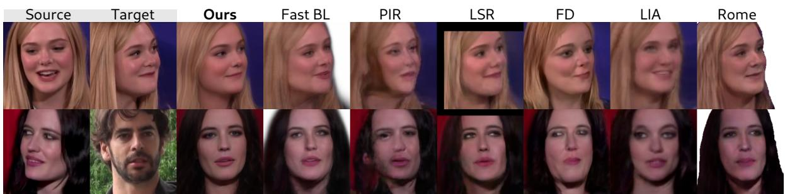
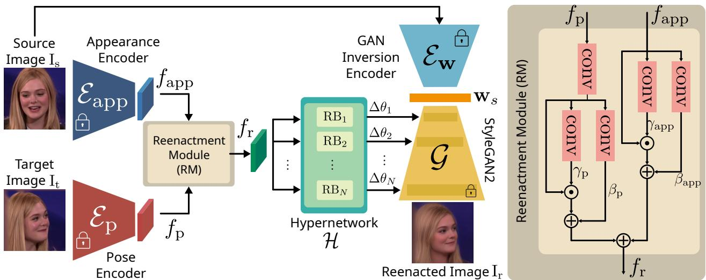
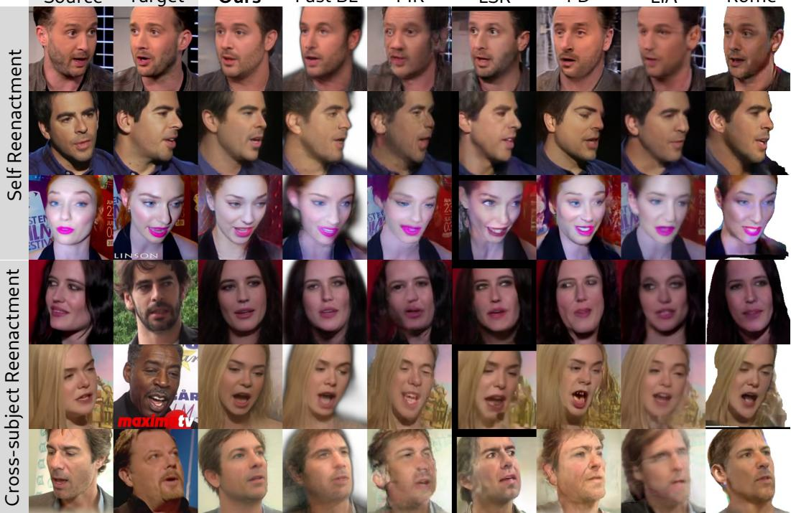
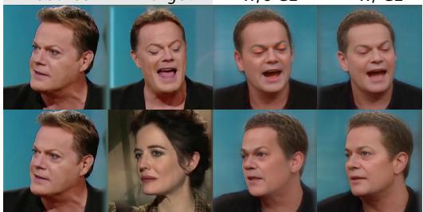
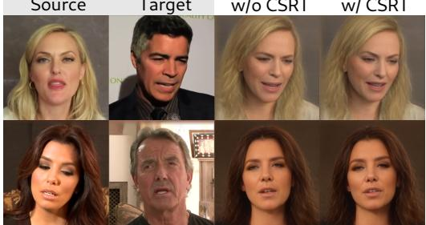
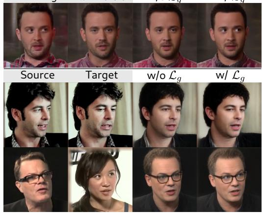

# HyperReenact: One-Shot Reenactment via Jointly Learning to Refine and Retarget Faces

Stella Bounareli1, Christos Tzelepis2, Vasileios Argyriou1, Ioannis Patras2, Georgios Tzimiropoulos2

1 School of Computer Science and Mathematics, Kingston University London 2 School of Electronic Engineering and Computer Science, Queen Mary University of London

  
Figure 1: The proposed method, named HyperReenact, aims to synthesize realistic talking head sequences of a source identity driven by a target facial pose (i.e., 3D head orientation and facial expression). Our method performs both self and cross-subject reenactment and operates under the one-shot setting (i.e., using a single source frame). We demonstrate that the proposed framework can effectively reenact the source faces without producing significant visual artifacts, even on the challenging conditions of extreme head pose difference between the source and the target images (first row) and on crosssubject reenactment (second row). We compare our method against several state-of-the-art works on neural face reenactment, namely Fast BL [62], PIR [37], LSR [29], FD [9], LIA [53] and Rome [26].

## Abstract

In this paper, we present our method for neural face reenactment, called HyperReenact, that aims to generate realistic talking head images of a source identity, driven by a target facial pose. Existing state-of-the-art face reenactment methods train controllable generative models that learn to synthesize realistic facial images, yet producing reenactedfaces that are prone to significant visual artifacts, especially under the challenging condition of extreme head pose changes, or requiring expensive few-shot fine-tuning to better preserve the source identity characteristics. We propose to address these limitations by leveraging the photorealistic generation ability and the disentangled properties of a pretrained StyleGAN2 generator, by first inverting the real images into its latent space and then using a hypernetwork to perform: (i) refinement of the source identity characteristics and (ii) facial pose re-targeting, eliminating this way the dependence on external editing methods that typically produce artifacts. Our method operates under the one-shot setting (i.e., using a single source frame) and allows for cross-subject reenactment, without

requiring any subject-specific fine-tuning. We compare our method both quantitatively and qualitatively against several state-of-the-art techniques on the standard benchmarks of VoxCeleb1 and VoxCeleb2, demonstrating the superiority of our approach in producing artifact-free images, exhibiting remarkable robustness even under extreme head pose changes. We make the code and the pretrained models publicly available at: https://github.com/ StelaBou/HyperReenact.

## 1. Introduction

The recent developments in deep learning and generative models [24, 25] have led to remarkable progress in the field of facial image synthesis and editing. Among the tasks that have drawn benefit from this progress is neural face reenactment, that aims to synthesize photorealistic head avatars. Specifically, given a source and a target image, the goal of face reenactment is to generate a new image that conveys the identity characteristics of the source face and the facial pose (defined as the 3D head orientation and facial expression) of the target face. The key objectives of this task are three-fold: (i) creating realistic facial images that resemble the real ones, (ii) preserving the source identity characteristics, such as the facial shape, and (iii) faithfully transferring the target facial pose. This technology is an essential component within numerous applications of augmented and virtual reality, as well as arts and entertainment industries. However, despite the recent advancements, most of the existing reenactment methods fail in producing realistic facial images in the one-shot setting (i.e., using a single source frame) or under extreme head pose movements (i.e., large differences in the head pose of the source and the target).

The majority of the state-of-the-art methods in neural face reenactment (e.g., [62, 29, 26]) train controllable models that learn to synthesize realistic images. However, these methods are prone to severe visual artifacts, especially when the source and the target faces have large head pose differences. Most of these methods rely on paired data training (i.e., images of the same identity), limiting their applicability in cross-subject reenactment. Several methods [63, 11, 29, 21] require expensive few-shot fine-tuning (i.e., using multiple different views of the source face) in order to faithfully preserve the source identity and appearance. Another line of research leverages the exceptional generation ability of pretrained generative adversarial networks (GANs) [9, 10, 61], achieving to effectively disentangle the identity from the facial pose. However, these works rely on external real image GAN inversion methods and, thus, are bounded by their limitations, such as poor identity reconstruction and image editability [46].

In this paper, we draw inspiration from recent works that combine a GAN generator with a hypernetwork [18] for real image inversion, namely HyperStyle [4] and HyperInverter [14]. These methods use a hypernetwork [18], conditioned on features derived from the original image and its initial inversion, that learns to modify the weights of the generator to obtain improved image reconstruction quality. Subsequently, one can perform semantic editing of the refined image in the latent space and produce the edited image using the updated generator weights. In spite of their high-quality reconstruction results, HyperStyle [4] and HyperInverter [14] fail upon applying global editings on the inverted images and, consequently, they are not practically applicable to neural face reenactment.

In order to address the limitations of state-of-the-art works, we tackle the neural face reenactment task by leveraging the photorealistic image generation and the disentangled properties of a pretrained StyleGAN2 [25], along with a hypernetwork [18]. We present a novel method that performs both faithful identity reconstruction and effective facial image editing (as shown in Fig. 1) by learning to update the weights of a StyleGAN2 generator using a hypernetwork approach. Specifically, our model effectively combines the appearance features of a source image and the facial pose features of a target image to create new facial images that preserve the source identity and convey the target facial pose.

Overall, the main contributions of this paper can be summarized as follows:

1. We present a novel framework for face reenactment that leverages the adaptive nature of hypernetworks [18] to alter the weights of a powerful Style-GAN2 [25], so as to perform both: (i) refinement of the source identity details and (ii) reenactment of the source face in the target facial pose. To the best of our knowledge, we are the first to show the effectiveness of merging the steps of inversion refinement and facial pose editing for robust and realistic face reenactment.

2. We demonstrate that our method is able to successfully operate under one-shot settings (i.e. using a single source frame) without requiring any fine-tuning, preserving the source identity characteristics on both self and cross-subject reenactment scenarios. This holds true even in challenging cases where the source face is partially self-occluded (i.e., in partial facial views due to highly non-frontal head poses).

3. We show that our method achieves state-of-the-art results even on extreme head pose variations, generating artifact-free images and exhibiting remarkable robustness to large head pose shifts.

4. We conduct experiments on the standard benchmarks of VoxCeleb1 and VoxCeleb2 [30, 12], performing qualitative and quantitative comparisons with existing state-of-the-art reenactment techniques. We show that our proposed method achieves compelling results both on identity preservation and facial pose transfer.

## 2. Related work

Facial image editing Several recent methods [41, 45, 48, 6, 31, 32, 58, 2, 35] leverage the remarkable ability of modern pretrained GAN models (e.g., StyleGAN2 [25]) in producing photorealistic facial images in order to edit various facial attributes, such as head pose, facial expressions or hair style. The key idea of such methods lies in learning to manipulate the latent representations (in W, W+ or S latent space) of a StyleGAN2 generator in order to generate meaningful editings of different semantics on the synthetic images. The existing unsupervised methods [50, 48] are able to find disentangled directions that edit different semantics on the facial images, albeit without providing any controllability on the manipulation of the images. In order to allow for explicit control over the image editing, several approaches [2, 10, 45, 35, 47, 60] rely on external supervision from pretrained models, such as 3D Morphable Models (3DMM) [8], or vision-language models [36]. Despite their effectiveness in editing synthetic images, such methods fail to manipulate effectively real images – i.e., having to perform editing in the non-native latent code provided by an external GAN inversion method, as discussed below.

Real image inversion: GAN inversion methods [56, 46, 44] allow for encoding of real images into the latent space of pretrained generators, which is required at the same time to allow for semantic image editing. The main challenges of real image inversion are to (i) faithfully reconstruct the real images and (ii) enable facial image editing without producing visual artifacts. This is typically referred to as the “reconstruction-editability” trade-off. The existing inversion methods mainly focus either on optimization-based approaches, which require expensive iterative optimization for each image, rendering them not-applicable for real-time applications, or on encoder-based architectures.

Encoder-based methods [3, 38, 46, 51, 5] train encoders that learn to predict the latent code that best reconstructs the real image. While providing better semantic editing than optimization-based approaches, encoder-based methods fail in faithfully reconstructing real images (i.e., by missing crucial identity details). In order to coordinate the trade-off between reconstruction quality, editability, and inference time, some recent works [4, 14] propose to optimize a hypernetwork [18] that learns to update the weights of a pretrained GAN generator so as to refine any missing identity details. HyperStyle [4] first inverts the real images into the latent space of StyleGAN2 (W or W+) using a pretrained encoder-based inversion method [46] and then trains a hypernetwork that, given a pair of a real and an initial reconstructed image, predicts an offset $\Delta _ { \ell }$ for each layer of the generator. Both HyperStyle [4] and HyperInverter [14] lead in high quality reconstructions, albeit suffering from many visual artifacts in the case of head pose editing.

Neural face reenactment A recent line of works focus on learning disentangled representations for the identity and the facial pose using facial landmarks [63, 62, 22, 19, 64]. However, such methods perform poorly on the challenging task of cross-subject reenactment, since facial landmarks preserve the facial shape and consequently the identity geometry of the target face. In order to mitigate the identity leakage from the target face to the source face, several methods [28, 17, 45, 9, 15, 37, 26, 59] leverage the disentangled properties of 3D Morphable Models (3DMM) [8, 16]. Xu et al. [57] propose a unified architecture that learns to perform both face reenactment and swapping. Warping based methods [54, 42, 52, 37, 15, 66, 61, 53] learn a motion field between the source and target frames in order to synthesize the reenacted faces. [15, 37] propose a two-stage architecture that first generates a warped image using the learned motion field and then refines the warped image to minimize the visual artifacts caused by the warping operation.

Despite their realistic results in small pose variations, such methods fail in the more challenging and realistic condition of large head pose variations (i.e., under large differences between the target and the source head pose).

A more recent line of works [9, 61, 10] propose the incorporation of the powerful pretrained StyleGAN2 model. StyleHEAT [61] proposes to control the spatial features of the pretrained StyleGAN2 generator using a learned motion field between the source and target frames. However, their method is trained on the HDTF dataset [66], i.e., a video dataset with mostly frontal talking head videos, leading to poor reenactment performance on more realistic datasets, such as VoxCeleb [30, 12], which comprises of a larger distribution on the existing head poses. Bounareli et al. [9] propose to fine-tune a StyleGAN2 model (pretrained on FFHQ [24]) on VoxCeleb1 dataset [30] and then learn the linear directions that are responsible for controlling the changes in the facial pose. For editing the real images, [9] relies on the encoder-based inversion method of [46], which results in visual artifacts on large head pose variations and requires an additional optimization step [39] to refine the missing identity details. Finally, [10] proposes to disentangle the identity characteristics from the facial pose by leveraging the disentangled properties of StyleGAN2’s style space.

In this work, we also use the StyleGAN2 generator, pretrained on VoxCeleb [9], which allows for better generalization on other existing video datasets [66, 40]. To the best of our knowledge, we are the first to propose the optimization of a hypernetwork [18] based reenactment module, merging this way the steps of inversion refinement and facial pose editing towards robust and realistic face reenactment.

## 3. Proposed method

In this section we present the proposed HyperReenact framework for neural face reenactment. An overview of the method is shown in Fig. 2. In a nutshell, the hypernetwork H, guided by the source appearance $( f _ { \mathrm { a p p } } )$ and target facial pose $( f _ { \mathrm { p } } )$ related features, learns to predict the offsets $\Delta \theta _ { \ell } , \ell = 1 , \ldots , N$ , where N is the total number of the layers in the generator G. Then, given the initial latent code ${ \bf w } _ { s }$ and the updated weights $\hat { \theta } = \theta \cdot ( 1 + \Delta \theta )$ , the generator G is able to generate an image that has the identity of the source and the facial pose of the target face.

## 3.1. GAN Inversion

The generator of StyleGAN2 [25] takes as input random latent codes $\mathbf { z } \in \mathbb { R } ^ { 5 1 2 }$ sampled from the standard Gaussian distribution, which are then fed to the mapping network to get the intermediate latent codes $\mathbf { w } \in \mathbb { R } ^ { 5 \bar { 1 2 } }$ (i.e., codes in the W space). Most inversion methods $\left( \mathrm { e . g . , ~ } [ 1 , 4 6 ] \right)$ invert to W space or its extended $W ^ { + } ~ \subseteq ~ \mathbb { R } ^ { N \times 5 1 2 }$ space, where a different latent code is fed to each of the N layer of the generator. Tov et al. [46] show that, using the $\mathcal { W } ^ { + }$ latent space for real image inversion, results in better reconstruction quality. However, it can be challenging to edit the real images using $\mathcal { W } ^ { + }$ , in particular when altering the head pose, as this can lead to severe visual artifacts (e.g., [9]). In this work, in order to get an initial inverted latent code, we use e4e [46], which inverts the real images into the $\mathcal { W } ^ { + }$ space. We note that we use an off-the-shelf inversion model, trained on the VoxCeleb1 [30] dataset and provided by the authors of [9], for the initial inversion step, while during training the inversion encoder ${ \mathcal E } _ { \mathrm { w } }$ is not updated (see Fig. 2).

  
Figure 2: HyperReenact network architecture Given a source (I ) and a target (I ) image, we first extract the source appearance features, $f _ { \mathrm { a p p } }$ , and the target pose features, $f _ { \mathrm { p } } ,$ using the appearance $( \mathcal E _ { \mathrm { a p p } } )$ and the pose $( \mathcal E _ { \mathrm { p } } )$ encoders, respectively. The Reenactment Module (RM) learns to effectively fuse these features, producing a feature map $f _ { \mathrm r }$ that serves as input into each Reenactment Block (RB) of our hypernetwork module H. The predicted offsets, $\Delta \theta ,$ , update the weights of the Style GAN2 generator $\mathcal { G }$ so that using the inverted latent code $\mathrm { w _ { s } }$ generates a new image $\mathrm { I _ { r } }$ that conveys the identity characteristics of the source face and the facial pose of the target face. We note that, during training, the encoders $\mathcal { E } _ { \mathrm { a p p } } ,$ and $\mathcal { E } _ { \mathrm { { p } } } ,$ along with the generator $\mathcal { G }$ are kept frozen, and we optimize only the Reenactment Module (RM) and the hypernetwork module $\mathcal { H } .$

## 3.2. HyperReenact Architecture

The proposed HyperReenact aims to modify the weights θ of the generator $\mathcal { G }$ to both lead to better reconstruction (without any further optimization steps) and perform neural face reenactment eliminating any visual artifacts on the generated images (Fig. 2). Given a pair of source and target images our framework first extracts the corresponding appearance $f _ { \mathrm { a p p } }$ and facial pose $f _ { \mathrm { p } }$ features. Specifically, to encode the appearance of a face we use the ArcFace [13] encoder $E _ { \mathrm { a p p } }$ . ArcFace is trained on the face recognition task, as a result its features only capture the identity characteristics of a face. We note that we extract the feature map $f _ { \mathrm { a p p } }$ of shape $5 1 2 \times 7 \times 7$ picking the output of the last convolutional layer of ArcFace. Similarly, to encode the facial pose of a face we use the encoder ${ \mathcal E } _ { \mathrm { p } } ,$ , which is a pretrained 3D shape model (DECA [16]). DECA is trained on

3D facial shape model reconstruction, hence the extracted features only capture the facial pose, without taking into consideration the appearance. We extract the feature map $f _ { \mathrm { p } }$ of shape $2 0 4 8 \times 7 \times 7 ,$ picking the output of the last convolutional layer of ${ \mathcal E } _ { \mathrm { p } }$

Our goal is to guide the hypernetwork with a feature map that combines the appearance features from the source image and the facial pose features from the target image. Inspired by the Spatially-Adaptive Denormalization (SPADE) module [33], we propose to blend the two feature maps, $f _ { \mathrm { a p p } }$ and $f _ { \mathrm { p } }$ , using the Reenactment Module (RM). As shown in Fig. 2, the RM includes a $1 \times 1$ convolution to project $f _ { \mathrm { p } }$ into the same channel size as $f _ { \mathrm { a p p } }$ , obtaining $f _ { \mathrm { p } } ^ { \prime } .$ Then, for each feature map, we learn two modulation parameters, namely $\gamma$ and $\beta .$ . The final combined feature map $f _ { \mathrm r }$ with size $5 1 2 \times 7 \times 7$ is calculated as:

$$
f _ { \mathrm { r } } = \gamma _ { \mathrm { a p p } } \odot f _ { \mathrm { a p p } } + \beta _ { \mathrm { a p p } } + \gamma _ { \mathrm { p } } \odot f _ { \mathrm { p } } ^ { \prime } + \beta _ { \mathrm { p } } ,\tag{1}
$$

where ⊙ denotes the element-wise multiplication.

Our hypernetwork module follows a similar architecture with the one in HyperStyle [4]. Specifically, it consists of M $\subset \mathrm { N }$ Reenactment Blocks (RB), where M is the number of layers we control and N is the total number of layers of the generator. Each RB takes as input the combined feature map $f _ { \mathrm r }$ and outputs an offset $\Delta \theta _ { \ell }$ of size $C _ { \ell } ^ { o u t } \times C _ { \ell } ^ { i n } \times 1 \times 1$ We then spatially repeat each offset by the kernel dimension of each layer $k _ { \ell } \times k _ { \ell } .$ , significantly reducing the number of learnable parameters [4]. Finally, the updated weights for each layer ℓ of the generator are computed as $\hat { \theta } _ { \ell } = \theta _ { \ell } \cdot ( 1 +$ $\Delta \theta _ { \ell } )$ . We provide a detailed analysis on the architecture of our hypernetwork module in the supplementary material.

## 3.3. Training Process

We train the proposed HyperReenact framework following a curriculum learning (CL) scheme [7], where we gradually increase the complexity of the training data. Specifically, we first train our network on real image inversion, where the source and target faces are the same. We further train our model on the task of self reenactment, where the source and target faces have the same identity but different facial pose. Finally, we continue training our model on cross-subject reenactment, where the source and target faces have different identity and facial pose. In Section 4.2, we show that the proposed curriculum learning scheme improves our results. We detail each training phase below.

Phase 1: Real image inversion On the first training phase, the source $( \mathrm { I } _ { s } )$ and the target (It) images are the same to the input image (I). Given the appearance and facial pose of the input image I as well as the initial inverted latent code w, we train our network to refine the missing identity details between the real image and its initial reconstruction using w. Our training objective during the inversion phase consists of the following reconstruction loss terms:

$$
\mathcal { L } = \lambda _ { p i x } \mathcal { L } _ { p i x } + \lambda _ { l p i p s } \mathcal { L } _ { l p i p s } + \lambda _ { i d } \mathcal { L } _ { i d } + \lambda _ { g } \mathcal { L } _ { g } ,\tag{2}
$$

where $\mathcal { L } _ { p i x }$ is the $\ell _ { 1 }$ pixel-wise loss and $\mathcal { L } _ { l p i p s }$ is the perceptual loss [23] between the real I and the refined ˆI image. Additionally, to further enhance the identity preservation we calculate the identity loss $\mathcal { L } _ { i d }$ that computes the cosine similarity of the features extracted using the ArcFace [13]. Finally, to allow for refinement of the eye gaze direction, we calculate the gaze loss $\mathcal { L } _ { g } .$ , which is the L2 distance between the gaze direction of the real image and the reconstructed image ˆI, extracted using a gaze estimation method [65]. To this end, our framework is able to refine the missing identity details from the initial reconstructed images.

Phase 2: Self reenactment During the second training phase, we train our model on self reenactment where the identity of the input source and target images is the same and the facial pose is different. Given the appearance of the source image Is and the facial pose of the target image It, the hypernetwork is trained to predict the offsets $\Delta \theta$ so that the reenacted image Ir has the identity of the source image and the facial pose of the target image. The objective during this phase is:

$$
\mathcal { L } = \lambda _ { p i x } \mathcal { L } _ { p i x } + \lambda _ { l p i p s } \mathcal { L } _ { l p i p s } + \lambda _ { i d } \mathcal { L } _ { i d } + \lambda _ { s h } \mathcal { L } _ { s h } + \lambda _ { g } \mathcal { L } _ { g } ,\tag{3}
$$

where $\mathcal { L } _ { p i x } , \mathcal { L } _ { l p i p s } , \mathcal { L } _ { i d } .$ , and $\mathcal { L } _ { g }$ denote the losses described above, calculated between the target image $\mathrm { I } _ { t }$ and the reenacted image $\mathrm { I } _ { r }$ . In order to transfer the facial pose of the target image, we calculate the shape loss $\mathcal { L } _ { s h }$ , i.e., the $\ell _ { 1 }$ distance of the 3D facial shapes extracted using [16] from the target and the reenacted image.

Phase 3: Cross-subject reenactment To further enhance our results on cross-subject reenactment, we propose to fine-tune our model trained on self reenactment using crosssubject image pairs. As cross-subject training is a challenging task, to ease the training process, we concurrently perform training for the tasks of self and cross-subject reenactment, by letting half of the image pairs in each batch to correspond to each task. Our training objective is the same as the one defined in (3), however, for the cross-subject batch samples we only calculate the identity $\mathcal { L } _ { i d }$ loss between the source and the reenacted images and the shape loss $\mathcal { L } _ { s h }$ between the target and the reenacted images.

## 4. Experiments

In this section, we provide the implementation details and we present our quantitative and qualitative results and comparisons with state-of-the-art methods. In Section 4.1, we report results on self and cross-subject reenactment on the VoxCeleb1 [30] dataset, and in Section 4.2, we provide ablation studies to investigate the contribution of each design choice to the overall effectiveness of our method.

Implementation details We use the StyleGAN2 model [25] and the e4e inversion model [46] trained on the VoxCeleb1 dataset provided by [9] and we train our model on the same dataset with 256 × 256 images. We note that the only trainable modules of our method are the the Reenactment Module (RM) and the hypernetwork H , while the encoders ${ \mathcal E } _ { \mathrm { w } }$ $\mathcal { E } _ { \mathrm { a p p } } ,$ and $\mathcal { E } _ { \mathrm { { p } } } .$ , along with the StyleGAN2 generator $\mathcal { G }$ are kept frozen (Fig. 2). We also note that we learn offsets for all the layers of the StyleGAN2 generator, except for the “toRGB” layers that mainly change the texture and the color of images [55] (please see the supplementary material for more details). We first train our model on the task of real image inversion with learning rate $2 \cdot 1 0 ^ { - 4 }$ and we continue on the task of self reenactment with the same learning rate and a batch size of 16. We finally fine-tune our model on cross-subject reenactment with a constant learning rate of $1 0 ^ { - 4 }$ . We set $\lambda _ { p i x } = 1 0 . 0 , \lambda _ { l p i p s } = 5 . 0 , \lambda _ { i d } = 1 0 . 0 $ $\lambda _ { s h } = 0 . 5$ and $\lambda _ { g } = 2 . 0$ . All models are optimized with Adam optimizer [27] and are implemented in PyTorch [34].

## 4.1. Comparison with state-of-the-art methods

We evaluate our method on the test set of the Vox-Celeb1 [30] dataset and we provide additional quantitative and qualitative results on the test set of the VoxCeleb2 [12] dataset in the supplementary material. We compare our framework with 10 state-of-the-art methods that have made their source code and models publicly available, namely, X2Face [54], FOMM [42], Neural [11], Fast BL [62],

<table><tr><td rowspan=2 colspan=1>Method</td><td rowspan=1 colspan=6>Self Reenactment</td><td rowspan=1 colspan=3>Cross-subject Reenactment</td><td rowspan=2 colspan=1>User Pref.(%)</td></tr><tr><td rowspan=1 colspan=1>CSIM↑</td><td rowspan=1 colspan=1>LPIPS↓</td><td rowspan=1 colspan=1>FID↓</td><td rowspan=1 colspan=1>FVD↓</td><td rowspan=1 colspan=1>APD↓</td><td rowspan=1 colspan=1>AED↓</td><td rowspan=1 colspan=1>CSIM↑</td><td rowspan=1 colspan=1>APD↓</td><td rowspan=1 colspan=1>AED↓</td></tr><tr><td rowspan=1 colspan=1>X2Face [54]</td><td rowspan=1 colspan=1>0.70</td><td rowspan=1 colspan=1>0.21</td><td rowspan=1 colspan=1>25.6</td><td rowspan=1 colspan=1>490</td><td rowspan=1 colspan=1>1.3</td><td rowspan=1 colspan=1>9.0</td><td rowspan=1 colspan=1>0.57</td><td rowspan=1 colspan=1>2.2</td><td rowspan=1 colspan=1>16.4</td><td rowspan=1 colspan=1></td></tr><tr><td rowspan=1 colspan=1>FOMM [42]</td><td rowspan=1 colspan=1>0.64</td><td rowspan=1 colspan=1>0.27</td><td rowspan=1 colspan=1>35.3</td><td rowspan=1 colspan=1>523</td><td rowspan=1 colspan=1>4.6</td><td rowspan=1 colspan=1>12.6</td><td rowspan=1 colspan=1>0.53</td><td rowspan=1 colspan=1>10.9</td><td rowspan=1 colspan=1>20.9</td><td rowspan=1 colspan=1></td></tr><tr><td rowspan=1 colspan=1>Neural [11]</td><td rowspan=1 colspan=1>0.40</td><td rowspan=1 colspan=1>0.42</td><td rowspan=1 colspan=1>127.0</td><td rowspan=1 colspan=1>617</td><td rowspan=1 colspan=1>1.2</td><td rowspan=1 colspan=1>8.8</td><td rowspan=1 colspan=1>0.34</td><td rowspan=1 colspan=1>1.8</td><td rowspan=1 colspan=1>15.3</td><td rowspan=1 colspan=1>–</td></tr><tr><td rowspan=1 colspan=1>Fast BL [62]</td><td rowspan=1 colspan=1>0.65</td><td rowspan=1 colspan=1>0.41</td><td rowspan=1 colspan=1>55.0</td><td rowspan=1 colspan=1>706</td><td rowspan=1 colspan=1>1.0</td><td rowspan=1 colspan=1>7.6</td><td rowspan=1 colspan=1>0.58</td><td rowspan=1 colspan=1>1.4</td><td rowspan=1 colspan=1>14.7</td><td rowspan=1 colspan=1>5.9</td></tr><tr><td rowspan=1 colspan=1>PIR [37]</td><td rowspan=1 colspan=1>0.69</td><td rowspan=1 colspan=1>0.23</td><td rowspan=1 colspan=1>50.5</td><td rowspan=1 colspan=1>545</td><td rowspan=1 colspan=1>1.9</td><td rowspan=1 colspan=1>9.7</td><td rowspan=1 colspan=1>0.61</td><td rowspan=1 colspan=1>2.4</td><td rowspan=1 colspan=1>15.4</td><td rowspan=1 colspan=1>1.1</td></tr><tr><td rowspan=1 colspan=1>LSR [29]</td><td rowspan=1 colspan=1>0.59</td><td rowspan=1 colspan=1>0.26</td><td rowspan=1 colspan=1>63.0</td><td rowspan=1 colspan=1>484</td><td rowspan=1 colspan=1>1.0</td><td rowspan=1 colspan=1>7.5</td><td rowspan=1 colspan=1>0.50</td><td rowspan=1 colspan=1>1.5</td><td rowspan=1 colspan=1>13.1</td><td rowspan=1 colspan=1>5.0</td></tr><tr><td rowspan=1 colspan=1>FD [9]</td><td rowspan=1 colspan=1>0.65</td><td rowspan=1 colspan=1>0.23</td><td rowspan=1 colspan=1>19.0</td><td rowspan=1 colspan=1>400</td><td rowspan=1 colspan=1>1.0</td><td rowspan=1 colspan=1>6.5</td><td rowspan=1 colspan=1>0.49</td><td rowspan=1 colspan=1>1.7</td><td rowspan=1 colspan=1>10.2</td><td rowspan=1 colspan=1>4.1</td></tr><tr><td rowspan=1 colspan=1>LIA [53]</td><td rowspan=1 colspan=1>0.64</td><td rowspan=1 colspan=1>0.26</td><td rowspan=1 colspan=1>31.7</td><td rowspan=1 colspan=1>510</td><td rowspan=1 colspan=1>4.7</td><td rowspan=1 colspan=1>11.4</td><td rowspan=1 colspan=1>0.57</td><td rowspan=1 colspan=1>2.8</td><td rowspan=1 colspan=1>15.7</td><td rowspan=1 colspan=1>5.9</td></tr><tr><td rowspan=1 colspan=1>Dual [21]</td><td rowspan=1 colspan=1>0.26</td><td rowspan=1 colspan=1>0.39</td><td rowspan=1 colspan=1>46.5</td><td rowspan=1 colspan=1>600</td><td rowspan=1 colspan=1>3.4</td><td rowspan=1 colspan=1>12.5</td><td rowspan=1 colspan=1>0.19</td><td rowspan=1 colspan=1>3.1</td><td rowspan=1 colspan=1>16.9</td><td rowspan=3 colspan=1>10.267.8</td></tr><tr><td rowspan=1 colspan=1>Rome [26]</td><td rowspan=1 colspan=1>0.69</td><td rowspan=1 colspan=1>0.43</td><td rowspan=1 colspan=1>39.2</td><td rowspan=1 colspan=1>800</td><td rowspan=1 colspan=1>1.5</td><td rowspan=1 colspan=1>5.6</td><td rowspan=2 colspan=1>0.630.68</td><td rowspan=2 colspan=1>1.20.5</td><td rowspan=2 colspan=1>8.89.3</td></tr><tr><td rowspan=1 colspan=1>Ours</td><td rowspan=1 colspan=1>0.71</td><td rowspan=1 colspan=1>0.23</td><td rowspan=1 colspan=1>27.1</td><td rowspan=1 colspan=1>480</td><td rowspan=1 colspan=1>0.5</td><td rowspan=1 colspan=1>5.1</td></tr></table>

Table 1: Quantitative results on self and cross-subject reenactment. For CSIM metric, higher is better (↑), while for the rest of the metrics lower is better (↓). We note that the best and second best results are shown in bold and underline respectively.

Source  
Target  
Ours  
Fast BL  
PIR  
LSR  
FD  
LIA  
Rome  
  
Figure 3: Qualitative results and comparisons on self (first 3 rows) and cross-subject reenactment (last 3 rows) on Vox-Celeb1 [30]. Our method is able to faithfully preserve the identity characteristics and also effectively transfer the head pose, the facial expression and the gaze direction of the target face without producing significant visual artifacts.

PIR [37], LSR [29], FD [9], LIA [53], Dual [21], and Rome [26]. In the supplementary material, we provide additional comparisons with StyleHEAT [61] and Style-Mask [10]. We also note that regarding the methods of Neural [11], LSR [29], FD [9] and Dual [21], we perform one-shot fine-tuning on a single source frame from each test video for fair comparisons against the proposed method.

Quantitative results We evaluate our method on two tasks, namely, self reenactment and cross-subject reenactment. For self reenactment, we calculate six different evaluation metrics. Specifically, we measure the identity preservation by calculating the cosine similarity (CSIM) of the features extracted using the ArcFace face recognition network [13], and the reconstruction quality using the Learned Perceptual Image Path Similarity (LPIPS) metric [23]. Additionally, we calculate the Frechet-Inception Distance (FID) [´ 20] to measure the quality of the reenacted images and the Frechet-Video Distance (FVD) [ ´ 49, 43] to measure the temporal consistency of the generated videos. Finally, to evaluate the facial pose transfer, we calculate the Average Pose Distance (APD) and the Average Expression Distance (AED), similarly to [37]. All metrics for self reenactment are calculated between the target and the reenacted images. When evaluating our method on the task of cross-subject reenactment, we calculate the CSIM metric between the source and the reenacted images, and we also calculate the APD and AED. In Table 1, we report results both on self and on cross-subject reenactment. We note that for self reenactment we report results on the test set of VoxCeleb1, where the first extracted frame from each video is used as the source frame and all other frames are used as the target ones. For cross-subject reenactment, we randomly select 35 video pairs from the test set of VoxCeleb1. In the task of self reenactment, our method outperforms all other techniques on identity preservation (CSIM), as well as on pose (APD) and facial expression (AED) transfer, while on LPIPS, FID and FVD metrics our method is among the best results. In the more challenging task of cross-subject reenactment, our method outperforms all other techniques on identity preservation and head pose transfer, while being on-par with Rome [26] on expression transfer.

Moreover, we conduct a user study to further assess the performance of the proposed method in comparison to stateof-the-art works. Specifically, we present 20 randomly selected image pairs, 10 of self and 10 of cross-subject reenactment, to 30 users and ask them to select the method that best reenacts the source frame in terms of (i) identity preservation, (ii) facial pose transfer, and (iii) image quality. We note that we opt to include only the methods that exhibit high performance on both quantitative and qualitative results. That is, we exclude X2Face [54] and FOMM [42], since they lead to several visual artifacts (as shown in the supplementary material). Similarly, we exclude Neural [11] and Dual [21] due to their poor quantitative results. As shown in Table 1, our method is by far the most preferable.

Finally, in order to evaluate the proposed method under the challenging (and far more useful in real-world applications) condition of large variations between the head pose of the source and target frames, we build a small benchmark set for the task of self reenactment, containing pairs of images with large head pose differences. Specifically, from each video of the VoxCeleb1 test set we select 5 image pairs with head pose distance (measured as the average of the absolute differences between the 3 Euler angles) larger than 15◦. We report results in Table 2. Our method outperforms all other techniques on identity preservation and head pose transfer, while ranking second and performing on par with the method of Rome [26] on expression transfer.

Qualitative results In Fig. 3, we show qualitative comparisons on self and cross-subject reenactment. We note that for better visualization we report results only with the best performing methods, namely, Fast BL [62], PIR [37], LSR [29], FD [9], LIA [53] and Rome [26]. On the supplementary material we present additional comparisons with all methods. As shown, our method is able to produce mostly artifact free images, successfully preserve the source identity characteristics and faithfully transfer the target facial pose (i.e. head pose orientation, facial expression and gaze direction), even on the challenging task of crosssubject reenactment and on extreme head pose differences.

<table><tr><td rowspan=1 colspan=1>Method</td><td rowspan=1 colspan=1>CSIM↑</td><td rowspan=1 colspan=1>APD↓</td><td rowspan=1 colspan=1>AED↓</td></tr><tr><td rowspan=2 colspan=1>X2Face [54]FOMM [42]</td><td rowspan=1 colspan=1>0.45</td><td rowspan=1 colspan=1>3.1</td><td rowspan=1 colspan=1>12.1</td></tr><tr><td rowspan=1 colspan=1>0.44</td><td rowspan=1 colspan=1>3.2</td><td rowspan=1 colspan=1>12.7</td></tr><tr><td rowspan=1 colspan=1>Neural [11]</td><td rowspan=1 colspan=1>0.38</td><td rowspan=1 colspan=1>1.5</td><td rowspan=1 colspan=1>8.9</td></tr><tr><td rowspan=1 colspan=1>Fast BL [62]</td><td rowspan=1 colspan=1>0.44</td><td rowspan=1 colspan=1>1.5</td><td rowspan=1 colspan=1>9.0</td></tr><tr><td rowspan=1 colspan=1>PIR [37]</td><td rowspan=1 colspan=1>0.40</td><td rowspan=1 colspan=1>4.0</td><td rowspan=1 colspan=1>11.9</td></tr><tr><td rowspan=1 colspan=1>LSR [29]</td><td rowspan=1 colspan=1>0.48</td><td rowspan=1 colspan=1>1.4</td><td rowspan=1 colspan=1>8.5</td></tr><tr><td rowspan=1 colspan=1>FD [9]</td><td rowspan=1 colspan=1>0.34</td><td rowspan=1 colspan=1>2.7</td><td rowspan=1 colspan=1>10.4</td></tr><tr><td rowspan=1 colspan=1>LIA [53]</td><td rowspan=1 colspan=1>0.43</td><td rowspan=1 colspan=1>3.0</td><td rowspan=1 colspan=1>9.9</td></tr><tr><td rowspan=1 colspan=1>Dual [21]</td><td rowspan=1 colspan=1>0.23</td><td rowspan=1 colspan=1>4.9</td><td rowspan=1 colspan=1>12.6</td></tr><tr><td rowspan=2 colspan=1>Rome [26]Ours</td><td rowspan=1 colspan=1>0.53</td><td rowspan=1 colspan=1>1.1</td><td rowspan=1 colspan=1>5.8</td></tr><tr><td rowspan=1 colspan=1>0.58</td><td rowspan=1 colspan=1>0.9</td><td rowspan=1 colspan=1>6.2</td></tr></table>

Table 2: Quantitative results on self reenactment using a set of images with large head pose differences between the source and target faces (subset of the VoxCeleb1 test set).

## 4.2. Ablation studies

In this section, we report the results of the ablation studies we performed to assess the contribution of: (a) the proposed curriculum learning (CL) scheme, (b) fine-tuning on the task of cross-subject reenactment, and (c) the gaze loss. Regarding (a), i.e. the contribution of the proposed curriculum learning scheme (Section 3.3), we provide results both on self and on cross-subject reenactment with our final model trained using the curriculum learning (CL) scheme and with a model trained directly on the task of self and cross-subject reenactment. As shown in Table. 3, our model trained with CL achieves better results on head pose (APD), expression transfer (AED), and identity preservation on self reenactment. This is also shown in Fig. 4, where using CL leads to results less visual artifacts on the reenacted images.

For (b), we compare our method with and without training with cross-subject data. As shown in Table 4, when finetuning our method with cross-subject data, our quantitative results with respect to identity preservation (CSIM) are improved especially on cross-subject reenactment. The effect of cross-subject training on the identity preservation is also shown in Fig. 5, where we eliminate the identity leakage

Real Image Init. Inversion  
Source  
w/ CL
<table><tr><td rowspan=2 colspan=1>Method</td><td rowspan=1 colspan=3>Self Reenactment</td><td rowspan=1 colspan=3>Cross Reenactment</td></tr><tr><td rowspan=1 colspan=1>CSIM</td><td rowspan=1 colspan=1>APD</td><td rowspan=1 colspan=1>AED</td><td rowspan=1 colspan=1>CSIM</td><td rowspan=1 colspan=1>APD</td><td rowspan=1 colspan=1>AED</td></tr><tr><td rowspan=1 colspan=1>w/o CLw/ CL</td><td rowspan=1 colspan=1>0.690.71</td><td rowspan=1 colspan=1>0.70.5</td><td rowspan=1 colspan=1>6.75.1</td><td rowspan=1 colspan=1>0.720.68</td><td rowspan=1 colspan=1>0.60.5</td><td rowspan=1 colspan=1>11.69.3</td></tr></table>

Table 3: Quantitative results on self and cross-subject reenactment with and without using curriculum learning (CL).

Source  
Target  
w/o CL  
  
Figure 4: Qualitative results on self and cross-subject reenactment with and without using the proposed CL scheme.

Target  
w/o CSRT  
  
Figure 5: Qualitative results on cross-subject reenactment with and without training with cross-subject data (CSRT).

from the target images into the reenacted ones.
<table><tr><td rowspan="2">Method</td><td colspan="2">CSIM↑</td></tr><tr><td>SR</td><td>CR</td></tr><tr><td>w/o CSRT</td><td>0.69</td><td>0.53</td></tr><tr><td>w/ CSRT</td><td>0.71</td><td>0.68</td></tr></table>

Table 4: Quantitative results on self (SR) and crosssubject (CR) reenactment with and without performing cross-subject reenactment training (CSRT).

For (c), we perform experiments with and without using the gaze loss $\mathcal { L } _ { g }$ and we evaluate its contribution both quantitatively (Table 5) and qualitatively (Fig. 6). Specifically, in Table 5 we calculate the Gaze Error, i.e., the $\ell _ { 2 }$ distance between the gaze direction of the real and the generated images on three different tasks, namely, real image inversion (I), self reenactment (SR), and cross-subject reenactment

$$
\underline { { \boldsymbol { \mathcal { L } } } } _ { q }
$$

w/ $\underline { { \mathcal { L } } } _ { \boldsymbol { q } }$  
  
Figure 6: Illustration of the impact of the gaze loss $\mathcal { L } _ { g }$ on the generated images, on the tasks of real image inversion and self/cross-subject reenactment.

(CR). Moreover, in Fig. 6 we present examples of real image inversion (first row) and self and cross-subject reenactment (last two rows), with and without the gaze loss, where we observe that using the gaze loss improves the faithful reconstruction of the gaze direction of the target images.

<table><tr><td rowspan="2">Method</td><td colspan="3">Gaze Error ↓</td></tr><tr><td>I</td><td>SR</td><td>CR</td></tr><tr><td>w/o  $\mathcal { L } _ { g }$ </td><td>0.34</td><td>0.35</td><td>0.40</td></tr><tr><td>w/  $\mathcal { L } _ { g }$ </td><td>0.24</td><td>0.25</td><td>0.31</td></tr></table>

Table 5: Ablation on the impact of gaze loss $\mathcal { L } _ { g }$ . The gaze error is calculated on real image inversion (I), self reenactment (SR) and cross-subject reenactment (CR) tasks.

## 5. Conclusions

In this paper, we present HyperReenact, a method for neural face reenactment that jointly learns to refine and re-target the facial images using a pretrained StyleGAN2 model and a hypernetwork. We leverage the effectiveness of hypernetworks on the real image inversion task and extend their use for real image manipulation. Our method learns to fuse the disentangled representations of source identity and target facial pose, to effectively modify the weights of the generator, performing both identity refinement and facial pose re-targeting. We show that our approach can successfully reenact a source face, preserving the identity and transferring the target facial pose. We also demonstrate that our method can produce artifact-free images even on challenging cases of extreme head pose movements.

Acknowledgments: This work was supported by the EU H2020 AI4Media No. 951911 project.

## References

[1] Rameen Abdal, Yipeng Qin, and Peter Wonka. Image2stylegan: How to embed images into the stylegan latent space? In Proceedings ofthe IEEE/CVF International Conference on Computer Vision, pages 4432–4441, 2019. 3

[2] Rameen Abdal, Peihao Zhu, Niloy J Mitra, and Peter Wonka. Styleflow: Attribute-conditioned exploration of stylegangenerated images using conditional continuous normalizing flows. ACM Transactions on Graphics (ToG), 40(3), 2021. 2

[3] Yuval Alaluf, Or Patashnik, and Daniel Cohen-Or. Restyle: A residual-based stylegan encoder via iterative refinement. In Proceedings of the IEEE/CVF International Conference on Computer Vision, pages 6711–6720, 2021. 3

[4] Yuval Alaluf, Omer Tov, Ron Mokady, Rinon Gal, and Amit Bermano. Hyperstyle: Stylegan inversion with hypernetworks for real image editing. In Proceedings of the IEEE/CVF Conference on Computer Vision and Pattern Recognition, pages 18511–18521, 2022. 2, 3, 4

[5] Qingyan Bai, Yinghao Xu, Jiapeng Zhu, Weihao Xia, Yujiu Yang, and Yujun Shen. High-fidelity gan inversion with padding space. In European Conference on Computer Vision, pages 36–53. Springer, 2022. 3

[6] Simone Barattin, Christos Tzelepis, Ioannis Patras, and Nicu Sebe. Attribute-preserving face dataset anonymization via latent code optimization. In Proceedings of the IEEE/CVF Conference on Computer Vision and Pattern Recognition, pages 8001–8010, 2023. 2

[7] Yoshua Bengio, Jer´ ome Louradour, Ronan Collobert, and Ja-ˆ son Weston. Curriculum learning. In Proceedings ofthe 26th annual international conference on machine learning, pages 41–48, 2009. 5

[8] Volker Blanz and Thomas Vetter. A morphable model for the synthesis of 3d faces. In Proceedings of the 26th annual conference on Computer graphics and interactive techniques, 1999. 3

[9] Stella Bounareli, Vasileios Argyriou, and Georgios Tzimiropoulos. Finding directions in gan’s latent space for neural face reenactment. British Machine Vision Conference (BMVC), 2022. 1, 2, 3, 4, 5, 6, 7

[10] Stella Bounareli, Christos Tzelepis, Vasileios Argyriou, Ioannis Patras, and Georgios Tzimiropoulos. Stylemask: Disentangling the style space of stylegan2 for neural face reenactment. IEEE Conference on Automatic Face and Gesture Recognition, 2023. 2, 3, 6

[11] Egor Burkov, Igor Pasechnik, Artur Grigorev, and Victor Lempitsky. Neural head reenactment with latent pose descriptors. In CVPR, 2020. 2, 5, 6, 7

[12] J. S. Chung, A. Nagrani, and A. Zisserman. Voxceleb2: Deep speaker recognition. In INTERSPEECH, 2018. 2, 3, 5

[13] Jiankang Deng, Jia Guo, Niannan Xue, and Stefanos Zafeiriou. Arcface: Additive angular margin loss for deep face recognition. In Proceedings of the IEEE/CVF conference on computer vision and pattern recognition, pages 4690–4699, 2019. 4, 5, 6

[14] Tan M Dinh, Anh Tuan Tran, Rang Nguyen, and Binh-Son Hua. Hyperinverter: Improving stylegan inversion via hypernetwork. In Proceedings of the IEEE/CVF Conference

on Computer Vision and Pattern Recognition, pages 11389– 11398, 2022. 2, 3

[15] Michail Christos Doukas, Stefanos Zafeiriou, and Viktoriia Sharmanska. Headgan: One-shot neural head synthesis and editing. In Proceedings ofthe IEEE/CVF International Conference on Computer Vision, pages 14398–14407, 2021. 3

[16] Yao Feng, Haiwen Feng, Michael J Black, and Timo Bolkart. Learning an animatable detailed 3d face model from inthe-wild images. ACM Transactions on Graphics (TOG), 40(4):1–13, 2021. 3, 4, 5

[17] Partha Ghosh, Pravir Singh Gupta, Roy Uziel, Anurag Ranjan, Michael J Black, and Timo Bolkart. Gif: Generative interpretable faces. In 2020 International Conference on 3D Vision (3DV), pages 868–878. IEEE, 2020. 3

[18] David Ha, Andrew M. Dai, and Quoc V. Le. Hypernetworks. In 5th International Conference on Learning Representations, ICLR 2017, Toulon, France, April 24-26, 2017, Conference Track Proceedings, 2017. 2, 3

[19] Sungjoo Ha, Martin Kersner, Beomsu Kim, Seokjun Seo, and Dongyoung Kim. Marionette: Few-shot face reenactment preserving identity of unseen targets. In Proceedings ofthe AAAI conference on artificial intelligence, volume 34, pages 10893–10900, 2020. 3

[20] Martin Heusel, Hubert Ramsauer, Thomas Unterthiner, Bernhard Nessler, and Sepp Hochreiter. Gans trained by a two time-scale update rule converge to a local nash equilibrium. Advances in neural information processing systems, 30, 2017. 6

[21] Gee-Sern Hsu, Chun-Hung Tsai, and Hung-Yi Wu. Dualgenerator face reenactment. In Proceedings ofthe IEEE/CVF Conference on Computer Vision and Pattern Recognition, pages 642–650, 2022. 2, 6, 7

[22] Po-Hsiang Huang, Fu-En Yang, and Yu-Chiang Frank Wang. Learning identity-invariant motion representations for crossid face reenactment. In Proceedings of the IEEE/CVF Conference on Computer Vision and Pattern Recognition, pages 7084–7092, 2020. 3

[23] Justin Johnson, Alexandre Alahi, and Li Fei-Fei. Perceptual losses for real-time style transfer and super-resolution. In European conference on computer vision, pages 694–711. Springer, 2016. 5, 6

[24] Tero Karras, Samuli Laine, and Timo Aila. A style-based generator architecture for generative adversarial networks. In Proceedings of the IEEE/CVF Conference on Computer Vision and Pattern Recognition, pages 4401–4410, 2019. 1, 3

[25] Tero Karras, Samuli Laine, Miika Aittala, Janne Hellsten, Jaakko Lehtinen, and Timo Aila. Analyzing and improving the image quality of stylegan. In Proceedings of the IEEE/CVF Conference on Computer Vision and Pattern Recognition, pages 8110–8119, 2020. 1, 2, 3, 5

[26] Taras Khakhulin, Vanessa Sklyarova, Victor Lempitsky, and Egor Zakharov. Realistic one-shot mesh-based head avatars. In European Conference on Computer Vision, pages 345– 362. Springer, 2022. 1, 2, 3, 6, 7

[27] Diederik P. Kingma and Jimmy Ba. Adam: A method for stochastic optimization. In Yoshua Bengio and Yann LeCun,

editors, 3rd International Conference on Learning Representations, ICLR 2015, San Diego, CA, USA, May 7-9, 2015, Conference Track Proceedings, 2015. 5

[28] Mohammad Rami Koujan, Michail Christos Doukas, Anastasios Roussos, and Stefanos Zafeiriou. Head2head: Videobased neural head synthesis. In 2020 15th IEEE International Conference on Automatic Face and Gesture Recognition (FG 2020), pages 16–23. IEEE, 2020. 3

[29] Moustafa Meshry, Saksham Suri, Larry S Davis, and Abhinav Shrivastava. Learned spatial representations for few-shot talking-head synthesis. In Proceedings of the IEEE/CVF International Conference on Computer Vision, pages 13829– 13838, 2021. 1, 2, 6, 7

[30] A. Nagrani, J. S. Chung, and A. Zisserman. Voxceleb: a large-scale speaker identification dataset. In INTER-SPEECH, 2017. 2, 3, 4, 5, 6

[31] James Oldfield, Markos Georgopoulos, Yannis Panagakis, Mihalis A Nicolaou, and Ioannis Patras. Tensor component analysis for interpreting the latent space of gans. British Machine Vision Conference (BMVC), 2021. 2

[32] James Oldfield, Christos Tzelepis, Yannis Panagakis, Mihalis A Nicolaou, and Ioannis Patras. Panda: Unsupervised learning of parts and appearances in the feature maps of gans. International Conference on Learning Representations (ICLR), 2023. 2

[33] Taesung Park, Ming-Yu Liu, Ting-Chun Wang, and Jun-Yan Zhu. Semantic image synthesis with spatially-adaptive normalization. In Proceedings of the IEEE/CVF conference on computer vision and pattern recognition, pages 2337–2346, 2019. 4

[34] Adam Paszke, Sam Gross, Francisco Massa, Adam Lerer, James Bradbury, Gregory Chanan, Trevor Killeen, Zeming Lin, Natalia Gimelshein, Luca Antiga, et al. Pytorch: An imperative style, high-performance deep learning library. Advances in neural information processing systems, 32:8026– 8037, 2019. 5

[35] Or Patashnik, Zongze Wu, Eli Shechtman, Daniel Cohen-Or, and Dani Lischinski. Styleclip: Text-driven manipulation of stylegan imagery. In Proceedings of the IEEE/CVF International Conference on Computer Vision, 2021. 2

[36] Alec Radford, Jong Wook Kim, Chris Hallacy, Aditya Ramesh, Gabriel Goh, Sandhini Agarwal, Girish Sastry, Amanda Askell, Pamela Mishkin, Jack Clark, et al. Learning transferable visual models from natural language supervision. In International Conference on Machine Learning, pages 8748–8763. PMLR, 2021. 3

[37] Yurui Ren, Ge Li, Yuanqi Chen, Thomas H Li, and Shan Liu. Pirenderer: Controllable portrait image generation via semantic neural rendering. In Proceedings ofthe IEEE/CVF International Conference on Computer Vision, pages 13759– 13768, 2021. 1, 3, 6, 7

[38] Elad Richardson, Yuval Alaluf, Or Patashnik, Yotam Nitzan, Yaniv Azar, Stav Shapiro, and Daniel Cohen-Or. Encoding in style: a stylegan encoder for image-to-image translation. In Proceedings of the IEEE/CVF Conference on Computer Vision and Pattern Recognition, pages 2287–2296, 2021. 3

[39] Daniel Roich, Ron Mokady, Amit H Bermano, and Daniel Cohen-Or. Pivotal tuning for latent-based editing of real images. arXiv preprint arXiv:2106.05744, 2021. 3

[40] Andreas Rossler, Davide Cozzolino, Luisa Verdoliva, Chris-¨ tian Riess, Justus Thies, and Matthias Nießner. FaceForensics: A large-scale video dataset for forgery detection in human faces. arXiv, 2018. 3

[41] Yujun Shen, Ceyuan Yang, Xiaoou Tang, and Bolei Zhou. Interfacegan: Interpreting the disentangled face representation learned by gans. IEEE transactions on pattern analysis and machine intelligence, 2020. 2

[42] Aliaksandr Siarohin, Stephane Lathuili´ ere, Sergey Tulyakov,\` Elisa Ricci, and Nicu Sebe. First order motion model for image animation. Advances in Neural Information Processing Systems, 32:7137–7147, 2019. 3, 5, 6, 7

[43] Ivan Skorokhodov, Sergey Tulyakov, and Mohamed Elhoseiny. Stylegan-v: A continuous video generator with the price, image quality and perks of stylegan2. In Proceedings of the IEEE/CVF Conference on Computer Vision and Pattern Recognition, pages 3626–3636, 2022. 7

[44] Adela´ Subrtovˇ a, David Futschik, Jan´ Cech, Michal Lukˇ a´c,ˇ Eli Shechtman, and Daniel Sykora. Chunkygan: Real image\` inversion via segments. In European Conference on Computer Vision, pages 189–204. Springer, 2022. 3

[45] Ayush Tewari, Mohamed Elgharib, Gaurav Bharaj, Florian Bernard, Hans-Peter Seidel, Patrick Perez, Michael Zoll-´ hofer, and Christian Theobalt. Stylerig: Rigging stylegan for 3d control over portrait images. In Proceedings of the IEEE/CVF Conference on Computer Vision and Pattern Recognition, pages 6142–6151, 2020. 2, 3

[46] Omer Tov, Yuval Alaluf, Yotam Nitzan, Or Patashnik, and Daniel Cohen-Or. Designing an encoder for stylegan image manipulation. ACM Transactions on Graphics (TOG), 40(4):1–14, 2021. 2, 3, 4, 5

[47] Christos Tzelepis, James Oldfield, Georgios Tzimiropoulos, and Ioannis Patras. Contraclip: Interpretable gan generation driven by pairs of contrasting sentences. arXiv preprint arXiv:2206.02104, 2022. 2

[48] Christos Tzelepis, Georgios Tzimiropoulos, and Ioannis Patras. Warpedganspace: Finding non-linear rbf paths in gan latent space. In Proceedings of the IEEE/CVF International Conference on Computer Vision, pages 6393–6402, 2021. 2

[49] Thomas Unterthiner, Sjoerd van Steenkiste, Karol Kurach, Raphael Marinier, Marcin Michalski, and Sylvain Gelly. Towards accurate generative models of video: A new metric & challenges. arXiv preprint arXiv:1812.01717, 2018. 7

[50] Andrey Voynov and Artem Babenko. Unsupervised discovery of interpretable directions in the gan latent space. In International Conference on Machine Learning. PMLR, 2020. 2

[51] Tengfei Wang, Yong Zhang, Yanbo Fan, Jue Wang, and Qifeng Chen. High-fidelity gan inversion for image attribute editing. In Proceedings of the IEEE/CVF Conference on Computer Vision and Pattern Recognition, pages 11379– 11388, 2022. 3

[52] Ting-Chun Wang, Arun Mallya, and Ming-Yu Liu. One-shot free-view neural talking-head synthesis for video conferenc-

ing. In Proceedings of the IEEE/CVF conference on computer vision and pattern recognition, pages 10039–10049, 2021. 3

[53] Yaohui Wang, Di Yang, Francois Bremond, and Antitza Dantcheva. Latent image animator: Learning to animate images via latent space navigation. In International Conference on Learning Representations, 2021. 1, 3, 6, 7

[54] Olivia Wiles, A Koepke, and Andrew Zisserman. X2face: A network for controlling face generation using images, audio, and pose codes. In Proceedings of the European conference on computer vision (ECCV), pages 670–686, 2018. 3, 5, 6, 7

[55] Zongze Wu, Dani Lischinski, and Eli Shechtman. Stylespace analysis: Disentangled controls for stylegan image generation. In Proceedings of the IEEE/CVF Conference on Computer Vision and Pattern Recognition, 2021. 5

[56] Weihao Xia, Yulun Zhang, Yujiu Yang, Jing-Hao Xue, Bolei Zhou, and Ming-Hsuan Yang. Gan inversion: A survey. IEEE Transactions on Pattern Analysis and Machine Intelligence, 2022. 3

[57] Chao Xu, Jiangning Zhang, Yue Han, Guanzhong Tian, Xianfang Zeng, Ying Tai, Yabiao Wang, Chengjie Wang, and Yong Liu. Designing one unified framework for high-fidelity face reenactment and swapping. In European Conference on Computer Vision, pages 54–71. Springer, 2022. 3

[58] Huiting Yang, Liangyu Chai, Qiang Wen, Shuang Zhao, Zixun Sun, and Shengfeng He. Discovering interpretable latent space directions of gans beyond binary attributes. In Proceedings of the IEEE/CVF Conference on Computer Vision and Pattern Recognition, pages 12177–12185, 2021. 2

[59] Kewei Yang, Kang Chen, Daoliang Guo, Song-Hai Zhang, Yuanchen Guo, and Weidong Zhang. Face2face\rho : Real-time high-resolution one-shot face reenactment. In Computer Vision - ECCV 2022 - 17th European Conference, Tel Aviv, Israel, October 23-27, 2022, Proceedings, Part XIII. Springer, 2022. 3

[60] Qi Yang, Christos Tzelepis, Sergey Nikolenko, Ioannis Patras, and Aleksandr Farseev. ” just to see you smile”: Smiley, a voice-guided guy gan. In Proceedings ofthe Sixteenth ACM International Conference on Web Search and Data Mining, pages 1196–1199, 2023. 2

[61] Fei Yin, Yong Zhang, Xiaodong Cun, Mingdeng Cao, Yanbo Fan, Xuan Wang, Qingyan Bai, Baoyuan Wu, Jue Wang, and Yujiu Yang. Styleheat: One-shot high-resolution editable talking face generation via pretrained stylegan. arXiv preprint arXiv:2203.04036, 2022. 2, 3, 6

[62] Egor Zakharov, Aleksei Ivakhnenko, Aliaksandra Shysheya, and Victor Lempitsky. Fast bi-layer neural synthesis of oneshot realistic head avatars. In ECCV, 2020. 1, 2, 3, 5, 6, 7

[63] Egor Zakharov, Aliaksandra Shysheya, Egor Burkov, and Victor Lempitsky. Few-shot adversarial learning of realistic neural talking head models. In Proceedings ofthe IEEE/CVF International Conference on Computer Vision, pages 9459– 9468, 2019. 2, 3

[64] Jiangning Zhang, Xianfang Zeng, Mengmeng Wang, Yusu Pan, Liang Liu, Yong Liu, Yu Ding, and Changjie Fan. Freenet: Multi-identity face reenactment. In Proceedings of

the IEEE/CVF conference on computer vision and pattern recognition, pages 5326–5335, 2020. 3

[65] Xucong Zhang, Seonwook Park, Thabo Beeler, Derek Bradley, Siyu Tang, and Otmar Hilliges. Eth-xgaze: A large scale dataset for gaze estimation under extreme head pose and gaze variation. In European Conference on Computer Vision, pages 365–381. Springer, 2020. 5

[66] Zhimeng Zhang, Lincheng Li, Yu Ding, and Changjie Fan. Flow-guided one-shot talking face generation with a high-resolution audio-visual dataset. In Proceedings of the IEEE/CVF Conference on Computer Vision and Pattern Recognition, pages 3661–3670, 2021. 3