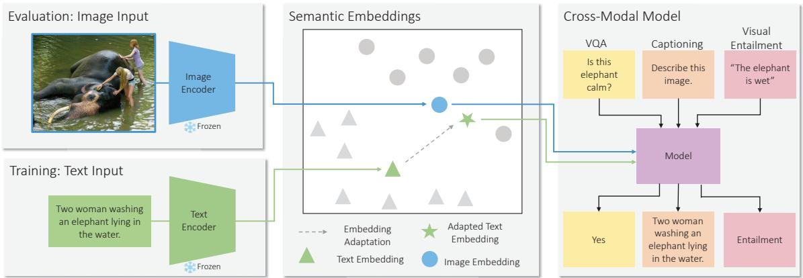
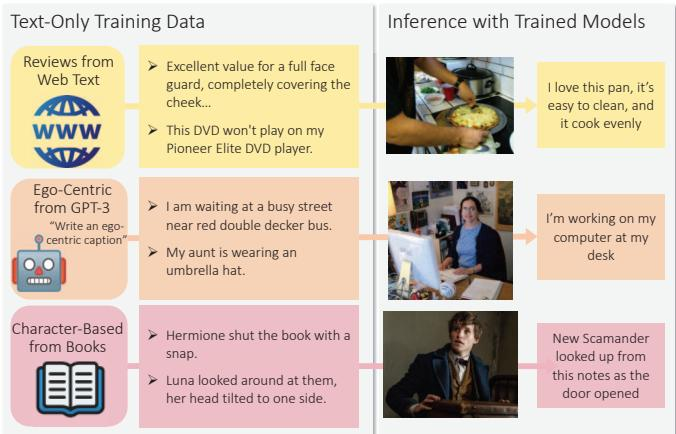
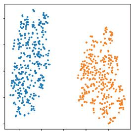
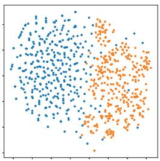
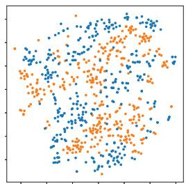
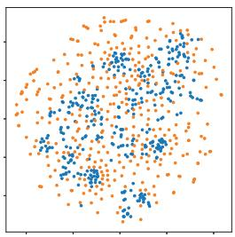
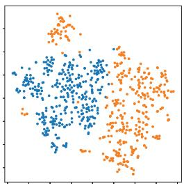
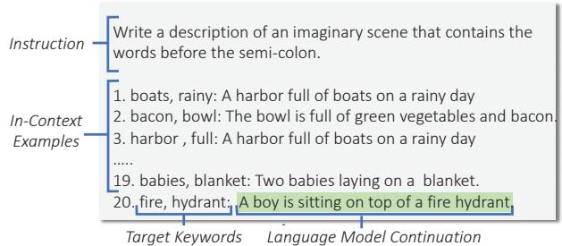
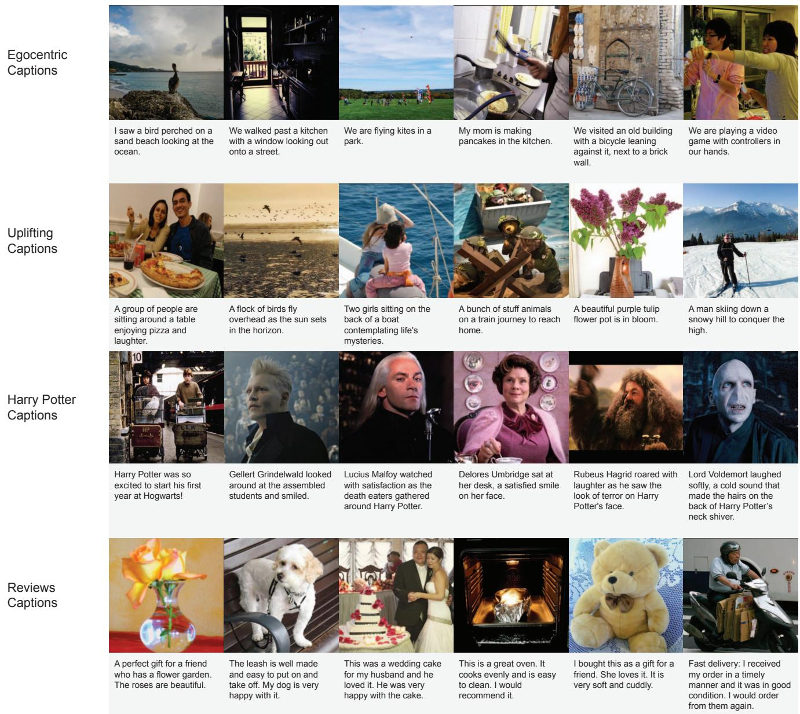

# I can't believe there's no images! Learning Visual Tasks Using Only Language Supervision

Sophia Gu\*Christopher Clark\*Aniruddha Kembhavi Allen Institute for Artificial Intelligence {sophiag, chrisc, anik}@allenai.org

## Abstract

Many high-level skills that are required for computer vision tasks, such as parsing questions, comparing and contrasting semantics, and writing descriptions, are also required in other domains such as natural language processing. In this paper, we ask whether it is possible to learn those skills from text data and then transfer them to vision tasks without ever training on visual training data. Key to our approach is exploiting the joint embedding space of contrastively trained vision and language encoders. In practice, there can be systematic differences between embedding spaces for different modalities in contrastive models, and we analyze how these differences affect our approach and study strategies to mitigate this concern. We produce models using only text training data on four representative tasks: image captioning, visual entailment, visual question answering and visual news captioning, and evaluate them on standard benchmarks using images. We find these models perform close to models trained on images while surpassing prior work for captioning and visual entailment in this text-only setting by over 9 points, and outperforming all prior work on visual news by over 30 points. We also showcase a variety of stylistic image captioning models that are trained using no image data and no humancurated language data, but instead using readily-available text data from books, the web, or language models.

## 1. Introduction

Although vision and natural language processing (NLP) tasks are typically thought of as being very distinct, there is often a high degree of overlap in the skills needed to complete them. Visual question answering and reading comprehension question answering both require parsing and understanding questions, visual entailment and textual entailment require comparing different semantic meanings, and captioning and summarization require writing text that summarizes the semantics of the input. This raises an intriguing possibility: if a model learned to complete one of these tasks using a high-level semantic representation of the input text, then in theory it could immediately be able to complete the corresponding visual task as long as the input image is encoded in the same semantic representation. We call this challenge zero-shot cross-modal transfer because it requires applying skills learned from one modality to a different one. Achieving this would be a step towards building multimodal models that can generalize skills across modalities without needing expensive training data for each modality, and has potential applications for tasks where visual training data is scarce but text data is relatively easy to collect.

Accomplishing this requires encoding images and text into a shared semantic space. We use vision and language (V&L) models trained with a contrastive loss for this purpose [51, 25]. These models learn to embed text and images into vectors such that the vectors for matching images and captions are close together, and vectors for unrelated images and captions are far apart. Although this loss was originally intended for representation learning and zero-shot classification, here we show it also facilitates cross-modal transfer.

To do this, we propose a method called Cross modaL transfer On Semantic Embeddings (CLOSE). An outline of CLOSE is shown in Figure 1. During training, the text inputs are encoded into a vector using the (frozen) text encoder from a contrastive model, which is then used as an input to a model. During testing, the visual input is embedded with a (frozen) image encoder and used in place of the text embedding. Because these encoders were explicitly trained to produce embeddings that encode semantics in similar ways, learning to read and process the text vector should naturally translate to the ability to read and process the image vector. Although we focus on text-to-image transfer in this paper, our approach is applicable to other contrastive models such as videos [74], point clouds [1], and audio [22, 11, 72], potentially allowing transfer between many other modalities.

One potential difficulty with this approach is that, while contrastive embeddings do share some structure between modalities, there can still be significant differences between the image and text vectors in practice [39]. To mitigate this, we propose to additionally use adapters that modify the text vectors being used during training. We find adding Gaussian noise to be very effective in boosting performance, but consider other approaches as well in our analyses.

  
Figure 1: Overview of CLOSE. During training, input text is encoded into a vector with a text encoder and adapted with an adaptation method. A model learns to use the vector to perform a task such as VQA, captioning, or visual entailment. During testing, an input image is encoded with an image encoder instead to allow cross-modal transfer.

Text-to-image transfer is a relatively unexplored setting, so we first conduct extensive experiments to establish that CLOSE can handle the text-to-image domain shift without a major performance drop. We compare models trained with CLOSE on text alone to models trained with images and text on three standard V&L tasks: captioning, visual questioning answers (VQA) and visual entailment, and the more complex task of visual news captioning [40]. We find the text-only models generally perform reasonably close to versions trained with images, showing that CLOSE can effectively transfer many skills across modalities. We surpass the previous best text-only method in captioning [78] by 17 CIDEr (78.2 vs. 95.4) and visual entailment [57] by 9 points (66.6 vs. 75.9), making our method state-of-the-art for these settings by a large margin. There are no prior results for VQA and visual news in this setting, however we do surpass the previously best reported result in visual news even with images [40] (50.5 vs 80.8 CIDEr).

These experiments show that efficient text-to-image transfer is possible. This has important practical implications because text training data can be directly constructed by annotators, mined from many existing text datasets, or even generated by a large language model such as GPT-3 [4], and can therefore be significantly less expensive than constructing visual training data. We demonstrate this potential by training effective CLOSE captioning models from text generated by large language models [4], meaning the only human annotation required was for prompt construction. We also train several stylistic captioning models without any labeled images (see Figure 2). We collect text with various styles from a diverse set of sources, including internet reviews, books, and GPT-3 generations, and demonstrate that CLOSE models trained on this text can produce accurate and stylistically correct captions for images.

  
Figure 2: Using CLOSE to learn stylistic captioning without image data. Text examples of the desired style are gathered from sources such as the web, books, or GPT-3. Models are trained on text only and then applied to images.

Finally, we complete two analyses: A sensitivity analysis showing that CLOSE is robust to cases where text and image vectors differ by a constant offset, which therefore allows CLOSE to work despite seemingly large differences between the image/text embeddings. Additionally, a study on the effectiveness of using an auxiliary vision and language corpus to build an improved adapter. We find that improvements are possible but vary depending on the source of that data and that a particularly effective approach is to use the auxiliary data to compute a structured covariance matrix for use when adding Gaussian noise.

In summary, our contributions include: (i) introducing the CLOSE model for zero-shot cross-modal transfer; (ii) showing that training CLOSE with text data alone, on four V&L tasks, gives results close to models trained on both images and text; (iii) SoTA results when using only text for three of the tasks; (iv) demonstrating an application of CLOSE for stylistic captioning; (v) analyzing how differences between image/text vectors in contrastive models and how different adapters affect CLOSE's performance. To facilitate future work in the community, we release our code¹.

## 2. Method

Model. Our approach uses the image/text encoder from a contrastive model to encode the input, and then follows many prior works (e.g., [27, 7]) by fine-tuning a pre-trained language model to process the input vector, along with any additional input text, to generate output text. First, the input image or text vector is normalized to have unit length to match what is used in the contrastive loss. Then that vector is converted into a number of vectors, we use 4 in our experiments, of the same dimensionality as the language model's embedding layer using a linear layer. Next, other input text (e.g., the hypothesis in visual entailment or the question in VQA) is tokenized and embedded with the language model's embedding layer. Those embeddings are concatenated with the embeddings built from the input vector to construct an input sequence for the language model.

For the sake of simplicity, we train the model generatively for all tasks [20, 8]. The model generates a caption, a free-form question answer, or a class name for the tasks of captioning, VQA, and visual entailment respectively. During training, the language model and linear layer are finetuned, but the text encoder is kept frozen to ensure the correspondence between text and image vectors learned during pre-training is preserved.

Modality Gap. In practice, text and image vectors from contrastive models can be far apart, a phenomenon known as the modality gap [39]. For example, on Coco captions [6] the average cosine similarity between an image and paired caption is only 0.26, while the average similarity between two unrelated captions is 0.35. Figure 3a shows this gap causes image and text vectors to fall into separate clusters in the vector space. The root cause is that the crossentropy loss used by contrastive models only requires paired image and text vectors to be close relative to random image and text pairs, which does not necessarily mean they are close in absolute terms, see Liang et al. [39] for more discussion.

We thus adopt a simple and effective solution – adding Gaussian noise that is drawn from a standard normal distribution and then scaled by a hyper-parameter w, to the text vectors during training. Intuitively, this noise helps to close the modality gap by spreading out the text vectors and overlapping them with the image vectors. Figure 3b visually shows that even a small amount of noise leads to much better overlapping of the image and text vector spaces. The noise also encourages the model to be more robust to minor changes or variations to the input vectors, and thus be better prepared for the shift caused by switching from text to image vectors.

A second motivation for using random noise is the observation that image vectors capture certain subtle visual details like lighting, background, or camera position that are not reflected in the text vectors. To illustrate this, we show a small case study in Appendix 5 where we observe that semantic changes (e.g., changing the subject of a caption or image from "dog" to “cat") result in a relatively consistent directional shift for text vectors, but has a more erratic effect on image vectors. Adding noise to the text embedding helps to mitigate this problem by simulating the fact that, even for semantically similar inputs, image and text vectors can still have minor differences due to the additional information encoded in the images.

After adding the noise we re-normalize the vector to unit length to match the image vectors that will be used during evaluation. We study the modality gap and other approaches to handling it in more detail in Section 4.

## 3. Experiments

We report results on four V&L tasks: captioning, visual entailment, VQA and visual news, and when training CLOSE using only text generated by a language model.

## 3.1. Setup

We construct pure-text training datasets for these tasks using the text annotations from the relevant training datasets, and, for some tasks, text captions of the training images. Our primary point of comparison is a CLOSE model trained with the training images, in which case the images are encoded with the image encoder during training in the same manner as done during testing. This model does not experience domain shift, so we view it as an upper bound. We emphasize that in practice the text training data could come from many other possible sources, see Sect. 5 and Sect. 3.3 for additional experiments that demonstrate this, we use these text sources since they closely match the data the models with images are trained on and therefore allow us to better isolate and study what performance is lost due to the image-text domain shift

We use $\mathrm { T } 5 _ { b a s e }$ [52] and $\mathrm { C L I P } _ { V i T - L / 1 4 }$ [51], a noise level of 0.08, and a fixed set of hyper-parameters for all tasks to demonstrate our method is effective even when there is no image/text validation set to tune on. See Appendix 1 for hyper-parameter details. We additionally show results when the noise level is tuned on validation sets, and when the noise is removed, to study the effect of noise on CLOSE.

  
(a) No Adapter

  
(b) Gaussian Noise

  
(c) Mean Shift

  
(d) Mean Shift + Noise

  
(e) CC3M Mean Shift

Figure 3: t-SNE [64] plots for various adapters on 350 randomly selected image vectors (blue) and paired caption vectors (orange) from CoCO captions. The first two panels demonstrate CLOSE, and the remaining three show additional adapters we study in our analysis (Section 4).
<table><tr><td>Model</td><td>Text-Only</td><td>Cap. (Single)</td><td>Cap. (Mult.)</td><td>VE</td><td>VQA</td><td>E-VQA</td><td>VN</td></tr><tr><td>Prior Work</td><td>V</td><td>-</td><td>ESPER Style [78] 78.2</td><td>CLIP Cls. [57] 66.6</td><td>TAP-C [57] 38.7</td><td>-</td><td>-</td></tr><tr><td>CLOSE w/o Noise</td><td>V</td><td>16.4</td><td>68.7</td><td>68.2</td><td>60.2</td><td>59.8</td><td>32.1</td></tr><tr><td>CLOSE (Ours)</td><td>V</td><td>80.5</td><td>95.3</td><td>75.9</td><td>59.6</td><td>62.9</td><td>80.8</td></tr><tr><td>CLOSE w/Tuned Noise</td><td></td><td>95.4</td><td>98.4</td><td>75.9</td><td>61.9</td><td>64.3</td><td>80.8</td></tr><tr><td>CLOSE w/Images</td><td></td><td>113.2</td><td>113.2</td><td>77.7</td><td>65.4</td><td>67.9</td><td>105.7</td></tr></table>

Table 1: Results on V&L tasks. Models in the last two rows require images and so are upper bounds for CLOSE. We report CIDEr [65] for captioning with single and multiple captions, visual entailment test accuracy, VQA 2.0 test-dev accuracy, E-VQA validation accuracy, visual news test CIDEr. See Appendix 2 for other metrics and more detailed results.

## 3.2. Results

Results are shown in Table 1. Due to space constraints, we only report one metric for each task here and include more results in Appendix 2. We also show the best method from prior work, when present, that does not use images.

Image Captioning. For captioning, we use text captions as both the input text and the target output text. However we find that, if multiple captions about one scene are available, it is beneficial to use different captions about the same image as the input and target text. We call the first setting captioning (single) and the second captioning (multiple) and evaluate both since they facilitate different training setups. We evaluate on CoCo Captioning [6] using the Karpathy split [28]. We train our text-only models using just the captions in the training data. We treat all captions per image as a group for the multiple-caption setting and use each caption individually in the single-caption setting.

CLOSE reaches 95.3 CIDEr in the multiple caption setting, showing high captioning competency despite not using images. In the single caption setting, performance is reduced but can be increased to 95.4 with higher noise levels. Our approach is substantially better than recent zero-shot methods such as MAGIC (49.3) [61] and Socratic Models (44.5) [80], and is 17 points ahead of ESPER Style (78.2) [78] which also uses text captions.

Visual Entailment. Visual entailment requires determining whether a premise image either entails, contradicts, or is neutral with respect to a hypothesis sentence. During training, a text premise is used instead of an image. The hypothesis sentence is always text and is encoded with the language model. We train on SNLI [45] (a language-only dataset) and evaluate on SNLI-VE [73] (a vision and language dataset). Despite not using images, CLOSE achieves similar performance to the image model. Song et al. [57] also experiment with this task, but we find adding Gaussian noise allows us to surpass their result by over 9 points.

VQA. To train a VQA model we use data that contains a sentence describing a scene (encoded with the text encoder), a question (encoded with the language model), and a target answer. We consider two datasets. First, we pair Coco captions with questions about the same image from VQA 2.0 [17]. However, in this dataset, the questions might ask about details of the image not included in the caption, and thus cannot be answered by the text-only model. Hence we also train and evaluate on VQA-E [34] which contains a subset of the VQA 2.0 questions paired with CoCO captions that have been verified to contain the answer.

<table><tr><td>Model</td><td>B-4</td><td>M</td><td>C</td><td>S</td></tr><tr><td>MAGIC [58]</td><td>12.9</td><td>17.4</td><td>49.3</td><td>11.3</td></tr><tr><td>CLOSE w/CoCo</td><td>29.5</td><td>25.6</td><td>98.4</td><td>18.3</td></tr><tr><td>CLOSE w/GPT-J RNG</td><td>19.6</td><td>20.9</td><td>63.2</td><td>13.8</td></tr><tr><td>CLOSE w/GPT-J Unigram</td><td>23.2</td><td>22.2</td><td>78.9</td><td>15.6</td></tr><tr><td>CLOSE w/OpenAI Curie</td><td>18.5</td><td>21.2</td><td>69.0</td><td>14.9</td></tr></table>

Table 2: BLEU-4, METEOR, CIDEr, and SPICE on the CoCo validation set when training on synthetic captions.

These training sets have significantly different question distributions due to the filtering done in VQA-E, so we evaluate models either on the VQA 2.0 test-dev set or the VQA-E validation set2 depending on what train set was used. There is no prior work for this task in the text-only setting, however CLOSE does outperform TAP-CviT–B/16 [57], a CLIP-based zero-shot approach.

For VQA-E, we observe only a 3.5 point drop in accuracy relative to image training while surpassing the baselines. The gap is more significant on VQA 2.0, which we attribute to the sometimes poor alignment between the captions and questions, although our method is still within 5 points of the model trained on images.

Visual News. Visual news requires captioning an image in the context of a news article, and which therefore often requires mentioning the people, locations, and events from the article text [40]. CLOSE is easily extended to this setting by using the caption as both the image text and the target output, while the article is given as additional context to the language model. For this task, we randomly sample 15% of the training data each epoch due to the large dataset size, and use OpenCLIP instead of CLIP since our previous experiments found it slightly improves performance. CLOSE with images achieves over 105 CIDEr, a significant improvement over the previous best benchmark of 50.5 CIDEr [40]. Training without images also outperforms the previous state-of-the-art, obtaining a respectable 80.8 CIDEr. See Appendix 5 for qualitative examples.

Discussion. Overall, performance is comparable to the model trained with images showing CLOSE is able to transfer skills between modalities. Tuning the noise level can benefit some tasks, therefore better heuristics for choosing the noise level or leveraging a small image/text validation set could additionally improve performance. On the other hand, removing the noise reduces performance drastically across almost all tasks. This is because the noise plays an important role in addressing the modality gap.

## 3.3. Training with Data from a Language Model

Next, we use CLOSE to train a captioning model on synthetic data generated by a language model. We first construct a prompt that includes a natural language instruction and some example captions following an in-context learning approach [4], shown in Figure 4. To generate a diverse set of captions, we prefix each caption with two keywords that occur in that caption, and end the prompt with two new keywords to be used in the caption to be generated (“fire" and “hydrant" in Figure 4). Then diverse captions can be constructed by changing the ending keyword pair. To reduce the chance of caption style affecting the quantitative evaluation, we take steps to better match the style of the CoCo captions, although in settings where the precise style is of less importance this would not be required. We generate 100k examples from three generation methods:

  
Figure 4: Prompt used to generate a synthetic caption from a language model. The language model's continuation (highlighted text) is used as a synthetic caption.

GPT-J RNG. Examples are generated using a 6 billion parameter open source language model, GPT-J[67], with 50 in-context examples. Keywords are sampled uniformly at random from keywords in the CoCO training data.

GPT-J Unigram. Keywords are instead sampled to match the unigram distribution of CoCO captions.

Curie Unigram. Generations are from OpenAI Curie³ with 20 examples and unigram-matching.

Results on CoCO are shown in Table 2. Our best result achieves 78.9 CIDEr. Inspection shows that, even with our keyword sampling approach, many errors are still caused by style issues, and that style also explains the reduced performance of the Curie model. For example, the synthetic captions from the Curie model are 23 times more likely than the CoCO and the GPT-J captions to use the word “opens" (e.g., "a living room that opens onto the balcony"), and use “cellphone" while “cell phone" is much more common in CoCo. More details are in Appendix 3. This illustrates how, when using this method, the choice of language model can have subtle effects on the style of captioning that will be learned. Despite this issue, this is still a very strong result that surpasses the zero-shot method MAGIC [58].

<table><tr><td>Bias</td><td>Mag.</td><td>MG</td><td>∆</td><td>Cap.</td><td>VE VQA</td></tr><tr><td>none</td><td>0.0</td><td>0.26</td><td>1.00</td><td>94.4 64.3</td><td>75.9</td></tr><tr><td>mean</td><td>0.8</td><td>0.62</td><td>0.69</td><td>92.8 64.7</td><td>75.4</td></tr><tr><td>-mean RNG</td><td>0.8</td><td>-0.10</td><td>0.85</td><td>84.3</td><td>62.0 71.8</td></tr><tr><td>RNG</td><td>0.2</td><td>0.25</td><td>0.98</td><td>93.5</td><td>63.9 75.3</td></tr><tr><td></td><td>0.5</td><td>0.24</td><td>0.89</td><td>92.5</td><td>64.2 75.3</td></tr><tr><td>RNG</td><td>0.8</td><td>0.20</td><td>0.78</td><td>89.3</td><td>63.7 74.8</td></tr><tr><td>RNG</td><td>1.0</td><td>0.18</td><td>0.71</td><td>87.2</td><td>63.8 74.2</td></tr><tr><td>RNG</td><td>2.0</td><td>0.11</td><td>0.45</td><td>73.7</td><td>61.4 71.3</td></tr></table>

Table 3: Text vector translation-sensitivity analysis. The first three columns show the translation magnitude, the resulting modality gap on CoCO, and the cosine similarity to the original vectors. The following columns show CIDEr captioning score, accuracy on VQA-E, and accuracy on visual entailment on validation sets.

## 4. Analysis

Our approach opens up two intriguing questions: (1) Why does embedding substitution work even when text and image vectors are generally quite far apart? (2) Can methods that leverage additional data to better close the modality gap improve upon this approach? We do two analyses to answer these questions. Furthermore, we study how different choices for the contrastive embedding model or for the language model affect our method's performance.

## 4.1. Sensitivity Analysis

To help answer the first question, we perform a sensitivity analysis on the input text vectors. To do this, the model is trained while adding a constant vector to the normalized text vectors and then re-normalizing, and tested on the unaltered image vectors as before. This alteration will change how the text vectors are distributed relative to the image vectors, but will not change how the text vectors are distributed relative to one another. We show results when using a random vector (note the same vector is used for all of training, it will just be selected randomly at the start of training) of different magnitudes, the mean difference of text and image vectors to represent a shift towards the image vectors, and the negation of that vector to shift away from the image vectors. In all cases, we continue to add Gaussian noise as before.

Results are shown in Table 3. For random vectors (RNG), we report the average of three runs with 3 different vectors. Overall, we see only minor degradation when using random vectors until very large shifts are used, showing the model is generally insensitive to shifting the text vectors during training. Shifting the vectors towards the images (mean) can result in a slight gain in performance, and shifting the vectors away from them (-mean) results in a more significant decrease, showing the model is not completely insensitive. However it is still notable that vector substitutions work well even as the text vector's positions

<table><tr><td>Method</td><td>MG</td><td>Cap.</td><td>VE</td><td>VQA</td><td>VN</td></tr><tr><td>CLOSE</td><td>0.26</td><td>94.3</td><td>75.9</td><td>64.3</td><td>80.8</td></tr><tr><td>+Cov. (Coco)</td><td>0.62</td><td>106.5</td><td>75.5</td><td>65.5</td><td>84.1</td></tr><tr><td>+Cov. (CC3M)</td><td>0.58</td><td>95.1</td><td>75.8</td><td>65.0</td><td></td></tr><tr><td>+Linear (Coco)</td><td>0.81</td><td>99.5</td><td>76.0</td><td>65.7</td><td></td></tr><tr><td>+Linear (CC3M)</td><td>0.75</td><td>81.8</td><td>75.5</td><td>64.9</td><td></td></tr></table>

Table 4: Results with adapters built with paired data. The modality gap on CoCO captions, captioning CIDEr, visual entailment accuracy, VQA-E accuracy and visual news CIDEr are shown. The last task is more complex and so we only experiment it with one promising adapter.

are significantly randomized.

We hypothesize that this insensitivity is due to two reasons. First, most directions in the shifted feature space are predictive of the output in the same manner as before because the text vectors do not change relative positions. Second, the Gaussian noise trains the model to be insensitive to shifts in unimportant directions in the feature space, which often include the direction of the shift. This insensitivity provides part of the answer to question 1. A major source of the modality gap is a constant shift between the image and text vectors [38]. However, addressing this is not as important as one might expect because CLOSE is not highly sensitive to the absolute positioning of the text vectors.

## 4.2. Learned Adapter Analysis

As suggested by Figure 3c, mean shift might not be perfect at aligning the text and image vectors, so we hypothesize more sophisticated adaption methods could improve performance. More complex adapters generally require a paired image/text corpus to train on, so we avoid using them in our main CLOSE method. However, here we investigate them to better understand how much performance they could potentially contribute. To study the difference between using high-quality annotated data or web data we use both CoCO captions and Conceptual Captions 3 Million (CC3M) [54]. For CoCO we use the 30k captions from the "restval" set of the Karapathy split, which do not appear in our train, eval or test sets, and for CC3M we use a random sample of 100k image/text pairs. We consider two adapters: Linear Adapter. We learn the modality shift by training a linear model to minimize the Euclidean distance between the adapted text vector and its paired image vector. We continue to add Gaussian noise after applying this model.

Structured Noise with Covariance Matrix. Even in principle, we do not expect there to be a perfect one-to-one mapping between text and image vectors because an image vector can be similar to many different texts that describe different parts or details of the image. This motivates us to approach the problem from the perspective of better understanding how text vectors are distributed around its related image vectors, instead of just trying to learn a simple mapping function. In Appendix 4, we provide insight into how the vector differences from Coco image-caption pairs follow a particular shape. To capture this shaped relationship between text and images, we add Gaussian noise whose mean and covariance are learned from the differences between text-image vectors in the auxiliary corpus, to the text during training. This noise is expected to better simulate the text-image shift that will occur during evaluation.

  
Figure 5: Examples of stylistic captions produced by CLOSE trained with only text data, and then applied 0-shot to images.

Results are shown in Table 4. We observe large improvements on captioning, modest improvements on VQA and visual news4, and similar performance on visual entailment using the adapters from CoCO, with the structured noise approach being significantly better on captioning, and slightly worse on the other tasks. The CC3M adapter also achieves mild gains, although it is less effective. This shows the training data used for the adapter is important, a point that can be qualitatively observed in Figure 3c and Figure 3e.

## 4.3. Performance Analysis of Different CLIP and T5 Models

Finally, we study how different choices for the contrastive embedding model or for the language model affect the performance of our method. Results for captioning, visual entailment, and E-VQA are shown in Table 5. For these experiments we use the tuned noise values in order to compare best-case performance. We find the optimal noise level for these models generally does not change as these components are altered, so we use the same noise levels as our main results for all these experiments.

<table><tr><td>CLIP Model</td><td>T5 Model</td><td>Cap.</td><td>VE</td><td>VQA</td></tr><tr><td>ViT-L/14</td><td>small</td><td>94.4</td><td>74.9</td><td>59.9</td></tr><tr><td>ViT-L/14</td><td>base</td><td>95.4</td><td>76.1</td><td>64.3</td></tr><tr><td>ViT-L/14</td><td>large</td><td>93.9</td><td>75.1</td><td>65.2</td></tr><tr><td>ViT-B/32</td><td>base</td><td>91.1</td><td>75.3</td><td>61.4</td></tr><tr><td>RN101</td><td>base</td><td>90.0</td><td>75.4</td><td>59.8</td></tr><tr><td>RN50</td><td>base</td><td>90.2</td><td>75.3</td><td>60.4</td></tr><tr><td> $\mathrm { R N } 5 0 \times 4$ </td><td>base</td><td>92.0</td><td>75.3</td><td>61.5</td></tr><tr><td>RN50×16</td><td>base</td><td>93.4</td><td>74.4</td><td>62.5</td></tr><tr><td>RN50×64</td><td>base</td><td>96.1</td><td>75.8</td><td>64.2</td></tr><tr><td>OpenCLIP [24]</td><td>base</td><td>99.2</td><td>76.3</td><td>65.1</td></tr><tr><td>EVA-CLIP [13]</td><td>base</td><td>101.7</td><td>75.53</td><td>66.6</td></tr></table>

Table 5: Ablations with different contrastive and language models. The first column indicates which CLIP model was used, with OpenCLIP indicating we use the ViT-L/14 Open-CLIP model trained on Laion 400m [24]. The last three columns show CIDEr on CoCO captioning in the single caption setting, accuracy on visual entailment, and overall accuracy on VQA-E on the validation sets.

There is a consistent decrease in performance when using CLIP versions other than ViT-L/14, with only RN50×64 being comparable, showing that CLOSE gains effectiveness as the contrastive model becomes more powerful. We also observe much less dependence on the size of the T5 model, with the large model increasing performance on VQA but not on the other tasks. The OpenCLIP model is generally more effective and boosts the captioning results to nearly 100 CIDEr. The EVA-CLIP model [13] further boosts VQA scores, approaching our main result with images (67.9), showing that CLOSE's performance can be improved by enhancing the contrastive model.

## 5. Stylistic Captioning

We demonstrate an application of our method by applying it to the task of constructing captions with specific writing styles. Our general approach is to gather text-only training data that exemplifies the style we want the model to use, train on them as if they were text captions as done in Section 3.2, and then apply the model to images. To show that a diverse range of natural language data sources can be used to learn different styles we show four captioning styles, each of which uses a different method of collecting training data. Ego-Centric. Section 3.3 shows that our model can be trained using data generated by a language model. Now we demonstrate an application of that approach by using the language model to generate captions in an ego-centric style. We use the same prompt format as before (Figure 4), only now with 20 examples of manually authored captions written from a first-person perspective. We again sample keywords randomly from those found in CoCo training captions to generate diverse prompts and obtain 20k captions using OpenAI's GPT-3 model. We apply this model to CoCo validation images, shown in the top row of Figure 5, and observe it learns to use a variety of first-person language while accurately describing the image.

Uplifting. We use a publicly available dataset [14] to collect 6k examples of uplifting captions (no images). Results are shown in the second row in Figure 5, where we observe the model adds warm and optimistic details to its captions. Character-Based. Next, we target character-based captions that use proper nouns and describe images as if they were from a story. Using proper nouns would be a significant hurdle for many existing systems due to the lack of image/name paired data in existing datasets. However, CLOSE can leverage CLIP's ability of recognizing names of famous people [51] to handle that problem. We first pick 33 Harry Potter characters. Then only a few excerpts from the Harry Potter books or fan fictions are manually collected and used, together with the characters, as prompts to GPT-3 to create 13k captions. Results on relevant photos are shown in the third row of Figure 5. The model uses the correct names and image content, while sometimes making up plausible events that could give additional context to the image as if it was a scene in a book or a movie.

Reviews. We train a model to write captions like a customer writing a review. For training data, we gather publiclyavailable Amazon product reviews⁵ and select positive reviews that are a maximum of 40 tokens long. As shown in Figure 5 bottom row, the captions use a variety of language to write positive reviews of the items in the photos.

## 6. Related Work

Using Contrastive Models. Many vision and language contrastive models have been constructed, including CLIP [51], ALIGN [25], UniCL [75] and OpenCLIP [24], and recent multi-modal models that contain a contrastive training component [77, 79, 32]. Typically these models are used either zero-shot, which is effective for image classification but challenging for more complex tasks like captioning or visual entailment [57, 61, 80], or as feature extractors for down-stream tasks [55, 29, 18, 12, 44, 50, 81, 71]. Our work offers a compromise between those two approaches by allowing models to be trained with only textual data, which substantially improves upon zero-shot performance without requiring annotated images.

Zero-Shot Vision Using Language Models. Several recent works have combined large language models with pretrained vision models to perform vision tasks zero-shot. Methods include using reinforcement learning to learn how to generate text that matches a CLIP Embedding [78], using CLIP to guide inference in the LLM [61], or using a pretrained model to generate text describing an image to pass into the language model [80]. Compared to these methods our approach of leveraging text training has several advantages. Fine-tuning on text-only data enables our model to learn task-specific details and subtleties that are challenging for fully zero-shot methods, such as the style of captions to be generated. Our approach also works effectively with smaller language models (CLOSE only uses 220M trainable parameters) which significantly reduces the computational demand.

Cross-Modal Transfer Learning. Transfer learning has typically focused on transferring skills from one modality to the same modality. CROMA is an exception and uses a modality-invariant feature space to achieve transfer similar to our work, however, it is limited to classification tasks and is few-shot rather than zero-shot [38]. Pre-trained language models have been shown to learn skills that can transfer to new modalities [42], however, this will be ineffective for task-specific skills such as a desired captioning style or learning the space of output labels. Several multimodal/multi-task models have learned many tasks in different modalities simultaneously [41, 69, 37, 26] and could thus potentially transfer skills between them, with High-MMT in particular showing positive results [37]. Our work studies the more challenging zero-shot setting (meaning no training data in the target modality is available), and therefore requires all the needed skills to be learned from a modality different than the one used in evaluation.

Recently, Song et al. [57] use a similar vectorsubstitution trick with CLIP to train visual entailment models, however they do no use noise or other methods that address the modality gap. Yu et al. [78] use reinforcement learning to train a model to generate text that CLIP ranks as being close to input images, and text data to learn captioning styles, although they do not directly train on text versions of the vision tasks. Concurrently with our work, Nukrai et al. [48] and Wei et al. [35] propose text-only approaches leveraging CLIP with either Gaussian noise similar to CLOSE, or using a projection of the text embeddings. Our work does additional analysis, covers more tasks including experiments using data generated by a language model, and achieves better captioning results.

Domain Invariant Representations. Using domaininvariant features to achieve out-of-domain generalization has a long history in transfer learning. Work in this area has shown such features can be built from multi-domain training data [68, 19], small amounts of labelled data in the target domain [9, 63], and unsupervised data [70, 59]. Methods include using adversarial learning to remove domaindependent features [16, 36, 62], using maximum mean discrepancy to ensure features are distributed similarly across multiple domains [31, 3] and various data augmentation approaches to prevent models from learning domaindependent features [84, 83, 66, 53]. The effectiveness of Gaussian noise in making models robust to domain shifts in these features has also been observed in image classification [33]. While we also use domain-invariant features, the domain shift we study is more extreme than what is typically studied due to the change in modalities, and we show large-scale contrastive models can be an effective source of invariant features if used correctly.

Stylistic Captioning. Stylistic captioning models can be built by authoring captions of the desired style [46, 14, 21, 56] and applying standard captioning methods. However, since creating such annotations is expensive, many stylistic captioning methods additionally transfer from captions with other styles by pre-training or multi-tasking [46, 47, 76]. Other methods have combined unstylized captioning data with text data in the desired style through methods such as adversarial learning [5], multi-tasking with language modelling [14], or factoring caption writing into style and context components so that the style component can be learned from the text [14, 82]. Most similar to our work, Tan et al. [60] train a model to generate text from either images or text using a shared encoding space and learned style embeddings. Unlike these methods, our approach does not require the use of any paired image/caption data.

## 7. Conclusion

We have shown that the multi-modal semantic vector space learned by contrastive models can be used for crossmodal generalization through CLOSE, and studied its sensitivity and what improvements can be made with trained adapters. We have also conducted experiments on multiple vision and language tasks and demonstrated a specific application to stylistic captioning. Beyond stylistic captioning, CLOSE is applicable to many other cases where training data is abundant in one modality but scarce in another. Possible use cases include: training a captioning model for 3D scenes using image captioning data; training a model to summarize a video using text summarization data; and training a model to perform tasks like VQA or captioning for less-studied modalities like tables, graphs, or sensors without having to annotate additional data for these modalities. As more powerful contrastive models that span more modalities are trained, we expect CLOSE to yield better results and gain more use cases.

## References

[1] Mohamed Afham, Isuru Dissanayake, Dinithi Dissanayake, Amaya Dharmasiri, Kanchana Thilakarathna, and Ranga Rodrigo. Crosspoint: Self-supervised cross-modal contrastive learning for 3d point cloud understanding. In CVPR, 2022.

[2] Peter Anderson, Basura Fernando, Mark Johnson, and Stephen Gould. Spice: Semantic propositional image caption evaluation. In ECCV, 2016.

[3] Karsten M Borgwardt, Arthur Gretton, Malte J Rasch, Hans-Peter Kriegel, Bernhard Schölkopf, and Alex J Smola. Integrating structured biological data by kernel maximum mean discrepancy. Bioinformatics, 2006.

[4] Tom B. Brown, Benjamin Mann, Nick Ryder, Melanie Subbiah, Jared Kaplan, Prafulla Dhariwal, Arvind Neelakantan, Pranav Shyam, Girish Sastry, Amanda Askell, Sandhini Agarwal, Ariel Herbert-Voss, Gretchen Krueger, T. J. Henighan, Rewon Child, Aditya Ramesh, Daniel M. Ziegler Jeff Wu, Clemens Winter, Christopher Hesse, Mark Chen, Eric Sigler, Mateusz Litwin, Scott Gray, Benjamin Chess, Jack Clark, Christopher Berner, Sam McCandlish, Alec Radford, Ilya Sutskever, and Dario Amodei. Language models are few-shot learners. NeurIPS, 2020.

[5] Tseng-Hung Chen, Yuan-Hong Liao, Ching-Yao Chuang, Wan Ting Hsu, Jianlong Fu, and Min Sun. Show, adapt and tell: Adversarial training of cross-domain image captioner. ICCV, 2017.

[6] Xinlei Chen, Hao Fang, Tsung-Yi Lin, Ramakrishna Vedantam, Saurabh Gupta, Piotr Dollár, and C. Lawrence Zitnick. Microsoft coco captions: Data collection and evaluation server. ArXiv, abs/1504.00325, 2015.

[7] Yen-Chun Chen, Linjie Li, Licheng Yu, Ahmed El Kholy, Faisal Ahmed, Zhe Gan, Yu Cheng, and Jingjing Liu. Uniter: Learning universal image-text representations. In ECCV, 2020.

[8] Jaemin Cho, Jie Lei, Hao Tan, and Mohit Bansal. Unifying vision-and-language tasks via text generation. In ICML, 2021.

[9] Hal Daumé III. Frustratingly easy domain adaptation. In ACL, 2007.

[10] Michael Denkowski and Alon Lavie. Meteor universal: Language specific translation evaluation for any target language. In Proceedings of the ninth workshop on statistical machine translation, 2014

[11] Benjamin Elizalde, Soham Deshmukh, Mahmoud A1 Ismail, and Huaming Wang. Clap: Learning audio concepts from natural language supervision. arXiv preprint arXiv:2206.04769, 2022.

[12] Han Fang, Pengfei Xiong, Luhui Xu, and Yu Chen. Clip2video: Mastering video-text retrieval via image clip. arXiv preprint arXiv:2106.11097, 2021.

[13] Yuxin Fang, Wen Wang, Binhui Xie, Quan Sun, Ledell Wu, Xinggang Wang, Tiejun Huang, Xinlong Wang, and Yue Cao. Eva: Exploring the limits of masked visual representation learning at scale. In CVPR, 2023.

[14] Chuang Gan, Zhe Gan, Xiaodong He, Jianfeng Gao, and Li Deng. Stylenet: Generating attractive visual captions with styles. CVPR, 2017.

[15] Kavita Ganesan. Rouge 2.0: Updated and improved measures for evaluation of summarization tasks. arXiv preprint arXiv:1803.01937, 2018.

[16] Yaroslav Ganin, Evgeniya Ustinova, Hana Ajakan, Pascal Germain, Hugo Larochelle, François Laviolette, Mario Marchand, and Victor Lempitsky. Domain-adversarial training of neural networks. JMLR, 2016.

[17] Yash Goyal, Tejas Khot, Douglas Summers-Stay, Dhruv Batra, and Devi Parikh. Making the V in VQA matter: Elevating the role of image understanding in Visual Question Answering. In CVPR, 2017.

[18] Xiuye Gu, Tsung-Yi Lin, Weicheng Kuo, and Yin Cui. Open-vocabulary object detection via vision and language knowledge distillation. arXiv preprint arXiv:2104.13921, 2021.

[19] Ishaan Gulrajani and David Lopez-Paz. In search of lost domain generalization. arXiv preprint arXiv:2007.01434, 2020.

[20] Tanmay Gupta, Amita Kamath, Aniruddha Kembhavi, and Derek Hoiem. Towards general purpose vision systems. ArXiv, abs/2104.00743, 2021.

[21] Danna Gurari, Yinan Zhao, Meng Zhang, and Nilavra Bhattacharya. Captioning images taken by people who are blind. In ECCV, 2020.

[22] Andrey Guzhov, Federico Raue, Jörn Hees, and Andreas Dengel. Audioclip: Extending clip to image, text and audio. In ICASSP, 2022.

[23] Ari Holtzman, Jan Buys, Li Du, Maxwell Forbes, and Yejin Choi. The curious case of neural text degeneration. arXiv preprint arXiv:1904.09751, 2019.

[24] Gabriel Ilharco, Mitchell Wortsman, Ross Wightman, Cade Gordon, Nicholas Carlini, Rohan Taori, Achal Dave, Vaishaal Shankar, Hongseok Namkoong, John Miller, Hannaneh Hajishirzi, Ali Farhadi, and Ludwig Schmidt. Openclip, July 2021.

[25] Chao Jia, Yinfei Yang, Ye Xia, Yi-Ting Chen, Zarana Parekh, Hieu Pham, Quoc Le, Yun-Hsuan Sung, Zhen Li, and Tom Duerig. Scaling up visual and vision-language representation learning with noisy text supervision. In ICML. PMLR, 2021.

[26] Lukasz Kaiser, Aidan N. Gomez, Noam M. Shazeer, Ashish Vaswani, Niki Parmar, Llion Jones, and Jakob Uszkoreit. One model to learn them all. ArXiv, abs/1706.05137, 2017.

[27] Amita Kamath, Christopher Clark, Tanmay Gupta, Eric Kolve, Derek Hoiem, and Aniruddha Kembhavi. Webly supervised concept expansion for general purpose vision models. In ECCV, 2022.

[28] Andrej Karpathy and Li Fei-Fei. Deep visual-semantic alignments for generating image descriptions. In CVPR, 2015.

[29] Apoorv Khandelwal, Luca Weihs, Roozbeh Mottaghi, and Aniruddha Kembhavi. Simple but effective: Clip embeddings for embodied ai. In CVPR, 2022.

[30] Diederik P Kingma and Jimmy Ba. Adam: A method for stochastic optimization. In ICLR, 2015.

[31] Haoliang Li, Sinno Jialin Pan, Shiqi Wang, and Alex C Kot. Domain generalization with adversarial feature learning. In CVPR, 2018.

[32] Junnan Li, Ramprasaath Selvaraju, Akhilesh Gotmare, Shafiq Joty, Caiming Xiong, and Steven Chu Hong Hoi. Align before fuse: Vision and language representation learning with momentum distillation. NeurIPS, 2021.

[33] Pan Li, Da Li, Wei Li, Shaogang Gong, Yanwei Fu, and Timothy M Hospedales. A simple feature augmentation for domain generalization. In ICCV, 2021.

[34] Qing Li, Qingyi Tao, Shafiq Joty, Jianfei Cai, and Jiebo Luo. Vqa-e: Explaining, elaborating, and enhancing your answers for visual questions. In ECCV, 2018.

[35] Wei Li, Linchao Zhu, Longyin Wen, and Yi Yang. Decap: Decoding clip latents for zero-shot captioning. In ICLR, 2023.

[36] Ya Li, Xinmei Tian, Mingming Gong, Yajing Liu, Tongliang Liu, Kun Zhang, and Dacheng Tao. Deep domain generalization via conditional invariant adversarial networks. In ECCV, 2018.

[37] Paul Pu Liang, Yiwei Lyu, Xiang Fan, Shengtong Mo, Dani Yogatama, Louis-Philippe Morency, and Ruslan Salakhutdinov. Highmmt: Towards modality and task generalization for high-modality representation learning. ArXiv, abs/2203.01311, 2022.

[38] Paul Pu Liang, Peter Wu, Liu Ziyin, Louis-Philippe Morency, and Ruslan Salakhutdinov. Cross-modal generalization: Learning in low resource modalities via metaalignment. Proceedings of the 29th ACM International Conference on Multimedia, 2021.

[39] Weixin Liang, Yuhui Zhang, Yongchan Kwon, Serena Yeung, and James Y. Zou. Mind the gap: Understanding the modality gap in multi-modal contrastive representation learning. NeurIPS, 2022.

[40] Fuxiao Liu, Yinghan Wang, Tianlu Wang, and Vicente Ordonez. Visual news: Benchmark and challenges in news image captioning. arXiv preprint arXiv:2010.03743, 2020.

[41] Jiasen Lu, Christopher Clark, Rowan Zellers, Roozbeh Mottaghi, and Aniruddha Kembhavi. Unified-io: A unified model for vision, language, and multi-modal tasks. In ICLR, 2023.

[42] Kevin Lu, Aditya Grover, P. Abbeel, and Igor Mordatch. Pretrained transformers as universal computation engines. AAAI, 2022.

[43] Ximing Lu, Sean Welleck, Peter West, Liwei Jiang, Jungo Kasai, Daniel Khashabi, Ronan Le Bras, Lianhui Qin, Youngjae Yu, Rowan Zellers, et al. Neurologic a\* esque decoding: Constrained text generation with lookahead heuristics. arXiv preprint arXiv:2112.08726, 2021.

[44] Huaishao Luo, Lei Ji, Ming Zhong, Yang Chen, Wen Lei, Nan Duan, and Tianrui Li. Clip4clip: An empirical study of clip for end to end video clip retrieval and captioning. Neurocomputing, 2022.

[45] Bill MacCartney and Christopher D. Manning. Modeling semantic containment and exclusion in natural language inference. In Coling, Manchester, UK, Aug. 2008. Coling 2008 Organizing Committee.

[46] A. Mathews, Lexing Xie, and Xuming He. Senticap: Generating image descriptions with sentiments. AAAI, 2016.

[47] Omid Mohamad Nezami, Mark Dras, Stephen Wan, and Cécile Paris. Senti-attend: Image captioning using sentiment and attention. ArXiv, abs/1811.09789, 2018.

[48] David Nukrai, Ron Mokady, and Amir Globerson. Textonly training for image captioning using noise-injected clip. EMNLP Findings, 2022.

[49] Kishore Papineni, Salim Roukos, Todd Ward, and Wei-Jing Zhu. Bleu: a method for automatic evaluation of machine translation. In ACL, 2002.

[50] Jesús Andrés Portillo-Quintero, José Carlos Ortiz-Bayliss, and Hugo Terashima-Marín. A straightforward framework for video retrieval using clip. In Mexican Conference on Pattern Recognition. Springer, 2021.

[51] Alec Radford, Jong Wook Kim, Chris Hallacy, Aditya Ramesh, Gabriel Goh, Sandhini Agarwal, Girish Sastry, Amanda Askell, Pamela Mishkin, Jack Clark, et al. Learning transferable visual models from natural language supervision. In ICML. PMLR, 2021.

[52] Colin Raffel, Noam M. Shazeer, Adam Roberts, Katherine Lee, Sharan Narang, Michael Matena, Yanqi Zhou, Wei Li, and Peter J. Liu. Exploring the limits of transfer learning with a unified text-to-text transformer. JMLR, 2020.

[53] Shiv Shankar, Vihari Piratla, Soumen Chakrabarti, Siddhartha Chaudhuri, Preethi Jyothi, and Sunita Sarawagi. Generalizing across domains via cross-gradient training. ICLR, 2018.

[54] Piyush Sharma, Nan Ding, Sebastian Goodman, and Radu Soricut. Conceptual captions: A cleaned, hypernymed, image alt-text dataset for automatic image captioning. In ACL, 2018.

[55] Sheng Shen, Liunian Harold Li, Hao Tan, Mohit Bansal, Anna Rohrbach, Kai-Wei Chang, Zhewei Yao, and Kurt Keutzer. How much can clip benefit vision-and-language tasks? arXiv preprint arXiv:2107.06383, 2021.

[56] Kurt Shuster, Samuel Humeau, Hexiang Hu, Antoine Bordes, and Jason Weston. Engaging image captioning via personality. CVPR, 2019

[57] Haoyu Song, Li Dong, Wei-Nan Zhang, Ting Liu, and Furu Wei. Clip models are few-shot learners: Empirical studies on vqa and visual entailment. ACL, 2022.

[58] Yixuan Su, Tian Lan, Yahui Liu, Fangyu Liu, Dani Yogatama, Yan Wang, Lingpeng Kong, and Nigel Collier. Language models can see: Plugging visual controls in text generation. arXiv preprint arXiv:2205.02655, 2022.

[59] Yu Sun, Eric Tzeng, Trevor Darrell, and Alexei A Efros. Unsupervised domain adaptation through self-supervision. NeurIPS, 2020.

[60] Yutong Tan, Zheng Lin, Peng Fu, Mingyu Zheng, Lanrui Wang, Yanan Cao, and Weipinng Wang. Detach and attach: Stylized image captioning without paired stylized dataset. Proceedings of the 30th ACM International Conference on Multimedia, 2022.

[61] Yoad Tewel, Yoav Shalev, Idan Schwartz, and Lior Wolf. Zerocap: Zero-shot image-to-text generation for visualsemantic arithmetic. In CVPR, 2022.

[62] Eric Tzeng, Judy Hoffman, Kate Saenko, and Trevor Darrell. Adversarial discriminative domain adaptation. In CVPR, 2017.

[63] Eric Tzeng, Judy Hoffman, Ning Zhang, Kate Saenko, and Trevor Darrell. Deep domain confusion: Maximizing for domain invariance. arXiv preprint arXiv:1412.3474, 2014.

[64] Laurens Van der Maaten and Geoffrey Hinton. Visualizing data using t-sne. JMLR, 2008.

[65] Ramakrishna Vedantam, C. Lawrence Zitnick, and Devi Parikh. Cider: Consensus-based image description evaluation. CVPR, 2015.

[66] Riccardo Volpi, Hongseok Namkoong, Ozan Sener, John C Duchi, Vittorio Murino, and Silvio Savarese. Generalizing to unseen domains via adversarial data augmentation. NeurIPS, 31, 2018.

[67] Ben Wang. Mesh-Transformer-JAX: Model-Parallel Implementation of Transformer Language Model with JAX. https://github.com/kingoflolz/ mesh-transformer-jax, May 2021.

[68] Jindong Wang, Cuiling Lan, Chang Liu, Yidong Ouyang, Tao Qin, Wang Lu, Yiqiang Chen, Wenjun Zeng, and Philip Yu. Generalizing to unseen domains: A survey on domain generalization. IEEE Transactions on Knowledge and Data Engineering, 2022.

[69] Peng Wang, An Yang, Rui Men, Junyang Lin, Shuai Bai, Zhikang Li, Jianxin Ma, Chang Zhou, Jingren Zhou, and Hongxia Yang. Unifying architectures, tasks, and modalities through a simple sequence-to-sequence learning framework. In ICML, 2022.

[70] Garrett Wilson and Diane J Cook. A survey of unsupervised deep domain adaptation. TIST, 2020.

[71] Mitchell Wortsman, Gabriel Ilharco, Jong Wook Kim, Mike Li, Simon Kornblith, Rebecca Roelofs, Raphael Gontijo Lopes, Hannaneh Hajishirzi, Ali Farhadi, Hongseok Namkoong, et al. Robust fine-tuning of zero-shot models. In CVPR, 2022.

[72] Ho-Hsiang Wu, Prem Seetharaman, Kundan Kumar, and Juan Pablo Bello. Wav2clip: Learning robust audio representations from clip. In ICASSP, 2022.

[73] Ning Xie, Farley Lai, Derek Doran, and Asim Kadav. Visual entailment: A novel task for fine-grained image understanding. arXiv preprint arXiv:1901.06706, 2019.

[74] Hu Xu, Gargi Ghosh, Po-Yao Huang, Dmytro Okhonko, Armen Aghajanyan, Florian Metze, Luke Zettlemoyer, and Christoph Feichtenhofer. Videoclip: Contrastive pre-training for zero-shot video-text understanding. ACL, 2021.

[75] Jianwei Yang, Chunyuan Li, Pengchuan Zhang, Bin Xiao, Ce Liu, Lu Yuan, and Jianfeng Gao. Unified contrastive learning in image-text-label space. In CVPR, 2022.

[76] Quanzeng You, Hailin Jin, and Jiebo Luo. Image captioning at will: A versatile scheme for effectively injecting sentiments into image descriptions. ArXiv, abs/1801.10121, 2018.

[77] Jiahui Yu, Zirui Wang, Vijay Vasudevan, Legg Yeung, Mojtaba Seyedhosseini, and Yonghui Wu. Coca: Contrastive captioners are image-text foundation models. arXiv preprint arXiv:2205.01917, 2022.

[78] Youngjae Yu, Jiwan Chung, Heeseung Yun, Jack Hessel, JaeSung Park, Ximing Lu, Prithviraj Ammanabrolu, Rowan Zellers, Ronan Le Bras, Gunhee Kim, et al. Multimodal

knowledge alignment with reinforcement learning. arXiv preprint arXiv:2205.12630, 2022.

[79] Lu Yuan, Dongdong Chen, Yi-Ling Chen, Noel Codella, Xiyang Dai, Jianfeng Gao, Houdong Hu, Xuedong Huang, Boxin Li, Chunyuan Li, et al. Florence: A new foundation model for computer vision. arXiv preprint arXiv:2111.11432, 2021.

[80] Andy Zeng, Maria Attarian, Brian Ichter, Krzysztof Choromanski, Adrian Wong, Stefan Welker, Federico Tombari, Aveek Purohit, Michael Ryoo, Vikas Sindhwani, Johnny Lee, Vincent Vanhoucke, and Pete Florence. Socratic models: Composing zero-shot multimodal reasoning with language. arXiv, 2022.

[81] Xiaohua Zhai, Xiao Wang, Basil Mustafa, Andreas Steiner, Daniel Keysers, Alexander Kolesnikov, and Lucas Beyer. Lit: Zero-shot transfer with locked-image text tuning. In CVPR, 2022.

[82] Wentian Zhao, Xinxiao Wu, and Xiaoxun Zhang. Memcap: Memorizing style knowledge for image captioning. AAAI, 34, 2020.

[83] Kaiyang Zhou, Yongxin Yang, Timothy Hospedales, and Tao Xiang. Deep domain-adversarial image generation for domain generalisation. In AAAI, 2020.

[84] Kaiyang Zhou, Yongxin Yang, Yu Qiao, and Tao Xiang. Domain generalization with mixstyle. ICLR, 2021.