# ICE-NeRF: Interactive Color Editing of NeRFs via Decomposition-Aware Weight Optimization

Jae-Hyeok Lee

Dae-Shik Kim

KAIST Daejeon, South Korea {heuyklee, daeshik}@kaist.ac.kr

## Abstract

Neural Radiance Fields (NeRFs) have gained considerable attention for their high-quality results in 3D scene reconstruction and rendering. Recently, there have been active studies on various tasks such as novel view synthesis and scene editing. However, editing NeRFs is challenging as accurately decomposing the desired area of 3D space and ensuring the consistency of edited results from different angles is difficult. In this paper, we propose ICE-NeRF, an Interactive Color Editingframework that performs color editing by taking a pre-trained NeRF and a rough user mask as input. Our proposed method performs the entire color editing process in only under a minute using a partial finetuning approach. To perform effective color editing, we address two issues: (1) the entanglement of the implicit representation that causes unwanted color changes in undesired areas when learning weights, and (2) the loss ofmulti-view consistency when fine-tuning for a single or a few views. To address these issues, we introduce two techniques: Activation Field-based Regularization (AFR) and Single-mask Multi-view Rendering (SMR). The AFR performs weight regularization during fine-tuning based on the assumption that not all weights have an equal impact on the desired area. The SMR maps the 2D mask to 3D space through inverse projection and renders it from other views to generate multi-view masks. ICE-NeRF not only enables welldecomposed, multi-view consistent color editing but also significantly reduces processing time compared to existing methods.

## 1. Introduction

Neural Radiance Fields (NeRF) [16] is a 3D reconstruction method that utilizes multiple 2D images taken from various angles to generate photorealistic reconstructions. Due to its high-quality results, NeRF has gained considerable attention in various fields [31, 1, 28, 15]. With the growing interest in NeRFs, there is an increasing demand for techniques that can modify the contents of the 3D scenes learned by NeRFs [14, 10, 27, 29]. Similar to how images and videos are edited to suit user preferences, NeRFs are also being developed to enable scene editing according to user tastes. However, editing NeRFs is challenging because it involves accurately decomposing the desired parts of the 3D space and ensuring that they are modified consistently across various views.

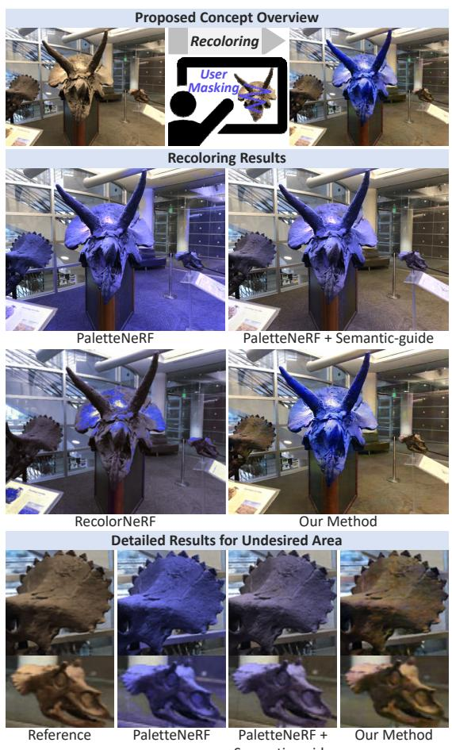  
Figure 1. Concept overview and color editing results: We compare our method with the state-of-the-art NeRF color editing methods, PaletteNeRF [14] and RecolorNeRF [10]. While PaletteNeRF and RecolorNeRF effectively change the colors of the target object, they also inadvertently cause unwanted color alterations in areas that should remain unchanged.

Various methods have been proposed to support NeRF appearance editing. One approach recovers physical scene properties, such as albedo and specular roughness, to enable rendering under novel lighting conditions or material property adjustments [4, 37]. Another approach learns latent codes together with the NeRF reconstruction to control its appearance, including changes in illumination or color [22, 32]. Recently, the state-of-the-art NeRF recoloring method, called PaletteNeRF [14] and RecolorNeRF [10], were introduced. With a novel framework and regularization techniques, both methods achieved high-quality, multiview consistent recolored results for general 3D scenes. However, these methods are palette-based, meaning they represent the scene by extracting a few basic colors and combining them through weighted summation. A limitation of these approaches is that they cannot selectively recolor a specific object when multiple objects with similar colors are present in the scene. In this case, the colors of undesired objects change simultaneously (please see Fig. 1).

In this paper, we propose ICE-NeRF, a method that allows the user to interactively and intuitively edit NeRF scenes. Our approach is simple and efficient: We use a pre-trained model and take the user’s rough mask for a single view as input. We then fine-tune some of the model’s weights to achieve the desired color in the user mask region. Since only some of the model’s weights are fine-tuned, without requiring additional weights, the recolored model is obtained in less than a minute. This makes our method both time and memory efficient. Additionally, our method is flexible and can be applied to various model structures. This versatility makes our approach a practical solution for NeRF recoloring across various model structures.

Our proposed method, while simple in concept, requires careful consideration of a couple of issues to ensure its practicality. One issue is the entanglement of the implicit representation, where the color of a particular part is embedded across the entire weight of the model. A simple fine-tuning approach without consideration of this will result in changes in areas where color changes are not desired, leading to poor decomposition performance. A second issue is that radiance in most NeRFs depends on view direction, which can lead to poor multi-view consistency when training with user masks for a small number of views. Ignoring this issue will lead to the sudden and unexpected changes in the color of the target area when the viewpoint is altered during the process of novel view synthesis.

To address these issues, we propose two novel techniques: Activation Field-based Regularization (AFR) and

Single-mask Multi-view Rendering (SMR) techniques. To address the entanglement issue caused by the implicit representation’s nature, we propose the AFR. We assume that specific weights in the model contain more color information for particular regions of the scene. Based on this assumption, we perform weight regularization, through which the model can minimize learning weights that cause color changes in undesired areas and focus on learning weights that have a greater impact on color changes in the desired areas. The SMR technique performs an inverse projection of the user’s 2D mask onto the object in 3D space and renders it from multiple views, achieving a similar effect to having a multi-view mask. As a result, our approach achieves welldecomposed and multi-view consistent results, even when the user provides only a rough mask for a single view or a small number of views. Our contributions are as follows:

• We propose the ICE-NeRF framework, which allows users to selectively recolor desired regions with interactive control while avoiding color changes in undesired areas.

• Our approach is not only efficient as it only fine-tunes some of the weights of a pre-trained model, but also enjoys a high speed of only one minute to complete the entire process.

• Through the proposed AFR and SMR techniques, our method achieves strong decomposition performance and ensures solid multi-view consistency.

## 2. Related Work

Neural radiance field (NeRF). NeRF [16] is one of the representations of 3D spaces, similar to triangle meshes and polygons. It learns to output the density and viewdependent radiance of a point in 3D space, given its coordinates (x, y, z) and viewing direction (θ, φ) as inputs to MLP. Since the introduction of NeRF, its simplicity and high-quality 3D reconstruction performance have led to various related studies [15, 35, 23, 2, 4]. However, the vanilla-NeRF model suffers from long training and rendering times. Recent research has therefore focused on hybrid structures, where deep Multilayer Perceptrons (MLPs) are combined with explicit structures like hash tables [18] or voxel grids [7, 34], and used alongside more lightweight MLPs [21]. Although employing neural network-based representations enables photorealistic reconstruction, modifying these representations to achieve desired editing results in 3D space is not intuitive since it is unclear which weights need to be modified. The difficulty in modifying the represented 3D space, as opposed to using traditional graphics pipelines, limits the usability of NeRF.

Editing NeRFs. Editing NeRF is challenging due to their implicit scene representations, which make the accu-

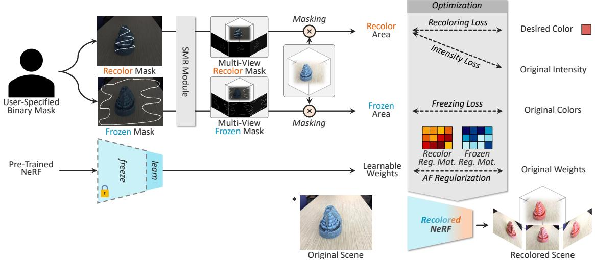  
Figure 2. Overview of our framework: We utilize a pre-trained NeRF and a user-specified mask for the region to be recolored or frozen, training specific weights of the model. To enhance decomposition and ensure view-consistency performance across multiple views using a mask for just one view, we introduce two novel techniques: the Activation Field-based Regularization (AFR) and Single-mask Multi-view Rendering (SMR).

## 3. Preliminaries

rate decomposition of desired parts of the 3D space and ensuring consistency across various views more difficult. Therefore, some attempts have been made to modify scenes by transferring the style of reference images to the NeRF scene without limiting it to specific parts of the scene [36]. Recent studies have proposed using the vision-language model CLIP to input text prompts or example images to modify the scene accordingly [29]. Instruct-NeRF2NeRF [11] also modifies the pre-trained NeRF according to the description by using the diffusion-based text-to-image generation model, InstructPix2Pix [5]. Other approaches have proposed modeling meshes that include cages or objects in the scene to modify the scene’s geometry [20, 12].

The state-of-the-art color editing methods that share similar goals with our proposed method are PaletteNeRF [14, 30] and RecolorNeRF [10], which aim to achieve photorealistic and view-consistent results through palette-based editing applied to NeRF. The palette-based editing approach represents the scene by extracting a few basis colors and using their weighted summation [6, 9, 24]. While this approach has the benefit of being able to perform recoloring with simple color selection, it also has difficulty accurately decomposing multiple objects with similar colors in the scene, which is a significant limitation. Additionally, PaletteNeRF is limited to applying recoloring to models with specific structures, and it requires a substantial training time of between 1 and 2 hours on an RTX 3090 GPU. In contrast, our proposed method can accomplish recoloring focused on desired parts in various NeRF structures within a much shorter time of about one minute.

Volumetric rendering. Our method is developed to be applicable to most NeRF-based models that perform volumetric rendering. Typically, NeRFs learn the volume density and directional radiance at any point in a specific scene through multi-view images. Here, the volume density $\sigma ( \mathbf { x } )$ takes the coordinate $\mathbf { x } = ( x , y , z )$ in space as input, which represents the probability of a specific ray being terminated at position x, i.e., the probability of an opaque surface existing. Directional radiance $\mathbf { c } ( \mathbf { x } , \mathbf { d } )$ takes the coordinate x and the direction $\mathbf { d } = ( \theta , \phi )$ in which the point is observed as input, which represents the color when location x is observed in direction d.

When NeRF performs rendering, a pixel is computed through a process called volumetric rendering, which uses the volume density and directional radiance of points on a single ray in 3D space. Here, the ray $\textbf { r } = \ ( \mathbf { o } , \mathbf { d } )$ is defined as a ray shot from origin o in the direction of d. The points $\mathbf { x } _ { 1 \ldots N }$ on this ray are defined by depth $t _ { 1 \dots N }$ as $\mathbf x _ { i } = \mathbf o + t _ { i } \mathbf d$ . The color of this ray is computed according to the following equation:

$$
\begin{array} { l } { { \displaystyle { \bf C } ( { \bf r } ( t ) ) = \sum _ { i = 1 } ^ { N } \omega _ { i } \cdot { \bf c } ( { \bf x } _ { i } , { \bf d } ) } , } \\ { { \displaystyle \omega _ { i } = \exp \left( - \sum _ { j = 1 } ^ { i - 1 } \delta _ { j } \sigma ( { \bf x } _ { j } ) \right) \left( 1 - \exp \big ( - \delta _ { i } \sigma ( { \bf x } _ { i } ) \big ) \right) } , } \end{array}\tag{1}
$$

where $\delta _ { i } = t _ { i + 1 } - t _ { i }$ represents the distance between adjacent samples. The above equation represents the process where the color of a single ray is determined by a weighted sum of the points $\mathbf { x } _ { i }$ on this ray and their rendering weights ωi.

## 4. Proposed Method

In this section, we outline the overall procedure of the proposed method (Sec. 4.1) and provide a detailed explanation of two techniques that address the challenges of the straightforward approach (Sec. 4.2 and 4.3). Finally, we demonstrate how the explained elements are applied during the optimization process (Sec. 4.4).

## 4.1. Overall Procedure for NeRF Recoloring

Fig. 2 provides an overview of our framework. We perform scene recoloring by training specific weights of a pretrained NeRF model. To facilitate the user’s masking task, we use the model to render a frame from an arbitrary view. On the rendered frame, the user draws a mask that indicates the areas where they want to change the color $( \mathbf { M } ^ { \mathrm { C } }$ , mask for changing) and the areas they want to keep the same $( \mathbf { M } ^ { \mathrm { F } }$ mask for frozen), and selects the target color. Note that even with masking for only one frame, high-quality recoloring results can be obtained, although increasing the number of frames for masking according to the user’s preference can lead to better results.

Afterwards, optimization is performed to obtain the recolored model. During the optimization process, we freeze most of the weights of the pre-trained model and selectively train some of the last three layers of the MLP responsible for color computation. The selection of layers to be trained is determined empirically according to the model’s structure. For a specific structure, we found that training certain layers consistently produces the best results regardless of the learned scene.

However, this black-box weight optimization strategy may lead to undesired changes in the scene. These can include poor decomposition or challenges in maintaining color consistency in the target region when the camera pose changes. This is due to the implicit representation of the scene being entangled in the neural network’s weights. In this regard, we propose two methods to address these decomposition and view-consistency issues without introducing additional modules or data while maintaining the simple optimization scheme. Details on these two methods will be discussed in the following sections.

## 4.2. Activation Field-based Regularization (AFR)

In the learning process for recoloring of a specific area in the scene, we focused on the fact that not all weights have equal importance. Due to the nature of the implicit representation, color information for a specific area in the scene is entangled across all weights of the neural network. However, we assume that certain subsets of weights may contain more concentrated color information for specific areas. Drawing inspiration from GAN Dissection [3], which analyzes the semantics embedded in GANs, we examined which neurons in NeRF’s MLP contain color information for specific areas.

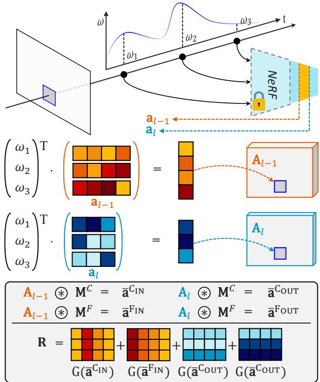  
Figure 3. Illustration of AFR: We use the same procedure as volume rendering on the activation field to generate a volumerendered activations A, and compute the matrix R for AFR using Eq. 3 and Eq. 5. The symbol \~ represents $\mathbf { A v g } ( \mathbf { M a s k } ( \cdot ) )$ , and $\operatorname { G } ( \cdot )$ represents Normalize(Rank(·)) function, which has an option of ascend or descend. Please see Sec. 4.2 for more details.

To this end, we propose the concept of Activation Fields in this section. It is important to note that activation field is not a separate module but an expanded interpretation of information generated during the rendering process of the radiance field. Just as the radiance field contains color information at each position in 3D space, the activation field contains activation information of the model at each position in 3D space. Specifically, while the radiance field outputs color and density for a 5D input $( x , y , z , \theta , \phi )$ , the activation field outputs activations generated by a specific layer of the network during the computation of color and density for the same 5D input. This also can be rendered through the volume rendering shown in Eq. 1:

$$
\mathbf { A } _ { l } ( \mathbf { r } ( t ) ) = \sum _ { i = 1 } ^ { N } \mathbf { \sigma } \omega _ { i } \cdot \mathbf { a } _ { l } ( \mathbf { x } _ { i } , \mathbf { d } ) ,\tag{2}
$$

where $\omega _ { i }$ is the rendering weight for points on the ray r used in Eq. 1, and $\mathbf { a } _ { l }$ denotes the activation in layer l. This equation can be interpreted as a weighted sum of model activations using the same rendering weights $\omega _ { i }$ as when computing the color of a ray in the radiance field rendering process.

To obtain the activations for each region, we use the mean activation by applying a mask to the rendered activation map A (where l is omitted for simplicity) for the regions that need to be changed and the regions that need to be preserved:

$$
\begin{array} { r } { \bar { \mathbf { a } } ^ { \mathrm { C } } = \mathrm { A v g } ( \mathbf { M a s k } ( \mathbf { M ^ { \mathrm { C } } } , \mathbf { A } ) ) , } \\ { \bar { \mathbf { a } } ^ { \mathrm { F } } = \mathrm { A v g } ( \mathbf { M a s k } ( \mathbf { M ^ { \mathrm { F } } } , \mathbf { A } ) ) , } \end{array}\tag{3}
$$

where $\operatorname { A v g } ( \cdot )$ and Mask(·) represent a averaging function and a masking function, respectively. We use these mean activations for each region to perform weight regularization during the model training process for recoloring.

To incorporate activation information from both the input/output sides of a specific layer into weight regularization, we obtain both $\bar { \mathbf { a } } ^ { \mathrm { c } }$ and $\bar { \mathbf { a } } ^ { \bar { \mathrm { F } } }$ using Eq. 3 at both the input/output sides of the layer $( \mathrm { i . e . , ~ \bar { a } ^ { C _ { \mathrm { I N } } } , ~ \bar { a } ^ { C _ { \mathrm { O U T } } } , ~ \bar { a } ^ { F _ { \mathrm { I N } } } }$ , and $\bar { \mathbf { a } } ^ { \mathrm { F o u r } } )$ . Fig. 3 demonstrates how the activations obtained from the input/output sides are used. The intuition behind the weight regularization is as follows: for instance, weights connected to the input side with low activation in region C, $\bar { \mathbf { a } } ^ { \mathrm { C _ { I N } } }$ , will have less influence on the final color of region $\mathbf { M } ^ { \mathrm { c } }$ . Therefore, we give a large penalty to the weights when their values change during the model training process. Similarly, weights connected to elements with high values in $\bar { \mathbf { a } } ^ { \mathrm { F o u r } }$ have a high influence on the color of the $\mathbf { M } ^ { \mathrm { F } }$ region, so we regularize them during training to prevent significant changes in their values. We perform weight regularization as follows:

$$
{ \cal L } _ { \mathrm { A F R } } = | \mathbf { W } _ { l } - \mathbf { W } _ { l } ^ { * } | \odot \mathbf { R } ,\tag{4}
$$

where $\mathbf { W } _ { l }$ and $\mathbf { W } _ { l } ^ { * }$ represent the matrices of original and updated weights of layer l in the model, respectively, while R denotes the penalty matrix applied to the change in each weight, and $\odot$ represents the Hadamard product. The penalty matrix R is calculated as follows:

$$
\begin{array} { r } { { \bf R } _ { i j } = { \bf N o r m a l i z e } ( { \bf R a n k } ( \bar { \bf a } ^ { \bf C _ { \mathrm { I N } } } { \bf \phi } , { \bf d e s c e n d } ) ) _ { j } + { \bf \phi } } \\ { { \bf N o r m a l i z e } ( { \bf R a n k } ( \bar { \bf a } ^ { \bf C _ { \mathrm { O U T } } } , { \bf d e s c e n d } ) ) _ { i } + { \bf \phi } } \\ { { \bf N o r m a l i z e } ( { \bf R a n k } ( \bar { \bf a } ^ { \bf F _ { \mathrm { I N } } } { \bf \phi } , { \bf a s c e n d } ) ) _ { j } + { \bf \phi } } \\ { { \bf N o r m a l i z e } ( { \bf R a n k } ( \bar { \bf a } ^ { \bf F _ { \mathrm { O U T } } } , { \bf a s c e n d } ) ) _ { i } , { \bf \phi } } \end{array}\tag{5}
$$

where Normalize(·) performs vector normalization, making the sum of the vector equal to 1. Rank(·) returns a vector of the same size as the input, providing the ranking of each element based on its position when the values are sorted either in ascending or descending order.

To aid understanding, we provide an example for the first line of Eq. 5. Assume the input $\bar { \mathbf { a } } ^ { \mathrm { C _ { I N } } }$ (average activation of the object region) is [3, 1, 4, 2], the second element has little color influence on the object, hence the weights connected to that element (the second column of W) should be heavily regularized to stay close to the original weights, whereas the third element should be treated oppositely. Thus, Rank $( \bar { \mathbf { a } } ^ { \mathrm { { C _ { I N } } } }$ , desc.) → [1, 3, 0, 2], Normal-$\mathrm { i z e } ( [ 1 , 3 , 0 , 2 ] ) {  } [ 0 . 1 7 , 0 . 5 , 0 , 0 . 3 3 ]$ . The j-th value of this result is used for the regularization of the j-th column of W. If the input is $\bar { \mathbf { a } } ^ { \mathrm { C o u r } }$ , the i-th value of the result is used for the i-th row. When the input is the background region’s activation, a¯F{IN,OUT} , Rank(·) uses ascend as larger activations require heavier regularization of weights W to restrict changes in background region.

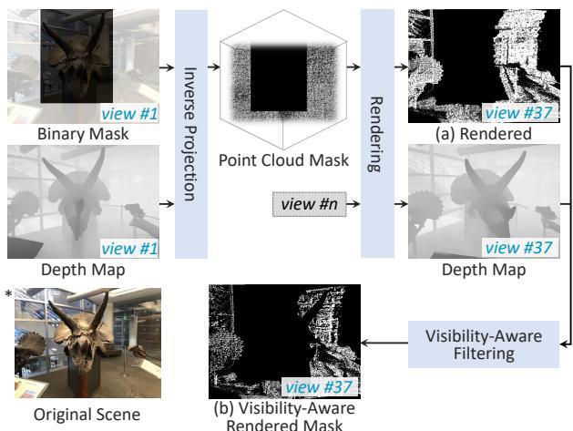  
Figure 4. Illustration of SMR: We generate multi-view masks using a single binary mask and depth information obtained from pretrained NeRF. During multi-view mask rendering, a rendered mask is generated for each view with visibility considerations.

## 4.3. Single-mask Multi-view Rendering (SMR)

Generally, the output of NeRF is conditioned on the view direction, so training using only a given user mask from a single view can lead to poor view-consistency. To address this, we adopt the Depth-Image-Based Rendering (DIBR) approach [8], which reprojects 2D contents into 3D space using a depth map, to conduct multi-view training. By employing this approach, we can guarantee the viewconsistency of the edited model, even when there is only one or a small number of user masks, by rendering masks in novel views. Specifically, we extract the pixel-wise depth for the view where masking has been performed using the following equation:

$$
\mathbf { D } ( \mathbf { r } ( t ) ) = \sum _ { i = 1 } ^ { N } \mathbf { \sigma } \omega _ { i } \cdot t _ { i } ,\tag{6}
$$

where $\omega _ { i }$ and $t _ { i }$ represent the rendering weight and the distance from the origin o of the ray r to the i-th point $\mathbf { x } _ { i }$ on the ray, respectively, as defined in Eq. 1.

We use the extracted depth map to project the user’s mask into 3D space, constructing a point cloud. As this point cloud consists of coordinates within the 3D scene, it can be rendered from different viewpoints. However, simple rendering of the point cloud does not reflect occlusion caused by objects in the scene for the masked region as the view changes. To address this, we reflect the reachability by comparing the pixel-wise depth of each point in the point cloud when viewed from the changed view to the pixel-wise depth at that location during the rendering process for the changed view.

## 4.4. Optimization Strategy

Recoloring loss is a loss function used to make the color of $\mathbf { M } ^ { \mathrm { c } }$ match the user-selected target color. It is calculated using the following equation:

$$
L _ { \mathrm { R } } = \| \mathbf { M a s k } ( \mathbf { M } ^ { \mathrm { C } } , \mathbf { I } ) - \mathbf { C } ^ { \mathrm { T a r g e t } } \| _ { 2 } ,\tag{7}
$$

where I is the image rendered by the network being trained, and $\mathbf { C } ^ { \mathrm { { T a r g e t } } }$ is the user-selected target color.

Intensity preserving loss is a loss function used to prevent a decrease in photorealism of the scene when only the recolor loss is used. It helps to maintain the intensity of each pixel in $\mathbf { M } ^ { \mathrm { c } }$ of the original scene even after recoloring:

$$
L _ { \mathrm { I } } = \| \mathrm { I n t } ( \mathbf { M a s k } ( \mathbf { M } ^ { \mathrm { C } } , \mathbf { I } ) ) - \mathrm { I n t } ( \mathbf { M a s k } ( \mathbf { M } ^ { \mathrm { C } } , \mathbf { I } ^ { \ast } ) ) \| _ { 2 } ,\tag{8}
$$

where Int(·) is a function that converts RGB to intensity, and I∗ is the image rendered by the original model.

Freezing loss is a loss function used to ensure that the color of the scene in ${ \bf M } ^ { \mathrm { F } }$ provided by the user remains the same as the original scene:

$$
L _ { \mathrm { F } } = \| \mathbf { M a s k } ( \mathbf { M } ^ { \mathrm { F } } , \mathbf { I } ) - \mathbf { M a s k } ( \mathbf { M } ^ { \mathrm { F } } , \mathbf { I } ^ { * } ) \| _ { 2 } .\tag{9}
$$

Total loss. The training is performed using the above three losses and the Activation Field-based Regularization method. If the user provides only a mask for a single view, the Single-mask Multi-view Rendering technique is applied to perform the training in multi-view:

$$
L _ { \mathrm { T o t a l } } = L _ { \mathrm { R } } + L _ { \mathrm { I } } + L _ { \mathrm { F } } + L _ { \mathrm { A F R } } .\tag{10}
$$

## 5. Experimental Results

## 5.1. Implementation Details

To demonstrate the applicability of ICE-NeRF, we applied our method to three different NeRF models: the original NeRF [16], Instant-NGP [18], and TensoRF [7]. We used the code and pre-trained weights from the nerf-pytorch Github repository [33] to apply ICE-NeRF to the original NeRF [16]. For InstantNGP [18] and TensoRF [7], we utilized the code from the torch-ngp Github repository [25, 26]. Each model contains a 3-layer MLP for color computation, with layer selections for learning in each model determined empirically: the penultimate layer for the original NeRF, and the second and third layers from the last for Instant-NGP and TensoRF.

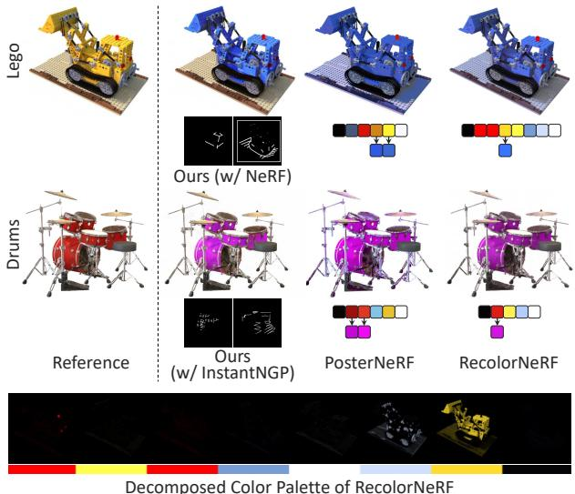  
Figure 5. Qualitative comparison with PosterNeRF [27] and RecolorNeRF [10]. Our results include the Lego scene, which applied our method to the original NeRF, and the Drums scene, which applied our method to Instant-NGP. The two masks below our results are the recolor mask and the frozen mask, from left to right. PosterNeRF could not perform the desired level of color editing on objects with only one color editing.

The code used for training and testing was implemented using Pytorch [19] on a single NVIDIA Geforce RTX 3090. Training was conducted for pre-trained models in under 100 iterations with a mini-batch size of 1024. We used Adam [13] optimizer with a learning rate of 0.01. The training time was less than one minute. To apply SMR, we generated a multi-view mask by using a single mask and rendering it from fewer than five additional views. We then trained the model for the same number of iterations as we did with the single mask. The training process involves N iterations of simultaneous learning for recoloring target regions and preserving non-target regions, followed by M iterations of learning solely for preserving non-target regions. Empirically, a balanced outcome was observed with N and M values set to 10 and 90, respectively.

Datasets. We conduct experiments on scenes sourced from three different datasets: the NeRF Blender dataset [16], which includes Lego, Drums, Hotdog, Chair, and Ship; the forward-facing LLFF dataset [17], containing Horns, Flower, and Fortress; and the Mip-NeRF360 dataset [2], featuring Kitchen and Bonsai.

## 5.2. Comparisons

Qualitative comparison. Figure 5 illustrates the color editing results for the Lego and Drums scenes in the NeRF Blender dataset. We applied our proposed method to both the original NeRF and the Instant-NGP. In the Lego scene, we observed that the other two existing methods showed poor decomposition performance. For RecolorNeRF, the palette editing for the light-yellow basis did not result in any noticeable change in the scene’s color (refer to RecolorNeRF’s decomposed basis for the Lego scene in Fig. 5). For the Drums scene, our proposed method applied to the Instant-NGP model showed better decomposition performance than the other two existing methods (refer to the color of the cymbal part).

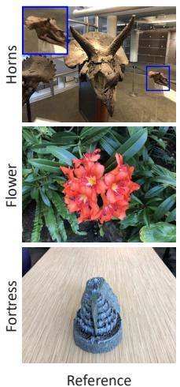

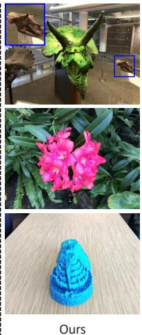

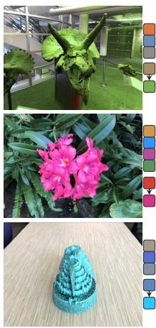  
PaletteNeRF

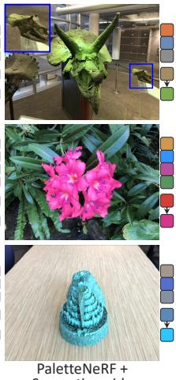  
Figure 6. Qualitative comparison with the state-of-the-art NeRF color editing methods. We compare our method with PaletteNeRF [14] and RecolorNeRF [10]. Zoom-in view is in the blue box.

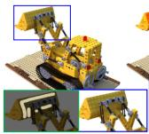

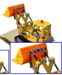

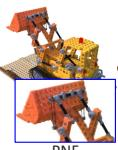

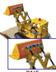  
(+ Blending)

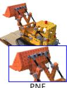  
(+ Mask-guide)

Figure 6 shows a comparison of our method with stateof-the-art NeRF color editing methods, PaletteNeRF and RecolorNeRF, on the LLFF dataset. The Horns scene is one of the most challenging scenes for recoloring since it has multiple objects with similar colors and identical semantic objects (dinosaur skull bones). In the case of RecolorNeRF and PaletteNeRF (without semantic guidance) applied to the Horns scene, both methods were able to change the color of the bones well. However, the color of the floor also changed significantly. When PaletteNeRF was applied with semantic guidance, the color change was relatively focused on the bone parts. However, the color of small bones with the same semantics also changed, as shown in the blue box. For Flower and Fortress scenes, both methods performed well in color editing because there was a large color difference between the objects and backgrounds. However, in the case of RecolorNeRF, a single palette editing was not enough to achieve the desired level of color change.

Since existing methods do not utilize masks, we have implemented two simple approaches to enable PaletteNeRF to use masks. This allows for a fairer comparison with our results, as illustrated in Fig. 7. The two methods are: 1) maskbased blending; and 2) switching from a semantic-guide to a mask-guide. PaletteNeRF’s semantic-guide uses semantic segmentation to recolor surfaces that have the same semantic features as a specific point. We modify this by using masks to assign average semantics within a distinct area. Our results confirm that ICE-NeRF exhibits superior decomposition performance, delivering higher-quality results compared to other baselines.

Figure 7. Qualitative comparison for a fair evaluation, applying mask-based blending and mask-guide to enable PaletteNeRF (PNF) to utilize masks.  
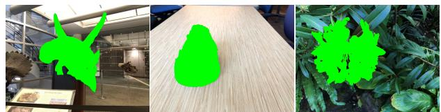  
Figure 8. Example of annotated object mask. We measure the decomposition performance by computing the Mean Squared Error (MSE) of the area outside the object mask.

<table><tr><td>Method</td><td>Horns</td><td>Fortress</td><td>Flower</td><td>Average</td></tr><tr><td>RecolorNeRF</td><td>0.1867</td><td>0.0013</td><td>0.0003</td><td>0.0627</td></tr><tr><td>PaletteNeRF</td><td>0.0818</td><td>0.0013</td><td>0.0003</td><td>0.0277</td></tr><tr><td>Ours</td><td>0.0213</td><td>0.0010</td><td>0.0003</td><td>0.0075</td></tr></table>

Table 1. Quantitative comparison between our method, RecolorNeRF, and PaletteNeRF. The numbers in each cell indicate the Mean Squared Error (MSE) used to measure the color change of the background area in annotated object masks after applying color editing.

Quantitative comparison. Table 1 presents the quantitative results obtained from the evaluation of the proposed method, RecolorNeRF, and PaletteNeRF on Horns, Fortress, and Flower scenes. To assess decomposition performance, we annotated segmentation masks (Fig. 8) for the centered object in each scene’s testset and computed the Mean Squared Error (MSE) of the background region. In consideration of color selection variation, we repeated each experiment ten times with different settings and reported the average results. The obtained results indicate that ICE-NeRF significantly outperforms the two baseline methods in terms of decomposition performance.

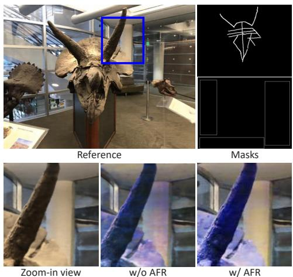  
Figure 9. Effect of AFR.

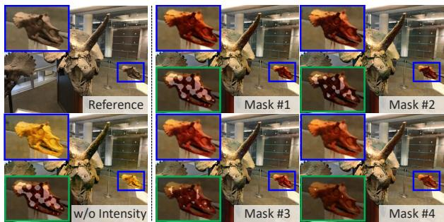  
Figure 10. Effect of intensity loss and mask sparsity.

Time comparison for a given pre-trained NeRF, up until saving the first frame, is as follows: Our method takes 25 sec, RecolorNeRF takes 160 sec, and PaletteNeRF takes 49 min.

## 5.3. Ablation Study

Effect of AFR. Figure 9 shows the results of an ablation study on AFR. As shown in the figure, when the user’s input mask is too rough, unwanted color changes may occur in areas with similar colors to the target area. In this case, the proposed AFR successfully suppresses color changes in this region.

Effect of intensity loss and mask sparsity. The bottom left image in Fig. 10 shows the result when intensity loss is not applied. As shown in the figure, the intensity of the reference scene is not properly maintained. The four images on the right each show the results of recoloring while eroding the mask. The figure shows that recoloring can be performed effectively even when the mask is extremely sparse.

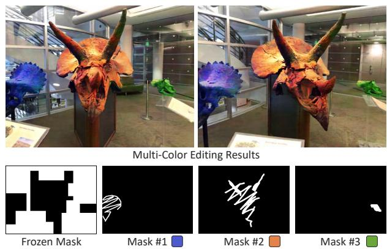  
Figure 11. Multi-color editing results with user masks.

## 5.4. Analysis

Analysis of AFR’s impact on activations $\bar { \mathbf { a } } ^ { \{ \mathbf { C } , \mathbf { F } \} _ { \mathbf { o U T } } }$ We analyze the influence of AFR on the cosine similarity between average activations before and after recoloring within each $\mathbf { M } ^ { \mathrm { C } } / \bar { \mathbf { M } } ^ { \mathrm { F } }$ region. By using random target colors for scenes shown in Fig. 6, we present the average results from 100 trials each. Without AFR, the similarities for $\mathbf { M } ^ { \mathrm { c } }$ and $\mathbf { M } ^ { \mathrm { F } }$ are 0.4704 and 0.7207, respectively; with AFR, these values become 0.4699 and 0.7363. Consistent with our expectations, AFR decreases the changes in activation in MF, while causing ${ \bf M } ^ { \mathrm { C } } \backslash$ s activations to diverge more from the original.

Analysis of AFR’s Impact on Weights W. We explore the variation in each $\mathbf { W } _ { i j }$ value post-recoloring, related to the corresponding ${ \bf R } _ { i j }$ value (utilizing the same setting as previously mentioned). The average change in $\mathbf { W } _ { i j }$ is divided into quartiles, beginning with the top 25% of cases with the largest ${ \bf R } _ { i j }$ values, yielding the following results: 0.0192, 0.0194, 0.0207, and 0.0249. These findings corroborate that a greater ${ \bf R } _ { i j }$ value leads to more modest changes in $\mathbf { W } _ { i j }$

## 5.5. Other Results

Multi-color editing. The proposed method offers a notable benefit by enabling the recoloring of individual scene components with distinct colors. As illustrated in Fig. 11, our approach facilitates color editing for objects that have similar colors and semantics.

Various user masks. We performed color editing for various types of user masks to verify how much our color editing method is influenced by them. Fig. 12 demonstrates that ICE-NeRF performs well in color editing with various types of user masks, including dots, lines, curves, scribbles, and areas.

Results with TensoRF. Figure 13 shows the color editing results obtained by applying our method to a pre-trained TensoRF [7]. The figure shows that ICE-NeRF, a general solution applicable to various NeRF variants, yields highquality results with TensoRF as well, which is based on a decomposed voxel representation.

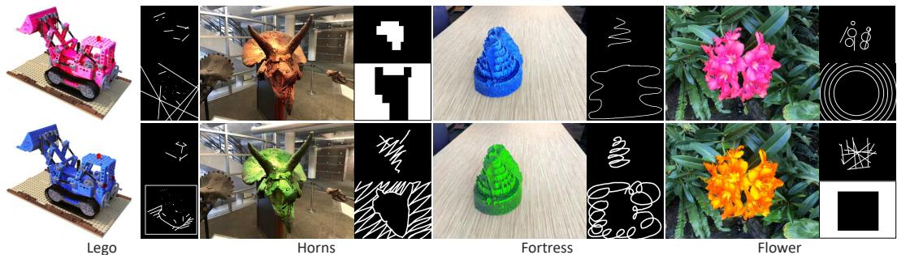  
Figure 12. Color editing results with various type of user mask.

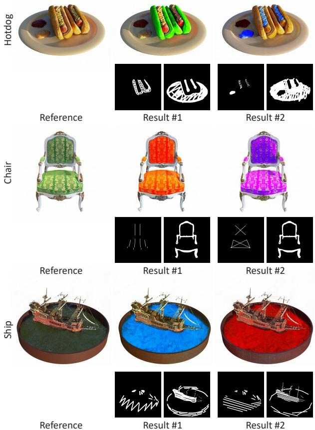  
Figure 13. Results of applying our method to the pre-trained TensoRF on the NeRF Blender dataset.

Results on Mip-NeRF360. Figure 14 shows the color editing results obtained by applying our method to a pretrained Instant-NGP on Mip-NeRF360 dataset. Unlike the results on synthetic (Blender) and forward-facing (LLFF) scenes, we observed that 360◦ scenes, could generate artifacts in some areas (please see Sec. 6).

## 6. Limitations

We applied our proposed method to three different models and confirmed that it can perform high-quality recoloring for synthetic, forward-facing scenes. However, as shown in Fig. 14, we observed unwanted color changes in some areas of the 360◦ scenes. We speculate that this phenomenon occurs because, in the case of 360◦ scenes, the model requires learning over a broader and more complex 3D space.

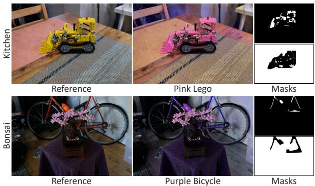  
Figure 14. Results of applying our method to the pre-trained InstantNGP on the Mip-NeRF360 dataset.

Due to the nature of the user-specified mask, our method may not be practical for scenes with complex objects spanning the entire scene, such as scenes with complex entangled branches. In such cases, to further increase user convenience, conventional segmentation algorithms or off-theshelf segmentation models can be used in combination with our method to enhance its usability.

## 7. Conclusion

We have presented ICE-NeRF, a method that allows users to interactively and intuitively edit NeRF scenes. Our approach efficiently performs color editing through simple fine-tuning, while also addressing two issues that can arise in weight optimization-based NeRF color editing methods. To address these issues, we introduced the AFR and SMR techniques. Our experimental results demonstrate that ICE-NeRF outperforms existing NeRF color editing methods in terms of both decomposition performance and time efficiency. In future work, we aim to explore scene geometry editing through weight optimization and extend our method to accommodate dynamic NeRFs.

Acknowledgement. This research has been supported by the LG Electronics Corporation (Project No. G01220205).

## References

[1] Jonathan T. Barron, Ben Mildenhall, Matthew Tancik, Peter Hedman, Ricardo Martin-Brualla, and Pratul P. Srinivasan. Mip-nerf: A multiscale representation for anti-aliasing neural radiance fields. In 2021 IEEE/CVF International Conference on Computer Vision, ICCV 2021, Montreal, QC, Canada, October 10-17, 2021, pages 5835–5844. IEEE, 2021.

[2] Jonathan T. Barron, Ben Mildenhall, Dor Verbin, Pratul P. Srinivasan, and Peter Hedman. Mip-nerf 360: Unbounded anti-aliased neural radiance fields. CVPR, 2022.

[3] David Bau, Jun-Yan Zhu, Hendrik Strobelt, Agata Lapedriza, Bolei Zhou, and Antonio Torralba. Understanding the role of individual units in a deep neural network. Proceedings ofthe National Academy ofSciences, 2020.

[4] Mark Boss, Raphael Braun, Varun Jampani, Jonathan T. Barron, Ce Liu, and Hendrik P. A. Lensch. Nerd: Neural reflectance decomposition from image collections. In 2021 IEEE/CVF International Conference on Computer Vision, ICCV 2021, Montreal, QC, Canada, October 10-17, 2021, pages 12664–12674. IEEE, 2021.

[5] Tim Brooks, Aleksander Holynski, and Alexei A. Efros. Instructpix2pix: Learning to follow image editing instructions. In IEEE Conference on Computer Vision and Pattern Recognition (CVPR), 2023.

[6] Huiwen Chang, Ohad Fried, Yiming Liu, Stephen DiVerdi, and Adam Finkelstein. Palette-based photo recoloring. ACM Trans. Graph., 34(4):139–1, 2015.

[7] Anpei Chen, Zexiang Xu, Andreas Geiger, Jingyi Yu, and Hao Su. Tensorf: Tensorial radiance fields. arXiv preprint arXiv:2203.09517, 2022.

[8] Christoph Fehn. Depth-image-based rendering (dibr), compression, and transmission for a new approach on 3d-tv. In Stereoscopic displays and virtual reality systems XI, volume 5291, pages 93–104. SPIE, 2004.

[9] Chie Furusawa, Kazuyuki Hiroshiba, Keisuke Ogaki, and Yuri Odagiri. Comicolorization: semi-automatic manga colorization. In Diego Gutierrez and Hui Huang, editors, SIG-GRAPH Asia 2017 Technical Briefs, Bangkok, Thailand, November 27 - 30, 2017, pages 12:1–12:4. ACM, 2017.

[10] Bingchen Gong, Yuehao Wang, Xiaoguang Han, and Qi Dou. Recolornerf: Layer decomposed radiance field for efficient color editing of 3d scenes. arXiv preprint arXiv:2301.07958, 2023.

[11] Ayaan Haque, Matthew Tancik, Alexei Efros, Aleksander Holynski, and Angjoo Kanazawa. Instruct-nerf2nerf: Editing 3d scenes with instructions. In Proceedings of the IEEE/CVF International Conference on Computer Vision, 2023.

[12] Clement Jambon, Bernhard Kerbl, Georgios Kopanas,´ Stavros Diolatzis, Thomas Leimkuhler, and George” Dret-¨ takis. Nerfshop: Interactive editing of neural radiance fields”. Proceedings ofthe ACM on Computer Graphics and Interactive Techniques, 6(1), May 2023.

[13] Diederik P. Kingma and Jimmy Ba. Adam: A method for stochastic optimization. In Yoshua Bengio and Yann LeCun,

editors, 3rd International Conference on Learning Representations, ICLR 2015, San Diego, CA, USA, May 7-9, 2015, Conference Track Proceedings, 2015.

[14] Zhengfei Kuang, Fujun Luan, Sai Bi, Zhixin Shu, Gordon Wetzstein, and Kalyan Sunkavalli. Palettenerf: Palette-based appearance editing of neural radiance fields. IEEE Conference on Computer Vision and Pattern Recognition (CVPR), 2023.

[15] Ricardo Martin-Brualla, Noha Radwan, Mehdi S. M. Sajjadi, Jonathan T. Barron, Alexey Dosovitskiy, and Daniel Duckworth. Nerf in the wild: Neural radiance fields for unconstrained photo collections. In IEEE Conference on Computer Vision and Pattern Recognition, CVPR 2021, virtual, June 19-25, 2021, pages 7210–7219. Computer Vision Foundation / IEEE, 2021.

[16] Ben Mildenhall, Pratul P. Srinivasan, Matthew Tancik, Jonathan T. Barron, Ravi Ramamoorthi, and Ren Ng. Nerf: representing scenes as neural radiance fields for view synthesis. Commun. ACM, 65(1):99–106, 2022.

[17] Pooneh Mohaghegh, Rabia Saeed, Franc¸ois Tieche, Alexis\` Boegli, and Yves Perriard. Depth camera and electromagnetic field localization system for iot application: High level, lightweight data fusion. In ASSE 2021: 2nd Asia Service Sciences and Software Engineering Conference, Macau, 24-26 February, 2021, pages 94–101. ACM, 2021.

[18] Thomas Muller, Alex Evans, Christoph Schied, and Alexan-¨ der Keller. Instant neural graphics primitives with a multiresolution hash encoding. ACM Trans. Graph., 41(4):102:1– 102:15, July 2022.

[19] Adam Paszke, Sam Gross, Francisco Massa, Adam Lerer, James Bradbury, Gregory Chanan, Trevor Killeen, Zeming Lin, Natalia Gimelshein, Luca Antiga, Alban Desmaison, Andreas Kopf, Edward Yang, Zachary DeVito, Martin Raison, Alykhan Tejani, Sasank Chilamkurthy, Benoit Steiner, Lu Fang, Junjie Bai, and Soumith Chintala. Pytorch: An imperative style, high-performance deep learning library. In H. Wallach, H. Larochelle, A. Beygelzimer, F. dAlche-Buc, E.´ Fox, and R. Garnett, editors, Advances in Neural Information Processing Systems 32, pages 8024–8035. Curran Associates, Inc., 2019.

[20] Yicong Peng, Yichao Yan, Shengqi Liu, Yuhao Cheng, Shanyan Guan, Bowen Pan, Guangtao Zhai, and Xiaokang Yang. Cagenerf: Cage-based neural radiance field for generalized 3d deformation and animation. In Advances in Neural Information Processing Systems, 2022.

[21] Christian Reiser, Songyou Peng, Yiyi Liao, and Andreas Geiger. Kilonerf: Speeding up neural radiance fields with thousands of tiny mlps. In 2021 IEEE/CVF International Conference on Computer Vision, ICCV 2021, Montreal, QC, Canada, October 10-17, 2021, pages 14315–14325. IEEE, 2021.

[22] Vincent Sitzmann, Michael Zollhofer, and Gordon Wet-¨ zstein. Scene representation networks: Continuous 3dstructure-aware neural scene representations. In Advances in Neural Information Processing Systems, 2019.

[23] Pratul P. Srinivasan, Boyang Deng, Xiuming Zhang, Matthew Tancik, Ben Mildenhall, and Jonathan T. Barron.

Nerv: Neural reflectance and visibility fields for relighting and view synthesis. In CVPR, 2021.

[24] Jianchao Tan, Jose Echevarria, and Yotam Gingold. Efficient palette-based decomposition and recoloring of images via rgbxy-space geometry. ACM Transactions on Graphics (TOG), 37(6):262:1–262:10, Dec. 2018.

[25] Jiaxiang Tang. Torch-ngp: a pytorch implementation of instant-ngp, 2022. https://github.com/ashawkey/torch-ngp.

[26] Jiaxiang Tang, Xiaokang Chen, Jingbo Wang, and Gang Zeng. Compressible-composable nerf via rank-residual decomposition. arXiv preprint arXiv:2205.14870, 2022.

[27] Kenji Tojo and Nobuyuki Umetani. Recolorable posterization of volumetric radiance fields using visibility-weighted palette extraction. Comput. Graph. Forum, 41(4):149–160, 2022.

[28] Dor Verbin, Peter Hedman, Ben Mildenhall, Todd E. Zickler, Jonathan T. Barron, and Pratul P. Srinivasan. Ref-nerf: Structured view-dependent appearance for neural radiance fields. CoRR, abs/2112.03907, 2021.

[29] Can Wang, Menglei Chai, Mingming He, Dongdong Chen, and Jing Liao. Clip-nerf: Text-and-image driven manipulation of neural radiance fields. CoRR, abs/2112.05139, 2021.

[30] Qiling Wu, Jianchao Tan, and Kun Xu. Palettenerf: Palette-based color editing for nerfs. arXiv preprint arXiv:2212.12871, 2022.

[31] Yiheng Xie, Towaki Takikawa, Shunsuke Saito, Or Litany, Shiqin Yan, Numair Khan, Federico Tombari, James Tompkin, Vincent Sitzmann, and Srinath Sridhar. Neural fields in visual computing and beyond. Computer Graphics Forum, 2022.

[32] Lior Yariv, Jiatao Gu, Yoni Kasten, and Yaron Lipman. Volume rendering of neural implicit surfaces. In Thirty-Fifth Conference on Neural Information Processing Systems, 2021.

[33] Lin Yen-Chen. Nerf-pytorch. https://github.com/ yenchenlin/nerf-pytorch/, 2020.

[34] Alex Yu, Sara Fridovich-Keil, Matthew Tancik, Qinhong Chen, Benjamin Recht, and Angjoo Kanazawa. Plenoxels: Radiance fields without neural networks. CoRR, abs/2112.05131, 2021.

[35] Jason Zhang, Gengshan Yang, Shubham Tulsiani, and Deva Ramanan. Ners: Neural reflectance surfaces for sparse-view 3d reconstruction in the wild. In Marc’Aurelio Ranzato, Alina Beygelzimer, Yann N. Dauphin, Percy Liang, and Jennifer Wortman Vaughan, editors, Advances in Neural Information Processing Systems 34: Annual Conference on Neural Information Processing Systems 2021, NeurIPS 2021, December 6-14, 2021, virtual, pages 29835–29847, 2021.

[36] Kai Zhang, Nick Kolkin, Sai Bi, Fujun Luan, Zexiang Xu, Eli Shechtman, and Noah Snavely. Arf: Artistic radiance fields, 2022.

[37] Kai Zhang, Fujun Luan, Qianqian Wang, Kavita Bala, and Noah Snavely. Physg: Inverse rendering with spherical gaussians for physics-based material editing and relighting. In IEEE Conference on Computer Vision and Pattern Recognition, CVPR 2021, virtual, June 19-25, 2021, pages 5453– 5462. Computer Vision Foundation / IEEE, 2021.