# ITI-GEN: Inclusive Text-to-Image Generation

Cheng Zhang 1 Xuanbai Chen 1 Siqi Chai 1 Chen Henry Wu 1 Dmitry Lagun 2 Thabo Beeler 2 Fernando De la Torre 1

1 Carnegie Mellon University 2 Google

## Abstract

Text-to-image generative models often reflect the biases of the training data, leading to unequal representations of underrepresented groups. This study investigates inclusive text-to-image generative models that generate images based on human-written prompts and ensure the resulting images are uniformly distributed across attributes of interest. Unfortunately, directly expressing the desired attributes in the prompt often leads to sub-optimal results due to linguistic ambiguity or model misrepresentation. Hence, this paper proposes a drastically different approach that adheres to the maxim that “a picture is worth a thousand words”. We show that, for some attributes, images can represent concepts more expressively than text. For instance, categories of skin tones are typically hard to specify by text but can be easily represented by example images. Building upon these insights, we propose a novel approach, ITI-GEN1, that leverages readily available reference images for Inclusive Textto-Image GENeration. The key idea is learning a set of prompt embeddings to generate images that can effectively represent all desired attribute categories. More importantly, ITI-GEN requires no model fine-tuning, making it computationally efficient to augment existing text-to-image models. Extensive experiments demonstrate that ITI-GEN largely improves over state-of-the-art models to generate inclusive imagesfrom a prompt.

## 1. Introduction

In recent years we have witnessed a remarkable leap in text-based visual content creation, driven by breakthroughs in generative modeling [69, 27, 59, 58, 63] and the access to large-scale multimodal datasets [67, 35]. Particularly, publicly released models, such as Stable Diffusion [63], have matured to the point where they can produce highly realistic images based on human-written prompts.

However, one major drawback of existing text-to-image models is that they inherit biases from the training data [6,

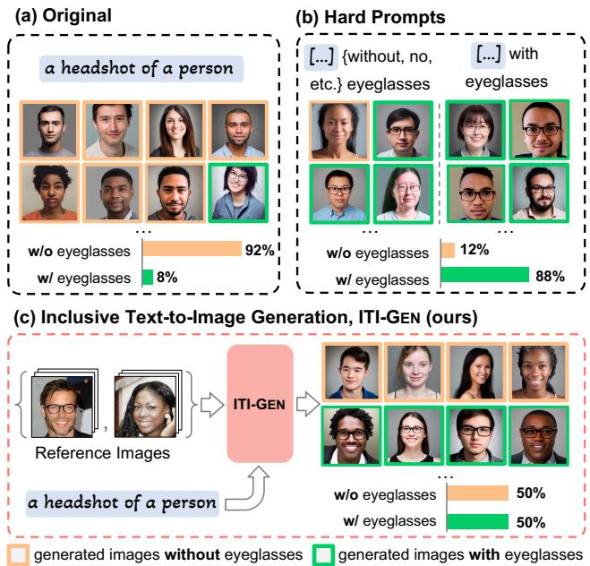  
Figure 1. (a) Given a human-written prompt (“a headshot ofa person”), existing text-to-image models [63] can hardly synthesize pictures representing minority groups (i.e., people with eyeglasses in this example). (b) Conventional hard prompt searching [18] is sub-optimal due to linguistic ambiguity. (c) We address these problems by leveraging a small set of reference images for inclusive text-to-image generation (ITI-GEN).

58, 63, 12, 5] and thus have yet to exhibit inclusiveness — the generated images based on the input text may reflect stereotypes, leading to the exclusion of certain attributes or minority groups. For instance, given the prompt “a headshot of a person”, Figure 1(a) shows how a state-of-the-art system generates about 92% images of subjects without eyeglasses, and only 8% with eyeglasses, showing a clear bias towards people without eyeglasses. Alternatively, as shown in Figure 1(b), one could specify the attribute in the prompt, resulting in better outcomes; however, this will still result in a sub-optimal solution due to linguistic ambiguity. While inclusiveness has been critical to responsible AI, existing text-to-image models are still lagging [12, 5, 55, 53, 46]. In this work, we propose a new method that achieves inclusiveness2 in text-to-image generation using only a few example images, as illustrated in Figure 1(c).

To advance inclusive generation, a straightforward way is to retrain or fine-tune the model upon request, using truly inclusive training data [17, 82]. Doing so, however, is insurmountably challenging as collecting large-scale training data that is balanced/inclusive across all attributes of interest is impractical, and training generative models is highly compute-intensive [67, 65, 17]. Another principled approach towards inclusiveness is to specify or enumerate each category in natural language (i.e., hard prompt searching) [18, 55]. However, many categories are difficult to specify with natural language (e.g., skin tone) or cannot be well synthesized by the existing models due to linguistic ambiguity or model misrepresentation [29].

At first glance, these seem to paint a grim picture for inclusive text-to-image generation. However, we argue that instead of specifying attributes explicitly using descriptive natural language, images can represent specific concepts or attributes more efficiently. Observing the availability of a shared vision-language embedding in many multimodal generative models [56], we raise the question: can we learn inclusive prompt embeddings using images as guidance?

To achieve this goal, we introduce ITI-GEN, a novel and practical framework that creates discriminative prompts based on readily available reference images for Inclusive Text-to-Image GENeration. Concretely, we leverage the vision-language pre-trained CLIP model [56] to obtain the embeddings of the reference images and learnable prompts. In the joint embedding space, we design a new training objective to align the directions of the image and prompt features. The core idea is to translate the visual attribute differences into natural language differences such that the generated images based on the learned prompts can effectively represent all desired categories. By equalizing the sampling process over the learned prompts, our method guarantees inclusiveness for text-to-image generation.

We validate our framework with Stable Diffusion [63]. ITI-GEN can leverage reference images from different domains, including human faces [43, 34, 20] and scenes [68], to achieve inclusive generation in single or multiple attributes of interest. ITI-GEN needs neither prompt specification nor model fine-tuning, bypassing the problems of linguistic ambiguity as well as computational complexity. Moreover, ITI-GEN is compatible with the existing textbased image generation models (e.g., ControlNet [81] and instruction-based image editing models [7]) in a plug-andplay manner. To the best of our knowledge, this is the first method that allows inclusive text-to-image generation over a frozen model and obtains competitive results throughout.

## 2. Related Work

Text-to-Image Generative Models. Text-based image generation has been widely studied with numerous model architectures and learning paradigms [48, 62, 71, 59, 23, 79, 18, 19, 9, 69, 78, 16, 17, 38]. Recently, the overwhelming success of diffusion-based text-to-image models [58, 66, 58, 51] has attracted significant attention. A key factor to this success is their ability to deal with large-scale multimodal datasets [67, 35, 11]. Thus, questions concerning inclusiveness while learning with biased datasets remain a crucial open problem [12, 5, 3].

Bias Mitigation in Text-to-Image Generation. While fairness has been studied extensively in discriminative models [73, 74, 75, 42], research on developing fair generative models is limited [83, 30, 22, 14, 46]. Most efforts focus on GAN-based models [13, 57, 31, 60, 80, 36, 77, 70, 33, 47], restricting their applicability to the emerging diffusion-based text-to-image models. Recently, there have been some efforts to address this limitation. For instance, Bansal et al. [5] proposed to diversify model outputs by ethical intervention3. Ding et al. [18] proposed to directly add attribute words to the prompt. However, these hard prompt searching methods have limitations such as being opaque and laborious [5], and not always generating diverse images reliably [29, 5]. In this work, we incorporate a broad spectrum of attributes beyond social groups. Moreover, we learn inclusive prompts in the continuous embedding space, requiring no hard prompt specification.

To learn a fair generative model, Wu et al. [76] employed off-the-shelf models, such as CLIP [56] and pre-trained classifiers, as guidance. Choi et al. [13] used a reference dataset to train the model via sample re-weighting. In contrast, we use reference data in a drastically different way — treating the images as proxy signals to guide prompt learning but without retraining the text-to-image model.

Image-Guided Prompt Tuning. Our method is inspired by Prompt Tuning (PT) [41, 32]. Typically, PT methods insert small learnable modules (e.g., tokens) into the pretrained models and fine-tune these modules with downstream tasks while freezing the model parameters. Recently, PT has been leveraged in personalized text-to-image generation [24, 64, 39]. By providing several reference images with the customized subject, they use a special token to represent the object by optimizing the token embedding [24, 39] or the diffusion models [64, 39]. This motivates us to learn the specific token embedding for each attribute category for inclusiveness. However, we note that the previously mentioned methods for personalization do not effectively capture the attributes in the images. Thus, we propose to optimize the directions of the attribute-specific prompts in the joint vision-language embedding space, bypassing training text-to-image generative models.

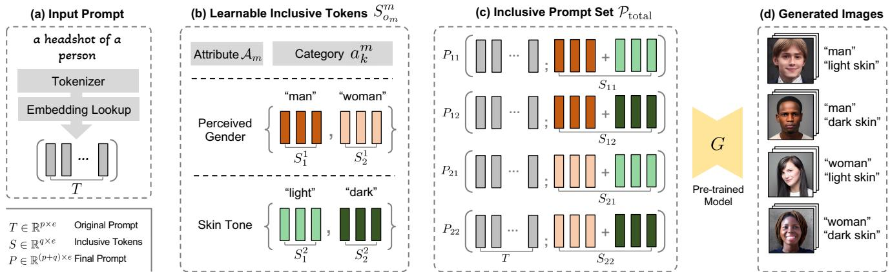  
Figure 2. Illustration of Inclusive Text-to-Image GENeration (ITI-GEN) with the example of two binary attributes: perceived gender and skin tone. (a) Given an input prompt, (b) ITI-GEN learns discriminative token embeddings to represent each category of every target attribute. (c) By injecting the learned tokens after the original input prompt, ITI-GEN synthesizes an inclusive prompt set that can be used to (d) sample equal (or controllable) numbers of images for any category combination. Further, our framework can be easily extended to multi-category multi-attribute scenarios of inclusive text-to-image generation. Note that, in practice, multi-category skin tones beyond {“light”, “dark”} as in this example may be challenging to specify with language (see Figure 3). Please see Section 3.1 for details.

## 3. Inclusive Text-to-Image Generation

To drive the progress of Inclusive Text-to-Image Generation, we propose ITI-GEN, which creates inclusive prompts that represent various attributes and their combinations. This is particularly challenging for attributes that are difficult to describe in language or underrepresented. To address this, ITI-GEN uses readily available reference images as guidance, enabling unambiguous specification of different attributes. Figure 2 illustrates the overall framework. In this section, we first introduce the framework of ITI-GEN in Section 3.1, then describe the details of the learning strategy in Section 3.2, and finally discuss the key properties of ITI-GEN in Section 3.3.

## 3.1. Overview

Problem Statement. Given a pre-trained text-to-image generative model $G$ and a human-written prompt $( e . g . , \ v )$ headshot ofa person”) tokenized as $\pmb { T } \in \mathbb { R } ^ { p \times e }$ , where p is the number of tokens and e is the dimension of the embedding space, we aim to sample equal (or controllable) numbers of images that can represent any category combination given the attribute set A. Formally,

$$
\pmb { A } = \{ A _ { m } | 1 \leq m \leq M \} ; A _ { m } = \{ a _ { k } ^ { m } | 1 \leq k \leq K _ { m } \}\tag{1}
$$

contains M different attributes $( e . g .$ ., perceived gender, skin tone, etc.), where $a _ { k } ^ { m }$ records a mutually exclusive category (e.g., a specific type of skin tone) in attribute $A _ { m }$ and $K _ { m }$ denotes the number of categories in $A _ { m }$ . Note that $K _ { m }$ may vary among different attributes.

Inclusive Prompt Set. Inspired by [41, 32], we propose prompt tuning for inclusive generation. Specifically, for a given category $a _ { k } ^ { m }$ within attribute $A _ { m } ,$ , we inject q learnable tokens $S _ { k } ^ { m } \in \mathbb { R } ^ { q \times e }$ after the original T to construct a new prompt $\ddot { P } _ { k } ^ { m } = [ \pmb { T } ; S _ { k } ^ { m } ] \in \mathbb { R } ^ { ( p + \bar { q } ) \times e }$ . By querying the model G with $P _ { k } ^ { m }$ , we can generate images exhibiting the characteristics of the corresponding category $a _ { k } ^ { m }$ . To differentiate the new tokens ${ \cal { S } } _ { k } ^ { m }$ from the original prompt T, we refer to them as inclusive tokens.

When jointly considering M attributes, we aggregate M separate inclusive tokens $\check { S _ { o _ { 1 } } ^ { 1 } } , S _ { o _ { 2 } } ^ { 2 } , \ldots , S _ { o _ { M } } ^ { M }$ to represent a specific category combination $( a _ { o 1 } ^ { \top } , a _ { o 2 } ^ { 2 } , \ldots , a _ { o M } ^ { M } )$ , e.g., the concept of (“woman”, “dark skin” $\mathbf { \xi } , \mathbf { \eta } _ { \mathrm { { + } } } \dots , \mathbf { \zeta } ^ { \ast } \mathbf { y } \mathbf { o u n g } ^ { \ast \mathbf { \alpha } ) }$ . We thus expect to create a unique $S _ { o _ { 1 } o _ { 2 } \ldots o _ { M } } ,$

$$
\pmb { S } _ { o _ { 1 } o _ { 2 } \dots o _ { M } } = f ( \pmb { S } _ { o _ { 1 } } ^ { 1 } , \pmb { S } _ { o _ { 2 } } ^ { 2 } , \dots , \pmb { S } _ { o _ { M } } ^ { M } )\tag{2}
$$

that can be injected after T to generate images for this particular category combination. The aggregation function f in Equation 2 should be able to take various numbers of attributes while maintaining the permutation invariant prop-$\mathrm { e r t y ^ { 4 } }$ with respect to attributes. Common options include element-wise average, sum, and max operations. Following [49], we adopt element-wise sum to preserve the text semantics without losing information5. Finally, we define the inclusive prompt set as follows:

$$
\begin{array} { l } { \displaystyle \mathcal { P } _ { \mathrm { t o t a l } } = \{ P _ { o _ { 1 } o _ { 2 } \dots o _ { M } } = [ { \pmb T } ; \sum _ { m = 1 } ^ { M } S _ { o _ { m } } ^ { m } ] \in \mathbb { R } ^ { ( p + q ) \times e } \ \} } \\ { \displaystyle \quad 1 \leq o _ { 1 } \leq K _ { 1 } , \ldots , 1 \leq o _ { M } \leq K _ { M } \} . } \end{array}\tag{3}
$$

By uniformly sampling the prompts from $\mathcal { P } _ { \mathrm { t o t a l } }$ as the conditions to generate images using the generative model G, we achieve inclusiveness across all attributes (see Figure 2). More generally speaking, the distribution of the generated data is directly correlated to the distribution of the prompts, which can be easily controlled.

In contrast to specifying the category name in discrete language space [5, 18], we optimize prompts entirely in the continuous embedding space. Additionally, we only update the attribute-specific embeddings — the colors • and • in Equation 3 indicate frozen and learnable parameters, respectively. This decoupled optimization mechanism thus provides the advantage of using the learned inclusive tokens in a plug-and-play manner across various applications, as will be demonstrated in Section 3.3 and Section 4.3. We elaborate on the learning process in the following section.

## 3.2. Learning Inclusive Prompts

Reference Image Set. We propose using reference images to guide prompt learning, as they can provide more expressive signals to describe attributes that may be challenging to articulate through language. Specifically, we assume the availability of a reference image set $\mathcal { D } _ { \mathrm { r e f } } ^ { m } = \{ ( \boldsymbol { x } _ { n } ^ { m } , y _ { n } ^ { m } ) \} _ { n = 1 } ^ { N _ { m } }$ for a target attribute $A _ { m }$ , where $N _ { m }$ is the dataset size and $y _ { n } ^ { m } \in { \mathcal { A } } _ { m }$ (defined in Equation 1) indicates the category to which ${ \pmb x } _ { n }$ belongs. When considering multiple attributes, we only need a reference dataset for each attribute, rather than one large balanced dataset with all attribute labels. This property is extremely beneficial, as it is much easier to obtain a dataset that captures only the distribution of one attribute $( i . e .$ , the marginal distribution) rather than one that captures the joint distribution of all attributes.

Aligning Prompts to Images with CLIP. Given reference image sets for the target attributes, can we learn prompts that align the attributes in the images? Recently, pre-trained large-scale multimodal models have demonstrated strong capabilities in connecting vision and language. One such model is CLIP [56], which aligns visual concepts with text embeddings by jointly training a text encoder $E _ { \mathrm { t e x t } }$ and an image encoder $E _ { \mathrm { i m g } } .$ The output of the pre-trained CLIP text encoder has also been used as the condition for textguided image generation [63, 58], opening up an opportunity to align prompts to reference images without the need to modify the text-to-image models.

One straightforward solution is to maximize the similarity between the prompt and the reference image embeddings in the CLIP space, as suggested by [56]. However, we found it deficient for two reasons. First, this objective forces the prompt to focus on the overall visual information in the images, rather than the specific attribute of interest. Second, the generated images from the learned prompt often exhibit adversarial effects or significant quality degradation, potentially due to image features distorting the prompt embedding. To address these, we propose direction alignment and semantic consistency losses, as described below.

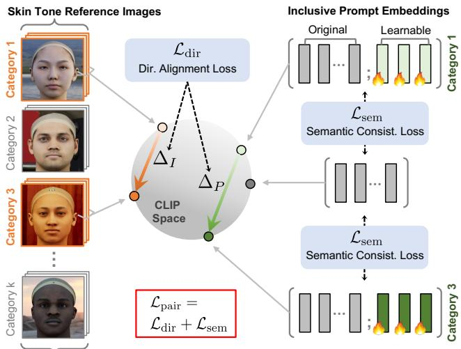  
Figure 3. Translating visual differences into text embedding differences. Given reference images of a multi-category attribute (e.g., skin tone), we learn the inclusive tokens by direction alignment between images and prompts, ensuring that the visual difference matches the learned language description. In addition, we propose semantic consistency loss to address language drift. Images are from FAIR benchmark [20]. Details are in Section 3.2.

Direction Alignment Loss. Instead of directly maximizing the similarity between the prompts and the images, we draw inspiration from [54, 25] to induce the direction between the prompt $P _ { i } ^ { m }$ and $P _ { j } ^ { m }$ to be aligned with the direction between the averaged embeddings of the reference images corresponding to a pair of categories $a _ { i } ^ { m }$ and $a _ { j } ^ { m }$ in $A _ { m }$ This alignment of pairwise categories direction serves as a proxy task for guiding the prompts to learn the visual difference among images from category $a _ { i } ^ { m }$ and $a _ { j } ^ { m }$ (Figure 3).

Specifically, we define the direction alignment loss ${ \mathcal { L } } _ { \mathrm { d i r } }$ to maximize the cosine similarity between the image direction and the prompt direction as follows:

$$
\begin{array} { r } { \mathcal { L } _ { \mathrm { d i r } } ^ { m } ( S _ { i } ^ { m } , S _ { j } ^ { m } ) = 1 - \big \langle \Delta _ { I } ^ { m } ( i , j ) , \Delta _ { P } ^ { m } ( i , j ) \big \rangle . } \end{array}\tag{4}
$$

Here, the image direction $\Delta _ { I }$ is defined as the difference of the averaged image embeddings between two categories of the attribute $A _ { m }$ . Let $\begin{array} { r } { \mathfrak { X } _ { k } ^ { m } \ = \ \frac { 1 } { | \mathcal { B } _ { k } | } \sum _ { y _ { n } ^ { m } = a _ { k } ^ { m } } E _ { \mathrm { i m g } } ( \pmb { x } _ { n } ^ { m } ) } \end{array}$ be the averaged image embedding for category $\mid a _ { k } ^ { m } ; \mid B _ { k } \mid$ is the number of images from category $a _ { k } ^ { m }$ in each mini-batch. We denote the image direction as follows:

$$
\Delta _ { I } ^ { m } ( i , j ) = \mathfrak { X } _ { i } ^ { m } - \mathfrak { X } _ { j } ^ { m } .\tag{5}
$$

Similarly, the prompt direction $\Delta _ { P }$ is defined as the difference of the averaged prompt embeddings between two categories. Let $\begin{array} { r } { \mathfrak { P } _ { k } ^ { m } \overset {  } { = } \frac { 1 } { | \mathcal { P } _ { k } ^ { m } | } \overset {  } { \sum } _ { P \in \mathcal { P } _ { k } ^ { m } } E _ { \mathrm { t e x t } } \overset {  } { ( } P ) } \end{array}$ be the averaged prompt embedding for attribute $a _ { k } ^ { m }$ . Specifically, ${ \mathcal { P } } _ { k } ^ { m } = \{ P \in { \mathcal { P } } _ { \mathrm { t o t a l } } \ | \ o _ { m } = k \}$ is a collection of prompts containing all the category combinations for other attributes given the category $a _ { k } ^ { m }$ for attribute $A _ { m }$ (cf. Equation 3). Finally, we denote the prompt direction as follows:

$$
\begin{array} { r } { \Delta _ { P } ^ { m } ( i , j ) = \mathfrak { P } _ { i } ^ { m } - \mathfrak { P } _ { j } ^ { m } . } \end{array}\tag{6}
$$

By inducing the direction alignment, we aim to facilitate the prompt learning of more meaningful and nuanced differences between images from different categories.

Semantic Consistency Loss. We observe that direction alignment loss alone may result in language drift [45, 40, 64] — the prompts slowly lose syntactic and semantic properties of language as they only focus on solving the alignment task. To resolve this issue, we design a semantic consistency objective to regularize the training by maximizing the cosine similarity between the learning prompts and the original input prompt (see Figure 3):

$$
\mathcal { L } _ { \mathrm { s e m } } ^ { m } ( S _ { i } ^ { m } , S _ { j } ^ { m } ) = \operatorname* { m a x } \Big ( 0 , \lambda - \big \langle E _ { \mathrm { t e x t } } ( P ) , E _ { \mathrm { t e x t } } ( \pmb { T } ) \big \rangle \Big )\tag{7}
$$

where $P \in \mathcal P _ { i } ^ { m } \cup \mathcal P _ { i } ^ { m }$ and λ is a hyperparameter (see an analysis in Section 4.3). This loss is crucial for generating high-quality images that remain faithful to the input prompt. Optimization. Building upon $\mathcal { L } _ { \mathrm { d i r } } ^ { m }$ and $\mathcal { L } _ { \mathrm { { s e m } } } ^ { m } ,$ our total training loss for learning the inclusive tokens of a pair of categories in attribute $A _ { m }$ is written as follows:

$$
\mathcal { L } _ { \mathrm { p a i r } } ^ { m } ( S _ { i } ^ { m } , S _ { j } ^ { m } ) = \mathcal { L } _ { \mathrm { d i r } } ^ { m } ( S _ { i } ^ { m } , S _ { j } ^ { m } ) + \mathcal { L } _ { \mathrm { s e m } } ^ { m } ( S _ { i } ^ { m } , S _ { j } ^ { m } ) .\tag{8}
$$

At each iteration, we update the embeddings of inclusive tokens of all the categories from only one attribute but freeze the parameters of inclusive tokens for all other attributes. The final objective during the whole learning process is:

$$
\mathcal { L } _ { \mathrm { t o t a l } } = \sum _ { m = 1 1 \leq i < j \leq K _ { m } } ^ { M } \mathcal { L } _ { \mathrm { p a i r } } ^ { m } ( S _ { i } ^ { m } , S _ { j } ^ { m } ) ,\tag{9}
$$

where the inner summation enumerates all pairwise categories for one attribute $A _ { m }$ at each iteration, while the outer summation alters the attribute across the iteration.

## 3.3. Key Properties of ITI-GEN

Generalizability. Unlike personalization methods that train the embeddings for a specific model (because they use diffusion losses [24, 39, 64]), the tokens learned by ITI-GEN are transferable between different models. We highlight two use cases for these tokens. (1) In-domain generation. We use the user-specified prompt T to learn the inclusive tokens and then apply them back to T to generate inclusive images. (2) Train-once-for-all. As shown in Equation 3, the newly introduced inclusive tokens do not change the original prompt T, which implies that the learned tokens can be compatible with a different human-written prompt. For human face images, an example T for training can be any neutral prompt, e.g., “a headshot of a person”. After training, inclusive tokens can be used to handle out-of-domain prompts (e.g., “a photo of a doctor”) or facilitate different models [81, 7] in a plug-and-play manner, justifying the generalizability of our approach.

Data, Memory, and Computational Efficiency. ITI-GEN uses averaged image features to guide prompt learning, indicating that (1) only a few dozen images per category are sufficient, and (2) a balanced distribution across categories within an attribute is not required. ITI-GEN keeps the textto-image model intact and only updates the inclusive tokens, allowing it to circumvent the costly back-propagation step in the diffusion model. Training with a single attribute takes approximately 5 minutes (1 A4500 GPU). In practice, we set the length6 (q in Equation 3) of inclusive tokens to 3 (which is less than 10KB) for all attribute categories of interest in our study. Hence, when scaling up to scenarios with multiple attributes, ITI-GEN always has low memory requirements for both training and storing inclusive tokens.

Comparison to Image Editing Methods. Our direction alignment loss may be reminiscent of the directional CLIP loss employed in image editing methods [25, 37]. However, they are fundamentally different. First, our ITI-GEN is designed to promote the inclusiveness, while image editing methods focus on single image manipulation. Second, image editing methods modify the source image according to the change in texts (from source to target), whereas ITI-GEN learns prompts by leveraging changes in images from one category to another. This key difference suggests a significant distinction: the two methods are learning the task from completely different directions.

## 4. Experiments

We validate ITI-GEN for inclusive text-to-image generation on various attributes and scenarios. We begin by introducing the experimental setup in Section 4.1, then present the main results in Section 4.2, and finally, show detailed ablation studies and applications in Section 4.3. Please see Appendix for additional details, results, and analyses.

## 4.1. Setup

Datasets. We construct reference image sets and investigate a variety of attributes based on the following datasets. (1) CelebA [43] is a face attributes dataset and each image with 40 binary attribute annotations. We experiment with these binary attributes and their combinations. (2) FAIR benchmark (FAIR) [20] is a recently proposed synthetic face dataset used for skin tone estimation. Following [20],

3HUFHLYHGZRPDQ

Table 1. Comparison with baseline methods with (a) single attribute and (b) multiple attributes. Reference images are from CelebA. We use CLIP [56] as the attribute classifier [12, 14]. ITI-GEN achieves competitive results for both settings. SD: vanilla stable diffusion. EI: ethical intervention. HPS: hard prompt searching. PD: prompt debiasing. CD: custom diffusion. See Appendix F for more results.
<table><tr><td rowspan="2">Method</td><td colspan="6">(a) Single Attribute</td><td colspan="3">(b) Multiple Attributes</td></tr><tr><td> $\mathbb { D } _ { \mathrm { K L } } ^ { \mathrm { m a l e } } \downarrow$ </td><td> $\mathbb { D } _ { \mathrm { K L } } ^ { \mathrm { y o u n g } }$  →</td><td> $\mathbb { D } _ { \mathrm { K L } } ^ { \mathrm { p a l e s k i n } } \downarrow \mathbb { D } _ { \mathrm { K L } } ^ { \mathrm { e y e g l a s s } }$ </td><td>→</td><td> $\mathbb { D } _ { \mathrm { K L } } ^ { \mathrm { m u s t a c h e } }$ </td><td>→  $\mathbb { D } _ { \mathrm { K L } } ^ { \mathrm { s m i l e } } \downarrow$ </td><td>male×young ↓D KL KL</td><td>male× young×eyeglass ↓D</td><td>male×young×eyeglass×smile KL</td></tr><tr><td>SD [63]</td><td>0.343</td><td>0.578</td><td>0.308</td><td>0.375</td><td>0.111</td><td>0.134</td><td>0.882</td><td>1.187</td><td>1.406</td></tr><tr><td>EI [5]</td><td>0.143</td><td>0.423</td><td>0.644</td><td>0.531</td><td>0.693</td><td>0.189</td><td>0.361</td><td>1.054</td><td>1.311</td></tr><tr><td>HPS [18]</td><td>1 ×10 -5</td><td>0.027</td><td>2.8 ×10</td><td>0.371</td><td>0.241</td><td>4.4 ×10</td><td> $3 . 5 \times 1 0 ^ { - 3 }$ </td><td>0.399</td><td>0.476</td></tr><tr><td>PD [14]</td><td>0.322</td><td>0.131</td><td>0.165</td><td>0.272</td><td>0.063</td><td>0.146</td><td></td><td></td><td>1</td></tr><tr><td>CD [39]</td><td>0.309</td><td>0.284</td><td>0.074</td><td>0.301</td><td>0.246</td><td>0.469</td><td>一</td><td></td><td>一</td></tr><tr><td>ITI-GEN|2 ×10−⁶</td><td></td><td>2 ×10 -4</td><td>0</td><td></td><td></td><td> $\mathbf { 2 } \times \mathbf { 1 0 } ^ { - 4 } \ \mathbf { 4 . 5 } \times \mathbf { 1 0 } ^ { - 4 } \ \mathbf { 2 . 5 } \times \mathbf { 1 0 } ^ { - 3 } \mathrm { ~ ] ~ }$ </td><td> $\mathbf { 1 . 3 \times 1 0 ^ { - 4 } }$ </td><td>0.061</td><td>0.094</td></tr></table>

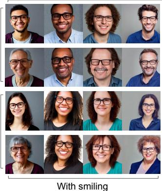

:LWKH\HJODVVHV  
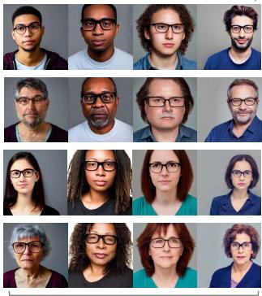  
:LWKRXWVPLOLQJ

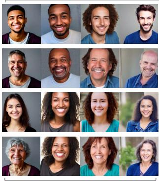  
:LWKRXWH\HJODVVHV  
:LWKVPLOLQJ

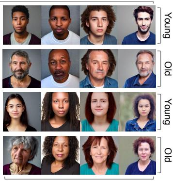

:LWKRXWVPLOLQJ  
Figure 4. Qualitative results of the combination of four binary attributes (the last column in Table 1). The input prompt (T ) is “a headshot ofa person”. By using the learned inclusive tokens (cf. Equation 3), ITI-GEN can inclusively generate images with all attribute combinations. Images across each tuple are sampled using the same random seed. More examples are included in Appendix F.  
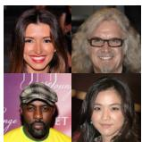  
CelebA

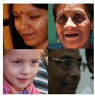  
FairFace

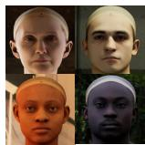  
FAIR benchmark

  
LHQ  
Figure 5. Examples of reference images. CelebA [43] and Fair-Face [34] are real-face datasets with different resolutions and focuses. FAIR benchmark [20] is a synthetic dataset used for skin tone estimation. Landscape (LHQ) [68] contains images from natural scenes. ITI-GEN can leverage various image sources to benefit inclusive text-to-image generation for various attributes.

we use the ground-truth albedos to classify each facial crop into one of six skin tone levels [21] and use FAIR for inclusiveness on skin tone type. (3) FairFace [34]7 contains face images with annotations for 2 perceived gender and 9 perceived age categories. (4) Landscapes HQ (LHQ) [68] provides unlabeled natural scene images. With the annotation tool from [72], each image can be labeled with 6 quality (e.g., colorfulness, brightness) and 6 abstraction (e.g., scary, aesthetic) attributes. Figure 5 shows example images.

Experimental Protocols. We only require that a reference image set captures a marginal distribution for each attribute (cf. Section 3.2). Note that, while images from CelebA and FairFace are annotated with multiple attributes, we use only the attribute label for each target category but not others. We randomly select 25 reference images per category as our default setting (and ablate it in Section 4.3). For attribute settings, we consider single binary attribute, multicategory attributes, and multiple attributes in the domains of human faces and scenes. We study both in-domain and train-once-for-all generations (cf. Section 3.3) and further provide qualitative and quantitative analyses for each setup.

Quantitative Metrics. We use two metrics to quantify distribution diversity and image quality. (1) Distribution Discrepancy (DKL). Following [12, 14], we use the CLIP model to predict the attributes in the images. For attributes that CLIP might be erroneous, we leverage pre-trained classifiers [34] combined with human evaluations. Specifically, for skin tone, which is extreme difficult to obtain an accurate scale [1, 2, 28], we adopt the most commonly used Fitzpatrick skin type [10] combined with off-the-shelf models [20] for evaluation. (2) FID. We report the FID score [26, 52] (FFHQ [35]) to measure the image quality. Please see Appendix D for more details.

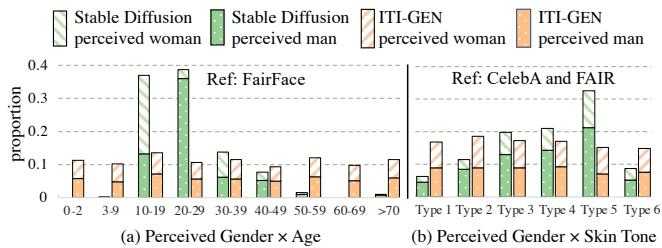  
Figure 6. Multi-category distribution with “a headshot ofa person”. For a reliable evaluation, the results of (a) are evaluated using classifiers in [34], and (b) are evaluated using existing models [10, 20]. The generated images from ITI-GEN are more uniformly distributed across different sub-groups than the baseline Stable Diffusion. See Figure 7 for qualitative results.

Baselines. We compare ITI-GEN to the following methods. (1) Stable Diffusion (SD) [63] without any modification. (2) Ethical Intervention (EI) [5] that edits the prompt by adding attribute-related interventions. (3) Hard Prompt Searching (HPS) [18] that directly expresses the desired attribute category in the prompt. (4) Prompts Debiasing (PD) [14] that calibrates the bias in the text embedding by using the attribute category names. (5) Custom Diffusion (CD) [39] that fine-tunes the text-to-image model with reference images based on Textual Inversion [24, 64].

Implementation Details. We use Stable Diffusion [63] (sdv1-4) as the base model for all methods and show compatibility with ControlNet [81] and InstructPix2Pix [7]. ITI-GEN is model agnostic as long as they take token embeddings as the inputs. We set λ = 0.8 in $\mathcal { L } _ { \mathrm { s e m } }$ across all experiments and show that λ can be robustly selected according to the prior knowledge (see Section 4.3). All the inclusive tokens are initiated as zero vectors8. We set the length of the inclusive tokens to 3 in all experiments. There is no additional hyper-parameter in ourframework. The total number of the parameters for the inclusive tokens that need to be optimized is $\textstyle \sum _ { m = 1 } ^ { M } K _ { m } \times 3 \times 7 6 8$ , where M is the number of attributes, $K _ { m }$ is the category number for attribute m, and 768 is the dimension of the embedding (e in Equation 3). We train the models with 30 epochs on a batch size of 16 and a learning rate of 0.01. During training, we leverage image augmentations used in the CLIP image encoder.

## 4.2. Main Results

Single Binary Attribute. To demonstrate the capability of ITI-GEN to sample images with a variety of face attributes, we construct 40 distinct reference image sets based on attributes from CelebA [43]. Each represents a specific binary attribute and contains an equal number of images (50%) for the positive and negative categories9. Table 1(a) shows a comparison to state-of-the-art methods. We evaluate 5 text prompts $- ^ { * } a$ headshot of a {person, professor, doctor, worker, firefighter}” — and sample 200 images per prompt for each attribute, resulting in 40K generated images. We highlight the averaged results across 5 prompts of 6 attributes. We provide complete results in Appendix F.2. ITI-GEN achieves near-perfect performance on balancing each binary attribute, justifying our motivation: using separate inclusive tokens is beneficial in generating images that are uniformly distributed across attribute categories.

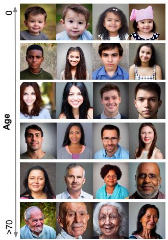

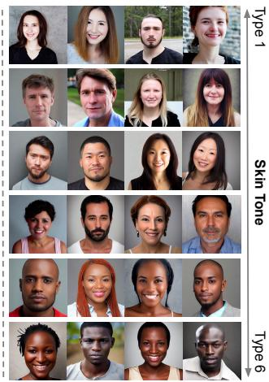  
Figure 7. Results of ITI-GEN on multi-category attributes for Gender×Age (Figure 6(a)) and Gender×Skin Tone (Figure 6(b)). Examples are randomly picked with “a headshot ofa person”.

Multiple Attributes. Given multiple reference image sets (each captures the marginal distribution for an attribute), can ITI-GEN generate diverse images across any category combination of the attributes? We provide an affirmative answer and present results in Table 1(b) and Figure 4. As we observe, ITI-GEN produces diverse and high-quality images with significantly lower distribution discrepancies compared to baseline methods. We attribute this to the aggregation operation of inclusive tokens (Equation 3), allowing ITI-GEN to disentangle the learning of different inclusive tokens with images in marginal distributions.

Multi-Category Attributes. We further investigate multicategory attributes including perceived age and skin tone. Specifically, we consider two challenging settings: (1) Perceived Gender × Age (Figure 6(a)), and (2) Perceived Gender × Skin Tone (Figure 6(b)). ITI-GEN achieves inclusiveness across all setups, especially on extremely underrepresented categories for age (< 10 and > 50 years old in Figure 6(a)). More surprisingly (Figure 6(b)), ITI-GEN can leverage synthetic images (from FAIR) and jointly learn from different data sources (CelebA for gender and FAIR for skin tone), demonstrating great potential for bootstrapping inclusive data generation with graphics engines.

'XOO  
&RORUIXO  
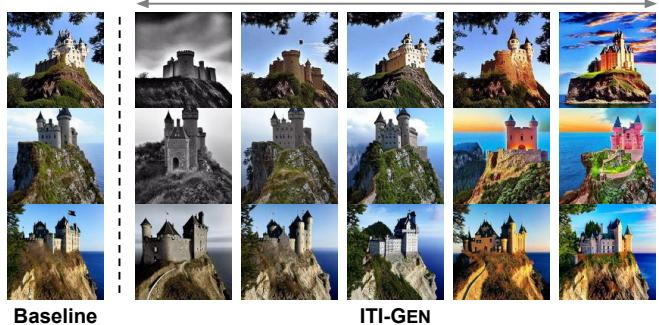

Figure 8. ITI-GEN with perception attributes on scene images. The tokens of “colorfulness” are trained with “a photo ofa natural scene” and applied to “a castle on the $c l i f f ^ { \dagger }$ in this example (trainonce-for-all in Section 3.3). ITI-GEN (right) enables the baseline Stable Diffusion (left) to generate images with different levels of colorfulness. Same seed for each row. Better viewed in color. See Appendix F.5 for results of other attributes, e.g., scary, brightness.  
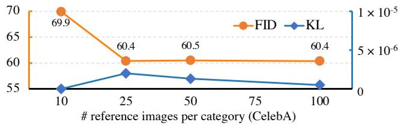  
Figure 9. Ablation on the quantity of reference images. More reference images (> 10) help possibly due to more diversity and less noise. ITI-GEN is robust in the low data regime (Section 3.3).

Other Domains. Besides human faces, we apply ITI-GEN to another domain: scene images. We claim that the inclusive text-to-image generation accounts for attributes from not only humans but also scenes, objects, or even environmental factors. Specifically, we use images from LHQ [68] as guidance to learn inclusive tokens and generate images with diverse subjective perception attributes. As illustrated in Figure 8, ITI-GEN can enrich the generated images to multiple levels of colorfulness10, justifying the generalizability of our method to the attributes in different domains.

## 4.3. Ablations and Applications

Reference Images. Figure 9 illustrates the impact of the quantity of reference images per attribute category, telling that ITI-GEN can produce high-quality images using very few reference data without sacrificing inclusiveness (KL). In addition, as indicated in Table 2, ITI-GEN consistently generates realistic images regardless of reference sources (see examples in Figure 4 and Figure 7). More interestingly, we found that using synthetic images (i.e., FAIR [20]) is slightly better than real data [43, 34]. We hypothesize that the background noise in real images degrades the quality.

Table 2. Ablation on reference image sources and $\mathcal { L } _ { \mathrm { s e m } }$ . ITI-GEN produces lower FID than the baseline Stable Diffusion. Semantic consistency loss $\mathcal { L } _ { \mathrm { s e m } }$ plays a key role in quality control.
<table><tr><td>Method</td><td>Source</td><td> $\mathcal { L } _ { \mathbf { s e m } }$ </td><td>FID↓</td></tr><tr><td>Baseline [63]</td><td>一</td><td>一</td><td>67.40</td></tr><tr><td rowspan="4">ITI-GEN</td><td>CelebA [43]</td><td>√ X</td><td>60.38 (+17.40)77.78</td></tr><tr><td>FairFace [34]</td><td>√ X</td><td>55.10 (+9.01) 64.11</td></tr><tr><td>FAIR [20]</td><td>√</td><td>51.83</td></tr><tr><td></td><td>X</td><td>(+10.86) 62.69</td></tr></table>

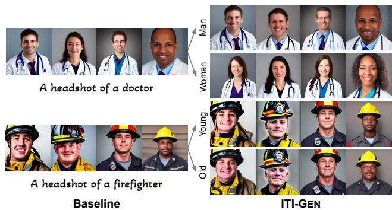  
Figure 10. Train-once-for-all generalization. Inclusive tokens of ITI-GEN trained with a neutral prompt (“a headshot of a person”) can be applied to out-of-domain prompts in these two examples to alleviate stereotypes. See Appendix F.6 for more results.

Semantic Consistency Loss $\mathcal { L } _ { \mathrm { s e m } } .$ Again in Table 2, we compare ITI-GEN with and without $\mathcal { L } _ { \mathrm { { s e m } } } .$ . With the help of the semantic constraint (Figure 3), we regularize the learned embeddings not too far from the original prompt. We show evidence to verify this insight: the averaged CLIP similarity scores of text features between the hard prompts of 40 attributes in CelebA and the original prompt is 0.8 (the λ we used), suggesting that the hyper-parameter can be robustly chosen based on prior linguistic knowledge.

Train-once-for-all Generalization. As shown in Figure 8, inclusive tokens can be applied to user-specified prompts in a plug-and-play manner (Section 3.2). In Figure 10, we provide more examples of professional prompts to demonstrate the ability of train-once-for-all generation.

Compatibility with ControlNet [81]. ITI-GEN achieves inclusiveness by learning attribute-specific prompts without modifying the original text-to-image model, potentially benefiting various downstream vision-language tasks. In Figure 11, we demonstrate its compatibility with Control-Net [81], a state-of-the-art model capable of conditioning on a variety of inputs beyond text. Interestingly, we observe an intriguing feature where the newly introduced tokens may implicitly entangle other biases or contrasts inherent in the reference image sets, such as clothing style. Nevertheless, we emphasize that disentanglement of attributes is not the primary concern of this study. ITI-GEN achieves competitive results in distributional control for the intended attributes (e.g., skin tone in Figure 11) — aggregating tokens learned from marginal distributions implicitly disentangles the known attributes of interest.

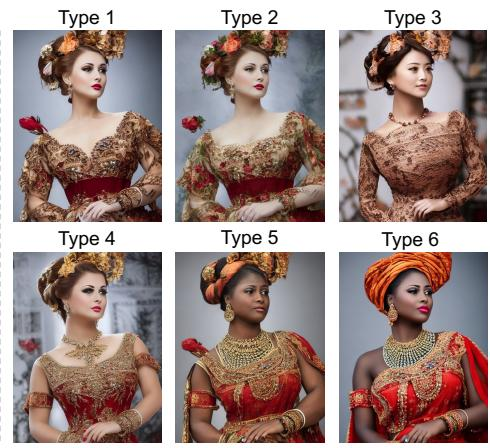  
Figure 11. Compatibility with models using additional conditions, e.g., human pose (left). ITI-GEN promotes inclusiveness of ControlNet [81] by using the inclusive tokens of six skin tone types (right). The tokens are trained with “a headshot ofa person” guided by images from FAIR dataset [20], and applied here in a train-once-for-all manner (Section 3.3). See Appendix F.7 for additional results on versatile conditions, e.g., depth, segmentation.

Compatibility with InstructPix2Pix (IP2P) [7]. Note that, achieving fully unsupervised disentanglement is a challenging task [44]. Previous attempts in image generation often resort to additional supervision, either through the use of reference data [13], classifiers learned from a joint distribution [70], or even more robust controls such as instructionbased image editing [7]. Here, we show that ITI-GEN can potentially disentangle the target attribute by incorporating InstructPix2Pix [7] — to improve the inclusiveness of IP2P on the target attribute, while ensuring minimal changes to other features such as clothing and background. Results are shown in Figure 12, telling that ITI-GEN can be an effective method to condition diffusion on contrastive image sets, e.g., images taken by different cameras, art by unknown artists, and maybe even different identities of people.

## 5. Conclusion and Discussion

We present a new method for inclusive text-to-image generation. Our main contribution lies in a new direction: leveraging readily available reference images to improve the inclusiveness oftext-to-image generation. This problem is timely and challenging [6, 5, 14, 22, 12]. Our key insight is learning separate token embeddings to represent different attributes of interest via image guidance. The proposed ITI-GEN method is simple, compact, generalizable, and effective on various applications. Specifically, ITI-GEN has several advantages: (1) scalable to multiple attributes and different domains using relatively small numbers of images; (2) can be used in a plug-and-play manner to outof-distribution, relatively complex prompts; (3) efficient in both training and inference; (4) compatible with the text-toimage generative models that support additional conditions or instructions. We conduct extensive experiments to verify the effectiveness of the proposed method on multiple domains, offering insights into various modeling choices and mechanisms of ITI-GEN. We incorporate a broad spectrum of attributes in both human faces and scenes. We hope that our results and insights can encourage more future works on exploring inclusive data generation.

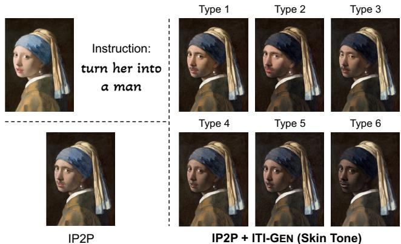  
Figure 12. Compatibility with instruction-based image editing methods. Given an image and a written instruction (top-left), InstructPix2Pix (IP2P) [7] follows the instruction to edit the image (bottom-left). ITI-GEN (right) enables inclusive instruction-based image editing. Similar to Figure 11, the inclusive tokens used in this example are trained in a train-once-for-all manner.

Limitations. ITI-GEN can handle a wide range of general attributes, such as perceived gender and skin tone, and excels in cases where “Hard Prompt” struggles. However, there remain several limitations. First, ITI-GEN does not always provide optimal results for very subtle facial attributes (Appendix F.2) or for the combinations of highly entangled attributes (Appendix F.3). Second, ITI-GEN still requires dozens of reference images for each category as guidance. It is possible that the reference images may introduce biases or inaccuracies. One mitigation strategy is to integrate ITI-GEN with models that offer robust controls [7], such as the one highlighted in Figure 12.

Acknowledgments. We thank Oliver Wang, Jianjin Xu, and Or Patashnik for their feedback on the drafts of this paper.

## References

[1] Gender shades. http://gendershades.org/. 6

[2] Google skin tone research. https://skintone. google/. 6

[3] Sandhini Agarwal, Gretchen Krueger, Jack Clark, Alec Radford, Jong Wook Kim, and Miles Brundage. Evaluating CLIP: towards characterization of broader capabilities and downstream implications. preprint arXiv:2108.02818, 2021. 2

[4] Jerone TA Andrews, Dora Zhao, William Thong, Apostolos Modas, Orestis Papakyriakopoulos, Shruti Nagpal, and Alice Xiang. Ethical considerations for collecting human-centric image datasets. arXiv preprint arXiv:2302.03629, 2023. 6

[5] Hritik Bansal, Da Yin, Masoud Monajatipoor, and Kai-Wei Chang. How well can text-to-image generative models understand ethical natural language interventions? In EMNLP, 2022. 1, 2, 4, 6, 7, 9

[6] Federico Bianchi, Pratyusha Kalluri, Esin Durmus, Faisal Ladhak, Myra Cheng, Debora Nozza, Tatsunori Hashimoto, Dan Jurafsky, James Zou, and Aylin Caliskan. Easily accessible text-to-image generation amplifies demographic stereotypes at large scale. In FAccT, 2023. 1, 9

[7] Tim Brooks, Aleksander Holynski, and Alexei A Efros. Instructpix2pix: Learning to follow image editing instructions. In CVPR, 2023. 2, 5, 7, 9

[8] Simone Browne. Dark matters: On the surveillance of blackness. Duke University Press, 2015. 6

[9] Huiwen Chang, Han Zhang, Jarred Barber, AJ Maschinot, Jose Lezama, Lu Jiang, Ming-Hsuan Yang, Kevin Murphy, William T Freeman, Michael Rubinstein, et al. Muse: Text-to-image generation via masked generative transformers. preprint arXiv:2301.00704, 2023. 2

[10] Alain Chardon, Isabelle Cretois, and Colette Hourseau. Skin colour typology and suntanning pathways. International Journal ofCosmetic Science, 13(4):191–208, 1991. 6, 7

[11] Xinlei Chen, Hao Fang, Tsung-Yi Lin, Ramakrishna Vedantam, Saurabh Gupta, Piotr Dollar, and C Lawrence Zitnick.´ Microsoft coco captions: Data collection and evaluation server. preprint arXiv:1504.00325, 2015. 2

[12] Jaemin Cho, Abhay Zala, and Mohit Bansal. Dall-eval: Probing the reasoning skills and social biases of text-toimage generative transformers. preprint arXiv:2202.04053, 2022. 1, 2, 6, 9

[13] Kristy Choi, Aditya Grover, Trisha Singh, Rui Shu, and Stefano Ermon. Fair generative modeling via weak supervision. In ICML, 2020. 2, 9

[14] Ching-Yao Chuang, Varun Jampani, Yuanzhen Li, Antonio Torralba, and Stefanie Jegelka. Debiasing vision-language models via biased prompts. preprint arXiv:2302.00070, 2023. 2, 6, 7, 9

[15] Kate Crawford. The atlas ofAI: Power, politics, and the planetary costs of artificial intelligence. Yale University Press, 2021. 6

[16] Florinel-Alin Croitoru, Vlad Hondru, Radu Tudor Ionescu, and Mubarak Shah. Diffusion models in vision: A survey. preprint arXiv:2209.04747, 2022. 2

[17] Prafulla Dhariwal and Alexander Nichol. Diffusion models beat gans on image synthesis. In NeurIPS, 2021. 2

[18] Ming Ding, Zhuoyi Yang, Wenyi Hong, Wendi Zheng, Chang Zhou, Da Yin, Junyang Lin, Xu Zou, Zhou Shao, Hongxia Yang, et al. Cogview: Mastering text-to-image generation via transformers. In NeurIPS, 2021. 1, 2, 4, 6, 7

[19] Ming Ding, Wendi Zheng, Wenyi Hong, and Jie Tang. Cogview2: Faster and better text-to-image generation via hierarchical transformers. preprint arXiv:2204.14217, 2022. 2

[20] Haiwen Feng, Timo Bolkart, Joachim Tesch, Michael J. Black, and Victoria Abrevaya. Towards racially unbiased skin tone estimation via scene disambiguation. In ECCV, 2022. 2, 4, 5, 6, 7, 8, 9

[21] Thomas B Fitzpatrick. The validity and practicality of sunreactive skin types i through vi. Archives of Dermatology, 124(6):869–871, 1988. 6

[22] Felix Friedrich, Patrick Schramowski, Manuel Brack, Lukas Struppek, Dominik Hintersdorf, Sasha Luccioni, and Kristian Kersting. Fair diffusion: Instructing textto-image generation models on fairness. arXiv preprint arXiv:2302.10893, 2023. 2, 9

[23] Oran Gafni, Adam Polyak, Oron Ashual, Shelly Sheynin, Devi Parikh, and Yaniv Taigman. Make-a-scene: Scenebased text-to-image generation with human priors. In ECCV, 2022. 2

[24] Rinon Gal, Yuval Alaluf, Yuval Atzmon, Or Patashnik, Amit H Bermano, Gal Chechik, and Daniel Cohen-Or. An image is worth one word: Personalizing text-to-image generation using textual inversion. preprint arXiv:2208.01618, 2022. 2, 5, 7

[25] Rinon Gal, Or Patashnik, Haggai Maron, Amit H Bermano, Gal Chechik, and Daniel Cohen-Or. Stylegan-nada: Clipguided domain adaptation of image generators. ACM Transactions on Graphics, 41(4):1–13, 2022. 4, 5, 8

[26] Martin Heusel, Hubert Ramsauer, Thomas Unterthiner, Bernhard Nessler, and Sepp Hochreiter. Gans trained by a two time-scale update rule converge to a local nash equilibrium. In NeurIPS, 2017. 7

[27] Jonathan Ho, Ajay Jain, and Pieter Abbeel. Denoising diffusion probabilistic models. In NeurIPS, 2020. 1

[28] John J Howard, Yevgeniy B Sirotin, Jerry L Tipton, and Arun R Vemury. Reliability and validity of image-based and self-reported skin phenotype metrics. IEEE Transactions on Biometrics, Behavior, and Identity Science, 3(4):550–560, 2021. 6

[29] Ben Hutchinson, Jason Baldridge, and Vinodkumar Prabhakaran. Underspecification in scene description-todepiction tasks. In AACL, 2022. 2

[30] Niharika Jain, Alberto Olmo, Sailik Sengupta, Lydia Manikonda, and Subbarao Kambhampati. Imperfect imaganation: Implications of gans exacerbating biases on facial data augmentation and snapchat selfie lenses. preprint arXiv:2001.09528, 2020. 2

[31] Ajil Jalal, Sushrut Karmalkar, Jessica Hoffmann, Alex Dimakis, and Eric Price. Fairness for image generation with uncertain sensitive attributes. In ICML, 2021. 2

[32] Menglin Jia, Luming Tang, Bor-Chun Chen, Claire Cardie, Serge Belongie, Bharath Hariharan, and Ser-Nam Lim. Visual prompt tuning. In ECCV, 2022. 2, 3

[33] Cemre Efe Karakas, Alara Dirik, Eylul Yalc¸ınkaya, and¨ Pinar Yanardag. Fairstyle: Debiasing stylegan2 with style channel manipulations. In ECCV, 2022. 2

[34] Kimmo Karkk¨ ainen and Jungseock Joo. Fairface: Face at-¨ tribute dataset for balanced race, gender, and age. In WACV, 2021. 2, 6, 7, 8

[35] Tero Karras, Samuli Laine, and Timo Aila. A style-based generator architecture for generative adversarial networks. In CVPR, 2019. 1, 2, 7

[36] Patrik Joslin Kenfack, Kamil Sabbagh, Ad´ın Ram´ırez Rivera, and Adil Khan. Repfair-gan: Mitigating representation bias in gans using gradient clipping. preprint arXiv:2207.10653, 2022. 2

[37] Gwanghyun Kim, Taesung Kwon, and Jong Chul Ye. Diffusionclip: Text-guided diffusion models for robust image manipulation. In CVPR, 2022. 5

[38] Diederik Kingma, Tim Salimans, Ben Poole, and Jonathan Ho. Variational diffusion models. In NeurIPS, 2021. 2

[39] Nupur Kumari, Bingliang Zhang, Richard Zhang, Eli Shechtman, and Jun-Yan Zhu. Multi-concept customization of text-to-image diffusion. preprint arXiv:2212.04488, 2022. 2, 5, 6, 7

[40] Jason Lee, Kyunghyun Cho, and Douwe Kiela. Countering language drift via visual grounding. preprint arXiv:1909.04499, 2019. 5

[41] Brian Lester, Rami Al-Rfou, and Noah Constant. The power of scale for parameter-efficient prompt tuning. In EMNLP, 2021. 2, 3

[42] Weixin Liang, Girmaw Abebe Tadesse, Daniel Ho, L Fei-Fei, Matei Zaharia, Ce Zhang, and James Zou. Advances, challenges and opportunities in creating data for trustworthy ai. Nature Machine Intelligence, 4(8):669–677, 2022. 2

[43] Ziwei Liu, Ping Luo, Xiaogang Wang, and Xiaoou Tang. Deep learning face attributes in the wild. In ICCV, 2015. 2, 5, 6, 7, 8

[44] Francesco Locatello, Stefan Bauer, Mario Lucic, Gunnar Raetsch, Sylvain Gelly, Bernhard Scholkopf, and Olivier¨ Bachem. Challenging common assumptions in the unsupervised learning of disentangled representations. In ICML, 2019. 9

[45] Yuchen Lu, Soumye Singhal, Florian Strub, Aaron Courville, and Olivier Pietquin. Countering language drift with seeded iterated learning. In ICML, 2020. 5

[46] Alexandra Sasha Luccioni, Christopher Akiki, Margaret Mitchell, and Yacine Jernite. Stable bias: Analyzing societal representations in diffusion models. arXiv preprint arXiv:2303.11408, 2023. 1, 2

[47] Vongani H Maluleke, Neerja Thakkar, Tim Brooks, Ethan Weber, Trevor Darrell, Alexei A Efros, Angjoo Kanazawa, and Devin Guillory. Studying bias in gans through the lens of race. In ECCV, 2022. 2

[48] Elman Mansimov, Emilio Parisotto, Jimmy Lei Ba, and Ruslan Salakhutdinov. Generating images from captions with attention. In ICLR, 2016. 2

[49] Tomas Mikolov, Kai Chen, Greg Corrado, and Jeffrey Dean. Efficient estimation of word representations in vector space. In ICLR Workshop, 2013. 3

[50] Ellis P Monk Jr. The unceasing significance of colorism: Skin tone stratification in the united states. Daedalus, 150(2):76–90, 2021. 6

[51] Alex Nichol, Prafulla Dhariwal, Aditya Ramesh, Pranav Shyam, Pamela Mishkin, Bob McGrew, Ilya Sutskever, and Mark Chen. Glide: Towards photorealistic image generation and editing with text-guided diffusion models. preprint arXiv:2112.10741, 2021. 2

[52] Gaurav Parmar, Richard Zhang, and Jun-Yan Zhu. On aliased resizing and surprising subtleties in gan evaluation. In CVPR, 2022. 7

[53] Otavio Parraga, Martin D More, Christian M Oliveira,´ Nathan S Gavenski, Lucas S Kupssinsku, Adilson¨ Medronha, Luis V Moura, Gabriel S Simoes, and Ro-˜ drigo C Barros. Debiasing methods for fairer neural models in vision and language research: A survey. preprint arXiv:2211.05617, 2022. 1

[54] Or Patashnik, Zongze Wu, Eli Shechtman, Daniel Cohen-Or, and Dani Lischinski. Styleclip: Text-driven manipulation of stylegan imagery. In ICCV, 2021. 4

[55] Vitali Petsiuk, Alexander E Siemenn, Saisamrit Surbehera, Zad Chin, Keith Tyser, Gregory Hunter, Arvind Raghavan, Yann Hicke, Bryan A Plummer, Ori Kerret, et al. Human evaluation of text-to-image models on a multi-task benchmark. preprint arXiv:2211.12112, 2022. 1, 2

[56] Alec Radford, Jong Wook Kim, Chris Hallacy, Aditya Ramesh, Gabriel Goh, Sandhini Agarwal, Girish Sastry, Amanda Askell, Pamela Mishkin, Jack Clark, et al. Learning transferable visual models from natural language supervision. In ICML, 2021. 2, 4, 6

[57] Vikram V Ramaswamy, Sunnie SY Kim, and Olga Russakovsky. Fair attribute classification through latent space de-biasing. In CVPR, 2021. 2

[58] Aditya Ramesh, Prafulla Dhariwal, Alex Nichol, Casey Chu, and Mark Chen. Hierarchical text-conditional image generation with clip latents. preprint arXiv:2204.06125, 2022. 1, 2, 4

[59] Aditya Ramesh, Mikhail Pavlov, Gabriel Goh, Scott Gray, Chelsea Voss, Alec Radford, Mark Chen, and Ilya Sutskever. Zero-shot text-to-image generation. In ICML, 2021. 1, 2

[60] Harsh Rangwani, Naman Jaswani, Tejan Karmali, Varun Jampani, and R Venkatesh Babu. Improving gans for longtailed data through group spectral regularization. In ECCV, 2022. 2

[61] Victor Ray. On critical race theory: why it matters & why you should care. Random House, 2022. 6

[62] Scott Reed, Zeynep Akata, Xinchen Yan, Lajanugen Logeswaran, Bernt Schiele, and Honglak Lee. Generative adversarial text to image synthesis. In ICML, 2016. 2

[63] Robin Rombach, Andreas Blattmann, Dominik Lorenz, Patrick Esser, and Bjorn Ommer. High-resolution image syn-¨ thesis with latent diffusion models. In CVPR, 2022. 1, 2, 4, 6, 7, 8

[64] Nataniel Ruiz, Yuanzhen Li, Varun Jampani, Yael Pritch, Michael Rubinstein, and Kfir Aberman. Dreambooth: Fine tuning text-to-image diffusion models for subject-driven generation. In CVPR, 2022. 2, 5, 7

[65] Olga Russakovsky, Jia Deng, Hao Su, Jonathan Krause, Sanjeev Satheesh, Sean Ma, Zhiheng Huang, Andrej Karpathy, Aditya Khosla, Michael Bernstein, et al. Imagenet large scale visual recognition challenge. International Journal of Computer Vision, 115:211–252, 2015. 2

[66] Chitwan Saharia, William Chan, Saurabh Saxena, Lala Li, Jay Whang, Emily Denton, Seyed Kamyar Seyed Ghasemipour, Burcu Karagol Ayan, S Sara Mahdavi, Rapha Gontijo Lopes, et al. Photorealistic text-to-image diffusion models with deep language understanding. preprint arXiv:2205.11487, 2022. 2

[67] Christoph Schuhmann, Romain Beaumont, Richard Vencu, Cade Gordon, Ross Wightman, Mehdi Cherti, Theo Coombes, Aarush Katta, Clayton Mullis, Mitchell Wortsman, et al. Laion-5b: An open large-scale dataset for training next generation image-text models. In NeurIPS, 2022. 1, 2

[68] Ivan Skorokhodov, Grigorii Sotnikov, and Mohamed Elhoseiny. Aligning latent and image spaces to connect the unconnectable. In ICCV, 2021. 2, 6, 8

[69] Jascha Sohl-Dickstein, Eric Weiss, Niru Maheswaranathan, and Surya Ganguli. Deep unsupervised learning using nonequilibrium thermodynamics. In ICML, 2015. 1, 2

[70] Shuhan Tan, Yujun Shen, and Bolei Zhou. Improving the fairness of deep generative models without retraining. preprint arXiv:2012.04842, 2020. 2, 9

[71] Ming Tao, Hao Tang, Fei Wu, Xiao-Yuan Jing, Bing-Kun Bao, and Changsheng Xu. Df-gan: A simple and effective baseline for text-to-image synthesis. In CVPR, 2022. 2

[72] Jianyi Wang, Kelvin CK Chan, and Chen Change Loy. Exploring clip for assessing the look and feel of images. In AAAI, 2023. 6

[73] Mei Wang and Weihong Deng. Mitigating bias in face recognition using skewness-aware reinforcement learning. In CVPR, 2020. 2

[74] Tianlu Wang, Jieyu Zhao, Mark Yatskar, Kai-Wei Chang, and Vicente Ordonez. Balanced datasets are not enough: Estimating and mitigating gender bias in deep image representations. In ICCV, 2019. 2

[75] Zeyu Wang, Klint Qinami, Ioannis Christos Karakozis, Kyle Genova, Prem Nair, Kenji Hata, and Olga Russakovsky. Towards fairness in visual recognition: Effective strategies for bias mitigation. In CVPR, 2020. 2

[76] Chen Henry Wu, Saman Motamed, Shaunak Srivastava, and Fernando De la Torre. Generative visual prompt: Unifying distributional control of pre-trained generative models. In NeurIPS, 2022. 2

[77] Depeng Xu, Shuhan Yuan, Lu Zhang, and Xintao Wu. Fair-GAN: Fairness-aware generative adversarial networks. In ICBD, 2018. 2

[78] Ling Yang, Zhilong Zhang, Yang Song, Shenda Hong, Runsheng Xu, Yue Zhao, Yingxia Shao, Wentao Zhang, Bin Cui, and Ming-Hsuan Yang. Diffusion models: A comprehensive survey of methods and applications. preprint arXiv:2209.00796, 2022. 2

[79] Jiahui Yu, Yuanzhong Xu, Jing Yu Koh, Thang Luong, Gunjan Baid, Zirui Wang, Vijay Vasudevan, Alexander Ku, Yinfei Yang, Burcu Karagol Ayan, et al. Scaling autoregressive models for content-rich text-to-image generation. preprint arXiv:2206.10789, 2022. 2

[80] Ning Yu, Ke Li, Peng Zhou, Jitendra Malik, Larry Davis, and Mario Fritz. Inclusive gan: Improving data and minority coverage in generative models. In ECCV, 2020. 2

[81] Lvmin Zhang and Maneesh Agrawala. Adding conditional control to text-to-image diffusion models. preprint arXiv:2302.05543, 2023. 2, 5, 7, 8, 9

[82] Miaoyun Zhao, Yulai Cong, and Lawrence Carin. On leveraging pretrained gans for generation with limited data. In ICML, 2020. 2

[83] Shengjia Zhao, Hongyu Ren, Arianna Yuan, Jiaming Song, Noah Goodman, and Stefano Ermon. Bias and generalization in deep generative models: An empirical study. In NeurIPS, 2018. 2