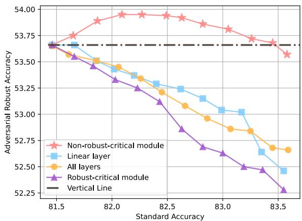
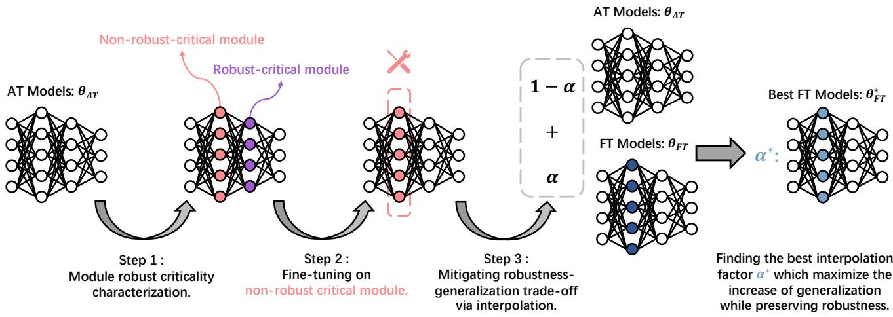
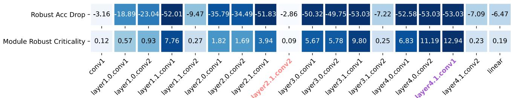

# Improving Generalization of Adversarial Training via Robust Critical Fine-Tuning

Kaijie Zhu1,2, Xixu Hu3, Jindong Wang4, Xing Xie4, Ge Yang1,2 \* 1School of Artifical Intelligence, University of Chinese Academy of Sciences 2Institute of Automation, Chinese Academy of Sciences 3 City University of Hong Kong 4 Microsoft Research zhukaijie2021, ge.yang @ia.ac.cn

## Abstract

Deep neural networks are susceptible to adversarial examples, posing a significant security risk in critical applications. Adversarial Training (AT) is a well-established technique to enhance adversarial robustness, but it often comes at the cost of decreased generalization ability. This paper proposes Robustness Critical Fine-Tuning (RiFT), a novel approach to enhance generalization without compromising adversarial robustness. The core idea of RiFT is to exploit the redundant capacity for robustness by fine-tuning the adversarially trained model on its non-robust-critical module. To do so, we introduce module robust criticality (MRC), a measure that evaluates the significance of a given module to model robustness under worst-case weight perturbations. Using this measure, we identify the module with the lowest MRC value as the non-robust-critical module and fine-tune its weights to obtain fine-tuned weights. Subsequently, we linearly interpolate between the adversarially trained weights andfine-tuned weights to derive the optimal fine-tuned model weights. We demonstrate the efficacy of RiFT on ResNet18, ResNet34, and WideResNet34-10 models trained on CIFAR10, CIFAR100, and Tiny-ImageNet datasets. Our experiments show that RiFT can significantly improve both generalization and out-of-distribution robustness by around 1.5% while maintaining or even slightly enhancing adversarial robustness. Code is available at https://github.com/Immortalise/RiFT.

## 1. Introduction

The pursuit of accurate and trustworthy artificial intelligence systems is a fundamental objective in the deep learning community. Adversarial examples [45, 15], which perturbs input by a small, human imperceptible noise that can cause deep neural networks to make incorrect predictions, pose a significant threat to the security of AI systems. Notable experimental and theoretical progress has been made in defending against such adversarial examples [6, 4, 10, 19, 11, 16, 37]. Among various defense methods [52, 33, 57, 31, 8], adversarial training (AT) [29] has been shown to be one of the most promising approaches [4, 11] to enhance the adversarial robustness. However, compared to standard training, AT severely sacrifices generalization on in-distribution data [42, 46, 58, 36, 32] and is exception ally vulnerable to certain out-of-distribution (OOD) examples [14, 53, 22] such as Contrast, Bright and Fog, resulting in unsatisfactory performance.

  
Figure 1. Interpolation results of fine-tuning on different modules of ResNet18 on CIFAR10 dataset. Dots denote different interpolation points between the final fine-tuned weights of RiFT and the initial adversarially trained weights. All fine-tuning methods improve the generalization ability, but only fine-tuning on the non-robust-critical module (layer2.1.conv2 in Figure 3) can preserve robustness. Additionally, fine-tuning on robust-critical module (layer4.1.conv1) causes the worst trade-off between generalization and robustness. In the initial interpolation stage, fine-tuning on non-robust-critical modules enhances adversarial robustness by around 0.3%.

Prior studies tend to mitigate the trade-off between generalization and adversarial robustness within the adversarial training procedure. For example, some approaches have explored reweighting instances [59], using unlabeled data [36], or redefining the robust loss function [58, 48, 50, 32]. In this paper, we take a different perspective to address such a trade-off by leveraging the redundant capacity for robustness of neural networks after adversarial training. Recent research has demonstrated that deep neural networks can exhibit redundant capacity for generalization due to their complex and opaque nature, where specific network modules can be deleted, permuted [47], or reset to their initial values [55, 9] with only minor degradation in generalization performance. Hence, it is intuitive to ask: Do adversarially trained models have such redundant capacity? If so, how to leverage it to improve the generalization and OOD robustness 1 while maintaining adversarial robustness?

Based on such motivation, we introduce a new concept called Module Robust Criticality (MRC) 2 to investigate the redundant capacity of adversarially trained models for robustness. MRC aims to quantify the maximum increase of robustness loss of a module’s parameters under the constrained weight perturbation. As illustrated in Figure 3, we empirically find that certain modules exhibit redundant characteristics under such perturbations, resulting in negligible drops in adversarial robustness. We refer to the modules with the lowest MRC value as the non-robustcritical modules. These findings further inspire us to propose a novel fine-tuning technique called Robust Critical Fine-Tuning (RiFT), which aims to leverage the redundant capacity of the non-robust-critical module to improve generalization while maintaining adversarial robustness. RiFT consists of three steps: (1) Module robust criticality characterization, which calculates the MRC value for each module and identifies the non-robust-critical module. (2) Nonrobust-critical module fine-tuning, which exploits the redundant capacity of the non-robust-critical module via finetuning its weights with standard examples. (3) Mitigating robustness-generalization trade-off via interpolation, which interpolates between adversarially trained parameters and fine-tuned parameters to find the best weights that maximize the improvement in generalization while preserving adversarial robustness.

Experimental results demonstrate that RiFT significantly improves both the generalization performance and OOD robustness by around 2% while maintaining or even improving the adversarial robustness of the original models. Furthermore, we also incorporate RiFT to other adversarial training regimes such as TRADES [58], MART [48], AT-AWP [50], and SCORE [32], and show that such incorporation leads to further enhancements. More importantly, our experiments reveal several insights. First, we found that fine-tuning on non-robust-critical modules can effectively mitigate the trade-off between adversarial robustness and generalization, showing that these two can both be improved (Section 5.3). As illustrated in Figure 1, adversarial robustness increases alongside the generalization in the initial interpolation procedure, indicating that the features learned by fine-tuning can benefit both generalization and adversarial robustness. This contradicts the previous claim [46] that the features learned by optimal standard and robust classifiers are fundamentally different. Second, the existence of non-robust-critical modules suggests that current adversarial training regimes do not fully utilize the capacity of DNNs (Section 5.2). This motivates future work to design more efficient adversarial training approaches using such capacity. Third, while previous study [25] reported that fine-tuning on pre-train models could distort the learned robust features and result in poor performance on OOD samples, we find that fine-tuning adversarially trained models do NOT lead to worse OOD performance (Section 5.3).

The contribution of this work is summarized as follows:

1. We propose the concept of module robust criticality and verify the existence of redundant capacity for robustness in adversarially trained models. We then propose RiFT to exploit such redundancy to improve the generalization of AT models.

2. Our approach improves both generalization and OOD robustness of AT models. It can also be incorporated with previous AT methods to mitigate the trade-off between generalization and adversarial robustness.

3. The findings of our experiments shed light on the intricate interplay between generalization, adversarial robustness, and OOD robustness. Our work emphasizes the potential of leveraging the redundant capacity in AT models to improve generalization and robustness further, which may motivate more effective adversarial training methods.

## 2. Related Work

Trade-off between adversarial robustness and generalization The existence of such trade-off has been extensively debated in the adversarial learning community [42, 46, 58, 21, 36, 32]. Despite lingering controversies, the prevalent viewpoint is that this trade-off is inherent. Theoretical analyses [46, 36, 21] demonstrated that the trade-off provably exists even in simple cases, e.g., binary classification and linear regression. To address this trade-off, various methods have been proposed during adversarial training, such as instance reweighting [59], robust self-training [36], incorporating unlabeled data [7, 19], and redefining the robust loss function [58, 48, 50, 32]. This paper presents a novel post-processing approach that exploits the excess capacity of the model after adversarial training to address such trade-off. Our RiFT can be used in conjunction with existing adversarial training techniques, providing a practical and effective way to mitigate the trade-off further.

Redundant Fitting Capacity The over-parameterized deep neural networks (DNNs) exhibit striking fitting power even for random labels [55, 3]. Recent studies have shown that not all modules contribute equally to the generalization ability of DNNs [47, 39, 56, 9], indicating the redundant fitting capacity for generalization. Veit et al. [47] found that some blocks can be deleted or permuted without degrading the test performance too much. Rosenfeld and Tsotsos [39] demonstrated that one could achieve comparable performance by training only a small fraction of network parameters. Further, recent studies have identified certain neural network modules, referred to as robust modules [56, 9], rewinding their parameters to initial values results in a negligible decline in generalization. Previous studies have proposed methods to reduce the computational and storage costs of deep neural networks by removing the redundant capacity for generalization while preserving comparable performance, such as compression [17] and distillation [20]. In contrast, our work focuses on the redundant capacity for robustness of adversarially trained models and tries to exlpoit such redundancy.

Fine-tuning Methods Pre-training on large scale datasets has been shown to be a powerful approach for developing high-performing deep learning models [5, 12, 35, 23]. Fine-tuning is a widely adopted approach to enhance the transferability of pre-trained models to downstream tasks and domain shifts. Typically, fine-tuning methods involve fine-tuning the last layer (linear probing) [1, 25] or all layers (fully fine-tuning) [1, 19, 30, 25]. Salman et al. [41] demonstrated that both fully fine-tuning and linear probing of adversarially trained models can improve the transfer performance on downstream tasks. Nevertheless, recent studies [2, 49, 25] have suggested that fine-tuning can degrade pre-trained features and underperformance on out-ofdistribution (OOD) samples. To address this issue, different fine-tuning techniques are proposed such as WiSE-FT [49] and surgical fine-tuning [28] that either leveraged ensemble learning or selective fine-tuning for better OOD performance. Kumar et al. [25] suggested the two-step strategy of linear probing then full fine-tuning (LP-FT) combines the benefits of both fully fine-tuning and linear probing.

## 3. Module Robust Criticality

Improving the generalization of adversarially trained models requires a thorough understanding of DNNs, which, however, proves to be difficult due to the lack of explainability. Recent studies show that specific modules in neural networks, referred to as critical modules [56, 9], signif icantly impact model generalization if their parameters are rewound to initial values. In this work, we propose a metric called Module Robust Criticality (MRC) to evaluate the robustness contribution of each module explicitly.

## 3.1. Preliminaries

We denote a l-layered DNN as $f ( \pmb \theta ) = \phi ( \mathbf { x } ^ { ( l ) } ; \pmb \theta ^ { ( l ) } ) \ \mathrm { ~ c ~ }$ $\dots \circ \phi ( \pmb { x } ^ { ( 1 ) } ; \pmb { \theta } ^ { ( 1 ) } )$ , where $\pmb \theta ^ { ( i ) }$ is the parameter of i-th layer and $\phi ( \cdot )$ denotes the activation function. We use $\pmb { \theta } _ { A T }$ and $\pmb { \theta } _ { F T }$ to denote the weights of the adversarially trained and fine-tuned model, respectively. We use $\mathcal { D } =$ $\left\{ ( \pmb { x } _ { 1 } , y _ { 1 } ) , . . . , ( \pmb { x } _ { n } , y _ { n } ) \right\}$ to denote a dataset and $\mathcal { D } _ { s t d }$ means a standard dataset such as CIFAR10. The cross-entropy loss is denoted by and $\left\| \cdot \right\| _ { p }$ is denoted as the $\ell _ { p }$ norm.

Let $\Delta { \mathbf { } } x \in S$ denote the adversarial perturbation applied to a clean input x, where  represents the allowed range of input perturbations. Given a neural network $f ( \pmb \theta )$ and a dataset $\mathcal { D } ,$ adversarial training aims to minimize the robust loss [29] as:

$$
\begin{array} { c } { \displaystyle \operatorname * { a r g m i n } _ { \theta } \mathcal { R } ( f ( \theta ) , \mathcal { D } ) , \mathrm { ~ w h e r e ~ } } \\ { \mathcal { R } ( f ( \theta ) , \mathcal { D } ) = \displaystyle \sum _ { ( { \boldsymbol x } , { \boldsymbol y } ) \in { \cal D } } \displaystyle \operatorname* { m a x } _ { \Delta { \boldsymbol x } \in { \cal S } } \mathcal { L } ( f ( \theta , { \boldsymbol x } + \Delta { \boldsymbol x } ) , { \boldsymbol y } ) . } \end{array}\tag{1}
$$

Here, $\mathcal { R } ( f ( \pmb { \theta } ) , \mathcal { D } )$ is the robust loss to find the worstcase input perturbation that maximizes the cross-entropy classification error.

## 3.2. Module Robust Criticality

Definition 3.1 (Module Robust Criticality). Given a weight perturbation scaling factor $\epsilon > 0$ and a neural network $f ( \theta )$ the robust criticality of a module i is defined as

$$
\begin{array} { c } { M R C ( f , \pmb { \theta } ^ { ( i ) } , \mathcal { D } , \epsilon ) = \displaystyle \operatorname* { m a x } _ { \Delta \pmb { \theta } \in \mathcal { C } _ { \pmb { \theta } } } \mathcal { R } ( f ( \pmb { \theta } + \Delta \pmb { \theta } ) , \mathcal { D } ) } \\ { - \mathcal { R } ( f ( \pmb { \theta } ) , \mathcal { D } ) , } \end{array}\tag{2}
$$

where $\begin{array} { c c l } { \Delta \pmb { \theta } } & { = } & { \left\{ \mathbf { 0 } , \ldots , \mathbf { 0 } , \Delta \pmb { \theta } ^ { ( i ) } , \mathbf { 0 } , \ldots , \mathbf { 0 } \right\} } \end{array}$ denotes the weight perturbation with respect to the module weights $\pmb \theta ^ { ( i ) }$ $\begin{array} { r } { \mathcal { C } _ { \pmb { \theta } } = \{ \bar { \Delta } \pmb { \theta } | \| \Delta \pmb { \theta } \| _ { p } \leq \epsilon \| \pmb { \theta } ^ { ( \bar { i } ) } \| _ { p } \} , \mathcal { R } ( \cdot ) } \end{array}$ is the robust loss de-fined in Eq. (1).

The MRC value for each module represents how they are critically contributing to model adversarial robustness. The module with the lowest MRC value is considered redundant, as changing its weights has a negligible effect on robustness degradation. We refer to this module as the non-robust-critical module. Intuitively, MRC serves as an upper bound for weight changing of a particular module, as demonstrated in Theorem 3.1. Since we do not know the optimization directions and how they might affect the model robustness to adversarial examples, we measure the extent to which worst-case weight perturbations affect the robustness, providing an upper bound loss for optimizing the weight. Further, the MRC for a module depicts the sharpness of robust loss landscape [50, 43] around the minima $\pmb \theta ^ { ( i ) }$ . If the MRC score is high, it means that the robust loss landscape with respect to $\pmb \theta ^ { ( i ) }$ is sharp, and fine-tuning this module is likely to hurt the adversarial robustness.

Theorem 3.1. The MRC value for a module i serves as an upper bound for the robust loss increase when we optimize the module under constraint $\mathcal { C } _ { \pmb { \theta } } \mathrm { : }$

$$
\mathcal { R } ( f ( \pmb { \theta } ^ { * } ) , \mathcal { D } ) - \mathcal { R } ( f ( \pmb { \theta } ) , \mathcal { D } ) \leq M R C ( f , \pmb { \theta } ^ { ( i ) } , \mathcal { D } , \epsilon ) ,
$$

$$
\mathrm { w h e r e } \ \theta ^ { * } = \operatorname * { a r g m i n } _ { \theta ^ { \prime } , ( \theta ^ { \prime } - \theta ) \in \mathcal { C } _ { \theta } } \sum _ { ( x , y ) \in \mathcal { D } } \mathcal { L } ( f ( \theta ^ { \prime } , x ) , y ) .\tag{3}
$$

Proof. By the definition of MRC, for any weights $( \pmb \theta ^ { \prime } - \pmb \theta ) \in$ ${ \mathcal { C } } _ { \theta } ,$ we have:

$$
\mathcal { R } ( f ( \pmb { \theta } ^ { \prime } ) , \mathcal { D } ) - \mathcal { R } ( f ( \pmb { \theta } ) , \mathcal { D } ) \leq M R C ( f , \pmb { \theta } ^ { ( i ) } , \mathcal { D } , \epsilon ) .\tag{4}
$$

Thus, for the optimized weights:

$$
\pmb { \theta } ^ { * } = \underset { \pmb { \theta } ^ { \prime } , ( \pmb { \theta } ^ { \prime } - \pmb { \theta } ) \in \mathcal { C } _ { \pmb { \theta } } } { \arg \operatorname* { m i n } } \sum _ { ( \pmb { x } , y ) \in \mathcal { D } } \mathcal { L } ( f ( \pmb { \theta } ^ { \prime } , \pmb { x } ) , y ) ,\tag{5}
$$

it satisfies

$$
\mathcal { R } ( f ( \pmb { \theta } ^ { * } ) , \mathcal { D } ) - \mathcal { R } ( f ( \pmb { \theta } ) , \mathcal { D } ) \leq M R C ( f , \pmb { \theta } ^ { ( i ) } , \mathcal { D } , \epsilon ) .\tag{6}
$$

Such that the proof ends.

□

Remark: The definition of MRC is similar in spirit to the work of Zhang et al. [56] and Chatterji et al. [9]. However, MRC differs fundamentally from them in two aspects. First, MRC aims to capture the influence of a module on adversarial robustness, while Zhang et al. [56] and Chatterji et al. [9] focus on studying the impact of a module on generalization. Second, MRC investigates the robustness characteristics of module weights under worst-case weight perturbations, whereas Zhang et al. [56] and Chatterji et al. [9] analyzed the properties of a module by rewinding its weights to their initial values. Similar to [26, 43], we define the weight perturbation constraint $C _ { \theta }$ as a multiple of the $\ell _ { p }$ norm of original parameters, which ensures the scaleinvariant property and allows us to compare the robust criticality of modules across different layers, see Appendix A for a detailed proof.

Theorem 3.1 sets a definitive upper bound on the robust loss escalation during the fine-tuning of specific modules.

It guarantees that fine-tuning non-robust-critical modules won’t degrade model robustness. However, it does not conclusively state whether fine-tuning robust-critical modules will significantly reduce robust accuracy. As per several studies [51, 40, 13], while only a few hessian eigenvalues of certain loss functions are large, most are close to zero. Consequently, the optimization direction during fine-tuning might not necessarily align with the hessian eigenvectors having larger eigenvalues.

## 3.3. Relaxation of MRC

Optimizing in Eq. (2) requires simultaneously finding worst-case weight perturbation $\Delta \theta$ and worst-case input perturbation $\Delta { } x$ , which is time-consuming. Thus, we propose a relaxation version by fixing $\Delta \mathbfit { x }$ at the initial optimizing phase. Concretely, we first calculate the adversarial examples $\Delta \mathbf { x }$ with respect to $\theta _ { A T }$ . By fixing the adversarial examples unchanged during the optimization, we iteratively optimize the $\Delta \theta$ by gradient ascent method to maximize the robust loss to find the optimal $\Delta \pmb { \theta } .$ . We set a weight perturbation constraint and check it after each optimization step. If the constraint is violated, we project the perturbation onto the constraint set. The pseudo-code is described in Algorithm 1. In our experiments, if not specified, we set $\| \cdot \| _ { p } = \| \cdot \| _ { 2 }$ and $\epsilon = 0 . 1$ for $C _ { \theta }$ , the iterative step for optimizing $\Delta \theta$ is 10.

## 4. RiFT: Robust Critical Fine-tuning

In this paper, we propose RiFT, a robust critical finetuning approach that leverages MRC to guide the finetuning of a deep neural network to improve both generalization and robustness. Let $\mathcal { P } _ { a d v } ( x , y )$ and $\mathcal { P } _ { s t d } ( x , y )$ denote the distributions of adversarial and standard inputs, respectively. Then, applying an adversarially trained model on $\mathcal { P } _ { a d v } ( x , y )$ to $\mathcal { P } _ { s t d } ( x , y )$ can be viewed as a distributional shift problem. Thus, it is natural for RiFT to exploit the redundant capacity to fine-tune adversarially trained models on the standard dataset.

Specifically, RiFT consists of three steps as shown in Figure 2. First, we calculate the MRC of each module and choose the module with the lowest MRC score as our nonrobust-critical module. Second, we freeze the parameters of the adversarially trained model except for our chosen nonrobust-critical module. Then we fine-tune the adversarially trained models on corresponding standard dataset $\mathcal { D } _ { s t d }$ Third, we linearly interpolate the weights of the original adversarially trained model and fine-tuned model to identify the optimal interpolation point that maximizes generalization improvement while maintaining robustness.

Step 1: Module robust criticality characterization According to the Algorithm 1, we iteratively calculate the

  
Figure 2. The pipeline of our proposed Robust Critical Fine-Tuning (RiFT).

Algorithm 1 Module Robust Criticality Characterization   
Input: neural network $f ,$ adversarially trained model   
weights $\theta _ { A T } ,$ , desired module $i \ ' s$ weights $\pmb \theta ^ { ( i ) }$ , standard   
dataset $\mathcal { D } _ { s t d } ,$ weight perturbation scaling factor $\epsilon ,$ opti  
mization iteration steps T, learning rate $\gamma .$   
Output: The module robust criticality of module i.   
1: Initialize adversarial dataset: $\mathcal { D } _ { a d v } = \{ \}$   
2: for Batch $\boldsymbol { B _ { k } } \in \mathcal { D } _ { s t d }$ do . Generate adversarial dataset   
3: $B _ { k } ^ { a d v } = \mathrm { P G D } - 1 0 ( \pmb { \theta } _ { A T } , B _ { k } )$   
4: $\mathcal { D } _ { a d v } = \mathcal { D } _ { a d v } \bigcup B _ { k } ^ { a d v }$   
5: end for   
6: Freeze all parameters of $\theta _ { A T }$ except for $\pmb \theta ^ { ( i ) }$   
7: $\pmb { \theta } _ { 1 } = \pmb { \theta } _ { A T }$   
8: for $t = 1 , \dots , T$ do . Iterate T epochs   
9: $\pmb \theta _ { t + 1 } = \pmb \theta _ { t }$   
10: for Batch $B _ { k } ^ { a d v } \in \mathcal { D } _ { a d v }$ do   
11: Calculate Loss: $\mathcal { L } ( f , \pmb { \theta } _ { t } , \pmb { B } _ { k } ^ { a d v } ) )$   
12: $\pmb { \theta } _ { t + 1 } = \pmb { \theta } _ { t + 1 } + \gamma \nabla _ { \pmb { \theta } _ { t } } ( \mathcal { L } ) \quad \triangleright$ Gradient Ascent   
13: end for   
14: $\Delta \pmb { \theta } ^ { ( i ) } = \pmb { \theta } _ { t + 1 } ^ { ( i ) } - \pmb { \theta } _ { A T } ^ { ( i ) }$ . Check perturb constraint   
15: i $\mathbf { f } \parallel \Delta \pmb { \theta } ^ { ( i ) } \parallel _ { 2 } \geq \epsilon \Vert \pmb { \theta } _ { A T } ^ { ( i ) } \Vert _ { 2 }$ then   
16: $\begin{array} { r } { \Delta \pmb { \theta } ^ { ( i ) } = \epsilon \frac { \| \pmb { \theta } _ { A T } ^ { ( i ) } \| _ { 2 } } { \| \Delta \pmb { \theta } ^ { ( i ) } \| _ { 2 } } \Delta \pmb { \theta } ^ { ( i ) } } \end{array}$   
17: $\pmb { \theta } _ { t + 1 } = \pmb { \theta } _ { t } + \Delta \pmb { \theta } ^ { ( i ) }$   
18: break   
19: end if   
20: end for   
21: $M R C ( \pmb { \theta } ^ { ( i ) } ) = \mathcal { L } ( f , \pmb { \theta } _ { T } , \mathcal { D } _ { a d v } ) - \mathcal { L } ( f , \pmb { \theta } _ { A T } , \mathcal { D } _ { a d v } )$   
22: Return $M R C ( \pmb \theta ^ { ( i ) } )$

MRC value for each module $\pmb { \theta } ^ { ( i ) } \in \pmb { \theta } _ { A T }$ , then we choose the module with the lowest MRC value, denoted as $\tilde { \theta } { : }$

$$
\tilde { \pmb \theta } = \pmb \theta ^ { ( i ) } \mathrm { ~ w h e r e ~ } i = \arg \operatorname* { m i n } _ { i } M R C ( \ b f , \pmb \theta ^ { ( i ) } , \mathcal { D } , \epsilon ) .\tag{7}
$$

Step 2: Fine-tuning on non-robust-critical modules Next, we freeze the rest of the parameters and fine-tune on desired parameters ✓˜. We solve the following optimization problem by SGD with momentum [44]

$$
\underset { \pmb { \tilde { \theta } } } { \arg \operatorname* { m i n } } \sum _ { ( \pmb { x } , \pmb { y } ) \in \mathcal { D } } \mathcal { L } \big ( f ( \boldsymbol { x } , ( \pmb { \tilde { \theta } } ; \pmb { \theta } \setminus \pmb { \tilde { \theta } } ) ) , \boldsymbol { y } ) + \lambda \| \pmb { \tilde { \theta } } \| _ { 2 } ,\tag{8}
$$

where  is the $\ell _ { 2 }$ weight decay factor.

Step 3: Mitigating robustness-generalization trade-off via interpolation For a interpolation coefficient $\alpha ,$ the interpolated weights is calculated as:

$$
\pmb { \theta } _ { \alpha } = ( 1 - \alpha ) \pmb { \theta } _ { A T } + \alpha \pmb { \theta } _ { F T } ,\tag{9}
$$

where $\pmb { \theta } _ { A T }$ is the initial adversarially trained weights and $\pmb { \theta } _ { F T }$ is the fine-tuned weights obtained by Eq. (8). Since our goal is to improve the generalization while preserving adversarial robustness, thus the best interpolation point is chosen to be the point that most significantly improves the generalization while the corresponding adversarial robustness is no less than the original robustness by 0.1.

Remark: Theorem 3.1 establishes an upper bound on the possible drop in robustness loss that can be achieved through fine-tuning. It is expected that the second step of optimization would enforce the parameters to lie within the boundary $\mathcal { C } _ { \pmb { \theta } }$ in order to satisfy the theorem. However, here we do not employ constrained optimization but find the optimal point by first optimizing without constraints and then interpolating. This is because (1) the constraints are empirically given and may not always provide the optimal range for preserving robustness, and it is possible to fine-tune outside the constraint range and still ensure that there is not much loss of robustness. (2) the interpolation procedure serves as a weight-ensemble, which may benefit both robustness and generalization, as noted in WiSE-FT [49]. The complete algorithm of RiFT is shown in Appendix B.

## 5. Experiments

## 5.1. Experimental Setup

Datasets We use three popular image classification datasets: CIFAR10 [24], CIFAR100 [24], and Tiny-ImageNet [27]. CIFAR10 and CIFAR100 comprise 60,000 32 32 color images in 10 and 100 classes, respectively. Tiny-ImageNet is a subset of ImageNet and contains 200 classes, where each class contains 500 color images with size $6 4 \times 6 4 .$ We use three OOD datasets accordingly to evaluate the OOD robustness: CIFAR10-C, CIFAR100- C, and Tiny-ImageNet-C [19]. These datasets simulate 15 types of common visual corruptions and are grouped into four classes: Noise, Blur, Weather, and Digital.

Evaluation metrics We use the test set accuracy of each standard dataset to represent the generalization ability. For evaluating adversarial robustness, we adopt a common setting of PGD-10 [29] with constraint $\ell _ { \infty } ~ = ~ 8 / 2 5 5$ We run PGD-10 with three times and select the worst robust accuracy as the final metric. The OOD robustness is evaluated by the accuracy of the test set of the corrupted dataset corresponding to the standard dataset. Importantly, our method maintains its efficacy even when attacked by AutoAttack[11].

Training details We use ResNet18 [18], ResNet34 [18], WideResNet34-10 (WRN34-10) [54] as backbones. ResNet18 and ResNet34 are 18-layer and 34-layer ResNet models, respectively. WideResNet34-10 is a 34-layer WideResNet model with a widening factor of 10. Similarly, we adopt PGD-10 [29] with constraint $\ell _ { \infty } = 8 / 2 5 5$ for adversarial training. Following standard settings [38, 34], we train models with adversarial examples for 110 epochs. The learning rate starts from 0.1 and decays by a factor of 0.1 at epochs 100 and 105. We select the weights with the highest test robust accuracy as our adversarially trained models.

We fine-tune the adversarially trained models $\theta _ { A T }$ using SGD with momentum [44] for 10 epochs. The initial learning rate is set to 0.001.3 We decay the learning rate by $1 / 1 0$ after fine-tuning for 5 epochs We choose the weights with the highest test accuracy as fine-tuned model weights, denoted as $\pmb { \theta } _ { F T }$ . We then interpolate between initial adversarially trained model weights $\pmb { \theta } _ { A T }$ and $\pmb { \theta } _ { F T }$ , the best interpolation point selected by Step 3 in Section 4 is denoted as $\pmb { \theta } _ { F T } ^ { * }$ . We then compare the generalization, adversarial robustness, and OOD robustness of $\pmb { \theta } _ { F T } ^ { * }$ and $\theta _ { A T }$

We report the average of three different seeds and omit the standard deviations of 3 runs as they are tiny $( < 0 . 2 0 \% )$ , which hardly effect the results. Refer to Appendix C for more training details.

## 5.2. Empirical Analysis of MRC

Before delving into the main results of RiFT, we first empirically analyze our proposed MRC metric in Definition 3.1, which serves as the foundation of our RiFT approach. We present the MRC analysis on ResNet18 [18] on CIFAR-10 in Figure 3, where each column corresponds to the MRC value and its corresponding robust accuracy drop of a specific module.

Our analysis shows that the impact of worst-case weight perturbations on model robustness varies across different modules. Some modules exhibit minimal impact on robustness under perturbation, indicating the presence of redundant capacity for robustness. Conversely, for other modules, the worst-case weight perturbation shows a significant impact, resulting in a substantial decline in robustness. For example, in module layer2.1.conv2, worst-case weight perturbations only result in a meager addition of 0.09 robust loss. However, for layer4.1.conv1, the worst-case weight perturbations affect the model’s robust loss by an additional 12.94, resulting in a substantial decline (53.03%) in robustness accuracy. Such robust-critical and non-robust-critical modules are verified to exist in various network architectures and datasets, as detailed in Appendix C.4. We also observe that as the network capacity decreases (e.g., from WRN34-10 to ResNet18) and the task becomes more challenging (e.g., from CIFAR10 to Tiny-ImageNet), the proportion of non-robust-critical modules increases, as less complex tasks require less capacity, leading to more non-robust-critical modules.

It is worthy noting that the decrease in robust accuracy does not directly correlate with MRC. For instance, both layer4.0.conv2 and layer4.1.conv1 have a robust accuracy drop of 53.05%, yet their MRC values differ. This discrepancy can be attributed to the different probability distributions of misclassified samples across modules, resulting in same accuracy declines but different losses.

## 5.3. Main Results

Table 1 summarizes the main results of our study, from which we have the following findings.

RiFT improves generalization RiFT effectively mitigates the trade-off between generalization and robustness raised by adversarial training. Across different datasets and network architectures, RiFT improves the generalization of adversarially trained models by approximately 2%. This result prompts us to rethink the trade-off, as it may be caused by inefficient adversarial training algorithm rather than the inherent limitation of DNNs. Furthermore, as demonstrated in Figure 1, both adversarial robustness and generalization increase simultaneously in the initial interpolation process, indicating that these two characteristics can be improved together. This trend is observed across different datasets and network architectures; see Appendix C.5 for more illustrations. This finding challenges the notion that the features of optimal standard and optimal robust classifiers are fundamentally different, as previously claimed by Tsipras et al. [46], as fine-tuning procedures can increase both robustness and generalization.

  
Figure 3. Example of module robust criticality (MRC) and its corresponding robust accuracy drop of ResNet18 trained on CIFAR10. Each column represents an individual module. The first row represents the corresponding robust accuracy drop and the second row represents the MRC value of each module. The higher the MRC value is, the more robust-critical the module is. Some modules are not critical to robustness, exhibiting redundant characteristics for contributing to robustness. However, some modules are critical to robustness. For example, the robust acc drop is only 2.86% for layer2.1.conv2 while for layer4.1.conv1 the robust acc drop is up to 53.03%.

Table 1. Results of RiFT on different datasets and backbones. Std means the standard test accuracy for in distribution generalization, OOD denotes the OOD robust accuracy of corresponding corruption dataset (e.g., CIFAR10-C). Adv denotes the adversarial robust accuracy. In each column, we bold the entry with the higher accuracy. RiFT improves both generalization and OOD robustness across architectures and datasets while maintaining adversarial robustness.
<table><tr><td rowspan="2">Architecture</td><td rowspan="2">Method</td><td colspan="3">CIFAR10</td><td colspan="3">CIFAR100</td><td colspan="3">Tiny-ImageNet</td></tr><tr><td>Std</td><td>OOD</td><td>Adv</td><td>Std</td><td>OOD</td><td>Adv</td><td>Std</td><td>OOD</td><td>Adv</td></tr><tr><td rowspan="3">ResNet18</td><td>AT</td><td>81.46</td><td>73.56</td><td>53.63</td><td>57.10</td><td>46.43</td><td>30.15</td><td>49.10</td><td>27.68</td><td>23.28</td></tr><tr><td>AT+RiFT</td><td>83.44</td><td>75.69</td><td>53.65</td><td>58.74</td><td>48.06</td><td>30.17</td><td>50.61</td><td>28.73</td><td>23.34</td></tr><tr><td>∆</td><td>+1.98</td><td>+2.13</td><td>+0.02</td><td>+1.64</td><td>+1.63</td><td>+0.02</td><td>+1.51</td><td>+1.05</td><td>+0.06</td></tr><tr><td rowspan="3">ResNet34</td><td>AT</td><td>84.23</td><td>75.37</td><td>55.31</td><td>58.67</td><td>48.24</td><td>30.50</td><td>50.96</td><td>27.91</td><td>24.27</td></tr><tr><td>AT+RiFT</td><td>85.41</td><td>77.15</td><td>55.34</td><td>60.88</td><td>49.97</td><td>30.58</td><td>52.54</td><td>30.07</td><td>24.37</td></tr><tr><td>∆</td><td>+1.18</td><td>+1.78</td><td>+0.03</td><td>+2.21</td><td>+1.73</td><td>+0.08</td><td>+1.58</td><td>+2.16</td><td>+0.10</td></tr><tr><td rowspan="3">WRN34-10</td><td>AT</td><td>87.41</td><td>78.75</td><td>55.40</td><td>62.35</td><td>50.61</td><td>31.66</td><td>52.78</td><td>31.81</td><td>26.07</td></tr><tr><td>AT+RiFT</td><td>87.89</td><td>79.31</td><td>55.41</td><td>64.56</td><td>52.69</td><td>31.64</td><td>55.31</td><td>33.86</td><td>26.17</td></tr><tr><td>Δ</td><td>+0.48</td><td>+0.56</td><td>+0.01</td><td>+2.21</td><td>+2.08</td><td>-0.02</td><td>+2.53</td><td>+2.05</td><td>+0.10</td></tr><tr><td>Avg</td><td>∆</td><td>+1.21</td><td>+1.49</td><td>+0.02</td><td>+2.02</td><td>+1.81</td><td>+0.02</td><td>+1.87</td><td>+1.75</td><td>+0.08</td></tr></table>

Fine-tuning improves OOD robustness Our study also investigated the out-of-distribution (OOD) robustness of the fine-tuned models and observed an improvement of approximately 2%. This observation is noteworthy because recent work [2, 25, 49] showed that fine-tuning pre-trained models can distort learned features and result in underperformance in OOD samples. Furthermore, Yi et al. [53] demonstrated that adversarial training enhances OOD robustness, but it is unclear whether fine-tuning on adversarially trained models distorts robust features. Our results indicate that fine-tuning adversarially trained models does not distort the robust features learned by adversarial training and instead helps improve OOD robustness. We suggest fine-tuning adversarially trained models may be a promising avenue for further improving OOD robustness.

## 5.4. Incorporate RiFT to Other AT Methods

To further validate the effectiveness of RiFT, we conduct experiments on ResNet18 [18] trained on CIFAR10 and CIFAR100 [24] using four different adversarial training techniques: TRADES [58], MART [48], AWP [50], and SCORE [32], and then apply our RiFT to the resulting models. As shown in Table 2, our approach is compatible with various adversarial training methods and improves generalization and OOD robustness.

Table 2. Results of RiFT + other AT methods.
<table><tr><td rowspan="2">Method</td><td colspan="3">CIFAR10</td><td colspan="3">CIFAR100</td></tr><tr><td>Std</td><td>OOD</td><td>Adv</td><td>Std</td><td>OOD</td><td>Adv</td></tr><tr><td>TRADES</td><td>81.54</td><td>73.42</td><td>53.31</td><td>57.44</td><td>47.23</td><td>30.20</td></tr><tr><td>TRADES+RiFT</td><td>81.87</td><td>74.09</td><td>53.30</td><td>57.78</td><td>47.52</td><td>30.22</td></tr><tr><td> $\Delta$ </td><td>+0.33</td><td>+0.67</td><td>-0.01</td><td>+0.34</td><td>+0.29</td><td>+0.02</td></tr><tr><td>MART</td><td>76.77</td><td>68.62</td><td>56.90</td><td>51.46</td><td>42.07</td><td>31.47</td></tr><tr><td>MART+RiFT</td><td>77.14</td><td>69.41</td><td>56.92</td><td>52.42</td><td>43.35</td><td>31.48</td></tr><tr><td> $\Delta$ </td><td>+0.37</td><td>+0.79</td><td>+0.02</td><td>+0.96</td><td>+1.28</td><td>+0.01</td></tr><tr><td>AWP</td><td>78.40</td><td>70.48</td><td>53.83</td><td>52.85</td><td>43.10</td><td>31.00</td></tr><tr><td>AWP+RiFT</td><td>78.79</td><td>71.12</td><td>53.84</td><td>54.89</td><td>45.08</td><td>31.05</td></tr><tr><td> $\Delta$ </td><td>+ 0.39</td><td>+0.64</td><td>+0.01</td><td>+2.04</td><td>+1.98</td><td>+0.05</td></tr><tr><td>SCORE</td><td>84.20</td><td>75.82</td><td>54.59</td><td>54.83</td><td>45.39</td><td>29.49</td></tr><tr><td>SCORE+RiFT</td><td>85.65</td><td>77.37</td><td>54.62</td><td>57.63</td><td>47.77</td><td>29.50</td></tr><tr><td> $\Delta$ </td><td>+1.45</td><td>+1.55</td><td>+0.03</td><td>+2.80</td><td>+2.38</td><td>+0.01</td></tr></table>

## 5.5. Ablation Study

Fine-tuning on different modules To evaluate the efficacy of fine-tuning the non-robust-critical module, we conducted further experiments by fine-tuning the adversarially trained model on different modules. Specifically, we used four fine-tuning methods: fully fine-tuning, linear probing (fine-tuning on the last layer), fine-tuning on the non-robustcritical module, and fine-tuning on the robust-critical module. The experiment was conducted using ResNet18 on CIFAR-10, and the results are presented in Figure 1 and Table 3. As described in Section 3.2, MRC is an upper bound for weight perturbation, indicating the criticality of a module in terms of model robustness. Fine-tuning on a non-robust-critical module can help preserve adversarial robustness but does not guarantee improvement in generalization. Similarly, fine-tuning on the robust-critical module does not necessarily hurt robustness. However, our experiments observed that all fine-tuning methods improved generalization ability, but only fine-tuning on non-robustcritical module preserved adversarial robustness. Moreover, fine-tuning on the robust-critical module exhibited the worst trade-off between generalization and robustness compared to fine-tuning on all layers.

More non-robust-critical modules, more useful? To investigate whether fine-tuning on more non-critical modules could further improve generalization, we additionally finetune on the top two, top three, and top five non-robustcritical modules. However, Table 3 reveals that generalization and OOD robustness did not surpass the results achieved by fine-tuning a singular non-robust-critical module. Notably, performance deteriorated when fine-tuning multiple non-critical modules compared to fine-tuning all layers. It’s pivotal to note that this does not negate MRC’s applicability to several modules. The MRC for module i is evaluated with other module parameters held constant, making it challenging to discern the impact of worst-case perturbations across multiple modules using the MRC of a single one. We posit that broadening MRC’s definition to encompass multiple modules might address this problem.

Table 3. Results of fine-tuning on different modules.
<table><tr><td>Method</td><td>Std</td><td>OOD</td><td>Adv</td></tr><tr><td>All layers</td><td>83.56</td><td>75.48</td><td>52.66</td></tr><tr><td>Last layer</td><td>83.35</td><td>75.16</td><td>52.75</td></tr><tr><td>Robust-critical</td><td>83.36</td><td>75.42</td><td>52.48</td></tr><tr><td>Non-robust-critical</td><td>83.44</td><td>75.69</td><td>53.65</td></tr></table>

Table 4. Results of fine-tuning on multiple non-robustcritical modules.
<table><tr><td>Method</td><td>Std</td><td>OOD</td><td> $A d \nu$ </td></tr><tr><td>Top 1</td><td>83.44</td><td>75.69</td><td>53.65</td></tr><tr><td>Top 2</td><td>83.41</td><td>75.61</td><td>52.47</td></tr><tr><td>Top 3</td><td>83.59</td><td>75.77</td><td>52.22</td></tr><tr><td>Top 5</td><td>83.70</td><td>75.82</td><td>52.35</td></tr></table>

Ablation on interpolation factor $\alpha ^ { * }$ The value of $\alpha ^ { * }$ is closely related to the fine-tuning learning rate. Specifically, a large learning rate can result in substantial weight updates that may push the fine-tuned weights $\pmb { \theta } _ { F T }$ away from their adversarially trained counterparts $\pmb { \theta } _ { A T }$ . Our empirical results indicate that a fine-tuning learning rate of 0.001 is suitable for most cases and that the corresponding $\alpha ^ { * }$ value generally ranges between 0.6 to 0.9.

Factors related to the generalization gain of RiFT ”Our results unveiled patterns and behaviors that offer insights into the determinants of the generalization gains observed with RiFT. First, the generalization gain of RiFT is a function of both the neural network’s inherent capacity and the inherent difficulty posed by the classification task. Specifically, as the classification task becomes more challenging, the robust criticality of each module increases, which in turn decreases the generalization gain of RiFT. This effect can be mitigated by using a model with a larger capacity. For instance, we observe that the generalization gain of RiFT increases as we switch from ResNet18 to ResNet34 and to WRN34-10 when evaluating on CIFAR100 and Tiny-ImageNet. Further, We observed that the generalization gain of RiFT with WRN34-10 on CIFAR10 is notably lower, at approximately 0.5%, compared to $2 \%$ on other datasets. This might be attributed to the minimal generalization disparity between adversarially trained models and their standard-trained counterparts; specifically, while WRN34-10’s standard test accuracy stands at around 95%, its adversarial counterpart registers at 87%. It is evident that fine-tuning on a single module may not yield significant improvements. Investigating these patterns further could offer strategies for enhancing the robustness and generalization capabilities of deep neural networks.

## 6. Conclusion

In this paper, we aim to exploit the redundant capacity of adversarially trained models. Our proposed RiFT leverages the concept of module robust criticality (MRC) to guide the fine-tuning process, which leads to improved generalization and OOD robustness. The extensive experiments demonstrate the effectiveness of RiFT across various network architectures and datasets. Our findings shed light on the intricate relationship between generalization, adversarial robustness, and OOD robustness. RiFT is a primary exploration of fine-tuning the adversarially trained models. We believe that fine-tuning holds great promise, and we call for more theoretical and empirical analyses to advance our understanding of this important technique.

## Acknowledgements

This work was supported in part by the Natural Science Foundation of China (grants 31971289, 91954201) and the Strategic Priority Research Program of the Chinese Academy of Sciences (grant XDB37040402).

## References

[1] Armen Aghajanyan, Akshat Shrivastava, Anchit Gupta, Naman Goyal, Luke Zettlemoyer, and Sonal Gupta. Better fine-tuning by reducing representational collapse. In International Conference on Learning Representations, 2021. 3

[2] Anders Andreassen, Yasaman Bahri, Behnam Neyshabur, and Rebecca Roelofs. The evolution of out-of-distribution robustness throughout fine-tuning. arXiv preprint arXiv:2106.15831, 2021. 3, 7

[3] Devansh Arpit, Stanislaw Jastrzkebski, Nicolas Ballas, David Krueger, Emmanuel Bengio, Maxinder S Kanwal, Tegan Maharaj, Asja Fischer, Aaron Courville, Yoshua Bengio, et al. A closer look at memorization in deep networks. In International Conference on Machine Learning, pages 233– 242. PMLR, 2017. 3

[4] Anish Athalye, Nicholas Carlini, and David Wagner. Obfuscated gradients give a false sense of security: Circumventing defenses to adversarial examples. In Jennifer Dy and Andreas Krause, editors, Proceedings of the 35th International Conference on Machine Learning, volume 80 of Proceedings ofMachine Learning Research, pages 274–283. PMLR, 2018. 1

[5] Tom Brown, Benjamin Mann, Nick Ryder, Melanie Subbiah, Jared D Kaplan, Prafulla Dhariwal, Arvind Neelakan-

tan, Pranav Shyam, Girish Sastry, Amanda Askell, et al. Language models are few-shot learners. Advances in Neural Information Processing Systems, 33:1877–1901, 2020. 3

[6] N. Carlini and D. Wagner. Towards evaluating the robustness of neural networks. In 2017 IEEE Symposium on Security and Privacy, pages 39–57, Los Alamitos, CA, USA, 2017. IEEE Computer Society. 1

[7] Yair Carmon, Aditi Raghunathan, Ludwig Schmidt, John C Duchi, and Percy S Liang. Unlabeled data improves adversarial robustness. In H. Wallach, H. Larochelle, A. Beygelzimer, F. d'Alche-Buc, E. Fox, and R. Garnett, ed-´ itors, Advances in Neural Information Processing Systems, volume 32, 2019. 3

[8] Alvin Chan, Yi Tay, Yew Soon Ong, and Jie Fu. Jacobian adversarially regularized networks for robustness. In International Conference on Learning Representations, 2020. 1

[9] Niladri Chatterji, Behnam Neyshabur, and Hanie Sedghi. The intriguing role of module criticality in the generalization of deep networks. In International Conference on Learning Representations, 2020. 2, 3, 4

[10] Jeremy Cohen, Elan Rosenfeld, and Zico Kolter. Certified adversarial robustness via randomized smoothing. In Kamalika Chaudhuri and Ruslan Salakhutdinov, editors, Proceedings of the 36th International Conference on Machine Learning, volume 97 of Proceedings of Machine Learning Research, pages 1310–1320. PMLR, 2019. 1

[11] Francesco Croce and Matthias Hein. Reliable evaluation of adversarial robustness with an ensemble of diverse parameter-free attacks. In International Conference on Machine Learning, pages 2206–2216. PMLR, 2020. 1, 6

[12] Alexey Dosovitskiy, Lucas Beyer, Alexander Kolesnikov, Dirk Weissenborn, Xiaohua Zhai, Thomas Unterthiner, Mostafa Dehghani, Matthias Minderer, Georg Heigold, Sylvain Gelly, Jakob Uszkoreit, and Neil Houlsby. An image is worth 16x16 words: Transformers for image recognition at scale. In International Conference on Learning Representations, 2021. 3

[13] Behrooz Ghorbani, Shankar Krishnan, and Ying Xiao. An investigation into neural net optimization via hessian eigenvalue density. In International Conference on Machine Learning, pages 2232–2241. PMLR, 2019. 4

[14] Justin Gilmer, Nicolas Ford, Nicholas Carlini, and Ekin Cubuk. Adversarial examples are a natural consequence of test error in noise. In International Conference on Machine Learning, pages 2280–2289. PMLR, 2019. 2

[15] Ian Goodfellow, Jonathon Shlens, and Christian Szegedy. Explaining and harnessing adversarial examples. In International Conference on Learning Representations, 2015. 1

[16] Sven Gowal, Sylvestre-Alvise Rebuffi, Olivia Wiles, Florian Stimberg, Dan Andrei Calian, and Timothy A Mann. Improving robustness using generated data. In M. Ranzato, A. Beygelzimer, Y. Dauphin, P.S. Liang, and J. Wortman Vaughan, editors, Advances in Neural Information Processing Systems, volume 34, pages 4218–4233, 2021. 1

[17] Song Han, Huizi Mao, and William J Dally. Deep compression: Compressing deep neural networks with pruning, trained quantization and huffman coding. arXiv preprint arXiv:1510.00149, 2015. 3

[18] Kaiming He, Xiangyu Zhang, Shaoqing Ren, and Jian Sun. Deep residual learning for image recognition. In Proceedings ofthe IEEE Conference on Computer Vision and Pattern Recognition, pages 770–778, 2016. 6, 7

[19] Dan Hendrycks, Kimin Lee, and Mantas Mazeika. Using pre-training can improve model robustness and uncertainty. In International Conference on Machine Learning, pages 2712–2721. PMLR, 2019. 1, 3, 6

[20] Geoffrey Hinton, Oriol Vinyals, and Jeff Dean. Distilling the knowledge in a neural network. arXiv preprint arXiv:1503.02531, 2015. 3

[21] Adel Javanmard, Mahdi Soltanolkotabi, and Hamed Hassani. Precise tradeoffs in adversarial training for linear regression. In Jacob Abernethy and Shivani Agarwal, editors, Proceedings of Thirty Third Conference on Learning Theory, volume 125 of Proceedings of Machine Learning Research, pages 2034–2078. PMLR, 2020. 2

[22] Klim Kireev, Maksym Andriushchenko, and Nicolas Flammarion. On the effectiveness of adversarial training against common corruptions. In Uncertainty in Artificial Intelligence, pages 1012–1021. PMLR, 2022. 2

[23] Alexander Kolesnikov, Lucas Beyer, Xiaohua Zhai, Joan Puigcerver, Jessica Yung, Sylvain Gelly, and Neil Houlsby. Big transfer (bit): General visual representation learning. In Computer Vision–ECCV 2020: 16th European Conference, Glasgow, UK, August 23–28, 2020, Proceedings, Part V 16, pages 491–507. Springer, 2020. 3

[24] Alex Krizhevsky, Geoffrey Hinton, et al. Learning multiple layers of features from tiny images. 2009. 6, 7

[25] Ananya Kumar, Aditi Raghunathan, Robbie Matthew Jones, Tengyu Ma, and Percy Liang. Fine-tuning can distort pretrained features and underperform out-of-distribution. In International Conference on Learning Representations, 2022. 2, 3, 7

[26] Jungmin Kwon, Jeongseop Kim, Hyunseo Park, and In Kwon Choi. Asam: Adaptive sharpness-aware minimization for scale-invariant learning of deep neural networks. In Marina Meila and Tong Zhang, editors, Proceedings of the 38th International Conference on Machine Learning, volume 139 of Proceedings of Machine Learning Research, pages 5905–5914. PMLR, 2021. 4

[27] Ya Le and Xuan Yang. Tiny imagenet visual recognition challenge. CS 231N, 7(7):3, 2015. 6

[28] Yoonho Lee, Annie S Chen, Fahim Tajwar, Ananya Kumar, Huaxiu Yao, Percy Liang, and Chelsea Finn. Surgical finetuning improves adaptation to distribution shifts. In The Eleventh International Conference on Learning Representations, 2023. 3

[29] Aleksander Madry, Aleksandar Makelov, Ludwig Schmidt, Dimitris Tsipras, and Adrian Vladu. Towards deep learning models resistant to adversarial attacks. In International Conference on Learning Representations, 2018. 1, 3, 6

[30] John P Miller, Rohan Taori, Aditi Raghunathan, Shiori Sagawa, Pang Wei Koh, Vaishaal Shankar, Percy Liang, Yair Carmon, and Ludwig Schmidt. Accuracy on the line: on the strong correlation between out-of-distribution and in-distribution generalization. In Marina Meila and Tong

Zhang, editors, Proceedings of the 38th International Conference on Machine Learning, volume 139 of Proceedings of Machine Learning Research, pages 7721–7735. PMLR, 2021. 3

[31] Aamir Mustafa, Salman Khan, Munawar Hayat, Roland Goecke, Jianbing Shen, and Ling Shao. Adversarial defense by restricting the hidden space of deep neural networks. In The IEEE International Conference on Computer Vision, 2019. 1

[32] Tianyu Pang, Min Lin, Xiao Yang, Jun Zhu, and Shuicheng Yan. Robustness and accuracy could be reconcilable by (Proper) definition. In Kamalika Chaudhuri, Stefanie Jegelka, Le Song, Csaba Szepesvari, Gang Niu, and Sivan Sabato, editors, Proceedings of the 39th International Conference on Machine Learning, volume 162 of Proceedings of Machine Learning Research, pages 17258–17277. PMLR, 2022. 1, 2, 3, 7

[33] Tianyu Pang, Kun Xu, Yinpeng Dong, Chao Du, Ning Chen, and Jun Zhu. Rethinking softmax cross-entropy loss for adversarial robustness. In International Conference on Learning Representations, 2020. 1

[34] Tianyu Pang, Xiao Yang, Yinpeng Dong, Hang Su, and Jun Zhu. Bag of tricks for adversarial training. In International Conference on Learning Representations, 2021. 6

[35] Alec Radford, Jeffrey Wu, Rewon Child, David Luan, Dario Amodei, Ilya Sutskever, et al. Language models are unsupervised multitask learners. OpenAI blog, 1(8):9, 2019. 3

[36] Aditi Raghunathan, Sang Michael Xie, Fanny Yang, John Duchi, and Percy Liang. Understanding and mitigating the tradeoff between robustness and accuracy. In Hal Daume´ III and Aarti Singh, editors, Proceedings ofthe 37th International Conference on Machine Learning, volume 119 of Proceedings of Machine Learning Research, pages 7909–7919. PMLR, 2020. 1, 2, 3

[37] Sylvestre-Alvise Rebuffi, Sven Gowal, Dan A Calian, Florian Stimberg, Olivia Wiles, and Timothy Mann. Fixing data augmentation to improve adversarial robustness. arXiv preprint arXiv:2103.01946, 2021. 1

[38] Leslie Rice, Eric Wong, and Zico Kolter. Overfitting in adversarially robust deep learning. In Hal Daume III and Aarti ´ Singh, editors, Proceedings of the 37th International Conference on Machine Learning, volume 119 of Proceedings of Machine Learning Research, pages 8093–8104. PMLR, 2020. 6

[39] Amir Rosenfeld and John K Tsotsos. Intriguing properties of randomly weighted networks: Generalizing while learning next to nothing. In 2019 16th Conference on Computer and Robot Vision (CRV), pages 9–16. IEEE, 2019. 3

[40] Levent Sagun, Utku Evci, V Ugur Guney, Yann Dauphin, and Leon Bottou. Empirical analysis of the hessian of over-parametrized neural networks. arXiv preprint arXiv:1706.04454, 2017. 4

[41] Hadi Salman, Andrew Ilyas, Logan Engstrom, Ashish Kapoor, and Aleksander Madry. Do adversarially robust imagenet models transfer better? Advances in Neural Information Processing Systems, 33:3533–3545, 2020. 3

[42] Ludwig Schmidt, Shibani Santurkar, Dimitris Tsipras, Kunal Talwar, and Aleksander Madry. Adversarially robust gener-

alization requires more data. In S. Bengio, H. Wallach, H. Larochelle, K. Grauman, N. Cesa-Bianchi, and R. Garnett, editors, Advances in Neural Information Processing Systems, volume 31, 2018. 1, 2

[43] David Stutz, Matthias Hein, and Bernt Schiele. Relating adversarially robust generalization to flat minima. In Proceedings of the IEEE/CVF International Conference on Computer Vision, pages 7807–7817, 2021. 4

[44] Ilya Sutskever, James Martens, George Dahl, and Geoffrey Hinton. On the importance of initialization and momentum in deep learning. In International Conference on Machine Learning, pages 1139–1147. PMLR, 2013. 5, 6

[45] Christian Szegedy, Wojciech Zaremba, Ilya Sutskever, Joan Bruna, Dumitru Erhan, Ian Goodfellow, and Rob Fergus. Intriguing properties of neural networks. arXiv preprint arXiv:1312.6199, 2013. 1

[46] Dimitris Tsipras, Shibani Santurkar, Logan Engstrom, Alexander Turner, and Aleksander Madry. Robustness may be at odds with accuracy. In International Conference on Learning Representations, 2019. 1, 2, 7

[47] Andreas Veit, Michael J Wilber, and Serge Belongie. Residual networks behave like ensembles of relatively shallow networks. Advances in Neural Information Processing Systems, 29, 2016. 2, 3

[48] Yisen Wang, Difan Zou, Jinfeng Yi, James Bailey, Xingjun Ma, and Quanquan Gu. Improving adversarial robustness requires revisiting misclassified examples. In International Conference on Learning Representations, 2020. 2, 3, 7

[49] Mitchell Wortsman, Gabriel Ilharco, Jong Wook Kim, Mike Li, Simon Kornblith, Rebecca Roelofs, Raphael Gontijo Lopes, Hannaneh Hajishirzi, Ali Farhadi, Hongseok Namkoong, and Ludwig Schmidt. Robust fine-tuning of zero-shot models. In Proceedings of the IEEE/CVF Conference on Computer Vision and Pattern Recognition, pages 7959–7971, 2022. 3, 6, 7

[50] Dongxian Wu, Shu-Tao Xia, and Yisen Wang. Adversarial weight perturbation helps robust generalization. In H. Larochelle, M. Ranzato, R. Hadsell, M.F. Balcan, and H. Lin, editors, Advances in Neural Information Processing Systems, volume 33, pages 2958–2969, 2020. 2, 3, 4, 7

[51] Lei Wu, Zhanxing Zhu, et al. Towards understanding generalization of deep learning: Perspective of loss landscapes. arXiv preprint arXiv:1706.10239, 2017. 4

[52] Cihang Xie, Jianyu Wang, Zhishuai Zhang, Zhou Ren, and Alan Yuille. Mitigating adversarial effects through randomization. In International Conference on Learning Representations, 2018. 1

[53] Mingyang Yi, Lu Hou, Jiacheng Sun, Lifeng Shang, Xin Jiang, Qun Liu, and Zhiming Ma. Improved ood generalization via adversarial training and pretraing. In Marina Meila and Tong Zhang, editors, Proceedings of the 38th International Conference on Machine Learning, volume 139 of Proceedings of Machine Learning Research, pages 11987– 11997. PMLR, 2021. 2, 7

[54] Sergey Zagoruyko and Nikos Komodakis. Wide residual networks. In Edwin R. Hancock Richard C. Wilson and William A. P. Smith, editors, Proceedings of the British Machine Vision Conference, pages 87.1–87.12, 2016. 6

[55] Chiyuan Zhang, Samy Bengio, Moritz Hardt, Benjamin Recht, and Oriol Vinyals. Understanding deep learning requires rethinking generalization. In International Conference on Learning Representations, 2017. 2, 3

[56] Chiyuan Zhang, Samy Bengio, and Yoram Singer. Are all layers created equal? Journal of Machine Learning Research, 23(67):1–28, 2022. 3, 4

[57] Haichao Zhang and Jianyu Wang. Defense against adversarial attacks using feature scattering-based adversarial training. In H. Wallach, H. Larochelle, A. Beygelzimer, F. d'Alche-´ Buc, E. Fox, and R. Garnett, editors, Advances in Neural Information Processing Systems, volume 32, 2019. 1

[58] Hongyang Zhang, Yaodong Yu, Jiantao Jiao, Eric Xing, Laurent El Ghaoui, and Michael Jordan. Theoretically principled trade-off between robustness and accuracy. In Kamalika Chaudhuri and Ruslan Salakhutdinov, editors, Proceedings of the 36th International Conference on Machine Learning, volume 97 of Proceedings of Machine Learning Research, pages 7472–7482. PMLR, 2019. 1, 2, 3, 7

[59] Jingfeng Zhang, Jianing Zhu, Gang Niu, Bo Han, Masashi Sugiyama, and Mohan Kankanhalli. Geometry-aware instance-reweighted adversarial training. In International Conference on Learning Representations, 2021. 2, 3