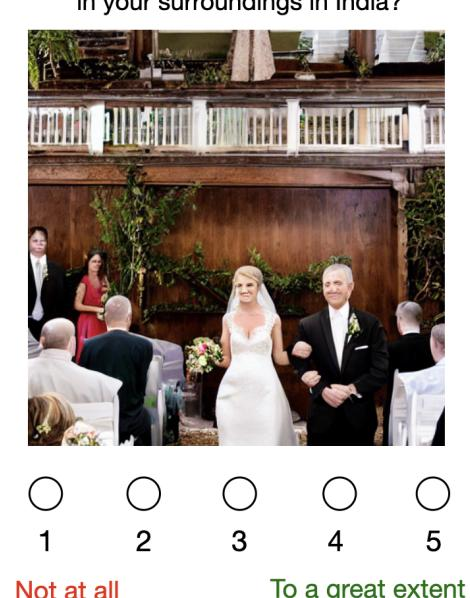
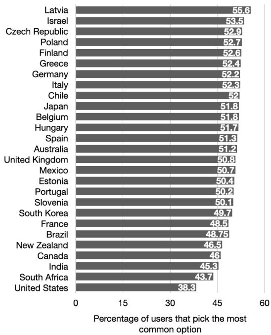
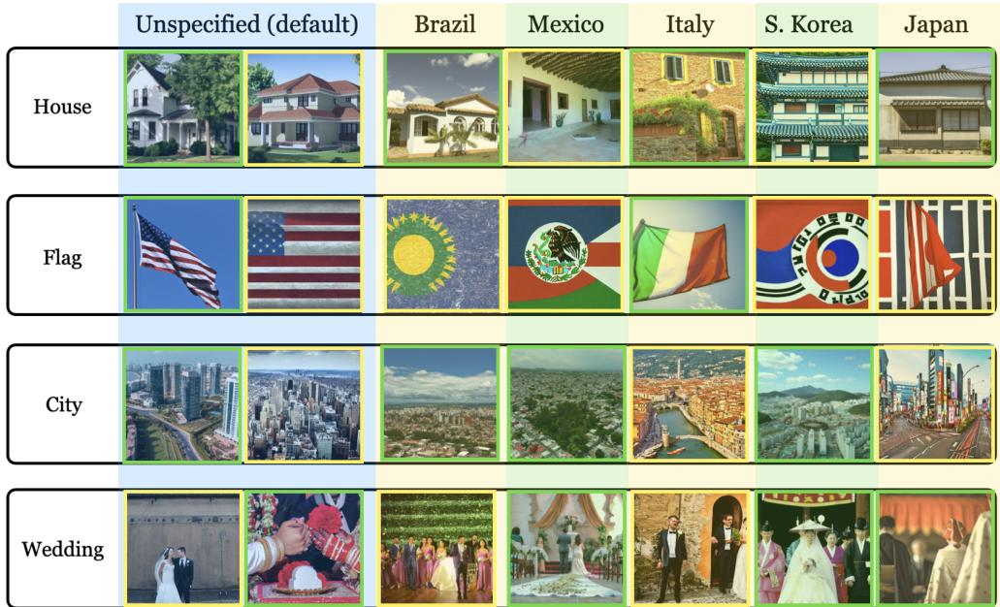
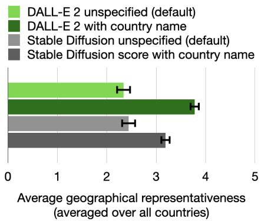
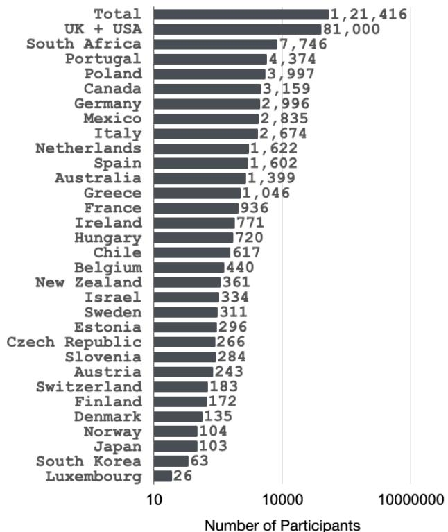

# Inspecting the Geographical Representativeness of Images from Text-to-Image Models

Abhipsa Basu   
abhipsabasu@iisc.ac.in   
Vision and AI Lab   
IISc Bangalore

R. Venkatesh Babu venky@iisc.ac.in Vision and AI Lab IISc Bangalore

Danish Pruthi   
danishp@iisc.ac.in   
FLAIR Lab   
IISc Bangalore

## Abstract

Recent progress in generative models has resulted in models that produce both realistic as well as relevant images for most textual inputs. These models are being used to generate millions of images everyday, and hold the potential to drastically impact areas such as generative art, digital marketing and data augmentation. Given their outsized impact, it is important to ensure that the generated content reflects the artifacts and surroundings across the globe, rather than over-representing certain parts of the world. In this paper, we measure the geographical representativeness of common nouns (e.g., a house) generated through DALL·E 2 and Stable Diffusion models using a crowdsourced study comprising 540 participants across 27 countries. For deliberately underspecified inputs without country names, the generated images most reflect the surroundings of the United States followed by India, and the top generations rarely reflect surroundings from all other countries (average score less than 3 out of5). Specifying the country names in the input increases the representativeness by 1.44 points on average on a 5 − point Likert scale for DALL·E 2 and 0.75for Stable Diffusion, however, the overall scores for many countries still remain low, highlighting the needforfuture models to be more geographically inclusive. Lastly, we examine the feasibility of quantifying the geographical representativeness of generated images without conducting user studies.

## 1. Introduction

Over the last year, the quality of text-to-image generation systems has remarkably improved [32, 61, 35, 37]. The generated images are more realistic and relevant to the textual input. This progress in text-to-image synthesis is partly fueled by the sheer scale of models and datasets used to train them, and partly by the architectural advancements including Transformers [54] and Diffusion models [20]. Given the impressive generation capabilities that these models display, such models have captured the interest of researchers and general public alike. For instance, DALL·E 2 is being used by over 1.5 million users to generate more than 2 million images per day for applications including art creation, image editing, digital marketing and data augmentation [1].

How well does the automatically generated image of this wedding reflect the weddings in your surroundings in India?  
  
Figure 1. An illustrative question from our study, where a participant (in this case, from India) is presented with an image of a common noun (a wedding), generated from the Stable Diffusion model. The participant is asked to rate the generated image on how well it reflects the weddings in their surroundings.

Despite the broad appeal of text-to-image models, there are looming concerns about how these models may exhibit and amplify existing societal biases. These concerns stem from the fact that image generation models are trained on large swaths of image-caption pairs mined from the internet, which is known to be rife with toxic, stereotyping, and biased content. Further, internet access itself is unequally distributed, leading to underrepresentation and exclusion of voices from developing and poor nations [6, 2].

There exists a wide body of work demonstrating biases in large language and vision models [19, 57, 36, 48], and some recent work investigates text-to-image models for biases related to representation of race, gender and occupation [8, 4]. Another important—and often overlooked— aspect of inclusive representation is geographical representation. For such systems to be geographically representative, they should generate images that represent the objects and surroundings of different nations in the world, and refrain from overrepresenting certain nations and contributing to their hegemony. For instance, a typical house in the United States looks different from one in Japan. Often the input descriptions to text-to-image models are underspecified, leaving the models to fill in the missing details. In such underspecified descriptions, there is an increasing risk that models overrepresent certain demographics [21]. In addition to representational harms, biased image generation systems can also cause allocational harms as such systems are used to augment datasets, which run the risk of further propagating existing biases. Further, the experience of using systems that underrepresent certain areas would likely be unpleasant for the residents of those regions.

In this paper, we measure the degree to which the textto-image-generation systems produce images that reflect the artifacts and surroundings of participants from different parts of the world (§2). To answer this question, we conduct a user study involving 540 participants from 27 different countries. We present each user 80 images of common nouns generated from DALL·E 2 [32] and Stable Diffusion (v 1.4) [35] models. Half of the presented images are generated by specifying the country of the participant in the input, and the remaining images are deliberately underspecified to examine the default generations. The users evaluate the presented images based on a 5-point Likert scale indicating how well do the generated images reflect the given entity in their physical surroundings (see Figure 1). We also ask respondents to score generated images on (i) how realistic they look, and (ii) how the realism impacted their scores about geographical representativeness.

Overall, we find that the geographical representativeness of images for many countries is considerably low (§3). In the unspecified case, i.e., without any country name in the input, we find that the generated images most reflect artifacts from the United States (average geographical representativeness score of 3.35 out of 5), followed by India (score of 3.23) and Canada (score of 2.82), and least reflect the nouns from Greece, Japan and New Zealand (with scores less than or around 2.0). Out of 27 countries, 25 countries have a score of less than 3 for both DALL·E 2 and Stable Diffusion models. When we specify the country name in the input prompt, the average score over all the studied countries increases to 3.49 (from 2.39 in the unspecified case). However, these scores suggest that there is room for future text-to-image models to produce more geographically representative content. Between DALL·E 2 and Stable Diffusion, we find DALL·E 2 to be better at generating geographically representative content when we specify country names, but we observe no statistically significant difference in the underspecified case.2 We find that the participants ratings about the realism of the images are correlated with their scores about the geographical representativeness.

Finally, we examine the feasibility of automating the process of quantifying the geographical representativeness of text-to-image generation models through two different ways (§4). First, we consider the similarity of a countryspecific textual prompt and the test image using CLIP, a pretrained text-image alignment model [29]. Second, we evaluate the viability of using user annotations for DALL·E 2 as a means for estimating the geographical representativeness for images generated through Stable Diffusion. We find both these approaches to be inadequate in accurately evaluating the geographical representativeness of the images, emphasizing the need for a user study. We conclude with a discussion on limitations of our work, and suggestions for future research in this area (§5).

## 2. Approach

Geographical Representativeness. We present crowdworkers from different countries with several modelgenerated images of common nouns, and for each image, we ask them to rate on a scale of 1-5 about how well do the generated images reflect their surroundings. Geographical representativeness (GR) of the model m for country c, is then defined as the average rating participants from that country provide to the model generated images of common nouns (N ), using a corresponding set of input prompts (P). Similarly, we define the realism, R(c, m, p), as the average of realism ratings given by participants from country c to images generated by model m using a prompt p.

Research Questions. Using the above notions of geographical representativeness and realism, we ask:

• RQ1: Are the images generated using DALL·E 2 and Stable Diffusion geographically representative? Do they over-represent rich or populous nations?

• RQ2: To what extent does specifying the country name in the input improve the representativeness?

• RQ3: Does the realism of images impact participants ratings about the geographical representativeness?

• RQ4: How feasible is it to automatically assess the geographical representativeness of generated images?

Selected Countries. We reach out to residents of 88 countries using Amazon Mechanical Turk (AMT)3 and Prolific4 crowdsourcing platforms. However, a large majority of crowdworkers belong to only a few countries, and we eventually end up with sufficient responses only from 27 countries. We sample the 88 countries using weighted random sampling where each nation was weighted by its population. The final set of 27 countries (denoted by C) includes: the United States of America, Canada, Mexico, Brazil, Chile, the United Kingdom, Italy, Spain, Greece, Japan, Korea, India, Israel, Australia, South Africa, Belgium, Poland, Portugal, Germany, France, Latvia, Hungary, the Czech Republic, Estonia, New Zealand, Finland, and Slovenia.

Chosen Artifacts. To curate a list of diverse but common artifacts, we extract the most common nouns from the popular Conceptual Captions dataset [43] which contains imagecaption pairs, used for training various vision+language systems [23, 50, 22, 33]. We use a POS-tagger from the NLTK library to extract the nouns, and sort them by decreasing order of their frequency. We choose the 10 most common nouns after manually excluding nouns that are universal in nature (e.g., sky, sun). The final list of 10 common nouns, denoted by N, includes city, beach, house, festival, road, dress, flag, park, wedding, and kitchen.

Input Prompts. As mentioned earlier, we use two types of queries for image synthesis. For half of the queries, we include the country name, and for the remaining half, we do not specify any country name (to assess the default generations). When specifying the country name, we modify the query to “high definition image of a typical [artifact] in [country]”, where we include the word typical to generate the most common form of the concept in the specified country. We denote such queries by $p _ { c } ,$ , where c refers to the country name in question. For the underspecified case, our query is “high definition image of a [artifact]”, which we denote by $p .$ We use the same prompt for both DALL·E 2 and Stable Diffusion models.

  
Figure 2. Agreement among participants. We plot the percentage of participants from each country that choose the most common option (for that country). We see that there is a considerable agreement among respondents, as about half the participants in many countries agree on one out of five options.

Questionnaire Details. For each of the 10 nouns, we generate 8 images, 4 using DALL·E 2 and 4 from Stable Diffusion. Overall for a given country, our survey comprises 80 images. Participants are not privy to the details of the models, and do not know which images were generated from which model. For each image, we ask each participant: “How well does the automatically generated image of this [artifact] reflect the [artifact] in your surroundings in [country]?”. (See Figure 1). For each question, participants mark their responses using a 5-point Likert scale, where where 1 indicates “not at all”, and 5 represents “to a great extent”. After the 80 questions, we ask the users to rate the photo-realism of the generated images on a scale of 1-5, and how it impacted their scores about geographical representativeness. We pay AMT participants based on the estimated hourly income of crowdworkers in their respective countries. For participants from Prolific, we pay them a platform-set minimum of 6.91 USD per hour.

Validating Responses. To verify if the participants answered the questions earnestly, we include 4 trick questions which are presented in the same format. Two of these trick questions inquire about apples and milk, whereas the corresponding images are of mangoes and water. Therefore, we expect participants to mark a low score for these two questions. For the other two trick questions, we ask about a pen and sun, and include images of the same, and expect the users to mark a high score. We discard the responses from participants who do not pass these checks. While the crowdsourcing platforms allow us to target users from a given country, we re-confirm with participants if they indeed reside (or have lived) in the specified countries.

Inter-rater Agreement. We compute (for each country) the percentage of participants who opted for the most selected option. We observe a high agreement among participants; for 19 out of the 27 studied countries we see that the most common option is picked by over 50% of the respondents (Figure 2). The agreement would be (on an average) 20% if participants marked options arbitrarily. The percentages in Figure 2 demonstrate some degree of consensus among participants. Further, we observe the highest agreement for images of flags (81%) and the least agreement for kitchens (41%).

## 3. Results

In this section, we share the findings of our study. First, we discuss the metrics of interest, and then answer the four research questions posed in Section 2.

## 3.1. Metrics

Below, we define a few notations that we use for evaluating the user ratings. Remember from Section 2 that we defined $\mathbf { G R } ( c , m , n , p )$ as the geographical representativeness score assigned by participants from country c to images generated for noun n from model m using prompt p.

$\mathbf { G R } ( c , m , \cdot , p _ { c } )$ : Average ratings that participants of a country c assign for geographical representativeness of images generated by model m across all nouns in $\mathcal { N }$ Here, we use a country-specific prompt $( p _ { c } )$

$\mathbf { G } \mathbf { R } ( c , m , \cdot , p )$ : Average ratings that participants of a country c assign for geographical representativeness of images generated by model m across all nouns. The prompt p does not specify the country name.

$\mathbf { G R } ( \cdot , m , n , p _ { c } ) ;$ Average ratings that participants for all countries in C assign for geographical representativeness (GR) of images of noun n, generated by model $m .$ . Here, we use a country-specific prompt $( p _ { c } )$

$\mathbf { G R } ( \cdot , m , n , p )$ : Average ratings that participants from all countries in C assign for geographical representativeness of images of noun n, generated by model m. The prompt p does not specify the country name.

Analogously, we define $\mathbf { R } ( c , m , n , p _ { c } )$ and $\mathbf { R } ( c , m , n , p )$ as the average realism score for generated images using country specific $( p _ { c } )$ and unspecific prompt (p) respectively.

## 3.2. Geographical Representativeness

Here, we elaborate on the extent to which the generated artifacts are geographically representative (RQ1 in Section 2). We compute the geographical representativeness scores for each country, averaged over the two models for the images generated by prompts that do not specify the country name, i.e., $\mathbf { G R } ( c , \cdot , \cdot , p )$ . We present these results in Table 1. From the table, we can see that out of the 27 countries, 25 have a score lower than 3 (on a scale of 1 to 5), indicating that participants from most of the studied countries do not feel that the generated images reflect their surroundings to a large extent. The only countries to obtain scores higher than 3 are the United States (3.35) and India (3.23). Interestingly, for DALL·E 2, India obtains the highest score (3.44) followed by the United States (3.24). The overall least scores are assigned by participants from Greece (1.94), Japan (1.95) and Finland (2.03). The average score across the studied 27 countries is 2.39.

To answer the follow up questions posed in the RQ1, about whether the artifacts generated are more representative of richer and populous nations:

1. We find no correlation between the degree of geographical representativeness of the generated images for the studied countries and their per-capita GDP. The Pearson correlation coefficient, $\rho ,$ is −0.03. Moreover, after separating the country pool into the “Rich $\mathrm { w e s t } ^ { \ast }$ countries5 and others, we evaluate if average GR scores of the two groups are different, but we find no statistically significant difference. We acknowledge and speculate that we may observe different trends if the study included participants from many other developing countries. However, significantly improving the coverage of the study is challenging (see Section 5).

2. We observe that the geographical representativeness scores of the 27 countries is positively correlated with their population $( \rho = 0 . 6 4 )$ . This may suggest that the datasets used to pre-train the chosen models contain many images from residents of populous countries.

## 3.3. Effect of Country-specific Prompts

In this subsection, we analyse the geographical representativeness of images generated by including the country name (RQ2 in Section 2). From Table 1, we observe that for each nation, mentioning its name in the prompt increases the average GR score for that country as compared to the under-specified case. We conduct a paired sample t-test to confirm this, and find that indeed there is a statistically significant increase with p-value $< 0 . 0 5$ . Specifically, adding the country name in the textual query increases the average geographical representativeness score by over 1.44 points for DALL·E 2 and 0.75 for Stable Diffusion. Overall, for 14 out of 27 countries (despite the increase upon including country names), the geographical representation scores were between 3 to 3.5, indicating a considerable headroom for future models to generate more representative artifacts.

Table 1. Geographic Representativeness. We tabulate the geographical representativeness scores for DALL·E 2 (D2), Stable Diffusion (SD) and combination of both the models (Overall) for different countries, both for the case when the model is prompted using the country name and without it. In the unspecified case, we observe that the scores is highest for United States, followed by India (scores greater than 3.2 out of 5), but low for many other countries. We observe a consistent improvement in the scores when we include the country names.
<table><tr><td rowspan="2">Countries</td><td colspan="2">Overall</td><td colspan="2">DALL·E 2</td><td colspan="2">Stable Diffusion</td></tr><tr><td>w/ country  $\mathbf { G R } ( c , \cdot , \cdot , p )$ </td><td>Unspecified  $\mathbf { G R } ( c , \cdot , \cdot , p _ { c } )$ </td><td>w/ country  $\mathbf { G R } ( c , \mathbf { D } 2 , \cdot , p )$ </td><td>Unspecified  $\mathbf { G R } ( c , \mathrm { D } 2 , \cdot , p _ { c } )$ </td><td>w/ country  $\mathbf { G R } ( c , \mathrm { S D } , \cdot , p )$ </td><td>Unspecified  $\mathbf { G R } ( c , \mathrm { S D } , \cdot , p _ { c } )$ </td></tr><tr><td>US</td><td> $3 . 5 4 \pm 0 . 2 3$ </td><td> $3 . 3 5 \pm 0 . 1 8$ </td><td> $3 . 5 6 \pm 0 . 2 9$ </td><td> $3 . 2 4 \pm 0 . 2 7$ </td><td> $3 . 5 1 \pm 0 . 2 5$ </td><td> $3 . 4 6 \pm 0 . 2 7$ </td></tr><tr><td>India</td><td> $3 . 7 4 \pm 0 . 2 6$ </td><td> $3 . 2 4 \pm 0 . 4 1$ </td><td> $4 . 0 0 \pm 0 . 2 2$ </td><td> $3 . 4 4 \pm 0 . 4 9$ </td><td> $3 . 4 8 \pm 0 . 4 9$ </td><td> $3 . 0 3 \pm 0 . 4 1$ </td></tr><tr><td>Canada</td><td> $3 . 6 2 \pm 0 . 4 0$ </td><td> $2 . 8 2 \pm 0 . 5 1$ </td><td> $3 . 7 8 \pm 0 . 5 5$ </td><td> $2 . 7 3 \pm 0 . 5 9$ </td><td> $3 . 4 7 \pm 0 . 5 2$ </td><td> $2 . 9 1 \pm 0 . 6 6$ </td></tr><tr><td>South Africa</td><td> $3 . 2 5 \pm 0 . 3 0$ </td><td> $2 . 7 4 \pm 0 . 4 0$ </td><td> $3 . 4 9 \pm 0 . 5 7$ </td><td> $2 . 7 0 \pm 0 . 4 4$ </td><td> $3 . 0 2 \pm 0 . 5 2$ </td><td> $2 . 7 8 \pm 0 . 5 8$ </td></tr><tr><td>Brazil</td><td> $3 . 7 0 \pm 0 . 2 6$ </td><td> $2 . 6 9 \pm 0 . 5 5$ </td><td> $4 . 0 0 \pm 0 . 3 8$ </td><td> $2 . 6 5 \pm 0 . 7 8$ </td><td> $3 . 4 0 \pm 0 . 2 3$ </td><td>2.72 ±0.56</td></tr><tr><td>UK</td><td> $3 . 8 2 \pm 0 . 3 8$ </td><td> $2 . 6 5 \pm 0 . 4 9$ </td><td>4.14 ±0.53</td><td> $2 . 4 1 \pm 0 . 6 1$ </td><td> $3 . 4 8 \pm 0 . 5 6$ </td><td>2.88 ±0.80</td></tr><tr><td>Mexico</td><td> $3 . 8 3 \pm 0 . 2 6$ </td><td> $2 . 5 9 \pm 0 . 5 6$ </td><td> $4 . 1 8 \pm 0 . 3 0$ </td><td> $2 . 7 4 \pm 0 . 7 2$ </td><td> $3 . 4 9 \pm 0 . 5 7$ </td><td>2.45 ±0.64</td></tr><tr><td>Spain</td><td> $3 . 4 4 \pm 0 . 2 9$ </td><td> $2 . 4 6 \pm 0 . 4 4$ </td><td> $3 . 6 2 \pm 0 . 3 8$ </td><td> $2 . 2 9 \pm 0 . 6 5$ </td><td> $3 . 2 6 \pm 0 . 5 3$ </td><td>2.63 ±0.66</td></tr><tr><td>Portugal</td><td> $3 . 7 3 \pm 0 . 2 9$ </td><td> $2 . 4 6 \pm 0 . 4 7$ </td><td> $4 . 0 2 \pm 0 . 4 0$ </td><td> $2 . 4 7 \pm 0 . 7 3$ </td><td> $3 . 4 4 \pm 0 . 6 1$ </td><td>2.45 ±0.54</td></tr><tr><td>Italy</td><td> $3 . 5 8 \pm 0 . 4 7$ </td><td> $2 . 4 0 \pm 0 . 4 9$ </td><td>3.66 ±0.66</td><td> $2 . 4 0 \pm 0 . 7 0$ </td><td> $3 . 5 0 \pm 0 . 6 6$ </td><td>2.39 ±0.63</td></tr><tr><td>Belgium</td><td> $3 . 4 9 \pm 0 . 4 3$ </td><td> $2 . 4 0 \pm 0 . 5 2$ </td><td>3.76 ±0.71</td><td> $2 . 2 8 \pm 0 . 5 7$ </td><td> $3 . 2 1 \pm 0 . 6 1$ </td><td>2.52 ±0.80</td></tr><tr><td>France</td><td> $3 . 3 2 \pm 0 . 3 4$ </td><td> $2 . 3 4 \pm 0 . 4 4$ </td><td>3.54 ±0.67</td><td> $2 . 3 8 \pm 0 . 7 0$ </td><td> $3 . 0 9 \pm 0 . 4 7$ </td><td>2.30 ±0.52</td></tr><tr><td>Poland</td><td> $3 . 6 2 \pm 0 . 3 0$ </td><td> $2 . 2 9 \pm 0 . 4 4$ </td><td>4.14 ±0.39</td><td> $2 . 2 3 \pm 0 . 5 9$ </td><td> $3 . 1 0 \pm 0 . 6 6$ </td><td>2.35 ±0.70</td></tr><tr><td>Germany</td><td> $3 . 6 4 \pm 0 . 3 5$ </td><td>2.26 ±0.45</td><td>4.03 ±0.30</td><td> $2 . 0 4 \pm 0 . 4 6$ </td><td> $3 . 2 6 \pm 0 . 7 0$ </td><td>2.49 ±0.78</td></tr><tr><td>Australia</td><td> $3 . 3 5 \pm 0 . 4 5$ </td><td>2.26 ±0.46</td><td> $3 . 5 5 \pm 0 . 7 4$ </td><td> $2 . 1 0 \pm 0 . 4 9$ </td><td> $3 . 1 5 \pm 0 . 6 6$ </td><td>2.41 ±0.65</td></tr><tr><td>Czech Republic</td><td> $3 . 4 3 \pm 0 . 4 8$ </td><td>2.25 ±0.52</td><td> $3 . 6 8 \pm 0 . 5 0 $ </td><td> $2 . 1 8 \pm 0 . 6 4$ </td><td> $3 . 1 8 \pm 0 . 7 9$ </td><td>2.31 ±0.66</td></tr><tr><td>Hungary</td><td> $3 . 4 1 \pm 0 . 4 9$ </td><td> $2 . 2 4 \pm 0 . 5 5$ </td><td> $3 . 6 5 \pm 0 . 5 9$ </td><td> $2 . 0 6 \pm 0 . 5 2$ </td><td> $3 . 1 8 \pm 0 . 7 4$ </td><td>2.42 ±0.76</td></tr><tr><td>New Zealand</td><td> $3 . 1 0 \pm 0 . 4 4$ </td><td> $2 . 2 3 \pm 0 . 3 6$ </td><td>3.10 ±0.76</td><td>2.24 ±0.70</td><td> $3 . 1 1 \pm 0 . 4 9$ </td><td>2.22 ±0.39</td></tr><tr><td>Estonia</td><td> $3 . 3 6 \pm 0 . 2 5$ </td><td> $2 . 2 2 \pm 0 . 3 3$ </td><td> $3 . 8 9 \pm 0 . 5 8$ </td><td> $2 . 1 8 \pm 0 . 5 1$ </td><td> $2 . 8 4 \pm 0 . 4 9$ </td><td>2.26 ±0.49</td></tr><tr><td>Slovenia</td><td> $3 . 2 9 \pm 0 . 4 6$ </td><td> $2 . 2 1 \pm 0 . 4 3$ </td><td> $3 . 4 8 \pm 0 . 4 9$ </td><td> $2 . 1 9 \pm 0 . 4 5$ </td><td> $3 . 1 0 \pm 0 . 6 9$ </td><td>2.23 ±0.65</td></tr><tr><td>Chile</td><td> $3 . 1 2 \pm 0 . 4 0$ </td><td> $2 . 1 5 \pm 0 . 4 2$ </td><td> $3 . 6 2 \pm 0 . 6 4$ </td><td> $2 . 2 6 \pm 0 . 6 9$ </td><td> $2 . 6 2 \pm 0 . 5 7$ </td><td>2.04 ±0.58</td></tr><tr><td>Israel</td><td> $3 . 1 4 \pm 0 . 3 9$ </td><td> $2 . 1 5 \pm 0 . 4 9$ </td><td> $3 . 6 2 \pm 0 . 6 7$ </td><td> $2 . 1 0 \pm 0 . 6 7$ </td><td> $2 . 6 6 \pm 0 . 5 9$ </td><td>2.19 ±0.64</td></tr><tr><td>South Korea</td><td> $3 . 4 9 \pm 0 . 2 4$ </td><td> $2 . 1 0 \pm 0 . 3 9$ </td><td> $3 . 9 2 \pm 0 . 4 5$ </td><td> $2 . 2 4 \pm 0 . 6 6$ </td><td> $3 . 0 6 \pm 0 . 4 7$ </td><td> $1 . 9 6 \pm 0 . 4 4$ </td></tr><tr><td>Latvia</td><td> $3 . 5 2 \pm 0 . 3 4$ </td><td> $2 . 1 0 \pm 0 . 4 9$ </td><td> $4 . 1 1 \pm 0 . 4 4$ </td><td> $1 . 8 7 \pm 0 . 5 2$ </td><td> $2 . 9 3 \pm 0 . 4 6$ </td><td> $2 . 3 2 \pm 0 . 6 7$ </td></tr><tr><td>Finland</td><td> $3 . 6 2 \pm 0 . 3 0$ </td><td> $2 . 0 3 \pm 0 . 3 4$ </td><td> $3 . 9 3 \pm 0 . 5 4$ </td><td> $1 . 9 5 \pm 0 . 4 4$ </td><td> $3 . 3 0 \pm 0 . 5 9$ </td><td> $2 . 1 0 \pm 0 . 4 8$ </td></tr><tr><td>Japan</td><td> $3 . 5 5 \pm 0 . 3 2$ </td><td> $1 . 9 5 \pm 0 . 4 0$ </td><td> $3 . 9 7 \pm 0 . 3 7$ </td><td> $1 . 9 7 \pm 0 . 4 9$ </td><td> $3 . 1 3 \pm 0 . 5 9$ </td><td> $1 . 9 4 \pm 0 . 4 8$ </td></tr><tr><td>Greece</td><td> $3 . 4 3 \pm 0 . 4 6$ </td><td> $1 . 9 4 \pm 0 . 4 9$ </td><td>3.65 ±0.48</td><td> $1 . 9 2 \pm 0 . 6 6$ </td><td> $3 . 2 2 \pm 0 . 6 9$ </td><td> $1 . 9 7 \pm 0 . 4 8$ </td></tr><tr><td>Average</td><td> $\overline { { 3 . 4 9 \pm 0 . 0 6 } }$ </td><td> $\overline { { 2 . 3 9 \pm 0 . 0 8 } }$ </td><td> $3 . 7 8 \pm 0 . 0 9$ </td><td> $\overline { { 2 . 3 4 \pm 0 . 1 0 } }$ </td><td> $\overline { { 3 . 1 9 \pm 0 . 1 0 } }$ </td><td> $\overline { { 2 . 4 4 \pm 0 . 1 0 } }$ </td></tr></table>

## 3.4. Photo-realism of Generated Images

DALL·E 2 [32] and Stable Diffusion [35] for all the 10 nouns, whereas we choose one country from each continent: US, Chile, UK, Japan, South Africa, and Australia.

We show illustrative examples of images generated by the unspecified and country-specific prompts in Figure 3. Specifically, we show images for 5 countries: Brazil, Mexico, Italy, Japan and South Korea, and 4 nouns: house, city, flag and wedding. The images generated by DALL·E 2 are surrounded by green boxes, whereas those generated by Stable Diffusion are surrounded by yellow boxes. For each of the nouns, we show images generated by the underspecified prompts first, followed by the ones generated through country specific prompts. In the supplementary material, we show images generated separately by both

We seek to answer if, and to what degree, does the photo-realism of images impact participants’ perceptions of geographical representativeness of a given artifact (RQ3 in Section 2). We believe that there may be an effect, as unrealistic-looking images might be perceived less geographically appropriate (in the extreme case, unrealisticlooking photos might be hard to even interpret). To answer this question, we ask participants to rate the realism of images generated by DALL·E 2 and Stable Diffusion respectively (for both the under-specified and country-specific prompts) on a Likert-scale of 1 to 5. Additionally, in the exit survey, we ask participants to self assess the impact that the realism of images had on the scores they assigned for geographical representativeness of images.

  
Figure 3. Qualitative examples of images of four common nouns generated by DALL·E 2 (images surrounded by green boxes) and Stable Diffusion models (images surrounded by yellow boxes). Through these examples and others, we see that the default generations often reflect artifacts from US and Canada. For example, the average score (in unspecified case) for the images of houses generated through DALL·E 2 is 3.95 for US and Canada, and 2.09 for the remaining countries.

First, we find that geographical representativeness and realism scores are correlated, with a Pearson correlation of 0.62 for Stable Diffusion (unspecified case), and 0.47 for the case with country names. For DALL·E 2 the correlation is not as large (0.21 and 0.57 for unspecified and countryspecific prompts respectively). This is also concordant with the self-evaluation provided by participants, where we note that participants, on average, indicate that the realism influenced their ratings on geographical representativeness to a moderate extent (average score of 3.5 on a scale of 1-5). Interestingly, we find that that the average realism score assigned by participants is lower (averaged over all countries) when the prompt excludes the country name (this difference is statistically significant with p value < 0.05). Albeit, we do see that for some countries, e.g., the United States and Brazil, the realism scores decreases upon including the country names in the prompt. More details and countrywise statistics on the realism values (for all 27 countries) can be found in the supplementary material.

## 3.5. Comparison of DALL·E 2 and Stable Diffusion

We compare DALL·E 2 vs Stable Diffusion models to see which model produces more geographically representative images (Figure 4). We find that (i) for countryspecific prompts, the geographical representativeness of images generated through DALL·E 2 are higher than those from Stable Diffusion by about 0.6 points (and this difference is statistically significant as per a paired t-test with a p-value < 0.05); and (ii) for country agnostic prompts, the differences are not statistically significant (see Figure 4).

  
Figure 4. DALL-E 2 vs Stable Diffusion: Average geographical representativeness scores for images generated by DALL·E 2 and Stable Diffusion, with and without country-specific prompts.

## 4. Feasibility of Automating the Evaluation

Evaluating geographical representativeness of text-toimage models through user studies is labor intensive, expensive and not easily reusable (for future models). It would be ideal to automatically quantify the geographical representativeness of unseen test images. In this section, we analyse the feasibility of such automatic evaluation (RQ4 in Section 2). Particularly, we explore automatically estimating the geographical representativeness using two different approaches: (i) using CLIP (a text-image alignment model) to obtain the similarity between the country-specific textual prompt and the test image; and (b) using the similarity of the test image to already annotated images, i.e., via a k-nearest neighbor model. We elaborate these schemes below:

## 4.1. CLIP-based Similarity

One of the common techniques used to automatically quantify biases in the text-to-image models is to use CLIPbased similarity as a proxy [29]. For instance, CLIP similarity scores have been previously used to evaluate gender, racial, ethnic and cultural biases in text-to-image models [8, 3, 49]. Further, it has also been used to evaluate cross-lingual coverage of a concept in text-to-image models [39]. To assess if the CLIP model could be a useful tool for automatically estimating the geographical representativeness scores for a given country-noun pair, we use it to obtain the un-normalized similarity score between the image and a query of the form “high definition image of a typical [noun] in [country]”, and compare it to the geographical representativeness score assigned by participants from our study. We evaluate if we could reach the same findings (as in §3) by using the CLIP similarity scores.

Results. Overall, we find that the images generated through country-specific prompts have higher CLIP-based similarity scores than those generated by country-agnostic prompts (p-value < 0.001), for both DALL·E 2 and Stable Diffusion. Of all the cases where DALL·E 2 images generated using country-specific prompts have a higher score than images generated without country names, 98.7% of the times the CLIP similarity scores are also higher. For the Stable Diffusion model, the corresponding percentage is 96.4%. These high-level findings are consistent with the user study. However, when we compare the scores of DALL·E 2 and Stable Diffusion models, CLIP-based similarity suggests that there is no statistically significant difference in the geographical representativeness of images generated with country name, which contradicts the results from the participants (they find images generated from DALL·E 2 with country-specific prompts to be more geographically representative than ones from Stable Diffusion). Moreover, for images generated without the country name, the CLIP similarity scores are higher for Stable Diffusion than DALL·E 2 unlike the human ratings, for which there is no statistically significant difference.

Next, we study if we could obtain finer-grained findings similar to what we observe through a human study. We first compute the Pearson’s correlation coefficient, $\rho ,$ between country-wise geographical representativeness scores and CLIP similarity scores. We find no correlation across all nouns for images generated with country names $( \rho = 0 . 0 1 )$ and weak correlation for images with country-agnostic prompts $( \rho = 0 . 3 4 )$ . Further, we curate a benchmark comprising pairs of images, and evaluate how often do human preferences (about which of the two images is more geographically representative) match with the one selected through CLIP-based similarity. We note that the agreement is merely 52.4% (random chance agreement is 50%). These results indicate that the CLIP-based similarity is an inadequate proxy for the geographical representativeness.

## 4.2. Estimation using Nearest Neighbors

We further explore the viability of estimating the geo graphical representativeness of a given test image (possibly generated by a future text-to-image generation model) using the existing ratings collected for images from DALL·E 2 and Stable Diffusion. For a test image $X _ { n } ^ { T }$ of a given noun n, we define ${ \mathcal { X } } _ { n } ^ { c }$ as the set of images of n annotated by participants of country c. Since a given image may be re flective of surroundings in multiple countries, we attempt to estimate the GR scores corresponding to all the studied countries. For $X _ { n } ^ { T }$ , we find its k nearest neighbors by extracting the feature vectors of $X _ { n } ^ { T }$ and the images in ${ \mathcal { X } } _ { n } ^ { c }$ from the vision model used by CLIP, and then computing the cosine similarities between the corresponding features. The predicted GR score of $X _ { n } ^ { T }$ for country c is the average of the human ratings corresponding to the obtained nearest neighbors. Specifically, we use the participant ratings of DALL·E 2 as the training data and those of Stable Diffusion for testing. Therefore, for noun n and country $c , | \mathcal { X } _ { n } ^ { c } | = 4$ as we have 4 annotated images per noun for a given country, 2 generated with country-specific prompts, the other 2 generated without the country-specific prompts. For example, to evaluate the GR score of an image of a house in India generated by Stable Diffusion, we find its k nearest neighbors among the images that are generated through DALL·E 2 and annotated by Indians. The estimated score is then compared to the true ratings of Indian participants. Results. Given that $| \mathcal { X } _ { n } ^ { c } | = 4$ , we set k = 1 for all our ex periments. We find that the average correlation coefficient, the correlation between the human marked scores and the estimated scores is moderate $( \rho = 0 . 4 6 )$ over all the coun tries in the unspecified case, however, we find no correlation $( \rho = 0 . 0 1 )$ in the case of country-specific prompts. Further, the mean squared error (MSE) between the human and estimated scores is 1.39 for images with country-agnostic prompts and 1.56 for images with country-specific prompts. As a reference, we also check the MSE for a baseline value of 3.0 for all the test images across all countries (as 3 falls in the middle of 1-5 scale). For this reference, the MSE is 1.18 for unspecified case and 0.83 for country specific case— both these error values are lower than the corresponding val ues obtained using the estimates from the k nearest neighbor model. These values point to the infeasibility of using this approach for automatically estimating the geographical representativeness, at least in the current form. We believe that this is partly due to the fact that we only have a few annotated images in the training corpus to match with. We also speculate that the image feature extractors (used for similarity computation) may not extract features that differentiate images along the geographical lines. We further present the MSE scores of the nearest neighbor method by varying the underlying pretrained feature extractor in Table 2. We note that for both the country unspecified and the country specific cases, the MSE values for the predicted GR scores with respect to all the feature extractors are higher than that of values obtained using the baseline score of 3.0. This further underscores that automatically estimating geographical representativeness of images is challenging.

Table 2. Evaluating the estimated geographical representativeness using k-nearest neighbor approach. We find the the Mean Squred Errors (MSE) for all the feature extractors are too high to be useful.
<table><tr><td colspan="2">Approach w/o country</td><td>w/ country</td></tr><tr><td>Reference (= 3.0)</td><td>1.18</td><td>0.83</td></tr><tr><td>Feature extractors:</td><td></td><td></td></tr><tr><td>VGG16 [46]</td><td>1.55</td><td>1.52</td></tr><tr><td>ResNet18 [18]</td><td>1.67</td><td>1.77</td></tr><tr><td>ResNet50 [18]</td><td>2.04</td><td>1.62</td></tr><tr><td>ViT [12]</td><td>1.81</td><td>1.51</td></tr><tr><td>CLIPVision [29]</td><td>1.38</td><td>1.56</td></tr></table>

Both the investigated approaches for estimating geographical representativeness turn out to be inadequate. We are able to reach similar high-level conclusions using CLIPbased similarity, but the similarity scores contradict finergrained findings. Overall, it is fundamentally challenging to automatically estimate the representativeness of images.

## 5. Limitations & Future Directions

There are several important limitations of our work. Despite our efforts to reach out to participants from 88 countries, we received sufficient responses from users only in 27 countries, and hence our study is limited to only 27 countries. We received less than 5 responses from participants in Nepal (1), Bangladesh (2), Malaysia (2), Turkey (5), Singapore (2), Argentina (1), Kenya (3), Venezuela (1), Pakistan (1), Indonesia (2), Nigeria (2), Romania (2), Colombia (3), Namibia (1), and zero responses from Laos, Armenia, Yemen, Thailand, Vietnam, Sri Lanka, Kazakhstan, Ukraine, Sierra Leone, Burkina Faso, Morocco, Senegal, Philippines, Egypt, Peru, Ethiopia, Mozambique, Kyrgyz Republic, Tanzania, Mali, Ecuador, Myanmar, Cambodia, Russia, Andorra, Finland, Tunisia, Gabon, Angola, Algeria, Libya, Botswana, and Seychelles. As past surveys note, internet is not uniformly accessible across the globe [6, 2]. The lack of access disproportionately impacts marginalized and poor nations, which further limits the voice residents of marginalized countries have on the internet. Systems trained on the internet data run the risk of excluding such communities. Perhaps due to internet access issues, crowdsourcing platforms have few (or no) participants from many developing countries, which further exacerbates inclusive development and evaluation of machine learning models (country-wise details can be found in Figure 5).

  
Figure 5. The number of participants available for research studies on Prolific are heavily skewed, and have few (or no) participants from many poor and developing nations. Such disparity is a serious challenge for inclusive model development and evaluation.

Another weakness of our work is that we evaluate generated images for only 10 common nouns. As we evaluate two different models with two different kinds of prompts and use multiple images per noun, we end up with a survey comprising 80 images per participant. Including additional nouns would have resulted in longer (or more) surveys and likely lower participation. However, we will open-source the code and required tools for future work to reproduce and extend similar studies. An interesting future direction is to examine techniques to aggregate images (for a given noun and a country) to speed and scale up the evaluation.

To improve the models, and the geographical representativeness of the generated images, we believe that more work is required to better document the sources of imagetext pairs in the training data so as to understand the distributions of different objects and countries. For example, an interesting future work could be studying the training data of Stable Diffusion, i.e. the open-source LAION-5B [40] to understand how the image-caption pairs depicting some objects co-occur with the different demographic regions of the world. Further, we need to collect and augment more data from the under-represented countries— there have been some past attempts at scraping more diverse image data [31]. Lastly, we call for improving the participation from under-represented countries in development and evaluation of machine learning models.

## 6. Related Work

Text-to-image Generation. Over the last few years, models that convert any input text to images have gained significant traction. Initial text-to-image generation model used Generative Adversarial Networks [62, 34, 52, 65] and Generative RNNs [25]. Recent advancements in transformers [54] and diffusion models [35], and their application to text-to-image generation, has improved the quality of generated images. Autoregressive models encode the image as a grid of latent codes and train a multimodal transformer language model to generate the image tokens [33, 7, 61]. Another line of work employs diffusion models for image generation [37, 32, 28, 38, 15]. A different line of work fuses the diffusion models with autoregressive transformers [17]. For our study, we pick DALL·E 2 [32], a diffusion based model released by OpenAI, and Stable Diffusion [35], an open-source latent text-to-image diffusion model, as there are increasing concerns that generated images from these models exhibit and amplify societal biases [4, 32, 61], since they are trained on a large number of text-image pairs scrapped from the web and other sources.

Societal Biases. There is a growing body of work that critically analyzes the outputs of deep learning models in an attempt to discover and measure societal biases for various downstream applications including image classification [53, 30, 63, 66], image captioning [64, 19], language and image generation [45, 44, 58], face recognition [5, 10], image search [26, 51], and art creation [47]. Infact, such biases are rampant in state-of-the-art vision-language models as well [56]. Multiple studies investigate generated images from DALL·E 2 and Stable Diffusion for stereotypes associated with gender, race and ethnicity. [8, 4, 14, 24, 27, 9, 13]. Bianchi et. al. [4] showcase several instances of dangerous biases exhibited by these models, and cautions against widespread adoption of such models. Garcia et. al. [16] annotate and study the Conceptual Captions dataset [43] to understand the representation of different demographic groups. Another study [41] focuses on the capability of these models in generating images pertaining to the built environment. Our study is similar in spirit to prior studies that aim to measure societal biases in text-to-image models but analyzes—an oft-overlooked aspect of inclusive representation—geographical representation.

Geographical Inclusivity. Many AI tasks have been shown to suffer from geographical biases, leading to performance gaps in understanding objects coming from different socio-economic parts of the world. Such gaps have been observed in object recognition and image classification [11, 42], as well as vision-language tasks [59, 60]. Recent works find that such biases may be caused by imbalances in the training data [55]. Nevertheless, geographical representativeness in the domain of generative models is still an under-studied problem. While some works [27] investigate similar biases for events like birthday party, festival, etc., they use the CLIP embeddings to evaluate the extent of the same. Our study, on the contrary, reaches to human annotators from different parts of the world for this evaluation, and shows that the CLIP embeddings may not be entirely accurate in determining the geographical representativeness of the generated images.

## 7. Conclusion

In this work, we investigated how well the images generated by two popular text-to-image models (DALL·E 2 and Stable Diffusion) reflect surroundings across the world. We conducted a user study involving 540 participants from 27 countries, wherein we asked participants the degree to which generated images of common nouns reflect their surroundings. We found that when the input prompt does not include any specific country name, users from 25 out of 27 countries felt that the generated images were less representative of the artifacts, with an average score of 2.39. However, ratings increased to 3.49 on an average when we included the country name in the text prompts. These results also highlight how there is considerable room for models to generate more geographically representative content. When comparing DALL·E 2 with the Stable Diffusion model, we found that DALL·E 2 outperformed Stable Diffusion when using country specific inputs, but in other cases, these two models received similar scores. We also explored the feasibility of automating our study, and noted that the explored approaches were inadequate. Lastly, we highlighted key limitations and discussed ideas for future work to scale up the study and improve the geographical representativeness.

## 8. Acknowledgements

We thank all the participants for their time and effort in scoring the images. We are grateful to Vinodkumar Prabhakaran, Sameer Singh, Preethi Seshadri and the members of the Vision and AI Lab, Indian Institute of Science, for the their valuable feedback. This work is supported by the Kotak IISc AI-ML Centre (KIAC) and the PMRF fellowhip.

## References

[1] Dall·e 2: Extending creativity, Jul 2022. 1

[2] The World Bank. Indiviuals using the internet. 2018. 2, 8

[3] Hritik Bansal, Da Yin, Masoud Monajatipoor, and Kai-Wei Chang. How well can text-to-image generative models understand ethical natural language interventions? In Proceedings of the 2022 Conference on Empirical Methods in Natural Language Processing (EMNLP), pages 1358–1370, Abu Dhabi, United Arab Emirates, Dec. 2022. Association for Computational Linguistics. 7

[4] Federico Bianchi, Pratyusha Kalluri, Esin Durmus, Faisal Ladhak, Myra Cheng, Debora Nozza, Tatsunori Hashimoto, Dan Jurafsky, James Zou, and Aylin Caliskan. Easily accessible text-to-image generation amplifies demographic stereotypes at large scale. In Proceedings of the 2023 ACM Conference on Fairness, Accountability, and Transparency (FAccT), pages 1493–1504, 2023. 2, 9

[5] Joy Buolamwini and Timnit Gebru. Gender shades: Intersectional accuracy disparities in commercial gender classification. In Conference on fairness, accountability and transparency (FAccT), pages 77–91. PMLR, 2018. 9

[6] Pew Research Center. Internet/broadband fact sheet. 2021. 2, 8

[7] Jaemin Cho, Jiasen Lu, Dustin Schwenk, Hannaneh Hajishirzi, and Aniruddha Kembhavi. X-LXMERT: Paint, Caption and Answer Questions with Multi-Modal Transformers. In Proceedings of the 2020 Conference on Empirical Methods in Natural Language Processing (EMNLP), pages 8785–8805, Online, Nov. 2020. Association for Computational Linguistics. 9

[8] Jaemin Cho, Abhay Zala, and Mohit Bansal. Dalleval: Probing the reasoning skills and social biases of text-to-image generative transformers. arXiv preprint arXiv:2202.04053, 2022. 2, 7, 9

[9] Ching-Yao Chuang, Varun Jampani, Yuanzhen Li, Antonio Torralba, and Stefanie Jegelka. Debiasing visionlanguage models via biased prompts. arXiv preprint arXiv:2302.00070, 2023. 9

[10] Jean-Remy Conti, Nathan Noiry, Stephan Clemencon, Vin-´ cent Despiegel, and Stephane Gentric. Mitigating gender´ bias in face recognition using the von mises-fisher mixture model. In International Conference on Machine Learning (ICML), pages 4344–4369. PMLR, 2022. 9

[11] Terrance De Vries, Ishan Misra, Changhan Wang, and Laurens Van der Maaten. Does object recognition work for everyone? In Proceedings of the IEEE/CVF Conference on Computer Vision and Pattern Recognition Workshops (CVPRW), pages 52–59, 2019. 9

[12] Alexey Dosovitskiy, Lucas Beyer, Alexander Kolesnikov, Dirk Weissenborn, Xiaohua Zhai, Thomas Unterthiner, Mostafa Dehghani, Matthias Minderer, Georg Heigold, Sylvain Gelly, Jakob Uszkoreit, and Neil Houlsby. An image is worth 16x16 words: Transformers for image recognition at scale. In International Conference on Learning Representations (ICLR), 2021. 8

[13] Kathleen C Fraser, Svetlana Kiritchenko, and Isar Nejadgholi. A friendly face: Do text-to-image systems rely

on stereotypes when the input is under-specified? arXiv preprint arXiv:2302.07159, 2023. 9

[14] Felix Friedrich, Patrick Schramowski, Manuel Brack, Lukas Struppek, Dominik Hintersdorf, Sasha Luccioni, and Kristian Kersting. Fair diffusion: Instructing textto-image generation models on fairness. arXiv preprint arXiv:2302.10893, 2023. 9

[15] Rinon Gal, Yuval Alaluf, Yuval Atzmon, Or Patashnik, Amit Haim Bermano, Gal Chechik, and Daniel Cohen-or. An image is worth one word: Personalizing text-to-image generation using textual inversion. In The Eleventh International Conference on Learning Representations (ICLR), 2023. 9

[16] Noa Garcia, Yusuke Hirota, Yankun Wu, and Yuta Nakashima. Uncurated image-text datasets: Shedding light on demographic bias. In Proceedings of the IEEE/CVF Conference on Computer Vision and Pattern Recognition (CVPR), pages 6957–6966, 2023. 9

[17] Shuyang Gu, Dong Chen, et al. Vector quantized diffusion model for text-to-image synthesis. In Proceedings of the IEEE/CVF Conference on Computer Vision and Pattern Recognition (CVPR), pages 10696–10706, 2022. 9

[18] Kaiming He, Xiangyu Zhang, Shaoqing Ren, and Jian Sun. Deep residual learning for image recognition. In Proceedings of the IEEE conference on computer vision and pattern recognition (CVPR), pages 770–778, 2016. 8

[19] Lisa Anne Hendricks, Kaylee Burns, Kate Saenko, Trevor Darrell, and Anna Rohrbach. Women also snowboard: Overcoming bias in captioning models. In Proceedings of the European Conference on Computer Vision (ECCV), pages 771– 787, 2018. 2, 9

[20] Jonathan Ho, Ajay Jain, and Pieter Abbeel. Denoising diffusion probabilistic models. Advances in Neural Information Processing Systems (NeurIPS), 33:6840–6851, 2020. 1

[21] Ben Hutchinson, Jason Baldridge, and Vinodkumar Prabhakaran. Underspecification in scene description-todepiction tasks. In Proceedings ofthe 2nd Conference ofthe Asia-Pacific Chapter of the Association for Computational Linguistics and the 12th International Joint Conference on Natural Language Processing (AACL), pages 1172–1184, Online only, Nov. 2022. Association for Computational Linguistics. 2

[22] Xiujun Li, Xi Yin, Chunyuan Li, Pengchuan Zhang, Xiaowei Hu, Lei Zhang, Lijuan Wang, Houdong Hu, Li Dong, Furu Wei, et al. Oscar: Object-semantics aligned pre-training for vision-language tasks. In European Conference on Computer Vision (ECCV), pages 121–137. Springer, 2020. 3

[23] Jiasen Lu, Dhruv Batra, Devi Parikh, and Stefan Lee. Vilbert: Pretraining task-agnostic visiolinguistic representations for vision-and-language tasks. Advances in Neural Information Processing Systems (NeurIPS), 32, 2019. 3

[24] Alexandra Sasha Luccioni, Christopher Akiki, Margaret Mitchell, and Yacine Jernite. Stable bias: Analyzing societal representations in diffusion models. arXiv preprint arXiv:2303.11408, 2023. 9

[25] Elman Mansimov, Emilio Parisotto, Jimmy Lei Ba, and Ruslan Salakhutdinov. Generating images from captions with attention. arXiv preprint arXiv:1511.02793, 2015. 9

[26] Danae Metaxa, Michelle A Gan, Su Goh, Jeff Hancock, and¨ James A Landay. An image of society: Gender and racial representation and impact in image search results for occupations. Proceedings of the ACM on Human-Computer Interaction, 5(CSCW1):1–23, 2021. 9

[27] Ranjita Naik and Besmira Nushi. Social biases through the text-to-image generation lens. arXiv preprint arXiv:2304.06034, 2023. 9

[28] Alex Nichol, Prafulla Dhariwal, et al. Glide: Towards photorealistic image generation and editing with text-guided diffusion models. arXiv preprint arXiv:2112.10741, 2021. 9

[29] Alec Radford, Jong Wook Kim, et al. Learning transferable visual models from natural language supervision. In ICML, pages 8748–8763. PMLR, 2021. 2, 7, 8

[30] Vikram V Ramaswamy, Sunnie SY Kim, and Olga Russakovsky. Fair attribute classification through latent space de-biasing. In Proceedings of the IEEE/CVF Conference on Computer Vision and Pattern Recognition (CVPR), pages 9301–9310, 2021. 9

[31] Vikram V Ramaswamy, Sing Yu Lin, et al. Beyond webscraping: Crowd-sourcing a geographically diverse image dataset. arXiv preprint arXiv:2301.02560, 2023. 9

[32] Aditya Ramesh, Prafulla Dhariwal, Alex Nichol, Casey Chu, and Mark Chen. Hierarchical text-conditional image generation with clip latents. arXiv preprint arXiv:2204.06125, 2022. 1, 2, 5, 9

[33] Aditya Ramesh, Mikhail Pavlov, et al. Zero-shot text-toimage generation. In ICML, pages 8821–8831. PMLR, 2021. 3, 9

[34] Scott Reed, Zeynep Akata, Xinchen Yan, Lajanugen Logeswaran, Bernt Schiele, and Honglak Lee. Generative adversarial text to image synthesis. In International conference on machine learning (ICML), pages 1060–1069. PMLR, 2016. 9

[35] Robin Rombach, Andreas Blattmann, Dominik Lorenz, Patrick Esser, and Bjorn Ommer. High-resolution image¨ synthesis with latent diffusion models. In Proceedings of the IEEE/CVF Conference on Computer Vision and Pattern Recognition (CVPR)), pages 10684–10695, 2022. 1, 2, 5, 9

[36] Candace Ross, Boris Katz, and Andrei Barbu. Measuring social biases in grounded vision and language embeddings. In Proceedings of the 2021 Conference of the North American Chapter of the Association for Computational Linguistics: Human Language Technologies (NAACL), pages 998–1008, Online, June 2021. Association for Computational Linguistics. 2

[37] Nataniel Ruiz, Yuanzhen Li, Varun Jampani, Yael Pritch, Michael Rubinstein, and Kfir Aberman. Dreambooth: Fine tuning text-to-image diffusion models for subject-driven generation. In Proceedings of the IEEE/CVF Conference on Computer Vision and Pattern Recognition (CVPR), pages 22500–22510, 2023. 1, 9

[38] Chitwan Saharia, William Chan, Saurabh Saxena, Lala Li, Jay Whang, Emily L Denton, Kamyar Ghasemipour, Raphael Gontijo Lopes, Burcu Karagol Ayan, Tim Salimans, et al. Photorealistic text-to-image diffusion models with deep language understanding. Advances in Neural Information Processing Systems (NeurIPS), 35:36479–36494, 2022. 9

[39] Michael Saxon and William Yang Wang. Multilingual conceptual coverage in text-to-image models. arXiv preprint arXiv:2306.01735, 2023. 7

[40] Christoph Schuhmann, Romain Beaumont, Richard Vencu, Cade Gordon, Ross Wightman, Mehdi Cherti, Theo Coombes, Aarush Katta, Clayton Mullis, Mitchell Wortsman, et al. Laion-5b: An open large-scale dataset for training next generation image-text models. Advances in Neural Information Processing Systems (NeurIPS), 35:25278–25294, 2022. 9

[41] Sachith Seneviratne, Damith Senanayake, Sanka Rasnayaka, Rajith Vidanaarachchi, and Jason Thompson. Dalle-urban: Capturing the urban design expertise of large text to image transformers. In 2022 International Conference on Digital Image Computing: Techniques and Applications (DICTA), pages 1–9. IEEE, 2022. 9

[42] Shreya Shankar, Yoni Halpern, Eric Breck, James Atwood, Jimbo Wilson, and D Sculley. No classification without representation: Assessing geodiversity issues in open data sets for the developing world. arXiv preprint arXiv:1711.08536, 2017. 9

[43] Piyush Sharma, Nan Ding, Sebastian Goodman, and Radu Soricut. Conceptual captions: A cleaned, hypernymed, image alt-text dataset for automatic image captioning. In Proceedings ofACL, 2018. 3, 9

[44] Emily Sheng, Kai-Wei Chang, Premkumar Natarajan, and Nanyun Peng. The woman worked as a babysitter: On biases in language generation. In Proceedings of the 2019 Conference on Empirical Methods in Natural Language Processing and the 9th International Joint Conference on Natural Language Processing (EMNLP-IJCNLP), pages 3407–3412, Hong Kong, China, Nov. 2019. Association for Computational Linguistics. 9

[45] Emily Sheng, Kai-Wei Chang, Prem Natarajan, and Nanyun Peng. Societal biases in language generation: Progress and challenges. In Proceedings of the 59th Annual Meeting of the Association for Computational Linguistics and the 11th International Joint Conference on Natural Language Processing (Volume 1: Long Papers), pages 4275–4293, Online, Aug. 2021. Association for Computational Linguistics. 9

[46] Karen Simonyan and Andrew Zisserman. Very deep convolutional networks for large-scale image recognition. arXiv preprint arXiv:1409.1556, 2014. 8

[47] Ramya Srinivasan and Kanji Uchino. Biases in generative art: A causal look from the lens of art history. In Proceedings of the 2021 ACM Conference on Fairness, Accountability, and Transparency (FAccT), pages 41–51, 2021. 9

[48] Ryan Steed and Aylin Caliskan. Image representations learned with unsupervised pre-training contain human-like biases. In Proceedings ofthe 2021 ACM conference onfairness, accountability, and transparency (FAccT), pages 701– 713, 2021. 2

[49] Lukas Struppek, Dominik Hintersdorf, and Kristian Kersting. The biased artist: Exploiting cultural biases via homoglyphs in text-guided image generation models. arXiv preprint arXiv:2209.08891, 2022. 7

[50] Weijie Su, Xizhou Zhu, Yue Cao, Bin Li, Lewei Lu, Furu Wei, and Jifeng Dai. Vl-bert: Pre-training of generic visual-

linguistic representations. In International Conference on Learning Representations (ICLR), 2020. 3

[51] Md Mehrab Tanjim, Ritwik Sinha, Krishna Kumar Singh, Sridhar Mahadevan, David Arbour, Moumita Sinha, and Garrison W Cottrell. Generating and controlling diversity in image search. In Proceedings ofthe IEEE/CVF Winter Conference on Applications of Computer Vision (WACV), pages 411–419, 2022. 9

[52] Ming Tao, Hao Tang, Fei Wu, Xiao-Yuan Jing, Bing-Kun Bao, and Changsheng Xu. Df-gan: A simple and effective baseline for text-to-image synthesis. In Proceedings of the IEEE/CVF Conference on Computer Vision and Pattern Recognition (CVPR), pages 16515–16525, 2022. 9

[53] Schrasing Tong and Lalana Kagal. Investigating bias in image classification using model explanations. arXiv preprint arXiv:2012.05463, 2020. 9

[54] Ashish Vaswani, Noam Shazeer, et al. Attention is all you need. Advances in neural information processing systems (NeurIPS), 30, 2017. 1, 9

[55] Angelina Wang, Alexander Liu, Ryan Zhang, Anat Kleiman, Leslie Kim, Dora Zhao, Iroha Shirai, Arvind Narayanan, and Olga Russakovsky. Revise: A tool for measuring and mitigating bias in visual datasets. International Journal ofComputer Vision, 130(7):1790–1810, 2022. 9

[56] Robert Wolfe and Aylin Caliskan. American== white in multimodal language-and-image ai. In Proceedings of the 2022 AAAI/ACM Conference on AI, Ethics, and Society, pages 800–812, 2022. 9

[57] Robert Wolfe and Aylin Caliskan. Markedness in visual semantic ai. In Proceedings of the 2022 ACM Conference on Fairness, Accountability, and Transparency, FAccT ’22, page 1269–1279, New York, NY, USA, 2022. Association for Computing Machinery. 2

[58] Chen Henry Wu, Saman Motamed, Shaunak Srivastava, and Fernando D De la Torre. Generative visual prompt: Unifying distributional control of pre-trained generative models. Advances in Neural Information Processing Systems (NeurIPS), 35:22422–22437, 2022. 9

[59] Da Yin, Hritik Bansal, Masoud Monajatipoor, Liunian Harold Li, and Kai-Wei Chang. GeoMLAMA: Geodiverse commonsense probing on multilingual pre-trained language models. In Proceedings of the 2022 Conference on Empirical Methods in Natural Language Processing (EMNLP), pages 2039–2055, Abu Dhabi, United Arab Emirates, Dec. 2022. Association for Computational Linguistics. 9

[60] Da Yin, Feng Gao, Govind Thattai, Michael Johnston, and Kai-Wei Chang. Givl: Improving geographical inclusivity of vision-language models with pre-training methods. In Proceedings of the IEEE/CVF Conference on Computer Vision and Pattern Recognition (CVPR), pages 10951–10961, 2023. 9

[61] Jiahui Yu, Yuanzhong Xu, Jing Yu Koh, Thang Luong, Gunjan Baid, Zirui Wang, Vijay Vasudevan, Alexander Ku, Yinfei Yang, Burcu Karagol Ayan, Ben Hutchinson, Wei Han, Zarana Parekh, Xin Li, Han Zhang, Jason Baldridge, and Yonghui Wu. Scaling autoregressive models for content-rich

text-to-image generation. Transactions on Machine Learning Research (TMLR), 2022. Featured Certification. 1, 9

[62] Han Zhang, Tao Xu, Hongsheng Li, Shaoting Zhang, Xiaogang Wang, Xiaolei Huang, and Dimitris N Metaxas. Stackgan: Text to photo-realistic image synthesis with stacked generative adversarial networks. In Proceedings ofthe IEEE International Conference on Computer Vision (ICCV), pages 5907–5915, 2017. 9

[63] Yi Zhang and Jitao Sang. Towards accuracy-fairness paradox: Adversarial example-based data augmentation for visual debiasing. In Proceedings of the 28th ACM International Conference on Multimedia, MM ’20, page 4346–4354, New York, NY, USA, 2020. Association for Computing Machinery. 9

[64] Dora Zhao, Angelina Wang, and Olga Russakovsky. Understanding and evaluating racial biases in image captioning. In Proceedings of the IEEE/CVF International Conference on Computer Vision (ICCV), pages 14830–14840, 2021. 9

[65] Minfeng Zhu, Pingbo Pan, Wei Chen, and Yi Yang. Dm-gan: Dynamic memory generative adversarial networks for textto-image synthesis. In Proceedings ofthe IEEE/CVF Conference on Computer Vision and Pattern Recognition (CVPR), pages 5802–5810, 2019. 9

[66] James Zou and Londa Schiebinger. Ai can be sexist and racist—it’s time to make it fair, 2018. 9