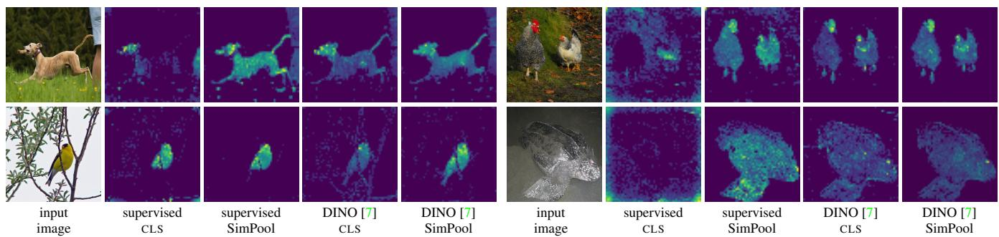
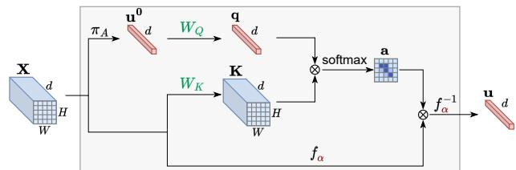
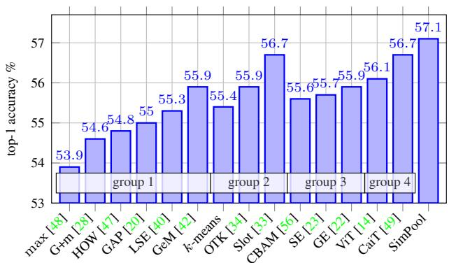

# Keep It SimPool: Who Said Supervised Transformers Suffer from Attention Deficit?

Bill Psomas1,2 Ioannis Kakogeorgiou1 Konstantinos Karantzalos1 Yannis Avrithis2

1National Technical University of Athens 2Institute of Advanced Research in Artificial Intelligence (IARAI)

  
Figure 1. We introduce SimPool, a simple attention-based pooling method at the end of network, obtaining clean attention maps under supervision or self-supervision. Attention maps of ViT-S [14] trained on ImageNet-1k [11]. For baseline, we use the mean attention map of the CLS token. For SimPool, we use the attention map a (15). Input image: 896 × 896; patches: 16 × 16; attention map: 56 × 56.

## Abstract

Convolutional networks and vision transformers have differentforms ofpairwise interactions, pooling across layers and pooling at the end of the network. Does the latter really need to be different? As a by-product ofpooling, vision transformers provide spatial attentionforfree, but this is most often of low quality unless self-supervised, which is not well studied. Is supervision really the problem?

In this work, we develop a generic pooling framework and then we formulate a number of existing methods as instantiations. By discussing the properties of each group of methods, we derive SimPool, a simple attention-based pooling mechanism as a replacement of the default one for both convolutional and transformer encoders. Wefind that, whether supervised or self-supervised, this improves performance on pre-training and downstream tasks and provides attention maps delineating object boundaries in all cases. One could thus call SimPool universal. To our knowledge, we are thefirst to obtain attention maps in supervised transformers ofat least as good quality as self-supervised, without explicit losses or modifying the architecture. Code at: https://github.com/billpsomas/simpool.

## 1. Introduction

Extracting visual representations and spatial pooling have been two interconnected processes since the study of 2D Gabor filters [10] and early convolutional networks [17]. Modern convolutional networks [20, 32] gradually perform local pooling and downsampling throughout the architecture to extract a low-resolution feature tensor, followed by global spatial pooling. Vision transformers [14] only downsample at input tokenization and then preserve resolution, but pooling takes place again throughout the architecture via the interaction of patch tokens with a CLS token, inherited from language models [13].

The pooling operation has been studied extensively in instance-level tasks on convolutional networks [3, 42], but less so in category-level tasks or transformers. Pooling in transformers is based on weighted averaging, using as weights the 2D attention map of the CLS token at the last layer. However, this attention map is typically of low quality, unless under self-supervision [7].

In this work, we argue that vision transformers can be reformulated in two streams, where one is extracting a visual representation on patch tokens and the other is performing spatial pooling on the CLS token; whereas, convolutional networks undergo global spatial pooling at the very last step, before the classifier. In this sense, one can isolate the pooling process from both kinds of networks and replace it by a new one. This raises the following questions:

1. Can we derive a simple pooling process at the very last step of either convolutional or transformer encoders that improves over their default?

2. Can this process provide high-quality attention maps that delineate object boundaries,for both networks?

3. Do these properties hold under both supervised and self-supervised settings?

To answer these questions, we develop a generic pooling framework, parametrized by: (a) the number of vectors in the pooled representation; (b) whether pooling is iterative or not; (c) mappings at every stage of the process; (d) pairwise similarities, attention function and normalization; and (e) a function determining the pooling operation.

We then formulate a number of existing pooling methods as instantiations of this framework, including (a) simple pooling mechanisms in convolutional networks [20, 48, 42, 40, 47], (b) iterative methods on more than one vectors like k-means [34, 33], (c) feature re-weighting mechanisms originally desinged as network components rather than pooling [23, 56], and (d) vision transformers [14, 49]. Finally, by discussing the properties of each group of methods, we derive a new, simple, attention-based pooling mechanism as a replacement of the default one for both convolutional and transformer encoders. SimPool provides highquality attention maps that delineate object boundaries under both supervised and self-supervised settings, as shown for ViT-S [14] in Figure 1.

In summary, we make the following contributions:

1. We formulate a generic pooling framework that allows easy inspection and qualitative comparison of a wide range of methods.

2. We introduce a simple, attention-based, non-iterative, universal pooling mechanism that provides a single vector representation and answers all the above questions in the affirmative.

3. We conduct an extensive empirical study that validates the superior qualitative properties and quantitative performance of the proposed mechanism on standard benchmarks and downstream tasks.

## 2. Related Work

We discuss the most related work to pooling in convolutional networks and vision transformers. An extended version with more background is given in the appendix.

Convolutional networks Early convolutional networks [17, 27] are based on learnable convolutional layers interleaved with fixed spatial pooling layers that downsample. The same design remains until today [26, 46, 20, 32].

Apart from mapping to a new space, convolutional layers involve a form of local pooling and pooling layers commonly take average [27] or maximum [44, 26].

Early networks end in a fully-connected layer over a feature tensor of low resolution [27, 26, 46]. This evolved into spatial pooling, e.g. global / regional average followed by a classifier for category-level tasks like classification [29, 20] / detection [18], or global maximum followed by a pairwise loss [48] for instance-level tasks.

The spatial pooling operation at the end of the network is widely studied in instance level-tasks [3, 48, 42], giving rise to forms of spatial attention [24, 38, 6, 47, 36], In category-level tasks, it is more common to study feature re-weighting as components of the architecture [23, 56, 22]. The two are closely related because e.g. the weighted average is element-wise weighting followed by sum.

Pooling can be spatial [22, 38, 6, 47, 36], over channels [23], or both [24, 56]. CBAM [56] is particularly related to our work in the sense that it includes global average pooling followed by a form of spatial attention, although the latter is not evident in its original formulation and although CBAM is not a pooling mechanism.

Vision transformers Pairwise interactions between features are forms of pooling or self-attention over the spatial [55, 4, 63, 41] or channel dimensions [8, 54]. Originating in language models [51], vision transformers [14] streamlined these approaches and dominated the architecture landscape. Several variants often bring back ideas from convolutional networks [31, 58, 19, 57, 15, 21, 61].

Transformers downsample only at the input, forming spatial patch tokens. Pooling is based on a learnable CLS token, which, beginning at the input space, undergoes the same self-attention operation with patch tokens and provides a global image representation. That is, the network ends in global weighted average pooling, using as weights the attention of CLS over the patch tokens.

Few works that have studied beyond CLS for pooling are mostly limited to global average pooling (GAP) [31, 62, 50, 43]. CLS offers attention maps for free, however of low quality unless in a self-supervised setting [7], which is not well studied. Few works that attempt to rectify this in the supervised setting include a spatial entropy loss [39], shape distillation from convolutional networks [35] and skipping computation of self-attention [52].

We attempt to address these limitations and study pooling in convolutional networks, vision transformers, supervised and self-supervised alike. We derive a simple, attention-based, universal pooling mechanism, improving both performance and attention maps.

## 3. Method

We develop a generic pooling framework that encompasses many simple or more complex pooling methods, iterative or not, attention-based or not. We then examine a number of methods as instantiations of this framework. Finally, we discuss their properties and make particular choices in designing our solution.

## 3.1. A generic pooling framework

Preliminaries Let $\mathbf { X } \in \mathbb { R } ^ { d \times W \times H }$ be the 3-dimensional feature tensor obtained from the last layer of a network for a given input image, where d is the number of feature channels and $W , H$ are the width and height. We represent the image by the feature matrix $\boldsymbol { X } \in \mathbb { R } ^ { d \times p }$ by flattening the spatial dimensions of X, where $p : = W \times H$ is the number of spatial locations. Let $\mathbf { x } _ { i } \in \mathbb { R } ^ { p }$ denote the i-th row of $X$ that is, corresponding to the 2-dimensional feature map in channel i, and $\mathbf { x } _ { \cdot j } \in \mathbb { R } ^ { d }$ denote the j-th column of X, that is, the feature vector of spatial location $j .$

By $\mathbf { 1 } _ { n } \in \mathbb { R } ^ { n }$ , we denote the all-ones vector. Given an $m \times n$ matrix $A \ \geq \ 0$ , by $\eta _ { 1 } ( A ) : = \mathrm { d i a g } ( A { \bf 1 } _ { n } ) ^ { - 1 } A$ we denote row-wise $\ell _ { 1 }$ -normalization; similarly, $\eta _ { 2 } ( A ) : =$ $A \mathrm { d i a g } ( \mathbf { 1 } _ { m } ^ { \top } A ) ^ { - 1 }$ for column-wise.

Pooling process The objective of pooling is to represent the image by one or more vectors, obtained by interaction with X, either in a single step or by an iterative process. We denote the pooling process by function $\pi : \mathbb { R } ^ { d \times p }  \mathbb { R } ^ { d ^ { \prime } \times k }$ and the output vectors by matrix $U \ : = \ : \pi ( X ) \in \mathbb { R } ^ { d ^ { \prime } \times k }$ where $d ^ { \prime }$ is the number of dimensions, possibly $d ^ { \prime } = d ,$ and k is the number of vectors. In the most common case of a single vector, $k = 1$ , we denote U by $\mathbf { u } \in \mathbb { R } ^ { d ^ { \prime } }$ . We discuss here the general iterative process; single-step pooling is the special case where the number of iterations is 1.

Initialization We define $X ^ { 0 } : = X$ and make a particular choice for $U ^ { 0 } \in \mathbb { R } ^ { d ^ { 0 } \times k }$ , where $d ^ { 0 } : = d .$ . The latter may depend on the input $X ,$ , in which case it is itself a simple form of pooling or not; for example, it may be random or a learnable parameter over the entire training set.

Pairwise interaction Given $U ^ { t }$ and $X ^ { t }$ at iteration t, we define the query and key matrices

$$
Q = \phi _ { Q } ^ { t } ( U ^ { t } ) \in \mathbb { R } ^ { n ^ { t } \times k }\tag{1}
$$

$$
K = \phi _ { K } ^ { t } ( X ^ { t } ) \in \mathbb { R } ^ { n ^ { t } \times p } .\tag{2}
$$

Here, functions $\phi _ { Q } ^ { t } : \mathbb { R } ^ { d ^ { t } \times k }  \mathbb { R } ^ { n ^ { t } \times k }$ and $\phi _ { K } ^ { t } : \mathbb { R } ^ { d ^ { t } \times p } $ $\mathbb { R } ^ { n ^ { t } \times p }$ may be the identity, linear or non-linear mappings to a space of the same $( n ^ { t } = d ^ { t } )$ or different dimensions. We let $K , Q$ interact pairwise by defining the $p \times k$ matrix $S ( K , Q ) : = ( ( s ( \mathbf { k } _ { \bullet i } , \mathbf { q } _ { \bullet j } ) ) _ { i = 1 } ^ { p } ) _ { j = 1 } ^ { k }$ , where $s : \mathbb { R } ^ { n } \times \mathbb { R } ^ { n } \to \mathbb { R }$ for any n is a similarity function. For example, s can be dot product, cosine similarity, or a decreasing function of some distance. In the case of dot product, $s ( \mathbf { x } , \mathbf { y } ) : = \mathbf { x } ^ { \top } \mathbf { y }$ for $\mathbf { x } , \mathbf { y } \in \mathbb { R } ^ { d }$ , it follows that $S ( K , Q ) = K ^ { \top } Q \in \mathbb { R } ^ { p \times k }$

Attention We then define the attention matrix

$$
A = h ( S ( K , Q ) ) \in \mathbb { R } ^ { p \times k } .\tag{3}
$$

Here, $h : \mathbb { R } ^ { p \times k }  [ 0 , 1 ] ^ { p \times k }$ is a nonlinear function that may be elementwise, for instance relu or exp, normalization over rows or columns of $S ( K , Q )$ , or it may yield a form of correspondence or assignment between the columns of K and Q, possibly optimizing a cost function.

Attention-weighted pooling We define the value matrix

$$
V = \phi _ { V } ^ { t } ( \boldsymbol { X } ^ { t } ) \in \mathbb { R } ^ { n ^ { t } \times p } .\tag{4}
$$

Here, function $\phi _ { V } ^ { t } : \mathbb { R } ^ { d ^ { t } \times p }  \mathbb { R } ^ { n ^ { t } \times p }$ plays a similar role with $\phi _ { Q } ^ { t } , \phi _ { K } ^ { t }$ . Attention-weighted pooling is defined by

$$
Z = f ^ { - 1 } ( f ( V ) A ) \in \mathbb { R } ^ { n ^ { t } \times k } .\tag{5}
$$

Here, $f : \mathbb { R } $ R is a nonlinear elementwise function that determines the pooling operation, for instance, average or max-pooling. The product $f ( V ) A$ defines k linear combinations over the columns of $f ( V )$ , that is, the features at different spatial locations. If the columns of $A$ are $\ell _ { 1 } \cdot$ normalized, then those are convex combinations. Thus, matrix A defines the weights of an averaging operation.

Output Finally, we define the output matrices corresponding to image features and pooling,

$$
X ^ { t + 1 } = \phi _ { X } ^ { t } ( X ^ { t } ) \in \mathbb { R } ^ { d ^ { t + 1 } \times p }
$$

$$
U ^ { t + 1 } = \phi _ { U } ^ { t } ( Z ) \in \mathbb R ^ { d ^ { t + 1 } \times k } .\tag{6}
$$

(7)

Functions $\phi _ { X } ^ { t } : \mathbb { R } ^ { n ^ { t } \times p }  \mathbb { R } ^ { d ^ { t + 1 } \times p }$ and $\phi _ { U } ^ { t } : \mathbb { R } ^ { n ^ { t } \times k } \ $ $\mathbb { R } ^ { d ^ { t + 1 } \times k }$ play a similar role with $\phi _ { Q } ^ { t } , \phi _ { K } ^ { t } , \phi _ { V } ^ { t }$ but also determine the dimensionality $d ^ { t + 1 }$ for the next iteration.

At this point, we may iterate by returning to the “pairwise interaction” step, or terminate, yielding $U ^ { t + 1 }$ as $U$ with $d ^ { \prime } = d ^ { t + 1 }$ . Non-iterative methods do not use $\phi _ { X } ^ { t }$

## 3.2. A pooling landscape

Table 1 examines a number of pooling methods as instantiations of our framework. The objective is to get insight into their basic properties. How this table was obtained is detailed in the appendix.

Group 1 consists of simple methods with $k = 1$ that are not attention-based and have been studied in category-level tasks [20, 40] or mostly in instance-level tasks [48, 42, 47]. Here, the attention is a vector $\mathbf { a } \in \mathbb { R } ^ { p }$ and either is uniform or depends directly on $X ,$ , by pooling over channels [47]. Most important is the choice of pooling operation by function $f .$ Log-sum-exp [40] arises with $f ( x ) \ = \ e ^ { r x }$ with learnable scale r. For the rest, we define $f = f _ { \alpha } .$ , where

<table><tr><td>#</td><td>METHOD</td><td>CAT ITER k</td><td></td><td> $U ^ { 0 }$ </td><td> $\phi _ { Q } ( U )$ </td><td> $\phi _ { K } ( X )$ </td><td> $s ( \mathbf { x } , \mathbf { y } )$ </td><td>A</td><td> $\phi _ { V } ( X )$ </td><td>f(x)</td><td> $\phi _ { X } ( X )$ </td><td> $\phi _ { U } ( Z )$ </td></tr><tr><td></td><td>GAP [20]</td><td>√</td><td></td><td></td><td></td><td></td><td></td><td> $\mathbf { 1 } _ { p } / p$ </td><td>XXX</td><td> $f _ { - 1 } ( x )$ </td><td></td><td>zzzz</td></tr><tr><td>1</td><td>max [48]</td><td></td><td></td><td></td><td></td><td></td><td></td><td> $\mathbf { 1 } _ { p }$ </td><td></td><td> $f _ { - \infty } ( x )$ </td><td></td><td></td></tr><tr><td></td><td>GeM [42]</td><td></td><td></td><td></td><td></td><td></td><td></td><td> $\mathbf { 1 } _ { p } / p$ </td><td></td><td> $\displaystyle f _ { \alpha } ( x )$  1</td><td></td><td></td></tr><tr><td></td><td>LSE [40]</td><td></td><td></td><td></td><td></td><td></td><td></td><td> $\mathbf { 1 } _ { p } / \underline { { p } }$ </td><td>X</td><td></td><td></td><td></td></tr><tr><td></td><td>HOW [47]</td><td></td><td></td><td></td><td></td><td></td><td></td><td> $\mathrm { d i a g } ( X ^ { \top } X )$ </td><td> $\operatorname { F C } ( \operatorname { a v g } _ { 3 } \left( X \right) )$ </td><td> $f _ { - 1 } ( x )$ </td><td></td><td> $\eta ^ { 2 } ( Z )$ </td></tr><tr><td></td><td>OTK [34]</td><td>√</td><td></td><td>U</td><td>U</td><td>X</td><td></td><td> $\mathrm { S I N K H O R N } ( e ^ { S / \epsilon } )$ </td><td> $\psi ( X )$ </td><td> $f _ { - 1 } ( x )$ </td><td></td><td>Z</td></tr><tr><td>2</td><td>k-means</td><td></td><td>V</td><td>random</td><td>U</td><td>X</td><td> $\begin{array} { c } { { - \| \mathbf x - \mathbf y \| ^ { 2 } } } \\ { { - \| \mathbf x - \mathbf y \| ^ { 2 } } } \end{array}$ </td><td> $\eta _ { 2 } \mathrm { ( a r g \ m a x _ { 1 } } ( S ) )$ </td><td>X</td><td> $f _ { - 1 } ( x )$ </td><td>X</td><td>Z</td></tr><tr><td></td><td>Slot [33]*</td><td>√</td><td>√</td><td>random</td><td> $W _ { Q } U$ </td><td> $W _ { K } X$ </td><td> $\mathbf { x } ^ { \top } \mathbf { y }$ </td><td> $\eta _ { 1 } \left( \pmb { \sigma } _ { 2 } ( S / \sqrt { n } ) \right)$ </td><td> $W _ { V } X$ </td><td> $f _ { - 1 } ( x )$ </td><td>X</td><td> $\operatorname { M L P } \left( \operatorname { G R U } ( Z ) \right)$ </td></tr><tr><td>3</td><td>SE [23]</td><td>√</td><td></td><td>1 πA(X)</td><td> $\sigma ( \operatorname { M L P } ( U ) )$ </td><td></td><td></td><td> $\mathbf { 1 } _ { p } / p$ </td><td> $\mathrm { d i a g } ( \mathbf { q } ) X$ </td><td></td><td>V</td><td></td></tr><tr><td></td><td>CBAM [56]*</td><td>√</td><td></td><td></td><td> $1 ~ \pi _ { A } ( X ) ~ \sigma ( \operatorname { M L P } ( U ) ) / d$ </td><td>X</td><td> $\mathbf { x } ^ { \top } \mathbf { y }$ </td><td> $\sigma ( \mathrm { c o n v } _ { 7 } ( S ) ) / p$ </td><td> $\mathrm { d i a g } ( \mathbf { q } ) X$ </td><td></td><td>V diag(a)</td><td></td></tr><tr><td></td><td> $\mathrm { V i T } \left[ 1 4 \right] ^ { \ast }$ </td><td></td><td>√</td><td></td><td></td><td></td><td></td><td></td><td></td><td></td><td></td><td></td></tr><tr><td>4</td><td>CaiT [49]*</td><td>√ √</td><td>√</td><td>U</td><td> $g _ { m } ( W _ { Q } U )$ </td><td> $g _ { m } ( W _ { K } X )$ </td><td> $\mathbf { x } _ { , \mathbf { y } } ^ { \top }$ </td><td> $\pmb { \sigma } _ { 2 } ( S _ { i } / \sqrt { d ^ { \prime } } ) _ { i = 1 } ^ { m }$ </td><td> $g _ { m } ( W _ { V } X )$ </td><td> $f _ { - 1 } ( x )$ </td><td>MLP(MSA(X))</td><td> $\mathrm { { \mathrm { M L P } } } \big ( W \boldsymbol { U } g _ { m } ^ { - 1 } ( \boldsymbol { Z } ) \big )$ </td></tr><tr><td></td><td></td><td></td><td></td><td>U</td><td> $g _ { m } ( W _ { Q } U )$ </td><td> $g _ { m } ( W _ { K } X )$ </td><td> $\mathbf { x } ^ { \top } \mathbf { y }$ </td><td> $\pmb { \sigma } _ { 2 } ( S _ { i } / \sqrt { d ^ { \prime } } ) _ { i = 1 } ^ { m }$ </td><td> $g _ { m } ( W _ { V } X )$ </td><td> $f _ { - 1 } ( x )$ </td><td>X</td><td> $\mathrm { { \mathrm { M L P } } } \big ( W \boldsymbol { U } g _ { m } ^ { - 1 } ( \boldsymbol { Z } ) \big )$ </td></tr><tr><td>5</td><td>SimPool</td><td>√</td><td></td><td> ${ \textbf { 1 } } \pi _ { A } ( X )$ </td><td> $W _ { Q } U$ </td><td> $W _ { K } X$ </td><td> $\mathbf { x } ^ { \top } \mathbf { y }$ </td><td> $\sigma _ { 2 } ( S / \sqrt { d } )$ </td><td> $X - \operatorname* { m i n } X$ </td><td> $f _ { \alpha } ( x )$ </td><td></td><td>Z</td></tr></table>

Table 1. A landscape of pooling methods. CAT: used in category-level tasks; ITER: iterative; \*: simplified. $\pi _ { A } \colon$ GAP; σ: sigmoid; $\sigma _ { 2 } \colon$ softmax over columns; η2: column normalization; $g _ { m } \colon$ partitioning in m groups (see appendix). Cyan: ours; gray: common choices with ours; green: learnable; red: hyperparameter; blue: detailed in the appendix.

$$
f _ { \alpha } ( x ) : = { \left\{ \begin{array} { l l } { x ^ { \frac { 1 - \alpha } { 2 } } , } & { { \mathrm { i f ~ } } \alpha \neq 1 , } \\ { \ln x , } & { { \mathrm { i f ~ } } \alpha = 1 . } \end{array} \right. }\tag{8}
$$

As studied by Amari [1], function $f _ { \alpha }$ is defined for $x \ge$ $0 ~ ( \alpha ~ \neq ~ 1 )$ or $x ~ > ~ 0 ~ ( \alpha ~ = ~ 1 )$ . It reduces to the maximum, quadratic mean (RMS), arithmetic mean, geometric mean, harmonic mean, and minimum for $\alpha =$ $- \infty , - 3 , - 1 , 1 , 3 , + \infty$ , respectively. It has been proposed as a transition from average to max-pooling [5] and is known as GeM [42], with $\gamma = ( 1 - \alpha ) / 2 > 1$ being a learnable parameter.

Group 2 incorporates iterative methods with $k > 1$ , including standard k-means, the soft-clustering variant Slot Attention [33] and optimal transport between U and X [34]. The latter is not formally iterative according to our framework, but the Sinkhorn algorithm is iterative internally.

Group 3 refers to methods introduced as modules within the architecture rather than pooling mechanisms [23, 56]. An interesting aspect is initialization of $U ^ { 0 }$ by global average pooling (GAP) on X:

$$
\pi _ { \boldsymbol { A } } ( X ) : = X \mathbf { 1 } _ { p } / p = \frac { 1 } { p } \sum _ { j = 1 } ^ { p } \mathbf { x } _ { \bullet j } \in \mathbb { R } ^ { d } ,\tag{9}
$$

where $\mathbf { 1 } _ { p } \in \mathbb { R } ^ { p }$ is the all-ones vector. Channel attention $( \phi _ { Q } ( U ) )$ and spatial attention (A) in CBAM [56] are based on a few layers followed by sigmoid, playing the role of a binary classifier (e.g. foreground/background); whereas, transformer-based attention uses directly the query and softmax normalization, respectively. Although not evident in the original formulation, we show in the appendix that there is pairwise interaction.

Group 4 refers to vision transformers [14, 49], which we reformulate in two separate streams, one for the CLS token,

  
Figure 2. Overview of SimPool. Given an input tensor $\textbf { X } \in$ $\mathbb { R } ^ { \breve { d } \times W \times H }$ flattened into $\boldsymbol { X } \in \mathbb { R } ^ { d \times p }$ with $p : = W \times H$ patches, one stream forms the initial representation $\mathbf { u } ^ { 0 } \ = \ \pi _ { A } ( X ) \ \in$ $\mathbb { R } ^ { d } \ ( 1 2 )$ by global average pooling (GAP), mapped by $W _ { Q } \in$ $\mathbb { R } ^ { d \times d }$ (13) to form the query vector $\mathbf { q } ~ \in ~ \mathbb { R } ^ { d } .$ . Another stream maps X by $W _ { K } \in \mathbb { R } ^ { d \times d }$ (14) to form the key $K \in \mathbb { R } ^ { d \times p }$ , shown as tensor K. Then, q and K interact to generate the attention map $\mathbf { a } \in \mathbb { R } ^ { p } \left( 1 5 \right)$ . Finally, the pooled representation u $\in \mathbb { R } ^ { d }$ is a generalized weighted average of X with a determining the weights and scalar function $f _ { \alpha }$ determining the pooling operation (17).

U, and another for the patch tokens, X. We observe that, what happens to the CLS token throughout the entire encoder, is an iterative pooling process. Moreover, although U is just one vector, multi-head attention splits it into m subvectors, where m is the number of heads. Thus, m is similar to k in k-means. The difference of CaiT [49] from ViT [14] is that this iteration happens only in the last couple of layers, with the patch embeddings X being fixed.

## 3.3. SimPool

Group 5 of Table 1 is our method, SimPool. A schematic overview is given in Figure 2.

Pooling process We are striving for a simple design. While pooling into $k > 1$ vectors would yield a more discriminative representation, either these would have to be concatenated, as is the case of multi-head attention, or a particular similarity kernel would be needed beyond dot product, which we consider to be beyond the scope of this work. We rather argue that it is the task of the encoder to learn a single vector representation of objects, even if those are composed of different parts. This argument is stronger when pre-training is performed on images mostly depicting one object, like ImageNet-1k.

We observe in Table 1 that only methods explicitly pooling into $k > 1$ vectors or implicitly using $m > 1$ heads are iterative. We explain why in the next paragraph. Following this insight, we perform pooling in a single step.

In summary, our solution is limited to a single vector $\mathbf { u } \in \mathbb { R } ^ { d }$ for pooling, that is, $k = 1$ , and is non-iterative.

Initialization We observe in Table 1 that single-step attention-based methods in Group 3 initialize $\mathbf { u } ^ { 0 }$ by GAP. We hypothesize that, since attention is based on pairwise similarities, it is essential that $\mathbf { u } ^ { 0 }$ is chosen such that its similarities with X are maximized on average, which would help to better discriminate between foreground (high similarity) and background (low similarity). Indeed, for $s ( \mathbf x , \mathbf y ) \stackrel { \cdot } { = } - \| \mathbf x - \mathbf y \| ^ { 2 }$ , the sum of squared Euclidean distances of each column $\mathbf { x } _ { \bullet i }$ of $X$ to $\mathbf { u } \in \mathbb { R } ^ { d }$

$$
J ( \mathbf { u } ) = \frac { 1 } { 2 } \sum _ { i = 1 } ^ { p } \| \mathbf { x } _ { \bullet i } - \mathbf { u } \| ^ { 2 }\tag{10}
$$

is a convex distortion measure with unique minimum the average of vectors $\{ \mathbf { x } _ { \bullet i } \}$

$$
\mathbf { u } ^ { * } : = \arg \operatorname* { m i n } _ { \mathbf { u } \in \mathbb { R } ^ { d } } J ( \mathbf { u } ) = \frac { 1 } { p } \sum _ { i = 1 } ^ { p } \mathbf { x } _ { \bullet i } = \pi _ { A } ( X ) ,\tag{11}
$$

which can be found in closed form. By contrast, for $k > 1$ vectors, distortion can only be minimized iteratively, e.g. by k-means. We therefore choose:

$$
\mathbf { u } ^ { 0 } = \pi _ { A } ( X ) = X \mathbf { 1 } _ { p } / p .\tag{12}
$$

Pairwise interaction, attention We follow the attention mechanism of transformers, in its simplest possible form. In particular, we use a single head, $m = 1$ , like Slot Attention [33] (which however uses k vectors). We find that the query and key mappings are essential in learning where to attend as a separate task from learning the representation for the given task at hand. In particular, we use linear mappings ϕQ, ϕK with learnable parameters $W _ { Q } , W _ { K } \in \mathbb { R } ^ { d \times d }$ respectively:

$$
\mathbf { q } = \phi _ { Q } ( \mathbf { u } ^ { 0 } ) = W _ { Q } \mathbf { u } ^ { 0 } \in \mathbb { R } ^ { d }\tag{13}
$$

$$
K = \phi _ { K } ( X ) = W _ { K } X \in \mathbb { R } ^ { d \times p } .\tag{14}
$$

As in transformers, we define pairwise similarities as dot product, that is, $S ( K , \mathbf { q } ) = K ^ { \top } \mathbf { q } \in \mathbb { R } ^ { p \times k }$ , and attention as scaled softmax over columns (spatial locations), that is, $h ( S ) : = \pmb { \sigma } _ { 2 } ( S / \sqrt { d } )$

$$
\mathbf { a } = \pmb { \sigma } _ { 2 } \left( \boldsymbol { K } ^ { \top } \mathbf { q } / \sqrt { d } \right) \in \mathbb { R } ^ { p } ,\tag{15}
$$

where $\pmb { \sigma } _ { 2 } ( S ) : = \eta _ { 2 } ( \mathrm { e x p } ( S ) )$ and exp is taken elementwise.

Attention-weighted pooling As shown in Table 1, the average pooling operation $( f ~ = ~ f _ { - 1 } )$ is by far the most common. However, the more general function $f _ { \alpha } \left( 8 \right)$ has shown improved performance in instance-level tasks [42]. For $\alpha < - 1 ( \gamma > 1 )$ in particular, it yields an intermediate operation between average and max-pooling. The latter is clearly beneficial when feature maps are sparse, because it better preserves the non-zero elements.

We adopt $\textit { f } = f _ { \alpha }$ for its genericity: the only operation that is not included as a special case in Table 1 is logsum-exp [40]. This choice assumes $X \geq 0 .$ . This is common in networks ending in relu, like ResNet [20], which is also what makes feature maps sparse. However, vision transformers and modern convolutional networks like ConvNeXt [32] do not end in relu; hence X has negative elements and is not necessarily sparse. We therefore define

$$
V = \phi _ { V } ( X ) = X - \operatorname* { m i n } X \in \mathbb { R } ^ { d \times p } ,\tag{16}
$$

where the minimum is taken over all elements of $X ,$ such that $f _ { \alpha }$ operates only on non-negative numbers.

We also define $\mathbf { u } = \phi _ { U } ( \mathbf { z } ) = \mathbf { z }$ and the output dimension is $d ^ { \prime } = d .$ Thus, the mappings ϕV, ϕU are parameter-free. The argument is that, for average pooling for example $( f =$ $f _ { - 1 }$ in (5)), any linear layers before or after pooling would commute with pooling, thus they would form part of the encoder rather than the pooling process. Moreover, Table 1 shows that ϕ is non-identity only for iterative methods.

In summary, we define SimPool (SP) as

$$
\mathbf { u } = \pi _ { \mathtt { S P } } ( X ) : = f _ { \alpha } ^ { - 1 } ( f _ { \alpha } ( V ) \mathbf { a } ) \in \mathbb { R } ^ { d } ,\tag{17}
$$

where $V \in \mathbb { R } ^ { d \times p }$ is the value (16) and $\mathbf { a } \in \mathbb { R } ^ { p }$ is the attention map (15). Parameter α is learned in GeM [42], but we find that treating it as a hyperparameter better controls the quality of the attention maps.

## 4. Experiments

## 4.1. Datasets, networks and evaluation protocols

Supervised pre-training We train ResNet-18, ResNet-50 [20], ConvNeXt-S [32], ViT-S and ViT-B [14] for image classification on ImageNet-1k. For the analysis subsection 4.2 and ablation subsection 4.4, we train ResNet-18 on the first 20% of training examples per class of ImageNet-1k [11] (called ImageNet-20%) for 100 epochs. For the benchmark of subsection 4.3, we train ResNet-50 for 100 and 200 epochs, ConvNeXt-S and ViT-S for 100 and 300 epochs and ViT-B for 100 epochs, all on the 100% of ImageNet-1k. We evaluate on the full validation set in all cases and measure top-1 classification accuracy. The baseline is the default per network, i.e. GAP for convolutional networks and CLS token for transformers.

  
Figure 3. Image classification on ImageNet-20. Supervised training of ResNet-18 for 100 epochs.

Self-supervised pre-training On the 100% of ImageNet-1k, we train DINO [7] with ResNet-50, ConvNeXt-S and ViT-S for 100 epochs. We evaluate on the validation set by k-NN and linear probing on the training set. For linear probing, we train a linear classifier on top of features as in DINO [7]. For k-NN [59], we freeze the model and extract features, then use a k-nearest neighbor classifier with k = 10.

Downstream tasks We fine-tune supervised and selfsupervised ViT-S on CIFAR-10 [25], CIFAR-100 [25] and Oxford Flowers [37] for image classification, measuring top-1 classification accuracy. We perform object localization without fine-tuning using supervised and selfsupervised ViT-S on CUB [53] and ImageNet-1k, measuring MaxBoxAccV2 [9]. We perform object discovery without fine-tuning using self-supervised ViT-S with DINO-SEG [7] and LOST [45] on VOC07 [16], VOC12 [16] and COCO [30], measuring CorLoc [12]. We validate robustness against background changes using ViT-S on ImageNet-9 [60] and its variations. We use the linear head and linear probe for supervised and self-supervised ViT-S, respectively, measuring top-1 classification accuracy.

In the appendix, we provide implementation details, more benchmarks, ablations and visualizations.

## 4.2. Experimental Analysis

Figure 3 evaluates different methods in groups following Table 1, regardless of their original design for (a) pooling or not, (b) different tasks, e.g. instance-level or category-level, (c) different networks, e.g. convolutional or transformers.

Group 1 consists of simple pooling methods with: (a) no parameters: GAP [29], max [48], GAP+max [28]; and (b) scalar parameter: GeM [42] and LSE [40]. HOW [47] is the only method to use (parameter-free) attention. GeM is performing the best, with LSE following second. These methods are inferior to those in other groups.

Group 2 incorporates methods with $k > 1$ vectors. We set k = 3 and take the maximum of the 3 logits per class. OTK and Slot use attention. Slot attention [33] works best, outperforming k-means by 1.3%.

<table><tr><td>METHOD</td><td>EP RESNET-50</td><td>CONVNEXT-S</td><td>VIT-S</td><td>VIT-B</td></tr><tr><td>Baseline</td><td>100 77.4</td><td>81.1</td><td>72.7</td><td>74.1</td></tr><tr><td>CaiT [49]</td><td>100 77.3</td><td>81.2</td><td>72.6</td><td>一</td></tr><tr><td>Slot [33]</td><td>100 77.3</td><td>80.9</td><td>72.9</td><td>一</td></tr><tr><td>GE [22]</td><td>100 77.6</td><td>81.3</td><td>72.6</td><td></td></tr><tr><td>SimPool</td><td>100 78.0</td><td>81.7</td><td>74.3</td><td>75.1</td></tr><tr><td>Baseline</td><td>300 78.1†</td><td>83.1</td><td>77.9</td><td>-</td></tr><tr><td>SimPool</td><td>300 78.7†</td><td>83.5</td><td>78.7</td><td>–</td></tr></table>

Table 2. Image classification top-1 accuracy (%) on ImageNet-1k. Supervised pre-training for 100 and 300 epochs. Best competitors selected per group from Figure 3. Baseline: GAP for convolutional, CLS for transformers; EP: epochs; †: 200 epochs.

Group 3 refers to parametric attention-based methods, weighting features based on their importance for the task: CBAM [56], Squeeze-Excitation [23] and Gather-Excite [22]. While originally designed as components within the architecture, we adapt them to pooling by GAP at the end. Gather-Excite [22] performs best.

Group 4 refers to parametric attention-based methods found in vision transformers. ViT [14] refers to multi-head self-attention learnable CLS and four heads, which we incorporate as a single layer at the end of the model. CaiT [49] is the same but using only cross-attention between CLS and patch embeddings. CaiT performs the best.

SimPool outperforms all other methods. Seeing this experiment as a tournament, we select the best performing method of each group and qualify it for the benchmark of subsection 4.3.

## 4.3. Benchmark

Image Classification Table 2 compares SimPool with baseline and tournament winners per group of subsection 4.2 on supervised pre-training for classification. For 100 epochs, SimPool outperforms all methods, consistently improving the baseline by 0.6% using convolutional networks, 1.6% using ViT-S and 1.0% using ViT-B. Gather-Excite [22] improves over the baseline only on convolutional networks, while Slot [33] only on ViT-S. CaiT improves over the baseline only for ConvNeXt-S. By contrast, SimPool improves everywhere. For more than 100 epochs, SimPool improves the baseline by 0.5% using ResNet-50, 0.4% using ConvNeXt-S and 0.8% using ViT-S.

Table 3 evaluates self-supervised pre-training for 100 epochs. SimPool improves over the baseline by 2.0% k-NN and 1.4% linear probing on ResNet-50; 3.7% k-NN and 4.0% linear probing on ConvNeXt-S; and 0.9% k-NN and 1.3% linear probing on ViT-S.

<table><tr><td rowspan="2">METHOD</td><td rowspan="2">EP</td><td colspan="2">RESNET-50</td><td colspan="2">CONVNEXT-S</td><td colspan="2">VIT-S</td></tr><tr><td>k-NN</td><td>PROB</td><td>k-NN</td><td>PROB</td><td>k-NN</td><td>PROB</td></tr><tr><td>Baseline</td><td>100</td><td>61.8</td><td>63.0</td><td>65.1</td><td>68.2</td><td>68.9</td><td>71.5</td></tr><tr><td>SimPool</td><td>100</td><td>63.8</td><td>64.4</td><td>68.8</td><td>72.2</td><td>69.8</td><td>72.8</td></tr></table>

Table 3. Image classification top-1 accuracy (%) on ImageNet-1k. Self-supervised pre-training with DINO [7] for 100 epochs. Baseline: GAP for convolutional, CLS for transformers.

<table><tr><td rowspan="2">METHOD</td><td colspan="2">SUPERVISED</td><td colspan="4">SELF-SUPERVISED</td></tr><tr><td>CF-10</td><td>CF-100</td><td>FL</td><td>CF-10</td><td>CF-100</td><td>FL</td></tr><tr><td>Baseline</td><td>98.1</td><td>86.0</td><td>97.1</td><td>98.7</td><td>89.8</td><td>98.3</td></tr><tr><td>SimPool</td><td>98.4</td><td>86.2</td><td>97.4</td><td>98.9</td><td>89.9</td><td>98.4</td></tr></table>

Table 4. Image classification accuracy (%) with fine-tuning for classification for 1000 epochs. ViT-S pre-trained on ImageNet-1k for 100 epochs. Self-supervision with DINO [7]. CF-10: CIFAR-10 [25], CF-100: CIFAR-100 [25], FL: Flowers[37].

<table><tr><td rowspan="2">METHOD</td><td colspan="2">SUPERVISED</td><td>SELF-SUPERVISED</td></tr><tr><td>CUB</td><td>IMAGENET CUB</td><td>IMAGENET</td></tr><tr><td>Baseline</td><td>63.1</td><td>53.6 82.7</td><td>62.0</td></tr><tr><td>SimPool</td><td>77.9</td><td>64.4 86.1</td><td>66.1</td></tr><tr><td>Baseline@20</td><td>62.4</td><td>50.5 65.5</td><td>52.5</td></tr><tr><td>SimPool@20 74.0</td><td></td><td>62.6 72.5</td><td>58.7</td></tr></table>

Table 5. Localization accuracy MaxBoxAccV2 on CUB test and ImageNet-1k validation set. ViT-S pre-trained on ImageNet-1k for 100 epochs. Self-supervision with DINO [7]. @20: at epoch 20.

Fine-tuning for classification Table 4 evaluates finetuning for classification on different datasets of a supervised and a self-supervised ViT-S. SimPool brings a small improvement over the baseline in all cases.

Object localization Accurate localization can have a significant impact on classification accuracy, particularly under multiple objects, complex scenes and background clutter. Table 5 evaluates localization accuracy under both supervision settings. SimPool significantly improves the baseline by up to 7% MaxBoxAccV2 when self-supervised and up to 14% when supervised. In the latter case, the gain is already up to 12% at epoch 20.

Unsupervised object discovery Table 6 studies LOST [45], which uses the raw features of a vision transformer pre-trained using DINO [7] for unsupervised single-object discovery, as well as the baseline DINO-seg [45, 7], which uses the attention maps instead. SimPool significantly outperforms the baseline on all datasets by up to 25.2% CorLoc for DINO-seg and 5.6% for LOST on VOC12. Again, the gain is significant already at the first 20 epochs.

Background changes We evaluate robustness to the background changes using IN-9 [60] dataset. Table 7 shows that SimPool improves over the baseline under both supervision settings with only 2 out of 8 exceptions under DINO [7] pre-training. The latter is justified, given that none of the foreground objects or masks are present in these settings.

<table><tr><td rowspan="2">METHOD</td><td colspan="3">DINO-SEG [45, 7]</td><td colspan="2">LOST [45]</td></tr><tr><td colspan="3">VOC07 VOC12 COCO|VOC07 VOC12 COCO</td><td colspan="2"></td></tr><tr><td>Baseline</td><td>30.8</td><td>31.0</td><td>36.7</td><td>55.5 59.4</td><td>46.6</td></tr><tr><td>SimPool</td><td>53.2</td><td>56.2</td><td>43.4</td><td>59.8 65.0</td><td>49.4</td></tr><tr><td>Baseline@20</td><td>14.9</td><td>14.8</td><td>19.9</td><td>50.7 56.6</td><td>40.9</td></tr><tr><td>SimPool@20</td><td>49.2</td><td>54.8</td><td>37.9</td><td>53.9 58.8</td><td>46.1</td></tr></table>

Table 6. Object discovery CorLoc. ViT-S pre-trained on ImageNet-1k for 100 epochs. Self-supervision with DINO [7]. @20: at epoch 20.
<table><tr><td>METHOD</td><td>OF</td><td>MS MR</td><td>MN</td><td>NF</td><td>OBB</td><td>OBT</td><td>IN-9</td></tr><tr><td colspan="8">SUPERVISED</td></tr><tr><td>Baseline</td><td>66.4</td><td>79.1</td><td>67.4 65.5</td><td>37.2</td><td>12.9</td><td>15.2</td><td>92.0</td></tr><tr><td>SimPool</td><td>71.8</td><td>80.2</td><td>69.3</td><td>67.3 42.8</td><td>15.2</td><td>15.6</td><td>92.9</td></tr><tr><td></td><td>SELF-SUPERVISED</td><td></td><td>十</td><td>LINEAR</td><td>PROBING</td><td></td><td></td></tr><tr><td>Baseline</td><td>87.3</td><td>87.9</td><td>78.5</td><td>76.7 47.9</td><td>20.0</td><td>16.9</td><td>95.3</td></tr><tr><td>SimPool</td><td>87.3</td><td>88.1</td><td>80.6 78.7</td><td>48.2</td><td>17.8</td><td>16.7</td><td>95.6</td></tr></table>

Table 7. Background robustness on IN-9 [60] and its variations; more details in the appendix. ViT-S pre-trained on ImageNet-1k for 100 epochs. Self-supervision with DINO [7].

<table><tr><td>#PAR FLO |#PAR FLO</td><td colspan="5">RESNET-18 RESNET-50 CONVNEXT-S</td><td></td><td>VIT-S #PAR FLO</td></tr><tr><td>Baseline</td><td>11.7</td><td>1.82</td><td>25.6</td><td>4.13</td><td>#PAR 50.2</td><td>FLO 8.68</td><td></td></tr><tr><td>CaiT</td><td></td><td>1.85</td><td>75.9</td><td>4.60</td><td>57.3</td><td>8.75</td><td>22.14.24 23.84.29</td></tr><tr><td>Slot</td><td>18.0 14.6</td><td>1.87</td><td>71.7</td><td>4.89</td><td>56.7</td><td>8.79</td><td>23.74.30</td></tr><tr><td>GE</td><td>11.7</td><td>1.83</td><td>26.1</td><td>4.15</td><td>50.3</td><td>8.69</td><td>22.14.25</td></tr><tr><td></td><td></td><td></td><td></td><td></td><td></td><td></td><td></td></tr><tr><td>SimPool 12.2</td><td></td><td>1.84</td><td>33.9</td><td>4.34</td><td>51.4</td><td>8.71</td><td>22.3 4.26</td></tr></table>

Table 8. Computation resources on Imagenet-1k, with d = 512 (ResNet-18), 2048 (ResNet-50), 768 (ConvNeXt), 384 (ViT-S). #PAR: number of parameters, in millions; FLO: GFLOPS.

Computation resources Table 8 shows the number of parameters and floating point operations per second for the best competitors of Figure 3. Resources depend on the embedding dimension d. SimPool is higher than the baseline but not the highest.

Performance vs. parameters Table 9 aims to answer the question of how much the performance improvement of SimPool is due to parameters of the query and key mappings. Interestingly, ViT-S works better with GAP than the default CLS. SimPool adds 0.2M parameters to the network. For fair comparison, we remove blocks from the network (BASE) when using SimPool and add blocks when using CLS. We find that, to exceed the accuracy of BASE Sim-Pool, BASE CLS needs 5 extra blocks, i.e., 9M more parameters. Equally interestingly, removing 3 blocks from BASE SimPool is only slightly worse than BASE CLS, having 5M fewer parameters.

<table><tr><td>NETWORK</td><td>POOLING</td><td>DEPTH</td><td>INIT</td><td>ACCURACY</td><td>#PARAMS</td></tr><tr><td>BASE</td><td>GAP</td><td>12</td><td>12</td><td>73.3</td><td>22.1M</td></tr><tr><td>BASE</td><td rowspan="6">CLS</td><td>12</td><td>0</td><td>72.7</td><td>22.1M</td></tr><tr><td> $\mathrm { B A S E } + 1$ </td><td>13</td><td>0</td><td>73.2</td><td>23.8M</td></tr><tr><td> $\mathrm { B A S E } + 2$ </td><td>14</td><td>0</td><td>73.7</td><td>25.6M</td></tr><tr><td> $\mathrm { B A S E } + 3$ </td><td>15</td><td>0</td><td>73.8</td><td>27.4M</td></tr><tr><td> $\mathrm { B A S E } + 4$ </td><td>16</td><td>0</td><td>73.9</td><td>29.2M</td></tr><tr><td> $\mathrm { B A S E } + 5$ </td><td>17</td><td>0</td><td>74.6</td><td>30.9M</td></tr><tr><td>BASE</td><td rowspan="4">SimPool</td><td>12</td><td>12</td><td>74.3</td><td>22.3M</td></tr><tr><td> $\mathrm { \Delta B A S E - 1 }$ </td><td>11</td><td>11</td><td>73.9</td><td>20.6M</td></tr><tr><td> $\mathrm { B A S E - 2 }$ </td><td>10</td><td>10</td><td>73.6</td><td>18.7M</td></tr><tr><td> $\mathrm { B A S E - 3 }$ </td><td>9</td><td>9</td><td>72.5</td><td>17.0M</td></tr></table>

Table 9. Trade-off between performance and parameters. Supervised pre-training of ViT-S on ImageNet-1k for 100 epochs. INIT: Initial layer of pooling token. BASE: original network. BASE+b (BASE−b): b blocks added to (removed from) the network.

## 4.4. Ablation study

We ablate the design and components of SimPool. More ablations are found in the appendix. In particular, for function $f _ { \alpha } \left( 8 \right)$ , we set $\gamma = 2$ for convolutional networks and $\gamma = 1 . 2 5$ for transformers by default, where $\gamma = ( 1 - \alpha ) / 2$ is a hyperparameter.

Design In Table 10 (left), we ablate (a) the attention function h (3); (b) the number of iterations with shared parameters at every iteration (LAYERS) or not (ITER); (c) the initialization $U ^ { 0 } ;$ ; (d) the pairwise similarity function s; (e) the number k of pooled vectors, obtained by k-means instead of GAP. We also consider queries and keys sharing the same mapping, $W _ { Q } = W _ { K }$ . We observe that multi-head, few iterations and initialization by diag $X ^ { \top } X )$ perform slightly worse, without adding any extra parameters, while setting $W _ { Q } = W _ { K }$ performs slightly worse, having 50% less parameters.

Linear and LayerNorm layers In Table 10 (right), we systematically ablate linear and LayerNorm (LN) [2] layers on query q, key k and value v. We strive for performance and quality while at the same time having a small number of components and parameters. In this sense, we choose the setup that includes linear layers on q, k and LN on $k , v ,$ yielding 56.6 accuracy. We observe that having linear and LN layers everywhere performs best under classification accuracy. However, this setup has attention maps of lower quality and more parameters.

<table><tr><td>ABLATION</td><td>OPTIONS Acc</td><td>LINEAR</td><td>LN Acc</td></tr><tr><td rowspan="2">h(S)</td><td rowspan="2"> $\pmb { \sigma } _ { 2 } ( S _ { i } / \sqrt { d } ) _ { i = 1 } ^ { m }$  56.6  $\eta _ { 2 } \big ( \pmb { \sigma } _ { 1 } \big ( \boldsymbol { S } / \sqrt { d } \big ) \big )$  55.6</td><td>Q KV Q KV</td><td></td></tr><tr><td> $\yen 123,456,78$ </td><td></td></tr><tr><td rowspan="2">LAYERS</td><td>3 56.8</td><td></td><td rowspan="2"> $\sqrt { \textbf { \textit { s } } } \sqrt { \textbf { \textit { s } } } 5 6 . 6$   $\surd \ V \ V \ 5 6 . 5$ </td></tr><tr><td>5 55.9</td><td>√</td></tr><tr><td rowspan="2">ITER</td><td>3</td><td>56.5 56.4</td><td> $\surd \ V \ V \ 5 6 . 4$ </td></tr><tr><td>5</td><td>√√</td><td> $\surd \ V \ V \ 5 5 . 6$  56.3</td></tr><tr><td rowspan="2"> $U ^ { 0 }$ </td><td>U  $\operatorname { d i a g } ( X ^ { \top } X )$ </td><td>56.3 56.6 √√</td><td>√√ √ 56.0</td></tr><tr><td> $\| \mathbf x - \mathbf y \| ^ { 2 }$  56.5</td><td>√√</td><td>56.2</td></tr><tr><td rowspan="2"> $s ( \mathbf { x } , \mathbf { y } )$ </td><td>cosine</td><td>56.3</td><td>√√  √ √ 56.6</td></tr><tr><td>2</td><td>√ √</td><td>√ 56.4</td></tr><tr><td rowspan="2">k (max)</td><td>5</td><td>56.5 56.4</td><td>√√ √56.2 r</td></tr><tr><td>2</td><td>56.5</td><td>V √ 56.2</td></tr><tr><td rowspan="2">k (concat)</td><td>5</td><td>55.9</td><td>」 54.4</td></tr><tr><td></td><td></td><td>54.5</td></tr><tr><td> $\phi _ { Q } , \phi _ { K }$ </td><td> $W _ { Q } = W _ { K }$ </td><td>56.4</td><td></td></tr><tr><td>SimPool</td><td>57.1</td><td>GAP</td><td>55.0</td></tr></table>

Table 10. SimPool ablation on ImageNet-20% using ResNet-18 trained for 100 epochs. Ablation of (left) design; (right) linear and LayerNorm (LN) [2] layers. $\boldsymbol { q } , \boldsymbol { k } , \boldsymbol { v } \colon$ query, key, value. $\pmb { \sigma } _ { 2 } ( S _ { i } / \sqrt { d } ) _ { i = 1 } ^ { m } \colon$ same as our default, but with multi-head attenion, $m = 4$ heads; k (max): maximum taken over output logits; k (concat): concatenation and projection to the same output dimensions $d ^ { \prime } .$ . Green: learnable parameter; blue: winning choice per group of experiments; Cyan: Our chosen default. Using pooling operation $f = f _ { \alpha }$ (8) (left); $f = f _ { - 1 } ( \mathrm { r i g h t } )$

## 5. Conclusion

We have introduced SimPool, a simple, attention-based pooling mechanism that acts at the very last step of either convolutional or transformer encoders, delivering highly superior quantitative results on several benchmarks and downstream tasks. In addition, SimPool delivers decent attention maps in both convolutional and transformer networks under both supervision and self-supervision with remarkable improvement in delineating object boundaries for supervised transformers. Despite this progress, we believe that investigating why the standard CLS-based attention fails under supervision deserves further study.

Acknowledgements This work was supported by the Hellenic Foundation for Research and Innovation (HFRI) under the BiCUBES project (grant: 03943). It was also partially supported by the RAMONES and iToBos EU Horizon 2020 projects, under grants 101017808 and 965221, respectively. NTUA thanks NVIDIA for the support with the donation of GPU hardware.

## References

[1] Shun-ichi Amari. Integration of stochastic models by minimizing α-divergence. Neural computation, 19(10):2780– 2796, 2007. 4

[2] Jimmy Lei Ba, Jamie Ryan Kiros, and Geoffrey E Hinton. Layer normalization. arXiv preprint arXiv:1607.06450, 2016. 8

[3] Artem Babenko and Victor Lempitsky. Aggregating local deep features for image retrieval. In International Conference on Computer Vision, 2015. 1, 2

[4] Irwan Bello, Barret Zoph, Ashish Vaswani, Jonathon Shlens, and Quoc V Le. Attention augmented convolutional networks. In Proceedings of the IEEE/CVF international conference on computer vision, pages 3286–3295, 2019. 2

[5] Y-Lan Boureau, Jean Ponce, and Yann LeCun. A theoretical analysis of feature pooling in visual recognition. In Proceedings of the 27th international conference on machine learning (ICML-10), pages 111–118, 2010. 4

[6] Bingyi Cao, Andre Araujo, and Jack Sim. Unifying deep local and global features for image search. In Computer Vision–ECCV 2020: 16th European Conference, Glasgow, UK, August 23–28, 2020, Proceedings, Part XX 16, pages 726–743. Springer, 2020. 2

[7] Mathilde Caron, Hugo Touvron, Ishan Misra, Herve J´ egou,´ Julien Mairal, Piotr Bojanowski, and Armand Joulin. Emerging properties in self-supervised vision transformers. In Proceedings ofthe IEEE/CVF international conference on computer vision, pages 9650–9660, 2021. 1, 2, 6, 7

[8] Yunpeng Chen, Yannis Kalantidis, Jianshu Li, Shuicheng Yan, and Jiashi Feng. Aˆ 2-nets: Double attention networks. Advances in neural information processing systems, 31, 2018. 2

[9] Junsuk Choe, Seong Joon Oh, Seungho Lee, Sanghyuk Chun, Zeynep Akata, and Hyunjung Shim. Evaluating weakly supervised object localization methods right. In Proceedings of the IEEE/CVF Conference on Computer Vision and Pattern Recognition, pages 3133–3142, 2020. 6

[10] John G Daugman. Uncertainty relation for resolution in space, spatial frequency, and orientation optimized by twodimensional visual cortical filters. Journal of Optical Society ofAmerica, 2(7):1160–1169, 1985. 1

[11] Jia Deng, Wei Dong, Richard Socher, Li-Jia Li, Kai Li, and Li Fei-Fei. Imagenet: A large-scale hierarchical image database. In IEEE Conference on Computer Vision and Pattern Recognition, pages 248–255. Ieee, 2009. 1, 5

[12] Thomas Deselaers, Bogdan Alexe, and Vittorio Ferrari. Localizing objects while learning their appearance. In Computer Vision–ECCV 2010: 11th European Conference on Computer Vision, Heraklion, Crete, Greece, September 5- 11, 2010, Proceedings, Part IV 11, pages 452–466. Springer, 2010. 6

[13] Jacob Devlin, Ming-Wei Chang, Kenton Lee, and Kristina Toutanova. Bert: Pre-training of deep bidirectional transformers for language understanding. arXiv preprint arXiv:1810.04805, 2018. 1

[14] Alexey Dosovitskiy, Lucas Beyer, Alexander Kolesnikov, Dirk Weissenborn, Xiaohua Zhai, Thomas Unterthiner,

Mostafa Dehghani, Matthias Minderer, Georg Heigold, Sylvain Gelly, Jakob Uszkoreit, and Neil Houlsby. An image is worth 16x16 words: Transformers for image recognition at scale. In International Conference on Learning Representations, 2021. 1, 2, 4, 5, 6

[15] Stephane d’Ascoli, Hugo Touvron, Matthew L Leavitt, Ari S´ Morcos, Giulio Biroli, and Levent Sagun. Convit: Improving vision transformers with soft convolutional inductive biases. In International Conference on Machine Learning, pages 2286–2296. PMLR, 2021. 2

[16] Mark Everingham, Luc Van Gool, Christopher KI Williams, John Winn, and Andrew Zisserman. The pascal visual object classes (voc) challenge. International journal of computer vision, 88:303–308, 2009. 6

[17] Kunihiko Fukushima. Neocognitron: A self-organizing neural network model for a mechanism of pattern recognition unaffected by shift in position. Biological cybernetics, 36(4):193–202, 1980. 1, 2

[18] Ross Girshick. Fast R-CNN. In Proceedings of the IEEE international conference on computer vision, 2015. 2

[19] Benjamin Graham, Alaaeldin El-Nouby, Hugo Touvron, Pierre Stock, Armand Joulin, Herve J´ egou, and Matthijs´ Douze. LeViT: a vision transformer in convnet’s clothing for faster inference. In Proceedings of the IEEE/CVF international conference on computer vision, 2021. 2

[20] Kaiming He, Xiangyu Zhang, Shaoqing Ren, and Jian Sun. Deep residual learning for image recognition. In Proceedings ofthe IEEE conference on computer vision and pattern recognition, 2016. 1, 2, 3, 4, 5, 6

[21] Byeongho Heo, Sangdoo Yun, Dongyoon Han, Sanghyuk Chun, Junsuk Choe, and Seong Joon Oh. Rethinking spatial dimensions of vision transformers. In Proceedings of the IEEE/CVF International Conference on Computer Vision, 2021. 2

[22] Jie Hu, Li Shen, Samuel Albanie, Gang Sun, and Andrea Vedaldi. Gather-excite: Exploiting feature context in convolutional neural networks. Advances in neural information processing systems, 31, 2018. 2, 6

[23] Jie Hu, Li Shen, and Gang Sun. Squeeze-and-excitation networks. In The IEEE Conference on Computer Vision and Pattern Recognition (CVPR), June 2018. 2, 4, 6

[24] Yannis Kalantidis, Clayton Mellina, and Simon Osindero. Cross-dimensional weighting for aggregated deep convolutional features. In European Conference on Computer Vision Workshops, 2016. 2

[25] Alex Krizhevsky, Geoffrey Hinton, et al. Learning multiple layers of features from tiny images. 2009. 6, 7

[26] Alex Krizhevsky, Ilya Sutskever, and Geoffrey E. Hinton. Imagenet classification with deep convolutional neural networks. In Advances in Neural Information Processing Systems 25. 2012. 2

[27] Yann LeCun, Bernhard Boser, John Denker, Donnie Henderson, Richard Howard, Wayne Hubbard, and Lawrence Jackel. Handwritten digit recognition with a backpropagation network. Advances in neural information processing systems, 1989. 2

[28] Chen-Yu Lee, Patrick W Gallagher, and Zhuowen Tu. Generalizing pooling functions in convolutional neural networks:

Mixed, gated, and tree. In Artificial intelligence and statistics, pages 464–472. PMLR, 2016. 6

[29] Min Lin, Qiang Chen, and Shuicheng Yan. Network in network. arXiv preprint arXiv:1312.4400, 2013. 2, 6

[30] Tsung-Yi Lin, Michael Maire, Serge Belongie, James Hays, Pietro Perona, Deva Ramanan, Piotr Dollar, and C Lawrence´ Zitnick. Microsoft coco: Common objects in context. In European Conference on Computer Vision, pages 740–755. Springer, 2014. 6

[31] Ze Liu, Yutong Lin, Yue Cao, Han Hu, Yixuan Wei, Zheng Zhang, Stephen Lin, and Baining Guo. Swin transformer: Hierarchical vision transformer using shifted windows. In Proceedings of the IEEE/CVF international conference on computer vision, pages 10012–10022, 2021. 2

[32] Zhuang Liu, Hanzi Mao, Chao-Yuan Wu, Christoph Feichtenhofer, Trevor Darrell, and Saining Xie. A convnet for the 2020s. In Proceedings of the IEEE/CVF Conference on Computer Vision and Pattern Recognition, 2022. 1, 2, 5

[33] Francesco Locatello, Dirk Weissenborn, Thomas Unterthiner, Aravindh Mahendran, Georg Heigold, Jakob Uszkoreit, Alexey Dosovitskiy, and Thomas Kipf. Objectcentric learning with slot attention. Advances in Neural Information Processing Systems, 33, 2020. 2, 4, 5, 6

[34] Gregoire Mialon, Dexiong Chen, Alexandre d’Aspremont,´ and Julien Mairal. A trainable optimal transport embedding for feature aggregation and its relationship to attention. arXiv preprint arXiv:2006.12065, 2020. 2, 4, 6

[35] Muhammad Muzammal Naseer, Kanchana Ranasinghe, Salman H Khan, Munawar Hayat, Fahad Shahbaz Khan, and Ming-Hsuan Yang. Intriguing properties of vision transformers. Advances in Neural Information Processing Systems, 34:23296–23308, 2021. 2

[36] Tony Ng, Vassileios Balntas, Yurun Tian, and Krystian Mikolajczyk. Solar: second-order loss and attention for image retrieval. In Computer Vision–ECCV 2020: 16th European Conference, Glasgow, UK, August 23–28, 2020, Proceedings, Part XXV 16, pages 253–270. Springer, 2020. 2

[37] M-E. Nilsback and A. Zisserman. Automated flower classification over a large number of classes. In Proceedings ofthe Indian Conference on Computer Vision, Graphics and Image Processing, Dec 2008. 6, 7

[38] Hyeonwoo Noh, Andre Araujo, Jack Sim, Tobias Weyand, and Bohyung Han. Large-scale image retrieval with attentive deep local features. In Proceedings of the IEEE international conference on computer vision, pages 3456–3465, 2017. 2

[39] Elia Peruzzo, Enver Sangineto, Yahui Liu, Marco De Nadai, Wei Bi, Bruno Lepri, and Nicu Sebe. Spatial entropy regularization for vision transformers. arXiv preprint arXiv:2206.04636, 2022. 2

[40] Pedro O Pinheiro and Ronan Collobert. From image-level to pixel-level labeling with convolutional networks. In Proceedings ofthe IEEE conference on computer vision andpattern recognition, pages 1713–1721, 2015. 2, 3, 4, 5, 6

[41] Tobias Plotz and Stefan Roth. Neural nearest neighbors net-¨ works. Advances in Neural information processing systems, 31, 2018. 2

[42] Filip Radenovic, Giorgos Tolias, and Ond ´ ˇrej Chum. Fine-Tuning CNN Image Retrieval with No Human Annotation.

IEEE transactions on pattern analysis and machine intelligence, 41(7):1655–1668, 2018. 1, 2, 3, 4, 5, 6

[43] Maithra Raghu, Thomas Unterthiner, Simon Kornblith, Chiyuan Zhang, and Alexey Dosovitskiy. Do vision transformers see like convolutional neural networks? Advances in Neural Information Processing Systems, 34:12116–12128, 2021. 2

[44] T. Serre, L. Wolf, and T. Poggio. Object recognition with features inspired by visual cortex. In Computer Vision and Pattern Recognition, 2005. 2

[45] Oriane Simeoni, Gilles Puy, Huy V Vo, Simon Roburin, Spy-´ ros Gidaris, Andrei Bursuc, Patrick Perez, Renaud Marlet,´ and Jean Ponce. Localizing objects with self-supervised transformers and no labels. In BMVC-British Machine Vision Conference, 2021. 6, 7

[46] Karen Simonyan and Andrew Zisserman. Very deep convolutional networks for large-scale image recognition. In International Conference on Learning Representations, 2015. 2

[47] Giorgos Tolias, Tomas Jenicek, and Ondˇrej Chum. Learning and aggregating deep local descriptors for instance-level recognition. In Computer Vision–ECCV 2020: 16th European Conference, Glasgow, UK, August 23–28, 2020, Proceedings, Part I 16, pages 460–477. Springer, 2020. 2, 3, 4, 6

[48] Giorgos Tolias, Ronan Sicre, and Herve J´ egou. Particular´ object retrieval with integral max-pooling of CNN activations. In 4th International Conference on Learning Representations, 2016. 2, 3, 4, 6

[49] Hugo Touvron, Matthieu Cord, Alexandre Sablayrolles, Gabriel Synnaeve, and Herve J´ egou. Going deeper with im-´ age transformers. In 2021 IEEE/CVF International Conference on Computer Vision (ICCV), pages 32–42. IEEE, 2021. 2, 4, 6

[50] Ashish Vaswani, Prajit Ramachandran, Aravind Srinivas, Niki Parmar, Blake Hechtman, and Jonathon Shlens. Scaling local self-attention for parameter efficient visual backbones. In Proceedings of the IEEE/CVF Conference on Computer Vision and Pattern Recognition, pages 12894–12904, 2021. 2

[51] Ashish Vaswani, Noam Shazeer, Niki Parmar, Jakob Uszkoreit, Llion Jones, Aidan N Gomez, Łukasz Kaiser, and Illia Polosukhin. Attention is all you need. In Advances in Neural Information Processing Systems, pages 5998–6008, 2017. 2

[52] Shashanka Venkataramanan, Amir Ghodrati, Yuki M Asano, Fatih Porikli, and Amirhossein Habibian. Skip-attention: Improving vision transformers by paying less attention. arXiv preprint arXiv:2301.02240, 2023. 2

[53] Catherine Wah, Steve Branson, Peter Welinder, Pietro Perona, and Serge Belongie. The Caltech-UCSD Birds-200- 2011 Dataset. Technical Report CNS-TR-2011-001, California Institute of Technology, 2011. 6

[54] Qilong Wang, Banggu Wu, Pengfei Zhu, Peihua Li, Wangmeng Zuo, and Qinghua Hu. ECA-Net: Efficient Channel Attention for Deep Convolutional Neural Networks. In CVPR, 2020. 2

[55] Xiaolong Wang, Ross Girshick, Abhinav Gupta, and Kaiming He. Non-local neural networks. In Proceedings of the

IEEE conference on computer vision and pattern recognition, pages 7794–7803, 2018. 2

[56] Sanghyun Woo, Jongchan Park, Joon-Young Lee, and In So Kweon. Cbam: Convolutional block attention module. In Proceedings ofthe European conference on computer vision (ECCV), pages 3–19, 2018. 2, 4, 6

[57] Haiping Wu, Bin Xiao, Noel Codella, Mengchen Liu, Xiyang Dai, Lu Yuan, and Lei Zhang. CvT: Introducing convolutions to vision transformers. In Proceedings of the IEEE/CVF International Conference on Computer Vision, 2021. 2

[58] Kan Wu, Houwen Peng, Minghao Chen, Jianlong Fu, and Hongyang Chao. Rethinking and improving relative position encoding for vision transformer. In Proceedings of the IEEE/CVF International Conference on Computer Vision, 2021. 2

[59] Zhirong Wu, Yuanjun Xiong, Stella X Yu, and Dahua Lin. Unsupervised feature learning via non-parametric instance discrimination. In Proceedings of the IEEE conference on computer vision and pattern recognition, pages 3733–3742, 2018. 6

[60] Kai Xiao, Logan Engstrom, Andrew Ilyas, and Aleksander Madry. Noise or signal: The role of image backgrounds in object recognition. In International Conference on Learning Representations, 2021. 6, 7

[61] Weihao Yu, Mi Luo, Pan Zhou, Chenyang Si, Yichen Zhou, Xinchao Wang, Jiashi Feng, and Shuicheng Yan. Metaformer is actually what you need for vision. In Proceedings of the IEEE/CVF conference on computer vision and pattern recognition, pages 10819–10829, 2022. 2

[62] Qinglong Zhang and Yu-Bin Yang. Rest: An efficient transformer for visual recognition. Advances in Neural Information Processing Systems, 34:15475–15485, 2021. 2

[63] Hengshuang Zhao, Jiaya Jia, and Vladlen Koltun. Exploring self-attention for image recognition. In Proceedings of the IEEE/CVF conference on computer vision and pattern recognition, pages 10076–10085, 2020. 2