# Knowledge Proxy Intervention for Deconfounded Video Question Answering

Jiangtong Li1, Li Niu1∗, Liqing Zhang1∗

1 Department of Computer Science and Engineering, MoE Key Lab of Artificial Intelligence, Shanghai Jiao Tong University

{keep moving-Lee,ustcnewly,lqzhang}@sjtu.edu.cn

## Abstract

Recently, Video Question-Answering (VideoQA) has drawn more and more attention from both the industry and the research community. Despite all the success achieved by recent works, dataset bias always harmfully misleads current methodsfocusing on spurious correlations in training data. To analyze the effects of dataset bias, we frame the VideoQA pipeline into a causal graph, which shows the causalities among video, question, aligned feature between video and question, answer, and underlying confounder. Through the causal graph, we prove that the confounder and the backdoor path lead to spurious causality. To tackle the challenge that the confounder in VideoQA is unobserved and non-enumerable in general, we propose a model-agnostic framework called Knowledge Proxy Intervention (KPI), which introduces an extra knowledge proxy variable in the causal graph to cut the backdoor path and remove the effect of confounder. Our KPIframework exploits the front-door adjustment, which requires no prior knowledge about the confounder. The effectiveness of our KPI framework is corroborated by three baseline methods on five benchmark datasets, including MSVD-QA, MSRVTT-QA, TGIF-QA, NExT-QA, and Causal-VidQA.

## 1. Introduction

In recent years, Video Question-Answering (VideoQA) has drawn more attention from the industry and research community due to its essential role in interactive artificial intelligence and recognition science. In VideoQA, there are three crucial challenges, (1) how to capture the visual clues in the video (e.g., object, action, and causality), (2) how to parse the semantics and syntax in language, and (3) how to align the visual clue with the linguistic semantics and syntax. Therefore, lots of works [12, 25, 22, 62, 35, 34, 5] have studied the VideoQA from these three aspects, and have also achieved great success in both open-ended VideoQA [66,

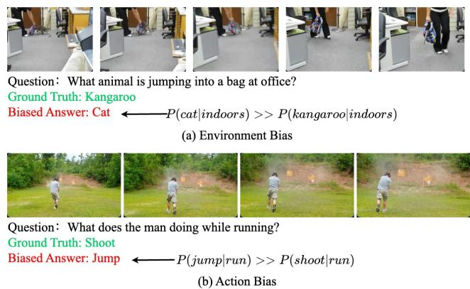  
Figure 1. Two examples show how dataset bias affects the answer. The biased answer is generated by HQGA [62]. Green and red denote the ground-truth and the biased answer for each question.

24] and multi-choice VideoQA [24, 61, 32].

As the core of VideoQA, video (V), question (Q), and the aligned feature between video and question (aligned feature for short, H) play essential roles in predicting answer (A). However, due to dataset bias, most of existing methods, which target at predicting answers directly from the observational probability P(A|V, Q, H), will be inevitably misled to spurious correlation, and have trouble in revealing the causal relation between the V, Q, H, and A. In Figure 7, we show two examples to explain how dataset bias affects the answer prediction. For example, in Figure 7 (a), since the kangaroo can rarely appear indoors, the model would ignore the “unique jumping pose” and the “distinct wobble of tail” from the kangaroo, and regard it as a cat. Furthermore, dataset bias is from nature (Zipf’s law [60] and social conventions [19]), i.e., more cats are indoors, and more kangaroos are outdoors. Therefore, simply enlarging the dataset would never eliminate dataset bias. To this end, we focus on dataset bias in VideoQA task and exploit the concepts of confounder to analyze and alleviate this problem.

The causal graph of the VideoQA pipeline is illustrated in Figure 2 (a), where V, Q, H, A, and C represent video, question, aligned feature, answer, and confounder, respectively. $\nu  \mathcal { Q }$ indicates that the question is proposed based on the video. $\mathcal { V } \to \mathcal { H }  \mathcal { Q }$ indicate that the video and question generate the aligned feature. $\mathcal { Q } \right. \mathcal { A } \left. \mathcal { H }$ indicate that the answer is predicted based on the question and aligned feature. Confounder is a series of correlated concepts that appears simultaneously in the video, $e . g . \stackrel {  } { \textstyle \mathcal { I } } u m p ; r u n ^ { \prime \prime }$ “shoot;run”. Since the question and answer are both proposed based on video, we also regard the confounder as the result of video $( \mathcal { V } \to \mathcal { C } )$ , which controls the correlation between question and answer $( \mathcal { Q } \left. \mathcal { C } \right. \mathcal { A } )$ . To quantify the effect of confounder, we collect the objects, actions from videos, and nouns, verbs, and adjectives from questions as video and question concepts. Then, we calculate the conditional probability of answers given question and video concepts, and show some examples in Figure 3. Due to the existence of confounder, like the co-occurence $" g u i t a r ; m a n " ,$ apart from the legitimate path from Q and H to A, the backdoor path $\mathcal { Q } \left. \mathcal { C } \right. \mathcal { A }$ and $\mathcal { H }  \mathcal { Q }  \mathcal { C }  \mathcal { A }$ also affect answer prediction. Since $P ( m a n | g u i t a r )$ is dominantly more than P(woman|guitar) for training instances, then $P ( \mathcal { A } | \mathcal { V } , \mathcal { Q } , \mathcal { H } )$ based on video with “guitar” tends to score $" m a n "$ much higher than “woman”. Therefore, if we only focus on observational probability $P ( \mathcal { A } | \mathcal { V } , \mathcal { Q } , \mathcal { H } )$ without considering the effect of confounder, the model will inevitably be misled by dataset bias.

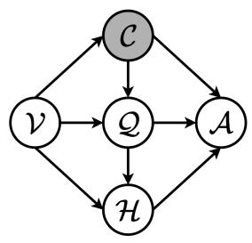

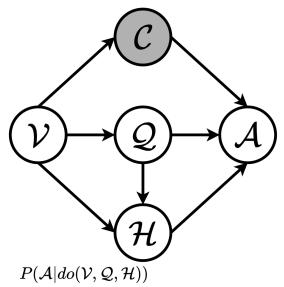

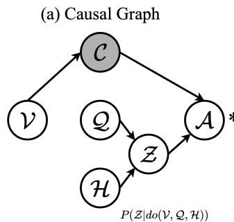

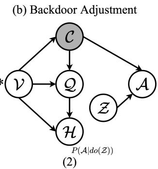  
(c) Front-door Adjustment  
Figure 2. The causal graph and causal intervention for VideoQA.

To remove the effect of confounder, we exploit the do-calculus [42] to actively intervene the value of $\nu , \mathcal { Q } , \mathcal { H }$ , where we have two choices, the backdoor adjustment (Section 3.2) and the front-door adjustment (Section 3.3). Backdoor adjustment [56, 48, 34] is widely used in causal intervention for its intuitive formulation, $\begin{array} { r } { i . e . , P ( A | d o ( \mathcal { V } , \mathcal { Q } , \mathcal { H } ) ) = \sum _ { c } P ( A | \mathcal { V } , \mathcal { Q } , \mathcal { H } , c ) P ( c ) } \end{array}$ (Figure 2 (b)). However, the backdoor adjustment requires confounder to be observable and enumerable, which cannot be implemented in VideoQA. Therefore, we implement causal intervention with front-door adjustment by introducing an intermediate variable, the knowledge proxy ${ \mathcal { Z } } ,$ in the causal graph, where no prior knowledge for confounder is required. The front-door adjustment decomposes the causal intervention into two parts (Figure 2 (c)), i.e., $\begin{array} { r } { P ( \boldsymbol { \mathcal { A } } | \boldsymbol { d o } ( \mathcal { V } , \boldsymbol { \mathcal { Q } } , \mathcal { H } ) ) = \sum _ { z } P ( z | \boldsymbol { d o } ( \mathcal { V } , \boldsymbol { \mathcal { Q } } , \mathcal { H } ) ) P ( \boldsymbol { \mathcal { A } } | \boldsymbol { d o } ( z ) ) } \end{array}$

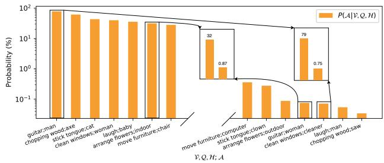  
Figure 3. The conditional probability of answers given question or video concepts in MSVD-QA. Since the distribution of the conditional probabilities is wide, we use logarithmic axis. Only several examples are visualized to avoid clutter. Best viewed by zoom-in.

The intermediate variable Z in Figure 2 (c) is the proxy to Q and H, which should summarize the information of question (Q), and aligned feature (H) and cover the knowledge for answer prediction. Towards this end, we name our framework as Knowledge Proxy Intervention (KPI) framework, which is a model-agnostic framework for the causal inference of VideoQA and aims to alleviate the effects of dataset bias. Note that some works [35, 34] also explore dataset bias from the aspect of complement frame and causal frame, i.e., whether the frames in the video are related to question answering. However, the frame-level bias is only one kind of dataset bias, and even in the causal scene, there is still dataset bias, as shown in Figure 7. In this way, our KPI framework is fundamentally different from existing causal VideoQA methods [35, 34], which are domainspecific and comply with observed-confounder assumption.

In this paper, we propose KPI framework, an implementation of front-door adjustment, which is model-agnostic and can help current methods to mitigate spurious correlations from dataset bias. In particular, given that knowledge proxy and its representation are not pre-defined, we propose a series of practical approximations in Section 4. The effectiveness of KPI framework is corroborated by comprehensive experiments with three baseline methods (CoMem [12], HGA [26], and HQGA [62]) on five benchmark datasets (MSVD-QA [65], MSRVTT-QA [65], TGIF-QA [24], NExT-QA [61], and Causal-VidQA [32]). Our main contributions are summarized as follows:

• We focus on dataset bias and provide a thorough analysis of how dataset bias affects the answer prediction using the causal graph.

• To alleviate the effect of dataset bias, we exploit frontdoor adjustment and propose our model-agnostic KPI framework to implement the causal intervention.

• Comprehensive experiments with three baseline methods on five benchmark datasets reveal that our framework significantly boosts the state-of-the-art methods.

## 2. Related Work

## 2.1. Video Question Answering

VideoQA, as the core of visual-language representation [31, 14, 30, 3, 37, 4] and reasoning [39, 69, 35, 34], aims to answer the question based on dynamic visual content. To this end, the VideoQA benchmarks start from the problem of description [66, 24, 29] and then build more challenging datasets towards temporal reasoning [6], physical reasoning [71], evidence reasoning [61], and commonsense reasoning [32]. Although the architecture of VideoQA methods has changed significantly in recent years, the core of VideoQA methods is still video representation, question representation, and video-question aligned representation. For video representation, early efforts [24, 12] usually exploit the appearance feature [18] and motion feature [64] along with Recurrent Neural Network (RNN) [20] or Transformer [54]. As the development of object-level representation, MIN [27] and MASN [51] introduce the bounding-box feature into video representation. For question representation, most existing works utilize word embedding [47] along with RNN. As the improvement of pre-trained language model, BERT feature [8] is exploited by NExT-QA [61] and then becomes widely used in recent works [62, 35, 34, 63]. For video-question aligned representation, early efforts tend to implement alignment through cross-modal attention [33, 13] or memory network [12, 9]. As the graph models are introduced into VideoQA, graph reasoning [22, 26, 40, 38, 15, 55, 5] is explored more in video-question alignment. Recently, the natural hierarchical structure [28, 16, 45, 7, 46] of video, i.e., object-appearance-motion and appearance-motion, also draws more and more attention. Among them, HCRN [28] proposes conditional relation block and stacks it to capture information from different video intervals, whereas MSPAN [16] establishes cross-scale feature interaction on top of the hierarchy. HQGA [62] and VGT [63] align question and video hierarchy from low-level visual entities to high-level activities.

Some works also look into the scene bias [35, 34] or atemporal VideoQA [2], which focuses on the observed and enumerable bias. Unlike them, we are the first to study dataset bias in VideoQA from a general viewpoint and require no prior knowledge about the confounder.

## 2.2. Causal Inference

Causal inference [43, 50] provides us with a powerful tool to analyze the dataset bias and mitigate spurious correlations, which can be divided into deconfounding [57, 73, 70, 69, 36] and counterfactual inference [10, 74, 58, 39]. Besides, it has been used in various learning tasks, including image classification [57], image segmentation [73], image caption [70, 36], image question answering [39], language understanding [10], dialogue system [74], and recommendation system [58], which not only enables deep learning methods with the ability to learn causal effects but also boosts the performance of current methods. The generic way is to disentangle all variables in the target task and model the causal effects among variables on causal graph.

Some works also study front-door adjustment [70, 69], which focus on either description towards image [69] or confounding effect within models, like Transformer [70]. Different from them, we focus on description, evidence reasoning, and commonsense reasoning towards video and are the first to apply front-door adjustment to mitigate the spurious correlations within dataset bias in VideoQA.

## 3. Causal Intervention

In this section, we introduce the concepts of causal inference [41, 44], including the confounder (Section 3.1), the backdoor adjustment (Section 3.2), and the front-door adjustment (Section 3.3). In the following sections, we use boldface lower letter, (v, q, h, z), to represent the feature vector, boldface capital letter, (V, Q, H, Z), to represent the feature space, and the calligraphic letter, (V, Q, H, Z), to represent the variable in the causal graph. More background and detailed derivation are in Supplementary Material.

## 3.1. Confounder

The observational probability can be formulated as

$$
P ( A | \mathcal { V } , \mathcal { Q } , \mathcal { H } ) { = } \sum _ { \mathbf { c } } P ( A | \mathcal { V } , \mathcal { Q } , \mathcal { H } , \mathbf { c } ) P ( \mathbf { c } | \mathcal { V } , \mathcal { Q } , \mathcal { H } ) ,\tag{1}
$$

where c is the split of the confounder, like the environment or the action. During training, it is much easier for current methods to recognize some of the video and question concepts, and ignore the characteristic of other video and question concepts. Therefore, during inference, current methods tend to directly predict the answer based on co-occurrences with those recognized concepts instead of reasoning from the videos and questions, i.e., a partition in C dominates the $P ( \mathcal { A } | \mathcal { V } , \mathcal { Q } , \mathcal { H } )$ by $P ( \mathbf { c } | \mathcal { V } , \mathcal { Q } , \mathcal { H } )$ . For example, in Figure 7 (b), since run co-occurs much more with jump than shoot, once the model detects run, it would predict the answer as jump without noticing the fallen board or the dirt around the board. Therefore, if we train the model based on observational probability, the confounder will mislead the model to spurious correlations.

## 3.2. Backdoor Adjustment

The technique of do-calculus is introduced in [43, 44]. Specifically, $d o ( \mathcal { V } , \mathcal { Q } , \mathcal { H } )$ denotes that we actively assign values to variable V, Q, H, rather than passively observe them. As illustrated in Figure ${ \mathrm { ~ 2 ~ } } ( \mathbf { b } ) , d o ( \mathcal { V } , \mathcal { Q } , \mathcal { H } )$ indicates that we need to cut all incoming arrows to $\nu , \mathcal { Q } , \mathcal { H } .$ , and make the $\nu , \mathcal { Q } , \mathcal { H }$ independent to the confounder C. Note that, all backdoor path from V, Q, H to A is from ${ \mathcal { C } } \to { \mathcal { Q } } .$ and do-calculus only needs to cut $\mathcal { C }  \mathcal { Q }$ to prevent the backdoor path $\mathcal { Q } \left. \mathcal { C } \right. A$ and $\mathcal { A }  \mathcal { Q }  \mathcal { C }  \mathcal { A } .$ . Therefore, the formulation of $P ( \mathcal { A } | d o ( \mathcal { V } , \mathcal { Q } , \mathcal { H } ) )$ is derivated as

$$
\begin{array} { r l } & { P ( \boldsymbol { A } | d o ( \mathcal { V } , \mathcal { Q } , \mathcal { H } ) ) ; } \\ & { \ = \displaystyle \sum _ { \mathbf { c } } P ( \boldsymbol { A } | d o ( \mathcal { V } , \mathcal { Q } , \mathcal { H } ) , \mathbf { c } ) P ( \mathbf { c } | d o ( \mathcal { V } , \mathcal { Q } , \mathcal { H } ) ) ; } \\ & { \ = \displaystyle \sum _ { \mathbf { c } } P ( \boldsymbol { A } | \mathcal { V } , \mathcal { Q } , \mathcal { H } , \mathbf { c } ) P ( \mathbf { c } ) . } \end{array}\tag{2}
$$

The formulation of backdoor adjustment is intuitive and elegant. However, this formulation requires observing and enumerating all the factors in the confounder. Since dataset bias is very complex, it is impossible to disentangle all factors within the confounder. For example, in Figure 7, we can find two kinds of biases, $i . e .$ , the environment bias and the action bias, each of which contains many concrete items. Besides, dataset bias is not brought by only one type of bias independently but more likely by the combinations of different types of biases, like run indoors, run outdoors, jump indoors,jump outdoors, etc. Furthermore, using pre-trained model without pre-training data also prevents us from realizing potential confounder. Therefore, it is nearly impossible to get a reasonable split of the confounder C for backdoor adjustment.

## 3.3. Front-door Adjustment

Different from the backdoor adjustment, front-door adjustment can also be used to implement $P ( \mathcal { A } | d o ( \mathcal { V } , \mathcal { Q } , \mathcal { H } ) )$ with which we do not need to split the confounder C. As illustrated in Figure $2 \ ( \mathrm { c } )$ , to apply the front-door adjustment, an additional intermediate variable Z should be inserted between $\mathcal { Q } , \mathcal { H }$ and A to construct front-door paths $\mathcal { Q }  \mathcal { Z }  \mathcal { A }$ and $\mathcal { H }  \mathcal { Z }  \mathcal { A }$ . The causal intervention is then decomposed into two parts:

$$
\begin{array} { r l } {  { P ( \mathcal { A } | d o ( \mathcal { V } , \mathcal { Q } , \mathcal { H } ) ) } } \\ & { = \sum _ { \mathbf { z } } P ( \mathbf { z } | d o ( \mathcal { V } , \mathcal { Q } , \mathcal { H } ) ) P ( \mathcal { A } | d o ( \mathbf { z } ) ) . } \end{array}\tag{3}
$$

The first term in front-door adjustment is formulated as

$$
\begin{array} { r } { P ( \mathbf { z } | d o ( \mathcal { V } , \mathcal { Q } , \mathcal { H } ) ) = P ( \mathbf { z } | \mathcal { V } , \mathcal { Q } , \mathcal { H } ) = P ( \mathbf { z } | \mathcal { Q } , \mathcal { H } ) , } \end{array}\tag{4}
$$

and the second term is formulated as

$$
\begin{array} { r l r } {  { P ( \mathcal { A } | d o ( \mathbf { z } ) ) } } \\ & { = \sum _ { \mathbf { v } } \sum _ { \mathbf { q } } \sum _ { \mathbf { h } } P ( \mathcal { A } | \mathbf { z } , \mathbf { q } , \mathbf { h } , \mathbf { v } ) P ( \mathbf { q } , \mathbf { h } , \mathbf { v } ) , } & { ( 5 } \\ & { = \sum _ { \mathbf { v } } \sum _ { \mathbf { q } } \sum _ { \mathbf { h } } P ( \mathcal { A } | \mathbf { z } , \mathbf { q } , \mathbf { h } , \mathbf { v } ) P ( \mathbf { v } ) P ( \mathbf { q } | \mathbf { v } ) P ( \mathbf { h } | \mathbf { q } , \mathbf { v } ) , } & \end{array}
$$

where $\mathbf { v } , \mathbf { q } ,$ h represents all the possible representations in video, question, and aligned feature space.

To sum up, by applying Equation 4 and 5 into Equation 3, we have the front-door adjustment:

$$
\begin{array} { r l r } {  { P ( \mathcal { A } | d o ( \mathcal { V } , \mathcal { Q } , \mathcal { H } ) ) } } \\ & { = \sum _ { \mathbf { v } } P ( \mathbf { v } ) { \displaystyle \sum _ { \mathbf { q } } P ( \mathbf { q } | \mathbf { v } ) } \sum _ { \mathbf { h } } P ( \mathbf { h } | \mathbf { q } , \mathbf { v } ) { \displaystyle \sum _ { \mathbf { z } } P ( \mathbf { z } | \mathcal { Q } , \mathcal { H } ) } P ^ { * } ( \mathcal { A } ) , } \\ & { = \mathbb { E } _ { \mathbf { v } } \mathbb { E } _ { [ \mathbf { q } | \mathbf { v } ] } \mathbb { E } _ { [ \mathbf { h } | \mathbf { q } , \mathbf { v } ] } \mathbb { E } _ { [ \mathbf { z } | \mathcal { Q } , \mathcal { H } ] } P ^ { * } ( \mathcal { A } ) , } & { ( 6 ) } \end{array}
$$

where $P ^ { * } ( A ) = P ( A | \mathbf { v } , \mathbf { q } , \mathbf { h } , \mathbf { z } )$ . By applying the Normalized Weighted Geometric Mean (NWGM) [53, 67], the outer expectation is moved into feature level:

$$
\begin{array} { r l } & { P ( \boldsymbol { A } | d o ( \mathcal { V } , \mathcal { Q } , \mathcal { H } ) ) } \\ & { = \mathbb { E } _ { \mathbf { v } } \mathbb { E } _ { [ \mathbf { q } | \mathbf { v } ] } \mathbb { E } _ { [ \mathbf { h } | \mathbf { q } , \mathbf { v } ] } \mathbb { E } _ { [ \mathbf { z } | \mathcal { Q } , \mathcal { H } ] } [ P ( \boldsymbol { A } | \mathbf { v } , \mathbf { q } , \mathbf { h } , \mathbf { z } ) ] } \\ & { = \mathbb { E } _ { \mathbf { v } } \mathbb { E } _ { [ \mathbf { q } | \mathbf { v } ] } \mathbb { E } _ { [ \mathbf { h } | \mathbf { q } , \mathbf { v } ] } \mathbb { E } _ { [ \mathbf { z } | \mathcal { Q } , \mathcal { H } ] } [ \mathrm { S o f t m a x } [ g ( \mathbf { v } , \mathbf { q } , \mathbf { h } , \mathbf { z } ) ] ] \quad ( 7 ) } \\ & { \approx \mathrm { S o f t m a x } [ g ( \mathbb { E } _ { \mathbf { v } } [ \mathbf { v } ] , \mathbb { E } _ { [ \mathbf { q } | \mathbf { v } ] } [ \mathbf { q } ] , \mathbb { E } _ { [ \mathbf { h } | \mathbf { q } , \mathbf { v } ] } [ \mathbf { h } ] , \mathbb { E } _ { [ \mathbf { z } | \mathcal { Q } , \mathcal { H } ] } [ \mathbf { z } ] ) ] , } \end{array}
$$

where $g ( \cdot )$ is a fully-connect layer.

So far, we have introduced the reason for dataset bias $( i . e .$ , the confounder C and the backdoor path) and the theoretical solution: front-door adjustment.

## 4. Methodology

In this section, we will introduce the implementation of Equation 7 from two aspects, the knowledge space along with the other three feature spaces (Section 4.1) and the approximation of the expectation (Section 4.2). In Section 4.3, we will introduce the overall pipeline of KPI framework.

## 4.1. Knowledge Space and Feature Spaces

Knowledge Space Z. As explained in Section 1, the VideoQA model would be misled by dataset bias and ignore the causal relation between video-question and the answer. Therefore, in knowledge space Z, we aim to separate the causal relations from correlations. Towards this end, we propose to first extract the correlated concepts from videoquestions and answers, and then select the causal relations with existing knowledge graphs. In detail, we propose to build the knowledge space Z in the following steps,

1. For each training instance, we extract the actions and objects from video with I3D ResNeXt-101 [64, 17] and

Faster R-CNN [49] as video concepts $( C _ { v _ { i } } )$ , extract the key words and phrases with NLTK [1] from question as question concepts $( C _ { q _ { i } } )$ . Besides, we extract key words and phrases with NLTK [1] for multi-choice answers, and directly keep the answer for open-ended answers as answer concepts $( C _ { a _ { i } } )$

2. For each training instance, we generate the correlated concepts (head-tail, h-t) from $C _ { v _ { i } } , C _ { q _ { i } }$ , and $C _ { a _ { i } } ,$ where $h \in C _ { v _ { i } } \cup C _ { q _ { i } }$ and $t \in C _ { a _ { i } }$

3. For all training instances, we collect all the correlated concepts to initialize knowledge space Z.

4. For each correlated concept (h-t) in knowledge space, if the h and t are adjacent nodes in existing knowledge graphs, the correlated concept is expanded with the node relation as a causal concept (head-relationtail, $h \mathrm { - } r \mathrm { - } t ) ;$ otherwise, it is removed from knowledge space.

5. For each causal concept in knowledge space, we transform it into trainable knowledge embedding vectors with pre-trained BERT [8].

More details about knowledge space are in Supplementary.

For knowledge graphs, we explore ConceptNet [52] and Atomic [23] to select the causal concepts, where Concept-Net focuses on physical-entity relations and Atomic concentrates on event-centered and social-interaction relations.

Furthermore, each knowledge embedding vector from the knowledge space cannot solely emphasize the information from the video and the question or infer the answer. However, combining multiple knowledge embedding vectors, the knowledge space could provide enough clues to summarize Q and H and reflect the causal relations for question answering simultaneously. To this end, the KPI framework will first use the question features and aligned features to softly retrieve the related knowledge embedding vectors $( \mathcal { Q } \right. \mathcal { Z } \left. \mathcal { H } )$ and then exploit these knowledge embedding vectors to predict the answer $( { \mathcal { Z } } \to A )$

Video Feature Space V. For each video, there are three types of features exploited in current methods, $i . e .$ , the motion feature from clips, the appearance feature from frames, and the bounding-box feature from objects. For each type of feature, we first collect all the feature vectors from the whole training set based on different feature extractors $( i . e .$ I3D ResNeXt-101 for motion feature, ResNet-152 for appearance feature, and Faster R-CNN for bounding-box feature), and then apply the k-means algorithm to reduce the number of feature vectors within each type of video subembeddings to $k _ { V }$ . Therefore, the video feature space has three sub-spaces, i.e., the motion feature space ${ \mathbf { V } } _ { m }$ , the appearance feature space ${ \bf V } _ { a }$ , and the bounding-box feature space $\mathbf { V } _ { o }$ . Since different baseline methods use different types of video features, the video feature space is decided by the input of each method. For example, for CoMem [12] and HGA [26], V is the appearance feature space ${ \bf V } _ { a }$ and the motion feature space $\mathbf { V } _ { m } ;$ for HQGA [62], V is the bounding-box feature space $\mathbf { V } _ { o } ,$ the appearance feature space $\mathbf { V } _ { a } .$ , and the motion feature space ${ \mathbf { V } } _ { m }$

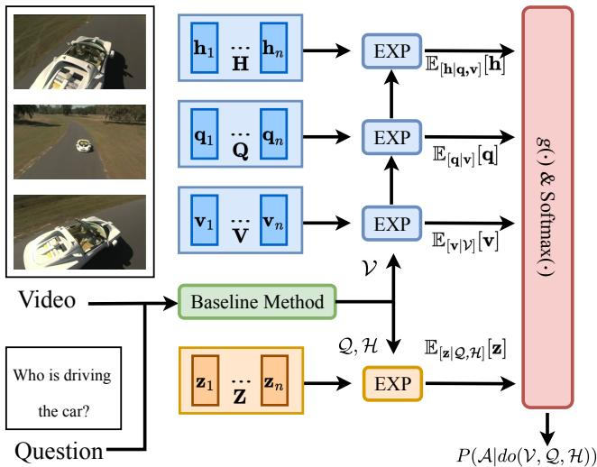  
Figure 4. The illustration of KPI framework. Given video and question, we first use the baseline method to extract and align video-question features. Then, Q, H and V along with four feature spaces are sent to EXP modules, along with the fully-connected layer $( g ( \cdot ) )$ and Softmax layer to implement Equation 7. For simplicity, we only show one EXP module for $\mathbb { E } _ { [ \mathbf { v } | \nu ] } [ \mathbf { v } ]$

Question Feature Space Q. For question feature space, we first extract question features with fine-tuned BERT. For each question, the question feature $\mathbf { Q } _ { i } \in \mathbb { R } ^ { n _ { q _ { i } } \times d _ { q } }$ is then average-pooled along the question sequence to get the question vector $\mathbf { q } _ { i } ~ \in ~ \mathbb { R } ^ { d _ { q } }$ . Finally, the k-means algorithm is applied to reduce the number of feature vectors to $k _ { Q }$

Aligned Feature Space H. The aligned feature is generated from video-question interaction, which cannot be directly extracted from uni-modal pre-trained model. To build the aligned feature space, we first rely on the baseline method by training a baseline model on observation probability, and then inferring the aligned vector for each video-question pair with the trained model. Like the video feature space and question feature space, the k-means algorithm is also applied to reduce the number of vectors into $k _ { H }$

## 4.2. Expectation

In Equation 7, we need to calculate $\mathbb { E } _ { \mathbf { v } } [ \mathbf { v } ] , \ \mathbb { E } _ { [ \mathbf { q } | \mathbf { v } ] } [ \mathbf { q } ]$ $\mathbb { E } _ { [ \mathbf { h } | \mathbf { q } , \mathbf { v } ] } [ \mathbf { h } ]$ , and $\mathbb { E } _ { [ \mathbf { z } | \mathcal { Q } , \mathcal { H } ] } [ \mathbf { z } ]$ , each of which is an approximation to the expectation in corresponding feature space. Here we use $\mathbb { E } _ { [ \mathbf { z } | \mathcal { Q } , \mathcal { H } ] } [ \mathbf { z } ]$ as an example to show how the expectation is calculated with the EXP module. Given the knowledge space Z, we have $\begin{array} { r } { \mathbb { E } _ { [ { \mathbf { z } } | { \mathcal { Q } } , { \mathcal { H } } ] } [ { \mathbf { z } } ] ~ = ~ \sum _ { \mathbf { z } } P ( { \mathbf { z } } | { \mathcal { Q } } , { \mathcal { H } } ) { \mathbf { z } } , } \end{array}$ where the conditional distribution $P ( \mathbf { z } | \mathcal { Q } , \mathcal { H } )$ can be approximated by attention modules. Specifically, we explore three different kinds of attention mechanisms for this approximation, including channel attention [21], product attention [59], and multi-head attention [54]. The inputs of each attention module are the knowledge space ${ \textbf { Z } } =$ $[ \mathbf { z } _ { 1 } , . . . , \mathbf { z } _ { k _ { Z } } ]$ , and the concatenation of the question embedding and the aligned embedding $C a t ( \hat { \mathbf { q } } , \hat { \mathbf { h } } )$ from $\mathcal { Q }$ and $\mathcal { H } .$ For channel attention, it can be formulated as

$$
\begin{array} { r l } & { a _ { i } = \pmb { w } ^ { T } \mathrm { t a n h } ( \pmb { W } _ { 1 } \mathbf { z } _ { i } + \pmb { W } _ { 2 } C a t ( \hat { \mathbf { q } } , \hat { \mathbf { h } } ) ) , } \\ & { } \\ & { \pmb { \alpha } = \mathrm { s o f t m a x } ( \mathbf { a } ) , \bar { \mathbf { z } } = \displaystyle \sum _ { i = 1 } ^ { k _ { \mathbf { z } } } \alpha _ { i } \mathbf { z } _ { i } , } \end{array}\tag{8}
$$

where $w ^ { T } , W _ { 1 }$ and $W _ { 2 }$ are trainable parameters. For product attention, it can be formulated as

$$
\bar { \mathbf { z } } = \mathrm { s o f t m a x } ( \frac { C a t ( \hat { \mathbf { q } } , \hat { \mathbf { h } } ) W _ { 1 } ( \mathbf { Z } W _ { 2 } ) ^ { T } } { \sqrt { d _ { z } } } ) \mathbf { Z } W _ { 3 } ,\tag{9}
$$

where $W _ { 1 } , \ W _ { 2 } ,$ and $W _ { 3 }$ are trainable parameters. For multi-head attention, it is formulated as

$$
\begin{array} { c } { { \displaystyle { \bf h e a d } ^ { k } = \mathrm { s o f t m a x } ( \frac { C a t ( \hat { \bf q } , \hat { \bf h } ) W _ { 1 } ^ { k } ( { \bf Z } W _ { 2 } ^ { k } ) ^ { T } } { \sqrt { d _ { z } } } ) { \bf Z } W _ { 3 } ^ { k } , } } \\ { { \bar { \bf z } = C a t ( { \bf h e a d } ^ { 1 } , . . . { \bf h e a d } ^ { 8 } ) W _ { o u t } , } } \end{array}\tag{10}
$$

where $W _ { 1 } ^ { k } , W _ { 2 } ^ { k } , W _ { 3 } ^ { k } , W _ { o u t }$ are trainable parameters, and we exploit eight heads here.

Note that although $\mathbb { E } _ { \mathbf { v } } [ \mathbf { v } ]$ does not condition on any variable, we still need to approximate $\mathbb { E } _ { \mathbf { v } } [ \mathbf { v } ]$ via $\mathbb { E } _ { [ \mathbf { v } | \nu ] } [ \mathbf { v } ]$ for each training instance. Otherwise, the approximated results will degrade into a single fixed vector for all different inputs. Expressly, for each video with different input features, i.e., motion, appearance, and bounding-box, we first adopt a self-attention layer along with average pooling to each type of video feature independently to get the video sub-embeddings, $i . e . , \hat { \mathbf { v } } _ { m } , \hat { \mathbf { v } } _ { a } ,$ and $\hat { \mathbf { v } } _ { o } .$ . Then we calculate $\mathbb { E } _ { [ \mathbf { v } | \nu ] } [ \mathbf { v } ]$ on each video sub-space with the corresponding video sub-embedding. More details about the video subembeddings can be found in Supplementary Material.

## 4.3. Knowledge Proxy Intervention

The structure of our Knowledge Proxy Intervention (KPI) framework is illustrated in Figure 4. Given the video and question, the baseline method (with the video and the question feature extractor) is utilized to get the video subembeddings, the question embedding, and the aligned embedding. Then the knowledge space, Z, along with the question embedding and the aligned embedding, is sent into the EXP module to calculate $\mathbb { E } _ { [ \mathbf { z } | \mathcal { Q } , \mathcal { H } ] } [ \mathbf { z } ]$ . Meanwhile, the video feature space V (with the video sub-embeddings), the question feature space $\mathbf { Q } ,$ and the aligned feature space H are sent into different EXP modules in turn to calculate the $\mathbb { E } _ { [ { \mathbf { v } } | \mathcal { V } ] } [ { \mathbf { v } } ] , \mathbb { E } _ { [ { \mathbf { q } } | { \mathbf { v } } ] } [ { \mathbf { q } } ]$ , and $\mathbb { E } _ { [ \mathbf { h } | \mathbf { q } , \mathbf { v } ] } [ \mathbf { h } ]$ . Finally, these four expectations are sent to the fully-connect layer, $i . e . , g ( \cdot )$ in Figure 4, with the Softmax layer to calculate the answer distribution, $P ( \mathcal { A } | d o ( \mathcal { V } , \mathcal { Q } , \mathcal { H } ) )$ . Given the video $\nu ,$ the question Q, the knowledge space $\mathbf { Z } ,$ the video feature space ${ \mathbf V } _ { o } , { \mathbf V } _ { a } , { \mathbf V } _ { m }$ , the question feature space $\mathbf { Q } ,$ and the aligned feature space H, the overall process is formulated as

$$
\begin{array} { r l } & { \hat { \bf h } , \hat { \bf q } , \hat { \bf v } _ { o } , \hat { \bf v } _ { a } , \hat { \bf v } _ { m } = { \mathrm { B a s e l i n e M e t h o d } } ( \mathcal { V } , \mathcal { Q } ) , } \\ & { \bar { \bf z } = \mathrm { E X P } ( { \bf Z } , C a t ( \hat { \bf { h } } , \hat { \bf q } ) ) , } \\ & { \bar { \bf v } _ { o } = \mathrm { E X P } ( { \bf v } _ { o } , \hat { \bf v } _ { o } ) , } \\ & { \bar { \bf v } _ { a } = \mathrm { E X P } ( { \bf V } _ { a } , \hat { \bf v } _ { a } ) , } \\ & { \bar { \bf v } _ { m } = \mathrm { E X P } ( { \bf V } _ { m } , \hat { \bf v } _ { m } ) , } \\ & { \bar { \bf q } = \mathrm { E X P } ( { \bf Q } , C a t ( \bar { \bf v } _ { o } , \bar { \bf v } _ { a } , \bar { \bf v } _ { m } ) ) , } \\ & { \bar { \bf h } = \mathrm { E X P } ( { \bf H } , C a t ( \bar { \bf v } _ { o } , \bar { \bf v } _ { a } , \bar { \bf v } _ { m } , \bar { \bf q } ) ) , } \\ & { P ( \mathcal { A } | d o ( \mathcal { V } , \mathcal { Q } , \mathcal { H } ) ) = \mathrm { s o f t m a x } ( g ( \bar { \bf z } , \bar { \bf v } _ { o } , \bar { \bf v } _ { a } , \bar { \bf v } _ { m } , \bar { \bf q } , \bar { \bf b } ) ) . } \end{array}
$$

When training the KPI framework, we minimize the cross-entropy loss by using $P ( \mathcal { A } ^ { * } | d o ( \mathcal { V } , \mathcal { Q } , \mathcal { H } ) )$ as the target, i.e., $\mathcal { L } = - l o g P ( \mathcal { A } ^ { * } | d o ( \mathcal { V } , \mathcal { Q } , \mathcal { H } ) )$ , where $\mathcal { A } ^ { \ast }$ indicates the ground-truth answer.

## 5. Experiments

## 5.1. Experiment Settings

Datasets. We conduct experiments on five benchmark datasets that focus on the VideoQA from different aspects: MSVD-QA [65] and MSRVTT-QA [65] focus on the descriptive question, where QA pairs are automatically generated from the corresponding video captions datasets. TGIF-QA [24] splits the dataset into three subsets and emphasizes the action recognition, temporal state transition, and framelevel description, respectively. NExT-QA [61] features description, temporal relation, and evidence reasoning among multiple objects. Causal-VidQA [32] challenges the reasoning ability from both evidence and commonsense. More details about the dataset statistics and implementation can be found in Supplementary Material.

Baseline Methods. Current VideoQA methods for videquestion alignment can be divided into three categories, 1) the Memory-based methods that maintain a memory bank to boost the representation of video and question, e.g., CoMem [12], and HME [9]; 2) the Graph-based methods that exploit the graph networks to model the intraand inter-relations between video and question, e.g., L-GCN [22], HGA [26], and B2A [40]; 3) the Hierarchybased methods that study the multi-granularity natural hierarchy structure of video to enhance the video-question interaction, e.g., HCRN [28], MSPAN [16], HOSTR [7], and HQGA [62]. 4) the Video-Language pre-trained method that explore multiple task, like VideoQA, video caption, and video-image retrieval to enhance video-language alignment in pre-trained model, e.g. VIOLET [11], JustAsk [68], and MERLOT [72]. To validate the generalization of our KPI framework, we migrate three baseline methods from different categories: CoMem [12] (memory), HGA [26] (graph), and HQGA [62] (hierarchy). Besides, we also compare with two causal VideoQA methods, IGV [35] and EIGV [34].

<table><tr><td colspan="2">Model</td><td rowspan="2">MSVD-QA</td><td rowspan="2">MSRVTT-QA</td><td colspan="3">TGIF-QA</td><td rowspan="2">NExT-QA</td><td rowspan="2">Causal-VidQA</td></tr><tr><td></td><td></td><td>Action</td><td>Transition</td><td>FrameQA</td></tr><tr><td rowspan="3">Memory- based Graph-</td><td>CoMem [12]</td><td>34.7</td><td>35.1</td><td>70.3</td><td>76.6</td><td>53.4</td><td>48.5</td><td>47.7</td></tr><tr><td>HME [9]</td><td>33.7</td><td>33.0</td><td>73.9</td><td>77.8</td><td>53.8</td><td>49.2</td><td>46.2</td></tr><tr><td>L-GCN [22]</td><td>34.3</td><td>33.7</td><td>74.3</td><td>81.1</td><td>56.3</td><td>49.5</td><td></td></tr><tr><td rowspan="3">based</td><td>HGA [26]</td><td>36.7</td><td>36.8</td><td>76.3</td><td>82.1</td><td>56.6</td><td>50.0</td><td>48.9</td></tr><tr><td>B2A [40]</td><td>37.2</td><td>36.9</td><td>75.9</td><td>82.6</td><td>57.5</td><td></td><td>49.1</td></tr><tr><td>HCRN [28]</td><td>36.1</td><td>35.6</td><td>75.1</td><td>81.2</td><td>55.7</td><td>48.9</td><td>48.1</td></tr><tr><td rowspan="4">Hierarchy- based Scene</td><td>MSPAN [16]</td><td>40.3</td><td>37.8</td><td>78.4</td><td>83.3</td><td>59.7</td><td></td><td></td></tr><tr><td>HOSTR [7]</td><td>39.4</td><td>35.9</td><td>75.6</td><td>83.0</td><td>58.2</td><td>50.7</td><td></td></tr><tr><td>HQGA [62]</td><td>41.2</td><td>38.6</td><td>76.9</td><td>85.6</td><td>61.3</td><td>51.8</td><td>52.9</td></tr><tr><td>IGV [35]</td><td>40.8</td><td>38.3</td><td></td><td>一</td><td>-</td><td>51.3</td><td></td></tr><tr><td>Bias</td><td>EIGV [34]</td><td>42.6</td><td>39.3</td><td></td><td></td><td></td><td>53.7</td><td></td></tr><tr><td rowspan="3">Ours</td><td>CoMem + KPI</td><td> $4 0 . 0 ^ { + 5 . 3 }$ </td><td> $3 7 . 6 ^ { + 2 . 5 }$ </td><td> $7 3 . 4 ^ { + 3 . 1 }$ </td><td> $8 0 . 0 ^ { + 3 . 4 }$ </td><td> $\overline { { 5 6 . 3 ^ { + 2 . 9 } } }$ </td><td> $5 2 . 1 ^ { + 3 . 6 }$ </td><td> $\overline { { 5 1 . 3 ^ { + 3 . 6 } } }$ </td></tr><tr><td> $\mathrm { H G A } + \mathrm { K P I }$ </td><td> $4 1 . 2 ^ { + 4 . 5 }$ </td><td> $3 9 . 1 ^ { + 2 . 3 }$ </td><td> $7 8 . 7 ^ { + 2 . 4 }$ </td><td> $8 5 . 0 ^ { + 2 . 9 }$ </td><td> $5 9 . 1 ^ { + 2 . 5 }$ </td><td> $5 4 . 1 ^ { + 4 . 1 }$ </td><td> $5 2 . 7 ^ { + 3 . 8 }$ </td></tr><tr><td> $\mathrm { H Q G A } + \mathrm { K P I }$ </td><td> $4 3 . 3 ^ { + 2 . 1 }$ </td><td> ${ \bf 4 0 . 0 ^ { + 1 . 4 } }$ </td><td> $\mathbf { 7 9 . 3 ^ { + 2 . 4 } }$ </td><td> $\mathbf { 8 8 . 3 ^ { + 2 . 7 } }$ </td><td> ${ \bf 6 3 . 0 ^ { + 1 . 7 } }$ </td><td> ${ \bar { \mathbf { 5 5 . 0 } } } ^ { + 3 . 2 }$ </td><td> ${ \pmb 5 6 . 7 ^ { + 3 . 8 } }$ </td></tr></table>

Table 1. Comparison with baseline methods on five datasets. Best results on each dataset are highlighted in bold. The improvement towards baseline method are highlight in red.

<table><tr><td rowspan="2">Model</td><td colspan="2">MSVD-QA MSRVTT-QA</td><td colspan="2"></td><td colspan="2">NExT-QA</td><td colspan="2">Causal-VidQA</td></tr><tr><td></td><td>+KPI</td><td>一</td><td>+KPI</td><td></td><td>+KPI</td><td></td><td>+KPI</td></tr><tr><td>VIOLET</td><td>47.9</td><td>48.4</td><td>43.9</td><td>44.8</td><td>54.6* 55.9</td><td></td><td> $\overline { { 5 8 . 6 ^ { * } } }$ </td><td>59.3</td></tr><tr><td>JustAsk</td><td>46.3</td><td>47.4</td><td>41.5</td><td>42.8</td><td>52.9* 54.8</td><td></td><td>57.8*</td><td>58.4</td></tr><tr><td>MERLOT 46.9*</td><td></td><td>47.8</td><td>43.1</td><td>44.4</td><td>54.3*55.7</td><td></td><td>58.4*</td><td>59.0</td></tr></table>

Table 2. Comparison with VIOLET [11], JustAsk [68], and MER-LOT [72] on MSVD-QA [65], MSRVTT-QA [65], NExT-QA [61], and Causal-VidQA [32]. \*: reproduced with official code.

## 5.2. Main Results

In Table 1, we summarize the results of SOTA methods and those with our KPI framework on five benchmark datasets, i.e., MSVD-QA, MSRVTT-QA, TGIF-QA, NExT-QA, and Causal-VidQA. Note that we use the multi-head attention module as the EXP module in Table 1. Compared across datasets and methods, our observations and analyses can be summarized as follows:

(1) On all benchmark datasets and for all baseline methods, our KPI framework outperforms the baseline methods by a large margin (+1.4%∼+5.3%), which proves both the generalization ability and model-agnostic property of our KPI framework. As a derivation and extension of causal intervention, the distinct improvements further prove the effectiveness and generalization of front-door adjustment from both theoretical and empirical aspects.

(2) Comparing the improvements among different baseline methods, we notice that our KPI framework improves more on CoMem (2.5%∼5.3%) and HGA (2.3%∼4.5%) than HQGA (1.4%∼3.8%). We suspect that the extra boundingbox feature and hierarchy interaction between video and question not only enhance the robustness of HQGA, but also help reduce the spurious correlations.

<table><tr><td rowspan="2"></td><td rowspan="2">Setting</td><td colspan="2">MSVD-QA NExT-QA</td></tr><tr><td>HGA HQGA</td><td>HGA HQGA</td></tr><tr><td>1</td><td rowspan="2">Baseline KPI</td><td>36.7</td><td>41.2 50.0 51.8 43.3 54.1 55.0</td></tr><tr><td>2</td><td>41.2</td></tr><tr><td>3 4</td><td>C-Att EXP P-Att</td><td>40.5 41.5</td><td>52.8 53.9 54.2</td></tr><tr><td>5</td><td rowspan="4"></td><td>40.9 40.6</td><td>42.3 53.3 42.7 53.4 54.5</td></tr><tr><td>6</td><td>Con Atomic 40.1</td><td>42.2 53.8 54.8</td></tr><tr><td>Knowledge 7</td><td>*Con+Atomic</td><td>41.9</td></tr><tr><td>Space</td><td>40.2</td><td>54.5 55.5</td></tr><tr><td>8</td><td> $^ { * } \mathrm { C o n }$ </td><td>39.8</td><td>41.6 53.8</td><td>54.6</td></tr><tr><td>9</td><td> $^ { * } \mathrm { A t o m i c }$ </td><td>39.3</td><td>41.4 54.2</td><td>55.0</td></tr></table>

Table 3. Evaluation of the effectiveness of the EXP module and knowledge space. C-Att and P-Att indicate channel attention and product attention. Con, Atomic, and Con + Atomic indicate using the Conceptnet, Atomic, and both of them to filter correlated concepts. ∗ indicates the knowledge space of MSVD-QA and NExT-QA is mixed up. Best results are highlighted in bold.

(3) Comparing the improvements among different benchmark datasets, we observe our KPI framework achieves the largest improvement on MSVD-QA (2.1%∼5.2%) and achieves the smallest improvement on MSRVTT-QA (1.4%∼2.5%). The reason for such observation is that MSRVTT-QA and MSVD-QA are the largest and smallest dataset. The baseline methods tend to capture the spurious correlations and overfit the training set with fewer training instances. Furthermore, we conjecture that KPI framework performs better in a less generalized situation, leading to the improvement gap between MSVD-QA and MSRVTT-QA.

In Table 2, we further conduct experiment with videolanguage pre-trained models, where we can find that our KPI framework can boost the performance of the stronger baseline methods on these four datasets, which indicates the generalization ability of our framework in different situations. Compared among different baseline methods, our framework can achieve the most on NExt-QA and achieve the least on Causal-VidQA, which is about 1.3% - 1.9% and 0.6% - 0.7%, respectively. We suspect that the NExT-QA focuses more on evidence-based question-answering and the Causal-VidQA focuses more on commonsense-based question-answering, which make our deconfounding framework have less effect on the Causal-VidQA

## 5.3. Ablation study

In this section, we study the effects of different knowledge spaces, EXP modules, and hyper-parameters. All ablation experiments are conducted on MSVD-QA and NExT-QA with HGA and HQGA as baseline methods.

The effect of different knowledge spaces. We study the effect of knowledge space from two aspects in Table 3, i.e., the difference between knowledge graphs and the difference between sharing and separating knowledge spaces between datasets. Comparing line 2 v.s. 5 v.s. 6 and line 7 v.s. 8 v.s. 9, we observe that jointly using both ConceptNet and Atomic is better than only using one of them. Besides, ConceptNet works better than Atomic for MSVD-QA, however, Atomic works better than ConceptNet for NExT-QA. This is because the relations on ConceptNet are mainly about physical entities, whereas the relations on Atomic emphasize more on event and social interaction. Therefore, ConceptNet is more helpful for description, and Atomic contributes more on reasoning. Comparing line 2 v.s. 7, we notice that the tendency between MSVD-QA and NExT-QA is inconsistent. For MSVD-QA, sharing the knowledge spaces undermines our KPI framework, but for NExT-QA, sharing the knowledge spaces further boosts the performance. We suspect that the MSVD-QA focuses on relatively simple scenes, which only requires limited knowledge for answer prediction. Hence, the knowledge from NExT-QA would introduce more noise than information. On the contrary, the NExT-QA focus on relatively complex scenes with temporal and evidence reasoning question, which requires more knowledge for answer prediction, and the knowledge space from MSVD-QA would be complementary.

The effect of different EXP modules. We validate the effect of different EXP modules in Table 3. Comparing the performance among lines 2 v.s. 3 v.s. 4, we find that product attention outperforms channel attention, while multihead attention outperforms both of them. Regarding the difference between channel and product attention, product attention introduces 2nd-order interaction between key and query. In contrast, channel attention only exploits the 1storder interaction, which helps product attention produce more informative attention weight. Furthermore, on top of the 2nd-order interaction, multi-head attention introduces more diverse attention weights, which could capture different attention patterns within a single attention layer.

<table><tr><td rowspan="2"></td><td rowspan="2">Setting</td><td colspan="2">MSVD</td><td colspan="2">NExT-QA</td></tr><tr><td>HGA</td><td>HQGA</td><td>HGA</td><td>HQGA</td></tr><tr><td>1</td><td>Baseline</td><td>36.7</td><td>41.2</td><td>50.0</td><td>51.8</td></tr><tr><td>2</td><td>KPI</td><td>41.2</td><td>43.3</td><td>54.1</td><td>55.0</td></tr><tr><td>3</td><td>w/o V</td><td>40.7</td><td>42.9</td><td>53.6</td><td>54.6</td></tr><tr><td>4</td><td>w/o Q</td><td>40.6</td><td>42.6</td><td>53.5</td><td>54.2</td></tr><tr><td>5</td><td>w/o H</td><td>40.1</td><td>42.5</td><td>53.2</td><td>54.0</td></tr><tr><td>6</td><td>w/o Z</td><td>36.8</td><td>41.3</td><td>50.2</td><td>51.9</td></tr><tr><td>7</td><td>Z w/o Q</td><td>39.6</td><td>42.3</td><td>52.7</td><td>53.6</td></tr><tr><td>8</td><td>Z w/o H</td><td>38.2</td><td>41.9</td><td>51.8</td><td>52.8</td></tr></table>

Table 4. Evaluation of the effectiveness of different variables in answer prediction and Z construction. w/o $\mathbf { V } ,$ w/o Q, w/o H, and w/o Z indicates the $\mathbb { E } _ { \mathbf { v } } [ \mathbf { v } ] , \mathbb { E } _ { [ \mathbf { q } | \mathbf { v } ] } [ \mathbf { q } ] , \mathbb { E } _ { [ \mathbf { h } | \mathbf { q } , \mathbf { v } ] } [ \mathbf { h } ]$ , and $\mathbb { E } _ { [ \mathbf { z } | \mathcal { Q } , \mathcal { H } ] } [ \mathbf { z } ]$ is not used for answer prediction, respectively. Z w/o Q, and Z w/o H indicate that the $\hat { \mathbf { q } } ,$ and hˆ is not used for Z construction.

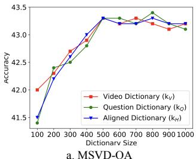  
a. MSVD-QA

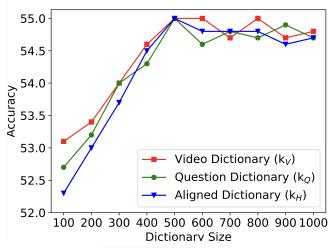  
b. NExT-QA  
Figure 5. The variance of accuracy on MSVD-QA (left) and NExT-QA (right) in our method with different sizes of video feature space, question feature space, and aligned feature space.

The effect of different variables for answer prediction. We validate the effect of different variables for answer prediction in Table 4. Comparing the performance among lines 1 v.s. 2 v.s. 3 v.s. 4 v.s. 5 v.s. 6, we can find that the H contributes the most among V, Q, and H since H contains information from both V and Q. Moreover, we can also find that Z contributes the most among all four variables, since Z is in charge of the front-door adjustment, which enhance the generation ability of existing method.

The effect of different variables for Z construction. We validate the effect of different variables for Z construction. Comparing the performance among lines 1 v.s. 2 v.s. 7 v.s. 8, we can find that H contributes more than Q, since it contain clues from both video and question, which is important for KPI framework to deconfound.

The effect of dictionary size. We change the $k _ { V } , k _ { Q }$ , and $k _ { H }$ in the range of [100, 1000] with interval 100 in turn, and fix the size of the other two feature spaces as 500 to plot the performance variance in Figure 5. As feature space size in-

Top Z: <bear-RelatedTo-polar> <window-UsedFor-watch> <window-UsedFor-isolate> <glass-RelatedTo-window> <bear-Cause-danger>

A: forcing boy to look straight dancing with boy prevent falling off posing for camera boy keeps moving around

creases from 100 to 1000, the accuracy first increases and then becomes stable. We suspect that as the size of feature space increases, more base patterns in three feature spaces are introduced, which helps estimate the expectation in each space. However, as the feature size becomes larger, the speed of introducing new patterns becomes slower, which gradually stabilizes the accuracy curve.

## 5.4. Qualitative Results

To capture the learning insight of our KPI framework, we inspect the predictive answer of some video instances along with top-attended causal concepts and show the visualization in Figure 6. The causal concepts retrieved from our KPI framework provide comprehensive support for the answer prediction and effectively alleviate the effect of dataset bias. Besides, we also notice a few causal concepts may not be directly used for answer prediction, e.g., <hold-xReactprevent escape>; but such causal concepts can reflect the characteristics of objects or actions, which could be helpful to exclude some wrong answers.

Moreover, we further show another two VideoQA example on MSVD-QA to reveal how our KPI framework reduce the bias. Our method can retrieve the knowledge items <pouch-AtLocation-kangaroo>, <dust-RelatedTospray>, and <target-RelatedTo-shoot>, which provides more causal clues to deduce the answer beyond correlation.

## 5.5. Limitation

As we have discussed in Section 4.1, the knowledge space should cover all the knowledge required for answer prediction, which is nearly impossible due to the following reasons, (1) existing knowledge graphs do not contain all the causal concepts required for answer prediction; (2) if the knowledge space size is too large, the resource required during training and inference will also be intolerable. Besides, current EXP module can only capture the 1st-order head-tail relation through the causal concepts. Nevertheless, more complex head-head-tail or head-tail-tail relations may also be helpful for answer prediction. In the future, exploring a more suitable knowledge space and designing a more informative EXP module would be the key to frontdoor adjustment in VideoQA task.

## 6. Conclusion

In this paper, we have focused on the VideoQA from dataset bias. Through analysis with causal graph, we have proven that the confounder and the backdoor path lead to spurious causality. Furthermore, we have proposed a model-agnostic framework called Knowledge Proxy Intervention, which has exploited the front-door adjustment and required no prior knowledge about the confounder. The effectiveness of KPI framework has been corroborated by three baseline methods on five benchmark datasets.

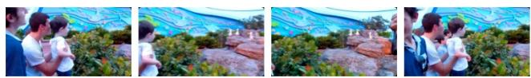  
Q: Why did the man in white hold tightly to the boy in white?

Top Z: <hold-RelatedTo-support> <person-Desire-hold> <hold-Prevent-fall> <arm-UsedFor-carry> <hold-MannerOf-control>

  
Q: Why are the polar bears kept behind the glass windows?

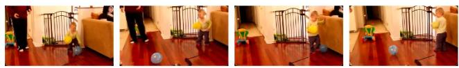  
Q: How does the child move the balloon in the video?

Figure 6. The visualization of three VideoQA cases from NExT-QA [61]. Top Z indicates the causal concepts from Z with the top-5 highest attention weight. Correct (resp. Wrong) answers are highlighted in green (resp. red)  
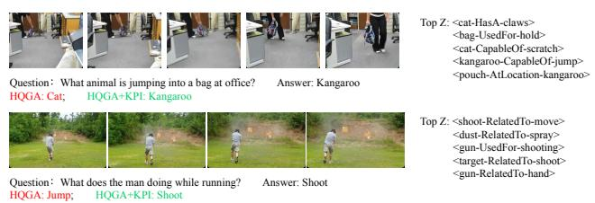  
Figure 7. The visualization of two VideoQA cases from MSVD-QA [65]. Top Z is the concepts from Z with top-5 highest attention weight. Correct (resp. Wrong) answers are highlighted in green (resp. red)

## Acknowledgement

The work was supported by the National Natural Science Foundation of China (Grant No. 62076162), the Shanghai Municipal Science and Technology Major/Key Project, China (Grant No. 2021SHZDZX0102, Grant No. 20511100300). We thank Wu Wen Jun Honorary Doctoral Scholarship, AI Institute, Shanghai Jiao Tong University.

## References

[1] Steven Bird, Ewan Klein, and Edward Loper. Natural language processing with Python: analyzing text with the natural language toolkit. ” O’Reilly Media, Inc.”, 2009. 5

[2] Shyamal Buch, Cristobal Eyzaguirre, Adrien Gaidon, Jiajun´ Wu, Li Fei-Fei, and Juan Carlos Niebles. Revisiting the ”video” in video-language understanding. In CVPR 2022, pages 2907–2917, 2022. 3

[3] Hui Chen, Guiguang Ding, Xudong Liu, Zijia Lin, Ji Liu, and Jungong Han. IMRAM: Iterative matching with recurrent attention memory for cross-modal image-text retrieval. In CVPR, 2020. 3

[4] Shizhe Chen, Yida Zhao, Qin Jin, and Qi Wu. Fine-grained video-text retrieval with hierarchical graph reasoning. In CVPR, pages 10638–10647, 2020. 3

[5] Anoop Cherian, Chiori Hori, Tim K. Marks, and Jonathan Le Roux. (2.5+1)D spatio-temporal scene graphs for video question answering. In AAAI 2022, pages 444–453, 2022. 1, 3

[6] Seong-Ho Choi, Kyoung-Woon On, Yu-Jung Heo, Ahjeong Seo, Youwon Jang, Min Su Lee, and Byoung-Tak Zhang. DramaQA: Character-centered video story understanding with hierarchical QA. In AAAI 2021, pages 1166–1174, 2021. 3

[7] Long Hoang Dang, Thao Minh Le, Vuong Le, and Truyen Tran. Hierarchical object-oriented spatio-temporal reasoning for video question answering. In IJCAI 2021, pages 636– 642, 2021. 3, 6, 7

[8] Jacob Devlin, Ming-Wei Chang, Kenton Lee, and Kristina Toutanova. BERT: pre-training of deep bidirectional transformers for language understanding. In NAACL-HLT 2019, pages 4171–4186, 2019. 3, 5

[9] Chenyou Fan, Xiaofan Zhang, Shu Zhang, Wensheng Wang, Chi Zhang, and Heng Huang. Heterogeneous memory enhanced multimodal attention model for video question answering. In CVPR 2019, pages 1999–2007, 2019. 3, 6, 7

[10] Fuli Feng, Jizhi Zhang, Xiangnan He, Hanwang Zhang, and Tat-Seng Chua. Empowering language understanding with counterfactual reasoning. In ACL 2021, pages 2226–2236, 2021. 3

[11] Tsu-Jui Fu, Linjie Li, Zhe Gan, Kevin Lin, William Yang Wang, Lijuan Wang, and Zicheng Liu. 7

[12] Jiyang Gao, Runzhou Ge, Kan Chen, and Ram Nevatia. Motion-appearance co-memory networks for video question answering. In CVPR 2018, pages 6576–6585, 2018. 1, 2, 3, 5, 6, 7

[13] Lianli Gao, Pengpeng Zeng, Jingkuan Song, Yuan-Fang Li, Wu Liu, Tao Mei, and Heng Tao Shen. Structured twostream attention network for video question answering. In AAAI 2019, pages 6391–6398, 2019. 3

[14] Yuying Ge, Yixiao Ge, Xihui Liu, Dian Li, Ying Shan, Xiaohu Qie, and Ping Luo. Bridging video-text retrieval with multiple choice questions. In CVPR, pages 16167–16176, 2022. 3

[15] Mao Gu, Zhou Zhao, Weike Jin, Richang Hong, and Fei Wu. Graph-based multi-interaction network for video ques-

tion answering. IEEE Trans. Image Process., 30:2758–2770, 2021. 3

[16] Zhicheng Guo, Jiaxuan Zhao, Licheng Jiao, Xu Liu, and Lingling Li. Multi-scale progressive attention network for video question answering. In ACL 2021, pages 973–978, 2021. 3, 6, 7

[17] Kensho Hara, Hirokatsu Kataoka, and Yutaka Satoh. Can spatiotemporal 3d cnns retrace the history of 2d cnns and imagenet? In CVPR 2018, pages 6546–6555, 2018. 4

[18] Kaiming He, Xiangyu Zhang, Shaoqing Ren, and Jian Sun. Deep residual learning for image recognition. In CVPR 2016, pages 770–778, 2016. 3

[19] Lisa Anne Hendricks, Kaylee Burns, Kate Saenko, Trevor Darrell, and Anna Rohrbach. Women also snowboard: Overcoming bias in captioning models. In ECCV 2018, pages 793–811, 2018. 1

[20] Sepp Hochreiter and Jurgen Schmidhuber. Long short-term¨ memory. Neural Comput., 9(8):1735–1780, 1997. 3

[21] Jie Hu, Li Shen, and Gang Sun. Squeeze-and-excitation networks. In CVPR 2018, pages 7132–7141, 2018. 6

[22] Deng Huang, Peihao Chen, Runhao Zeng, Qing Du, Mingkui Tan, and Chuang Gan. Location-aware graph convolutional networks for video question answering. In AAAI 2020, pages 11021–11028, 2020. 1, 3, 6, 7

[23] Jena D. Hwang, Chandra Bhagavatula, Ronan Le Bras, Jeff Da, Keisuke Sakaguchi, Antoine Bosselut, and Yejin Choi. Comet-atomic 2020: On symbolic and neural commonsense knowledge graphs. In AAAI Conference on Artificial Intelligence, 2020. 5

[24] Yunseok Jang, Yale Song, Youngjae Yu, Youngjin Kim, and Gunhee Kim. TGIF-QA: Toward spatio-temporal reasoning in visual question answering. In CVPR 2017, pages 1359– 1367, 2017. 1, 2, 3, 6

[25] Jianwen Jiang, Ziqiang Chen, Haojie Lin, Xibin Zhao, and Yue Gao. Divide and Conquer: Question-guided spatiotemporal contextual attention for video question answering. In AAAI 2020, pages 11101–11108, 2020. 1

[26] Pin Jiang and Yahong Han. Reasoning with heterogeneous graph alignment for video question answering. In AAAI 2020, pages 11109–11116, 2020. 2, 3, 5, 6, 7

[27] Weike Jin, Zhou Zhao, Mao Gu, Jun Yu, Jun Xiao, and Yueting Zhuang. Multi-interaction network with object relation for video question answering. In ACM MM 2019, pages 1193–1201, 2019. 3

[28] Thao Minh Le, Vuong Le, Svetha Venkatesh, and Truyen Tran. Hierarchical conditional relation networks for video question answering. In CVPR 2020, pages 9969–9978, 2020. 3, 6, 7

[29] Jie Lei, Licheng Yu, Mohit Bansal, and Tamara L. Berg. TVQA: Localized, compositional video question answering. In EMNLP 2018, pages 1369–1379, 2018. 3

[30] Jiangtong Li, Liu Liu, Li Niu, and Liqing Zhang. Memorize, associate and match: Embedding enhancement via finegrained alignment for image-text retrieval. IEEE Transactions on Image Processing, 30:9193–9207, 2021. 3

[31] Jiangtong Li, Li Niu, and Liqing Zhang. Action-aware embedding enhancement for image-text retrieval. In AAAI, pages 1323–1331, 2022. 3

[32] Jiangtong Li, Li Niu, and Liqing Zhang. From Representation to Reasoning: Towards both evidence and commonsense reasoning for video question-answering. In CVPR 2022, pages 21241–21250, 2022. 1, 2, 3, 6, 7

[33] Xiangpeng Li, Jingkuan Song, Lianli Gao, Xianglong Liu, Wenbing Huang, Xiangnan He, and Chuang Gan. Beyond RNNs: Positional self-attention with co-attention for video question answering. In AAAI 2019, pages 8658–8665, 2019. 3

[34] Yicong Li, Xiang Wang, Junbin Xiao, and Tat-Seng Chua. Equivariant and invariant grounding for video question answering. In ACM MM, 2022, pages 4714–4722, 2022. 1, 2, 3, 7

[35] Yicong Li, Xiang Wang, Junbin Xiao, Wei Ji, and Tat-Seng Chua. Invariant grounding for video question answering. In CVPR 2022, pages 2918–2927, 2022. 1, 2, 3, 7

[36] Bing Liu, Dong Wang, Xu Yang, Yong Zhou, Rui Yao, Zhiwen Shao, and Jiaqi Zhao. Show, deconfound and tell: Image captioning with causal inference. In CVPR 2022, pages 18020–18029, 2022. 3

[37] Chunxiao Liu, Zhendong Mao, Tianzhu Zhang, Hongtao Xie, Bin Wang, and Yongdong Zhang. Graph structured network for image-text matching. In CVPR, 2020. 3

[38] Fei Liu, Jing Liu, Weining Wang, and Hanqing Lu. HAIR: hierarchical visual-semantic relational reasoning for video question answering. In ICCV 2021, pages 1678–1687, 2021. 3

[39] Yulei Niu, Kaihua Tang, Hanwang Zhang, Zhiwu Lu, Xian-Sheng Hua, and Ji-Rong Wen. Counterfactual VQA: A cause-effect look at language bias. In CVPR 2021, pages 12700–12710, 2021. 3

[40] Jungin Park, Jiyoung Lee, and Kwanghoon Sohn. Bridge To Answer: Structure-aware graph interaction network for video question answering. In CVPR 2021, pages 15526– 15535, 2021. 3, 6, 7

[41] Judea Pearl. Causality: models, reasoning and inference. Springer, 2000. 3

[42] Judea Pearl and Elias Bareinboim. External Validity: From do-calculus to transportability across populations. Statistical Science, pages 579–595, 2014. 2

[43] Judea Pearl, Madelyn Glymour, and Nicholas P. Jewell. Causal inference in statistics: A primer. John Wiley & Sons., 2019. 3, 4

[44] Judea Pearl and Dana Mackenzie. The book of why: the new science of cause and effect. Basic Book, 2018. 3, 4

[45] Liang Peng, Shuangji Yang, Yi Bin, and Guoqing Wang. Progressive graph attention network for video question answering. In ACM MM 2021, pages 2871–2879, 2021. 3

[46] Min Peng, Chongyang Wang, Yuan Gao, Yu Shi, and Xiang-Dong Zhou. Multilevel hierarchical network with multiscale sampling for video question answering. In IJCAI 2022, pages 1276–1282, 2022. 3

[47] Jeffrey Pennington, Richard Socher, and Christopher D. Manning. GloVe: Global vectors for word representation. In EMNLP 2014, pages 1532–1543, 2014. 3

[48] Jiaxin Qi, Yulei Niu, Jianqiang Huang, and Hanwang Zhang. Two causal principles for improving visual dialog. In CVPR 2020, pages 10857–10866, 2020. 2

[49] Shaoqing Ren, Kaiming He, Ross B. Girshick, and Jian Sun. Faster R-CNN: towards real-time object detection with region proposal networks. In NeurIPS 2015, pages 91–99, 2015. 5

[50] Donald B. Rubin. Essential concepts of causal inference: a remarkable history and an intriguing future. Biostatistics & Epidemiology, 3(1):140–155, 2019. 3

[51] Ahjeong Seo, Gi-Cheon Kang, Joonhan Park, and Byoung-Tak Zhang. Attend what you need: Motion-appearance synergistic networks for video question answering. In ACL 2021, pages 6167–6177, 2021. 3

[52] Robyn Speer, Joshua Chin, and Catherine Havasi. Conceptnet 5.5: An open multilingual graph of general knowledge. In AAAI 2017, pages 4444–4451, 2017. 5

[53] Nitish Srivastava, Geoffrey E. Hinton, Alex Krizhevsky, Ilya Sutskever, and Ruslan Salakhutdinov. Dropout: a simple way to prevent neural networks from overfitting. J. Mach. Learn. Res., 15(1):1929–1958, 2014. 4

[54] Ashish Vaswani, Noam Shazeer, Niki Parmar, Jakob Uszkoreit, Llion Jones, Aidan N. Gomez, Lukasz Kaiser, and Illia Polosukhin. Attention is all you need. In NeurIPS 2017, pages 5998–6008, 2017. 3, 6

[55] Jianyu Wang, Bing-Kun Bao, and Changsheng Xu. Dualvgr: A dual-visual graph reasoning unit for video question answering. IEEE Trans. Multim., 24:3369–3380, 2022. 3

[56] Tan Wang, Jianqiang Huang, Hanwang Zhang, and Qianru Sun. Visual commonsense R-CNN. In CVPR 2020, pages 10757–10767, 2020. 2

[57] Tan Wang, Chang Zhou, Qianru Sun, and Hanwang Zhang. Causal attention for unbiased visual recognition. In ICCV 2021, pages 3071–3080, 2021. 3

[58] Wenjie Wang, Fuli Feng, Xiangnan He, Hanwang Zhang, and Tat-Seng Chua. Clicks can be Cheating: Counterfactual recommendation for mitigating clickbait issue. In SIGIR 2021, pages 1288–1297, 2021. 3

[59] Xiaolong Wang, Ross B. Girshick, Abhinav Gupta, and Kaiming He. Non-local neural networks. In CVPR 2018, pages 7794–7803, 2018. 6

[60] Reed J William. The pareto, zipf and other power laws. Economics letters, 127(1):15–19, 2001. 1

[61] Junbin Xiao, Xindi Shang, Angela Yao, and Tat-Seng Chua. NExT-QA: Next phase of question-answering to explaining temporal actions. In CVPR 2021, pages 9777–9786, 2021. 1, 2, 3, 6, 7, 9

[62] Junbin Xiao, Angela Yao, Zhiyuan Liu, Yicong Li, Wei Ji, and Tat-Seng Chua. Video as conditional graph hierarchy for multi-granular question answering. In AAAI 2022, pages 2804–2812, 2022. 1, 2, 3, 5, 6, 7

[63] Junbin Xiao, Pan Zhou, Tat-Seng Chua, and Shuicheng Yan. Video graph transformer for video question answering. In ECCV, 2022, 2022. 3

[64] Saining Xie, Ross B. Girshick, Piotr Dollar, Zhuowen Tu,´ and Kaiming He. Aggregated residual transformations for deep neural networks. In CVPR 2017, pages 5987–5995, 2017. 3, 4

[65] Dejing Xu, Zhou Zhao, Jun Xiao, Fei Wu, Hanwang Zhang, Xiangnan He, and Yueting Zhuang. Video question answer-

ing via gradually refined attention over appearance and motion. In ACM MM 2017, pages 1645–1653, 2017. 2, 6, 7, 9

[66] Jun Xu, Tao Mei, Ting Yao, and Yong Rui. MSR-VTT: A large video description dataset for bridging video and language. In CVPR 2016, pages 5288–5296, 2016. 1, 3

[67] Kelvin Xu, Jimmy Ba, Ryan Kiros, Kyunghyun Cho, Aaron C. Courville, Ruslan Salakhutdinov, Richard S. Zemel, and Yoshua Bengio. Show, attend and tell: Neural image caption generation with visual attention. In ICML 2015, pages 2048–2057, 2015. 4

[68] Antoine Yang, Antoine Miech, Josef Sivic, Ivan Laptev, and Cordelia Schmid. Just ask: Learning to answer questions from millions of narrated videos. In ICCV, pages 1686– 1697, 2021. 7

[69] Xu Yang, Hanwang Zhang, and Jianfei Cai. Deconfounded image captioning: A causal retrospect. IEEE Trans. Pattern Anal. Mach. Intell., 2021. 3

[70] Xu Yang, Hanwang Zhang, Guojun Qi, and Jianfei Cai. Causal attention for vision-language tasks. In CVPR 2021, pages 9847–9857, 2021. 3

[71] Kexin Yi, Chuang Gan, Yunzhu Li, Pushmeet Kohli, Jiajun Wu, Antonio Torralba, and Joshua B. Tenenbaum. CLEVRER: collision events for video representation and reasoning. In ICLR 2020, 2020. 3

[72] Rowan Zellers, Ximing Lu, Jack Hessel, Youngjae Yu, Jae Sung Park, Jize Cao, Ali Farhadi, and Yejin Choi. Merlot: Multimodal neural script knowledge models. In NeurIPS, pages 23634–23651, 2021. 7

[73] Dong Zhang, Hanwang Zhang, Jinhui Tang, Xian-Sheng Hua, and Qianru Sun. Causal intervention for weaklysupervised semantic segmentation. In NeurIPS 2020, 2020. 3

[74] Qingfu Zhu, Weinan Zhang, Ting Liu, and William Yang Wang. Counterfactual off-policy training for neural response generation. In EMNLP 2020, 2020. 3