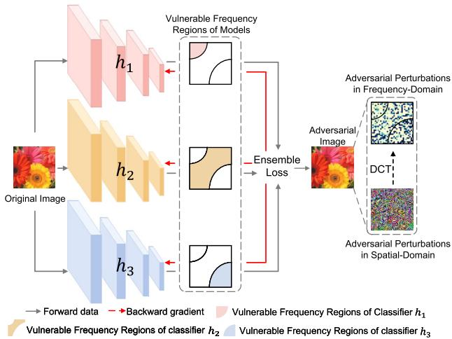
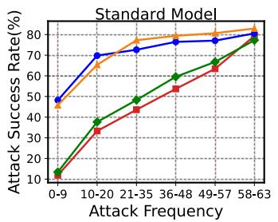
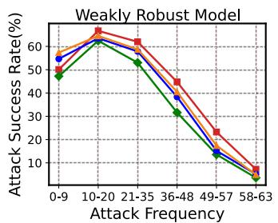
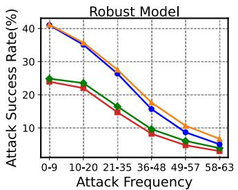
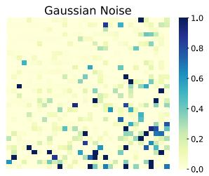
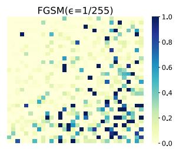
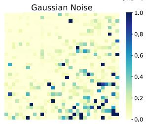
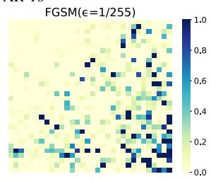
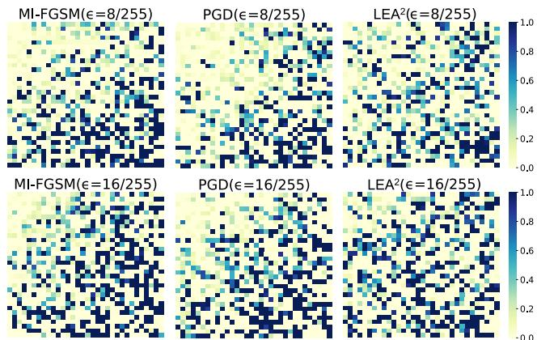

# LEA2: A Lightweight Ensemble Adversarial Attack via Non-overlapping Vulnerable Frequency Regions

Yaguan Qian \*1, Shuke He1, Chenyu Zhao1, Jiaqiang Sha1, Wei Wang2, and Bin Wang³

1School of Science, Zhejiang University of Science and Technology, Hangzhou, China 2Beijing Key Laboratory of Security and Privacy in Intelligent Transportation, Beijing Jiaotong University, China

3Zhejiang Key Laboratory of Multidimensional Perception Technology, Application and Cybersecurity, China

## Abstract

Recent work shows that well-designed adversarial examples can fool deep neural networks (DNNs). Due to their transferability, adversarial examples can also attack target models without extra information, called black-box attacks. However, most existing ensemble attacks depend on numerous substitute models to cover the vulnerable subspace of a target model. In this work, we find three types of models with non-overlapping vulnerable frequency regions, which can cover a large enough vulnerable subspace. Based on this finding, we propose a lightweight ensemble adversarial attack named LEA2, integrated by standard, weakly robust, and robust models. Moreover, we analyze Gaussian noise from the perspective of frequency and find that Gaussian noise is located in the vulnerable frequency regions of standard models. Therefore, we substitute standard models with Gaussian noise to ensure the use of high-frequency vulnerable regions while reducing attack time consumption. Experiments on several image datasets indicate that LEA2 achieves better transferability under different defended models compared with extensive baselines and state-of-the-art attacks.

## 1. Introduction

Convolutional neural networks (CNNs) have been successfully employed in image classification, but recent works have shown that even the most advanced CNNs are vulnerable to adversarial examples [12, 29, 26, 1]. Adversarial attacks deliberately impose small perturbations to the benign input to mislead a model. In general, adversarial attacks can be divided into white-box attacks and black-box attacks. White-box attacks need to know all the information about the target model (e.g., model structure, and model parameters), which is usually impracticable because an adversary cannot obtain all the information about the target model in reality. In contrast, black-box attacks do not require knowing the internal information of the target model, which can be further separated into query-based and transfer-based ones. Query-based attacks require extensive queries of the output of the target model [19, 21, 27, 32], which not only makes the target model suspect but also increases query costs. Transfer-based attack treats the target model as a pure black box, which crafts adversarial examples using a substitute model (white-box model) [10, 40, 7, 8, 23, 41].

  
Figure 1. An example of our ensemble attacks, where three substitute models are used to craft adversarial examples. Classifier h1 is an adversarial trained model, $h _ { 2 }$ is a weakly robust model, and $h _ { 3 }$ is a standard model.

In this paper, we focus on transfer-based black-box attacks. Depending on whether one or more substitute models are utilized, transfer-based attacks are further divided into single-model-based attacks and ensemble attacks. However, single-model-based attacks may lead adversarial examples to overfit the substitute model and decrease the attack success rate [16]. An efficient method to address this issue is to combine multiple substitute models. In order to approximate the target model, existing ensemble attacks have to use many models with different structures as substitute models [7, 8, 23, 41], which is generally intuitive and empirical. Moreover, training a large number of substitute models and crafting adversarial examples on them is seriously time-consuming [39, 24].

To facilitate the description of our ideas, we formalize the definition of vulnerable subspace, which is a set of adversarial examples. Each model has its special vulnerable subspace. The effectiveness of transfer-based attacks depends on how close the vulnerable subspace of the substitute model is to the target model. However, it is hard to characterize the vulnerable subspace due to its high dimensions. The transformation to the frequency domain makes it easier to study since the frequency domain of an image is two dimensions. Some previous work showed that adversarial perturbations added to the high-frequency regions of images are more effective than other frequency regions [35, 38], while other work showed that low-frequency regions are also vulnerable [13, 30].

In this work, we focus on the vulnerable frequency regions of different models. Our experiments showed that three types of models (standard, weakly robust, and robust) have distinct distributions of the vulnerable frequency regions. For standard models, they have vulnerable highfrequency regions; for weakly robust models, they have vulnerable mid-frequency regions; and for robust models, they have vulnerable low-frequency regions. Due to the reversibility of the Fourier Transform, we infer that the union of their corresponding vulnerable subspaces is large enough to cover that of the target model. Based on this assumption, we propose a lightweight ensemble adversarial attack, namely LEA2, which only includes three types of substitute models regardless of the kind of target models. Figure 1 illustrates the process of our ensemble attack. Moreover, we find that Gaussian noise is located in the vulnerable frequency regions of standard models. Therefore, we use the Gaussian noise to replace standard models to reduce time consumption further. To sum up, our main contributions are summarized as follows:

• We investigate the weakly robust model in the frequency domain and find that the mid-frequency perturbations achieve the highest attack success rate.

• From the perspective of frequency, we construct an ensemble only including three types of substitute models, which significantly reduces the time cost and boosts the transferability of adversarial examples.

• Extensive experiments on three popular datasets demonstrate that LEA² significantly boosts the transferability of adversarial examples while reducing time consumption compared to state-of-the-art ensemble attacks.

## 2. Related Work

Transfer-based attacks are based on the fact that despite the substitute and target models adopting diverse architectures, they may share similar decision boundaries [8, 23]. According to the attack mechanism adopted by the adversary, there are two types of transfer-based attacks. One is the single-model-based attack [10, 8, 40], and the other one is the ensemble attack. Since the former tends to overfit the substitute models, we focus on ensemble attacks.

Ensemble attacks. Liu et al. [23] first propose an ensemble attack that prevents the noise from overfitting a single model architecture and thus bolsters the transferability. Dong et al. [7] further investigate three manners of organizing the base models and demonstrate that the ensemble of averaging logits outperforms the others for boosting the attack effectiveness. Hang et al. [15] propose two types of ensemble-based black-box attack strategies to produce adversarial examples with more powerful transferability. Xie et al. [41] propose an ensemble attack DI-FGSM by employing random transformations to the input examples to enhance the transferability. Dong et al. [8] shift the input to create a series of translated images and approximately estimate the overall gradient to mitigate the problem of overreliance on the substitute model. Li et al. [22] apply featurelevel perturbations to an existing model to potentially create a huge set of diverse models and propose a longitudinal ensemble method specifically for their networks. Xiong et al. [42] reduce the gradient variance among various models to boost ensemble attacks. Che et al. [2] divide a large number of pre-trained source models into several batches and introduce long-term gradient memories in their new ensemble algorithm for specific networks or tasks(e.g., pix-to-pix image translation). Long et al. [25] proposed a frequency domain data augmentation for training, and this can significantly improve transferability. However, these ensemble attacks have to use a large number of substitute models to craft adversarial examples.

Adversarial Examples in Frequency Domain. It has been increasingly common in recent years to investigate the essential characteristics of adversarial examples from the frequency domain. Tsuzuku & Sato [34] first proposed a frequency framework by studying the sensitivity of CNN's for different Fourier bases. Wang et al. [35] show that highfrequency components play significant roles in promoting CNN'S accuracy and conclude that smoothing the CNN kernels helps to enforce the model to use features of low frequencies. Guo et al. [13] propose a low-frequency attack (LA) that successfully fools defended models, which shows that low-frequency components also play a significant role in model prediction. Deng & Karam [5] proposed a method of generating adversarial attacks in the frequency domain itself. Chen et al. [3] revealed that CNN classifiers rely on the amplitude spectrum of images rather than the phase spectrum, whereas humans rely more on the phase spectrum. However, these studies did not analyze the differences between the different types of models from the frequency perspective.

## 3. Motivation

Szegedy et al. [33] first observed the adversarial examples in DNNs. Let X be an input space and $\mathcal { V }$ be a label set. A classification model is a mapping function $g _ { \boldsymbol { \theta } } : \mathcal { X }  \mathcal { Y }$ Given an original image $x \in \mathcal { X }$ with the ground truth label $y \in \mathcal { V } , g _ { \theta } ( x ) = y$ , where θ is the parameter of the classification model. The purpose of adversarial attacks is to find a tiny perturbation $\delta ,$ fooling the classifier $g _ { \boldsymbol { \theta } } \left( \boldsymbol { x } ^ { \prime } \right) \neq \boldsymbol { y } ,$ where an adversarial example $x ^ { \prime } = x + \delta$ In general, to ensure that the adversarial example is as similar as possible to the original image, δ is required to be less than a specific value € as $\left\| x ^ { \prime } - x \right\| _ { p } \leq \epsilon ,$ where · is a norm and p could be 1, 2, ∞. In this work, we formally define vulnerable subspace as follows:

Definition 1 Vulnerable Subspace. Given a perturbation budget $\epsilon ,$ there exist a set $\mathcal { A } \subset \mathcal { X }$ such that $\bar { \mathcal { A } } = \{ x ^ { \prime } | x ^ { \prime } =$ $x + \delta \wedge \| \delta \| _ { p } \leq \epsilon \wedge g ( x ^ { \prime } ) \neq y \}$ . We say A is the vulnerable subspace of the classification model $g .$ For convenience, we denote it by $\mathcal { A } _ { g }$

As shown in [33], a non-target attack is modeled as a constraint optimization problem:

$$
\underset { \delta } { \arg \operatorname* { m a x } } \ : \mathcal { L } \left( \boldsymbol { g } \left( \boldsymbol { x } + \boldsymbol { \delta } \right) , \boldsymbol { y } ; \boldsymbol { \theta } \right) , \ : s . t . \ : \| \boldsymbol { \delta } \| _ { \infty } \leq \epsilon ,\tag{1}
$$

where $\mathcal { L }$ is the loss function. However, it is impractical to directly optimize Eqn (1) via the target model g under black-box settings because its parameter θ is inaccessible. To address this problem, a common approach is to train a local substitute model h simulating the target model $g .$ The effectiveness $( i . e .$ , transferability) relies on the overlap between the vulnerable subspace $\mathcal { A } _ { h }$ and $\mathcal { A } _ { g }$ of the substitute model h and the target model $g .$ Due to the black-box property, the vulnerable subspace of the target model is unknown. An intuitive way [23] is to collect many substitute models $h _ { i } , i \ = \ 1 , 2 , . . . , M$ with different architectures to cover the target model's all possible vulnerable subspace, $i . e . , \mathcal { A } _ { g } \subseteq \mathcal { A } _ { h _ { 1 } } \cup \mathcal { A } _ { h _ { 2 } } \cdot \cdot \cdot \cup \mathcal { A } _ { h _ { M } }$ . Thus, ensemble attacks were proposed [7, 41, 24], which is modeled as the following optimization:

$$
\begin{array} { r l } { \underset { x ^ { \prime } } { \arg \operatorname* { m a x } } } & { { } - \log \left( \left( \sum _ { i = 1 } ^ { M } w _ { i } S _ { i } \left( x ^ { \prime } \right) \right) \cdot \mathbf { 1 } _ { y } \right) , } \end{array}\tag{2}
$$

where $S _ { i } ( x ^ { \prime } )$ is the softmax outputs of the i-th substitute model, $w _ { i }$ is the ensemble weight with $w _ { i } ~ \geq ~ 0$ and $\textstyle \sum _ { i = 1 } ^ { M } w _ { i } = 1$ , and ${ \bf 1 } _ { y }$ is the one-hot encoding of $y .$

However, collecting a large number of models is generally inefficient and time-consuming to train so many substitute models [24]. In this paper, we hope to cover the vulnerable subspace of the target model with as few substitute models as possible.

Unfortunately, it is difficult to accurately characterize a vulnerable subspace due to its high dimensions. Meanwhile, the target model is unknowable. In the frequency domain, no matter what kind of target model, its vulnerable subspace is in certain 2-D frequency regions. From this perspective, we construct a frequency-based ensemble attack.

## 4. Methodology

## 4.1. Vulnerable Frequency Regions

Fourier analysis provides another view to investigate the properties of images. Some previous works showed that adversarial perturbations added to the high-frequency regions of images are more effective than other frequency regions [35, 38]. In contrast, other works showed that lowfrequency regions are also vulnerable to adversarial examples [13, 30]. Similar to the vulnerable subspace defined in the spatial domain, we formally define vulnerable frequency regions as follows:

Definition 2 Vulnerable Frequency Regions. Given the model $g ^ { \prime } s$ vulnerable subspace $A _ { g } ,$ there exists a vulnerable frequency region of g correspondingly in the frequency domain: $B _ { g } = \{ f | x + \delta _ { f } \in \mathcal { A } _ { g } \}$ where $\delta _ { f }$ is the specific perturbation corresponding to the frequency $f .$

Let $\mathcal { D } : \mathcal { X }  \mathcal { F }$ be the 2-D Discrete Cosine Transform [28] (DCT, details of which are included in Appendix $\mathbf { A . } 1 )$ and $\mathcal { D } ^ { - 1 }$ is its corresponding inverse. Here we present the formula of the specific frequency perturbation $\delta _ { f }$ as follows:

$$
\delta _ { f } = \alpha \cdot \mathrm { S g n } \left( \mathcal { D } ^ { - 1 } \left( \mathcal { D } \left( \nabla _ { x } \mathcal { L } \right) \odot \mathcal { M } \right) \right) ,\tag{3}
$$

where Sgn(·) is a sign function, $\mathcal { M } = \left\{ \begin{array} { l l } { 1 , \mathcal { D } ( x ) \in S } \\ { 0 , \mathcal { D } ( x ) \notin S } \end{array} \right.$ is a mask to select frequencies, $S = S p a n \left\{ f _ { 1 } , f _ { 2 } , \dots , f _ { N } \right\}$ where $f _ { 1 } , f _ { 2 } , \ldots , f _ { N }$ are orthogonal DCT modes and $\mathcal { L }$ is a loss function. When f selected by the mask M are frequency bands 36 to $6 3 , \delta _ { f }$ are called the high-frequency perturbations, and when the selected f are frequency bands 10 to 35 and 0 to 9, then $\delta _ { f }$ are called mid-frequency perturbations and low-frequency perturbations, respectively. The details of frequency bands are included in Appendix A.1.

  
CIFAR-10:ResNet18CIFAR-10:WideResNetCIFAR-100:ResNet18CIFAR-100:WideResNet  
Figure 2. The attack success rate of $\delta _ { f }$ on different models. Standard Model is standard trained ResNet18 (WideResNet), Weakly Robust Model uses PGD attack with $\epsilon = 4 / 2 5 5 , \alpha = 2 / 2 5 5$ to train ResNet18 (WideResNet) for 20 epochs, and Robust Model uses PGD with $\epsilon = 8 / 2 5 5 , \alpha = 2 / 2 5 5$ to train ResNet18 (WideResNet) for 50 epochs.

Our experiment shows that for standard models, highfrequency perturbations have a higher attack success rate; for robust models, the high-frequency perturbations can hardly fool it, while the low-frequency perturbations achieve a high attack success rate; for weakly robust mod-$e l s ^ { 1 }$ , the mid-frequency perturbations achieve the highest attack success rate (see Fig. 2). Though the standard model $h _ { s t a n d a r d }$ , weakly robust model $h _ { w e a k }$ , and robust model $h _ { r o b u s t }$ have the same structure, their vulnerable frequency regions are different but complementary. According to the vulnerable frequency regions, we further divide substitute models into standard, weakly robust, and robust for ensemble, equivalent to the ensemble of many randomly chosen models. Based on this idea, we construct a lightweight ensemble attack $\mathrm { L E A ^ { 2 } }$ described in Section 4.3, and propose a remark that presumes:

Remark 1 An ensemble of three types of models with nonoverlapping vulnerable frequency regions, i.e., $\boldsymbol { B _ { h _ { s t a n d a r d } } } \cap$ $B _ { h _ { w e a k } } \cap B _ { h _ { r o b u s t } } = \phi ,$ can achieve a large enough vulnerable subspace covered by an ensemble of many randomly chosen substitute models, $i . e . , \mathcal { A } _ { h _ { s t a n d a r d } } \cup \mathcal { A } _ { h _ { w e a k } } \cup$ $A _ { h _ { r o b u s t } } \approx A _ { h _ { 1 } } \cup A _ { h _ { 2 } } \cdot \cdot \cdot \cup A _ { h _ { M } } ,$ where $M \gg 3$

## 4.2. Gaussian Noise Substitution

Previous research [6] indicated that Gaussian noise $r \sim$ $N \left( 0 , \sigma ^ { 2 } \right)$ also has a significant impact on the classification performance of DNNs. Ford et al. [11] demonstrated that images with additive Gaussian noise and adversarial examples manifest the same underlying phenomenon. As we all know, generating adversarial examples is very timeconsuming [39], which needs calculating the gradients by back-propagation, but generating the Gaussian noise only needs a random number generator. Based on this, we want to explore whether Gaussian noise can replace one of the three types of models above to reduce time consumption.

(a) CIFAR-10  

  
(b) CIFAR-100  
Figure 3. RCT maps for Gaussian noise and the FGSM adversarial examples [12] generated on the standard trained ResNet18. The upper left and lower right corners represent the lowest and highest frequency components in the DCT space, respectively. The deeper color indicates a greater change for a specific frequency component between the original and perturbed images, where $\sigma = 0 . 1$ for the Gaussian noise and the maximum perturbation $\epsilon = 1 / 2 5 5$ for FGSM.

We identify the differences between the original image x and its perturbed $x ^ { \prime }$ in the frequency domain by calculating the average relative change of discrete cosine transform (RCT) [38]. It indicates which frequency regions the perturbations are mainly distributed in. RCT is defined as follows:

$$
\mathrm { R C T } = \frac { 1 } { N } \sum _ { i = 1 } ^ { N } \bigg | \frac { \mathcal { D } \left( x _ { i } ^ { \prime } \right) - \mathcal { D } \left( x _ { i } \right) } { \mathcal { D } \left( x _ { i } \right) } \bigg | ,\tag{4}
$$

where D is the discrete cosine transform and N is the number of examples.

As shown in Figure 3, the Gaussian noise is mainly distributed in the lower right corner of the RCT map, and the FGSM perturbation [12] generated on the standard model is also primarily concentrated in the same regions, which means that Gaussian noise $r \sim N \left( 0 , \sigma ^ { 2 } \right)$ is located in the vulnerable frequency regions of the standard model $( i . e .$ $\begin{array} { r } { \mathcal { D } ( r ) = \cal B _ { \it { h . s t a n d a r d } } ) . } \end{array}$ More experiments of Gaussian noise are shown in Appendix B. According to these finds, we can substitute standard models with Gaussian noise to reduce time consumption while maintaining the transferability of adversarial examples, as shown in the Remark 2:

Remark 2 According to Remark 1, there exists a set $A _ { r } =$ $\{ x ^ { \prime } | x ^ { \prime } = x + r , r \sim N \left( 0 , \sigma ^ { 2 } \right) \} = \mathcal { A } _ { h _ { s t a n d a r d } } ,$ and replacing the standard model with Gaussian Noise can achieve an equally large vulnerable subspace, i.e., $\mathcal { A } _ { r } \cup \mathcal { A } _ { h _ { w e a k } } \cup$ $A _ { h _ { r o b u s t } } \approx A _ { h _ { 1 } } \cup A _ { h _ { 2 } } \cdot \cdot \cdot \cup A _ { h _ { M } } ,$ where M  3.

## 4.3. Implementation

Algorithm $\mathbf { 1 \mathrm { L E A ^ { 2 } } }$   
Input An original image x with ground-truth label $y ;$ robust   
models $h _ { r o b u s t } ^ { 1 } , h _ { r o b u s t } ^ { 2 } , \ldots , h _ { r o b u s t } ^ { \tilde { M _ { 1 } } } ,$ the ensemble weights   
wi; weakly robust models $h _ { w e a k } ^ { 1 } , h _ { w e a k } ^ { 2 } , \ldots , h _ { w e a k } ^ { M _ { 2 } }$ , the en  
semble weights $w _ { j } ;$ size of perturbation e; iterations T; step   
size α   
Output An adversarial example $x ^ { \prime }$   
1: $x _ { t = 0 } ^ { \prime }  x + r ,$ where $r \sim N \left( 0 , \sigma ^ { 2 } \right)$   
2: for $t = 0$ to $T - 1$ do   
3: Input ${ x _ { t } } ^ { \prime } \ \mathrm { t o } \ { h _ { r o b u s t } ^ { i } }$ and get $\mathcal { L } \left( h _ { r o b u s t } ^ { i } \left( x _ { t } ^ { \prime } \right) , y \right)$   
for $i = 1 , 2 , \ldots , M _ { 1 }$   
4: Input ${ x _ { t } } ^ { \prime }$ to $h _ { w e a k } ^ { j }$ and $\mathrm { g e t } \mathcal { L } \left( h _ { w e a k } ^ { j } \left( x _ { t } ^ { \prime } \right) , y \right)$   
for $j = 1 , 2 , \dots , M _ { 2 }$   
5: Fuse the loss as   
$\begin{array} { r } { \mathcal { L } \left( { x _ { t } } ^ { \prime } , y \right) \gets \sum _ { i = 1 } ^ { M _ { 1 } } { w _ { i } \mathcal { L } \left( h _ { r o b u s t } ^ { i } \left( x _ { t } ^ { \prime } \right) , y \right) } + } \end{array}$   
$\begin{array} { r } { \sum _ { j = 1 } ^ { M _ { 2 } } w _ { j } \mathcal { L } \left( h _ { w e a k } ^ { j } \left( x _ { t } ^ { \prime } \right) , y \right) } \end{array}$   
6: Obtain the gradient $\nabla _ { x } \mathcal { L } \left( \dot { x } _ { t } ^ { \ \prime } , y \right)$   
7: Update $x _ { t + 1 } ^ { \prime }$ by applying the sign gradients as   
$\bar { x _ { t + 1 } ^ { \prime } }  \mathrm { { c l i p } } _ { x , \epsilon } \{ \bar { x } _ { t } ^ { \prime } + \alpha \cdot \mathrm { { S g n } } ( \bar { \nabla } _ { x } \mathcal { L } ( x _ { t } ^ { \prime } , y ) ) \}$   
8: end for   
9: return $x _ { T } ^ { \prime }$

The analysis in Section 4.1 needs three types of substitute models for Eqn (2). Meanwhile, from the analysis in Section 4.2, the example subspace with Gaussian noise added $( i . e . , \ A _ { r } )$ is similar to the vulnerable subspace of the standard model $( i . e . , \mathcal { A } _ { h _ { s t a n d a r d } } )$ . Therefore, we replace $\begin{array} { r } { \sum _ { k = 1 } ^ { M _ { 3 } } w _ { k } S _ { s t a n d a r d } ^ { k } \left( x + \delta \right) } \end{array}$ in Eqn (2) with Gaussian noise $r \sim N \left( 0 , \sigma ^ { 2 } \right)$ to further reduce the time consumption. In brief, our lightweight ensemble adversarial attack (LEA2) is to solve the following optimization problems:

$$
\begin{array} { r l } { \underset { \delta } { \arg \operatorname* { m a x } } } & { - \log \bigg ( \bigg ( \displaystyle \sum _ { i = 1 } ^ { M _ { 1 } } w _ { i } S _ { r o b u s t } ^ { i } ( x + r + \delta ) + } \\ & { \quad \quad \displaystyle \sum _ { j = 1 } ^ { M _ { 2 } } w _ { j } S _ { w e a k } ^ { j } ( x + r + \delta ) \bigg ) \cdot \mathbf { 1 } _ { y } \bigg ) , } \end{array}\tag{5}
$$

where $r \sim N \left( 0 , \sigma ^ { 2 } \right)$ is the Gaussian noise, $M _ { 1 }$ and $M _ { 2 }$ are the number of robust models and weak robust models respectively $( M _ { 1 }$ and $M _ { 2 }$ are usually 1 or $2 ) , \ S _ { r o b u s t }$ and $S _ { w e a k }$ represent the softmax outputs of the robust model and weak robust model respectively, $\textstyle \sum _ { i = 1 } ^ { M _ { 1 } } w _ { i } ~ +$ $\textstyle \sum _ { j = 1 } ^ { M _ { 2 } } w _ { j } \ = \ 1$ . The adversarial example $x ^ { \prime }$ generated by the above optimization is also limited by $\| x ^ { \prime } - x \| _ { \infty } \leq \epsilon .$ The procedure of $\mathrm { L E A ^ { 2 } }$ is presented in Algorithm 1.

We compared the differences of perturbations generated by the black-box MI-FGSM attack [7], white-box PGD attack [26], and our attack $\mathrm { L E A ^ { 2 } }$ using Eqn (4) on CIFAR-10, as shown in Figure 4. The perturbations generated by $\mathrm { L E A ^ { 2 } }$ are distributed throughout the entire frequency regions regardless of the maximum perturbation $\epsilon = 8 / 2 5 5$ or the larger perturbation $\epsilon = 1 6 / 2 5 5$ . In contrast, the perturbations generated by MI-FGSM and PGD are more concentrated in the high-frequency regions, and almost no perturbation is generated in the low-frequency domains. Since the perturbations generated by $\mathrm { L E A ^ { 2 } }$ can cover entire frequency regions, $\mathrm { L E A ^ { 2 } }$ will attack successfully no matter the target model's vulnerable subspace. This can be explained from another view that all possible target models, regardless of their specific form, have their vulnerable frequency regions located in some specific frequency regions. So we gain a more deep insight than Remark 1 as follows:

Remark 3 Three types of models with non-overlapping but complementary vulnerable frequency regions are chosen as substitute models for the ensemble, which can generate adversarial perturbations that cover almost all possible vulnerable subspaces of target models. i.e., $\mathcal { A } _ { r } \cup \mathcal { A } _ { h _ { w e a k } } \cup$ $\begin{array} { r } { \mathcal { A } _ { h _ { r o b u s t } } \approx \bigcup _ { i } \mathcal { A } _ { g _ { i } } } \end{array}$ where $g _ { i }$ represents target models.

## 5. Experiments

## 5.1. Experiment Setup

Datasets. We conduct experiments on three general datasets, namely CIFAR-10 [20], CIFAR-100 [20], and ImageNet-30 [4]. In particular, CIFAR-10 contains 50K training examples and 10K testing examples with the size of 32×32 from 10 classes; CIFAR-100 has 100 classes, containing the same number of training (testing) examples as CIFAR-10; ImageNet-30 is a subset with 30 classes extracted randomly from the ImageNet dataset [4]. In experiments, we selected correctly classified images to evaluate various attacks, ensuring that the effectiveness of attacks is caused by the attacks themselves and not the model performance.

Table 1. The attack success rate of various attacks on standard models with JPEG compression [14] on CIFAR-10. The best results are indicated in bold. Other results on CIFAR-100 are included in Appendix C.4.
<table><tr><td rowspan="2">Dataset</td><td rowspan="2">Attack</td><td colspan="3">ResNet20</td><td colspan="3">VGG16</td></tr><tr><td>Clean</td><td>JPEG-75</td><td>JPEG-50</td><td>Clean</td><td>JPEG-75</td><td>JPEG-50</td></tr><tr><td rowspan="6">CIFAR-10</td><td>TI-FGSM [8]</td><td>58.41%</td><td>42.86%</td><td>37.40%</td><td>54.25%</td><td>36.93%</td><td>33.30%</td></tr><tr><td>MI-FGSM [7]</td><td>94.83%</td><td>64.07%</td><td>32.07%</td><td>88.91%</td><td>66.04%</td><td>26.72%</td></tr><tr><td>DI-FGSM [41]</td><td>97.54%</td><td>75.95%</td><td>53.42%</td><td>96.30%</td><td>70.72%</td><td>47.00%</td></tr><tr><td>MI-FGSMens [7]</td><td>99.52%</td><td>83.21%</td><td>58.32%</td><td>97.85%</td><td>77.53%</td><td>53.89%</td></tr><tr><td>DI-FGSMens [41]</td><td>99.43%</td><td>90.36%</td><td>75.59%</td><td>98.81%</td><td>87.31%</td><td>72.37%</td></tr><tr><td> $\mathrm { L E A ^ { 2 } ( o u r s ) }$ </td><td>94.93%</td><td>88.79%</td><td>83.89%</td><td>91.46%</td><td>87.66%</td><td>84.73%</td></tr></table>

Table 2. The attack success rate of various attacks on standard models with JPEG compression [14] on ImageNet-30. The best results are indicated in bold.
<table><tr><td rowspan="2">Dataset</td><td rowspan="2">Attack</td><td colspan="3">WideResNet101</td><td colspan="3">DenseNet121</td></tr><tr><td>Clean</td><td>JPEG-75</td><td>JPEG-50</td><td>Clean</td><td>JPEG-75</td><td>JPEG-50</td></tr><tr><td rowspan="6">ImageNet-30</td><td>TI-FGSM [8]</td><td>83.41%</td><td>82.06%</td><td>81.70%</td><td>78.45%</td><td>78.62%</td><td>78.27%</td></tr><tr><td>MI-FGSM [7]</td><td>86.53%</td><td>81.83%</td><td>78.16%</td><td>69.84%</td><td>66.56%</td><td>61.94%</td></tr><tr><td>DI-FGSM [41]</td><td>90.40%</td><td>88.03%</td><td>87.49%</td><td>82.68%</td><td>78.47%</td><td>77.19%</td></tr><tr><td>MI-FGSMens [7]</td><td>97.24%</td><td>95.59%</td><td>93.67%</td><td>78.15%</td><td>76.41%</td><td>73.56%</td></tr><tr><td>DI-FGSMens [41]</td><td>98.66%</td><td>96.33%</td><td>95.32%</td><td>92.14%</td><td>91.67%</td><td>89.74%</td></tr><tr><td> $\mathrm { L E A ^ { 2 } ( o u r s ) }$ </td><td>96.95%</td><td>96.87%</td><td>96.53%</td><td>95.16%</td><td>95.11%</td><td>94.92%</td></tr></table>

  
Figure 4. RCT map of various attack method on CIFAR-10. The upper left and lower right corners represent low and high frequency, respectively. More results on CIFAR-100 are included in Appendix C.3.

Models. For the standard models, we standardly train ResNet18, ResNet20, ResNet34 [17], WideRes-Net [44], and VGG16 [31] on CIFAR-10 and CIFAR-100 respectively. On ImageNet-30, we standardly train

ResNet18, ResNet50, WideResNet101, Densenet121 [18], and VGG16. For the robust models, PGD [26] with ε = 8/255 and $\alpha = 2 / 2 5 5$ is used for adversarial training for 50 epochs to obtain the robust models with two different structures, PGD-ResNet18 and PGD-WideResNet on CIFAR-10 and CIFAR-100. Trades [45] and Mart [37] are used to train for 50 epochs to obtain robust Trades-ResNet18 and Mart-ResNet18 on CIFAR-10 and CIFAR-100. On ImageNet-30, we train PGD-ResNet18, PGD-ResNet50, Trades-ResNet18, and Mart-VGG16 in the same way. For the weak robust models, we use PGD with $\epsilon = 4 / 2 5 5$ to train for 20 epochs to obtain Weak-ResNet18 on CIFAR-10, CIFAR-100, and ImageNet-30. The details of these models are provided in Appendix C.1.

Competitor. In order to show the effectiveness of our proposed $\mathrm { L E A ^ { 2 } }$ , we compare it with diverse state-of-theart attack methods, including first-order attack FGSM [12], PGD [26], LA [13], MI-FGSM [7], DI-FGSM [41], TI-FGSM [8]. MI-FGSMens and DI-FGSMens represent the ensemble attacks mentioned in [7] and [41], respectively.

Implementation details. Among all attack methods, maximum perturbation $\epsilon = 1 6 / 2 5 5$ , the iteration $T = 2 0 ,$ and the step size $\alpha ~ = ~ 2 / 2 5 5$ For the convenience of comparison, white-box FGSM and PGD attacks are viewed as black-box attacks by using the substitute model (PGD-WideResNet) to craft adversarial examples when attacking various defended models on CIFAR-10 and CIFAR-100. Similarly, on ImageNet-30, Mart-VGG16 is used as the substitute model for FGSM and PGD. For the ensemble attacks MI-FGSMens and DI-FGSMens, we use two standard models and two robust models as their substitute models according to the experiments in [7] and [41] For CIFAR-10 and CIFAR-100, these models are PGD-WideResNet, Mart-ResNet18, ResNet18, and ResNet34, and the ensemble weights are set as 0.25 equally. These models are PGD-ResNet50, Mart-VGG16, ResNet18, and ResNet50 for ImageNet-30. For $\mathrm { L E A ^ { 2 } }$ , the Gaussian noise $r \sim N \left( 0 , \sigma ^ { 2 } \right)$ set $\sigma = 0 . 1$ ; the robust models on CIFAR-10/100 are PGD-WideResNet and Mart-ResNet18, while on ImageNet-30 are PGD-ResNet50 and Mart-VGG16; the weak robust model is Weak-ResNet18. The ensemble weights are set as 1/3 equally.

## 5.2. Attack Standard Trained Models

In this section, we present the performance of various black-box attacks on the standard models with JPEG defense [9] on CIFAR-10 and ImageNet-30 in Tables 1 and 2. JPEG is a defense method that removes highfrequency components to weaken adversarial examples and is often used in conjunction with models for defense [14]. TI-FGSM [8], MI-FGSM [7], and DI-FGSM [41] are first-order black-box attacks based on a single substitute model. MI-FGSMens [7] and DI-FGSMens [41] are ensemble attacks based on multiple substitute models. We use ResNet18 achieving 95.57% and 89.67% accuracy on CIFAR-10 and ImageNet-30, respectively, as their substitute model for the single-model-based black-box attacks. For ensemble attacks, the substitute models used by them are described in Section 5.1.

As shown in Tables 1 and 2, although the ensemble attacks MI-FGSMens and DI-FGSMens perform better against the completely defenseless standard models, the attack success rate drops by 9.07% to 41.20% in the presence of JPEG defense, whereas our attack method consistently maintains a high attack success rate (also maintains a high success rate against undefended standard models) that it only produces 0.05%\~11.04% fluctuation with JPEG defense. These results further suggest that the perturbations generated by $\mathrm { L E A ^ { 2 } }$ can cover the entire frequency region. Even if the high-frequency perturbations are removed by JPEG defense, the perturbations in the remaining frequency bands still play an important role. In contrast, the perturbations of other adversarial attacks are mainly concentrated in the high-frequency regions; therefore, the performance of adversarial examples is deeply weakened after JPEG compression.

## 5.3. Attack Defended Models

Although most of the attacks can easily fool standard models, they have a poor success rate when attacking the defensive models, especially in black-box settings. To further confirm the superiority of our attack, we first conduct a series of experiments on the advanced defensive models on

CIFAR-10 and CIFAR-100 (see Table 3), including AT [26], Trades [45], JPEG [14], TVM [14], FS [43], and Spatial Smoothing [43]. FGSM, PGD, TI-FGSM, MI-FGSM, DI-FGSM, and LA are advanced first-order attacks based on a single model. In order to verify the transferability of these attacks, PGD-WideResNet is used as their substitute model. As described in Section 5.1, ensemble attacks MI-FGSMens and DI-FGSMens use two standard models and two robust models as their substitute models.

Table 3 shows the transferability of the above adversarial attacks on the advanced defended models. Compared with attacking standard trained models (see Tables 1 and 2), although the ensemble attacks MI-FGSMens and DI-FGSMens have high transferability when attacking the standard model, their performance on the defended models is deeply weakened. In contrast to them, our attack method $\mathrm { L E A ^ { 2 } }$ has the highest attack success rate which is 3.8%\~32.89%higher than other ensemble attacks. This is because $\mathrm { L E A ^ { 2 } }$ produces perturbations covering entire vulnerable frequency regions, which can fool more target models regardless of where the target model's vulnerable subspace is located. More experiments on ImageNet-30 are provided in Appendix C.4.

For the comprehensive evaluation, more experiments are conducted on ImageNet-compatible dataset². We compared our $\mathrm { L E A ^ { 2 } }$ with three recent ensemble attacks: SVRE [42], VMI [36], and Ghost [22], where SVRE and VMI are generated on the ensemble of Res-101, IncRes-v2, Inc-v3, and Inc-v4, and Ghost is generated on the ensemble of Inc-v3, Inc-v4, IncRes-v2, IncRes-v2ens, and Res-v2-50. We also compared $\mathrm { L E A ^ { 2 } }$ with a recent advanced frequency-based attack $\mathrm { S ^ { 2 } I }$ [25] generated on Adv-Inc-v3. As shown in Table 4, $\mathrm { L E A ^ { 2 } }$ consistently outperforms the advanced ensemble attacks. The second column of Table 4 also shows that $\mathrm { L E A ^ { 2 } }$ generates adversarial examples more efficiently than other advanced ensemble attacks [22, 42, 36]. Meanwhile, $\mathrm { L E A ^ { 2 } }$ takes less time to generate adversarial examples than the frequency-based attack S²I [25] with one model.

## 5.4. Ablation Study

In this section, we study the effect of Gaussian noise and mid-frequency perturbations on the transferability of our attack LEA². For the convenience of analysis, we only explored undefended ResNet20 and defended robust PGD-ResNet18 as our target models on CIFAR-10 and CIFAR-100.

Influence of Gaussian noise. As shown in the first two rows of each dataset in Table 5, we analyze the performance of $\mathrm { L E A ^ { 2 } }$ when Gaussian noise $r \sim N \left( 0 , \sigma ^ { 2 } \right)$ is removed (i.e., $\mathrm { L E A ^ { 2 } } \ - \ r )$ or Gaussian noise is replaced by highfrequency perturbations generated by the standard trained ResNet18 $( i . e . , \mathrm { L E A } ^ { 2 } - r + \mathrm { R e s N e t } 1 8 )$ . (1) When Gaussian noise is removed, its success rate on the standard model decrease compared with $\mathrm { L E A ^ { 2 } }$ . (2) In the same way as state-of-the-art ensemble attacks select substitute models, the standard model is used as a substitute model rather than Gaussian noise $( \mathrm { L E A ^ { 2 } } - r + \mathrm { R e s N e t } 1 8 )$ . When attacking the defended models, the attack success rate on CIFAR-10 and CIFAR-100 decreased by 17.93% and 16.12% respectively, and the attack time cost was dramatically raised since adding a substitute model. Therefore, it is effective to use Gaussian noise to replace the high-frequency perturbations generated based on the standard model.

Table 3. The attack success rate of various attacks on advanced defenses models. The best results are indicated in bold.
<table><tr><td>Dataset</td><td>Attack</td><td>AT</td><td>Trades</td><td>JPEG-75</td><td>JPEG-50</td><td>TVM</td><td>FS</td><td>Spatial Smoothing</td></tr><tr><td rowspan="9">CIFAR-10</td><td>FGSM [12]</td><td>34.59%</td><td>33.44%</td><td>34.11%</td><td>34.00%</td><td>33.43%</td><td>34.56%</td><td>32.71%</td></tr><tr><td>PGD [26]</td><td>47.66%</td><td>44.18%</td><td>45.02%</td><td>44.84%</td><td>39.79%</td><td>47.44%</td><td>41.48%</td></tr><tr><td>TI-FGSM [8]</td><td>34.74%</td><td>35.10%</td><td>35.17%</td><td>36.65%</td><td>44.39%</td><td>34.47%</td><td>43.95%</td></tr><tr><td>MI-FGSM [7]</td><td>46.13%</td><td>43.58%</td><td>44.76%</td><td>44.28%</td><td>40.14%</td><td>46.09%</td><td>41.62%</td></tr><tr><td>DI-FGSM [41]</td><td>48.85%</td><td>47.00%</td><td>48.93%</td><td>50.26%</td><td>48.81%</td><td>48.68%</td><td>51.75%</td></tr><tr><td>MI-FGSMens [7]</td><td>51.65%</td><td>45.96%</td><td>52.57%</td><td>50.59%</td><td>38.35%</td><td>41.15%</td><td>36.71%</td></tr><tr><td>DI-FGSMens [41]</td><td>49.24%</td><td>52.65%</td><td>51.50%</td><td>49.76%</td><td>45.34%</td><td>43.00%</td><td>44.99%</td></tr><tr><td>LA[13]</td><td>38.01%</td><td>36.43%</td><td>35.64%</td><td>35.97%</td><td>40.49%</td><td>38.13%</td><td>40.71%</td></tr><tr><td> $\mathrm { L E A ^ { 2 } ( o u r s ) }$ </td><td>59.40%</td><td>54.61%</td><td>57.31%</td><td>55.82%</td><td>50.21%</td><td>59.24%</td><td>54.13%</td></tr><tr><td rowspan="9">CIFAR-100</td><td>FGSM [12]</td><td>57.42%</td><td>52.98%</td><td>56.27%</td><td>56.87%</td><td>53.57%</td><td>56.76%</td><td>55.20%</td></tr><tr><td>PGD [26]</td><td>65.60%</td><td>59.18%</td><td>63.25%</td><td>61.99%</td><td>57.78%</td><td>63.83%</td><td>61.49%</td></tr><tr><td>TI-FGSM [8]</td><td>50.17%</td><td>48.70%</td><td>51.91%</td><td>52.52%</td><td>55.97%</td><td>50.21%</td><td>55.64%</td></tr><tr><td>MI-FGSM [7]</td><td>65.95%</td><td>60.54%</td><td>65.32%</td><td>64.24%</td><td>59.94%</td><td>64.71%</td><td>61.99%</td></tr><tr><td>DI-FGSM [41]</td><td>62.92%</td><td>57.05%</td><td>63.89%</td><td>63.57%</td><td>64.13%</td><td>62.28%</td><td>64.57%</td></tr><tr><td>MI-FGSMens [7]</td><td>62.14%</td><td>56.63%</td><td>39.83%</td><td>50.66%</td><td>48.86%</td><td>46.66%</td><td>43.15%</td></tr><tr><td>DI-FGSMens [41]</td><td>59.73%</td><td>52.45%</td><td>32.75%</td><td>30.83%</td><td>42.62%</td><td>37.78%</td><td>38.84%</td></tr><tr><td>LA [13]</td><td>57.57%</td><td>54.00%</td><td>56.63%</td><td>56.12%</td><td>60.36%</td><td>57.53%</td><td>60.86%</td></tr><tr><td> $\mathrm { L E A ^ { 2 } ( o u r s ) }$ </td><td>71.74%</td><td>65.92%</td><td>71.07%</td><td>69.55%</td><td>65.74%</td><td>71.64%</td><td>68.29%</td></tr></table>

Table 4. The time of generating adversarial examples and black-box attack success rates (%) on ImageNet-compatible dataset. Among all attacks, maximum perturbation $\epsilon = 1 6 / 2 5 5$
<table><tr><td>Attak</td><td>Time (min)</td><td>Adv-Inc-v3ens</td><td>Adv-Inc-v4ens</td><td>JPEG</td><td>TVM</td><td>FS</td></tr><tr><td>SVRE-MI-FGSM [42]</td><td>28.7</td><td>56.4</td><td>49.6</td><td>84.5</td><td>59.8</td><td>57.1</td></tr><tr><td>S²I-FGSM [25]</td><td>24.3</td><td>31.6</td><td>30.4</td><td>83.1</td><td>40.4</td><td>35.1</td></tr><tr><td>VMI-FGSM [36]</td><td>27.7</td><td>36.6</td><td>32.9</td><td>79.5</td><td>50.4</td><td>52.5</td></tr><tr><td>Ghost-MI-FGSM [22]</td><td>118.4</td><td>42.9</td><td>41.2</td><td>71.7</td><td>48.5</td><td>44.7</td></tr><tr><td>MI-FGSMens [7]</td><td>30.2</td><td>48.8</td><td>40.6</td><td>70.8</td><td>46.3</td><td>51.8</td></tr><tr><td>DI-FGSMens [41]</td><td>34.8</td><td>52.4</td><td>45.2</td><td>74.2</td><td>57.7</td><td>55.3</td></tr><tr><td> $\mathrm { L E A ^ { 2 } ( o u r s ) }$ </td><td>11.3</td><td>59.1</td><td>50.4</td><td>87.2</td><td>68.6</td><td>62.7</td></tr></table>

Influence of mid-frequency vulnerable regions. According to the analysis in Section 4.1, Weak-ResNet18's vulnerable frequency regions are the mid-frequency regions. In order to examine whether mid-frequency vulnerable regions are useful for improving the transferability of adversarial examples, we conduct experiments on CIFAR-10 and CIFAR-100 that evaluate the attack's performance when LEA² removes Weak-ResNet18 $( i . e . , \mathrm { L E A ^ { 2 } }$ — Weak-ResNet18) replaced by standard trained ResNet18 $( i . e . , \mathrm { L E A ^ { 2 } }$ — Weak-ResNet18 + ResNet18). As shown in the third and fourth rows of each dataset in Table 5, (1) when the mid-frequency vulnerable regions are removed, the attack success rate of attacking the standard model on CIFAR-10 and CIFAR-100 reduces by 24.99% and 13.09%, respectively. This is because the standard model not only relies on the high-frequency component for prediction but also the mid-frequency component plays an important role. (2) The transferability of adversarial examples on the adversarially trained model drastically reduces when the Weak-ResNet18 is replaced by the standardly trained ResNet18. It can be seen that mid-frequency vulnerable regions play a significant role in boosting the transferability of adversarial examples.

Table 5. The time of generating adversarial examples and attack success rate (ASR) of $\mathrm { L E A ^ { 2 } }$ using different substitute models on standard models and adversarially trained models.
<table><tr><td rowspan="2">Dataset Attack</td><td rowspan="2"></td><td colspan="2">ResNet20</td><td colspan="2"> $\mathrm { A T }$ </td></tr><tr><td>Time (s)</td><td>ASR</td><td>Time (s)</td><td>ASR</td></tr><tr><td rowspan="5">CIFAR-10</td><td>LEA2 − r</td><td>418</td><td>86.86%</td><td>421</td><td>58.54%</td></tr><tr><td> $\mathrm { L E A ^ { 2 } }$  − r + ResNet18</td><td>513</td><td>96.73%</td><td>512</td><td>41.47%</td></tr><tr><td> $\mathrm { L E A ^ { 2 } }$  - Weak-ResNet18</td><td>325</td><td>66.94%</td><td>329</td><td>56.49%</td></tr><tr><td> $\mathrm { L E A ^ { 2 } }$  - Weak-ResNet18 + ResNet18</td><td>418</td><td>94.57%</td><td>427</td><td>32.57%</td></tr><tr><td> $\mathrm { L E A ^ { 2 } }$ </td><td>418</td><td>91.93%</td><td>427</td><td>59.40%</td></tr><tr><td rowspan="5">CIFAR-100</td><td> $\overline { { \mathrm { L E A } ^ { 2 } - r } }$ </td><td>271</td><td>83.04%</td><td>271</td><td>71.68%</td></tr><tr><td> $\mathrm { L E A ^ { 2 } } - r + \mathrm { R e s N e t } 1 8$ </td><td>360</td><td>93.75%</td><td>362</td><td>55.62%</td></tr><tr><td> $\mathrm { L E A ^ { 2 } - W e a k \mathrm { - } R e s N e t { 1 8 } }$ </td><td>182</td><td>74.39%</td><td>184</td><td>70.72%</td></tr><tr><td> $\mathrm { L E A ^ { 2 } - W e a k { \mathrm { - } } R e s N e t { 1 } } 8 + \mathrm { R e s N e t { 1 } } 8$ </td><td>271</td><td>92.84%</td><td>273</td><td>46.12%</td></tr><tr><td> $\mathrm { L E A ^ { 2 } }$ </td><td>271</td><td>90.48%</td><td>273</td><td>71.74%</td></tr></table>

Table 6. The attack success rate of existing ensemble attacks and ensemble attacks applying our ensemble strategy on the adversarially trained model. The best results are highlighted in bold.
<table><tr><td>Dataset</td><td>Attack</td><td>AT</td><td>Trades</td></tr><tr><td rowspan="3">CIFAR-10</td><td>MI-FGSMens [7]</td><td>41.19%</td><td>39.16%</td></tr><tr><td>DI-FGSMens [41]</td><td>43.16%</td><td>41.11%</td></tr><tr><td>LEA2-MI-FGSMens(ours) LEA2-DI-FGSMens(ours)</td><td>57.22% 58.25%</td><td>52.18% 53.29%</td></tr><tr><td rowspan="2">CIFAR-100 LEA2-DI-FGSMens(ours)</td><td>MI-FGSMens [7]</td><td>47.10%</td><td>44.87%</td></tr><tr><td>DI-FGSMens [41] LEA2-MI-FGSMens(ours)</td><td>38.13% 70.67%</td><td>35.88% 64.52%</td></tr></table>

## 5.5. Further Analysis

In this section, we analyze whether our ensemble strategy can be combined with existing ensemble attacks to significantly improve the transferability of adversarial examples. For convenience, we verify on advanced adversarial training defense, MI-FGSMens and DI-FGsmens are the same as the configuration in Section 5.1, LEA2-MI-FGSMens and LEA²-DI-FGSMens indicate that the Gaussian noise $r ~ \sim ~ N \left( 0 , \sigma ^ { 2 } \right)$ is added, PGD-WideResNet, Mart-ResNet18, and Weak-ResNet18 are used as substitute models. Applying our ensemble strategy to the existing ensemble attacks can significantly improve the transferability of adversarial examples on the robust model. As shown in Table 6, the attack success rate of $\mathrm { L E A ^ { 2 } }$ -MI-FGSMens increases by 13.02%\~23.57% compared with MI-FGSMens, and $\mathrm { L E A ^ { 2 } - D I }$ -FGSMens increased by 12.18%\~28.99% compared with DI-FGSMens.

## 6. Conclusion & Outlook

We find three types of models with non-overlapping vulnerable frequency regions, which can cover a large enough vulnerable subspace. Based on this finding, we propose a lightweight ensemble adversarial attack, $\mathrm { L E A } ^ { 2 } .$ integrated by standard, weakly robust, and robust models. In order to further reduce time consumption, we analyze Gaussian noise from the perspective of frequency and find that Gaussian noise is located in the vulnerable frequency regions of standard models. Therefore, we substitute standard models with Gaussian noise to ensure the use of high-frequency vulnerable regions while reducing attack time consumption. Compared with the black-box attacks and the ensemble attacks, extensive experiments demonstrate the significant effect of our method, which outperforms state-of-theart transfer-based attacks by a large margin. Looking forward, more research directions about mid-frequency vulnerable regions could be exploited in future computer vision research. Meanwhile, we will explore how to apply vulnerable frequency regions on other tasks, such as the interpretability of DNNs. Moreover, effective ensemble defense strategies against $\mathrm { L E A ^ { 2 } }$ will be another crucial and promising direction.

## Acknowledgement

This work was supported by the National Natural Science Foundation of China under Grants 92167203 and U21A20463, Zhejiang Provincial Natural Science Foundation of China under Grant LZ22F020007, Foundation of Zhejiang Key Laboratory of Multi-dimensional Perception Technology Application and Cybersecurity under Grant HIK2022008, and the Science and Technology Innovation Foundation for Graduate Students of Zhejiang University of Science and Technology under Grant F464108M05.

## References

[1] Nicholas Carlini and David A. Wagner. Towards evaluating the robustness of neural networks. In 2017 IEEE Symposium on Security and Privacy, SP 2017, San Jose, CA, USA, May 22-26, 2017, pages 39–57. IEEE Computer Society, 2017.

[2] Zhaohui Che, Ali Borji, Guangtao Zhai, Suiyi Ling, Jing Li, Xiongkuo Min, Guodong Guo, and Patrick Le Callet. SMGEA: A new ensemble adversarial attack powered by long-term gradient memories. IEEE Trans. Neural Networks Learn. Syst., 33(3):1051–1065, 2022.

[3] Guangyao Chen, Peixi Peng, Li Ma, Jia Li, Lin Du, and Yonghong Tian. Amplitude-phase recombination: Rethinking robustness of convolutional neural networks in frequency domain. In 2021 IEEE/CVF International Conference on Computer Vision, ICCV 2021, Montreal, QC, Canada, October 10-17, 2021, pages 448–457. IEEE, 2021.

[4] Jia Deng, Wei Dong, Richard Socher, Li-Jia Li, Kai Li, and Li Fei-Fei. Imagenet: A large-scale hierarchical image database. In 2009 IEEE Computer Society Conference on Computer Vision and Pattern Recognition (CVPR 2009), 20- 25 June 2009, Miami, Florida, USA, pages 248–255. IEEE Computer Society, 2009.

[5] Yingpeng Deng and Lina J. Karam. Frequency-tuned universal adversarial attacks on texture recognition. IEEE Trans Image Process., 31:5856–5868, 2022.

[6] Samuel F. Dodge and Lina J. Karam. A study and comparison of human and deep learning recognition performance under visual distortions. In 26th International Conference on Computer Communication and Networks, ICCCN 2017, Vancouver, BC, Canada, July 31 - Aug. 3, 2017, pages 1–7. IEEE, 2017.

[7] Yinpeng Dong, Fangzhou Liao, Tianyu Pang, Hang Su, Jun Zhu, Xiaolin Hu, and Jianguo Li. Boosting adversarial attacks with momentum. In 2018 IEEE Conference on Computer Vision and Pattern Recognition, CVPR 2018, Salt Lake City, UT, USA, June 18-22, 2018, pages 9185–9193. Computer Vision Foundation / IEEE Computer Society, 2018.

[8] Yinpeng Dong, Tianyu Pang, Hang Su, and Jun Zhu. Evading defenses to transferable adversarial examples by translation-invariant attacks. In IEEE Conference on Computer Vision and Pattern Recognition, CVPR 2019, Long Beach, CA, USA, June 16-20, 2019, pages 4312–4321. Computer Vision Foundation / IEEE, 2019.

[9] Gintare Karolina Dziugaite, Zoubin Ghahramani, and Daniel M. Roy. A study of the effect of JPG compression on adversarial images. CoRR, abs/1608.00853, 2016.

[10] Lianli Gao, Qilong Zhang, Jingkuan Song, Xianglong Liu, and Heng Tao Shen. Patch-wise attack for fooling deep neural network. In Andrea Vedaldi, Horst Bischof, Thomas Brox, and Jan-Michael Frahm, editors, Computer Vision - ECCV 2020 - 16th European Conference, Glasgow, UK, August 23-28, 2020, Proceedings, Part XXVIII, volume 12373 of Lecture Notes in Computer Science, pages 307-322. Springer, 2020.

[11] Justin Gilmer, Nicolas Ford, Nicholas Carlini, and Ekin D. Cubuk. Adversarial examples are a natural consequence

of test error in noise. In Kamalika Chaudhuri and Ruslan Salakhutdinov, editors, Proceedings of the 36th International Conference on Machine Learning, ICML 2019, 9-15 June 2019, Long Beach, California, USA, volume 97 of Proceedings of Machine Learning Research, pages 2280–2289. PMLR, 2019.

[12] Ian J. Goodfellow, Jonathon Shlens, and Christian Szegedy Explaining and harnessing adversarial examples. In Yoshua Bengio and Yann LeCun, editors, 3rd International Conference on Learning Representations, ICLR 2015, San Diego, CA, USA, May 7-9, 2015, Conference Track Proceedings 2015.

[13] Chuan Guo, Jared S. Frank, and Kilian Q. Weinberger. Low frequency adversarial perturbation. In Amir Globerson and Ricardo Silva, editors, Proceedings of the Thirty-Fifth Conference on Uncertainty in Artificial Intelligence, UAI 2019, Tel Aviv, Israel, July 22-25, 2019, volume 115 of Proceedings of Machine Learning Research, pages 1127–1137. AUAI Press, 2019.

[14] Chuan Guo, Mayank Rana, Moustapha Cissé, and Laurens van der Maaten. Countering adversarial images using input transformations. In 6th International Conference on Learning Representations, ICLR 2018, Vancouver, BC, Canada April 30 - May 3, 2018, Conference Track Proceedings. OpenReview.net, 2018.

[15] Jie Hang, Keji Han, Hui Chen, and Yun Li. Ensemble adversarial black-box attacks against deep learning systems. Pattern Recognit., 101:107184, 2020.

[16] Lingguang Hao, Kuangrong Hao, Bing Wei, and Xue-Song Tang. Boosting the transferability of adversarial examples via stochastic serial attack. Neural Networks, 150:58–67, 2022.

[17] Kaiming He, Xiangyu Zhang, Shaoqing Ren, and Jian Sun. Deep residual learning for image recognition. In 2016 IEEE Conference on Computer Vision and Pattern Recognition, CVPR 2016, Las Vegas, NV, USA, June 27-30, 2016, pages 770–778. IEEE Computer Society, 2016.

[18] Gao Huang, Zhuang Liu, Laurens van der Maaten, and Kilian Q. Weinberger. Densely connected convolutional networks. In 2017 IEEE Conference on Computer Vision and Pattern Recognition, CVPR 2017, Honolulu, HI, USA, July 21-26, 2017, pages 2261–2269. IEEE Computer Society, 2017.

[19] Andrew Ilyas, Logan Engstrom, Anish Athalye, and Jessy Lin. Query-efficient black-box adversarial examples. CoRR, abs/1712.07113, 2017.

[20] Alex Krizhevsky, Geoffrey Hinton, et al. Learning multiple layers of features from tiny images. 2009.

[21] Huichen Li, Xiaojun Xu, Xiaolu Zhang, Shuang Yang, and Bo Li. QEBA: query-efficient boundary-based blackbox attack. In 2020 IEEE/CVF Conference on Computer Vision and Pattern Recognition, CVPR 2020, Seattle, WA, USA, June 13-19, 2020, pages 1218–1227. Computer Vision Foundation / IEEE, 2020.

[22] Yingwei Li, Song Bai, Yuyin Zhou, Cihang Xie, Zhishuai Zhang, and Alan L. Yuille. Learning transferable adversarial examples via ghost networks. In The Thirty-Fourth

AAAI Conference on Artificial Intelligence, AAAI 2020, The Thirty-Second Innovative Applications of Artificial Intelligence Conference, IAAI 2020, The Tenth AAAI Symposium on Educational Advances in Artificial Intelligence, EAAI 2020, New York, NY, USA, February 7-12, 2020, pages 11458–11465. AAAI Press, 2020.

[23] Yanpei Liu, Xinyun Chen, Chang Liu, and Dawn Song. Delving into transferable adversarial examples and blackbox attacks. In 5th International Conference on Learning Representations, ICLR 2017, Toulon, France, April 24- 26, 2017, Conference Track Proceedings. OpenReview.net, 2017.

[24] Yuyang Long, Qilong Zhang, Boheng Zeng, Lianli Gao, Xianglong Liu, Jian Zhang, and Jingkuan Song. Frequency domain model augmentation for adversarial attack. In Shai Avidan, Gabriel J. Brostow, Moustapha Cissé, Giovanni Maria Farinella, and Tal Hassner, editors, Computer Vision - ECCV 2022 - 17th European Conference, Tel Aviv, Israel, October 23-27, 2022, Proceedings, Part IV, volume 13664 of Lecture Notes in Computer Science, pages 549–566. Springer, 2022.

[25] Yuyang Long, Qilong Zhang, Boheng Zeng, Lianli Gao, Xianglong Liu, Jian Zhang, and Jingkuan Song. Frequency domain model augmentation for adversarial attack. In Shai Avidan, Gabriel J. Brostow, Moustapha Cissé, Giovanni Maria Farinella, and Tal Hassner, editors, Computer Vision - ECCV 2022 - 17th European Conference, Tel Aviv, Israel, October 23-27, 2022, Proceedings, Part IV, volume 13664 of Lecture Notes in Computer Science, pages 549–566. Springer, 2022.

[26] Aleksander Madry, Aleksandar Makelov, Ludwig Schmidt, Dimitris Tsipras, and Adrian Vladu. Towards deep learning models resistant to adversarial attacks. In 6th International Conference on Learning Representations, ICLR 2018, Vancouver, BC, Canada, April 30 - May 3, 2018, Conference Track Proceedings. OpenReview.net, 2018.

[27] Ali Rahmati, Seyed-Mohsen Moosavi-Dezfooli, Pascal Frossard, and Huaiyu Dai. Geoda: A geometric framework for black-box adversarial attacks. In 2020 IEEE/CVF Conference on Computer Vision and Pattern Recognition, CVPR 2020, Seattle, WA, USA, June 13-19, 2020, pages 8443– 8452. Computer Vision Foundation / IEEE, 2020.

[28] Kamisetty Ramamohan Rao and Patrick C. Yip. Discrete Cosine Transform - Algorithms, Advantages, Applications. 1990.

[29] Huali Ren, Teng Huang, and Hongyang Yan. Adversarial examples: attacks and defenses in the physical world. Int. J. Mach. Learn. Cybern., 12(11):3325–3336, 2021.

[30] Yash Sharma, Gavin Weiguang Ding, and Marcus A. Brubaker. On the effectiveness of low frequency perturbations. In Sarit Kraus, editor, Proceedings of the Twenty-Eighth International Joint Conference on Artificial Intelligence, IJCAI 2019, Macao, China, August 10-16, 2019, pages 3389–3396. ijcai.org, 2019.

[31] Karen Simonyan and Andrew Zisserman. Very deep convolutional networks for large-scale image recognition. In Yoshua Bengio and Yann LeCun, editors, 3rd International Conference on Learning Representations, ICLR 2015, San Diego, CA, USA, May 7-9, 2015, Conference Track Proceedings, 2015.

[32] Jiawei Su, Danilo Vasconcellos Vargas, and Kouichi Sakurai. One pixel attack for fooling deep neural networks. IEEE Trans. Evol. Comput., 23(5):828–841, 2019.

[33] Christian Szegedy, Wojciech Zaremba, Ilya Sutskever, Joan Bruna, Dumitru Erhan, Ian J. Goodfellow, and Rob Fergus. Intriguing properties of neural networks. In Yoshua Bengio and Yann LeCun, editors, 2nd International Conference on Learning Representations, ICLR 2014, Banff, AB, Canada April 14-16, 2014, Conference Track Proceedings, 2014.

[34] Yusuke Tsuzuku and Issei Sato. On the structural sensitivity of deep convolutional networks to the directions of fourier basis functions. In IEEE Conference on Computer Vision and Pattern Recognition, CVPR 2019, Long Beach, CA, USA, June 16-20, 2019, pages 51–60. Computer Vision Foundation / IEEE, 2019.

[35] Haohan Wang, Xindi Wu, Zeyi Huang, and Eric P. Xing High-frequency component helps explain the generalization of convolutional neural networks. In 2020 IEEE/CVF Conference on Computer Vision and Pattern Recognition, CVPR 2020, Seattle, WA, USA, June 13-19, 2020, pages 8681– 8691. Computer Vision Foundation / IEEE, 2020.

[36] Xiaosen Wang and Kun He. Enhancing the transferability of adversarial attacks through variance tuning. In IEEE Conference on Computer Vision and Pattern Recognition, CVPR 2021, virtual, June 19-25, 2021, pages 1924–1933. Computer Vision Foundation / IEEE, 2021.

[37] Yisen Wang, Difan Zou, Jinfeng Yi, James Bailey, Xingjun Ma, and Quanquan Gu. Improving adversarial robustness requires revisiting misclassified examples. In 8th International Conference on Learning Representations, ICLR 2020, Addis Ababa, Ethiopia, April 26-30, 2020. OpenReview.net, 2020.

[38] Zifan Wang, Yilin Yang, Ankit Shrivastava, Varun Rawal and Zihao Ding. Towards frequency-based explanation for robust CNN. CoRR, abs/2005.03141, 2020.

[39] Eric Wong, Leslie Rice, and J. Zico Kolter. Fast is better than free: Revisiting adversarial training. In 8th International Conference on Learning Representations, ICLR 2020, Addis Ababa, Ethiopia, April 26-30, 2020. OpenReview.net, 2020.

[40] Weibin Wu, Yuxin Su, Xixian Chen, Shenglin Zhao, Irwin King, Michael R. Lyu, and Yu-Wing Tai. Boosting the transferability of adversarial samples via attention. In 2020 IEEE/CVF Conference on Computer Vision and Pattern Recognition, CVPR 2020, Seattle, WA, USA, June 13- 19, 2020, pages 1158–1167. Computer Vision Foundation / IEEE, 2020.

[41] Cihang Xie, Zhishuai Zhang, Yuyin Zhou, Song Bai, Jianyu Wang, Zhou Ren, and Alan L. Yuille. Improving transferability of adversarial examples with input diversity. In IEEE Conference on Computer Vision and Pattern Recognition CVPR 2019, Long Beach, CA, USA, June 16-20, 2019, pages 2730–2739. Computer Vision Foundation / IEEE, 2019.

[42] Yifeng Xiong, Jiadong Lin, Min Zhang, John E. Hopcroft, and Kun He. Stochastic variance reduced ensemble adversarial attack for boosting the adversarial transferability In IEEE/CVF Conference on Computer Vision and Pattern Recognition, CVPR 2022, New Orleans, LA, USA, June 18- 24, 2022, pages 14963–14972. IEEE, 2022.

[43] Weilin Xu, David Evans, and Yanjun Qi. Feature squeezing: Detecting adversarial examples in deep neural networks. In 25th Annual Network and Distributed System Security Symposium, NDSS 2018, San Diego, California, USA, February 18-21, 2018. The Internet Society, 2018.

[44] Sergey Zagoruyko and Nikos Komodakis. Wide residual networks. CoRR, abs/1605.07146, 2016.

[45] Hongyang Zhang, Yaodong Yu, Jiantao Jiao, Eric P. Xing, Laurent El Ghaoui, and Michael I. Jordan. Theoretically principled trade-off between robustness and accuracy. In Kamalika Chaudhuri and Ruslan Salakhutdinov, editors, Proceedings of the 36th International Conference on Machine Learning, ICML 2019, 9-15 June 2019, Long Beach, California, USA, volume 97 of Proceedings of Machine Learning Research, pages 7472–7482. PMLR, 2019.