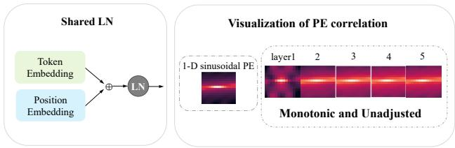
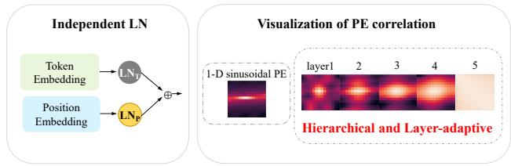
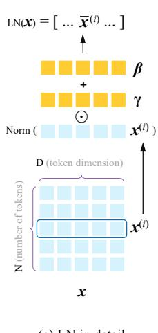
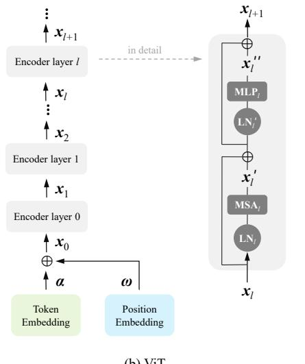
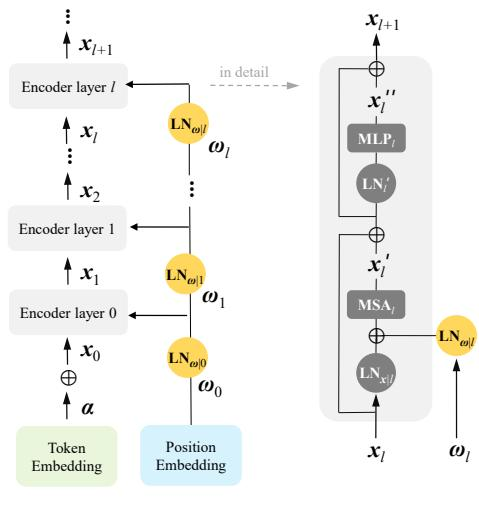
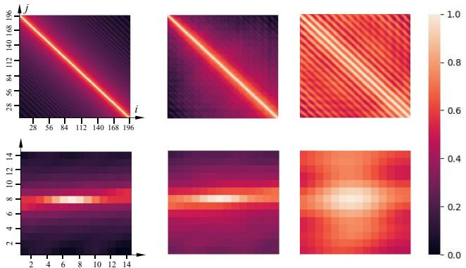
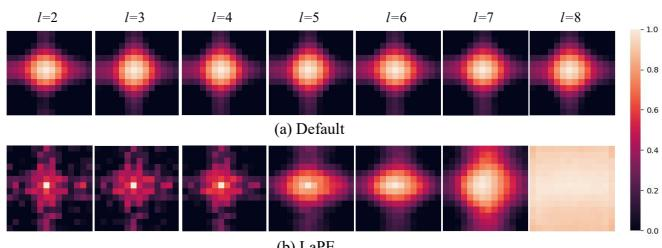
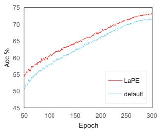
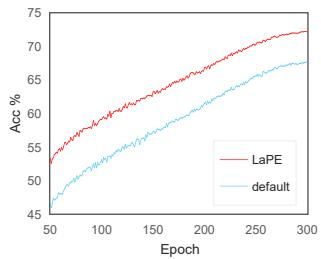

# LaPE: Layer-adaptive Position Embedding for Vision Transformers with Independent Layer Normalization

Runyi Yu1,3∗ Zhennan Wang2∗ Yinhuai Wang1∗ Kehan Li1,3 Chang Liu4 Haoyi Duan5 Xiangyang Ji4 Jie Chen1,2,3B

1School of Electronic and Computer Engineering, Peking University, Shenzhen, China 2Peng Cheng Laboratory, Shenzhen, China 3AI for Science (AI4S)-Preferred Program, Peking University Shenzhen Graduate School, China 4Department of Automation and BNRist, Tsinghua University, Beijing, China 5School of Computer Science and Technology, Zhejiang University, Zhejiang, China jiechen2019@pku.edu.cn

## Abstract

Position information is critical for Vision Transformers (VTs) due to the permutation-invariance of self-attention operations. A typical way to introduce position information is adding the absolute Position Embedding (PE) to patch embedding before entering VTs. However, this approach operates the same Layer Normalization (LN) to token embedding and PE, and delivers the same PE to each layer. This results in restricted and monotonic PE across layers, as the shared LN affine parameters are not dedicated to PE, and the PE cannot be adjusted on a per-layer basis. To overcome these limitations, we propose using two independent LNs for token embeddings and PE in each layer, and progressively delivering PE across layers. By implementing this approach, VTs will receive layer-adaptive and hierarchical PE. We name our method as Layer-adaptive Position Embedding, abbreviated as LaPE, which is simple, effective, and robust. Extensive experiments on image classification, object detection, and semantic segmentation demonstrate that LaPE significantly outperforms the default PE method. For example, LaPE improves +1.06%for CCT on CIFAR100, +1.57% for DeiT-Ti on ImageNet-1K, +0.7 box AP and +0.5 mask AP for ViT-Adapter-Ti on COCO, and +1.37 mIoU for tiny Segmenter on ADE20K. This is remarkable considering LaPE only increases negligible parameters, memory, and computational cost.

## 1. Introduction

Vision Transformer (VT) has become one of the most popular research topics due to its superior performance on various computer vision tasks, such as image classification, object detection, and semantic segmentation. ViT [10] is the first pure transformer model for image classification, which outperforms CNNs when applied to large training data. Since then, many works based on ViT [10] have sprung up. Lots of work improves the tokenization [14, 44], self-attention mechanism [23, 45, 35, 9], architecuture [33, 29, 43, 37, 24], and position embedding (PE) [6, 38, 27, 12].

  
(a) Default PE joining method

  
(b) The proposed LaPE  
Figure 1. A brief illustration of the default PE joining method and our proposed LaPE. We take T2T-ViT-7 with 1-D sinusoidal PE as an example, and we visualize the position correlation of first 5 layers to explain the emphasis and advantages of our method. (a) By default, token embedding and PE are coupled together and treated with the same Layer Normalization (LN) in each layer. This yields monotonic and limited position correlations. (b) We argue that each layer’s token embedding and PE need independent LNs (LNT, LNP). In this way, the expressiveness of PE is enhanced and the position correlations are adjusted into hierarchical and layer-adaptive.

Due to the permutation-invariance of self-attention operation, it is critical to provide position information for VTs. The solution can be roughly divided into two categories: (1) PE-based methods, including absolute and relative PE; (2) PE-free methods, typically designing modules with inductive bias (e.g., convolution) to include implicit position information. Most of the VTs use the absolute PE, and add it directly to the patch embedding before entering Transformer Encoders. But seldom do they notice the defect of joining PE in this way.

In this paper, we analyze the input and output of each encoder layer in VTs using reparameterization and visualization, and find that the default PE joining method has inherent drawbacks, which limit the performance of VTs. Most of the VTs deliver the same PE to each layer through shortcuts, and operate the same Layer Normalization (LN) [1] to PE and token embedding in each layer. However, PE and token embedding represent different information and have different distributions, so the affine parameters in LN have to trade off between them, which limits the expressiveness of PE and hence constrains the performance of VTs. Fig. 1 (a) provides an illustration.

To overcome this limitation with minimum cost, we propose to use two independent LN for token embeddings and PE in each layer (see Fig. 1 (b)), and deliver the PE serially across layers (see Fig. 2 (c)). By doing so, VTs receive layer-adaptive and hierarchical PE. We name this new PE joining method Layer-adaptive Position Embedding (LaPE), which yields significant improvement versus the default absolute PE joining method. Moreover, LaPE achieves better performance than relative PE and can further improve it (see Table 1 and Table 7), and LaPE can be used in parallel with PE-free methods to further improve the performance of VTs. Upon analysis, we find that LaPE can significantly enhance the expressiveness of PE, e.g., transforming a sinusoidal PE with 1-D correlation into 2-D correlation (Fig. 1 and Fig. 3), or generating hierarchical PEs that change from local to global as the layer goes deeper (Fig. 1 and Fig. 4).

Extensive experiments on image classification and downstream tasks demonstrate that LaPE can be a general method for Vision Transformers. It is effective and robust to various VTs on multiple tasks and datasets. On image classification, LaPE improves 0.84% accuracy for ViT-Lite [14] on Cifar10 [19], 1.06% for CCT [14] on Cifar100 [19], and 1.57% for DeiT-Ti [29] on ImageNet-1K [8]. On object detection, LaPE gains 0.7% APbox and 0.5% APmask for ViT-Adapter-Ti[5]. On semantic segmentation, LaPE improves 1.37% and 0.43% for tiny and small Segmenter [28], respectively. Besides, LaPE can also make VTs robust to PE types. Original DeiT-Ti [29] shows a performance gap of 3.84% between sinusoidal PE and learnable PE, while LaPE shrinks the gap to 0.59%. These results are remarkable, as the overhead introduced by LaPE (parameters, time and memory) is negligible compared to the improvement brought by it (Table 5 and 6).

To conclude, our contribution includes:

1 We provide theoretical analysis on the default use of absolute PE in common VTs and reveal its limitations.

2 We propose the LaPE, a new PE joining method, which is easy to implement and deploy. We reveal that LaPE can improve the expressiveness of PE and elevate the model performance.

3 Through extensive experiments, we verify that LaPE is a general and effective method for VTs on multiple tasks, including image classification, object detection, and semantic segmentation.

## 2. Related Work

## 2.1. Vision Transformers

Transformer was originally introduced for natural language processing [30], and recently extended to computer vision tasks, including image classification [29, 44, 23, 10, 43], detection [5, 20, 49, 3], segmentation [5, 18, 28], etc. Since we validate our method on classification, detection, and segmentation tasks, we summarize representative Transformer-based works in these fields.

Image Classification. ViT [10] is the first pure transformer outperforming CNNs on classification tasks, after which Vision Transformer (VT) becomes a research highlight. T2T-ViT [44] improves the tokenization part. DeiT [29] adds a distillation token. PVT [33] and PiT [17] adopt hierarchical structure. CvT [37] and CeiT [43] use convolution to provide VT with inductive bias. Swin-Transformer [23, 22] uses the window attention. These VTs all use absolute or relative position embedding (PE). However, seldom do they notice the limitations of the existing PE joining method.

Object Detection. DETR [3] enables object detection networks to be trained in an end-to-end module, and it uses a CNN backbone and Transformer encoder-decoder. Since then, many researchers work on optimizing DETR [49, 46, 13]. There are also many works using vanilla ViT as the backbone. ViTDeT [20] employs some upsampling and downsampling modules to the vanilla ViT. ViT-Adapter [5] uses additional architecture to introduce inductive bias, which adapts the model to detection and segmentation tasks.

Semantic Segmentation. SETR [47] first adopts ViT as the backbone and uses a standard CNN decoder. Segmenter [28] also extends ViT to semantic segmentation, and the difference is that Segmenter adopts a Transformer decoder. SegFormer [41] modifies the Transformer encoders into hierarchical ones. ViT-Adapter [5] uses additional architecture to inject inductive bias into ViT.

## 2.2. PE-Based Vision Transformer

Since the self-attention mechanism is permutationequivalent [30, 10], Vision Transformer (VT) needs PE to identify tokens from different positions. The PE can either be fixed or learnable, absolute or relative.

Absolute Position Embedding. The absolute PE encodes each position to distinguish tokens. It is usually added to the patch embedding before entering the Transformer encoders. In the original Transformer [30] and ViT [10], the PE is generated by the fixed sinusoidal functions of different frequencies. The sinusoidal functions are designed to provide PE with locally monotonous similarity so that PE can make VTs pay more attention to tokens close to each other [31]. The sinusoidal PE in Transformer [30] and ViT [10] is 1-D, which can sense the sequence length. Meanwhile, there are 2-D sinusoidal PE [36, 26], which has image height and width sensing. Moreover, the absolute PE can also be learnable, which is randomly initialized and updated with the model’s parameters.

Relative Position Embedding. The relative PE encodes the relative position between each pair of tokens. It first assigns a unique code to each relative position and then involves the relative position embedding (RPE) in the attention calculation. For natural language processing, the relative PE is first proposed in [27], then further improved in XL-Net [42], T5 [25] and DeBERTa [16]. For vision tasks, a 2-D RPE is firstly proposed in [2], which is also used in Swin-Transformer [23]. iRPE [38] further improves the 2-D RPE in its index function and relative position calculation. It is worth mentioning that our method for absolute PE performs better than relative PE, even with fewer parameters to learn position information.

## 2.3. PE-Free Vision Transformer

There are some works [12, 6, 9] designing position fusing modules to provide VTs with implicit position information. ConViT [12] proposes a Gated Positional Self-Attention module to balance learning content-based attention and position-based attention. CPVT [6] proposes a convolution-based Positional Encoding Generator module. CSwin [9] proposes Locally-Enhanced Positional Encoding, which uses a per-channel learnable bias to fit the position information. CCT[14] uses convolutions to get the position information, and sets the PE to be optional, as using PE or not yields similar results.

Our method has obvious advantages over these PE-free methods. Firstly, they all tend to modify the model and propose new pipelines, so the generalizability of their position fusing modules has not been verified. Secondly, these newly designed modules bring obvious extra computation and parameters. In contrast, our method is a universal PE-based method with good performance, and its increased parameters and computational cost are negligible. What’s more, our method is also compatible with these PE-free VTs, e.g., simply adding LaPE to CCT [14] can further improve the performance, as is shown in Table 2.

## 3. Layer-adaptive Position Embedding

## 3.1. Preliminary

Layer Normalization. Let us review the Layer Normalization (LN) [1]. Given a target tensor x $\in \mathbb { R } ^ { N \times D }$ that consists of N tokens $\pmb { x } ^ { ( i ) } \in \mathbb { R } ^ { 1 \times \top }$ , the operation of LN(x) normalizes each token and applies channel-wise affine transformations, which can be formulated as:

$$
\begin{array} { r } { \bar { \pmb { x } } ^ { ( i ) } = \gamma \odot \frac { \pmb { x } ^ { ( i ) } - \mathrm { E } [ \pmb { x } ^ { ( i ) } ] } { \sqrt { \mathrm { V a r } [ \pmb { x } ^ { ( i ) } ] + \epsilon } } + \beta , } \\ { \mathrm { L N } ( \pmb { x } ) = [ \bar { \pmb { x } } ^ { ( 1 ) } , . . . , \bar { \pmb { x } } ^ { ( N ) } ] , } \end{array}\tag{1}
$$

where $\mathrm { E } [ \pmb { x } ^ { ( i ) } ]$ and $\mathrm { V a r } [ \mathbf { x } ^ { ( i ) } ]$ represent the mean and variance of $\mathbf { \boldsymbol { x } } ^ { ( i ) }$ . ϵ is a small constant for division stability. Operation ⊙ denotes element-wise multiplication. $\gamma , \beta \in \mathbb { R } ^ { 1 \times D }$ represent the trainable affine transformation coefficients. Note that the affine transformation is designed to compensate for the loss of expressiveness caused by normalization [1, 39]. Fig. 2 (a) illustrates the process of Eq. (1).

Use of Absolute Position Embedding. Let us review the use of absolute position embedding in Vision Transformers (VTs) with equations. The input of the first layer is:

$$
\begin{array} { r } { { \pmb x } _ { 0 } = { \pmb \alpha } + { \pmb \omega } , } \end{array}\tag{2}
$$

where α and ω represent the token embedding and ${ \mathrm { P E } } ,$ respectively. The following process of each layer can be formulated as:

$$
{ \mathbf { } } { \mathbf { } } { \mathbf { } } { \mathbf { } } { \mathbf { } } ^ { \prime } = { \mathbf { M } } { \mathbf { S } } { \mathbf { A } } _ { l } ( { \mathbf { L } } { \mathbf { N } } _ { l } ( { \mathbf { } } { \mathbf { } } { \mathbf { ) } } ) ,\tag{3}
$$

$$
{ \mathbf { } } { \mathbf { } } { \mathbf { } } { \mathbf { } } { \mathbf { } } { \mathbf { } } { \mathbf { } } { \mathbf { } } { \mathbf { } } { \mathbf { } } { \mathbf { } } { \mathbf { } } { \mathbf { } } { \mathbf { } } { \mathbf { } } { \mathbf { } } { \mathbf { } } { \mathbf { } } { \mathbf { } } { \mathbf { } } { \mathbf { } } { \mathbf { } } { \mathbf { } } { \mathbf { } } { \mathbf { } } { \mathbf { } } { \mathbf { } } { \mathbf { } } { \mathbf { } } { \mathbf { } } { \mathbf { } } { \mathbf { } } { \mathbf { } } { \mathbf { } } { \mathbf { } } { \mathbf { } } { \mathbf { } } { \mathbf { } } { \mathbf { } } { \mathbf { } } { \mathbf { } } { \mathbf { } } { \mathbf { } } { \mathbf { } } { \mathbf { } } { \mathbf { } } { \mathbf { } } { \mathbf { } } { \mathbf { } } { \mathbf { } } { \mathbf { } } { \mathbf { } } { \mathbf { } } { \mathbf { } } { \mathbf { } } { \mathbf { } } { \mathbf { } } { \mathbf { } } { \mathbf { } } { \mathbf { } } { \mathbf { } } { \mathbf { } } { \mathbf { } } { \mathbf { } } { \mathbf { } } { \mathbf { } } { \mathbf { } } { \mathbf { } } { \mathbf { } } { \mathbf { } } { \mathbf { } } { \mathbf { } } { \mathbf { } } { \mathbf { } } { \mathbf { } } { \mathbf { } } { \mathbf { } } { \mathbf { } } { \mathbf { } } { \mathbf { } } { \mathbf { } } { \mathbf { } } { \mathbf { } } { \mathbf { } } { \mathbf { } } { \mathbf { } } { \mathbf { } } { \mathbf { } } { \mathbf { } } { \mathbf { } } { \mathbf { } } { \mathbf { } } { \mathbf { } } { \mathbf { } } { \mathbf { } } { \mathbf { } } { \mathbf { } } { \mathbf { } } { \mathbf { } } { \mathbf { } } { \mathbf { } } { \mathbf { } } { \mathbf { } } { \mathbf { } }  \mathbf\tag{4}
$$

$$
{ \pmb x } _ { l + 1 } = { \pmb x } _ { l } + { \pmb x } _ { l } ^ { \prime } + { \pmb x } _ { l } ^ { \prime \prime } ,\tag{5}
$$

where l is the index of layer, MSA denotes the Multi-Head Self-Attention module, and MLP denotes the Multi-Layer Perceptron module. $\mathrm { L N } _ { l }$ and $\mathrm { L N } _ { l ^ { \prime } }$ represent different LN before MSA and MLP. Fig. 2 (b) illustrates these processes.

## 3.2. Problem of Default PE Joining Method

We decouple the position information for each Transformer layer, and find the defect of the default PE joining method. Intuitively, the PE ω added to the first layer can propagate to deeper layers due to the skip connections.

  
(a) LN in detail

  
(c) ViT + LaPE  
Figure 2. Illustrations. (a) Details of layer normalization (LN). (b) Typical ViT [10] structures (left), with detailed illustration of a encoder layer(right). (c) Apply LaPE to ViT. Specifically, we add independent LNs for PE at each layer, and add it to the layer normalized token embedding as the input of MSA module. Besides, the PE is passed progressively across layers.

By reparameterizing $x _ { l }$ (see Appendix 1 for detailed derivation), we can rewrite Eq. (3) as:

$$
\begin{array} { r l r } {  { \boldsymbol { x } _ { l } } ^ { \prime } = \mathrm { M S A } _ { l } ( \mathrm { L N } _ { l } ( \boldsymbol { \alpha } + \boldsymbol { \omega } + \sum _ { k = 0 } ^ { l - 1 } ( \boldsymbol { x } _ { k } ^ { \prime } + \boldsymbol { x } _ { k } ^ { \prime \prime } ) ) ) } \\ & { } & { = \mathrm { M S A } _ { l } ( \mathrm { L N } _ { l } ( \tilde { \boldsymbol { x } _ { l } } + \boldsymbol { \omega } ) ) } \\ & { } & { = \mathrm { M S A } _ { l } ( \lambda _ { 1 } \mathrm { L N } _ { l } ( \tilde { \boldsymbol { x } _ { l } } ) + \lambda _ { 2 } \mathrm { L N } _ { l } ( \boldsymbol { \omega } ) + \lambda _ { 3 } \beta _ { l } ) , } \end{array}\tag{6}
$$

where we use $\tilde { x _ { l } }$ to represent $\pmb { \alpha } + \sum _ { k = 0 } ^ { l - 1 } ( \pmb { x } _ { k } ^ { \prime } + \pmb { x } _ { k } ^ { \prime \prime } )$ then split $\mathrm { L N } _ { l } ( \tilde { \mathbf { x } _ { l } } + \omega )$ into three parts. $\beta _ { l }$ is the bias in affine parameters of $\mathbf { L } \mathbf { N } _ { l } . \ \lambda \in \mathbb { R } ^ { N \times 1 }$ represent token-wise coefficients, with following values:

$$
\begin{array} { r l } & { \lambda _ { 1 } = \cfrac { \sigma _ { \tilde { x } } } { \sigma _ { \tilde { x } + \omega } } , } \\ & { \lambda _ { 2 } = \cfrac { \sigma _ { \omega } } { \sigma _ { \tilde { x } + \omega } } , } \\ & { \lambda _ { 3 } = \cfrac { \sigma _ { \tilde { x } + \omega } - \sigma _ { \tilde { x } } - \sigma _ { \omega } } { \sigma _ { \tilde { x } + \omega } } , } \end{array}\tag{7}
$$

where $\pmb { \sigma } _ { ( . ) } \in \mathbb { R } ^ { N \times 1 }$ is the token-wise standard deviation.

From Eq. (6), we can see that the token embeddings ˜x share the same affine parameters with the position embedding ω. As mentioned in Section 3.1, the affine transformation in LN is to compensate for the expressiveness loss and further enhance the expressiveness of embedding. When token and position embedding are coupled, the affine parameters have to trade off between these two embeddings with different distributions, limiting the expressiveness of PE. Such a trade-off can be seen in Fig. 1 (a), where the PE is changed at the first layer while becomes almost unchanged in subsequent layers.

## 3.3. LaPE for Vision Transformers

To overcome this limitation, we use two independent LNs for token embeddings and PE for each layer and add them together as the input of each layer’s MSA module. This allows the model to independently and adaptively adjust the expressiveness of PE for different layers.

Specifically, we set the input of the first layer as

$$
\mathbf { \boldsymbol { x } } _ { 0 } = \mathbf { \boldsymbol { \alpha } } ,\tag{8}
$$

then modify Eq. (3) into:

$$
\begin{array} { r } { \pmb { x } _ { l } ^ { \prime } = \mathrm { M S A } _ { l } ( \mathrm { L N } _ { \pmb { x } | l } ( \pmb { x } _ { l } ) + \mathrm { L N } _ { \omega | l } ( \omega _ { l } ) ) . } \end{array}\tag{9}
$$

Note that $\mathrm { L N } _ { x \mid l }$ and $\mathrm { L N } _ { \omega | l }$ own different affine transformation coefficients. Besides, ω represents the PE transferred to layer l, which is yielded progressively:

$$
\omega _ { 0 } = \omega ,\tag{10}
$$

$$
\begin{array} { r } { \omega _ { l } = \mathrm { L N } _ { \omega | l - 1 } ( \omega _ { l - 1 } ) . } \end{array}\tag{11}
$$

We also tried to set the PE of each layer to be the same, i $\mathbf { \nabla } . \mathbf { e } _ { \cdot } , \omega _ { l } = \omega$ . Setting $\omega _ { l } = \omega$ achieves similar performance to our method on tiny-sized VTs, but sometimes performs even worse on small-sized or larger VTs. Through analysis of the loss value, we find that the failure cases are usually caused by overfitting. To further improve the robustness, we propose to pass the PE serially across layers, as shown in Eq. (11). Extensive experiments prove the effectiveness of such modification, as shown in Tab. 7.

Fig. 2 (c) illustrates our final method. As the critical operation in Eq. (9) can adjust the PE per layer, we name it as Layer-adaptive Position Embedding (LaPE), which is an effective method for VTs on multiple tasks.

  
(a) ω  
(b) λ2LNl (ω)  
(c) $\mathrm { L N } _ { \omega | l } ( \pmb { \omega } )$  
Figure 3. Visualization of the position correlations. (a) The original 1-D sinusoidal PE ω shows 1-D position correlations. (b) $\lambda _ { 2 } \mathrm { L N } _ { l } ( \omega )$ in Eq. (6) exhibits limited 2-D correlations. (c) $\mathrm { L N } _ { \omega | l } ( \omega )$ shows significant 2-D correlations.

## 3.4. Analysis

As is revealed by previous works [34, 32, 11], PE works as a position inductive bias. The information contained in PE is the position correlation, which depicts the similarity between tokens’ position embeddings.This information is utilized in the Query-Key calculation within Multi-Head Self-Attention (MSA). Such information guides tokens to attend more to the adjacent tokens. The detailed explanation and derivations are presented in Appendix 3.

We decouple the PEs from each Transformer encoder and visualize their position correlations. The visualization results strongly support our analysis: (1) Using the same LN for token and position embeddings receives limited position correlations; (2) Using two independent LN for token and position embeddings gets improved position correlations. For example, transform a 1-D sinusoidal PE into 2-D one, and transform monotonic PEs into hierarchical ones.

Implementation of Visualization. The PE describes each token’s positional embedding, which has the hidden information of the position correlation. Moreover, the position correlation can be measured by the cosine similarity between each token’s PE:

$$
s _ { i , j } = \frac { \omega ^ { ( i ) } \omega ^ { ( j ) T } } { | | \omega ^ { ( i ) } | | | \omega ^ { ( j ) } | | } ,\tag{12}
$$

where $\boldsymbol { \omega } ^ { ( i ) } \in \mathbb { R } ^ { 1 \times D }$ and $\boldsymbol { \omega } ^ { ( j ) } \in \mathbb { R } ^ { 1 \times D }$ denote the ith and jth token’s PE, respectively. $s _ { i , j }$ represents the position correlation between the ith and jth token.

Changing 1-D correlated sinusoidal PE into 2-D one. Since T2T-ViT-7 [44] uses a 1-D sinusoidal PE, we adopt it for demonstration. Concretely, we visualize every $s _ { i , j }$ by converting $s _ { i , j }$ into color pixels and combining all pixels into a heat map, the upper part of Fig. 3 (a), where the horizontal and vertical axes denote the token index i and j.

  
(b) LaPE  
Figure 4. Visualization of the position correlations at different layers. (a) The default position correlation seems monotonic among different layers. (b) LaPE-based position correlation changes from local to global as the layer goes deeper.

That is to say, row i represents the correlation between token i and all 196 tokens, while the column j represents the correlation between all 196 tokens and token j.

Since the original tokens are taken from 2-D images, we reshape the position correlations accordingly. Specifically, we reshape the 96th row (the center token) of the upper part of Fig. 3 (a) into a 2-D heat map (with shape 14×14), and get the lower part of Fig. 3 (a), which shows obvious 1-D position correlation, as it only has horizontal position perception without vertical perception.

To compare the position correlation of T2T-ViT-7 with default PE and LaPE, we choose the 2nd layer (l=2) and calculate its cosine similarity $s _ { i , j }$ for $\lambda _ { 2 } \mathrm { L N } _ { l } ( \omega )$ in Eq. (6) (default PE joining method) and $\mathbf { L N } _ { \omega | l } ( \omega _ { l } )$ in Eq. (9) (LaPE). Then we get Fig. 3 (b) and Fig. 3(c). We can clearly see that Fig. 3 (b) still shows 1-D position correlations, while Fig. 3 (c) shows evident 2-D position correlations. 2-D position correlations are obviously better than 1-D ones since images are perceptually 2-D information. The visualization results indicate that LaPE can adjust the position correlation of PE and further improve its expressiveness.

From Monotonic to Hierarchical. Here we take DeiT-Ti [29] as an example to illustrate. From the 2nd layer to the 8th layer, we visualize the position correlations with the method mentioned above. Fig. 4 (a) shows the visualization of $\lambda _ { 2 } \mathrm { L N } _ { l } ( \omega )$ in Eq. (6) (default PE), and the visual results seem monotonic. Fig. 4 (b) shows the visualization of $\mathrm { L N } _ { \omega | l } ( \omega _ { l } )$ in Eq. (9) (LaPE), and the visual results change obviously from local to global as the layer goes deeper. This indicates that LaPE can process layer adaptive (namely, hierarchical) PE for $\operatorname { V T s } ,$ and this property better fits the model’s requirement for position information.

## 4. Experiments

## 4.1. Image Classification

Settings. We conduct experiments on CIFAR-10 and CIFAR-100 [19] with 50K training samples and 10K testing samples for 10 classes and 100 classes, respectively, and on ILSVRC-2012 ImageNet [8] with 1.28M training samples and 50K testing samples for 1K classes.

<table><tr><td rowspan="2">Model</td><td rowspan="2">Transformer Architecture</td><td rowspan="2">PE type</td><td rowspan="2">PE method</td><td colspan="2">ImageNet Top1</td></tr><tr><td>100 epoch</td><td>300 epoch</td></tr><tr><td>DeiT-Ti [29]</td><td rowspan="6"></td><td rowspan="6">Learnable</td><td>Default</td><td>58.13</td><td>71.54</td></tr><tr><td></td><td>LaPE Default</td><td>60.36</td><td>73.11</td></tr><tr><td></td><td>LaPE</td><td>68.41</td><td>80.00</td></tr><tr><td>DeiT-S [29] Pure</td><td></td><td>69.49</td><td>80.54</td></tr><tr><td>DeiT-B [29]</td><td>Default LaPE</td><td>74.16</td><td>81.64</td></tr><tr><td></td><td>Default</td><td>75.43 65.62</td><td>81.97 71.69</td></tr><tr><td>T2T-ViT-7 [44] DeiT-Ti-distill [29]</td><td rowspan="6">Distillation</td><td rowspan="3">Sinusoidal</td><td>LaPE</td><td>66.43</td><td>71.92</td></tr><tr><td rowspan="3"></td><td>Default</td><td>61.89</td><td>74.16</td></tr><tr><td>LaPE</td><td>63.43</td><td>74.97</td></tr><tr><td>Default</td><td>70.65</td><td>80.98</td></tr><tr><td>DeiT-S-distll [29]</td><td>Learnable</td><td>LaPE</td><td>71.84</td><td>81.48</td></tr><tr><td rowspan="2">DeiT-B-distll [29]</td><td rowspan="2"></td><td>Default</td><td>76.41</td><td>83.05</td></tr><tr><td>LaPE</td><td>77.39</td><td>83.41</td></tr><tr><td rowspan="5">Swin-Ti [23] Swin-S [23]</td><td rowspan="5">Window Attention</td><td>RPE Learnable</td><td>Default</td><td>73.79 72.76</td><td>81.12 80.92</td></tr><tr><td></td><td>LaPE</td><td>73.39</td><td>81.25</td></tr><tr><td>Learnable + RPE</td><td>LaPE</td><td>74.02</td><td>81.49</td></tr><tr><td>RPE</td><td></td><td>76.03</td><td>83.17</td></tr><tr><td>Learnable</td><td>Default</td><td>75.37</td><td>82.81</td></tr><tr><td rowspan="2">CeiT-Ti [43]</td><td rowspan="2"></td><td rowspan="2">Learnable + RPE</td><td>LaPE LaPE</td><td>76.50 76.93</td><td>83.26 83.39</td></tr><tr><td>Default</td><td></td><td></td></tr><tr><td rowspan="2"></td><td rowspan="2">Convolution</td><td rowspan="2">Learnable</td><td>LaPE</td><td>66.91</td><td>76.52 76.87</td></tr><tr><td>Default</td><td>67.21 73.60</td><td>81.88</td></tr><tr><td>CeiT-S [43]</td><td></td><td></td><td>LaPE</td><td>73.87</td><td>82.12</td></tr></table>

Table 1. Image classification results on ImageNet-1K. As shown here, applying LaPE to VTs improves their performance and accelerates the convergence on ImageNet-1K. LaPE is effective and robust to VTs with different architectures and different PE types.

<table><tr><td rowspan="2">Model</td><td rowspan="2">Transformer Architecture</td><td rowspan="2">PE method</td><td colspan="2">Top1 Acc.</td></tr><tr><td></td><td>C-10 Top1 C-100 Top1</td></tr><tr><td rowspan="2">ViT-Lite [14]</td><td rowspan="2">Pure</td><td>Default</td><td>93.448</td><td>74.984</td></tr><tr><td>LaPE</td><td>94.290</td><td>75.534</td></tr><tr><td rowspan="2">CVT [14]</td><td rowspan="2">Sequence Pooling</td><td>Default</td><td>94.302</td><td>77.452</td></tr><tr><td>LaPE</td><td>94.690</td><td>78.052</td></tr><tr><td rowspan="2">CCT [14]</td><td rowspan="2">Convolution</td><td>Default</td><td>96.034</td><td>80.928</td></tr><tr><td>LaPE</td><td>96.530</td><td>81.986</td></tr></table>

Table 2. Image classification results on CIFAR-10 and CIFAR-100. As shown here, LaPE can further improve the performance of VTs which are specially designed for tiny datasets. Noted that the performance on CIFAR-10 is saturated (reaching around 95%), while LaPE can still bring obvious improvement to all these VTs.

On ImageNet-1K, we conduct experiments with DeiT [29] and T2T-ViT [44] (pure Transformer), DeiT-distill (Transformer with distillation), Swin-Transformer[23] (Transformer with window attention), and CeiT [43] (Transformer with convolution). We select tiny and small variants for Swin and CeiT, and an additional base variant for DeiT and DeiT-distill. For T2T-ViT, we choose T2T-

ViT-7 with the depth of 7. We conduct four sets of experiments for each Swin-Transformer variants, including (1) using RPE, (2) using default learnable PE, (3) usig LaPEbased learnable PE, (4) using LaPE-based learnable PE and RPE together. Experiments (2) & (3) are for fair comparison, while (1) & (3) & (4) are set to verify the superiority of LaPE.

On CIFAR, we conduct experiments with ViT-Lite [14] (pure Transformer), CVT [14] (Transformer with sequence pooling) and CCT [14] (Transformer with convolution). These three models all use the learnable absolute PE. The ViT-Lite and CVT have a depth of 7 and kernel size of 4, while CCT has a depth of 7, kernel size of 3, and convolution layer of 1.

Implementation Details. For fair comparison, we use the same settings as introduced in the original papers. Specifically, all VTs are trained for 300 epochs (except 310 epochs for T2T-ViT) with 224×224 resolution images on ImageNet-1K [8], and with 32×32 resolution images on CIFAR-10 and CIFAR-100 [19]. We run 5 rounds with different random seeds (121, 122, 123, 124, 125) on CIFAR-10 and CIFAR-100, and take the average for evaluation. All

<table><tr><td>Model</td><td>Pre-trained Model</td><td>PE Method</td><td>#param.</td><td> $\mathrm { A P } ^ { \mathrm { b o x } } / \mathrm { A P } ^ { \mathrm { m a s k } }$ </td></tr><tr><td>ViT-Adapter-Ti</td><td>DeiT-Ti DeiT-Ti*</td><td>Default LaPE</td><td>28M 28M</td><td>45.6 / 40.7 46.3 / 41.2</td></tr><tr><td>ViT-Adapter-S</td><td>DeiT-S DeiT-S*</td><td>Default LaPE</td><td>48M 48M</td><td>48.3 / 42.8 48.7 / 43.0</td></tr></table>

Table 3. Object detection results on COCO. ∗ means models pre-trained with LaPE. The results further indicate that LaPE is a general and effective method, as it can improve models obviously and stably on object detection.

VTs are trained on a single node with 1 V100 GPU on CI-FAR, and 4 V100 GPUs on ImageNet (except for 8 GPUs used by DeiT-B, DeiT-B-distill and Swin). We retrain all the baseline models, thus the results may be slightly different from those introduced in the original papers due to the device difference.

ImageNet-1K Results. Tab. 1 presents comparisons between models with and without LaPE on ImageNet-1K [8]. According to the results, we find that LaPE can greatly improve the vanilla VTs, like 1.57% performance gains for DeiT-Ti, and 0.81% for DeiT-Ti-distill. The results for Swin-Transformer shows that VTs with learnable PE by LaPE performs better than by default and RPE. Moreover, using RPE together with LaPE-based learnable PE performs best on both Swin-Ti and Swin-S. These results further verify our point of view: (1) Independent LNs are important for absolute PE, which can be proved by the comparison between default and LaPE-based learnable PE; (2) Passing PE progressively across layers performs better. Both RPE and LaPE-based learnable PE are adaptive on a per-layer basis, but RPE has no connection across layers, while LaPE transmits the PE progressively across layers. In this way, despite RPE has a significantly larger number of parameters, LaPE still performs better than it.

What’s more, LaPE can still bring obvious and stable improvement for models with locality information or inductive bias, like 0.23% performance gains for T2T-ViT-7 and 0.35% for CeiT-Ti. Moreover, LaPE significantly accelerates the convergence, as can be observed from the accuracy at 100 epochs. Fig. 5 shows the convergence curves of DeiT-Ti.

CIFAR Results. As shown in Tab. 2, although the performance on CIFAR-10 is almost saturated, LaPE still brings 0.8%, 0.4%, and 0.5% for for ViT Lite, CVT, and CCT. Besides, LaPE also improves 0.4%, 0.6%, and 1.0% for ViT Lite, CVT, and CCT on CIFAR-100, respectively. Note that the PE is optional for default CCT, as using default PE yields comparable results. However, CCT with LaPE performs 0.5% and 1.0% better than CCT with default PE on CIFAR-10 and CIFAR-100, which further indicates the superiority of LaPE.

<table><tr><td rowspan=1 colspan=1>Model</td><td rowspan=1 colspan=1>Pre-trainedModel</td><td rowspan=1 colspan=1>PEMethod</td><td rowspan=1 colspan=1>#param.</td><td rowspan=1 colspan=1>valmIoU</td></tr><tr><td rowspan=1 colspan=1>Seg-T-Mask/16Seg-S-Mask/16</td><td rowspan=1 colspan=1>DeiT-TiDeiT-Ti*DeiT-SDeiT-S*</td><td rowspan=1 colspan=1>DefaultLaPEDefaultLaPE</td><td rowspan=1 colspan=1>7M7M27M27M</td><td rowspan=1 colspan=1>36.53437.90842.37442.808</td></tr><tr><td rowspan=4 colspan=1>ViT-Adapter-TiViT-Adapter-S</td><td rowspan=2 colspan=1>DeiT-TiDeiT-Ti*</td><td rowspan=2 colspan=1>DefaultLaPE</td><td rowspan=1 colspan=1>36M</td><td rowspan=1 colspan=1>40.660</td></tr><tr><td rowspan=1 colspan=1>36M</td><td rowspan=1 colspan=1>41.520</td></tr><tr><td rowspan=2 colspan=1>DeiT-SDeiT-S*</td><td rowspan=2 colspan=1>DefaultLaPE</td><td rowspan=1 colspan=1>58M</td><td rowspan=1 colspan=1>45.073</td></tr><tr><td rowspan=1 colspan=1>58M</td><td rowspan=1 colspan=1>45.550</td></tr></table>

Table 4. Semantic segmentation results on ADE20K, where LaPE consistently brings stable and obvious improvements. ∗ means models pre-trained with LaPE. Note that Segmenter with DeiT (pre-trained on ImageNet-1K) is different from ViT (pretrained on ImageNet-21K) as officially reported.

## 4.2. Object Detection

Settings. COCO 2017 [21] is the most commonly used dataset for object detection and instance segmentation tasks, and it has 118K training samples and 5K validation samples. To further evaluate the effectiveness of object detection, we conduct experiments with Transformer-based ViT-Adapter [5] based on Mask R-CNN [15]. We choose two variants denoted as ViT-Adapter-Ti/S.

Implementation Details. We evaluate LaPE on ViT-Adapter [5] based on mmdet [4] codebase with the same official settings for basic models and LaPE-based models (cf. Appendix 4). We run 5 rounds with different random seeds (121, 122, 123, 124, 125) for each experiment, and use the averages as the final results. All VTs on object detection are trained on a single node with 4 V100 GPUs.

Results. Table 3 justifies the effectiveness of our LaPE on object detection. The improvement is +0.7 box AP and +0.5 mask AP for the tiny variant, and +0.4 box AP and +0.2 mask AP for the small variant.

## 4.3. Semantic Segmentation

Settings. ADE20K [48] is a widely-used semantic segmentation dataset with 150 semantic categories. It has 25K images in total, which includes 20K training images, 2K validation images, and 3K testing images. In order to evaluate our proposed LaPE on semantic segmentation tasks, we choose some Transformer-based models, including Segmenter [28] and ViT-Adapter [5]. For Segmenter, we choose tiny, and small-sized variants, which are Seg-Ti-Mask/16 (denoting the tiny variant using mask transformer as the decoder with 16×16 input patch size) and Seg-S-Mask/16. For ViT-Adapter, we also choose two kinds of variants using UperNet [40] framework, denoted as ViT-Adapter-Ti/S.

Implementation Details. We use the MMseg [7] codebase to implement and evaluate LaPE. We follow the same settings introduced in the original papers (see Appendix 4). We also run 5 rounds for each result, and each experiment is trained on a single node with 4 V100 GPUs.

<table><tr><td rowspan="2">Model</td><td>Default / LaPE</td></tr><tr><td>#parameter (M) Accuracy</td></tr><tr><td>DeiT-Ti DeiT-S</td><td>5.717 / 5.722 (+0.08%) 71.54 / 73.11 (+2.19%)</td></tr><tr><td>DeiT-B</td><td>22.051 / 22.060 (+0.04%) 80.00 / 80.54 (+0.68%) 86.568 / 86.586 (+0.02%) 81.64 / 81.97 (+0.40%)</td></tr></table>

Table 5. Comparison between LaPE and the default method on parameter and accuracy increment on DeiT. The significant disparity in accuracy improvement and parameter increase further confirms the effectiveness of LaPE.
<table><tr><td rowspan=2 colspan=1>Model</td><td rowspan=1 colspan=1>Default / LaPE</td></tr><tr><td rowspan=1 colspan=1>Memory (MB)          Time (s/epoch)</td></tr><tr><td rowspan=1 colspan=1>DeiT-Ti</td><td rowspan=3 colspan=1>10799 / 10822 (+0.21%) 410 / 412 (+0.48%)18051 / 18073 (+0.12%) 511 / 516 (+0.98%)19489 / 19537 (+0.25%) 588 / 590 (+0.51%)</td></tr><tr><td rowspan=1 colspan=1>DeiT-S</td></tr><tr><td rowspan=1 colspan=1>DeiT-B</td></tr></table>

Table 6. Memory and time consumption of DeiT’s training stage. Note that DeiT/S are trained with 4 GPUs (256 batchsize for each), while DeiT-B is trained with 8 GPUs (128 batchsize for each). The results shows that the consumptions of memory and time brought by LaPE is negligible.

Results. Table 4 presents comparisons between Transformer-based models with default PE and LaPE on ADE20K [48]. We can see that LaPE brings obvious improvement for both Segmenter and ViT-Adapter. The improvement for tiny variants is +1.37 and +0.86 mIoU for Segmenter and ViT-Adapter, while the improvement for small variants is about +0.5 mIoU for both of them.

## 4.4. Consumption

In Tab. 5, we record and compare the parameter and accuracy increment on default and LaPE-based DeiT variants, and the results verify that LaPE is an effective and efficient PE method. Tab. 6 records and compares the memory and time consumption of the default PE method and LaPE in the training stage. As shown in Tab. 6, we can see that LaPE increases negligible memory and time consumption during training, which further proves the efficiency of our method.

## 4.5. Ablation Study

PE Joining Methods. To prove the superiority and completeness of our proposed LaPE, we conduct experiments on DeiT-Ti [29] with different PE joining methods. We choose 4 kinds of PE types (RPE, 1-D/2-D sinusoidal, learnable PE), and 5 joining methods, which are default, shared PE, unshared PE, LaPE (sharing PE), and LaPE. We evaluate 4 joining methods (except for the unshared PE) on 1-D and

<table><tr><td rowspan=1 colspan=1>Model</td><td rowspan=1 colspan=1>PE Type</td><td rowspan=1 colspan=1>PE JoiningMethod</td><td rowspan=1 colspan=1>PE#param.</td><td rowspan=1 colspan=1>IN-1KTop1</td></tr><tr><td rowspan=4 colspan=1>DeiT-Ti</td><td rowspan=1 colspan=1>RPE</td><td rowspan=1 colspan=1>default</td><td rowspan=1 colspan=1>3049K</td><td rowspan=1 colspan=1>72.82</td></tr><tr><td rowspan=1 colspan=1>1-D Sin.</td><td rowspan=1 colspan=1>defaultshared PELaPE (sharing PE)LaPE</td><td rowspan=1 colspan=1>38K38K42K42K</td><td rowspan=1 colspan=1>67.7070.6672.2272.52</td></tr><tr><td rowspan=1 colspan=1>2-D Sin.</td><td rowspan=1 colspan=1>basic PEshared PELaPE (sharing PE)LaPE</td><td rowspan=1 colspan=1>38M38K42K42K</td><td rowspan=1 colspan=1>71.4671.4772.4972.68</td></tr><tr><td rowspan=1 colspan=1>learnable</td><td rowspan=1 colspan=1>basic PEshared PEunshared PELaPE (sharing PE)LaPE</td><td rowspan=1 colspan=1>38K38K454K42K42K</td><td rowspan=1 colspan=1>71.5472.0071.9072.8673.11</td></tr></table>

Table 7. Comparison between LaPE and other PE joining methods with DeiT-Ti on ImageNet-1K. PE #params means parameters used to represent and adjust the PE. LaPE shows its superiority in the way of PE joining, as it achieves the best performance on all three kinds of PE types. Moreover, LaPE can shrink the performance gaps caused by using different PE types.  

  
Figure 5. Convergence curves, default DeiT-Ti vs. LaPE-based DeiT-Ti. Curves on the left represent models using learnable PE, and curves on the right represent using 1-D sinusoidal one.

2-D sinusoidal PE, as they are fixed and designed in advance, and evaluate all 5 joining methods on learnable PE. To clearly and directly comprehend these joining methods, we analyze the input of each Multi-Head Self-Attention (MSA) in VTs using different PE joining methods. The default method has the input of MSA $\mathrm { L N } _ { l } ( { \pmb x } _ { l } )$ (Eq. (3)). The shared PE means adding the same PE to the token embedding before entering each encoder, which has the input $\mathrm { L N } _ { l } ( { \pmb x } _ { l } + { \pmb \omega } )$ . Similarly, the unshared PE means adding the layer-independently learned PE to token embedding, and its input of MSA is $\mathrm { L N } _ { l } ( { \pmb x } _ { l } + { \pmb \omega } _ { l } )$ . LaPE (sharing PE) is slightly different from LaPE, as it has the input $\mathrm { L N } _ { x \mid l } ( { \pmb x } _ { l } ) +$ $\mathrm { L N } _ { \omega | l } ( \omega )$ , which means each position LN receives the same PE. Meanwhile, LaPE has the input $\mathrm { L N } _ { \mathbf { \boldsymbol { x } } | l } ( \mathbf { \boldsymbol { x } } _ { l } ) + \mathrm { L N } _ { \omega | l } ( \omega _ { l } )$ (Eq. (9)), and $\omega _ { l } = \mathrm { L N } _ { \omega | l - 1 } ( \omega _ { l } - 1 )$

In Tab. 7, LaPE outperforms other PE joining methods and RPE. Unshared PE and RPE set layer-independent parameters to learn each layer’s position information, which results in more parameters and less PE connection. In contrast, LaPE sets only one PE and uses serial LNs to learn each layer’s position information, which has fewer parameters and more PE connection and even achieves better performance. This demonstrates the importance of the PE connection and proves the superiority of LaPE. What’s more, we find that LaPE can alleviate the performance gap caused by different PE types. DeiT-Ti with default PE joining method [29] shows a performance gap of 3.84% between sinusoidal PE (67.70%) and learnable PE (71.54%). In contrast, LaPE improves these performances (+4.82% for sinusoidal PE, +1.57% for learnable PE), and shrinks the gap to 0.59%. The convergence curve is shown in Fig. 5. In all, LaPE shows its superiority among PE joining methods.

<table><tr><td>Model</td><td>Configuration</td><td>ImageNet-1K Top1</td></tr><tr><td rowspan="7">DeiT-Ti [29]</td><td>default</td><td>71.54</td></tr><tr><td> $\omega _ { l }$ </td><td>70.67</td></tr><tr><td> $\gamma \omega _ { l }$ </td><td>71.22</td></tr><tr><td> $\gamma \odot \omega _ { l }$ </td><td>71.13</td></tr><tr><td> $\gamma \odot \omega _ { l } + \beta$ </td><td>70.85</td></tr><tr><td> $\mathrm { N o r m } ( \omega _ { l } )$ </td><td>72.56</td></tr><tr><td> $\gamma \mathrm { N o r m } ( \omega _ { l } )$ </td><td>72.49</td></tr><tr><td></td><td> $\gamma \odot \mathrm { N o r m } ( \omega _ { l } )$ </td><td>71.80</td></tr><tr><td></td><td> $\gamma \odot \mathrm { N o r m } ( \omega _ { l } ) + \beta$ </td><td>73.11</td></tr></table>

Table 8. Decompose $\mathbf { L N } _ { \omega | l }$ in DeiT-Ti. ω denotes the PE; $\gamma$ denotes the weight constant; $\gamma$ accompanied by $\odot$ denotes perchannel weight vector; $\beta$ denotes the per-channel bias; Norm(·) denotes the token-wise normalization. The results show that the standard $\mathrm { L N } _ { \omega | l }$ (last configuration) is the best choice.

Decompose $\mathbf { L N } _ { \omega | l }$ . We conduct experiments on different components of $\mathrm { L N } _ { \omega _ { l } | l }$ , based on DeiT-Ti [29] in Tab. 8. The Default configuration means the original DeiT-Ti. The rest configurations all take similar network structures as LaPE-based DeiT-Ti, which is shown in Fig. 2 (c), except for $\mathrm { L N } _ { \omega | l } ( \omega _ { l } )$ . In Tab. 8, the configuration ω means replacing $\mathrm { L N } _ { \omega | l } ( \omega _ { l } )$ in Eq. (9) with $\omega _ { l } ; \gamma \omega _ { l }$ means replacing it with $\gamma \omega _ { l } ,$ , where $\gamma$ is a scalar; $\gamma \odot \omega _ { l }$ means replacing it with $\gamma \odot \omega _ { l }$ , where $\gamma$ denotes a per-channel scale factor; $\gamma \odot \omega _ { l } + \beta$ means replacing it with $\gamma \odot \omega _ { l } + \beta$ , where $\beta$ denotes a per-channel bias. Norm(ωl) means replacing it with Norm(ωl), where Norm(ωl) means operate per-token normalization to ωl. So on and so forth. The final configuration $\gamma \odot \mathrm { N o r m } ( \omega _ { l } ) + \beta$ is exactly $\mathbf { L N } _ { \omega | l } ( \omega _ { l } )$

Tab. 8 shows that the former four configurations, i.e., $\omega _ { l } .$ $\gamma \omega _ { l } , \gamma \odot \omega _ { l }$ , and $\gamma \odot \omega _ { l } + \beta$ perform slightly lower than the default configuration. This is understandable since the un-normalized PE may deviate a lot from a normalized token embedding. The latter four configurations, i.e., Norm (ωl), γNorm(ωl), γ⊙Norm(ωl), and $\gamma \odot \mathrm { N o r m } ( \omega _ { l } ) + \beta$ all perform better than the the default. Therefore, an independent normalization for PE is critical. However, we can see that $\gamma \mathrm { N o r m } ( \omega _ { l } )$ and $\gamma \odot \mathrm { N o r m } ( \omega _ { l } )$ yield worse results than $\mathrm { N o r m } ( \omega _ { l } )$ , which means an intact affine transformation is crucial for normalized PE. In all, LaPE shows the best performance by comparison.

## 5. Conclusion

We study position embedding (PE) in Vision Transformers (VTs) and propose a simple but effective method, LaPE. Specifically, LaPE uses two independent LNs for token embeddings and PE on each layer, and delivers the PE progressively across layers. In this way, LaPE can provide layeradaptive and hierarchical position information for VTs. Extensive experiments and ablation studies demonstrate the superiority of our method. LaPE has the potential to be an alternative PE joining method for general transformerbased models, and its effectiveness on Transformers for other modalities and tasks deserves further study, e.g., NLP, multimodal, and point cloud.

Acknowledgements. This work was supported in part by the National Key R&D Program of China (No. 2022ZD0118201), Natural Science Foundation of China (No. 61972217, 32071459, 62176249, 62006133, 62271465).

## References

[1] Jimmy Lei Ba, Jamie Ryan Kiros, and Geoffrey E Hinton. Layer normalization. arXiv preprint arXiv:1607.06450, 2016.

[2] Irwan Bello, Barret Zoph, Ashish Vaswani, Jonathon Shlens, and Quoc V Le. Attention augmented convolutional networks. In Proceedings ofthe IEEE/CVF International Conference on Computer Vision, pages 3286–3295, 2019.

[3] Nicolas Carion, Francisco Massa, Gabriel Synnaeve, Nicolas Usunier, Alexander Kirillov, and Sergey Zagoruyko. End-toend object detection with transformers. In Proceedings of the European Conference on Computer Vision, pages 213–229. Springer, 2020.

[4] Kai Chen, Jiaqi Wang, Jiangmiao Pang, Yuhang Cao, Yu Xiong, Xiaoxiao Li, Shuyang Sun, Wansen Feng, Ziwei Liu, Jiarui Xu, Zheng Zhang, Dazhi Cheng, Chenchen Zhu, Tianheng Cheng, Qijie Zhao, Buyu Li, Xin Lu, Rui Zhu, Yue Wu, Jifeng Dai, Jingdong Wang, Jianping Shi, Wanli Ouyang, Chen Change Loy, and Dahua Lin. MMDetection: Open mmlab detection toolbox and benchmark. arXiv preprint arXiv:1906.07155, 2019.

[5] Zhe Chen, Yuchen Duan, Wenhai Wang, Junjun He, Tong Lu, Jifeng Dai, and Yu Qiao. Vision transformer adapter for dense predictions. In International Conference on Learning Representations, 2023.

[6] Xiangxiang Chu, Zhi Tian, Bo Zhang, Xinlong Wang, Xiaolin Wei, Huaxia Xia, and Chunhua Shen. Conditional positional encodings for vision transformers. Arxiv preprint 2102.10882, 2021.

[7] MMSegmentation Contributors. MMSegmentation: Openmmlab semantic segmentation toolbox and benchmark. https://github.com/open-mmlab/ mmsegmentation, 2020.

[8] Jia Deng, Wei Dong, Richard Socher, Li-Jia Li, Kai Li, and Li Fei-Fei. Imagenet: A large-scale hierarchical image database. In Proceedings of the IEEE/CVF Conference on Computer Vision and Pattern Recognition, pages 248–255, 2009.

[9] Xiaoyi Dong, Jianmin Bao, Dongdong Chen, Weiming Zhang, Nenghai Yu, Lu Yuan, Dong Chen, and Baining Guo. Cswin transformer: A general vision transformer backbone with cross-shaped windows. In Proceedings of the IEEE/CVF Conference on Computer Vision and Pattern Recognition, pages 12124–12134, 2022.

[10] Alexey Dosovitskiy, Lucas Beyer, Alexander Kolesnikov, Dirk Weissenborn, Xiaohua Zhai, Thomas Unterthiner, Mostafa Dehghani, Matthias Minderer, Georg Heigold, Sylvain Gelly, et al. An image is worth 16x16 words: Transformers for image recognition at scale. arXiv preprint arXiv:2010.11929, 2020.

[11] Philipp Dufter, Martin Schmitt, and Hinrich Schutze. Posi-¨ tion information in transformers: An overview. Computational Linguistics, 48(3):733–763, 2022.

[12] Stephane d’Ascoli, Hugo Touvron, Matthew L Leavitt, Ari S´ Morcos, Giulio Biroli, and Levent Sagun. Convit: Improving vision transformers with soft convolutional inductive biases. In International Conference on Machine Learning, pages 2286–2296. PMLR, 2021.

[13] Peng Gao, Minghang Zheng, Xiaogang Wang, Jifeng Dai, and Hongsheng Li. Fast convergence of detr with spatially modulated co-attention. In Proceedings of the IEEE/CVF International Conference on Computer Vision, pages 3621– 3630, 2021.

[14] Ali Hassani, Steven Walton, Nikhil Shah, Abulikemu Abuduweili, Jiachen Li, and Humphrey Shi. Escaping the big data paradigm with compact transformers. arXiv preprint arXiv:2104.05704, 2021.

[15] Kaiming He, Georgia Gkioxari, Piotr Dollar, and Ross Gir-´ shick. Mask r-cnn. In Proceedings of the IEEE/CVF International Conference on Computer Vision, pages 2961–2969, 2017.

[16] Pengcheng He, Xiaodong Liu, Jianfeng Gao, and Weizhu Chen. Deberta: Decoding-enhanced bert with disentangled attention. arXiv preprint arXiv:2006.03654, 2020.

[17] Byeongho Heo, Sangdoo Yun, Dongyoon Han, Sanghyuk Chun, Junsuk Choe, and Seong Joon Oh. Rethinking spatial dimensions of vision transformers. In Proceedings of the IEEE/CVF International Conference on Computer Vision, pages 11936–11945, 2021.

[18] Li Hu, Peng Zhang, Bang Zhang, Pan Pan, Yinghui Xu, and Rong Jin. Learning position and target consistency for memory-based video object segmentation. In Proceedings of the IEEE/CVF Conference on Computer Vision and Pattern Recognition, pages 4144–4154, June 2021.

[19] Alex Krizhevsky, Geoffrey Hinton, et al. Learning multiple layers of features from tiny images. 2009.

[20] Yanghao Li, Hanzi Mao, Ross Girshick, and Kaiming He. Exploring plain vision transformer backbones for object detection. In Proceedings ofthe European Conference on Computer Vision, pages 280–296. Springer, 2022.

[21] Tsung-Yi Lin, Michael Maire, Serge Belongie, James Hays, Pietro Perona, Deva Ramanan, Piotr Dollar, and C Lawrence´ Zitnick. Microsoft coco: Common objects in context. In Proceedings of the European Conference on Computer vision, pages 740–755. Springer, 2014.

[22] Ze Liu, Han Hu, Yutong Lin, Zhuliang Yao, Zhenda Xie, Yixuan Wei, Jia Ning, Yue Cao, Zheng Zhang, Li Dong, Furu Wei, and Baining Guo. Swin transformer v2: Scaling up capacity and resolution. In Proceedings ofthe IEEE/CVF Conference on Computer Vision and Pattern Recognition, pages 12009–12019, June 2022.

[23] Ze Liu, Yutong Lin, Yue Cao, Han Hu, Yixuan Wei, Zheng Zhang, Stephen Lin, and Baining Guo. Swin transformer: Hierarchical vision transformer using shifted windows. In Proceedings of the IEEE/CVF International Conference on Computer Vision, pages 10012–10022, 2021.

[24] Xiaofeng Mao, Gege Qi, Yuefeng Chen, Xiaodan Li, Ranjie Duan, Shaokai Ye, Yuan He, and Hui Xue. Towards robust vision transformer. In Proceedings of the IEEE/CVF Conference on Computer Vision and Pattern Recognition, pages 12042–12051, June 2022.

[25] Colin Raffel, Noam Shazeer, Adam Roberts, Katherine Lee, Sharan Narang, Michael Matena, Yanqi Zhou, Wei Li, Peter J Liu, et al. Exploring the limits of transfer learning with a unified text-to-text transformer. Journal ofMachine Learning Research, 21(140):1–67, 2020.

[26] Zobeir Raisi, Mohamed A Naiel, Georges Younes, Steven Wardell, and John Zelek. 2lspe: 2d learnable sinusoidal positional encoding using transformer for scene text recognition. In Conference on Robots and Vision, pages 119–126. IEEE, 2021.

[27] Peter Shaw, Jakob Uszkoreit, and Ashish Vaswani. Selfattention with relative position representations. In Proceedings of the 2018 Conference of the North American Chapter of the Association for Computational Linguistics: Human Language Technologies, Volume 2 (Short Papers), pages 464–468, New Orleans, Louisiana, June 2018.

[28] Robin Strudel, Ricardo Garcia, Ivan Laptev, and Cordelia Schmid. Segmenter: Transformer for semantic segmentation. In Proceedings of the IEEE/CVF International Conference on Computer Vision, pages 7262–7272, 2021.

[29] Hugo Touvron, Matthieu Cord, Matthijs Douze, Francisco Massa, Alexandre Sablayrolles, and Herve J´ egou. Training´ data-efficient image transformers & distillation through attention. In International Conference on Machine Learning, pages 10347–10357. PMLR, 2021.

[30] Ashish Vaswani, Noam Shazeer, Niki Parmar, Jakob Uszkoreit, Llion Jones, Aidan N Gomez, Ł ukasz Kaiser, and Illia Polosukhin. Attention is all you need. In I. Guyon, U. Von Luxburg, S. Bengio, H. Wallach, R. Fergus, S. Vishwanathan, and R. Garnett, editors, Advances in Neural Information Processing Systems, volume 30. Curran Associates, Inc., 2017.

[31] Benyou Wang, Lifeng Shang, Christina Lioma, Xin Jiang, Hao Yang, Qun Liu, and Jakob Grue Simonsen. On position embeddings in bert. In International Conference on Learning Representations, 2020.

[32] Benyou Wang, Lifeng Shang, Christina Lioma, Xin Jiang, Hao Yang, Qun Liu, and Jakob Grue Simonsen. On position embeddings in {bert}. In International Conference on Learning Representations, 2021.

[33] Wenhai Wang, Enze Xie, Xiang Li, Deng-Ping Fan, Kaitao Song, Ding Liang, Tong Lu, Ping Luo, and Ling Shao. Pyramid vision transformer: A versatile backbone for dense prediction without convolutions. In Proceedings of the IEEE/CVF International Conference on Computer Vision, pages 568–578, 2021.

[34] Yu-An Wang and Yun-Nung Chen. What do position embeddings learn? an empirical study of pre-trained language model positional encoding. arXiv preprint arXiv:2010.04903, 2020.

[35] Zhendong Wang, Xiaodong Cun, Jianmin Bao, Wengang Zhou, Jianzhuang Liu, and Houqiang Li. Uformer: A general u-shaped transformer for image restoration. In Proceedings of the IEEE/CVF Conference on Computer Vision and Pattern Recognition, pages 17683–17693, 2022.

[36] Zelun Wang and Jyh-Charn Liu. Translating math formula images to latex sequences using deep neural networks with sequence-level training. International Journal on Document Analysis and Recognition, 24(1):63–75, 2021.

[37] Haiping Wu, Bin Xiao, Noel Codella, Mengchen Liu, Xiyang Dai, Lu Yuan, and Lei Zhang. Cvt: Introducing convolutions to vision transformers. In Proceedings of the IEEE/CVF International Conference on Computer Vision, pages 22–31, 2021.

[38] Kan Wu, Houwen Peng, Minghao Chen, Jianlong Fu, and Hongyang Chao. Rethinking and improving relative position encoding for vision transformer. In Proceedings of the IEEE/CVF International Conference on Computer Vision, pages 10033–10041, 2021.

[39] Yuxin Wu and Kaiming He. Group normalization. In Proceedings of the European Conference on Computer Vision, pages 3–19, 2018.

[40] Tete Xiao, Yingcheng Liu, Bolei Zhou, Yuning Jiang, and Jian Sun. Unified perceptual parsing for scene understanding. Lecture Notes in Computer Science, 2018.

[41] Enze Xie, Wenhai Wang, Zhiding Yu, Anima Anandkumar, Jose M. Alvarez, and Ping Luo. Segformer: Simple and efficient design for semantic segmentation with transformers. In M. Ranzato, A. Beygelzimer, Y. Dauphin, P.S. Liang, and J. Wortman Vaughan, editors, Advances in Neural Information Processing Systems, volume 34, pages 12077–12090, 2021.

[42] Zhilin Yang, Zihang Dai, Yiming Yang, Jaime Carbonell, Russ R Salakhutdinov, and Quoc V Le. Xlnet: Generalized autoregressive pretraining for language understanding. Advances in Neural Information Processing Systems, 32, 2019.

[43] Kun Yuan, Shaopeng Guo, Ziwei Liu, Aojun Zhou, Fengwei Yu, and Wei Wu. Incorporating convolution designs into visual transformers. In Proceedings of the IEEE/CVF In-

ternational Conference on Computer Vision, pages 579–588, 2021.

[44] Li Yuan, Yunpeng Chen, Tao Wang, Weihao Yu, Yujun Shi, Zi-Hang Jiang, Francis EH Tay, Jiashi Feng, and Shuicheng Yan. Tokens-to-token vit: Training vision transformers from scratch on imagenet. In Proceedings of the IEEE/CVF International Conference on Computer Vision, pages 558–567, 2021.

[45] Li Yuan, Qibin Hou, Zihang Jiang, Jiashi Feng, and Shuicheng Yan. Volo: Vision outlooker for visual recognition. IEEE Transactions on Pattern Analysis and Machine Intelligence, 45(5):6575–6586, 2022.

[46] Minghang Zheng, Peng Gao, Renrui Zhang, Kunchang Li, Xiaogang Wang, Hongsheng Li, and Hao Dong. End-to-end object detection with adaptive clustering transformer. arXiv preprint arXiv:2011.09315, 2020.

[47] Sixiao Zheng, Jiachen Lu, Hengshuang Zhao, Xiatian Zhu, Zekun Luo, Yabiao Wang, Yanwei Fu, Jianfeng Feng, Tao Xiang, Philip HS Torr, et al. Rethinking semantic segmentation from a sequence-to-sequence perspective with transformers. In Proceedings of the IEEE/CVF Conference on Computer Vision and Pattern Recognition, pages 6881– 6890, 2021.

[48] Bolei Zhou, Hang Zhao, Xavier Puig, Tete Xiao, Sanja Fidler, Adela Barriuso, and Antonio Torralba. Semantic understanding of scenes through the ade20k dataset. International Journal ofComputer Vision, 127:302–321, 2019.

[49] Xizhou Zhu, Weijie Su, Lewei Lu, Bin Li, Xiaogang Wang, and Jifeng Dai. Deformable detr: Deformable transformers for end-to-end object detection. arXiv preprint arXiv:2010.04159, 2020.